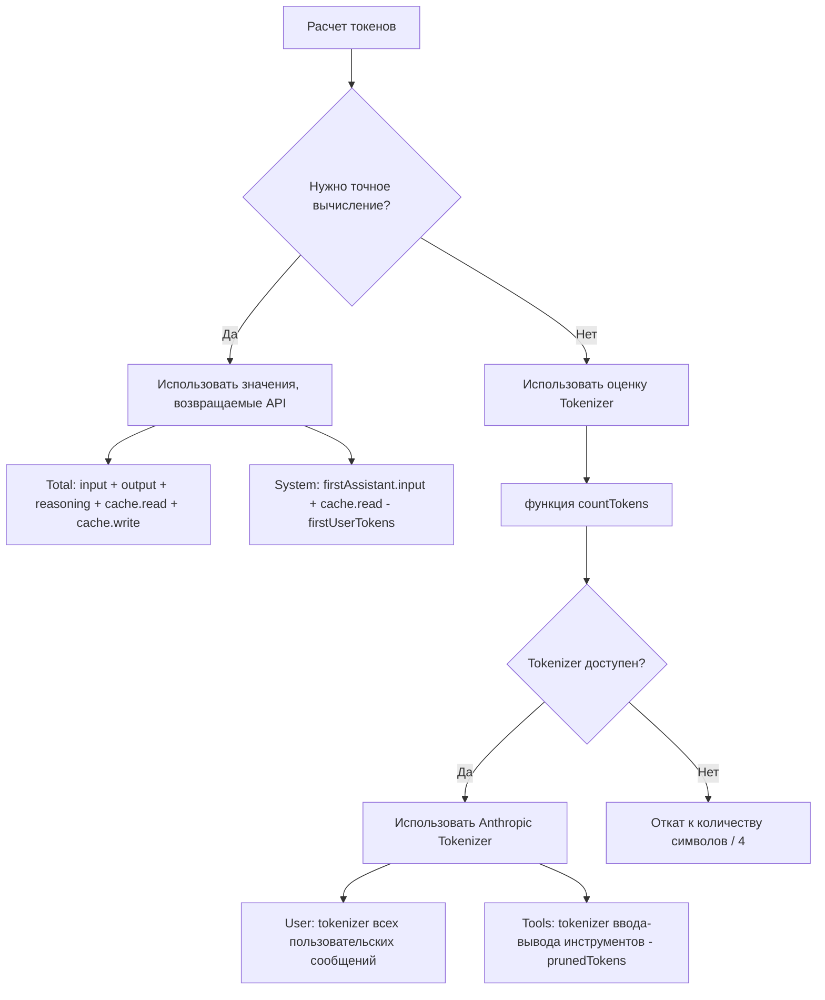

# Принципы расчета токенов

## Что вы сможете сделать после изучения

- Понять стратегию расчета токенов DCP (значения API vs оценочные значения)
- Понимать распределение токенов в выводе `/dcp context`
- Знать диапазон погрешности оценки токенов и методы оптимизации
- Точно оценить эффект экономии токенов DCP

## Ваша текущая проблема

Вы смотрите на вывод `/dcp context`, там куча цифр и процентов, но вы не знаете, как они рассчитываются:

```
Session Context Breakdown:
────────────────────────────────────────────────────────

System         15.2% │████████████████▒▒▒▒▒▒▒▒▒▒▒▒▒▒▒▒▒▒▒▒▒│  25.1K tokens
User            5.1% │████▒▒▒▒▒▒▒▒▒▒▒▒▒▒▒▒▒▒▒▒▒▒▒▒▒▒▒▒▒▒▒▒▒▒▒▒▒▒▒▒▒│   8.4K tokens
Assistant       35.8% │██████████████████████████████████████▒▒▒▒▒▒│  59.2K tokens
Tools (45)      43.9% │████████████████████████████████████████████████│  72.6K tokens
────────────────────────────────────────────────────────

Summary:
  Pruned:          12 tools (~15.2K tokens)
  Current context: ~165.3K tokens
  Without DCP:     ~180.5K tokens
```

Откуда взялись эти цифры? Почему Assistant рассчитывается как "остаточный расчет"? Как вычисляется prunedTokens?

## Когда использовать этот метод

- Когда нужно точно оценить эффект экономии токенов DCP
- Когда нужно проанализировать структуру потребления токенов (какая часть занимает больше всего)
- Когда есть подозрение на погрешность расчета токенов и нужно проверить точность
- Когда нужно доложить команде об результатах оптимизации DCP

## Основная идея

Расчет токенов DCP использует **смешанную стратегию**: **приоритет точным значениям, возвращаемым API, при необходимости использование оценочных значений**.



**Ключевые принципы**:
1. **Приоритет значений API**: Total и System используют точные значения, возвращаемые API
2. **Дополнение оценочными значениями**: User и Tools оцениваются через tokenizer (так как API не предоставляет эти значения)
3. **Остаточный расчет**: Assistant вычисляется через Total - System - User - Tools

---

## Стратегия расчета токенов

### Точные значения, возвращаемые API

OpenCode API возвращает точную статистику токенов для каждого ответа AI:

| Поле                | Описание                                     | Источник                  |
|--- | --- | ---|
| `tokens.input`       | Количество токенов ввода для текущего запроса                   | Точное значение API           |
| `tokens.output`      | Количество токенов вывода, сгенерированных в текущем запросе               | Точное значение API           |
| `tokens.reasoning`   | Количество токенов рассуждения (например, цепочка мыслей Claude 3.5) | Точное значение API (если применимо) |
| `tokens.cache.read`  | Количество токенов, прочитанных из кэша                     | Точное значение API           |
| `tokens.cache.write` | Количество токенов, записанных в кэш                     | Точное значение API           |

**Эти значения точны**, так как они поступают напрямую из системы биллинга поставщика LLM.

### Метод расчета оценочных значений

Для значений, которые не предоставляет API (например, пользовательские сообщения, вызовы инструментов), DCP использует **Anthropic Tokenizer** для оценки.

**Код реализации** (`lib/strategies/utils.ts:36-43`):

```typescript
export function countTokens(text: string): number {
    if (!text) return 0
    try {
        // Приоритет использования Anthropic Tokenizer
        return anthropicCountTokens(text)
    } catch {
        // При неудаче откат к количеству символов / 4
        return Math.round(text.length / 4)
    }
}
```

**Почему количество символов/4 используется как запасной вариант**:
- Среднее соотношение токенов для английского текста составляет примерно 4 символа = 1 токен
- Это лишь грубая оценка, возможны погрешности
- Используется только когда Tokenizer недоступен (например, проблемы с сетью, сбой загрузки библиотеки)

---

## Логика расчета токенов по категориям

### Total (общее количество токенов)

**Формула расчета**:

```typescript
total = input + output + reasoning + cache.read + cache.write
```

**Код реализации** (`lib/commands/context.ts:103-108`):

```typescript
const apiInput = lastAssistant?.tokens?.input || 0
const apiOutput = lastAssistant?.tokens?.output || 0
const apiReasoning = lastAssistant?.tokens?.reasoning || 0
const apiCacheRead = lastAssistant?.tokens?.cache?.read || 0
const apiCacheWrite = lastAssistant?.tokens?.cache?.write || 0
breakdown.total = apiInput + apiOutput + apiReasoning + apiCacheRead + apiCacheWrite
```

**Описание**:
- Использует статистику токенов последнего ответа Assistant
- Включает все значения, возвращаемые API
- Совпадает с общим количеством токенов, отображаемым в OpenCode UI

### System (токены системного промпта)

**Формула расчета**:

```typescript
system = firstAssistant.input + firstAssistant.cache.read - firstUserTokens
```

**Код реализации** (`lib/commands/context.ts:161-165`):

```typescript
if (firstAssistant) {
    const firstInput =
        (firstAssistant.tokens?.input || 0) + (firstAssistant.tokens?.cache?.read || 0)
    breakdown.system = Math.max(0, firstInput - firstUserTokens)
}
```

**Принцип**:
1. **input первого ответа Assistant** содержит: системный промпт + первое пользовательское сообщение
2. **Вычитаем количество токенов первого пользовательского сообщения** (оценивается через tokenizer), получаем чистое количество токенов системного промпта
3. **Добавляем cache.read** (чтение из кэша также считается системными токенами)

::: info Почему остаточный расчет?
API не предоставляет напрямую количество токенов "системного промпта", можно только вычислить его через "ввод первого ответа - первое пользовательское сообщение". Это стандартный метод оценки.
:::

### User (токены пользовательских сообщений)

**Формула расчета**:

```typescript
user = tokenizer(все пользовательские сообщения)
```

**Код реализации** (`lib/commands/context.ts:110-157`):

```typescript
const userTextParts: string[] = []

for (const msg of messages) {
    if (isMessageCompacted(state, msg)) continue
    if (msg.info.role === "user" && isIgnoredUserMessage(msg)) continue

    const parts = Array.isArray(msg.parts) ? msg.parts : []
    for (const part of parts) {
        if (part.type === "text" && msg.info.role === "user") {
            const textPart = part as TextPart
            const text = textPart.text || ""
            userTextParts.push(text)
        }
    }
}

breakdown.user = countTokens(userTextParts.join("\n"))
```

**Описание**:
- Использует tokenizer для подсчета токенов всех пользовательских сообщений
- Пропускает уже сжатые сообщения (`isMessageCompacted`)
- Пропускает ignored сообщения (внутренние системные сообщения)

### Tools (токены вызовов инструментов)

**Формула расчета**:

```typescript
tools = tokenizer(вводыИнструментов + выводыИнструментов) - prunedTokens
```

**Код реализации** (`lib/commands/context.ts:110-167`):

```typescript
const toolInputParts: string[] = []
const toolOutputParts: string[] = []

for (const msg of messages) {
    if (isMessageCompacted(state, msg)) continue

    const parts = Array.isArray(msg.parts) ? msg.parts : []
    for (const part of parts) {
        if (part.type === "tool") {
            const toolPart = part as ToolPart
            breakdown.toolCount++

            // Извлечение ввода инструмента
            if (toolPart.state?.input) {
                const inputStr =
                    typeof toolPart.state.input === "string"
                        ? toolPart.state.input
                        : JSON.stringify(toolPart.state.input)
                toolInputParts.push(inputStr)
            }

            // Извлечение вывода инструмента (только для завершенного состояния)
            if (toolPart.state?.status === "completed" && toolPart.state?.output) {
                const outputStr =
                    typeof toolPart.state.output === "string"
                        ? toolPart.state.output
                        : JSON.stringify(toolPart.state.output)
                toolOutputParts.push(outputStr)
            }
        }
    }
}

const toolInputTokens = countTokens(toolInputParts.join("\n"))
const toolOutputTokens = countTokens(toolOutputParts.join("\n"))
breakdown.tools = Math.max(0, toolInputTokens + toolOutputTokens - breakdown.prunedTokens)
```

**Описание**:
- Вычисляет токены ввода и вывода всех инструментов
- Вычитает токены уже обрезанных инструментов (`prunedTokens`)
- Учитывает только выводы инструментов со статусом `status === "completed"`

### Assistant (токены сообщений помощника)

**Формула расчета**:

```typescript
assistant = total - system - user - tools
```

**Код реализации** (`lib/commands/context.ts:168-171`):

```typescript
breakdown.assistant = Math.max(
    0,
    breakdown.total - breakdown.system - breakdown.user - breakdown.tools,
)
```

**Принцип**:
- Assistant рассчитывается как **остаточный расчет** (Residual Calculation)
- Из Total вычитаются System, User, Tools, остаток - это Assistant

::: info Почему Assistant включает токены рассуждения?
Если модель сохраняет токены рассуждения (reasoning) в контексте, они относятся к "содержимому, сгенерированному Assistant", поэтому классифицируются в категорию Assistant. Это разумно, так как рассуждение - это "мышление" помощника.
:::

---

## Расчет экономии токенов

### Расчет prunedTokens

**Сигнатура функции** (`lib/strategies/utils.ts:49-94`):

```typescript
export const calculateTokensSaved = (
    state: SessionState,
    messages: WithParts[],
    pruneToolIds: string[],
): number
```

**Логика расчета**:

1. Перебор всех сообщений
2. Поиск обрезанных инструментов (через сопоставление `pruneToolIds` с `part.callID`)
3. Извлечение содержимого ввода и вывода инструментов
4. Использование `countTokens` для подсчета токенов
5. Суммирование токенов всех обрезанных инструментов

**Код реализации**:

```typescript
export const calculateTokensSaved = (
    state: SessionState,
    messages: WithParts[],
    pruneToolIds: string[],
): number => {
    try {
        const contents: string[] = []
        for (const msg of messages) {
            if (isMessageCompacted(state, msg)) {
                continue
            }
            const parts = Array.isArray(msg.parts) ? msg.parts : []
            for (const part of parts) {
                if (part.type !== "tool" || !pruneToolIds.includes(part.callID)) {
                    continue
                }
                // Обработка особого случая инструмента question
                if (part.tool === "question") {
                    const questions = part.state.input?.questions
                    if (questions !== undefined) {
                        const content =
                            typeof questions === "string" ? questions : JSON.stringify(questions)
                        contents.push(content)
                    }
                    continue
                }
                // Извлечение вывода завершенных инструментов
                if (part.state.status === "completed") {
                    const content =
                        typeof part.state.output === "string"
                            ? part.state.output
                            : JSON.stringify(part.state.output)
                    contents.push(content)
                } else if (part.state.status === "error") {
                    // Извлечение информации об ошибках инструментов
                    const content =
                        typeof part.state.error === "string"
                            ? part.state.error
                            : JSON.stringify(part.state.error)
                    contents.push(content)
                }
            }
        }
        const tokenCounts: number[] = estimateTokensBatch(contents)
        return tokenCounts.reduce((sum, count) => sum + count, 0)
    } catch (error: any) {
        return 0
    }
}
```

**Описание**:
- Вычисляет только токены обрезанных инструментов
- Для завершенных инструментов вычисляет их вывод
- Для инструментов с ошибками вычисляет информацию об ошибках
- Если вычисление не удалось (исключение), возвращает 0

---

## Диапазон погрешности расчета токенов

### Источники погрешности оценки

| Категория       | Точность | Источник погрешности                                  | Влияние         |
|--- | --- | --- | ---|
| Total      | 100%     | Точное значение API, без погрешности                         | Нет           |
| System     | 95-98%   | Оценка токенов первого пользовательского сообщения имеет небольшую погрешность         | Очень мало         |
| User       | 90-95%   | Tokenizer может отличаться от фактического токенизатора модели           | Среднее         |
| Tools      | 90-95%   | Tokenizer + влияние формата сериализации параметров инструментов         | Среднее         |
| Assistant  | 90-95%   | Передача погрешности от User и Tools                   | Среднее         |

### Контроль погрешности

**DCP использует несколько методов для контроля погрешности**:

1. **Использование Anthropic Tokenizer**:
   - Наиболее близко к фактической логике токенизации Claude
   - Для OpenAI, Gemini возможны небольшие различия

2. **Пропуск внутренних системных сообщений**:
   - `isIgnoredUserMessage` фильтрует внутренние сообщения OpenCode
   - Избегает расчета нерелевантных токенов

3. **Math.max(0, ...)**:
   - Гарантирует, что результат не будет отрицательным
   - Предотвращает аномальные ситуации

::: tip Наблюдение фактической погрешности
В тестах разница между оценкой токенов DCP и отображением в OpenCode UI обычно составляет ±5%. Для оценки эффекта экономии токенов эта точность достаточна.
:::

---

## Интерпретация вывода /dcp context

### График распределения токенов

```
System         15.2% │████████████████▒▒▒▒▒▒▒▒▒▒▒▒▒▒▒▒▒▒▒▒▒│  25.1K tokens
User            5.1% │████▒▒▒▒▒▒▒▒▒▒▒▒▒▒▒▒▒▒▒▒▒▒▒▒▒▒▒▒▒▒▒▒▒▒▒▒▒▒▒▒▒│   8.4K tokens
Assistant       35.8% │██████████████████████████████████████▒▒▒▒▒▒│  59.2K tokens
Tools (45)      43.9% │████████████████████████████████████████████████│  72.6K tokens
```

**Значения элементов**:

| Элемент        | Описание                                   | Нормальный диапазон |
|--- | --- | ---|
| System      | Токены системного промпта                       | 10-20%       |
| User        | Токены всех пользовательских сообщений                     | 3-8%         |
| Assistant   | Текстовый вывод помощника + токены рассуждения           | 30-40%       |
| Tools (n)   | Токены вызовов инструментов (n = количество инструментов в контексте) | 40-50%       |

### Интерпретация Summary

```
Summary:
  Pruned:          12 tools (~15.2K tokens)
  Current context: ~165.3K tokens
  Without DCP:     ~180.5K tokens
```

**Значения элементов**:

| Элемент            | Способ расчета                                          | Описание                               |
|--- | --- | ---|
| Pruned          | `state.prune.toolIds.length` количество инструментов + `prunedTokens` | Количество обрезанных инструментов и сэкономленных токенов   |
| Current context | `breakdown.total` (точное значение API)                  | Фактическое количество токенов текущего контекста             |
| Without DCP     | `total + prunedTokens`                               | Теоретическое количество токенов без DCP     |

**Расчет коэффициента экономии**:

```
Коэффициент экономии = prunedTokens / Without DCP
       = 15.2K / 180.5K
       ≈ 8.4%
```

::: tip Справка по коэффициенту экономии
- Легкое использование: 5-10% (иногда повторное чтение файлов)
- Среднее использование: 10-20% (частая дедупликация, обрезка перезаписи)
- Интенсивное использование: 20-30% (много вызовов инструментов, активная обрезка AI)
:::

---

## Практика: анализ распределения токенов

### Сценарий 1: слишком много вызовов инструментов

**Проблема**: доля `Tools` превышает 60%, контекст очень большой.

```
Tools (120)     65.2% │████████████████████████████████████████████████│  120.5K tokens
```

**Возможные причины**:
- В диалоге было вызвано много инструментов (например, многократное чтение файлов, поиск)
- Вывод инструментов очень большой (например, чтение длинных файлов)

**Рекомендации по оптимизации**:
- Включить **стратегию дедупликации** (`strategies.deduplication.enabled: true`)
- Включить **стратегию перезаписи** (`strategies.supersedeWrites.enabled: true`)
- Использовать `/dcp sweep` для ручной очистки старых инструментов

### Сценарий 2: слишком высокая доля Assistant

**Проблема**: доля `Assistant` превышает 50%, возможно, это токены рассуждения.

```
Assistant       52.3% │██████████████████████████████████████████████▒▒▒▒▒▒│  95.2K tokens
```

**Возможные причины**:
- Используется модель с рассуждением (например, Claude 3.5)
- Помощник вывел много текста

**Рекомендации по оптимизации**:
- Токены рассуждения нельзя обрезать (они относятся к сгенерированному содержимому Assistant)
- Можно сократить вывод помощника (заставить AI быть более кратким)
- Проверить наличие избыточных вызовов инструментов (через обрезку дедупликации)

### Сценарий 3: низкий коэффициент экономии

**Проблема**: `Pruned` очень мал, коэффициент экономии < 5%.

```
Summary:
  Pruned:          2 tools (~1.2K tokens)
  Current context: ~165.3K tokens
  Without DCP:     ~166.5K tokens
```

**Возможные причины**:
- В диалоге редко встречаются повторяющиеся вызовы инструментов
- Не включены автоматические стратегии (дедупликация, перезапись, очистка ошибок)
- AI не вызывает инструменты `discard`/`extract` по собственной инициативе

**Рекомендации по оптимизации**:
- Включить все автоматические стратегии:
  ```jsonc
  {
    "strategies": {
      "deduplication": { "enabled": true },
      "supersedeWrites": { "enabled": true },
      "purgeErrors": { "enabled": true }
    }
  }
  ```
- Включить **функцию напоминания** (`tools.settings.nudgeEnabled: true`), чтобы AI активно обрезал

---

## Предупреждения о типичных ошибках

### ❌ Ошибка 1: ожидание 100% точности

**Проблема**: ожидать, что расчет токенов полностью совпадет со счетом API.

**Реальность**: расчет DCP - это **оценочное значение**, существует погрешность ±5%.

**Решение**:
- Использовать статистику DCP как **относительную ссылку** (например, коэффициент экономии)
- Не использовать для точного аудита биллинга
- Счет API - единственная точная запись потребления

### ❌ Ошибка 2: игнорирование токенов рассуждения

**Проблема**: токены рассуждения классифицируются в Assistant, но пользователь думает, что они пропущены.

**Реальность**: токены рассуждения - часть генерации Assistant, классификация разумна.

**Решение**:
- Токены рассуждения нельзя обрезать (они не относятся к какому-либо инструменту)
- Если доля токенов рассуждения слишком высока (> 30%), можно попробовать:
  - Использовать модель без рассуждения
  - Упростить задачу, сократить потребность в рассуждении

### ❌ Ошибка 3: токены кэша не учитываются в Total

**Проблема**: думать, что `cache.read` не учитывается в `Total`, что приводит к недопониманию.

**Реальность**: `cache.read` учитывается в `Total`, но не создает фактических расходов (так как уже кэширован).

**Решение**:
- `Total` - это **размер контекста**, а не **фактические расходы**
- Токены с попаданием в кэш все равно занимают место в контексте
- Если нужно оптимизировать расходы, можно посмотреть накопленную экономию в `/dcp stats`

### ❌ Ошибка 4: после обрезки ввода инструмента токены не уменьшаются

**Проблема**: DCP обрезал ввод инструмента, но `Current context` в `/dcp context` не изменился.

**Реальность**: `Current context` показывает **токены, отправленные в LLM**, обрезанное содержимое не включается.

**Решение**:
- `Current context` = `Without DCP` - `prunedTokens`
- Если `prunedTokens` увеличивается, значит обрезка работает
- Если `Current context` не уменьшается, возможно, `prunedTokens` слишком мал, или новые сообщения добавили токены

---

## Итоги урока

Расчет токенов DCP использует смешанную стратегию:

1. **Точные значения API**: Total, System используют точные значения, возвращаемые API
2. **Оценка Tokenizer**: User, Tools оцениваются через Anthropic Tokenizer
3. **Остаточный расчет**: Assistant вычисляется через Total - System - User - Tools

**Ключевые функции**:
- `countTokens()`: вычисляет количество токенов текста (приоритет использования Anthropic Tokenizer)
- `calculateTokensSaved()`: вычисляет количество сэкономленных токенов обрезанных инструментов
- `analyzeTokens()`: анализирует распределение токенов контекста

**Диапазон погрешности**:
- Total: 100% точно (значения API)
- Другие категории: 90-98% (оценочные значения)
- Общая погрешность: ±5%

**Сценарии использования**:
- Использовать `/dcp context` для просмотра распределения токенов
- Оптимизировать конфигурацию стратегий на основе распределения
- Использовать `/dcp stats` для просмотра накопленного эффекта экономии

---

## О следующем уроке

> В следующем уроке мы изучим **[Справочник API](../api-reference/)**.
>
> Вы узнаете:
> - Документацию API плагина DCP
> - Полное описание параметров конфигурации
> - Интерфейсы управления состоянием
> - Точки расширения для разработчиков плагинов

---

## Приложение: ссылки на исходный код

<details>
<summary><strong>Нажмите, чтобы раскрыть расположение исходного кода</strong></summary>

> Время обновления: 2026-01-23

| Функция              | Путь к файлу                                                                                                        | Номер строки     |
|--- | --- | ---|
| функция countTokens   | [`lib/strategies/utils.ts`](https://github.com/Opencode-DCP/opencode-dynamic-context-pruning/blob/main/lib/strategies/utils.ts#L36-L43)       | 36-43    |
| calculateTokensSaved | [`lib/strategies/utils.ts`](https://github.com/Opencode-DCP/opencode-dynamic-context-pruning/blob/main/lib/strategies/utils.ts#L49-L94) | 49-94    |
| функция analyzeTokens | [`lib/commands/context.ts`](https://github.com/Opencode-DCP/opencode-dynamic-context-pruning/blob/main/lib/commands/context.ts#L68-L174)   | 68-174   |
| комментарии к стратегии расчета токенов | [`lib/commands/context.ts`](https://github.com/Opencode-DCP/opencode-dynamic-context-pruning/blob/main/lib/commands/context.ts#L5-L38)    | 5-38     |
| handleContextCommand | [`lib/commands/context.ts`](https://github.com/Opencode-DCP/opencode-dynamic-context-pruning/blob/main/lib/commands/context.ts#L238-L247) | 238-247  |

**Ключевые функции**:
- `countTokens(text: string): number`: вычисляет количество токенов текста, использует Anthropic Tokenizer или откат к количеству символов/4
- `calculateTokensSaved(state, messages, pruneToolIds): number`: вычисляет количество сэкономленных токенов обрезанных инструментов
- `analyzeTokens(state, messages): TokenBreakdown`: анализирует распределение токенов контекста

**Ключевые интерфейсы**:
- `TokenBreakdown`: результат анализа распределения токенов
  ```typescript
  interface TokenBreakdown {
      system: number
      user: number
      assistant: number
      tools: number
      toolCount: number
      prunedTokens: number
      prunedCount: number
      total: number
  }
  ```

</details>
