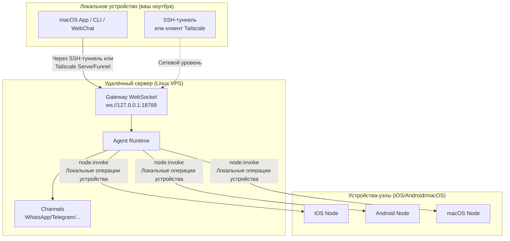

# Удалённый Gateway: доступ к Clawdbot через Tailscale и SSH-туннели | Учебник Clawdbot

## Что вы сможете сделать

**Удалённый Gateway** позволяет вам освободиться от ограничений устройства и развернуть ИИ-помощник на сервере Linux с режимом Always-on. После завершения этого урока вы сможете:

- ✅ Запускать Clawdbot Gateway на сервере Linux или VPS
- ✅ Безопасно открывать Gateway для сети через Tailscale Serve/Funnel
- ✅ Подключаться к удалённому Gateway с клиента через SSH-туннели
- ✅ Понимать архитектурные различия между Gateway и Node (где выполняется exec, где выполняются операции устройства)
- ✅ Настраивать безопасные политики удалённого доступа

## Ваша текущая дилемма

Возможно, у вас есть следующие вопросы:

- 🤔 "Мой ноутбук часто переходит в спящий режим, но я хочу, чтобы ИИ-помощник был всегда онлайн"
- 🤔 "Я хочу запустить Gateway на недорогом VPS, но не знаю, как безопасно получить доступ"
- 🤔 "В чём разница между Tailscale Serve и Funnel? Какой из них использовать?"
- 🤔 "SSH-туннели слишком сложны, есть ли более автоматизированное решение?"

## Когда использовать этот подход

**Удалённый Gateway** подходит для следующих сценариев:

| Сценарий | Рекомендуемое решение | Причина |
| -------- | --------------------- | ------ |
| Ноутбук часто спит, нужен ИИ-помощник всегда онлайн | **Tailscale Serve + Linux VPS** | VPS не спит, безопасный доступ через tailnet |
| Gateway работает на домашнем десктопе, удалённое управление с ноутбука | **SSH-туннель** или **Tailscale Serve** | Единая сессия и конфигурация Gateway |
| Нужно получить доступ из интернета (временное тестирование) | **Tailscale Funnel + пароль** | Быстрое открытие, но требуется защита паролем |
| Несколько устройств делят один ИИ-помощник | **Always-on Gateway** | Централизованное управление всеми сессиями, конфигурациями и историей |

::: warning Не рекомендуется
Если у вас только одно устройство и вы часто носите его с собой, **не нужен** удалённый Gateway. Просто запустите Gateway локально.
:::

## 🎒 Подготовка перед началом

Перед началом убедитесь:

- [ ] Выполнен курс **[Запуск Gateway](/ru/clawdbot/clawdbot/start/gateway-startup/)**
- [ ] Базовое понимание SSH-команд (опционально, если используете SSH-туннели)
- [ ] (Если используете Tailscale) Установлен Tailscale CLI и выполнен вход
- [ ] Подготовлен удалённый сервер Linux или VPS (рекомендуется Ubuntu/Debian)

---

## Основные идеи

### Архитектура удалённого Gateway

Основная идея удалённого Gateway: **Gateway — это центр управления, клиент — это терминал**.



### Три ключевые концепции

| Концепция | Описание | Пример |
| --------- | -------- | ------ |
| **Хост Gateway** | Машина, работающая с сервисом Gateway, обладающая сессиями, аутентификацией, каналами и состоянием | Linux VPS, домашний десктоп |
| **Клиент** | Инструмент, подключающийся к Gateway (macOS App, CLI, WebChat) | Ваш ноутбук, телефон |
| **Устройство-узел** | Внешнее устройство, подключённое через Gateway WebSocket, выполняющее локальные операции устройства | Устройство iOS, устройство Android, режим Node macOS |

### Где выполняются команды?

Это самый распространённый источник путаницы:

| Тип операции | Где выполняется | Причина |
| ------------ | --------------- | ------- |
| Инструмент `exec` | **Хост Gateway** | Команды Shell выполняются на машине Gateway |
| Инструмент `browser` | **Хост Gateway** (или отдельный сервер управления браузером) | Браузер запускается на машине Gateway |
| Операции узла (`camera.snap`, `system.run`) | **Устройство-узел** | Требуется доступ к локальным ресурсам устройства |

**Запомнить одной фразой**:
- Хост Gateway → выполнение общих команд и запуск ИИ
- Устройство-узел → выполнение локальных операций, специфичных для устройства

---

## Следуйте инструкциям

### Шаг 1: Установка Clawdbot на удалённый сервер

**Зачем**
Сервер Linux больше подходит для запуска службы Gateway с длительным режимом онлайн.

Выполните на удалённом сервере:

```bash
# 1. Установка Node.js (≥22)
curl -fsSL https://deb.nodesource.com/setup_22.x | sudo -E bash -
sudo apt-get install -y nodejs

# 2. Установка Clawdbot
npm install -g @clawdbot/cli

# 3. Проверка установки
clawdbot --version
```

**Вы должны увидеть**:
```
clawdbot CLI v<version>
```

### Шаг 2: Запуск мастера onboarding

**Зачем**
Быстрая настройка базовых параметров через интерактивный мастер.

```bash
clawdbot onboard
```

Выполните в мастере:
- Выбор канала (например, Telegram)
- Настройка модели ИИ (например, OpenAI, Anthropic)
- Настройка аутентификации Gateway (Token или Password)

::: tip Рекомендация
Настройте `gateway.auth.mode: "password"`, чтобы удобно использовать аутентификацию по паролю при удалённом подключении:
```bash
export CLAWDBOT_GATEWAY_PASSWORD="your-secure-password"
```
:::

**Вы должны увидеть**:
```
✅ Gateway configured successfully
✅ Channels configured: telegram
✅ AI model configured: openai:gpt-4o-mini
```

### Шаг 3: Запуск демона Gateway

**Зачем**
Gateway должен непрерывно работать в фоновом режиме.

```bash
# Запуск Gateway (по умолчанию привязывается к loopback: 127.0.0.1:18789)
clawdbot gateway start
```

**Вы должны увидеть**:
```
🚀 Gateway starting...
📡 WebSocket: ws://127.0.0.1:18789
🔒 Auth mode: password
```

::: tip Использование systemd для автозапуска (Linux)
Создайте файл службы `/etc/systemd/system/clawdbot.service`:

```ini
[Unit]
Description=Clawdbot Gateway
After=network.target

[Service]
Type=simple
User=your-user
ExecStart=/usr/bin/clawdbot gateway start
Restart=on-failure
RestartSec=5s
Environment="CLAWDBOT_GATEWAY_PASSWORD=your-secure-password"

[Install]
WantedBy=multi-user.target
```

Запуск службы:
```bash
sudo systemctl enable clawdbot
sudo systemctl start clawdbot
sudo systemctl status clawdbot
```
:::

---

### Вариант A: Использование Tailscale Serve (рекомендуется)

#### Шаг 4: Установка и вход в Tailscale

**Зачем**
Tailscale Serve обеспечивает безопасный доступ по HTTPS без публичного IP.

```bash
# Установка Tailscale CLI
curl -fsSL https://tailscale.com/install.sh | sh

# Вход в Tailscale
sudo tailscale up
```

**Вы должны увидеть**:
```
To authenticate, visit:

    https://login.tailscale.com/a/xxxxx

----------------------------------------------------
Copy the URL and open it in your browser.
```

#### Шаг 5: Настройка Tailscale Serve

**Зачем**
Открытие Gateway для tailnet через Tailscale Serve, сохраняя Gateway в режиме loopback-only (наиболее безопасно).

Измените файл конфигурации `~/.clawdbot/clawdbot.json`:

```json5
{
  "gateway": {
    "bind": "loopback",
    "tailscale": {
      "mode": "serve",
      "resetOnExit": true
    },
    "auth": {
      "mode": "password"
    }
  }
}
```

**Описание конфигурации**:
- `bind: "loopback"`: Gateway слушает только локальный loopback (наиболее безопасно)
- `tailscale.mode: "serve"`: открытие в tailnet через Tailscale Serve
- `resetOnExit: true`: отмена конфигурации Serve при выходе

#### Шаг 6: Перезапуск Gateway

**Зачем**
Применение новой конфигурации Tailscale.

```bash
# Если используется systemd
sudo systemctl restart clawdbot

# Или перезапуск напрямую (если работает на переднем плане)
clawdbot gateway restart
```

**Вы должны увидеть**:
```
🚀 Gateway starting...
📡 WebSocket: ws://127.0.0.1:18789
🌐 Tailscale Serve: https://your-tailnet-name.tailnet-name.ts.net/
🔒 Auth mode: password
```

#### Шаг 7: Подключение с клиента

**Зачем**
Проверка доступности удалённого Gateway.

На машине клиента:

1. **Убедитесь, что вы подключены к тому же tailnet Tailscale**
2. **Доступ к Control UI**:
   ```
   https://<magicdns>/  # или https://<tailnet-ip>:18789/
   ```
3. **Подключение WebSocket**:
   ```bash
   # Проверка подключения
   clawdbot health --url ws://<tailnet-ip>:18789 --password your-secure-password
   ```

**Вы должны увидеть**:
```
✅ Gateway is healthy
✅ Authenticated successfully
✅ Channels: telegram (connected)
```

---

### Вариант B: Использование SSH-туннеля (универсальный запасной вариант)

#### Шаг 4: Настройка аутентификации SSH-ключом

**Зачем**
Аутентификация по ключу SSH безопаснее, чем по паролю, и может быть автоматизирована.

Сгенерируйте пару ключей на машине клиента:

```bash
# Генерация пары ключей (если ещё нет)
ssh-keygen -t rsa -b 4096 -f ~/.ssh/clawdbot_gateway
```

**Вы должны увидеть**:
```
Generating public/private rsa key pair.
Enter passphrase (empty for no passphrase): [нажмите Enter]
Enter same passphrase again: [нажмите Enter]
Your identification has been saved in ~/.ssh/clawdbot_gateway
Your public key has been saved in ~/.ssh/clawdbot_gateway.pub
```

#### Шаг 5: Копирование публичного ключа на удалённый сервер

**Зачем**
Позволить удалённому серверу доверять ключу вашего клиента.

```bash
# Копирование публичного ключа на удалённый сервер
ssh-copy-id -i ~/.ssh/clawdbot_gateway.pub your-user@remote-server-ip
```

**Вы должны увидеть**:
```
Number of key(s) added: 1
Now try logging into the machine with:   "ssh 'your-user@remote-server-ip'"
```

#### Шаг 6: Создание конфигурации SSH

**Зачем**
Упрощение команд SSH для удобства использования.

Отредактируйте `~/.ssh/config` на машине клиента:

```txt
Host clawdbot-remote
    HostName <remote-server-ip>
    User your-user
    IdentityFile ~/.ssh/clawdbot_gateway
    LocalForward 18789 127.0.0.1:18789
    ServerAliveInterval 60
    ServerAliveCountMax 3
```

**Описание конфигурации**:
- `LocalForward 18789 127.0.0.1:18789`: проброс локального порта 18789 на удалённый 18789
- `ServerAliveInterval 60`: отправка сердцебиения каждые 60 секунд для поддержания активности соединения

#### Шаг 7: Создание SSH-туннеля

**Зачем**
Создание безопасного канала от локального к удалённому Gateway.

```bash
# Запуск SSH-туннеля (в фоновом режиме)
ssh -N -f clawdbot-remote
```

**Вы должны увидеть**:
(нет вывода, команда работает в фоновом режиме)

#### Шаг 8: Проверка подключения

**Зачем**
Подтверждение нормальной работы SSH-туннеля и Gateway.

```bash
# Проверка успешности проброса локального порта
lsof -i :18789

# Тест подключения к Gateway
clawdbot health --url ws://127.0.0.1:18789 --password your-secure-password
```

**Вы должны увидеть**:
```
COMMAND   PID   USER   FD   TYPE DEVICE SIZE/OFF NODE NAME
ssh      12345  user   4u  IPv4  0x1234      0t0  TCP *:18789 (LISTEN)

✅ Gateway is healthy
✅ Authenticated successfully
```

#### Шаг 9: Автозапуск SSH-туннеля (macOS)

**Зачем**
Автоматический запуск при включении, без ручного вмешательства.

Создайте `~/Library/LaunchAgents/com.clawdbot.ssh-tunnel.plist`:

```xml
<?xml version="1.0" encoding="UTF-8"?>
<!DOCTYPE plist PUBLIC "-//Apple//DTD PLIST 1.0//EN" "http://www.apple.com/DTDs/PropertyList-1.0.dtd">
<plist version="1.0">
<dict>
    <key>Label</key>
    <string>com.clawdbot.ssh-tunnel</string>
    <key>ProgramArguments</key>
    <array>
        <string>/usr/bin/ssh</string>
        <string>-N</string>
        <string>-f</string>
        <string>clawdbot-remote</string>
    </array>
    <key>KeepAlive</key>
    <true/>
    <key>RunAtLoad</key>
    <true/>
</dict>
</plist>
```

Загрузка Launch Agent:

```bash
launchctl bootstrap gui/$UID ~/Library/LaunchAgents/com.clawdbot.ssh-tunnel.plist
```

**Вы должны увидеть**:
(нет вывода, туннель автоматически работает в фоновом режиме)

::: tip Автозапуск в Linux (сервис пользователя systemd)
Создайте `~/.config/systemd/user/clawdbot-ssh-tunnel.service`:

```ini
[Unit]
Description=Clawdbot SSH Tunnel
After=network.target

[Service]
Type=simple
ExecStart=/usr/bin/ssh -N clawdbot-remote
Restart=on-failure
RestartSec=5s

[Install]
WantedBy=default.target
```

Запуск службы:
```bash
systemctl --user enable clawdbot-ssh-tunnel
systemctl --user start clawdbot-ssh-tunnel
```
:::

---

### Вариант C: Использование Tailscale Funnel (публичный доступ, требуется пароль)

::: danger Предупреждение безопасности
Tailscale Funnel открывает Gateway в интернет!
- **Обязательно** использовать аутентификацию по паролю (`gateway.auth.mode: "password"`)
- **Только для** временного тестирования, не подходит для производственной среды
:::

#### Шаг 4: Настройка Funnel

**Зачем**
Предоставление публичного доступа по HTTPS через Tailscale Funnel.

Измените файл конфигурации `~/.clawdbot/clawdbot.json`:

```json5
{
  "gateway": {
    "bind": "loopback",
    "tailscale": {
      "mode": "funnel",
      "resetOnExit": true
    },
    "auth": {
      "mode": "password",
      "password": "${CLAWDBOT_GATEWAY_PASSWORD}"
    }
  }
}
```

**Важно**:
- `tailscale.mode: "funnel"`: использование Tailscale Funnel (публичный доступ)
- `auth.mode: "password"`: Funnel требует пароль (иначе отказ в запуске)

#### Шаг 5: Перезапуск Gateway

```bash
sudo systemctl restart clawdbot
```

**Вы должны увидеть**:
```
🚀 Gateway starting...
🌐 Tailscale Funnel: https://your-funnel-url.ts.net/
🔒 Auth mode: password
```

#### Шаг 6: Подключение из интернета

```bash
clawdbot health --url wss://your-funnel-url.ts.net --password your-secure-password
```

---

## Контрольная точка ✅

После завершения любого из вариантов проверьте следующее:

| Проверка | Команда | Ожидаемый результат |
| -------- | ------- | ------------------- |
| Gateway работает | `clawdbot gateway status` | ✅ Running |
| WebSocket доступен | `clawdbot health --url <url>` | ✅ Healthy |
| Channels подключены | `clawdbot channels status` | ✅ connected |
| Узлы доступны для сопряжения | `clawdbot nodes list` | Отображается список узлов |

---

## Ошибки и ловушки

### Ловушка 1: Gateway привязан к не loopback

**Проблема**:
```json5
{
  "gateway": {
    "bind": "lan"  // ❌ Опасно!
  }
}
```

**Последствия**:
- Gateway слушает на публичном IP локальной сети, любой может подключиться
- Если не настроена аутентификация, **серьёзный риск безопасности**

**Правильный способ**:
```json5
{
  "gateway": {
    "bind": "loopback",  // ✅ Наиболее безопасно
    "tailscale": {
      "mode": "serve"  // ✅ Открытие через Tailscale Serve
    }
  }
}
```

### Ловушка 2: Tailscale Funnel без пароля

**Проблема**:
```json5
{
  "gateway": {
    "auth": {
      "mode": "token"  // ❌ Funnel не допускает!
    },
    "tailscale": {
      "mode": "funnel"
    }
  }
}
```

**Последствия**:
- Gateway отказывается запуском (Funnel требует пароль)

**Правильный способ**:
```json5
{
  "gateway": {
    "auth": {
      "mode": "password",  // ✅ Funnel требует пароль
      "password": "${CLAWDBOT_GATEWAY_PASSWORD}"
    },
    "tailscale": {
      "mode": "funnel"
    }
  }
}
```

### Ловушка 3: Конфликт портов SSH-туннеля

**Проблема**:
```
channel_setup_fwd: listen 127.0.0.1:18789: cannot listen to port: Address already in use
```

**Причина**: локальный порт 18789 уже занят

**Решение**:
```bash
# Найти процесс, занимающий порт
lsof -i :18789

# Завершить конфликтующий процесс
kill -9 <PID>

# Или использовать другой порт для проброса (измените URL клиента одновременно)
ssh -N -L 18790:127.0.0.1:18789 clawdbot-remote
```

### Ловушка 4: macOS App Remote over SSH не работает

**Проблема**: macOS App отображает "Unable to connect to Gateway"

**Проверка**:
1. Работает ли SSH-туннель:
   ```bash
   ps aux | grep "ssh -N clawdbot-remote" | grep -v grep
   ```
2. Настроен ли Gateway Token:
   ```bash
   launchctl getenv CLAWDBOT_GATEWAY_TOKEN
   ```
3. Правильны ли настройки App:
   - Settings → General → "Clawdbot runs" → "On a remote machine over SSH"

**Решение**:
- Перезапустите SSH-туннель
- Выйдите и перезапустите macOS App

---

## Итоги урока

### Ключевые моменты

- ✅ **Удалённый Gateway** позволяет ИИ-помощнику быть всегда онлайн, клиент может подключаться в любое время
- ✅ **Tailscale Serve** — наиболее безопасное решение (только tailnet + HTTPS + loopback)
- ✅ **SSH-туннель** — универсальный запасной вариант (без Tailscale)
- ✅ **Tailscale Funnel** подходит для временного публичного доступа (обязательно с паролем)
- ✅ **Хост Gateway** выполняет `exec` и общие команды, **устройство-узел** выполняет локальные операции устройства

### Сравнение конфигураций

| Вариант | Безопасность | Область доступа | Сложность конфигурации | Рекомендуемый сценарий |
| ------- | ------------ | ---------------- | --------------------- | --------------------- |
| Tailscale Serve | ⭐⭐⭐⭐⭐ | Tailnet | Средняя | **Рекомендуется**: Always-on Gateway |
| SSH-туннель | ⭐⭐⭐⭐ | Доступен через SSH-соединение | Низкая | Универсальный запасной вариант, удалённое управление домашним десктопом |
| Tailscale Funnel | ⭐⭐ | Интернет | Низкая | Временное тестирование, демо |

### Контрольный список безопасности

- [ ] Gateway привязан к `loopback`
- [ ] Tailscale Funnel использует аутентификацию по паролю
- [ ] SSH-ключ настроен (если используется SSH-туннель)
- [ ] Пароль установлен через переменную среды (не записан в файл конфигурации)
- [ ] Регулярно выполняется `clawdbot security audit`

---

## Следующий урок

> Следующий урок: **[Платформа навыков и ClawdHub](../skills-platform/)**.
>
> Вы узнаете:
> - Концепция системы навыков (Bundled/Managed/Workspace)
> - Как устанавливать сторонние навыки из ClawdHub
> - Как создавать и управлять пользовательскими навыками
> - Механизм разрешений и изоляции навыков

---

## Приложение: справочник исходного кода

<details>
<summary><strong>Нажмите, чтобы раскрыть расположение исходного кода</strong></summary>

> Время обновления: 2026-01-27

| Функция | Путь к файлу | Номер строки |
| ------- | ------------ | ------------ |
| Schema конфигурации удалённого Gateway | [`src/config/types.gateway.ts`](https://github.com/clawdbot/clawdbot/blob/main/src/config/types.gateway.ts) | 200-220 |
| Schema конфигурации Tailscale Gateway | [`src/config/types.gateway.ts`](https://github.com/clawdbot/clawdbot/blob/main/src/config/types.gateway.ts) | 150-180 |
| Интеграция Tailscale | [`src/infra/tailscale.ts`](https://github.com/clawdbot/clawdbot/blob/main/src/infra/tailscale.ts) | 1-100 |
| Документация удалённого Gateway | [`docs/gateway/remote.md`](https://github.com/clawdbot/clawdbot/blob/main/docs/gateway/remote.md) | 1-123 |
| Документация Tailscale | [`docs/gateway/tailscale.md`](https://github.com/clawdbot/clawdbot/blob/main/docs/gateway/tailscale.md) | 1-147 |
| Документация удалённого доступа macOS App | [`docs/gateway/remote-gateway-readme.md`](https://github.com/clawdbot/clawdbot/blob/main/docs/gateway/remote-gateway-readme.md) | 1-154 |
| Документация безопасности | [`docs/gateway/security.md`](https://github.com/clawdbot/clawdbot/blob/main/docs/gateway/security.md) | 1-100 |

**Ключевые поля конфигурации**:

- `gateway.bind`: адрес привязки Gateway (`loopback`/`lan`/`tailnet`/`auto`)
- `gateway.tailscale.mode`: режим Tailscale (`off`/`serve`/`funnel`)
- `gateway.auth.mode`: режим аутентификации (`token`/`password`)
- `gateway.auth.allowTailscale`: разрешить ли заголовки идентификации Tailscale (`true`/`false`)
- `gateway.remote.url`: URL удалённого Gateway (по умолчанию для CLI)
- `gateway.remote.token`: токен удалённого Gateway (аутентификация CLI)
- `gateway.tailscale.resetOnExit`: отмена конфигурации Serve/Funnel при выходе (`true`/`false`)

**Ключевые бизнес-правила**:

- Gateway по умолчанию привязан к loopback (`127.0.0.1`)【факт】
- Tailscale Serve предоставляет доступ по HTTPS только внутри tailnet【факт】
- Tailscale Funnel требует обязательную аутентификацию по паролю (`gateway.auth.mode: "password"`)【факт】
- `gateway.remote.token` используется только для удалённых вызовов CLI, не включает локальную аутентификацию【факт】
- `gateway.bind: "tailnet"` напрямую привязывается к IP Tailnet (без необходимости Serve/Funnel)【факт】

**Правила безопасности**:

- Loopback + SSH/Tailscale Serve — наиболее безопасная конфигурация по умолчанию【факт】
- Небиндинговые конфигурации (`lan`/`tailnet`/`custom`) должны использовать токен аутентификации или пароль【факт】
- Tailscale Serve может аутентифицироваться через заголовки идентификации (`gateway.auth.allowTailscale: true`)【факт】
- Funnel не внедряет заголовки идентификации Tailscale【факт】

</details>
