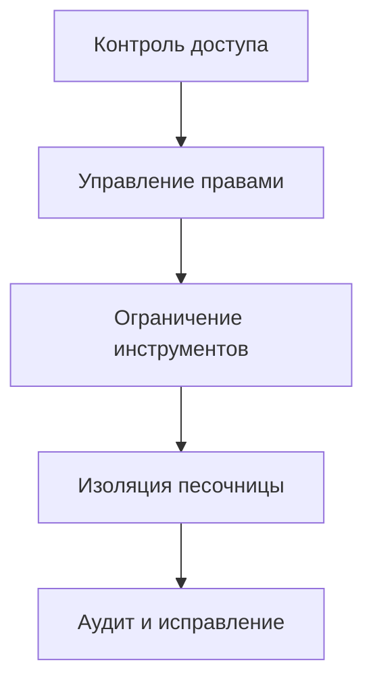

# Безопасность и изоляция песочницы: защита вашего ИИ-помощника

## Что вы сможете сделать

- Настраивать многоуровневые стратегии безопасности, от контроля доступа до управления правами инструментов
- Использовать изоляцию песочницы для ограничения доступа ИИ-помощника к файловой системе и сети
- Запускать аудит безопасности для выявления и устранения распространённых уязвимостей
- Настраивать уровень безопасности для разных сценариев (личное/семейное/публичное использование)

## Ваша текущая проблема

Clawdbot делает вашего ИИ-помощника мощным, но также создаёт новые проблемы безопасности:

- **Shell-доступ**: ИИ может выполнять произвольные команды, читать и записывать файлы
- **Сетевой доступ**: ИИ может обращаться к любым URL и сервисам
- **Отправка сообщений**: ИИ может отправлять сообщения любому пользователю (если настроен WhatsApp)
- **Удалённое управление**: управление локальным браузером через инструменты браузера
- **Раскрытие данных**: вся история диалогов хранится на диске

Без надлежащей защиты скомпрометированная ИИ-модель может привести к катастрофическим последствиям.

## Когда использовать этот подход

- ✅ Вам нужно запускать ИИ-помощника на собственном устройстве и вы беспокоитесь о безопасности
- ✅ Вы хотите предоставить ИИ-помощника для использования нескольким людям (семья, команда)
- ✅ Вам нужно ограничить доступ ИИ к определённым файлам или каталогам
- ✅ Вы хотите изолировать области доступа разных пользователей/сессий
- ✅ Вам нужно запустить ИИ-помощника в ограниченной среде (песочница)

::: info
**Важная концепция**: безопасность многоуровневая — от «кто имеет доступ» к «что можно делать», и только потом «безопасность модели»».
:::

## 🎒 Подготовка перед началом

### Предварительная проверка

- [x] Выполнено [Быстрое начало](../../start/getting-started/), вы понимаете, как запустить Gateway
- [ ] Настроен хотя бы один ИИ-модель (Anthropic, OpenAI или Ollama)
- [ ] Вы понимаете свой сценарий использования (личное, семейное, публичное)
- [ ] Вы знакомы с концепцией прав доступа к файлам Linux (chmod)

### Рекомендуемые инструменты

- Инструменты командной строки: Terminal или SSH
- Редактор: ваш любимый редактор кода
- Docker: для запуска контейнеров песочницы (опционально)

---

## Основная концепция

Модель безопасности Clawdbot основана на ключевой философии: **контроль доступа в первую очередь, ограничение безопасности после**.

### Уровни безопасности



1. **Контроль доступа**: определение, кто может общаться с вашим ИИ-помощником
2. **Управление правами**: определение, какие инструменты может вызывать ИИ-помощник
3. **Изоляция песочницы**: определение среды, в которой выполняются инструменты (хост или контейнер)
4. **Аудит и исправление**: постоянная проверка и исправление конфигурации безопасности

Эта многоуровневая структура гарантирует, что даже при компрометации модели область атаки будет ограничена определёнными границами.

### Три уровня контроля доступа

Clawdbot предоставляет три уровня контроля доступа:

| Уровень | Защищаемый контент | Место настройки |
| ----- | ----- | ----- |
| **Аутентификация Gateway** | WebSocket-соединения | `gateway.auth` |
| **DM-политика** | Личные сообщения | `channels.*.dmPolicy` |
| **Group-политика** | Групповые сообщения | `channels.*.groupPolicy` / `channels.*.groups` |

Каждый уровень может быть настроен независимо, создавая защиту в глубину.

---

## Аудит безопасности: выявление рисков

Clawdbot предоставляет встроенный инструмент аудита безопасности для быстрого выявления распространённых уязвимостей.

### Запуск аудита

```bash
# Базовый аудит
clawdbot security audit

# Глубокий аудит (включая обнаружение Gateway)
clawdbot security audit --deep

# Автоматическое исправление рекомендаций по безопасности
clawdbot security audit --fix
```

### Проверки аудита

Инструмент аудита проверяет следующие аспекты:

| Категория проверки | Конкретные элементы | Уровень риска |
| --------- | ----- | ----- |
| **Входящий доступ** | Аутентификация Gateway, DM-политика, Group-политика | Critical / Warn |
| **Доступ к инструментам** | Список разрешений elevated exec, allow/deny инструментов | Critical / Warn |
| **Сетевое раскрытие** | Режим привязки Gateway, Tailscale Serve/Funnel | Critical / Info |
| **Управление браузером** | Аутентификация удалённого браузера, протокол URL | Critical / Warn |
| **Права доступа к файлам** | Права доступа к файлам конфигурации, каталогам состояния | Critical / Warn |
| **Доверие к плагинам** | Плагины без явного разрешения | Warn |

### Понимание вывода аудита

Отчёт аудита классифицируется по уровням серьёзности:

- **Critical (красный)**: требуется немедленное исправление, может привести к удалённому выполнению кода или утечке данных
- **Warn (жёлтый)**: рекомендуется исправить, снижает границу безопасности
- **Info (синий)**: информационное уведомление, не проблема безопасности

### Автоматическое исправление

При использовании флага `--fix` инструмент аудита безопасно применяет следующие исправления:

- Изменение `groupPolicy="open"` на `allowlist`
- Изменение `logging.redactSensitive="off"` на `"tools"`
- Исправление прав доступа к файлам (600 для конфигурационных файлов, 700 для каталогов)

::: tip
**Лучшая практика**: регулярно запускайте аудит, особенно после изменения конфигурации или обновления Gateway.
:::

---

## Контроль доступа: кто может получить доступ к вашему ИИ-помощнику

Контроль доступа — это первая линия защиты, определяющая, кто может взаимодействовать с вашим ИИ-помощником.

### Аутентификация Gateway

По умолчанию Gateway требует аутентификации для принятия WebSocket-соединений.

#### Настройка режима аутентификации

```json5
{
  "gateway": {
    "auth": {
      "mode": "token",  // или "password"
      "token": "your-long-random-token-please-change-me"
    }
  }
}
```

**Режимы аутентификации**:

| Режим | Назначение | Рекомендуемый сценарий |
| ----- | ----- | ----- |
| `token` | Общий bearer-token | Большинство случаев, рекомендуется |
| `password` | Парольная аутентификация | Локальная разработка, удобно для быстрого тестирования |
| Tailscale Identity | Tailscale Serve | Удалённый доступ через Tailscale |

::: warning
**Важно**: если `gateway.bind` настроен не на loopback (например, `lan`, `tailnet`), необходимо настроить аутентификацию, иначе соединения будут отклонены.
:::

### DM-политика: защита личных сообщений

DM-политика контролирует, могут ли неизвестные пользователи напрямую общаться с вашим ИИ-помощником.

| Политика | Поведение | Рекомендуемый сценарий |
| ----- | ----- | ----- |
| `pairing` (по умолчанию) | Неизвестным отправителям предоставляется код пары, сообщения не обрабатываются до пары | Личное использование, рекомендуется |
| `allowlist` | Неизвестные отправители отклоняются | Многопользовательская доверенная среда |
| `open` | Разрешить всем | Публичный сервис (требуется `allowFrom` с `"*"`) |
| `disabled` | Игнорировать все личные сообщения | Использовать только групповые функции |

#### Пример настройки

```json5
{
  "channels": {
    "whatsapp": {
      "dmPolicy": "pairing"
    },
    "telegram": {
      "dmPolicy": "allowlist",
      "allowFrom": ["user123", "user456"]
    }
  }
}
```

#### Управление парами

```bash
# Просмотреть ожидающие запросы на создание пары
clawdbot pairing list whatsapp

# Одобрить пару
clawdbot pairing approve whatsapp <код_пары>
```

::: tip
**Лучшая практика**: режим `pairing` по умолчанию обеспечивает хороший баланс между пользовательским опытом и безопасностью. Используйте `allowlist` или `open` только тогда, когда вы явно доверяете всем пользователям.
:::

### Group-политика: управление групповыми сообщениями

Group-политика определяет, как ИИ-помощник отвечает на сообщения в группах.

| Политика | Поведение | Место настройки |
| ----- | ----- | ----- |
| `allowlist` | Принимать только группы из белого списка | `channels.whatsapp.groups` |
| `disabled` | Игнорировать все групповые сообщения | `channels.telegram.groups` |
| `requireMention` | Отвечать только при упоминании @ или команде | `channels.*.groups.*` |

#### Пример настройки

```json5
{
  "channels": {
    "whatsapp": {
      "groups": {
        "*": {
          "requireMention": true
        }
      }
    },
    "discord": {
      "guilds": {
        "your-guild-id": {
          "users": ["user1", "user2"]
        }
      }
    }
  }
}
```

::: tip
**Лучшая практика**: включите `requireMention` в публичных группах, чтобы предотвратить управление ИИ-помощником злоумышленниками.
:::

### Изоляция сессий: предотвращение утечки контекста

По умолчанию все личные сообщения маршрутизируются в одну основную сессию. Когда несколько пользователей могут получить доступ к ИИ-помощнику, это может привести к утечке контекста.

```json5
{
  "session": {
    "dmScope": "per-channel-peer"  // создаёт независимую сессию для каждого канала-отправителя
  }
}
```

---

## Управление правами инструментов: ограничение того, что может делать ИИ

Управление правами инструментов — это вторая линия защиты, определяющая, какие инструменты может вызывать ИИ-помощник.

### Списки allow/deny для инструментов

Вы можете настроить белые и чёрные списки инструментов глобально или для каждого агента.

```json5
{
  "agents": {
    "defaults": {
      "tools": {
        "allow": ["read", "write", "web_search"],
        "deny": ["exec", "browser", "web_fetch"]
      }
    },
    "list": [
      {
        "id": "read-only",
        "tools": {
          "allow": ["read"],
          "deny": ["write", "edit", "apply_patch", "exec", "browser"]
        }
      }
    ]
  }
}
```

### Категории инструментов

| Категория инструментов | Конкретные инструменты | Уровень риска |
| --------- | ----- | ----- |
| **Файловые операции** | `read`, `write`, `edit`, `apply_patch` | Средний |
| **Выполнение Shell** | `exec`, `process` | Высокий |
| **Управление браузером** | `browser` | Высокий |
| **Сетевой доступ** | `web_search`, `web_fetch` | Средний |
| **Визуализация Canvas** | `canvas` | Средний |
| **Операции с узлами** | `nodes_invoke` | Высокий |
| **Задачи Cron** | `cron` | Средний |
| **Отправка сообщений** | `message`, `sessions_*` | Низкий |

### Режим Elevated: запасной выход для выполнения на хосте

Elevated exec — это специальный запасной выход, позволяющий инструментам выполняться на хосте, минуя песочницу.

```json5
{
  "tools": {
    "elevated": {
      "enabled": true,
      "allowFrom": {
        "whatsapp": ["your-trusted-user-id"]
      },
      "security": "allowlist",
      "ask": "on"  // запрашивать подтверждение перед каждым выполнением
    }
  }
}
```

::: danger
**Важное предупреждение**: Elevated exec обходит ограничения песочницы. Включайте только тогда, когда вы полностью доверяете разрешённым пользователям и сценариям.
:::

::: tip
**Лучшая практика**: для большинства сценариев отключите elevated exec и полагайтесь на изоляцию песочницы и строгие белые списки инструментов.
:::

---

## Изоляция песочницы: запуск в ограниченной среде

Изоляция песочницы позволяет инструментам работать в контейнерах Docker, ограничивая доступ к файловой системе и сети.

### Режимы песочницы

| Режим | Поведение | Рекомендуемый сценарий |
| ----- | ----- | ----- |
| `off` | Все инструменты работают на хосте | Личная доверенная среда |
| `non-main` (рекомендуется) | Основная сессия на хосте, другие в песочнице | Баланс производительности и безопасности |
| `all` | Все сессии в песочнице | Многопользовательская среда, публичный сервис |

```json5
{
  "agents": {
    "defaults": {
      "sandbox": {
        "mode": "non-main"
      }
    }
  }
}
```

### Доступ к рабочей области

Доступ к рабочей области определяет, какие каталоги хоста может видеть контейнер песочницы.

| Уровень доступа | Поведение | Рекомендуемый сценарий |
| --------- | ----- | ----- |
| `none` (по умолчанию) | Рабочая область песочницы `~/.clawdbot/sandboxes` | Максимальная изоляция |
| `ro` | Рабочая область агента монтируется только для чтения в `/agent` | Чтение без записи файлов |
| `rw` | Рабочая область агента монтируется для чтения/записи в `/workspace` | Агенты, которым нужно записывать файлы |

```json5
{
  "agents": {
    "defaults": {
      "sandbox": {
        "workspaceAccess": "none"
      }
    }
  }
}
```

### Область песочницы

Область песочницы определяет гранулярность изоляции контейнера.

| Область | Поведение | Количество контейнеров |
| ----- | ----- | ----- |
| `session` (по умолчанию) | Один контейнер на сессию | Больше контейнеров, лучшая изоляция |
| `agent` | Один контейнер на агента | Баланс изоляции и ресурсов |
| `shared` | Все сессии разделяют один контейнер | Экономия ресурсов, минимальная изоляция |

### Конфигурация Docker

```json5
{
  "agents": {
    "defaults": {
      "sandbox": {
        "docker": {
          "image": "clawdbot-sandbox:bookworm-slim",
          "containerPrefix": "clawdbot-sbx-"
        }
      }
    }
  }
}
```

### Пользовательские монтирования

Вы можете монтировать дополнительные каталоги хоста в контейнер песочницы.

```json5
{
  "agents": {
    "defaults": {
      "sandbox": {
        "docker": {
          "binds": [
            "/home/user/source:/source:ro",
            "/var/run/docker.sock:/var/run/docker.sock"
          ]
        }
      }
    }
  }
}
```

::: warning
**Совет по безопасности**: монтирование обходит изоляцию файловой системы песочницы. Чувствительные монтирования (например, docker.sock) должны использовать режим `:ro` (только для чтения).
:::

### Браузер в песочнице

Песочница браузера запускает экземпляр Chrome в контейнере, изолируя операции браузера.

```json5
{
  "agents": {
    "defaults": {
      "sandbox": {
        "browser": {
          "enabled": true,
          "autoStart": true,
          "autoStartTimeoutMs": 10000
        }
      }
    }
  }
}
```

::: tip
**Лучшая практика**: браузер в песочнице предотвращает доступ ИИ-помощника к вашим сессиям входа и чувствительным данным в браузере, который вы используете в повседневной жизни.
:::

---

## Многоагентная конфигурация безопасности

Разные агенты могут иметь разные конфигурации безопасности.

### Примеры сценариев

#### Сценарий 1: личный агент (полное доверие)

```json5
{
  "agents": {
    "list": [
      {
        "id": "personal",
        "sandbox": { "mode": "off" },
        "tools": {
          "allow": ["*"],
          "deny": []
        }
      }
    ]
  }
}
```

#### Сценарий 2: семейный агент (только чтение)

```json5
{
  "agents": {
    "list": [
      {
        "id": "family",
        "workspace": "~/clawd-family",
        "sandbox": {
          "mode": "all",
          "scope": "agent",
          "workspaceAccess": "ro"
        },
        "tools": {
          "allow": ["read"],
          "deny": ["write", "edit", "apply_patch", "exec", "browser"]
        }
      }
    ]
  }
}
```

#### Сценарий 3: публичный агент (песочница + строгие ограничения)

```json5
{
  "agents": {
    "list": [
      {
        "id": "public",
        "workspace": "~/clawd-public",
        "sandbox": {
          "mode": "all",
          "scope": "agent",
          "workspaceAccess": "none"
        },
        "tools": {
          "allow": ["web_search", "sessions_list"],
          "deny": ["read", "write", "edit", "apply_patch", "exec", "browser", "web_fetch", "canvas", "nodes", "cron", "gateway", "image"]
        }
      }
    ]
  }
}
```

---

## Dockerизация: полная изоляция Gateway

В дополнение к изоляции инструментов, вы можете запустить весь Gateway в контейнере Docker.

### Преимущества полной Dockerизации

- Полная изоляция процесса Gateway
- Избегает установки зависимостей на хосте
- Облегчает развёртывание и управление
- Предоставляет дополнительную границу безопасности

::: tip
Когда использовать Dockerизацию против инструментальной песочницы:
- **Инструментальная песочница**: большинство сценариев, баланс производительности и безопасности
- **Dockerизация**: производственная среда, мультиарендное развёртывание, требуется полная изоляция
:::

### Справка по установке Docker

Подробные инструкции по установке Docker см. в разделе [Параметры развёртывания](../../appendix/deployment/).

---

## Советы по избежанию проблем

### Распространённые ошибки

#### ❌ Забыли настроить аутентификацию Gateway

**Неправильная конфигурация**:
```json5
{
  "gateway": {
    "bind": "lan"  // опасно!
    "auth": {}
  }
}
```

**Последствия**: любой, кто может подключиться к вашей локальной сети, сможет управлять вашим ИИ-помощником.

**Правильная конфигурация**:
```json5
{
  "gateway": {
    "bind": "loopback",  // или настройте сильную аутентификацию
    "auth": {
      "mode": "token",
      "token": "your-secure-token"
    }
  }
}
```

#### ❌ Использовали `dmPolicy: "open"` но забыли `allowFrom`

**Неправильная конфигурация**:
```json5
{
  "channels": {
    "whatsapp": {
      "dmPolicy": "open"  // опасно!
    }
  }
}
```

**Последствия**: любой человек может отправлять сообщения вашему ИИ-помощнику.

**Правильная конфигурация**:
```json5
{
  "channels": {
    "whatsapp": {
      "dmPolicy": "open",
      "allowFrom": ["*"]  // обязательно явно разрешить
    }
  }
}
```

#### ❌ Включили Elevated exec но не настроили allowFrom

**Неправильная конфигурация**:
```json5
{
  "tools": {
    "elevated": {
      "enabled": true  // опасно!
    }
  }
}
```

**Последствия**: любой пользователь может выполнять команды на хосте.

**Правильная конфигурация**:
```json5
{
  "tools": {
    "elevated": {
      "enabled": true,
      "allowFrom": {
        "discord": ["your-user-id"]  // ограничить разрешённых пользователей
      },
      "security": "allowlist",
      "ask": "on"  // требовать подтверждение
    }
  }
}
```

#### ❌ Чувствительное монтирование с режимом чтения/записи

**Неправильная конфигурация**:
```json5
{
  "agents": {
    "defaults": {
      "sandbox": {
        "docker": {
          "binds": [
            "/var/run/docker.sock:/var/run/docker.sock"  // опасно!
          ]
        }
      }
    }
  }
}
```

**Последствия**: песочница может управлять демоном Docker.

**Правильная конфигурация**:
```json5
{
  "agents": {
    "defaults": {
      "sandbox": {
        "docker": {
          "binds": [
            "/var/run/docker.sock:/var/run/docker.sock:ro"  // только для чтения
          ]
        }
      }
    }
  }
}
```

### Итоговые рекомендации

| Практика | Причина |
| ----- | ----- |
| Использовать режим `pairing` по умолчанию | Баланс пользовательского опыта и безопасности |
| Использовать `requireMention` для групповых сообщений | Предотвращает манипуляцию |
| Использовать белые списки инструментов вместо чёрных | Принцип минимальных прав |
| Включить песочницу но установить `workspaceAccess: "none"` | Изолировать доступ к рабочей области |
| Регулярно запускать аудит безопасности | Постоянный мониторинг безопасности |
| Хранить чувствительные ключи в переменных среды или файлах конфигурации | Предотвращает утечку через код |

---

## Итоги урока

В этом уроке мы рассмотрели модель безопасности и функции изоляции песочницы Clawdbot:

**Ключевые моменты**:

1. **Многоуровневая безопасность**: контроль доступа → управление правами → изоляция песочницы → аудит и исправление
2. **Контроль доступа**: аутентификация Gateway, DM-политика, Group-политика
3. **Права инструментов**: списки allow/deny, режим Elevated
4. **Изоляция песочницы**: режим, область, доступ к рабочей области, конфигурация Docker
5. **Аудит безопасности**: `clawdbot security audit` для выявления и исправления проблем

**Принцип безопасности превыше всего**:
- Начинайте с минимальных прав, ослабляйте только при необходимости
- Используйте изоляцию песочницы для ограничения области атаки
- Регулярно аудит и обновляйте конфигурацию
- Будьте осторожны с чувствительными функциями (например, Elevated exec)

---

## Предпросмотр следующего урока

> В следующем уроке мы изучим **[Удалённый Gateway и Tailscale](../remote-gateway/)**.
>
> Вы узнаете:
> - Как открыть Gateway в вашем Tailnet через Tailscale Serve
> - Публичный доступ через Tailscale Funnel (с осторожностью)
> - Настройку SSH-туннелей и обратного прокси
> - Лучшую практику безопасности для удалённого доступа

---

## Приложение: справочник по исходному коду

<details>
<summary><strong>Нажмите для раскрытия расположения исходного кода</strong></summary>

> Обновлено: 2026-01-27

| Функция | Путь к файлу | Строки |
| ----- | ----- | ----- |
| Аудит безопасности | [`src/security/audit.ts`](https://github.com/clawdbot/clawdbot/blob/main/src/security/audit.ts#L1-L910) | 1-910 |
| Исправление безопасности | [`src/security/fix.ts`](https://github.com/clawdbot/clawdbot/blob/main/src/security/fix.ts#L1-L385) | 1-385 |
| Проверка прав доступа к файлам | [`src/security/audit-fs.ts`](https://github.com/clawdbot/clawdbot/blob/main/src/security/audit-fs.ts) | Весь файл |
| Schema конфигурации Gateway | [`src/config/zod-schema.core.ts`](https://github.com/clawdbot/clawdbot/blob/main/src/config/zod-schema.core.ts) | Весь файл |
| Schema Agent Defaults | [`src/config/zod-schema.agent-defaults.ts`](https://github.com/clawdbot/clawdbot/blob/main/src/config/zod-schema.agent-defaults.ts) | 1-172 |
| Schema Sandbox | [`src/config/zod-schema.agent-runtime.ts`](https://github.com/clawdbot/clawdbot/blob/main/src/config/zod-schema.agent-runtime.ts) | 82-511 |
| Управление песочницей | [`src/agents/sandbox.ts`](https://github.com/clawdbot/clawdbot/blob/main/src/agents/sandbox.ts) | Весь файл |
| Разбор конфигурации песочницы | [`src/agents/sandbox/config.js`](https://github.com/clawdbot/clawdbot/blob/main/src/agents/sandbox/config.js) | Весь файл |
| Настройка Docker | [`src/agents/sandbox/docker.js`](https://github.com/clawdbot/clawdbot/blob/main/src/agents/sandbox/docker.js) | Весь файл |
| Документация безопасности | [`docs/gateway/security.md`](https://github.com/clawdbot/clawdbot/blob/main/docs/gateway/security.md) | Весь файл |
| Документация песочницы | [`docs/gateway/sandboxing.md`](https://github.com/clawdbot/clawdbot/blob/main/docs/gateway/sandboxing.md) | Весь файл |
| CLI песочницы | [`docs/cli/sandbox.md`](https://github.com/clawdbot/clawdbot/blob/main/docs/cli/sandbox.md) | Весь файл |

**Ключевые поля конфигурации**:

```typescript
// Конфигурация Sandbox
sandbox: {
  mode: "off" | "non-main" | "all",  // режим песочницы
  workspaceAccess: "none" | "ro" | "rw",  // доступ к рабочей области
  scope: "session" | "agent" | "shared",  // область песочницы
  docker: {
    image: string,  // образ Docker
    binds: string[],  // монтирования хоста
    network: "bridge" | "none" | "custom"  // сетевой режим
  },
  browser: {
    enabled: boolean,  // включить песочницу браузера
    autoStart: boolean,  // автоматический запуск
  },
  prune: {
    idleHours: number,  // автоудаление после простоя
    maxAgeDays: number,  // максимальное время хранения
  }
}

// Права инструментов
tools: {
  allow: string[],  // разрешённые инструменты
  deny: string[],  // запрещённые инструменты
  elevated: {
    enabled: boolean,  // включить выполнение на хосте
    allowFrom: {  // списки разрешения по каналам
      [provider: string]: string[] | number[]
    },
    security: "deny" | "allowlist" | "full",  // стратегия безопасности
    ask: "off" | "on-miss" | "always",  // стратегия подтверждения
  }
}

// DM-политика
dmPolicy: "pairing" | "allowlist" | "open" | "disabled"

// Group-политика
groupPolicy: "allowlist" | "open" | "disabled"
```

**Ключевые константы**:

- `DEFAULT_SANDBOX_IMAGE`: `"clawdbot-sandbox:bookworm-slim"` - образ песочницы по умолчанию
- `DEFAULT_SANDBOX_COMMON_IMAGE`: общий образ песочницы по умолчанию

**Ключевые функции**:

- `runSecurityAudit()`: запуск аудита безопасности
- `fixSecurityFootguns()`: применение исправлений безопасности
- `resolveSandboxConfigForAgent()`: разбор конфигурации песочницы для агента
- `buildSandboxCreateArgs()`: построение аргументов создания контейнера песочницы

</details>
