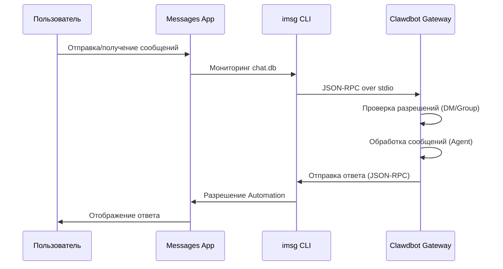

# Конфигурация канала iMessage

## Чему вы научитесь

- Общаться с AI-помощником 1:1 через iMessage на macOS
- Использовать AI-помощника в группах iMessage (с поддержкой @упоминаний)
- Настроить отдельного пользователя Mac для изоляции идентичности бота
- Удалённо получать доступ к iMessage на другом Mac через SSH/Tailscale
- Освоить управление доступом через парную аутентификацию DM и белый список групп

## Ваши текущие трудности

Вы хотите использовать iMessage на macOS для взаимодействия с AI-помощником, но не знаете, как:

- Установить и настроить инструмент CLI `imsg`
- Предоставить Clawdbot разрешения Full Disk Access и Automation
- Настроить локальный или удалённый Mac в качестве шлюза iMessage
- Настроить несколько аккаунтов iMessage
- Контролировать, кто может отправлять сообщения боту

## Когда использовать этот метод

**Сценарии, подходящие для использования канала iMessage**:

- Вы в основном используете iMessage на macOS
- Хотите использовать локальный iMessage (без зависимости от сторонних серверов)
- Нужно взаимодействовать с AI-помощником через iMessage в текстовом и медиа формате
- Хотите сохранить тот же опыт общения, что и на других каналах (WhatsApp, Telegram)

**Неподходящие сценарии**:

- Не macOS система (канал iMessage поддерживает только macOS)
- Нужна кроссплатформенная синхронизация (рассмотрите использование WebChat, Telegram)
- Нужна функция @упоминаний в группах (в iMessage нет собственного механизма упоминаний, требуется ручная настройка)

## Основная концепция

Рабочий процесс канала iMessage:



**Ключевые концепции**:

| Концепция | Описание |
| ------ | ------ |
| **imsg CLI** | Сторонний инструмент для взаимодействия с Messages через JSON-RPC over stdio |
| **Full Disk Access** | Разрешение macOS, позволяющее Clawdbot читать chat.db Messages |
| **Разрешение Automation** | Разрешение macOS, позволяющее imsg отправлять сообщения через Automation API |
| **chat_id** | Стабильный идентификатор чата для маршрутизации и изоляции сессии |
| **pairing** | Механизм защиты DM по умолчанию, неизвестные отправители требуют одобрения |

::: tip
Канал iMessage реализуется через CLI `imsg`, а не через прямой вызов API Messages. `imsg` взаимодействует с Clawdbot через JSON-RPC over stdio, что означает, что он может работать на удалённом Mac (через SSH).
:::

## 🎒 Подготовка перед началом

Убедитесь, что вы:

- ✅ Завершили [Быстрый старт](../../start/getting-started/) и установили Clawdbot
- ✅ Gateway запущен (`clawdbot gateway --port 18789`)
- ✅ Вошли в Messages на macOS (iMessage включён)
- ✅ Имеете доступ к Homebrew (для установки `imsg`)

::: warning
Канал iMessage поддерживает только macOS. Убедитесь, что ваш Gateway работает на macOS или подключён к удалённому Mac через SSH/Tailscale.
:::

## Пошаговое выполнение

### Шаг 1: Установка CLI imsg

**Зачем**
`imsg` — это основная зависимость канала iMessage, взаимодействующая с приложением Messages через JSON-RPC over stdio.

1. Установите с помощью Homebrew:
   ```bash
   brew install steipete/tap/imsg
   ```

**Что вы должны увидеть**:
- После успешной установки команда `imsg` доступна
- Запуск `imsg --version` показывает информацию о версии

**Проверка установки**:

```bash
# Проверьте, доступен ли imsg
imsg chats --limit 1
```

**Что вы должны увидеть**:
- Вывод хотя бы одного чата (если есть)
- Или запрос на предоставление разрешения Full Disk Access

### Шаг 2: Предоставление разрешения Full Disk Access

**Зачем**
Clawdbot нужно читать базу данных `chat.db` Messages для мониторинга новых сообщений.

1. Откройте **Системные настройки** > **Конфиденциальность и безопасность**
2. Нажмите **Полный доступ к диску**
3. Нажмите **+**, чтобы добавить следующие приложения:
   - `/Applications/Clawdbot.app` (если используете приложение macOS)
   - `/usr/local/bin/imsg` или фактический путь к `imsg`
4. Перезапустите Gateway

::: warning
После изменения разрешений необходимо перезапустить Gateway, чтобы изменения вступили в силу!
:::

**Что вы должны увидеть**:
- В журналах запуска Gateway нет ошибок разрешений
- `imsg chats --limit 1` выводит список чатов нормально

### Шаг 3: Предоставление разрешения Automation

**Зачем**
`imsg` отправляет сообщения через Automation API Apple Events, требует авторизации пользователя.

1. При первой отправке сообщения macOS покажет запрос разрешения
2. Нажмите **Разрешить** или **OK**
3. Если используете отдельного пользователя Mac, выполните тест один раз в сессии этого пользователя

**Проверка разрешения Automation**:

```bash
# Отправьте тестовое сообщение (замените на реального получателя)
imsg send --to "+15555550123" "Test message"
```

**Что вы должны увидеть**:
- macOS показывает запрос разрешения (при первой отправке)
- После предоставления разрешения сообщение успешно отправлено
- В приложении Messages отображается тестовое сообщение

### Шаг 4: Конфигурация Clawdbot

**Зачем**
Сообщить Clawdbot, какой путь `imsg` использовать и где находится база данных Messages.

**Способ A: Простая конфигурация (локальный Mac)**

Отредактируйте `~/.clawdbot/clawdbot.json`:

```json5
{
  channels: {
    imessage: {
      enabled: true,
      cliPath: "/usr/local/bin/imsg",
      dbPath: "/Users/<your-username>/Library/Messages/chat.db",
      dmPolicy: "pairing",
      groupPolicy: "allowlist"
    }
  }
}
```

::: info
Замените `<your-username>` на ваше фактическое имя пользователя macOS.
:::

**Способ B: Конфигурация нескольких аккаунтов**

```json5
{
  channels: {
    imessage: {
      enabled: true,
      accounts: {
        main: {
          name: "Main Account",
          enabled: true,
          cliPath: "/usr/local/bin/imsg",
          dbPath: "/Users/alice/Library/Messages/chat.db"
        },
        bot: {
          name: "Bot Account",
          enabled: true,
          cliPath: "/path/to/imsg-bot-wrapper",  // см. шаг 5
          dbPath: "/Users/botuser/Library/Messages/chat.db"
        }
      }
    }
  }
}
```

**Перезапуск Gateway**:

```bash
clawdbot gateway restart
```

**Что вы должны увидеть**:
- Gateway запускается и показывает "iMessage default: enabled, configured, ..."
- Нет журналов ошибок разрешений или путей

### Шаг 5: Отправка тестового сообщения

**Зачем**
Проверить, правильно ли настроена конфигурация и корректно ли передаются сообщения.

1. Отправьте тестовое сообщение через CLI:
   ```bash
   clawdbot message --to imessage:+15555550123 "Hello from Clawdbot!"
   ```

**Что вы должны увидеть**:
- Сообщение получено в приложении Messages
- Журнал Gateway показывает, что сообщение отправлено
- Если настроена модель AI, получен ответ AI

::: info
Формат `imessage:+15555550123` означает отправку через канал iMessage на номер телефона `+15555550123`. Также можно использовать адрес электронной почты `imessage:user@example.com`.
:::

## Контрольная точка ✅

Проверьте успешность конфигурации:

```bash
# Проверьте статус канала
clawdbot channels status

# Должно показать:
# iMessage default: enabled, configured, rpc listening
```

::: info
Если вы видите ошибки, запустите `clawdbot channels status --probe` для получения подробной диагностической информации.
:::

## Продвинутая конфигурация

### Настройка отдельного пользователя Mac (опционально)

Если вы хотите использовать отдельную идентичность iMessage (не загрязнять ваши личные Messages), можно создать отдельного пользователя Mac.

**Шаги**:

1. **Создайте отдельный Apple ID**:
   - Посетите [appleid.apple.com](https://appleid.apple.com)
   - Создайте новый Apple ID (например, `my-cool-bot@icloud.com`)

2. **Создайте пользователя macOS**:
   - Откройте **Системные настройки** > **Пользователи и группы**
   - Нажмите **+** для создания нового пользователя (например, `botuser`)
   - Настройте автоматический вход или запомните пароль

3. **Войдите в отдельный аккаунт iMessage**:
   - Переключитесь на пользователя `botuser`
   - Откройте приложение Messages
   - Войдите в iMessage с использованием отдельного Apple ID

4. **Включите удалённый вход**:
   - Откройте **Системные настройки** > **Основные** > **Общий доступ**
   - Включите **Удалённый вход**

5. **Настройте SSH без пароля**:
   ```bash
   # Проверьте SSH от основного пользователя
   ssh botuser@localhost true

   # Если требуется пароль, настройте ключи SSH:
   ssh-keygen -t ed25519
   ssh-copy-id botuser@localhost
   ```

6. **Создайте SSH wrapper скрипт**:

   Создайте `~/.clawdbot/scripts/imsg-bot` (`chmod +x`):

   ```bash
   #!/usr/bin/env bash
   set -euo pipefail

   # Запустите интерактивный SSH один раз, чтобы принять ключи хоста:
   #   ssh botuser@localhost true
   exec /usr/bin/ssh -o BatchMode=yes -o ConnectTimeout=5 -T botuser@localhost \
     "/usr/local/bin/imsg" "$@"
   ```

7. **Настройте Clawdbot**:

   ```json5
   {
     channels: {
       imessage: {
         enabled: true,
         accounts: {
           bot: {
             name: "Bot",
             enabled: true,
             cliPath: "/Users/<your-username>/.clawdbot/scripts/imsg-bot",
             dbPath: "/Users/botuser/Library/Messages/chat.db"
           }
         }
       }
     }
   }
   ```

::: tip
При первой настройке выполните один раз `imsg chats --limit 1` или `imsg send ...` в сессии `botuser`, чтобы предоставить разрешение Automation.
:::

### Конфигурация удалённого Mac (опционально)

Если Gateway работает на Linux/VM, но iMessage должен быть на Mac, можно подключиться через SSH удалённо.

**Архитектура**:

```
┌──────────────────────────────┐          SSH (imsg rpc)          ┌──────────────────────────┐
│ Хост Gateway (Linux/VM)      │──────────────────────────────────▶│ Mac с Messages + imsg    │
│ - clawdbot gateway           │          SCP (attachments)        │ - Messages вошёл         │
│ - channels.imessage.cliPath  │◀──────────────────────────────────│ - Удалённый вход включён  │
└──────────────────────────────┘                                   └──────────────────────────┘
              ▲
              │ Tailscale tailnet (hostname или 100.x.y.z)
              ▼
        user@remote-mac
```

**Шаги настройки**:

1. **Создайте SSH wrapper** (`~/.clawdbot/scripts/imsg-ssh`):

   ```bash
   #!/usr/bin/env bash
   exec ssh -T bot@remote-mac imsg "$@"
   ```

2. **Настройте Clawdbot**:

   ```json5
   {
     channels: {
       imessage: {
         enabled: true,
         cliPath: "/Users/<your-username>/.clawdbot/scripts/imsg-ssh",
         remoteHost: "bot@remote-mac",
         includeAttachments: true,
         dbPath: "/Users/bot/Library/Messages/chat.db"
       }
     }
   }
   ```

::: info
`remoteHost` используется для передачи SCP вложений. Если не настроен, Clawdbot попытается автоматически определить из команды SSH. Явная конфигурация более надёжна.
:::

**Пример конфигурации Tailscale**:

```bash
# SSH wrapper
#!/usr/bin/env bash
exec ssh -T bot@mac-mini.tailnet-1234.ts.net imsg "$@"
```

```json5
{
  channels: {
    imessage: {
      enabled: true,
      cliPath: "~/.clawdbot/scripts/imsg-ssh",
      remoteHost: "bot@mac-mini.tailnet-1234.ts.net",
      includeAttachments: true,
      dbPath: "/Users/bot/Library/Messages/chat.db"
    }
  }
}
```

## Подробное описание конфигурации

### Базовая конфигурация

| Параметр | Тип | По умолчанию | Описание |
| -------- | ------ | -------- | ------ |
| `enabled` | boolean | false | Включить ли канал iMessage |
| `cliPath` | string | "imsg" | Путь к CLI imsg (может быть SSH wrapper) |
| `dbPath` | string | - | Путь к базе данных chat.db Messages |
| `remoteHost` | string | - | Хост SSH (для передачи SCP вложений) |

### Стратегия DM

| Параметр | Тип | По умолчанию | Описание |
| -------- | ------ | -------- | ------ |
| `dmPolicy` | "pairing"|"allowlist"|"open"|"disabled" | "pairing" | Стратегия доступа DM |
| `allowFrom` | array | [] | Список разрешённых отправителей (handles, emails, E.164, `chat_id:*`) |

**Парная аутентификация новых отправителей**:

```bash
# Список кодов для парной аутентификации
clawdbot pairing list imessage

# Одобрите парную аутентификацию
clawdbot pairing approve imessage <CODE>
```

::: tip
В iMessage нет концепции имени пользователя, используются handles (номера телефонов или адреса электронной почты) или цели чата (`chat_id`, `chat_guid`, `chat_identifier`).
:::

### Стратегия групп

| Параметр | Тип | По умолчанию | Описание |
| -------- | ------ | -------- | ------ |
| `groupPolicy` | "allowlist"|"open"|"disabled" | "allowlist" | Стратегия доступа групп |
| `groupAllowFrom` | array | [] | Отправители, которые могут запускать AI в группах |
| `groups` | object | {} | Конфигурация групп по chat_id |

**Пример конфигурации групп**:

```json5
{
  channels: {
    imessage: {
      groupPolicy: "allowlist",
      groupAllowFrom: ["+15555550123", "alice@example.com"],
      groups: {
        "42": {
          requireMention: false,
          allowFrom: ["bob@example.com"]
        }
      }
    }
  }
}
```

### Ограничения медиа и текста

| Параметр | Тип | По умолчанию | Описание |
| -------- | ------ | -------- | ------ |
| `includeAttachments` | boolean | false | Включать ли вложения в контекст |
| `mediaMaxMb` | number | 16 | Максимальный размер медиа файла (МБ) |
| `textChunkLimit` | number | 4000 | Размер блоков исходящего текста (символы) |
| `chunkMode` | "length"|"newline" | "length" | Режим блоков: по длине или по пустым строкам |

### История

| Параметр | Тип | По умолчанию | Описание |
| -------- | ------ | -------- | ------ |
| `historyLimit` | number | - | Максимальное количество исторических сообщений в группах (0 отключает) |
| `dmHistoryLimit` | number | - | Ограничение истории DM (обороты пользователя) |
| `dms["<handle>"].historyLimit` | number | - | Переопределение ограничения истории DM по handle |

## Советы по устранению проблем

### Команда imsg rpc недоступна

**Симптом**: Журнал Gateway показывает "imsg CLI does not support 'rpc' subcommand"

**Причина**: Версия `imsg` слишком старая, не поддерживает подкоманду `rpc`

**Решение**:

1. Обновите `imsg`:
   ```bash
   brew upgrade steipete/tap/imsg
   ```

2. Проверьте версию:
   ```bash
   imsg rpc --help
   ```

### Проблема с разрешением Full Disk Access

**Симптом**: `imsg chats --limit 1` не выводит или показывает ошибку "Permission denied"

**Решение**:

1. Убедитесь, что Clawdbot и `imsg` добавлены в Полный доступ к диску
2. Перезапустите Gateway
3. Если проблема продолжается, попробуйте перезагрузить Mac

### Проблема с разрешением Automation

**Симптом**: Отправка сообщения не реагирует, журнал Gateway показывает тайм-аут

**Причина**: macOS не предоставил разрешение Automation

**Решение**:

1. Отправьте сообщение вручную в приложении Messages
2. macOS должен показать запрос разрешения
3. Нажмите **Разрешить**
4. Если используете отдельного пользователя Mac, переключитесь на этого пользователя и повторите шаги

### Ошибка подключения к удалённому Mac

**Симптом**: SSH wrapper тайм-аут или соединение отклонено

**Решение**:

1. Проверьте соединение SSH:
   ```bash
   ssh -T bot@remote-mac imsg --version
   ```

2. Убедитесь, что Удалённый вход включён (на удалённом Mac)

3. Проверьте настройки брандмауэра и портов

4. Используйте Tailscale для упрощения проброса в локальную сеть

## Итог урока

- Установили инструмент CLI `imsg`
- Настроили разрешения Full Disk Access и Automation
- Освоили методы конфигурации локального и удалённого Mac
- Поняли механизмы парной аутентификации DM и белый список групп
- Поняли различия между chat_id, chat_guid, chat_identifier
- Протестировали сообщения 1:1 и группы

## Что дальше

> В следующем уроке мы изучим **[Канал LINE](../line/)**.
>
> Вы узнаете:
> - Как получить учётные данные LINE Messaging API
> - Настройка конечной точки Webhook для LINE Bot
> - Формат сообщений и ограничения канала LINE
> - Различия в конфигурации с каналом iMessage

---

## Приложение: Справочник исходного кода

<details>
<summary><strong>Нажмите, чтобы раскрыть расположение исходного кода</strong></summary>

> Дата обновления: 2026-01-27

| Функция | Путь к файлу | Строки |
| ------ | --------- | ---- |
| Определение типа конфигурации iMessage | [`src/config/types.imessage.ts`](https://github.com/clawdbot/clawdbot/blob/main/src/config/types.imessage.ts) | 1-80 |
| Парсинг аккаунтов iMessage | [`src/imessage/accounts.ts`](https://github.com/clawdbot/clawdbot/blob/main/src/imessage/accounts.ts) | 1-83 |
| Зондирование iMessage | [`src/imessage/probe.ts`](https://github.com/clawdbot/clawdbot/blob/main/src/imessage/probe.ts) | 1-92 |
| Отправка iMessage | [`src/imessage/send.ts`](https://github.com/clawdbot/clawdbot/blob/main/src/imessage/send.ts) | 1-135 |
| Провайдер мониторинга iMessage | [`src/imessage/monitor/monitor-provider.ts`](https://github.com/clawdbot/clawdbot/blob/main/src/imessage/monitor/monitor-provider.ts) | 1-600+ |
| Парсинг целевых адресов | [`src/imessage/targets.ts`](https://github.com/clawdbot/clawdbot/blob/main/src/imessage/targets.ts) | 1-200+ |
| Адаптер Onboarding | [`src/channels/plugins/onboarding/imessage.ts`](https://github.com/clawdbot/clawdbot/blob/main/src/channels/plugins/onboarding/imessage.ts) | 1-262 |
| Документация iMessage | [`docs/channels/imessage.md`](https://github.com/clawdbot/clawdbot/blob/main/docs/channels/imessage.md) | 1-262 |

**Ключевые типы**:
- `IMessageConfig`: Полный интерфейс конфигурации iMessage
- `IMessageAccountConfig`: Конфигурация отдельного аккаунта
- `IMessageService`: "imessage" | "sms" | "auto"
- `IMessageTargetKind`: "chat_id" | "chat_guid" | "chat_identifier" | "handle"

**Ключевые поля конфигурации**:
- `cliPath`: Путь к CLI imsg, может быть локальным путём или SSH wrapper скриптом
- `dbPath`: Путь к базе данных chat.db Messages
- `remoteHost`: Хост SSH (для передачи SCP вложений), автоматическое определение или явная конфигурация
- `dmPolicy`: По умолчанию "pairing", контролирует доступ неизвестных DM
- `groupPolicy`: Стратегия доступа групп, "allowlist" или "open"
- `groups`: Конфигурация групп по `chat_id`, поддерживает изоляцию сессий и пользовательские стратегии

**Ключевые функции**:
- `probeIMessage()`: Зондирует, доступен ли CLI imsg и поддерживает ли подкоманду rpc (`probe.ts`)
- `sendMessageIMessage()`: Отправляет сообщение iMessage, поддерживает текст и медиа (`send.ts`)
- `monitorIMessageProvider()`: Мониторит поток событий iMessage (`monitor-provider.ts`)
- `parseIMessageTarget()`: Парсит целевой адрес (chat_id, handle, email и т.д.) (`targets.ts`)

**Механизм связи**:
- Коммуникация через JSON-RPC over stdio с помощью подкоманды `imsg rpc`
- Каждый аккаунт имеет отдельный экземпляр RPC клиента (`createIMessageRpcClient`)
- События сообщений передаются в Gateway через поток в `monitor-provider.ts`
- При отправке сообщений поддерживает `chat_id` (рекомендуется), `chat_guid`, `chat_identifier` или прямой handle

**Поддержка нескольких аккаунтов**:
- Используйте map `channels.imessage.accounts` для конфигурации нескольких аккаунтов
- Каждый аккаунт имеет отдельные конфигурации `cliPath`, `dbPath` и стратегии
- ID аккаунта по умолчанию — "default", может быть указан через поле `accountId`

</details>
