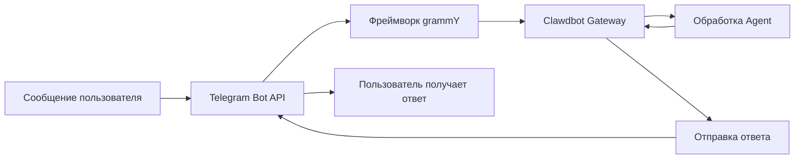

# Конфигурация и использование канала Telegram

## Чему вы научитесь

После завершения этого руководства вы сможете:

- 🤖 Создать бота в Telegram и получить Bot Token
- ⚙️ Настроить канал Telegram для подключения к Clawdbot
- 🔒 Управлять правами доступа к DM и группам (механизм парной аутентификации и белый список)
- 📡 Настроить правила упоминания в группах и стратегии ответов
- 🔌 Настроить режим Webhook (опционально)
- 🎯 Использовать функции Telegram Bot API (инлайн-кнопки, темы, ответы)

## Ваши текущие трудности

Вы уже используете Clawdbot в Telegram, но столкнулись с этими проблемами:

- ❌ Не знаете, как правильно настроить Bot Token
- ❌ После того как неизвестный пользователь отправил сообщение боту, бот не отвечает
- ❌ В группах бот не отвечает на сообщения без упоминания
- ❌ Хотите точно контролировать, кто может обращаться к боту, но не знаете, как настроить
- ❌ Слышали о разнице между Webhook и Long-polling, но не знаете, какой выбрать

Это руководство поможет вам пошагово решить эти проблемы.

## Когда использовать этот метод

Подходит для использования канала Telegram в следующих сценариях:

- ✅ Вы уже используете Telegram и хотите общаться с AI-помощником на этой платформе
- ✅ Вам нужно, чтобы бот отвечал на определенных пользователей или команды в группах
- ✅ Вы хотите использовать специальные функции Telegram Bot API (инлайн-кнопки, темы Forum)
- ✅ Сетевое окружение вашего сервера подходит для использования Long-polling или Webhook

**Если вы в основном используете WhatsApp или другие каналы**: этот урок можно пропустить, сосредоточьтесь на используемом канале.

## 🎒 Подготовка перед началом

Перед началом убедитесь, что вы:

- [ ] Завершили руководство [Быстрый старт](../../start/getting-started/), Clawdbot установлен и может быть запущен
- [ ] Имеете аккаунт Telegram (не нужно быть Premium-пользователем)
- [ ] Понимаете базовые концепции Telegram Bot (Bot, Token, режим приватности)

::: info Расположение конфигурационного файла
По умолчанию конфигурационный файл Clawdbot находится:
- **Linux/macOS**: `~/.clawdbot/clawdbot.json`
- **Windows**: `%USERPROFILE%\.clawdbot\clawdbot.json`
:::

## Основная концепция

### Telegram Bot API vs другие каналы

В отличие от других платформ мгновенных сообщений, Telegram использует архитектуру **Bot API**:

| Особенность | Telegram | WhatsApp | Slack |
| ----------- | --------- | -------- | ----- |
| Способ подключения | Bot API (HTTP) | Web Client | Bot API + WebSocket |
| Режим сообщений | Push (бот активно отправляет) | Pull (прослушивает Web Client) | Pull (прослушивает WebSocket) |
| Режим приватности | **Поддерживается** (Bot может выбрать) | N/A | N/A |
| Поддержка групп | SuperGroup + Forum | Groups | Channels + Workspace |
| Специальные функции | Темы Forum, инлайн-кнопки | - | - |

### Интеграция Clawdbot

Clawdbot использует [grammY](https://grammy.dev/) — фреймворк Bot API для интеграции с Telegram:



**Ключевые моменты**:
- **Long-polling**: режим по умолчанию, Clawdbot активно запрашивает обновления Telegram
- **Webhook**: опциональный режим, Telegram отправляет обновления на ваш сервер
- **Парная аутентификация DM**: включена по умолчанию, неизвестные пользователи должны сначала пройти парную аутентификацию
- **Упоминание в группах**: включено по умолчанию, бот отвечает только на `@botname` или настроенный режим упоминания

### Механизм управления доступом

Clawdbot обеспечивает трехуровневый контроль доступа:

1. **Уровень DM** (`dmPolicy`)
   - `pairing`: неизвестные пользователи получают код парной аутентификации, должны сначала быть одобрены
   - `allowlist`: разрешены только пользователи из белого списка
   - `open`: разрешить все DM (требуется настройка `allowFrom: ["*"]`)

2. **Уровень групп** (`groups` + `groupPolicy`)
   - Указать, какие группы могут обращаться к боту
   - Настроить правило `requireMention` для каждой группы

3. **Уровень отправителей** (`allowFrom` + `groupAllowFrom`)
   - В разрешенных DM/группах дополнительно ограничить, кто может отправлять сообщения

::: warning Безопасный стандарт
Стратегия DM по умолчанию — `pairing`, это самое безопасное значение по умолчанию. Сообщения от неизвестных пользователей игнорируются, пока вы не одобрите код парной аутентификации.
:::

## Пошаговое руководство

### Шаг 1: Создайте Telegram Bot и получите Token

**Зачем это нужно**
Telegram Bot требует Bot Token для доступа и отправки сообщений через Bot API. Этот Token эквивалентен "идентификационному документу" бота.

**Действия**

1. В Telegram найдите и откройте **@BotFather**
2. Отправьте команду `/newbot`
3. Следуйте инструкциям:
   - Введите имя бота (например: `My Clawdbot Assistant`)
   - Введите имя пользователя бота (должно заканчиваться на `bot`, например: `my_clawdbot_bot`)
4. BotFather вернет Bot Token, формат: `123456:ABC-DEF123456`

**Что вы должны увидеть**:
```
Done! Congratulations on your new bot.

You can find it at t.me/my_clawdbot_bot. You can now add a description,
about section and profile picture for it, see /help for a list of commands.

Use this token to access the HTTP API:
123456:ABC-DEF1234567890

Keep your token secure and store it safely, it can be used by anyone
to control your bot.
```

::: tip Рекомендации по безопасности
- 🔐 Сразу скопируйте Token и сохраните в безопасном месте (например, в менеджере паролей)
- ⚠️ **Никогда** не делитесь Token в общедоступных репозиториях, социальных сетях или с другими людьми
- 🔄 Если Token утек, немедленно используйте команду `/revoke` в @BotFather для его отзыва
:::

**Дополнительная настройка BotFather** (рекомендуется)

1. Настройка прав доступа к группам:
   - `/setjoingroups` → выбрать, разрешать ли добавление бота в группы
   - `/setprivacy` → контролировать, видеть ли все сообщения в группах

2. Настройка информации о боте:
   - `/setdescription` → добавить описание
   - `/setabouttext` → добавить текст "О программе"
   - `/setuserpic` → загрузить аватар

### Шаг 2: Настройте канал Telegram

**Зачем это нужно**
Конфигурационный файл сообщает Clawdbot, как подключиться к Telegram Bot API, и как обрабатывать сообщения и права доступа.

**Действия**

Создайте или отредактируйте `~/.clawdbot/clawdbot.json`:

```json5
{
  "channels": {
    "telegram": {
      "enabled": true,
      "botToken": "123456:ABC-DEF1234567890",
      "dmPolicy": "pairing"
    }
  }
}
```

**Описание полей конфигурации**:

| Поле | Тип | По умолчанию | Описание |
| ---- | --- | ----------- | -------- |
| `enabled` | boolean | `true` | Включен ли канал Telegram |
| `botToken` | string | - | Bot Token (обязательный) |
| `dmPolicy` | string | `"pairing"` | Стратегия доступа DM |
| `allowFrom` | array | `[]` | Белый список DM (ID пользователя или @имя пользователя) |
| `groupPolicy` | string | `"allowlist"` | Стратегия доступа к группам |
| `groupAllowFrom` | array | `[]` | Белый список отправителей в группах |
| `groups` | object | `{}` | Детальная конфигурация групп |

**Способ с переменными окружения** (опционально)

Вы также можете использовать переменные окружения (для учетной записи по умолчанию):

```bash
export TELEGRAM_BOT_TOKEN="123456:ABC-DEF1234567890"
```

::: tip Приоритет переменных окружения
Если настроены и переменные окружения, и конфигурационный файл:
- **Приоритет конфигурационного файла** (`channels.telegram.botToken`)
- Переменные окружения служат **резервом для учетной записи по умолчанию**
:::

### Шаг 3: Запустите Gateway и проверьте подключение

**Зачем это нужно**
Запуск Gateway позволяет подключиться к Telegram Bot API в соответствии с конфигурацией и начать прослушивание сообщений.

**Действия**

1. Запустите Gateway в терминале:

```bash
# Способ 1: прямой запуск
clawdbot gateway --verbose

# Способ 2: использование демона
clawdbot gateway --port 18789 --verbose
```

2. Наблюдайте за журналами запуска Gateway, ищите информацию, связанную с Telegram

**Что вы должны увидеть**:
```
[INFO] Starting Gateway...
[INFO] Loading config from ~/.clawdbot/clawdbot.json
[INFO] Starting channels...
[INFO] Starting Telegram channel...
[INFO] Telegram bot connected: @my_clawdbot_bot
[INFO] Listening for updates (long-polling)...
```

::: tip Просмотр подробных журналов
Использование флага `--verbose` позволяет увидеть более подробные журналы, включая:
- Каждое полученное сообщение
- Решения по маршрутизации сессий
- Результаты проверки прав доступа
:::

**Контрольная точка ✅**

- [ ] Gateway успешно запущен и без ошибок
- [ ] Журналы показывают "Telegram bot connected"
- [ ] Нет ошибок "Authentication failed" или "Invalid token"

### Шаг 4: Протестируйте бота в Telegram

**Зачем это нужно**
Отправка первого сообщения проверяет правильность подключения бота, применение конфигурации, возможность получения и ответа на сообщения.

**Действия**

1. В Telegram найдите имя пользователя вашего бота (например, `@my_clawdbot_bot`)
2. Нажмите кнопку "Start" или отправьте команду `/start`
3. Если это первый DM-контакт, вы должны получить код парной аутентификации

**Что вы должны увидеть**:
```
👋 Hi! I'm your Clawdbot assistant.

To get started, please approve this pairing code:
CLAW-ABC123

Run this command in your terminal:
clawdbot pairing approve telegram CLAW-ABC123
```

**Если бот не отвечает**:

| Проблема | Возможная причина | Решение |
| -------- | ---------------- | ------- |
| Бот не отвечает | Неверный Bot Token | Проверьте значение `botToken` в `clawdbot.json` |
| Бот не отвечает | Gateway не запущен | Запустите `clawdbot gateway --verbose` для просмотра ошибок |
| Бот не отвечает | Проблемы с сетью | Проверьте, может ли сервер обращаться к `api.telegram.org` |
| Бот не отвечает | Бот заблокирован | Проверьте статус бота в @BotFather |

### Шаг 5: Одобрите парную аутентификацию DM (если применимо)

**Зачем это нужно**
Стратегия DM по умолчанию — `pairing`, неизвестные пользователи должны сначала получить ваше одобрение, чтобы отправлять сообщения боту. Это гарантирует безопасность.

**Действия**

1. Запустите команду парной аутентификации в терминале:

```bash
# Просмотреть парные аутентификации, ожидающие одобрения
clawdbot pairing list telegram

# Одобрить код парной аутентификации
clawdbot pairing approve telegram CLAW-ABC123
```

2. После успешной парной аутентификации пользователь может нормально отправлять сообщения боту

**Что вы должны увидеть**:
```
✅ Pairing approved: telegram:user:123456789

User @username can now send messages to the bot.
```

::: tip Истечение кода парной аутентификации
Код парной аутентификации истекает через 1 час. Пользователям необходимо повторно отправить команду `/start`, чтобы получить новый код.
:::

## Конфигурация групп

### Получение Chat ID группы

Чтобы настроить управление доступом к группам, сначала нужно знать Chat ID группы.

**Способ 1: Использование стороннего бота** (быстро, но не рекомендуется)

1. Добавьте вашего бота в группу
2. Перешлите любое сообщение из группы в `@userinfobot`
3. Бот вернет информацию о группе, включая Chat ID

**Способ 2: Использование журналов Gateway** (рекомендуется)

1. Отправьте любое сообщение боту в группе
2. Запустите:

```bash
clawdbot logs --follow
```

3. Найдите поле `chat.id` в журналах, ID группы обычно является отрицательным числом (например, `-1001234567890`)

**Что вы должны увидеть**:
```
[INFO] Received message from chat: -1001234567890
```

### Настройка доступа к группам

**Способ 1: Разрешить все группы**

```json5
{
  "channels": {
    "telegram": {
      "groups": {
        "*": {
          "requireMention": true
        }
      }
    }
  }
}
```

**Способ 2: Разрешить только определенные группы**

```json5
{
  "channels": {
    "telegram": {
      "groups": {
        "-1001234567890": {
          "requireMention": false
        },
        "-1009876543210": {
          "requireMention": true
        }
      }
    }
  }
}
```

**Способ 3: Всегда отвечать в группах** (не требует упоминания)

```json5
{
  "channels": {
    "telegram": {
      "groups": {
        "-1001234567890": {
          "requireMention": false
        }
      }
    }
  }
}
```

### Настройка режима приватности Telegram

Если бот **не отвечает на неупомянутые сообщения в группах**, возможно, это ограничение режима приватности.

**Шаги проверки**:

1. Запустите `/setprivacy` в @BotFather
2. Выберите **Disable** (отключить режим приватности)
3. **Важно**: Telegram требует, чтобы вы удалили и повторно добавили бота в группу, чтобы настройки вступили в силу
4. Повторно добавьте бота в группу

::: warning Влияние режима приватности
- ✅ **Режим приватности OFF**: бот может видеть все сообщения в группе (требуется `requireMention: false` для ответа на все сообщения)
- ⚠️ **Режим приватности ON**: бот видит только сообщения с @упоминанием или когда на сообщение бота отвечают (по умолчанию)
- 🛡️ **Бот является администратором**: бот-администратор может видеть все сообщения независимо от режима приватности
:::

### Активация групп в сессии

Вы также можете использовать команды для динамического переключения поведения ответа в группах (на уровне сессии, сбрасывается после перезапуска):

- `/activation always` — отвечать на все сообщения в группе
- `/activation mention` — отвечать только на упоминания (по умолчанию)

::: tip Рекомендуется использовать конфигурацию
Для постоянного поведения рекомендуется настроить `groups.requireMention` в `clawdbot.json`, а не полагаться на команды.
:::

## Продвинутая конфигурация

### Режим Webhook (опционально)

По умолчанию используется **Long-polling** (активный запрос обновлений). Если у вас есть общедоступный сервер, можно использовать режим Webhook.

**Настройка Webhook**:

```json5
{
  "channels": {
    "telegram": {
      "webhookUrl": "https://your-domain.com/telegram-webhook",
      "webhookSecret": "your-secret-token"
    }
  }
}
```

**Webhook vs Long-polling**:

| Особенность | Long-polling | Webhook |
| ----------- | ------------- | ------- |
| Требования к сети | Требуется активный доступ к `api.telegram.org` | Требуется общедоступная HTTPS-точка |
| Задержка | ~1-3 секунды интервал опроса | Почти мгновенная доставка |
| Ресурсы сервера | Выше (постоянный опрос) | Ниже (пассивное получение) |
| Применимые сценарии | Домашний сервер, без публичного IP | VPS, с доменным именем |

::: tip Локальное тестирование Webhook
Если вы хотите протестировать Webhook локально:
- Используйте `ngrok` или `localtunnel` для создания временного туннеля
- Настройте URL туннеля как `webhookUrl`
- Gateway будет слушать `/telegram-webhook` на `0.0.0.0:8787`
:::

### Ограничение размера медиа

Контролируйте размер медиафайлов, отправляемых и получаемых через Telegram:

```json5
{
  "channels": {
    "telegram": {
      "mediaMaxMb": 10
    }
  }
}
```

- По умолчанию: 5MB
- Медиафайлы, превышающие ограничение, будут отклонены

### Конфигурация разбиения сообщений

Telegram имеет ограничение на длину текста одного сообщения (около 4096 символов). Clawdbot автоматически разбивает длинные сообщения.

```json5
{
  "channels": {
    "telegram": {
      "textChunkLimit": 4000,
      "chunkMode": "length"
    }
  }
}
```

**Режимы разбиения**:

- `"length"`: разбиение по количеству символов (по умолчанию)
- `"newline"`: сначала разбиение по пустым строкам (сохранение абзацев), затем по длине

### Поддержка тем Forum

Супергруппы Telegram Forum поддерживают темы. Clawdbot создает отдельную сессию для каждой темы.

```json5
{
  "channels": {
    "telegram": {
      "groups": {
        "-1001234567890": {
          "topics": {
            "12345": {
              "requireMention": false,
              "systemPrompt": "You are a specialist in this topic."
            }
          }
        }
      }
    }
  }
}
```

**Формат ключа сессии темы**:
```
agent:main:telegram:group:-1001234567890:topic:12345
```

### Инлайн-кнопки

Telegram поддерживает интерактивные кнопки (Inline Buttons).

**Включение кнопок**:

```json5
{
  "channels": {
    "telegram": {
      "capabilities": {
        "inlineButtons": "allowlist"
      }
    }
  }
}
```

**Область действия кнопок**:

- `"off"`: кнопки отключены
- `"dm"`: разрешены только в DM
- `"group"`: разрешены только в группах
- `"all"`: DM + группы
- `"allowlist"`: DM + группы, но разрешены только отправители из `allowFrom`

**Отправка кнопок через Agent**:

Используйте действие `sendMessage` инструмента `telegram`:

```json5
{
  "action": "send",
  "channel": "telegram",
  "to": "123456789",
  "message": "Choose an option:",
  "buttons": [
    [
      {"text": "Yes", "callback_data": "yes"},
      {"text": "No", "callback_data": "no"}
    ],
    [
      {"text": "Cancel", "callback_data": "cancel"}
    ]
  ]
}
```

**Обработка обратного вызова кнопок**:

Когда пользователь нажимает кнопку, Agent получает сообщение в формате `callback_data: value`.

### Уведомления о реакциях

Контролируйте, получает ли Agent уведомления о реакциях пользователей на сообщения (emoji).

```json5
{
  "channels": {
    "telegram": {
      "reactionNotifications": "all",
      "reactionLevel": "minimal"
    }
  }
}
```

**Режимы уведомлений о реакциях**:

- `"off"`: игнорировать все реакции
- `"own"`: уведомлять только о реакциях на сообщения бота (по умолчанию)
- `"all"`: уведомлять о всех реакциях

**Уровень реакций Agent**:

- `"off"`: Agent не может отправлять реакции
- `"ack"`: отправлять реакцию подтверждения при обработке 👀
- `"minimal"`: использовать реакции сдержанно (1 раз на 5-10 обменов, по умолчанию)
- `"extensive"`: свободно использовать реакции

## Предупреждения о типичных проблемах

### Распространенные ошибки конфигурации

| Ошибка | Симптом | Причина | Решение |
| ------ | ------- | ------ | ------- |
| Неверный формат Token | Ошибка "Invalid token" | Скопирован неполный Token | Проверьте, является ли Token полным (включая двоеточие) |
| Конфликт переменных окружения | Бот использует другой Token | Переменная окружения перезаписывает конфигурационный файл | Приоритет использования `channels.telegram.botToken` |
| Группа не отвечает | Бот не обрабатывает сообщения группы | Режим приватности не отключен | Запустите `/setprivacy` в @BotFather |
| Ошибка Webhook | Ошибка "Webhook setup failed" | URL недоступен или HTTPS неправильный | Проверьте сервер и сертификат |

### Проблемы с сетью

**Проблема с маршрутизацией IPv6**:

Некоторые серверы сначала используют IPv6 для разрешения `api.telegram.org`, если есть проблемы с сетью IPv6, запросы могут не удаться.

**Симптомы**:
- Бот запускается, но быстро перестает отвечать
- В журналах показано "HttpError: Network request failed"

**Решение**:

1. Проверьте DNS-разрешение:

```bash
dig +short api.telegram.org A    # IPv4
dig +short api.telegram.org AAAA # IPv6
```

2. Принудительное использование IPv4 (добавьте в `/etc/hosts` или измените конфигурацию DNS)

```bash
# Пример /etc/hosts
123.45.67.89 api.telegram.org
```

3. Перезапустите Gateway

### Ловушка режима приватности

**Проблема**:
- После отключения режима приватности бот все еще не видит сообщения группы

**Причина**:
- Telegram требует, чтобы вы **удалили и повторно добавили** бота в группу

**Решение**:
1. Удалите бота из группы
2. Повторно добавьте бота в группу
3. Подождите 30 секунд и протестируйте

## Итоги урока

В этом уроке вы узнали:

- ✅ Создать бота в Telegram и получить Token
- ✅ Настроить Clawdbot для подключения к Telegram Bot API
- ✅ Понять и использовать механизм парной аутентификации DM
- ✅ Настроить управление доступом к группам (белый список + правила упоминания)
- ✅ Понять разницу между Webhook и Long-polling
- ✅ Настроить продвинутые функции (ограничение медиа, разбиение, темы Forum, инлайн-кнопки)
- ✅ Обработать распространенные проблемы с сетью и конфигурацией

**Краткий обзор ключевых полей конфигурации**:

| Поле | Рекомендуемое значение | Описание |
| ---- | --------------------- | -------- |
| `dmPolicy` | `"pairing"` | Самая безопасная стратегия DM по умолчанию |
| `groups.*.requireMention` | `true` | По умолчанию в группах требуется упоминание |
| `reactionNotifications` | `"own"` | Отвечать только на реакции на сообщения бота |
| `streamMode` | `"partial"` | Включить потоковые обновления черновиков |

## Обзор следующего урока

> В следующем уроке мы изучим **[Канал Slack](../../platforms/slack/)**.
>
> Вы узнаете:
> - Как создать Slack App и получить Bot Token
> - Настроить Bot Token и App Token Slack
> - Понять концепции Workspace и Channel Slack
> - Настроить специальные функции Slack (потоки, ярлыки, App Home)

---

## Приложение: Справочник исходного кода

<details>
<summary><strong>Нажмите, чтобы раскрыть расположение исходного кода</strong></summary>

> Время обновления: 2026-01-27

| Функция | Путь к файлу | Строка |
| ------- | ------------ | ------ |
| Создание Telegram Bot | [`src/telegram/bot.ts`](https://github.com/clawdbot/clawdbot/blob/main/src/telegram/bot.ts) | 106-452 |
| Определение типов конфигурации | [`src/config/types.telegram.ts`](https://github.com/clawdbot/clawdbot/blob/main/src/config/types.telegram.ts) | 14-157 |
| Документация Telegram | [`docs/channels/telegram.md`](https://github.com/clawdbot/clawdbot/blob/main/docs/channels/telegram.md) | 1-547 |
| Обработчик сообщений бота | [`src/telegram/bot-message.ts`](https://github.com/clawdbot/clawdbot/blob/main/src/telegram/bot-message.ts) | Весь файл |
| Обработчик команд бота | [`src/telegram/bot-handlers.ts`](https://github.com/clawdbot/clawdbot/blob/main/src/telegram/bot-handlers.ts) | Весь файл |
| Регистрация нативных команд | [`src/telegram/bot-native-commands.ts`](https://github.com/clawdbot/clawdbot/blob/main/src/telegram/bot-native-commands.ts) | Весь файл |

**Ключевые поля конфигурации**:

- `dmPolicy`: стратегия доступа DM (`"pairing"` | `"allowlist"` | `"open"` | `"disabled"`)
- `groupPolicy`: стратегия групп (`"open"` | `"allowlist"` | `"disabled"`)
- `requireMention`: требовать ли упоминание в группах (`boolean`)
- `reactionNotifications`: режим уведомлений о реакциях (`"off"` | `"own"` | `"all"`)
- `reactionLevel`: уровень реакций Agent (`"off"` | `"ack"` | `"minimal"` | `"extensive"`)

**Ключевые функции**:

- `createTelegramBot()`: создать экземпляр Telegram Bot и настроить фреймворк grammY
- `createTelegramWebhookCallback()`: создать обработчик обратного вызова Webhook
- `getTelegramSequentialKey()`: сгенерировать ключ сессии, поддерживает темы Forum и обычные группы

**Зависимые библиотеки**:

- [grammY](https://grammy.dev/): фреймворк Telegram Bot API
- @grammyjs/runner: последовательная обработка обновлений
- @grammyjs/transformer-throttler: ограничение API

</details>
