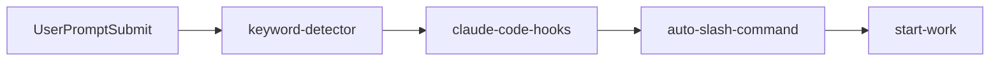
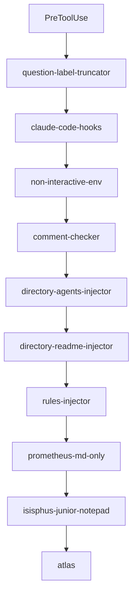
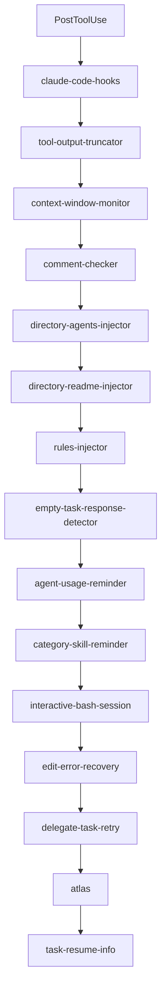
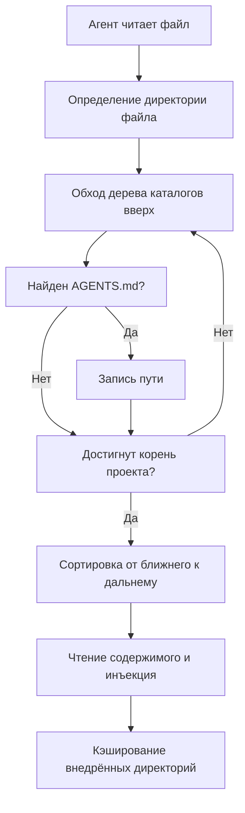
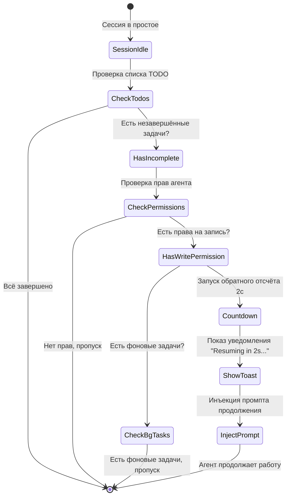
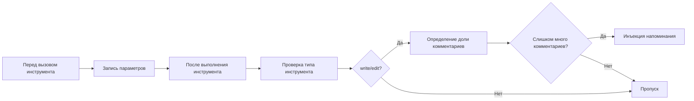

# Хуки жизненного цикла: Автоматизация контекста и контроль качества

## Чему вы научитесь

- Автоматически внедрять контекст проекта для ИИ-агентов (AGENTS.md, README.md)
- Предотвращать преждевременную остановку агентов, принудительно завершая списки TODO
- Автоматически усекать слишком большой вывод инструментов, избегая переполнения контекстного окна
- Включать режим Ultrawork, активируя всех профессиональных агентов одним кликом
- Настраивать конфигурацию хуков, отключая ненужные функции

## Ваша текущая проблема

Сталкивались ли вы с этими проблемами:

- ИИ-агенты постоянно забывают спецификации проекта и повторяют одни и те же ошибки?
- Агенты останавливаются на полпути, не завершив список TODO?
- Поиск по кодовой базе выдаёт слишком большой вывод, переполняя контекстное окно?
- Каждый раз приходится вручную указывать агенту, в каком режиме работать?

## Когда использовать этот подход

Хуки жизненного цикла подходят для следующих сценариев:

::: tip Типичные сценарии
- **Управление контекстом проекта**: Автоматическая инъекция AGENTS.md и README.md
- **Контроль качества**: Проверка комментариев в коде, валидация блоков мышления
- **Непрерывность задач**: Принудительное завершение агентом всех TODO-задач
- **Оптимизация производительности**: Динамическое усечение вывода, управление контекстным окном
- **Автоматизация рабочего процесса**: Триггеры режимов по ключевым словам, автоматическое выполнение команд
:::

## Основные концепции

### Что такое хуки жизненного цикла?

**Хуки жизненного цикла** — это событийно-ориентированный механизм, позволяющий внедрять пользовательскую логику в ключевые моменты работы агента. Например, автоматическая инъекция документации проекта, принудительное завершение TODO-задач, усечение слишком большого вывода. Эти хуки отслеживают 4 типа событий: перед выполнением инструмента, после выполнения инструмента, при отправке промпта пользователем, при простое сессии. Правильная настройка хуков делает ИИ-агентов умнее и лучше адаптированными к вашему рабочему процессу.

::: info Хуки vs Middleware
Хуки похожи на middleware в веб-фреймворках — оба механизма выполняют «определённые действия в определённые моменты». Различия:
- **Middleware**: Линейное выполнение, может прервать запрос
- **Хуки**: Событийно-ориентированные, не могут прервать, только модифицируют данные
:::

### 32 хука в 7 категориях

oh-my-opencode предоставляет 32 встроенных хука, разделённых на 7 категорий:

| Категория | Количество хуков | Основное назначение |
| --- | --- | --- |
| **Инъекция контекста** | 4 | Автоматическая инъекция документации и правил проекта |
| **Продуктивность и контроль** | 6 | Обнаружение ключевых слов, переключение режимов, управление циклами |
| **Качество и безопасность** | 4 | Проверка комментариев в коде, валидация блоков мышления |
| **Восстановление и стабильность** | 3 | Восстановление сессии, обработка ошибок |
| **Усечение и управление контекстом** | 2 | Усечение вывода, мониторинг окна |
| **Уведомления и UX** | 3 | Обновления версий, уведомления о фоновых задачах, напоминания о простое |
| **Управление задачами** | 2 | Возобновление задач, повторные попытки делегирования |

## Типы событий хуков

Хуки отслеживают следующие 4 типа событий:

### 1. PreToolUse (Перед выполнением инструмента)

**Момент срабатывания**: Перед вызовом инструмента агентом

**Возможности**:
- Блокировка выполнения инструмента
- Модификация параметров инструмента
- Инъекция контекста

**Примеры хуков**: `comment-checker`, `directory-agents-injector`

### 2. PostToolUse (После выполнения инструмента)

**Момент срабатывания**: После завершения выполнения инструмента

**Возможности**:
- Модификация вывода инструмента
- Добавление предупреждений
- Инъекция последующих инструкций

**Примеры хуков**: `tool-output-truncator`, `directory-readme-injector`

### 3. UserPromptSubmit (При отправке промпта пользователем)

**Момент срабатывания**: Когда пользователь отправляет сообщение в сессию

**Возможности**:
- Блокировка отправки (редко)
- Модификация содержимого промпта
- Инъекция системных сообщений
- Активация рабочих режимов

**Примеры хуков**: `keyword-detector`, `auto-slash-command`

### 4. Stop (При простое сессии)

**Момент срабатывания**: Когда агент прекращает работу и сессия переходит в состояние простоя

**Возможности**:
- Инъекция последующих промптов
- Отправка уведомлений
- Проверка статуса задач

**Примеры хуков**: `todo-continuation-enforcer`, `session-notification`

## Порядок выполнения хуков

Хуки выполняются в фиксированном порядке для обеспечения корректной логики:

### Событие UserPromptSubmit



**Описание порядка**:
1. `keyword-detector`: Обнаружение ключевых слов (ultrawork, search, analyze)
2. `claude-code-hooks`: Выполнение хуков слоя совместимости с Claude Code
3. `auto-slash-command`: Автоматическое выполнение слэш-команд
4. `start-work`: Обработка команды `/start-work`

### Событие PreToolUse



**Описание порядка**:
1. `question-label-truncator`: Усечение меток инструментов
2. `claude-code-hooks`: Слой совместимости с Claude Code
3. `non-interactive-env`: Обработка неинтерактивной среды
4. `comment-checker`: Проверка комментариев в коде
5. `directory-agents-injector`: Инъекция AGENTS.md
6. `directory-readme-injector`: Инъекция README.md
7. `rules-injector`: Инъекция правил проекта
8. `prometheus-md-only`: Принудительный вывод Prometheus только в Markdown
9. `sisyphus-junior-notepad`: Инъекция промптов для Sisyphus Junior
10. `atlas`: Основная логика оркестрации Atlas

### Событие PostToolUse



**Описание порядка**:
1. `claude-code-hooks`: Слой совместимости с Claude Code
2. `tool-output-truncator`: Усечение вывода инструментов
3. `context-window-monitor`: Мониторинг контекстного окна
4. `comment-checker`: Проверка комментариев в коде
5. `directory-agents-injector`: Инъекция AGENTS.md
6. `directory-readme-injector`: Инъекция README.md
7. `rules-injector`: Инъекция правил проекта
8. `empty-task-response-detector`: Обнаружение пустых ответов
9. `agent-usage-reminder`: Напоминание об использовании профессиональных агентов
10. `category-skill-reminder`: Напоминание об использовании Category/Skill
11. `interactive-bash-session`: Управление интерактивными Bash-сессиями
12. `edit-error-recovery`: Восстановление после ошибок редактирования
13. `delegate-task-retry`: Повторная попытка неудачных делегированных задач
14. `atlas`: Основная логика оркестрации Atlas
15. `task-resume-info`: Предоставление информации о возобновлении задач

## Подробное описание ключевых хуков

### 1. directory-agents-injector (Инъекция AGENTS.md)

**Событие срабатывания**: PostToolUse

**Функция**: Когда агент читает файл, автоматически обходит дерево каталогов от директории файла до корня проекта, собирает все файлы `AGENTS.md` на пути и внедряет их в контекст агента.

**Рабочий процесс**:



**Пример**:

Структура проекта:
```
project/
├── AGENTS.md              # Контекст уровня проекта
├── src/
│   ├── AGENTS.md          # Контекст уровня src
│   └── components/
│       ├── AGENTS.md      # Контекст уровня components
│       └── Button.tsx
```

Когда агент читает `Button.tsx`, автоматически внедряются:
1. `components/AGENTS.md` (внедряется первым)
2. `src/AGENTS.md`
3. `AGENTS.md` (корень проекта)

::: tip Лучшие практики
- Создавайте `AGENTS.md` в каждой основной директории, описывая её назначение и стандарты
- AGENTS.md следует принципу «от ближнего к дальнему» — ближайший имеет наивысший приоритет
- Уже внедрённые директории кэшируются для предотвращения повторной инъекции
:::

**Расположение в исходном коде**: `src/hooks/directory-agents-injector/index.ts` (183 строки)

### 2. todo-continuation-enforcer (Принудительное продолжение TODO)

**Событие срабатывания**: Stop

**Функция**: Проверяет список TODO агента и, если есть незавершённые задачи, принуждает агента продолжить работу, предотвращая преждевременную остановку.

**Рабочий процесс**:



**Механизм обратного отсчёта**:
- Обратный отсчёт по умолчанию 2 секунды
- Показывается Toast-уведомление: «Resuming in 2s... (X tasks remaining)»
- Пользователь может отменить во время обратного отсчёта

**Условия пропуска**:
1. У агента нет прав на запись (read-only агент)
2. Агент в списке исключений (prometheus, compaction)
3. Выполняются фоновые задачи
4. Сессия в процессе восстановления

**Расположение в исходном коде**: `src/hooks/todo-continuation-enforcer.ts` (490 строк)

### 3. keyword-detector (Обнаружение ключевых слов)

**Событие срабатывания**: UserPromptSubmit

**Функция**: Обнаруживает ключевые слова в промпте пользователя и автоматически активирует соответствующий режим:

| Ключевое слово | Активируемый режим | Описание |
| --- | --- | --- |
| `ultrawork` / `ulw` | **Режим максимальной производительности** | Активирует всех профессиональных агентов и параллельные задачи |
| `search` / `find` | **Режим параллельного исследования** | Параллельный запуск explore/librarian |
| `analyze` / `investigate` | **Режим глубокого анализа** | Активирует глубокое исследование и анализ |

**Пример использования**:

```
Ввод пользователя:
ultrawork разработать REST API с аутентификацией и авторизацией

Ответ системы:
[✅ Ultrawork Mode Activated]
Maximum precision engaged. All agents at your disposal.
```

**Детали реализации**:
- Обнаружение ключевых слов поддерживает варианты (ultrawork = ulw)
- Основная и неосновная сессии обрабатываются по-разному
- Настройки режима передаются агенту через `message.variant`
- Сессии фоновых задач не проходят обнаружение ключевых слов

**Расположение в исходном коде**: `src/hooks/keyword-detector/index.ts` (101 строка)

### 4. tool-output-truncator (Усечение вывода инструментов)

**Событие срабатывания**: PostToolUse

**Функция**: Динамически усекает слишком большой вывод инструментов, сохраняя 50% запаса контекстного окна, максимальное усечение до 50k токенов.

**Поддерживаемые инструменты**:

```typescript
const TRUNCATABLE_TOOLS = [
  "grep", "Grep", "safe_grep",
  "glob", "Glob", "safe_glob",
  "lsp_diagnostics",
  "ast_grep_search",
  "interactive_bash", "Interactive_bash",
  "skill_mcp",
  "webfetch", "WebFetch",
]
```

**Специальные ограничения**:
- `webfetch` максимум 10k токенов (веб-контент требует более агрессивного усечения)
- Остальные инструменты максимум 50k токенов

**Стратегия усечения**:
1. Динамический расчёт точки усечения на основе оставшегося контекстного окна
2. Сохранение начала и конца вывода, замена середины многот��чием
3. Добавление уведомления об усечении: `[Note: Content was truncated to save context window space. For full context, please read file directly: {path}]`

::: warning Включение более агрессивного усечения
Настройте в `oh-my-opencode.json`:
```json
{
  "experimental": {
    "truncate_all_tool_outputs": true
  }
}
```
Это усечёт вывод всех инструментов, а не только из списка TRUNCATABLE_TOOLS.
:::

**Расположение в исходном коде**: `src/hooks/tool-output-truncator.ts` (62 строки)

### 5. comment-checker (Проверка комментариев в коде)

**Событие срабатывания**: PreToolUse / PostToolUse

**Функция**: Проверяет, не пишет ли агент слишком много комментариев, интеллектуально игнорируя BDD, директивы, docstrings.

**Рабочий процесс**:



**Правила интеллектуального игнорирования**:
- BDD (Behavior-Driven Development) комментарии
- Директивные комментарии (например, `// TODO`, `// FIXME`)
- Docstrings

**Способ настройки**:

```json
{
  "comment_checker": {
    "custom_prompt": "Ваш пользовательский промпт"
  }
}
```

**Расположение в исходном коде**: `src/hooks/comment-checker/index.ts` (172 строки)

## Конфигурация хуков

### Включение/отключение хуков

Настройте в `oh-my-opencode.json`:

```json
{
  "disabled_hooks": [
    "comment-checker",
    "auto-update-checker",
    "keyword-detector"
  ]
}
```

### Типичные сценарии конфигурации

#### Сценарий 1: Отключение проверки комментариев

```json
{
  "disabled_hooks": ["comment-checker"]
}
```

#### Сценарий 2: Отключение обнаружения ключевых слов

```json
{
  "disabled_hooks": ["keyword-detector"]
}
```

#### Сценарий 3: Отключение принудительного продолжения TODO

```json
{
  "disabled_hooks": ["todo-continuation-enforcer"]
}
```

#### Сценарий 4: Включение агрессивного усечения вывода

```json
{
  "experimental": {
    "truncate_all_tool_outputs": true
  }
}
```

## Резюме

В этом уроке мы рассмотрели 32 хука жизненного цикла oh-my-opencode:

**Ключевые концепции**:
- Хуки — это событийно-ориентированный механизм перехвата
- 4 типа событий: PreToolUse, PostToolUse, UserPromptSubmit, Stop
- Выполняются в фиксированном порядке для обеспечения корректной логики

**Часто используемые хуки**:
- `directory-agents-injector`: Автоматическая инъекция AGENTS.md
- `todo-continuation-enforcer`: Принудительное завершение списка TODO
- `keyword-detector`: Обнаружение ключевых слов для активации режимов
- `tool-output-truncator`: Динамическое усечение вывода
- `comment-checker`: Проверка комментариев в коде

**Методы конфигурации**:
- Отключение ненужных хуков через массив `disabled_hooks`
- Включение экспериментальных функций через `experimental`

## Что дальше

> В следующем уроке мы изучим **[Слэш-команды: Готовые рабочие процессы](../slash-commands/)**.
>
> Вы узнаете:
> - Как использовать 6 встроенных слэш-команд
> - `/ralph-loop` для автоматического завершения работы
> - `/refactor` для умного рефакторинга
> - `/start-work` для выполнения планов Prometheus
> - Как создавать пользовательские слэш-команды

---

## Приложение: Справочник по исходному коду

<details>
<summary><strong>Нажмите, чтобы раскрыть расположения исходного кода</strong></summary>

> Обновлено: 2026-01-26

| Функция | Путь к файлу | Номера строк |
| --- | --- | --- |
| --- | --- | --- |
| --- | --- | --- |
| --- | --- | --- |
| --- | --- | --- |
| --- | --- | --- |
| --- | --- | --- |
| --- | --- | --- |
| --- | --- | --- |

**Ключевые константы**:
- `AGENTS_FILENAME = "AGENTS.md"`: Имя файла контекста агента (`src/hooks/directory-agents-injector/constants.ts`)
- `DEFAULT_MAX_TOKENS = 50_000`: Максимальное количество токенов для усечения по умолчанию (`src/hooks/tool-output-truncator.ts`)
- `WEBFETCH_MAX_TOKENS = 10_000`: Максимальное количество токенов для webfetch (`src/hooks/tool-output-truncator.ts`)
- `COUNTDOWN_SECONDS = 2`: Секунды обратного отсчёта для продолжения TODO (`src/hooks/todo-continuation-enforcer.ts`)

**Ключевые функции**:
- `createDirectoryAgentsInjectorHook(ctx)`: Создание хука инъекции AGENTS.md
- `createTodoContinuationEnforcer(ctx, options)`: Создание хука принудительного продолжения TODO
- `createKeywordDetectorHook(ctx, collector)`: Создание хука обнаружения ключевых слов
- `createToolOutputTruncatorHook(ctx, options)`: Создание хука усечения вывода инструментов
- `createCommentCheckerHooks(config)`: Создание хуков проверки комментариев в коде

</details>
