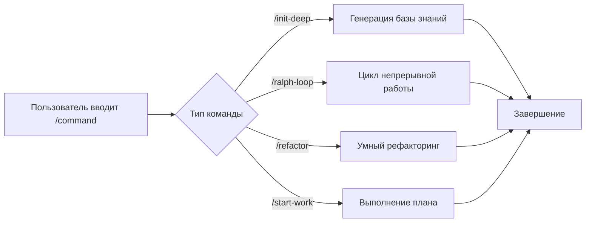

# Слэш-команды: Готовые рабочие процессы для выполнения в один клик

## Чему вы научитесь

- Использовать `/init-deep` для генерации базы знаний проекта в один клик
- Использовать `/ralph-loop` для непрерывной работы агентов до завершения задач
- Выполнять умный рефакторинг с помощью `/refactor`, автоматически проверяя каждый шаг
- Использовать `/start-work` для начала систематической разработки из планов Prometheus

## Ваша текущая проблема

При повторном выполнении одних и тех же сложных задач приходится каждый раз вводить длинные инструкции:

```
"Пожалуйста, помогите мне проанализировать структуру этого проекта, найти все ключевые модули, сгенерировать AGENTS.md для каждого каталога, затем параллельно исследовать паттерны кодовой базы..."
```

Такие длинные инструкции отнимают время и подвержены пропуску шагов.

## Когда использовать этот подход

**Слэш-команды** — это готовые шаблоны рабочих процессов, которые запускают сложные задачи в один клик. Эти команды охватывают распространённые сценарии разработки:

| Сценарий | Команда для использования |
|----------|---------------------------|
| Инициализация базы знаний проекта | `/init-deep` |
| Непрерывная работа ИИ | `/ralph-loop` |
| Умный рефакторинг кода | `/refactor` |
| Начало работы из плана | `/start-work` |

## Основные концепции

**Слэш-команды** — это предопределённые шаблоны рабочих процессов, которые быстро выполняют сложные задачи через триггерные слова, начинающиеся с `/`.

**Как это работает**:



oh-my-opencode включает 6 встроенных слэш-команд:

| Команда | Функция | Сложность |
|---------|---------|-----------|
| `/init-deep` | Генерация иерархических файлов AGENTS.md | Средняя |
| `/ralph-loop` | Цикл самореференциальной разработки | Высокая |
| `/ulw-loop` | Ultrawork-версия ralph-loop | Высокая |
| `/cancel-ralph` | Отмена активного цикла Ralph | Низкая |
| `/refactor` | Умный рефакторинг с полным набором инструментов | Высокая |
| `/start-work` | Начало работы из плана Prometheus | Средняя |

::: info Пользовательские команды
Кроме встроенных команд, вы можете создавать пользовательские команды (Markdown-файлы) в каталогах `.opencode/command/` или `.claude/commands/`.
:::

## 🎒 Предварительные требования

- ✅ oh-my-opencode установлен
- ✅ Настроен хотя бы один провайдер ИИ
- ✅ Базовое понимание использования агентов (рекомендуется сначала изучить [Начало работы с Sisyphus: Основной оркестратор](../sisyphus-orchestrator/))

## Следуйте инструкциям

### Шаг 1: Генерация базы знаний проекта

**Зачем**
Агентам ИИ необходимо понимать структуру проекта и соглашения для эффективной работы. Команда `/init-deep` автоматически анализирует проект и генерирует иерархические файлы AGENTS.md.

**Введите в OpenCode**:

```
/init-deep
```

**Что вы должны увидеть**: Агент начинает параллельный анализ структуры проекта, исследует паттерны кода и генерирует файлы AGENTS.md.

**Расширенное использование**:

```bash
# Перегенерировать все файлы (удалить существующие)
/init-deep --create-new

# Ограничить глубину генерации
/init-deep --max-depth=2
```

**Пример вывода**:

```
=== init-deep Complete ===

Mode: update

Files:
  [OK] ./AGENTS.md (root, 120 lines)
  [OK] ./src/hooks/AGENTS.md (45 lines)
  [OK] ./src/agents/AGENTS.md (38 lines)

Dirs Analyzed: 12
AGENTS.md Created: 3
```

### Шаг 2: Непрерывная работа ИИ

**Зачем**
Некоторые задачи требуют нескольких итераций для завершения (например, исправление сложных ошибок). Команда `/ralph-loop` заставляет агента работать непрерывно до завершения задачи, вместо остановки на полпути.

**Введите в OpenCode**:

```
/ralph-loop "Исправьте проблему с аутентификацией на странице входа, убедитесь, что все случаи ошибок обработаны"
```

**Что вы должны увидеть**: Агент начинает работу и автоматически продолжает после завершения, пока не будет выведен маркер завершения.

**Расширенное использование**:

```bash
# Пользовательский маркер завершения
/ralph-loop "Напишите модульные тесты" --completion-promise="TESTS_DONE"

# Ограничить максимальное количество итераций
/ralph-loop "Оптимизируйте производительность" --max-iterations=50
```

**Ultrawork-версия** (активирует всех профессиональных агентов):

```bash
/ulw-loop "Разработайте REST API с аутентификацией, авторизацией и ограничением частоты запросов"
```

**Контрольная точка** ✅

- Продолжает ли агент автоматически после каждой итерации?
- Видите ли вы приглашение "Ralph Loop Complete!" при завершении?

### Шаг 3: Отмена цикла

**Зачем**
Если направление задачи неверное или требуется ручное вмешательство, нужно отменить цикл.

**Введите в OpenCode**:

```
/cancel-ralph
```

**Что вы должны увидеть**: Цикл останавливается, а файлы состояния очищаются.

### Шаг 4: Умный рефакторинг

**Зачем**
При рефакторинге кода слепые изменения могут внести ошибки. Команда `/refactor` использует полный набор инструментов (LSP, AST-Grep, проверка тестов) для обеспечения безопасного рефакторинга.

**Введите в OpenCode**:

```bash
# Переименовать символ
/refactor "Рефакторинг класса AuthService в UserService"

# Рефакторинг модуля
/refactor src/auth --scope=module --strategy=safe

# Рефакторинг с сопоставлением паттернов
/refactor "Мигрировать все места, использующие устаревший API, на новый API"
```

**Что вы должны увидеть**: Агент выполняет 6-этапный процесс рефакторинга:

1. **Шлюз намерений** — Подтверждение целей рефакторинга
2. **Анализ кодовой базы** — Параллельное исследование зависимостей
3. **Построение карты кода** — Картирование области влияния
4. **Оценка тестов** — Проверка покрытия тестами
5. **Генерация плана** — Создание детального плана рефакторинга
6. **Выполнение рефакторинга** — Пошаговое выполнение с проверкой

**Расширенное использование**:

```bash
# Агрессивная стратегия (позволяет большие изменения)
/refactor "Архитектурный рефакторинг" --strategy=aggressive

# Область действия файлов
/refactor "Оптимизировать функции в utils.ts" --scope=file
```

::: warning Требование покрытия тестами
Если покрытие тестами целевого кода ниже 50%, `/refactor` откажется выполнять агрессивную стратегию. Рекомендуется сначала добавить тесты.
:::

### Шаг 5: Начало работы из плана

**Зачем**
После планирования с Prometheus необходимо систематически выполнять задачи из плана. Команда `/start-work` автоматически загружает план и использует агента Atlas для его выполнения.

**Введите в OpenCode**:

```bash
# Автоматический выбор одного плана
/start-work

# Выбор конкретного плана
/start-work "auth-api-plan"
```

**Что вы должны увидеть**:

- Если только один план: автоматический выбор и начало выполнения
- Если несколько планов: список всех планов для выбора

**Пример вывода**:

```
Available Work Plans

Current Time: 2026-01-26T10:30:00Z
Session ID: abc123

1. [auth-api-plan.md] - Modified: 2026-01-25 - Progress: 3/10 tasks
2. [migration-plan.md] - Modified: 2026-01-26 - Progress: 0/5 tasks

Which plan would you like to work on? (Enter number or plan name)
```

**Контрольная точка** ✅

- Правильно ли загружен план?
- Выполняются ли задачи по порядку?
- Отмечены ли выполненные задачи?

## Распространённые ошибки

### Ошибка 1: `/init-deep` игнорирует существующие файлы

**Проблема**: В режиме по умолчанию `/init-deep` сохраняет существующие файлы AGENTS.md, обновляя или создавая только отсутствующие части.

**Решение**: Используйте параметр `--create-new` для перегенерации всех файлов.

### Ошибка 2: `/ralph-loop` бесконечный цикл

**Проблема**: Если агент не может завершить задачу, цикл продолжается до максимального количества итераций (по умолчанию 100).

**Решение**:
- Установите разумное значение `--max-iterations` (например, 20-30)
- Используйте `/cancel-ralph` для ручной отмены
- Предоставьте более чёткое описание задачи

### Ошибка 3: `/refactor` низкое покрытие тестами

**Проблема**: Целевой код не имеет тестов, рефакторинг завершится неудачей.

**Решение**:
```bash
# Позвольте агенту сначала добавить тесты
"Пожалуйста, добавьте исчерпывающие модульные тесты для AuthService, охватывающие все граничные случаи"

# Затем выполните рефакторинг
/refactor "Рефакторинг класса AuthService"
```

### Ошибка 4: `/start-work` не может найти план

**Проблема**: Планы, сгенерированные Prometheus, не сохранены в каталоге `.sisyphus/plans/`.

**Решение**:
- Проверьте, включает ли вывод Prometheus путь к файлу плана
- Убедитесь, что расширение файла плана — `.md`

### Ошибка 5: Неверный формат параметров команды

**Проблема**: Позиция или формат параметров неверны.

**Решение**:
```bash
# ✅ Правильно
/ralph-loop "Описание задачи" --completion-promise=DONE

# ❌ Неправильно
/ralph-loop --completion-promise=DONE "Описание задачи"
```

## Резюме

| Команда | Основная функция | Частота использования |
|---------|------------------|----------------------|
| `/init-deep` | Автоматическая генерация базы знаний проекта | Начальная настройка |
| `/ralph-loop` | Цикл непрерывной работы | Высокая |
| `/ulw-loop` | Ultrawork-версия цикла | Средняя |
| `/cancel-ralph` | Отмена цикла | Низкая |
| `/refactor` | Безопасный умный рефакторинг | Высокая |
| `/start-work` | Выполнение планов Prometheus | Средняя |

**Лучшие практики**:
- Используйте `/init-deep` на новых проектах для создания базы знаний
- Используйте `/ralph-loop` для сложных задач, чтобы позволить ИИ работать непрерывно
- Предпочитайте `/refactor` при рефакторинге кода для обеспечения безопасности
- Используйте `/start-work` с Prometheus для систематической разработки

## Что дальше

> В следующем уроке мы изучим **[Расширенная конфигурация](../advanced-configuration/)**.
>
> Вы узнаете:
> - Как переопределить модели и промпты агентов по умолчанию
> - Как настроить разрешения и ограничения безопасности
> - Как настроить Категории и Навыки
> - Как настроить управление параллелизмом фоновых задач

---

## Приложение: Справочник по исходному коду

<details>
<summary><strong>Нажмите, чтобы раскрыть расположения исходного кода</strong></summary>

> Обновлено: 2026-01-26

| Функция | Путь к файлу | Номера строк |
|---------|--------------|--------------|
| Определения команд | [`src/features/builtin-commands/commands.ts`](https://github.com/code-yeongyu/oh-my-opencode/blob/main/src/features/builtin-commands/commands.ts) | 8-73 |
| Загрузчик команд | [`src/features/builtin-commands/index.ts`](https://github.com/code-yeongyu/oh-my-opencode/blob/main/src/features/builtin-commands/index.ts) | 75-89 |
| Шаблон init-deep | [`src/features/builtin-commands/templates/init-deep.ts`](https://github.com/code-yeongyu/oh-my-opencode/blob/main/src/features/builtin-commands/templates/init-deep.ts) | Полный текст |
| Шаблон ralph-loop | [`src/features/builtin-commands/templates/ralph-loop.ts`](https://github.com/code-yeongyu/oh-my-opencode/blob/main/src/features/builtin-commands/templates/ralph-loop.ts) | Полный текст |
| Шаблон refactor | [`src/features/builtin-commands/templates/refactor.ts`](https://github.com/code-yeongyu/oh-my-opencode/blob/main/src/features/builtin-commands/templates/refactor.ts) | Полный текст |
| Шаблон start-work | [`src/features/builtin-commands/templates/start-work.ts`](https://github.com/code-yeongyu/oh-my-opencode/blob/main/src/features/builtin-commands/templates/start-work.ts) | Полный текст |
| Реализация хука Ralph Loop | [`src/hooks/ralph-loop/index.ts`](https://github.com/code-yeongyu/oh-my-opencode/blob/main/src/hooks/ralph-loop/index.ts) | Полный текст |
| Определения типов команд | [`src/features/builtin-commands/types.ts`](https://github.com/code-yeongyu/oh-my-opencode/blob/main/src/features/builtin-commands/types.ts) | Полный текст |

**Ключевые функции**:
- `loadBuiltinCommands()`: Загружает определения встроенных команд, поддерживает отключение определённых команд
- `createRalphLoopHook()`: Создаёт хуки жизненного цикла Ralph Loop
- `startLoop()`: Запускает цикл, устанавливает состояние и параметры
- `cancelLoop()`: Отменяет активный цикл, очищает файлы состояния

**Ключевые константы**:
- `DEFAULT_MAX_ITERATIONS = 100`: Максимальное количество итераций по умолчанию
- `DEFAULT_COMPLETION_PROMISE = "DONE"`: Маркер завершения по умолчанию

**Расположение конфигурации**:
- Отключение команд: поле `disabled_commands` в `oh-my-opencode.json`
- Конфигурация цикла: объект `ralph_loop` в `oh-my-opencode.json`

</details>
