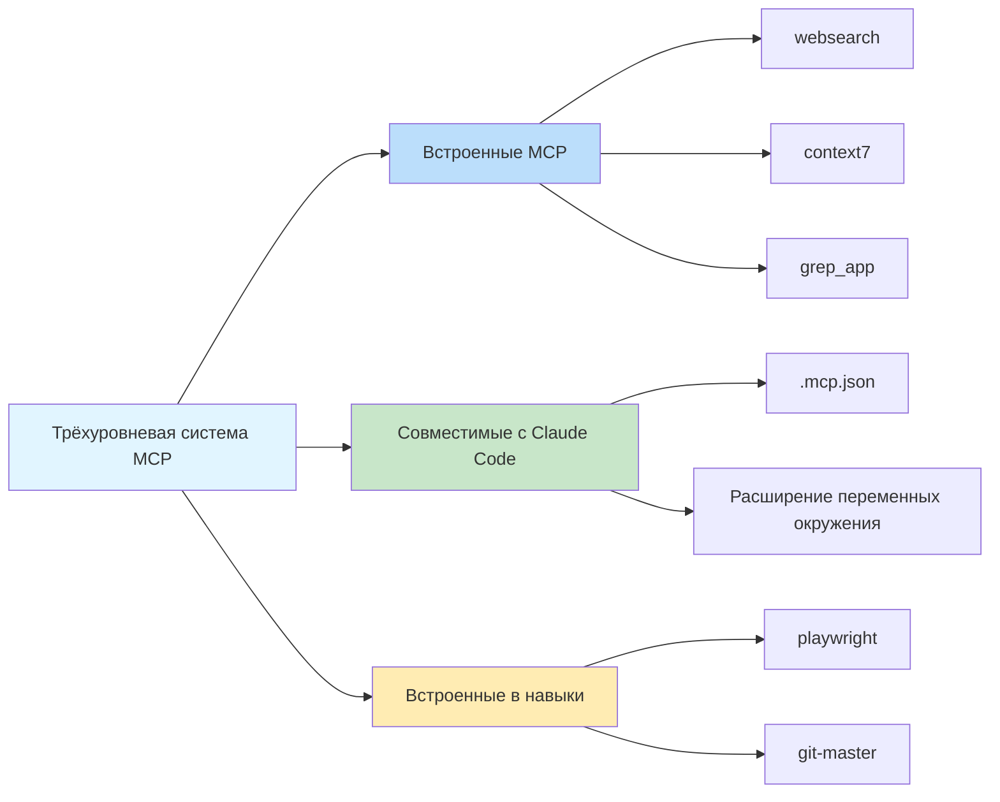

# Встроенные MCP-серверы: веб-поиск, запрос документации и поиск кода

## Чему вы научитесь

- ✅ Понимать 3 встроенных MCP-сервера и их варианты использования
- ✅ Настроить Exa API Key для веб-поиска
- ✅ Отключать ненужные MCP-сервисы
- ✅ Понимать архитектуру и принципы работы трёхуровневой системы MCP

## Ваша текущая задача

AI-агенты могут получать доступ только к локальным файлам и выполнять сетевые запросы, но им не хватает профессиональных возможностей поиска и запроса документации. Вы хотите, чтобы агенты могли:
- Выполнять веб-поиск в реальном времени для получения актуальной информации
- Консультироваться с официальной документацией для точных описаний API
- Искать в репозиториях GitHub примеры реализации

Но ручная реализация этих функций увеличивает сложность разработки.

## Когда использовать этот подход

Когда вам нужно расширить возможности AI-агентов:

| Сценарий | Рекомендуемый MCP |
|--- | ---|
| Необходимо получить актуальную техническую информацию, новости или отраслевые тенденции | **websearch** (Exa) |
| Запрос официальной документации API для библиотек или фреймворков | **context7** |
| Поиск примеров реализации в репозиториях GitHub | **grep_app** (Grep.app) |

## Основные концепции: что такое MCP?

**MCP (Model Context Protocol)** — это стандартный протокол, позволяющий AI-агентам получать доступ к внешним инструментам и источникам данных. Проще говоря:

::: info Что такое MCP?
MCP — это как оснащение AI-агента "инструментальным ящиком", содержащим различные профессиональные инструменты (поиск, базы данных, API и т.д.). Агенты могут вызывать эти инструменты по требованию для получения возможностей, недоступных локально.
:::

Oh-My-OpenCode предоставляет **трёхуровневую систему MCP**:



**Этот урок фокусируется на первом уровне: встроенные MCP-серверы.**

---

## Три встроенных MCP-сервера

Oh-My-OpenCode включает 3 удалённых MCP-сервера, которые работают из коробки (некоторые требуют настройки API Key).

### 1. websearch (Exa AI)

**Функция**: Веб-поиск в реальном времени на базе [Exa AI](https://exa.ai).

**Варианты использования**:
- Поиск актуальных технических статей и новостей
- Поиск решений конкретных проблем
- Получение отраслевых тенденций и лучших практик

**Требования к настройке**:

Вам необходимо установить переменную окружения `EXA_API_KEY`:

::: code-group

```bash [macOS/Linux]
export EXA_API_KEY="your-api-key-here"
```

```powershell [Windows]
setx EXA_API_KEY "your-api-key-here"
```

:::

::: tip Получение Exa API Key
1. Посетите [Exa AI](https://exa.ai)
2. Зарегистрируйте аккаунт
3. Создайте API Key в Dashboard
4. Добавьте ключ в переменные окружения
:::

**Расположение исходного кода**: `src/mcp/websearch.ts` (строки 1-11)

---

### 2. context7

**Функция**: Запрос официальной документации, поддерживает любую библиотеку программирования или фреймворк.

**Варианты использования**:
- Запрос документации API для React, Vue, Next.js и т.д.
- Получение официальной документации для сред выполнения, таких как Node.js, Python
- Консультирование руководств по использованию проектов с открытым исходным кодом

**Требования к настройке**: Настройка не требуется, работает из коробки.

**Расположение исходного кода**: `src/mcp/context7.ts` (строки 1-7)

---

### 3. grep_app (Grep.app)

**Функция**: Сверхбыстрый поиск кода в GitHub для поиска примеров реализации.

**Варианты использования**:
- Поиск конкретных шаблонов реализации в проектах с открытым исходным кодом
- Изучение того, как другие пишут код
- Поиск фрагментов кода для решения конкретных проблем

**Требования к настройке**: Настройка не требуется, работает из коробки.

**Расположение исходного кода**: `src/mcp/grep-app.ts` (строки 1-7)

---

## Настройка и отключение MCP

### Поведение по умолчанию

Все встроенные MCP-серверы **включены по умолчанию**. Oh-My-OpenCode автоматически регистрирует эти сервисы при запуске.

### Отключение ненужных MCP

Если некоторые MCP-сервисы не нужны, вы можете отключить их в файле конфигурации:

```jsonc
// ~/.config/opencode/oh-my-opencode.json или .opencode/oh-my-opencode.json
{
  "$schema": "./assets/oh-my-opencode.schema.json",

  // Отключение ненужных MCP-серверов
  "disabled_mcps": [
    "websearch",    // Отключить веб-поиск (если у вас нет Exa API Key)
    "grep_app"      // Отключить поиск кода в GitHub
  ]
}
```

::: warning Зачем отключать MCP?
Отключение ненужных MCP может:
1. **Экономить ресурсы**: Сокращать ненужные подключения и запросы
2. **Упростить настройку**: Избегать запросов на неустановленные API Keys
3. **Повысить стабильность**: Сокращать потенциальные точки сбоя сети
:::

### Приоритет конфигурации

Приоритет отключения конфигурации для встроенных MCP:

| Местоположение конфигурации | Приоритет |
|--- | ---|
| Пользовательская конфигурация `~/.config/opencode/oh-my-opencode.json` | Высокий (переопределяет конфигурацию проекта) |
| Конфигурация проекта `.opencode/oh-my-opencode.json` | Средний |
| По умолчанию в коде | Низкий (все включены) |

---

## Как это работает: конфигурация удалённых MCP

Все встроенные MCP-серверы используют **удалённый (remote) режим**, подключаясь к внешним сервисам через протокол HTTP/SSE.

**Режим конфигурации** (определение исходного кода):

```typescript
// src/mcp/websearch.ts
export const websearch = {
  type: "remote" as const,        // Фиксировано как "remote"
  url: "https://mcp.exa.ai/mcp?tools=web_search_exa",  // Адрес MCP-сервера
  enabled: true,                   // Состояние включения (переопределяется disabled_mcps)
  headers: process.env.EXA_API_KEY  // Необязательные заголовки запроса (API Key)
    ? { "x-api-key": process.env.EXA_API_KEY }
    : undefined,
  oauth: false as const,            // Отключение автоопределения OAuth
}
```

**Описание полей конфигурации**:

| Поле | Тип | Описание |
|--- | --- | ---|
| `type` | `"remote"` | Фиксированное значение, указывающее на удалённый MCP |
| `url` | `string` | HTTP-адрес MCP-сервера |
| `enabled` | `boolean` | Включен ли (фиксировано как `true` в коде, управляется `disabled_mcps`) |
| `headers` | `object` | Необязательные заголовки HTTP-запроса (для аутентификации) |
| `oauth` | `false` | Отключение автоопределения OAuth (Exa использует API Key) |

---

## Распространённые ошибки

### Ошибка 1: websearch требует API Key

**Симптом**: Агент не работает при попытке использовать websearch, запрашивая отсутствующий API Key.

**Решение**:

```bash
# Проверить, установлена ли переменная окружения
echo $EXA_API_KEY

# Если пустая, установить API Key
export EXA_API_KEY="your-actual-api-key"

# Или добавить навсегда в конфигурацию оболочки (~/.bashrc, ~/.zshrc и т.д.)
echo 'export EXA_API_KEY="your-actual-api-key"' >> ~/.zshrc
```

::: tip Проверка API Key
После настройки вы можете перезапустить OpenCode или выполнить диагностическую команду для проверки:
```bash
oh-my-opencode doctor --verbose
```
:::

### Ошибка 2: MCP запрашивается после отключения

**Симптом**: Даже после отключения MCP агент всё ещё пытается его использовать.

**Решение**:

1. Проверьте, правильный ли путь к файлу конфигурации:
   - Пользовательская конфигурация: `~/.config/opencode/oh-my-opencode.json`
   - Конфигурация проекта: `.opencode/oh-my-opencode.json`

2. Подтвердите, что формат JSON правильный (обратите внимание на запятые и кавычки):

```jsonc
{
  "disabled_mcps": ["websearch"]  // ✅ Правильно
  // "disabled_mcps": ["websearch"],  // ❌ Ошибка: запятая в конце не допускается
}
```

3. Перезапустите OpenCode, чтобы конфигурация вступила в силу.

### Ошибка 3: Неверные результаты Grep.app

**Симптом**: grep_app возвращает результаты, не соответствующие ожиданиям.

**Возможные причины**:
- Ключевые слова поиска слишком общие
- Целевой репозиторий неактивен или удалён
- Неверный синтаксис поиска

**Решение**:
- Используйте более конкретные условия поиска
- Укажите тип файла или язык при поиске
- Посетите [Grep.app](https://grep.app) напрямую для ручной проверки

---

## Резюме

Этот урок представил 3 встроенных MCP-сервера Oh-My-OpenCode:

| MCP | Функция | Требования к настройке | Основное использование |
|--- | --- | --- | ---|
| **websearch** | Веб-поиск в реальном времени | EXA_API_KEY | Получение актуальной информации |
| **context7** | Запрос официальной документации | Нет | Консультирование документации API |
| **grep_app** | Поиск кода в GitHub | Нет | Поиск примеров реализации |

**Ключевые выводы**:

1. **Трёхуровневая система MCP**: Встроенные → Совместимые с Claude Code → Встроенные в навыки
2. **Включены по умолчанию**: Все встроенные MCP включены по умолчанию и могут быть отключены через `disabled_mcps`
3. **Удалённый режим**: Все встроенные MCP используют протокол HTTP/SSE для подключения к внешним сервисам
4. **Exa требует ключ**: websearch требует переменную окружения `EXA_API_KEY`

Эти MCP-серверы значительно расширяют возможности AI-агентов, позволяя им получать доступ к информации в реальном времени и профессиональным базам знаний.

---

## Приложение: справочник по исходному коду

<details>
<summary><strong>Нажмите, чтобы раскрыть расположения исходного кода</strong></summary>

> Обновлено: 2026-01-26

| Функция | Путь к файлу | Номера строк |
|--- | --- | ---|
| Фабричная функция MCP | [`src/mcp/index.ts`](https://github.com/code-yeongyu/oh-my-opencode/blob/main/src/mcp/index.ts) | 22-32 |
| Конфигурация websearch | [`src/mcp/websearch.ts`](https://github.com/code-yeongyu/oh-my-opencode/blob/main/src/mcp/websearch.ts) | 1-11 |
| Конфигурация context7 | [`src/mcp/context7.ts`](https://github.com/code-yeongyu/oh-my-opencode/blob/main/src/mcp/context7.ts) | 1-7 |
| Конфигурация grep_app | [`src/mcp/grep-app.ts`](https://github.com/code-yeongyu/oh-my-opencode/blob/main/src/mcp/grep-app.ts) | 1-7 |
| McpNameSchema | [`src/mcp/types.ts`](https://github.com/code-yeongyu/oh-my-opencode/blob/main/src/mcp/types.ts) | 1-10 |
| Поле disabled_mcps | [`src/config/schema.ts`](https://github.com/code-yeongyu/oh-my-opencode/blob/main/src/config/schema.ts) | 331 |

**Ключевые константы**:
- `allBuiltinMcps`: Объект конфигурации встроенных MCP, включая websearch, context7, grep_app (`src/mcp/index.ts:16-20`)

**Ключевые функции**:
- `createBuiltinMcps(disabledMcps)`: Создание списка включённых MCP, фильтрация отключённых MCP (`src/mcp/index.ts:22-32`)

</details>
