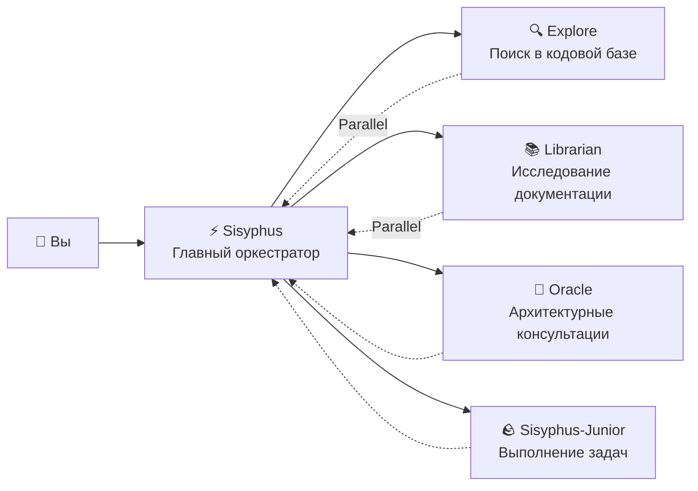

# Главный оркестратор: Думайте и действуйте как старший инженер

## Что вы узнаете

- Понять, как Sisyphus координирует работу как настоящая команда разработки
- Освоить лучшие практики делегирования задач, позволяя разным экспертным агентам совместно выполнять сложные задачи
- Узнать, как значительно повысить эффективность разработки за счёт параллельного выполнения фоновых задач
- Понять, когда позволить агентам выполнять задачи самостоятельно, а когда делегировать экспертам

## Ваши текущие проблемы

Возможно, вы сталкивались с этими проблемами:

- AI-агенты "сдаются на полпути" и забывают о своих целях во время написания кода
- Один и тот же файл модифицируется многократно, треб каждый раз повторного чтения контекста
- Вы хотите, чтобы AI обрабатывал много задач, но можете ставить их в очередь только по одной
- Агенты пишут код, но вам всё равно нужно проверять, правильный ли он, и не ломает ли он другие функции

**Корневая причина**: Вы просите "мастера на все руки" выполнить всю работу, но только эксперты по-настоящему понимают специализированные задачи.

## Когда использовать это

Sisyphus — ваш главный оркестратор, подходящий для этих сценариев:

| Сценарий | Подходит | Альтернатива |
|--- | --- | ---|
| Разработка сложных функций (3+ шага) | ✅ Настоятельно рекомендуется | Prometheus + Atlas (требуется детальное планирование) |
| Быстрое исправление известных ошибок | ✅ Подходит | Позвольте Sisyphus обработать это напрямую |
| Необходимо исследовать несколько репозиториев/документов | ✅ Настоятельно рекомендуется | Используйте параллельное делегирование Sisyphus |
| Простые модификации одного файла | ✅ Приемлемо | Прямое редактирование (проще) |
| Необходимо детальное планирование проекта | ⚠️ Не рекомендуется | Сначала используйте Prometheus для генерации плана |

## Основные концепции

**Sisyphus** — это главный оркестратор-агент, который координирует нескольких AI-экспертов как настоящая команда разработки. Благодаря разделению ответственности и механизму параллельного делегирования, он позволяет профессиональным субагентам использовать их сильные стороны, обеспечивая эффективное сотрудничество.

Sisyphus — не "умнее AI", это **система оркестрации**.

### Разделение ответственности



**Sisyphus не пишет код**. Он отвечает за:

1. **Понимание ваших реальных потребностей** (не только поверхностных запросов)
2. **Определение, кто лучше всего подходит для задачи** (не выполнять всё самостоятельно)
3. **Параллельное делегирование задач** (позволяя нескольким экспертам работать одновременно)
4. **Проверку результатов** (никогда не доверять слепо "Я закончил")

### Почему имя Sisyphус?

В греческой мифологии Сизиф был наказан вечно толкать камень в гору.

Философия дизайна этой системы: **Агенты должны завершить все задачи TODO (закончить толкать камень), прежде чем они смогут остановиться**.

::: info
Это не наказание — это механизм обеспечения качества. Вы не хотите, чтобы AI сдавался на полпути и оставлял за собой беспорядок.
:::

### Бюджет мышления 32k

Sisyphus использует **Claude Opus 4.5 + бюджет мышления 32k**.

В чём польза?

| Низкий бюджет (без мышления) | Бюджет мышления 32k |
|--- | ---|
| Сразу начинает писать код | Сначала глубоко анализирует требования, оценивает сложность, разбивает задачи |
| Склонен пропускать крайние случаи | Проактивно выявляет потенциальные проблемы и риски |
| Половину пути понимает, что идёт не в ту сторону | С самого начала выбирает оптимальный подход |

::: tip
Настоятельно рекомендуется настроить модель **Opus 4.5** для Sisyphus. С другими моделями опыт будет значительно хуже.
:::

## Следуйте за нами

### Шаг 1: Создайте тестовый проект

**Зачем**
Вам нужен рабочий проект, чтобы наблюдать за поведением Sisyphус.

```bash
mkdir my-app && cd my-app
npm create next-app@latest . -- --typescript --tailwind --eslint --no-src-dir
npm install
```

**Вы должны увидеть**: Инициализация проекта завершена, вы можете запустить `npm run dev` для начала.

### Шаг 2: Дайте Sisyphus сложную задачу

Откройте проект в OpenCode и введите:

```
Добавьте функциональность входа пользователя, включая:
- Вход по электронной почте/паролю
- Хранение JWT-токена
- Защищённые маршруты
- Проверка статуса входа
```

Наблюдайте за ответом Sisyphus.

**Вы должны увидеть**:

1. Sisyphus не сразу начинает писать код
2. Сначала он создаёт список TODO (детальное разбиение задач)
3. Оценивает паттерны кодовой базы (проверяет конфигурацию, структуру файлов)
4. Может задать вам несколько уточняющих вопросов

**Контрольная точка ✅**: Проверьте панель TODO в OpenCode, вы должны увидеть что-то вроде:

```
□ Установить необходимые зависимости (bcrypt, jsonwebtoken)
□ Создать модель пользователя и определения типов
□ Реализовать API-эндпоинт входа
□ Создать утилиты подписи и проверки JWT
□ Добавить middleware для защищённых маршрутов
□ Реализовать форму входа на фронтенде
□ Добавить управление состоянием входа
```

### Шаг 3: Наблюдайте за параллельным делегированием (критический момент)

Во время реализации Sisyphus может:

```
[Фоновая задача запущена]
- ID задачи: bg_abc123
- Агент: explore
- Запрос: "Найти существующие паттерны аутентификации в этой кодовой базе..."

[Фоновая задача запущена]
- ID задачи: bg_def456
- Агент: librarian
- Запрос: "Исследовать лучшие практики JWT для Next.js..."
```

**Это ключевой момент**: Sisyphus **не ждёт** завершения этих задач — он продолжает работать.

Когда нужны результаты, он вызывает `background_output(task_id="...")` для их получения.

**Почему это быстрее?**

| Последовательный подход (традиционный) | Параллельный подход (Sisyphus) |
|--- | ---|
| Поиск в кодовой базе (2 мин) | ⏳ Поиск в кодовой базе (2 мин) |
| Ожидание... | ⏳ Исследование документации (2 мин, параллельно) |
| Исследование документации (2 мин) | Начало реализации (всего 2 мин) |
| Начало реализации (2 мин) |  |
| **Всего: 6 мин** | **Всего: 4 мин (экономия 33%)** |

### Шаг 4: Механизм проверки

Когда Sisyphus заявляет "задача завершена", он:

1. Запускает `lsp_diagnostics` для проверки ошибок
2. Запускает `npm run build` для обеспечения прохождения сборки
3. Запускает набор тестов, если тесты существуют
4. Помечает TODO как `completed`

**Контрольная точка ✅**: Проверьте вывод терминала, вы должны увидеть что-то вроде:

```
✓ Запуск диагностики изменённых файлов...
✓ Ошибок не найдено
✓ Сборка прошла успешно (код выхода 0)
✓ Все тесты пройдены
```

Если любая проверка не проходит, Sisyphus немедленно исправит это — никогда не оставляя за собой беспорядок.

### Шаг 5: Распространённые ошибки

#### ❌ Неправильная практика: Прерывать отслеживание TODO Sisyphus

Вы видите, что Sisyphus работает над задачами, и вы нетерпеливы:

```
Пиши код быстрее! Перестань планировать!
```

**Проблема**: Sisyphus пропустит TODO и напишет код напрямую, потенциально пропустив крайние случаи.

**Правильная практика**:

```
Дождитесь завершения планирования Sisyphus. Если вы считаете, что план неверен, дайте конкретные предложения по улучшению:
"Шаг 3 в TODO должен сначала рассмотреть план миграции базы данных."
```

#### ❌ Неправильная практика: Не позволять Sisyphus делегировать

Вы отключили всех экспертных агентов в конфигурации, оставив только Sisyphus.

**Проблема**: Sisyphus попытается сделать всё самостоятельно, но может быть недостаточно профессиональным.

**Правильная практика**:

Сохраните конфигурацию по умолчанию и позвольте Sisyphus автоматически делегировать экспертам:

| Задача | Сам Sisyphus | Делегировать эксперту |
|--- | --- | ---|
| Простая модификация одного файла | ✅ OK | Не нужно |
| Поиск в кодовой базе | ⚠️ Медленно | ✅ Explore (быстрее) |
| Исследование документации | ⚠️ Может быть неточным | ✅ Librarian (более профессионально) |
| Архитектурные решения | ❌ Не рекомендуется | ✅ Oracle (более авторитетно) |

## Итоги урока

Сила Sisyphus не в том, что он "умнее", а в том, что:

1. **Разделение ответственности**: Главный оркестратор + профессиональная команда, а не работа в одиночку
2. **Глубокое мышление**: Бюджет мышления 32k гарантирует, что не будет пропущено никаких деталей
3. **Параллельное выполнение**: Фоновые задачи позволяют нескольким экспертам работать одновременно
4. **Обязательная проверка**: Нет доказательств = задача не завершена
5. **Отслеживание TODO**: Сдача на полпути не допускается

**Основные принципы**:

::: tip
**Делегировать по умолчанию**: Если задача не является чрезвычайно простой (один файл, известное расположение), приоритет делегирования экспертам или использования Category+Skill.
:::

## Предпросмотр следующего урока

> В следующем уроке мы изучим **[Ultrawork Mode](../ultrawork-mode/)** для активации всех функций одним щелчком, позволяя Sisyphus приложить максимум усилий для выполнения сложных задач.
>
> Вы узнаете:
> - Как быстро начать задачи с помощью ключевого слова `ultrawork`
> - Какие дополнительные возможности активирует режим Ultrawork
> - Когда использовать Ultrawork, а когда использовать Prometheus

---

## Приложение: Ссылка на исходный код

<details>
<summary><strong>Нажмите, чтобы раскрыть расположения исходного кода</strong></summary>

> Последнее обновление: 2026-01-26

| Функция | Путь к файлу | Строки |
|--- | --- | ---|
| Фабрика агента Sisyphus | [`src/agents/sisyphus.ts`](https://github.com/code-yeongyu/oh-my-opencode/blob/main/src/agents/sisyphus.ts) | 419-450 |
| Основной промпт Sisyphus | [`src/agents/sisyphus.ts`](https://github.com/code-yeongyu/oh-my-opencode/blob/main/src/agents/sisyphus.ts) | 17-416 |
| Метаданные агента и конфигурация модели | [`src/agents/AGENTS.md`](https://github.com/code-yeongyu/oh-my-opencode/blob/main/src/agents/AGENTS.md) | 24-36 |
| Ограничения разрешений инструментов | [`src/agents/AGENTS.md`](https://github.com/code-yeongyu/oh-my-opencode/blob/main/src/agents/AGENTS.md) | 44-51 |

**Ключевая конфигурация**:
- **Бюджет мышления**: 32k токенов (только модели Anthropic)
- **Temperature**: 0.1 (агенты кода с фиксированной низкой температурой)
- **Max Tokens**: 64000
- **Рекомендуемая модель**: anthropic/claude-opus-4-5

**Основной рабочий процесс** (из исходного кода):
- **Фаза 0**: Шлюз намерений (классификация намерений, строки 53-103)
- **Фаза 1**: Оценка кодовой базы (оценка кодовой базы, строки 107-130)
- **Фаза 2A**: Исследование и анализ (строки 132-172)
- **Фаза 2B**: Реализация (строки 176-263)
- **Фаза 2C**: Восстановление после сбоя (строки 266-283)
- **Фаза 3**: Завершение (строки 286-302)

**Ключевые ограничения**:
- **Нетривиальные задачи должны создавать TODO** (строка 311)
- **Фоновые задачи должны быть параллельными** (строки 144-162)
- **Необходимо проверять результаты** (строки 254-262)

</details>
