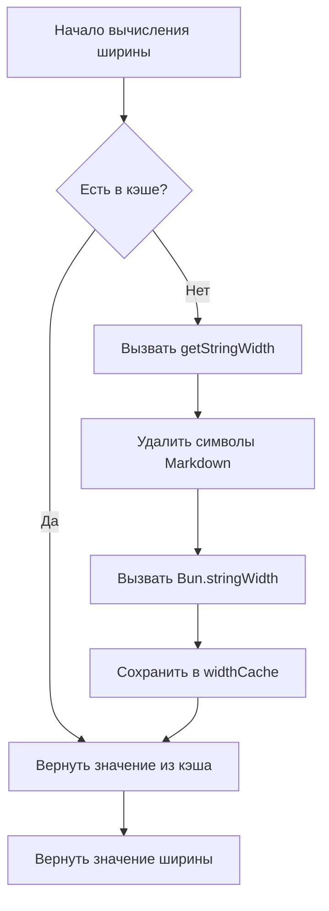

# Технические детали: Механизм кэширования и оптимизация производительности

## Что вы узнаете

- Как механизм кэширования плагина повышает производительность
- Структуру данных widthCache и способы её использования
- Условия срабатывания автоматической очистки кэша
- Как анализировать эффективность оптимизации производительности

## Ваша текущая ситуация

Возможно, вам интересно:

> Как плагин быстро вычисляет ширину таблиц? Почему обработка больших таблиц остаётся плавной? Как спроектирован механизм кэширования?

В этом уроке мы подробно проанализируем внутреннюю реализацию плагина и поможем вам понять концепцию дизайна механизма кэширования и стратегии оптимизации производительности.

## Основная концепция

### Зачем нужно кэширование?

При форматировании таблиц Markdown плагину необходимо вычислить **отображаемую ширину** (display width) каждой ячейки. Этот расчёт включает:

1. **Удаление символов Markdown**: таких как `**жирный**`, `*курсив*`, `~~зачёркнутый~~`
2. **Защита встроенного кода**: символы Markdown внутри `` `код` `` остаются неизменными
3. **Вызов `Bun.stringWidth()`**: вычисление отображаемой ширины Unicode-символов (включая Emoji и китайские иероглифы)

**Проблема**: одно и то же содержимое ячейки может повторяться многократно (например, названия столбцов в заголовках), и каждый раз выполнять эти операции будет медленно.

**Решение**: использование кэша (Map) для хранения отображения "текстовое содержимое → отображаемая ширина" для предотвращения повторных вычислений.

## Структура данных кэша

Плагин использует две глобальные переменные для управления кэшем:

### widthCache

```typescript
const widthCache = new Map<string, number>()
```

**Назначение**: кэширование результатов вычисления отображаемой ширины строк

**Структура**:
- **Key**: исходное текстовое содержимое ячейки (включая весь синтаксис Markdown)
- **Value**: вычисленная отображаемая ширина (количество символов)

**Пример**:

| Исходный текст (Key) | Отображаемая ширина (Value) | Примечание |
| --- | --- | --- |
| `**Имя**` | 4 | Ширина после удаления `**` равна 4 |
| `*Возраст*` | 4 | Ширина после удаления `*` равна 4 |
| `` `status` `` | 8 | Символы кода тоже учитываются в ширине |
| `Чжан Сан` | 4 | Ширина китайского символа равна 1 |

### cacheOperationCount

```typescript
let cacheOperationCount = 0
```

**Назначение**: отслеживание количества операций кэша для запуска автоматической очистки

**Порог очистки**:
- количество операций > 100 или
- количество записей в кэше > 1000

## Процесс поиска в кэше

### Функция calculateDisplayWidth

Когда необходимо вычислить ширину ячейки, плагин вызывает функцию `calculateDisplayWidth()`, которая выполняет следующий процесс:

<details>
<summary><strong>📖 Просмотр полного кода</strong></summary>

```typescript
function calculateDisplayWidth(text: string): number {
  if (widthCache.has(text)) {
    return widthCache.get(text)!  // Попадание в кэш, прямой возврат
  }

  const width = getStringWidth(text)  // Вычисление фактической ширины
  widthCache.set(text, width)          // Сохранение в кэш
  return width
}
```

</details>

**Диаграмма процесса**:



**Разбор шагов**:

| Шаг | Операция | Временная сложность |
| --- | --- | --- |
| 1 | Проверка `widthCache.has(text)` | O(1) |
| 2 | Попадание в кэш → прямой возврат | O(1) |
| 3 | Промах кэша → вычисление ширины | O(n) |
| 4 | Сохранение в кэш | O(1) |

**Ключевые моменты**:
- **При попадании в кэш**: прямой возврат без вычислений (O(1))
- **При промахе кэша**: выполнение полной логики вычисления ширины (O(n))
- **Хранение исходного текста**: ключ — полный Markdown-текст для точного соответствия

## Механизм очистки кэша

### Зачем нужно очищать кэш?

Хотя кэш может повысить производительность, он занимает память. Без очистки:
- **Непрерывный рост использования памяти**: каждое новое содержимое ячейки кэшируется
- **Возможное наличие ненужных данных**: старое содержимое таблиц может больше не понадобиться

### Условия срабатывания автоматической очистки

После каждого завершения форматирования плагин вызывает `incrementOperationCount()` для обновления счётчика операций:

<details>
<summary><strong>📖 Просмотр кода очистки</strong></summary>

```typescript
function incrementOperationCount() {
  cacheOperationCount++

  if (cacheOperationCount > 100 || widthCache.size > 1000) {
    cleanupCache()
  }
}

function cleanupCache() {
  widthCache.clear()
  cacheOperationCount = 0
}
```

</details>

**Условия срабатывания** (выполнение любого условия):

| Условие | Порог | Примечание |
| --- | --- | --- |
| Количество операций | > 100 операций форматирования | Предотвращение частого срабатывания очистки |
| Записи в кэше | > 1000 ячеек | Предотвращение чрезмерного использования памяти |

**Стратегия очистки**:
- **Полная очистка**: `widthCache.clear()` удаляет весь кэш
- **Сброс счётчика**: `cacheOperationCount = 0`

::: info Время очистки

Очистка кэша происходит **после каждого завершения форматирования**, а не во время форматирования. Это не прерывает текущую операцию форматирования.

:::

## Эффект оптимизации производительности

### Анализ коэффициента попаданий в кэш

Предположим таблицу 5 столбцов × 10 строк, где:

- **Повторяющееся содержимое**: названия столбцов заголовков повторяются 11 раз в строке разделителей и данных
- **Уникальное содержимое**: содержимое каждой ячейки различно

**Эффект кэширования**:

| Сценарий | Без кэша | С кэшем | Улучшение производительности |
| --- | --- | --- | --- |
| 5 столбцов × 10 строк (без повторов) | 50 вычислений | 50 вычислений | Нет |
| 5 столбцов × 10 строк (повтор заголовков) | 50 вычислений | 10 вычислений + 40 попаданий в кэш | ~80% |

### Фактическое влияние

**Преимущества кэширования**:

1. **Снижение вычислительных затрат**: предотвращение повторного удаления символов Markdown и вызова `Bun.stringWidth()`
2. **Снижение нагрузки на CPU**: `getStringWidth()` включает замену регулярных выражений и вычисление Unicode, что ресурсоёмко
3. **Повышение скорости отклика**: более заметно для таблиц с большим количеством повторяющихся ячеек

**Примеры сценариев**:

| Сценарий | Эффект кэширования |
| --- | --- |
| Таблица сравнения, созданная AI | ✅ Значительный эффект (много повторяющегося содержимого в столбцах) |
| Простая однострочная таблица | ⚪ Умеренный эффект (уникальное содержимое) |
| Таблица с вложенным Markdown | ✅ Значительный эффект (высокие затраты на удаление символов) |

## Рекомендации по оптимизации производительности

::: tip Советы для разработчиков

Если вам нужно дальнейшее повышение производительности, рассмотрите:

1. **Настройка порогов кэша**: регулировка пороговых значений `100` операций и `1000` записей в соответствии с фактическим размером таблиц
2. **LRU-кэш**: использование алгоритма вытеснения давно неиспользуемых элементов (Least Recently Used) вместо полной очистки
3. **Мониторинг производительности**: добавление логирования для статистики коэффициента попаданий в кэш и анализа фактической эффективности

:::

## Резюме урока

Плагин использует механизм кэширования `widthCache` для оптимизации производительности:

- **Структура хранения**: `Map<string, number>` отображает исходный текст в отображаемую ширину
- **Процесс поиска**: сначала проверяется кэш → при промахе вычисляется и сохраняется
- **Механизм очистки**: автоматическая очистка при > 100 операций или > 1000 записей
- **Повышение производительности**: снижение повторных вычислений и нагрузки на CPU

Этот механизм обеспечивает плавную работу плагина даже при обработке сложных таблиц и является ключевой реализацией оптимизации производительности.

## Анонс следующего урока

> В следующем уроке мы изучим **[Журнал изменений: История версий и записи об изменениях](../../changelog/release-notes/)**.
>
> Вы узнаете:
> - Историю эволюции версий плагина
> - Записи о новых функциях и исправлениях
> - Как отслеживать обновления плагина

---

## Приложение: Ссылки на исходный код

<details>
<summary><strong>Нажмите, чтобы развернуть и посмотреть расположение исходного кода</strong></summary>

> Обновлено: 2026-01-26

| Функция | Путь к файлу | Номер строки |
| --- | --- | --- |
| Определение widthCache | [`source/franlol/opencode-md-table-formatter/index.ts`](https://github.com/franlol/opencode-md-table-formatter/blob/main/index.ts#L6) | 6 |
| Определение cacheOperationCount | [`source/franlol/opencode-md-table-formatter/index.ts`](https://github.com/franlol/opencode-md-table-formatter/blob/main/index.ts#L7) | 7 |
| Функция calculateDisplayWidth | [`source/franlol/opencode-md-table-formatter/index.ts`](https://github.com/franlol/opencode-md-table-formatter/blob/main/index.ts#L151-L159) | 151-159 |
| Функция incrementOperationCount | [`source/franlol/opencode-md-table-formatter/blob/main/index.ts`](https://github.com/franlol/opencode-md-table-formatter/blob/main/index.ts#L219-L225) | 219-225 |
| Функция cleanupCache | [`source/franlol/opencode-md-table-formatter/index.ts`](https://github.com/franlol/opencode-md-table-formatter/blob/main/index.ts#L227-L230) | 227-230 |

**Ключевые константы**:
- `widthCache = new Map<string, number>()`：Структура Map для кэширования отображаемой ширины строк
- `cacheOperationCount = 0`：Счётчик операций кэша

**Ключевые функции**:
- `calculateDisplayWidth(text: string): number`：Вычисление отображаемой ширины (с кэшированием), сначала проверяет кэш, затем вычисляет
- `incrementOperationCount(): void`：Увеличение счётчика операций, запуск условной очистки
- `cleanupCache(): void`：Очистка widthCache и сброс счётчика

</details>
