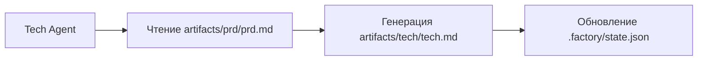

# Оптимизация контекста: выполнение по сессиям

## Что вы сможете делать после изучения

- Использовать команду `factory continue` для продолжения конвейера в новой сессии
- Понимать преимущества чистого контекста для каждого этапа
- Освоить методы значительного снижения потребления токенов
- Поддерживать восстановление после прерываний, приостанавливая и возобновляя работу в любое время

## Ваша текущая проблема

При выполнении полного 7-этапного конвейера в AI-ассистенте (например, Claude Code) вы можете столкнуться со следующими проблемами:

- **Токены заканчиваются**: по мере накопления диалога контекст становится всё длиннее, и каждый этап должен загружать содержимое всех предыдущих этапов
- **Растущие затраты**: длинные диалоги означают больше входных токенов, и расходы растут
- **Медленный отклик**: слишком длинный контекст может увеличить время отклика
- **Сложность восстановления**: если какой-либо этап завершился ошибкой, для перезапуска требуется повторная загрузка большого объёма контекста

::: tip Основная проблема
Накопление контекста в длинных диалогах — это встроенная особенность AI-ассистентов, но мы можем обойти эту проблему с помощью "выполнения по сессиям".
:::

## Когда использовать этот подход

| Сценарий | Использовать выполнение по сессиям | Причина |
| --- | --- | --- |
| Полное выполнение 7-этапного конвейера | ✅ Настоятельно рекомендуется | Каждый токен ценен |
| Выполнение только 1-2 этапов | ⚠️ Опционально | Контекст короткий, не всегда необходимо |
| Отладка определённого этапа | ⚠️ Опционально | Частые повторные попытки могут увеличить затраты на переключение сессий |
| Возобновление после длительного перерыва | ✅ Обязательно | Избежать загрузки устаревшего контекста |

## Основная идея

Agent App Factory поддерживает **выполнение по сессиям**, основная идея которого заключается в следующем:

**После завершения каждого этапа используйте новую сессию для выполнения следующего этапа.**

Преимущества этого подхода:

1. **Чистый контекст**: каждый этап загружает только необходимые входные файлы, не завися от истории диалога
2. **Экономия токенов**: избегает повторной передачи AI содержимого всех предыдущих этапов
3. **Возможность восстановления**: можно прервать работу в любой момент и позже продолжить в новой сессии без потери прогресса
4. **Кроссплатформенная совместимость**: работает со всеми AI-ассистентами (Claude Code, OpenCode, Cursor и др.)

### Стратегия изоляции контекста

Для реализации выполнения по сессиям Agent App Factory использует **стратегию изоляции контекста**:

::: info Что такое изоляция контекста?
Изоляция контекста означает, что каждый Agent зависит только от файловых входных данных, а не от истории диалога. Независимо от того, что произошло ранее, Agent считывает информацию только из указанных входных файлов.
:::

При выполнении каждый Agent:

- ✅ **Читает только** файлы `inputs`, определённые в `pipeline.yaml`
- ❌ **Не использует** никакие "воспоминания" из истории диалога
- ❌ **Не предполагает**, что знает, что произошло на предыдущих этапах

Например, при выполнении Tech Agent:



Tech Agent заботится только о файле `artifacts/prd/prd.md` и не думает о том, "что пользователь хотел сделать ранее" — вся информация поступает из входных файлов.

### Механизм восстановления состояния

При выполнении `factory continue` система выполняет следующие действия:

1. Читает `.factory/state.json` для получения текущего прогресса
2. Читает `.factory/pipeline.yaml` для определения следующего этапа
3. **Загружает только входные файлы, необходимые для этого этапа**
4. Запускает новое окно AI-ассистента для продолжения выполнения

Файл состояния (`.factory/state.json`) является "центром памяти" всей системы:

```json
{
  "version": 1,
  "status": "waiting_for_confirmation",
  "current_stage": "tech",
  "completed_stages": ["bootstrap", "prd"],
  "last_updated": "2026-01-29T12:00:00Z"
}
```

После завершения каждого этапа состояние обновляется в этом файле. При запуске новой сессии достаточно прочитать этот файл, чтобы узнать текущее положение.

## 🎒 Подготовка к началу

::: warning Предварительная проверка
Перед началом этого учебника убедитесь, что:

- [ ] Вы завершили [Быстрый старт](../../start/getting-started/) и инициализировали проект Factory
- [ ] Вы ознакомились с [Обзором 7-этапного конвейера](../../start/pipeline-overview/)
- [ ] У вас установлен Claude Code (или другой AI-ассистент)

Если вы ещё не выполнили эти предварительные шаги, пожалуйста, сделайте это сначала.
:::

## Следуйте за мной

Давайте изучим, как использовать команду `factory continue`, на практическом примере.

### Описание сценария

Предположим, вы выполняете 7-этапный конвейер и уже завершили этапы `bootstrap` и `prd`, а сейчас находитесь на этапе `ui` в режиме ожидания подтверждения.

### Шаг 1: Выбор "Продолжить в новой сессии" в контрольной точке

Когда этап завершён, планировщик Sisyphus отображает таблицу опций:

```
✓ ui завершён!

Сгенерированные артефакты:
- artifacts/ui/ui.schema.yaml
- artifacts/ui/preview.web/index.html
- artifacts/ui/preview.web/styles.css
- artifacts/ui/preview.web/app.js

┌─────────────────────────────────────────────────────────────┐
│ 📋 Пожалуйста, выберите следующее действие │
│ Введите номер опции (1-5) и нажмите Enter для подтверждения │
└─────────────────────────────────────────────────────────────┘

┌──────┬──────────────────────────────────────────────────────┐
│ Опция │ Описание │
├──────┼──────────────────────────────────────────────────────┤
│ 1 │ Продолжить следующий этап (текущая сессия) │
│ │ Я продолжу выполнение этапа tech │
├──────┼──────────────────────────────────────────────────────┤
│ 2 │ Продолжить в новой сессии ⭐ Рекомендуется, экономия токенов │
│ │ Выполните в новом окне терминала: factory continue │
│ │ (автоматически запустит новое окно Claude Code и продолжит конвейер) │
├──────┼──────────────────────────────────────────────────────┤
│ 3 │ Перезапустить этот этап │
│ │ Повторно выполнить этап ui │
├──────┼──────────────────────────────────────────────────────┤
│ 4 │ Изменить артефакты и перезапустить │
│ │ Изменить artifacts/prd/prd.md и выполнить повторно │
├──────┼──────────────────────────────────────────────────────┤
│ 5 │ Приостановить конвейер │
│ │ Сохранить текущий прогресс, продолжить позже │
└──────┴──────────────────────────────────────────────────────┘

💡 Подсказка: введите число от 1 до 5 и нажмите Enter для подтверждения
```

**Вы должны увидеть**:
- Опция 2 помечена как "⭐ Рекомендуется, экономия токенов"

В текущей сессии мы можем выбрать опцию 5 (приостановить конвейер), а затем выполнить `factory continue` в новом окне терминала.

**Почему**
- Опция 1 — "Продолжить следующий этап (текущая сессия)", что продолжит работу в текущей сессии, накапливая контекст
- Опция 2 — "Продолжить в новой сессии", что выполнит следующий этап с новым чистым контекстом, **экономя токены**
- Опция 5 — "Приостановить конвейер", что сохранит текущий прогресс, после чего можно будет восстановить работу с помощью `factory continue`

### Шаг 2: Выполнение `factory continue` в новом окне терминала

Откройте новое окно терминала (или вкладку), перейдите в каталог вашего проекта и выполните:

```bash
factory continue
```

**Вы должны увидеть**:

```
Agent Factory - Continue in New Session

Pipeline Status:
────────────────────────────────────────
Project: my-awesome-app
Status: Waiting
Current Stage: tech
Completed: bootstrap, prd

Starting new Claude Code session...
✓ Новое окно Claude Code запущено
(Please wait for the window to open)
```

**Что произошло**:

1. Команда `factory continue` прочитала `.factory/state.json` и узнала текущее состояние
2. Отображена информация о состоянии текущего проекта
3. Автоматически запущено новое окно Claude Code с инструкцией "продолжить выполнение конвейера"
4. Новое окно автоматически продолжит выполнение с этапа `tech`

### Шаг 3: Продолжение выполнения в новом окне

После запуска нового окна Claude Code вы увидите новый диалог, но состояние будет восстановлено из ранее сохранённой контрольной точки.

В новой сессии Agent выполнит следующие действия:

1. Прочитает `.factory/state.json` для получения текущего этапа
2. Прочитает `.factory/pipeline.yaml` для определения входных и выходных данных этого этапа
3. **Загрузит только входные файлы, необходимые для этого этапа** (например, `artifacts/prd/prd.md`)
4. Выполнит задачи этого этапа

**Ключевые моменты**:
- В новой сессии нет истории диалога предыдущих этапов
- Agent считывает информацию только из входных файлов, не полагаясь на "воспоминания"
- Это проявление **изоляции контекста**

### Шаг 4: Проверка изоляции контекста

Чтобы проверить, работает ли изоляция контекста, вы можете спросить Agent в новой сессии:

"Что было сделано на этапе bootstrap?"

Если изоляция контекста работает, Agent ответит примерно следующее:

"Мне нужно сначала проверить соответствующие файлы, чтобы узнать о предыдущей работе. Позвольте мне прочитать..."

Затем он попытается прочитать `input/idea.md` или другие файлы для получения информации, вместо того чтобы "вспоминать" прямо из истории диалога.

**Контрольная точка ✅**
- Новая сессия успешно запущена
- Отображено правильное состояние проекта
- Agent зависит только от входных файлов, а не от истории диалога

### Шаг 5: Продолжение выполнения оставшихся этапов

После завершения каждого этапа вы можете выбрать:

- Продолжить в текущей сессии (опция 1) — подходит для коротких процессов
- **Продолжить в новой сессии (опция 2)** — **рекомендуется, экономит токены**
- Приостановить конвейер (опция 5) — выполнить `factory continue` позже

Для полного 7-этапного конвейера рекомендуется использовать "Продолжить в новой сессии" на каждом этапе:

```
bootstrap (сессия 1) → prd (сессия 2) → ui (сессия 3) → tech (сессия 4)
→ code (сессия 5) → validation (сессия 6) → preview (сессия 7)
```

Каждая сессия чистая и не требует загрузки содержимого всех предыдущих этапов.

## Предупреждения о подводных камнях

### Подводный камень 1: Забыли выполнить `factory continue`

**Неправильный подход**:
- Начать следующий этап прямо в старой сессии
- Или открыть Claude Code в новом окне без выполнения `factory continue`

**Правильный подход**:
- Всегда используйте команду `factory continue` для запуска новой сессии
- Эта команда автоматически считывает состояние и передаёт правильные инструкции

### Подводный камень 2: Повторная загрузка исторических файлов в новой сессии

**Неправильный подход**:
- Вручную требовать от AI прочитать артефакты предыдущих этапов в новой сессии
- Думать, что AI "должен знать", что произошло ранее

**Правильный подход**:
- Доверьтесь механизму изоляции контекста, Agent автоматически считает информацию из входных файлов
- Предоставляйте только входные файлы, необходимые для текущего этапа

### Подводный камень 3: Использование `factory continue` между проектами

**Неправильный подход**:
- Выполнить `factory continue` в проекте A, находясь в каталоге проекта B

**Правильный подход**:
- `factory continue` проверяет, является ли текущий каталог проектом Factory
- Если нет, будет предложено сначала выполнить `factory init`

### Подводный камень 4: Продолжение без `factory continue` после изменения артефактов

**Сценарий**:
- После завершения этапа вы вручную изменили артефакты (например, изменили PRD)
- Хотите продолжить выполнение следующего этапа

**Правильный подход**:
- Выполните `factory run` (перезапустит с указанного этапа)
- Или выполните `factory continue` (продолжит с текущей контрольной точки)
- Не продолжайте прямо в старой сессии, так как контекст может быть несогласованным

## Резюме урока

В этом уроке мы изучили, как использовать команду `factory continue` для выполнения по сессиям:

### Ключевые моменты

1. **Выполнение по сессиям**: после завершения каждого этапа используйте новую сессию для следующего этапа
2. **Изоляция контекста**: Agent зависит только от входных файлов, а не от истории диалога
3. **Восстановление состояния**: `.factory/state.json` записывает текущий прогресс, новая сессия может восстановить работу
4. **Экономия токенов**: избегайте загрузки слишком длинного контекста, значительно снижая затраты

### Справочник команд

| Команда | Назначение | Сценарий использования |
| --- | --- | --- |
| `factory continue` | Продолжить выполнение конвейера в новой сессии | После завершения каждого этапа |
| `factory run` | Выполнить конвейер в текущей сессии | Первый запуск или отладка |
| `factory status` | Просмотр текущего состояния проекта | Проверка прогресса |

### Лучшие практики

- ✅ При полном выполнении 7-этапного конвейера используйте `factory continue` на каждом этапе
- ✅ В контрольной точке выбирайте "Продолжить в новой сессии" (опция 2)
- ✅ Доверьтесь механизму изоляции контекста, не загружайте исторические файлы вручную
- ✅ Используйте `factory status` для проверки прогресса проекта

## Анонс следующего урока

> В следующем уроке мы изучим **[Механизмы прав и безопасности](../security-permissions/)**.
>
> Вы узнаете:
> - Как матрица границ возможностей предотвращает превышение полномочий Agent
> - Механизмы обработки превышения полномочий и изоляция ненадёжных артефактов
> - Процедуры проверки безопасности и валидации прав
> - Как настроить файлы прав для Claude Code

Этот урок поможет вам понять механизмы безопасности Agent App Factory и гарантировать, что каждый Agent читает и записывает файлы только в авторизованных каталогах.

---

## Приложение: Справочник исходного кода

<details>
<summary><strong>Нажмите, чтобы развернуть расположение исходного кода</strong></summary>

> Обновлено: 2026-01-29

| Функция | Путь к файлу | Строки |
| --- | --- | --- |
| Команда factory continue | [`cli/commands/continue.js`](https://github.com/hyz1992/agent-app-factory/blob/main/cli/commands/continue.js) | 1-144 |
| Оптимизация контекста планировщика | [`agents/orchestrator.checkpoint.md`](https://github.com/hyz1992/agent-app-factory/blob/main/agents/orchestrator.checkpoint.md) | 113-154 |
| Стратегия изоляции контекста | [`policies/context-isolation.md`](https://github.com/hyz1992/agent-app-factory/blob/main/policies/context-isolation.md) | 1-64 |

**Ключевые функции**:
- `launchClaudeCode(projectDir, nextStage, completedStages)`: запускает новое окно Claude Code
- `commandExists(cmd)`: проверяет доступность команды
- `module.exports(projectDir)`: основная функция команды `factory continue`

**Ключевые константы**:
- `state.json`: путь к файлу состояния (`.factory/state.json`)
- `pipeline.yaml`: путь к файлу определения конвейера (`.factory/pipeline.yaml`)
- `config.yaml`: путь к файлу конфигурации проекта (`.factory/config.yaml`)

**Ключевые бизнес-правила**:
- BR-6-1: Каждый этап получает чистый контекст
- BR-6-2: Используйте команду `factory continue` для продолжения
- BR-6-3: Загружайте только файлы, необходимые для текущего этапа

</details>
