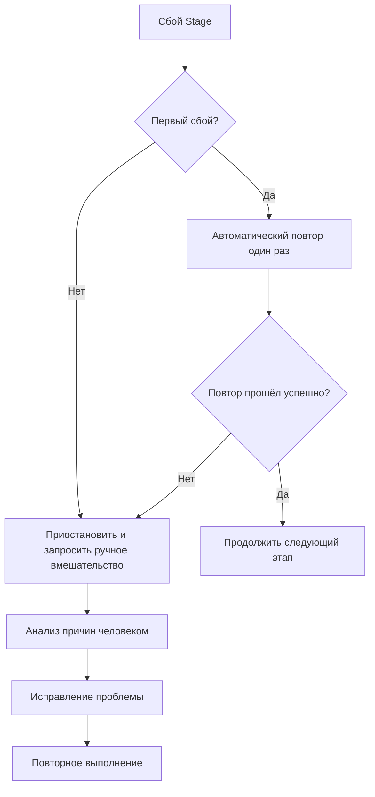
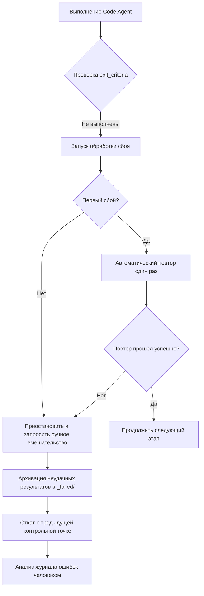
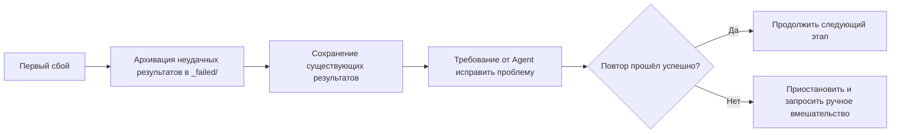
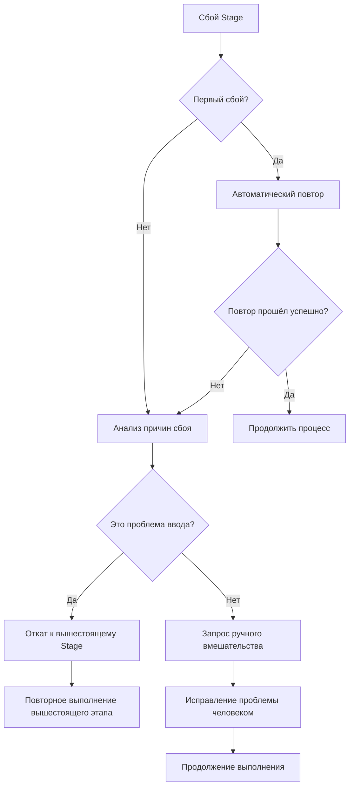

# Обработка сбоев и отката: интеллектуальная отказоустойчивость и восстановление после ошибок

## Чему вы научитесь

- **Идентификация типов сбоев**: быстро определять причины сбоев — отсутствие вывода, несоответствие содержимого, несанкционированная запись и т. д.
- **Понимание механизма повторных попыток**: освоить стратегию автоматического повторения один раз и правила архивирования сбоев
- **Выполнение операций отката**: научиться откатываться до последней успешной контрольной точки для восстановления стабильного состояния
- **Ручное вмешательство**: знать, когда требуется ручное вмешательство, как анализировать причины сбоев и устранять их
- **Чтение журналов ошибок**: понимать отчёты об ошибках `pipeline/error.log` и быстро находить проблемы

## Ваша текущая проблема

При выполнении конвейера вас больше всего беспокоят:

- **Что делать при сбое**: какой-то этап дал ошибку — повторять или начинать с начала?
- **Загрязнение данных**: повлияют ли неудачные результаты на последующие этапы? Будут ли они очищены?
- **Как выполнить откат**: как вернуться в предыдущее успешное состояние?
- **Ручное вмешательство**: после нескольких последовательных сбоев — что от меня требуется? Как смотреть логи?

Механизм обработки сбоев разработан для решения этих проблем — он определяет полный процесс идентификации сбоев, автоматического повторения, архивирования неудачных результатов, отката к контрольной точке и ручного вмешательства.

## Когда использовать этот метод

Используйте, когда конвейер попадает в следующие ситуации:

- **Сбой этапа**: Agent не смог выполнить задачу, отсутствуют выходные файлы или они не соответствуют ожиданиям
- **Несанкционированная операция**: Agent записал данные в неавторизованный каталог, что вызвало проверку безопасности
- **Последовательные сбои**: один и тот же этап завершился сбоем дважды, требуется ручной анализ
- **Требуется откат**: необходимо вернуться в предыдущее успешное состояние и начать заново
- **Анализ логов**: нужно просмотреть подробные отчёты об ошибках и информацию стека

## Основная идея

Стратегия обработки сбоев выполняется единым образом планировщиком Sisyphus — он работает как **инженер по отказоустойчивости**, автоматически обрабатывая ошибки в конвейере или запрашивая ручное вмешательство.

### Определение сбоя

Следующие ситуации считаются сбоем Stage:

| Тип сбоя | Симптомы | Расположение кода |
|---------|----------|------------------|
| **Отсутствие вывода** | Указанные в `pipeline.yaml` выходные файлы отсутствуют или имеют неправильное название | `failure.policy.md:9` |
| **Невыполнение exit_criteria** | Выходное содержимое не удовлетворяет условиям выхода из `pipeline.yaml` | `failure.policy.md:10` |
| **Несанкционированная запись** | Agent записал данные в неавторизованный каталог или файл | `failure.policy.md:11` |
| **Другие исключения** | Ошибки скриптов, невозможность чтения входных данных и т. д., приводящие к невозможности завершения задачи | `failure.policy.md:12` |

### Механизм повторных попыток



**Правила повторных попыток** (`failure.policy.md:16-18`):

- Каждый Stage по умолчанию разрешает **автоматическое повторение один раз**
- При повторении планировщик требует от Agent исправить проблему, сохранив существующие результаты, а не выполнять всё заново
- Если вторая попытка также завершается сбоем, планировщик должен приостановить конвейер и перейти к процессу ручного вмешательства

### Откат и архивация

**Архивация сбоев** (`failure.policy.md:22-23`):

```bash
# Перемещение неудачных результатов в каталог _failed/
mv artifacts/<stage>/ artifacts/_failed/<stage-id>/attempt-1/
mv artifacts/<stage>/ artifacts/_failed/<stage-id>/attempt-2/
```

**Стратегия отката** (`failure.policy.md:23`):

- Планировщик откатывается до последней успешной контрольной точки
- Возобновляет выполнение с этого Stage
- Обеспечивает согласованность результатов вверх и вниз по потоку, предотвращая загрязнение данных

### Ручное вмешательство

**Моменты вмешательства** (`failure.policy.md:27`):

- После двух последовательных сбоев одного и того же Stage
- При обнаружении несанкционированной записи

**Процесс вмешательства** (`failure.policy.md:27-29`):

1. Планировщик приостанавливает выполнение и сообщает причину сбоя
2. Пользователь проверяет входные данные, конфигурацию или наличие проблем в навыках
3. Пользователь изменяет входные файлы, корректирует навыки или параметры
4. Продолжает выполнение оставшегося процесса

::: warning Ограничения планировщика
Планировщик не должен пропускать неудачные этапы или изменять вывод без подтверждения человека.
:::

## Практика

### Шаг 1: Знакомство с процессом обработки сбоев

При запуске конвейера, если какой-то этап завершается сбоем, планировщик Sisyphus автоматически запускает процесс обработки сбоев.

**Пример сценария**: сбой на этапе Code



### Шаг 2: Просмотр журнала ошибок

При сбое планировщик записывает подробную информацию об ошибках в `pipeline/error.log`.

**Формат журнала ошибок** (`failure.policy.md:166-200`):

```bash
cat pipeline/error.log
```

**Что вы должны увидеть**:

```log
============================================
ОТЧЁТ ОБ ОШИБКЕ
============================================
Timestamp: 2026-01-29T10:30:00Z
Stage: code
Attempt: 2/2
Status: FAILED

Error Type: TypeScript Compilation Error
Error Message: Cannot find module '@prisma/client'

Stack Trace:
  at Object.<anonymous> (src/lib/prisma.ts:1:1)
  at Module._compile (node:internal/modules/cjs/loader:1198:14)

Exit Criteria Failed:
  - [ ] Бэкенд запускается без критических ошибок (FAILED)
  - [x] Клиент отображается и доступен
  - [x] Дополнительная аутентификация или не связанные функции не добавлены

Failed Artifacts Moved To:
  artifacts/_failed/code/attempt-2/

Recommended Action:
  1. Проверьте, содержит ли package.json @prisma/client
  2. Выполните npx prisma generate для генерации клиента
  3. Повторите этап Code

============================================
```

**Интерпретация журнала ошибок**:

| Поле | Описание | Пример |
|------|----------|--------|
| **Timestamp** | Время сбоя | 2026-01-29T10:30:00Z |
| **Stage** | Этап сбоя | code |
| **Attempt** | Количество повторных попыток | 2/2 (второй сбой) |
| **Status** | Текущее состояние | FAILED |
| **Error Type** | Тип ошибки | TypeScript Compilation Error |
| **Error Message** | Описание ошибки | Cannot find module '@prisma/client' |
| **Stack Trace** | Информация стека | src/lib/prisma.ts:1:1 |
| **Exit Criteria Failed** | Неудачные условия выхода | Бэкенд запускается без критических ошибок (FAILED) |
| **Failed Artifacts Moved To** | Местоположение архивации неудачных результатов | artifacts/_failed/code/attempt-2/ |
| **Recommended Action** | Рекомендуемые шаги исправления | 1. Проверьте package.json... |

### Шаг 3: Понимание механизма повторных попыток

При первом сбое Sisyphus автоматически запускает повтор.

**Процесс повторения** (`failure.policy.md:16-18`):



**Важные характеристики**:

- **Инкрементальное исправление**: при повторении планировщик требует от Agent исправить проблему на основе существующих результатов, а не выполнять всё заново
- **Архивация сбоев**: каждый неудачный результат перемещается в `artifacts/_failed/<stage-id>/attempt-N/` для сравнительного анализа
- **Не более одного раза**: по умолчанию разрешается только одно автоматическое повторение, чтобы избежать бесконечного цикла

### Шаг 4: Просмотр архивации сбоев

При сбое этапа все неудачные результаты архивируются в каталог `artifacts/_failed/`.

**Структура каталогов**:

```bash
artifacts/
├── _failed/
│   ├── code/
│   │   ├── attempt-1/
│   │   │   ├── backend/
│   │   │   └── client/
│   │   └── attempt-2/
│   │       ├── backend/
│   │       └── client/
│   ├── ui/
│   │   └── attempt-1/
│   └── prd/
│       └── attempt-1/
```

**Правила именования архивов**:

- `artifacts/_failed/<stage-id>/attempt-N/`
  - `<stage-id>`: название неудачного этапа (например, `code`, `ui`, `prd`)
  - `attempt-N`: номер попытки (1 — первый сбой, 2 — второй сбой)

**Зачем нужна архивация**:

- **Избежание загрязнения**: неудачные результаты не влияют на последующие этапы
- **Удобство анализа**: можно сравнить различия между попытками и найти корень проблемы
- **Сохранение доказательств**: неудачные результаты сохраняются для последующей отладки

### Шаг 5: Выполнение операций отката

Когда нужно вернуться в предыдущее состояние, можно использовать функцию отката.

**Процесс отката** (`failure.policy.md:23`):

```bash
# Ручной откат к предыдущей контрольной точке
factory run <stage-id>

# Например: откат к этапу tech для повторного выполнения
factory run tech
```

**Правила отката**:

- **Цель отката**: откат к последней успешной контрольной точке
- **Сброс состояния**: очистка результатов текущего этапа и архивации сбоев
- **Повторное выполнение**: запуск с целевого этапа

**Пример отката**:

Предположим, вы дважды завершили сбоем на этапе Code и хотите вернуться к этапу Tech для повторного проектирования архитектуры:

```bash
# 1. Откат к этапу tech
factory run tech

# 2. AI-помощник повторно выполнит Tech Agent
# 3. Повторная генерация artifacts/tech/ и artifacts/backend/prisma/
# 4. Затем продолжится выполнение этапа Code
```

### Шаг 6: Ручное вмешательство

После двух последовательных сбоев Sisyphus приостанавливает конвейер и запрашивает ручное вмешательство.

**Дерево решений вмешательства** (`failure.policy.md:204-236`):



**Контрольный список ручного вмешательства** (`failure.policy.md:240-263`):

#### Проверка среды

- [ ] Версия Node.js >= 18
- [ ] Версия npm >= 9
- [ ] Достаточно дискового пространства
- [ ] Нормальное сетевое соединение (загрузка npm)

#### Проверка состояния

- [ ] Состояние `.factory/state.json` правильное
- [ ] Результаты вышестоящего Stage целы
- [ ] Неудачные результаты заархивированы в `_failed/`

#### Подтверждение исправления

- [ ] Причина сбоя определена
- [ ] План исправления выполнен
- [ ] Связанные конфигурации обновлены

#### Возобновление выполнения

- [ ] Повтор с неудачного Stage
- [ ] Мониторинг журналов выполнения
- [ ] Проверка выходных результатов

### Шаг 7: Обработка типичных сценариев сбоев

Различные этапы имеют свои типичные сценарии сбоев, ниже приведены решения.

#### 7.1 Сбой на этапе Bootstrap

**Типичные ошибки** (`failure.policy.md:35-48`):

| Тип ошибки | Симптомы | Причина | Решение |
|-----------|----------|---------|---------|
| **Отсутствие вывода** | `input/idea.md` не существует | Agent некорректно записал файл | Повторить, проверить путь записи |
| **Неполное содержимое** | idea.md отсутствуют ключевые главы | Недостаточно информации от пользователя | Приостановить, запросить у пользователя дополнение |
| **Ошибка формата** | Не соответствует структуре шаблона | Agent не следовал шаблону | Повторить, подчеркнуть требования шаблона |

**Процесс обработки**:

```bash
# 1. Проверьте, существует ли каталог input/
ls -la input/

# 2. Если не существует, создайте каталог
mkdir -p input/

# 3. Повторите этап Bootstrap
factory run bootstrap
```

#### 7.2 Сбой на этапе PRD

**Типичные ошибки** (`failure.policy.md:50-65`):

| Тип ошибки | Симптомы | Причина | Решение |
|-----------|----------|---------|---------|
| **Содержит технические детали** | PRD содержит описание стека технологий | Agent вышел за границы | Повторить, подчеркнуть границы ответственности |
| **Слишком много функций** | Must Have > 7 функций | Расширение объёма | Повторить, требовать упростить до MVP |
| **Размытое описание пользователя** | "все пользователи", "большинство пользователей" | Не конкретизировано | Повторить, требовать конкретные образы пользователей |
| **Отсутствие Non-Goals** | Non-Goals пуст | Границы не определены | Повторить, требовать перечислить Non-Goals |

**Процесс обработки**:

```bash
# 1. Проверьте, что PRD не содержит технических ключевых слов
grep -E "(React|API|база данных)" artifacts/prd/prd.md

# 2. Проверьте, что количество функций Must Have ≤ 7
grep -A 100 "Must Have" artifacts/prd/prd.md | wc -l

# 3. При повторении предоставьте конкретные требования к исправлению
factory run prd
```

#### 7.3 Сбой на этапе UI

**Типичные ошибки** (`failure.policy.md:67-82`):

| Тип ошибки | Симптомы | Причина | Решение |
|-----------|----------|---------|---------|
| **Превышение количества страниц** | Количество страниц > 8 | Расширение объёма | Повторить, требовать упростить страницы |
| **Предпросмотр не открывается** | HTML файл повреждён | Ошибка генерации | Повторить, проверить синтаксис HTML |
| **Использование AI-стиля** | Шрифт Inter + фиолетовый градиент | Не следовал эстетическим руководствам | Повторить, требовать выбрать чёткий стиль |
| **Схема недействительна** | Ошибка разбора YAML | Синтаксическая ошибка | Повторить, проверить синтаксис YAML |

**Процесс обработки**:

```bash
# 1. Подсчитайте количество страниц в ui.schema.yaml
grep -c "page:" artifacts/ui/ui.schema.yaml

# 2. Попробуйте открыть предпросмотр в браузере
open artifacts/ui/preview.web/index.html

# 3. Проверьте синтаксис YAML
npx js-yaml artifacts/ui/ui.schema.yaml

# 4. Проверьте использование запрещённых AI-стилей
grep -E "(Inter|фиолетовый|gradient)" artifacts/ui/ui.schema.yaml
```

#### 7.4 Сбой на этапе Tech

**Типичные ошибки** (`failure.policy.md:84-99`):

| Тип ошибки | Симптомы | Причина | Решение |
|-----------|----------|---------|---------|
| **Синтаксическая ошибка Prisma** | schema.prisma недействителен | Синтаксическая проблема | Повторить, выполнить prisma validate |
| **Избыточный дизайн** | Введение микросервисов/кэша | Нарушение принципа MVP | Повторить, требовать упростить архитектуру |
| **Слишком много моделей данных** | Количество таблиц > 10 | Расширение объёма | Повторить, упростить модели данных |
| **Отсутствие определения API** | tech.md отсутствует список эндпоинтов | Неполное содержимое | Повторить, требовать дополнить API |

**Процесс обработки**:

```bash
# 1. Запустите проверку Prisma
cd artifacts/backend
npx prisma validate

# 2. Проверьте, что tech.md содержит необходимые главы
grep -E "(API|эндпоинт|маршрут)" artifacts/tech/tech.md

# 3. Подсчитайте количество моделей данных
grep -c "model " artifacts/backend/prisma/schema.prisma

# 4. Проверьте, введены ли ненужные сложные технологии
grep -E "(микросервис|кэш|очередь)" artifacts/tech/tech.md
```

#### 7.5 Сбой на этапе Code

**Типичные ошибки** (`failure.policy.md:101-131`):

| Тип ошибки | Симптомы | Причина | Решение |
|-----------|----------|---------|---------|
| **Сбой установки зависимостей** | Ошибка npm install | Конфликт версий пакетов | Проверить package.json, обновить версию |
| **Ошибка TypeScript** | Сбой компиляции tsc | Проблема типов | Исправить типы, повторить |
| **Отсутствие необходимых файлов** | Неполная структура каталогов | Пропуск генерации | Повторить, проверить список файлов |
| **Сбой тестов** | Ошибка npm test | Ошибка логики кода | Исправить тесты, повторить |
| **API не запускается** | Сбой прослушивания порта | Проблема конфигурации | Проверить конфигурацию переменных среды |

**Процесс обработки**:

```bash
# 1. Запустите проверку зависимостей
cd artifacts/backend
npm install --dry-run

# 2. Запустите проверку типов
npx tsc --noEmit

# 3. Проверьте структуру каталогов по списку файлов
ls -la src/

# 4. Запустите тесты
npm test

# 5. Если всё прошло, попытайтесь запустить сервис
npm run dev
```

**Исправление типичных проблем с зависимостями** (`failure.policy.md:120-131`):

```bash
# Конфликт версий
rm -rf node_modules package-lock.json
npm install

# Несовпадение версии Prisma
npm install @prisma/client@latest prisma@latest

# Проблемы с зависимостями React Native
cd artifacts/client
npx expo install --fix
```

#### 7.6 Сбой на этапе Validation

**Типичные ошибки** (`failure.policy.md:133-147`):

| Тип ошибки | Симптомы | Причина | Решение |
|-----------|----------|---------|---------|
| **Неполный отчёт проверки** | В report.md отсутствуют главы | Agent не завершил | Повторить |
| **Слишком много критических проблем** | Количество ошибок > 10 | Плохое качество этапа Code | Откат к этапу Code |
| **Проблемы безопасности** | Обнаружен жёстко закодированный ключ | Нарушение безопасности | Откат, исправить проблемы безопасности |

**Процесс обработки**:

```bash
# 1. Разберите report.md, чтобы подтвердить наличие всех глав
grep -E "(## Резюме|## Бэкенд|## Фронтенд|## Проблемы)" artifacts/validation/report.md

# 2. Подсчитайте количество критических проблем
grep -c "Критическая проблема" artifacts/validation/report.md

# 3. Если критических проблем > 10, рекомендуется откат к этапу Code
factory run code

# 4. Проверьте результаты сканирования безопасности
grep -E "(ключ|пароль|token)" artifacts/validation/report.md
```

#### 7.7 Сбой на этапе Preview

**Типичные ошибки** (`failure.policy.md:149-162`):

| Тип ошибки | Симптомы | Причина | Решение |
|-----------|----------|---------|---------|
| **Неполный README** | Отсутствуют шаги установки | Пропуск содержимого | Повторить, дополнить шаги |
| **Сбой сборки Docker** | Ошибка Dockerfile | Проблема конфигурации | Исправить Dockerfile |
| **Отсутствие конфигурации развёртывания** | Нет docker-compose | Не сгенерировано | Повторить, требовать сгенерировать конфигурацию |

**Процесс обработки**:

```bash
# 1. Проверьте, что README.md содержит все необходимые главы
grep -E "(## Быстрый старт|## Установка|## Запуск)" artifacts/preview/README.md

# 2. Попробуйте docker build для проверки Dockerfile
cd artifacts/preview
docker build -t test-app .

# 3. Проверьте наличие файлов конфигурации развёртывания
ls -la docker-compose.yml .github/workflows/
```

## Контрольная точка ✅

После завершения этого урока вы должны:

- [ ] Понимать 4 типа обработки сбоев (отсутствие вывода, несоответствие содержимого, несанкционированная запись, исключения)
- [ ] Освоить механизм автоматического повторения один раз
- [ ] Знать, что неудачные результаты архивируются в `artifacts/_failed/`
- [ ] Уметь интерпретировать отчёты об ошибках `pipeline/error.log`
- [ ] Понимать процесс отката к контрольной точке
- [ ] Знать, когда требуется ручное вмешательство
- [ ] Освоить решения для типичных сценариев сбоев

## Предостережения

### Проблема 1: При повторении результаты полностью переделываются

**Симптомы**: при втором повторении все результаты генерируются заново, а не исправляются на основе существующих.

**Причина**: Agent не следовал правилу "исправлять на основе существующих результатов".

**Решение**:

При повторении явно укажите Agent:

```markdown
Пожалуйста, исправьте проблему на основе существующих результатов, не переделывайте всё заново.
Сохраните правильные части, изменяйте только те, которые не соответствуют exit_criteria.
```

### Проблема 2: Неудачные результаты загрязняют последующие этапы

**Симптомы**: неудачные результаты не заархивированы и повлияли на выполнение последующих этапов.

**Причина**: шаг архивации неудачных результатов не выполнен.

**Решение**:

Архивируйте неудачные результаты вручную:

```bash
# Переместите неудачные результаты в каталог _failed/
mv artifacts/<stage-id> artifacts/_failed/<stage-id>/attempt-1/

# Затем повторно выполните этот этап
factory run <stage-id>
```

### Проблема 3: После отката результаты не согласованы

**Симптомы**: после отката к вышестоящему этапу результаты отличаются от предыдущих.

**Причина**: при откате был сброшен только текущий этап, не были очищены зависимые нижестоящие результаты.

**Решение**:

Полный процесс отката:

```bash
# 1. Откат к целевому этапу
factory run <target-stage>

# 2. Очистите все результаты нижестоящих этапов
rm -rf artifacts/<downstream-stage-1>/
rm -rf artifacts/<downstream-stage-2>/

# 3. Повторно выполните
factory run
```

### Проблема 4: После ручного вмешательства продолжение выполнения не удаётся

**Симптомы**: после исправления проблемы продолжение выполнения всё равно завершается сбоем.

**Причина**: план исправления неполный или изменения не сохранены.

**Решение**:

Контрольный список ручного вмешательства:

```bash
# 1. Подтвердите, что причина сбоя определена
cat pipeline/error.log

# 2. Подтвердите, что план исправления выполнен
# Проверьте изменённые файлы

# 3. Подтвердите, что связанные конфигурации обновлены
cat .factory/state.json

# 4. Повторно выполните
factory run <failed-stage>
```

### Проблема 5: Журнал ошибок неполный

**Симптомы**: в `pipeline/error.log` отсутствует ключевая информация.

**Причина**: планировщик некорректно записал журнал ошибок.

**Решение**:

Проверьте существование файла журнала:

```bash
# Если не существует, создайте вручную
mkdir -p pipeline
cat > pipeline/error.log << 'EOF'
ERROR REPORT
============================================
Timestamp: $(date -u +"%Y-%m-%dT%H:%M:%SZ")
Stage: <stage-id>
Attempt: 1/1
Status: FAILED

Error Type: Manual Debug
Error Message: Debug information needed

Stack Trace:
  (add stack trace if available)

Exit Criteria Failed:
  - [ ] exit-criteria-1
  - [ ] exit-criteria-2

Failed Artifacts Moved To:
  artifacts/_failed/<stage-id>/attempt-1/

Recommended Action:
  1. Describe the issue
  2. Provide fix steps
  3. Retry the stage

============================================
EOF
```

## Лучшие практики

### 1. Ранний отказ

**Принцип**: выявляйте проблемы как можно раньше, избегайте потери времени на последующих этапах.

**Практика**:

- На этапе Bootstrap проверяйте полноту ввода пользователя
- На этапе PRD проверяйте, содержатся ли технические детали (нарушение границ ответственности)
- На этапе UI проверяйте разумность количества страниц

### 2. Подробные логи

**Принцип**: записывайте достаточно контекстной информации для удобства устранения проблем.

**Практика**:

- Журналы ошибок содержат временную метку, этап, количество попыток, тип ошибки, информацию стека
- Рекомендуемые шаги исправления конкретны до имени файла и номера строки
- Архивация неудачных результатов для сравнительного анализа

### 3. Атомарные операции

**Принцип**: вывод каждого этапа должен быть атомарным для удобства отката.

**Практика**:

- Генерируйте все файлы результатов сразу, а не постепенно
- Если сбой происходит по пути, не сохраняйте неполные результаты
- Архивируйте результаты всего этапа, а не отдельные файлы

### 4. Сохранение доказательств

**Принцип**: архивируйте неудачные результаты перед повторением для сравнительного анализа.

**Практика**:

- Каждая попытка архивируется в подкаталог `attempt-N/`
- Сохраняйте результаты нескольких попыток для сравнения различий
- Используйте `git diff` для сравнения различий между попытками

### 5. Постепенное повторение

**Принцип**: при повторении предоставляйте более конкретные указания, а не просто повторяйте.

**Практика**:

```markdown
# Первый сбой
Пожалуйста, сгенерируйте документ PRD.

# Второе повторение (предоставьте конкретные указания)
Пожалуйста, исправьте следующие проблемы на основе существующего PRD:
1. Удалите все технические детали (например, React, API и т. д.)
2. Уменьшите количество функций Must Have с 10 до 7
3. Добавьте конкретные образы пользователей
4. Дополните главу Non-Goals и уточните границы
```

## Резюме урока

Механизм обработки сбоев является гарантией отказоустойчивости AI App Factory — он обеспечивает автоматическое восстановление или запрос ручного вмешательства при ошибках в конвейере.

**Ключевые моменты**:

1. **Определение сбоя**: отсутствие вывода, несоответствие содержимого, несанкционированная запись, другие исключения
2. **Механизм повторения**: каждый этап разрешает автоматическое повторение один раз, после второго сбоя запрашивается ручное вмешательство
3. **Архивация сбоев**: неудачные результаты перемещаются в `artifacts/_failed/<stage-id>/attempt-N/`
4. **Стратегия отката**: откат к последней успешной контрольной точке, обеспечение согласованности результатов вверх и вниз по потоку
5. **Ручное вмешательство**: после двух последовательных сбоев анализ причин, исправление проблем, повторное выполнение
6. **Журнал ошибок**: подробные отчёты об ошибках содержат временную метку, этап, тип ошибки, информацию стека, рекомендуемые шаги исправления
7. **Типичные сценарии**: каждый этап имеет свои типичные ошибки и решения

## Предварительный обзор следующего урока

> На следующем уроке мы изучим **[Частые вопросы и устранение неполадок](../../faq/troubleshooting/)**.
>
> Вы узнаете:
> - Типичные проблемы на этапе инициализации
> - Устранение неполадок в процессе выполнения
> - Обработка проблем, связанных с развёртыванием

---

## Приложение: ссылки на исходный код

<details>
<summary><strong>Нажмите, чтобы раскрыть расположение исходного кода</strong></summary>

> Время обновления: 2026-01-29

| Функция | Путь к файлу | Номер строки |
|---------|--------------|--------------|
| Определение стратегии сбоев | [`source/hyz1992/agent-app-factory/policies/failure.policy.md`](https://github.com/hyz1992/agent-app-factory/blob/main/policies/failure.policy.md) | 1-276 |
| Обработка сбоев планировщиком | [`source/hyz1992/agent-app-factory/agents/orchestrator.checkpoint.md`](https://github.com/hyz1992/agent-app-factory/blob/main/agents/orchestrator.checkpoint.md) | 38-46 |
| Матрица границ возможностей | [`source/hyz1992/agent-app-factory/policies/capability.matrix.md`](https://github.com/hyz1992/agent-app-factory/blob/main/policies/capability.matrix.md) | 1-40 |

**Определение сбоя** (`failure.policy.md:5-13`):
- Отсутствие вывода: указанные в `pipeline.yaml` выходные файлы отсутствуют или имеют неправильное название
- Невыполнение exit_criteria: выходное содержимое не удовлетворяет `exit_criteria` этого Stage в `pipeline.yaml`
- Несанкционированная запись: Agent записал данные в неавторизованный каталог или файл
- Другие исключения: ошибки скриптов, невозможность чтения входных данных и т. д., приводящие к невозможности завершения задачи

**Механизм повторения** (`failure.policy.md:16-18`):
- Каждый Stage по умолчанию разрешает автоматическое повторение один раз
- Планировщик должен требовать от Agent исправить проблему, сохранив существующие результаты, а не выполнять всё заново
- Если вторая попытка также завершается сбоем, планировщик должен приостановить конвейер и перейти к процессу ручного вмешательства

**Откат и архивация** (`failure.policy.md:22-23`):
- Неудачные результаты перемещаются в каталог `artifacts/_failed/<stage-id>/`
- Откат к последней успешной контрольной точке, повторное выполнение с этого Stage

**Ручное вмешательство** (`failure.policy.md:27-29`):
- При двух последовательных сбоях одного и того же Stage планировщик должен приостановить выполнение и сообщить причину сбоя
- После вмешательства пользователя можно изменить входные файлы, скорректировать навыки или параметры, затем продолжить выполнение оставшегося процесса
- Планировщик не должен пропускать неудачные этапы или изменять вывод без подтверждения человека

**Формат журнала ошибок** (`failure.policy.md:166-200`):
- Timestamp, Stage, Attempt, Status
- Error Type, Error Message, Stack Trace
- Exit Criteria Failed
- Failed Artifacts Moved To
- Recommended Action

**Типичные сценарии сбоев** (`failure.policy.md:33-162`):
- Этап Bootstrap: отсутствие вывода, неполное содержимое, ошибка формата
- Этап PRD: содержит технические детали, слишком много функций, размытое описание пользователя, отсутствие Non-Goals
- Этап UI: превышение количества страниц, предпросмотр не открывается, использование AI-стиля, недействительная схема
- Этап Tech: синтаксическая ошибка Prisma, избыточный дизайн, слишком много моделей данных, отсутствие определения API
- Этап Code: сбой установки зависимостей, ошибка TypeScript, отсутствие необходимых файлов, сбой тестов, API не запускается
- Этап Validation: неполный отчёт проверки, слишком много критических проблем, проблемы безопасности
- Этап Preview: неполный README, сбой сборки Docker, отсутствие конфигурации развёртывания

**Процесс обработки сбоев планировщиком** (`orchestrator.checkpoint.md:38-46`):
- Читает `policies/failure.policy.md`, выполняет согласно стратегии
- Требует от Agent исправить проблему, сохранив существующие результаты, и повторить попытку
- Перемещает неудачные результаты в каталог `artifacts/_failed/<stage-id>/`
- После двух последовательных сбоев приостанавливает конвейер, сообщает причину сбоя и ждёт вмешательства человека

**Обработка несанкционированных действий** (`orchestrator.checkpoint.md:48-52`):
- Проверяет, что путь вывода ограничен авторизованными каталогами
- Если обнаружена несанкционированная запись, перемещает результат в `artifacts/_untrusted/<stage-id>/`
- Приостанавливает выполнение и сообщает

**Дерево решений ручного вмешательства** (`failure.policy.md:204-236`):
- Первый сбой → автоматический повтор → повтор успешен? → продолжить / второй сбой
- Второй сбой → анализ причин сбоя → это проблема ввода? → откат к вышестоящему Stage / запрос ручного вмешательства

**Контрольный список восстановления после сбоя** (`failure.policy.md:240-263`):
- Проверка среды: версия Node.js, версия npm, дисковое пространство, сетевое соединение
- Проверка состояния: `.factory/state.json`, результаты вышестоящего Stage, архивация неудачных результатов
- Подтверждение исправления: причина сбоя, план исправления, связанные конфигурации
- Возобновление выполнения: повтор с неудачного Stage, мониторинг логов, проверка результатов

**Лучшие практики** (`failure.policy.md:267-274`):
- Ранний отказ: выявляйте проблемы как можно раньше, избегайте потери времени на последующих Stage
- Подробные логи: записывайте достаточно контекстной информации для удобства устранения проблем
- Атомарные операции: вывод каждого Stage должен быть атомарным для удобства отката
- Сохранение доказательств: архивируйте неудачные результаты перед повторением для сравнительного анализа
- Постепенное повторение: при повторении предоставляйте более конкретные указания, а не просто повторяйте

</details>
