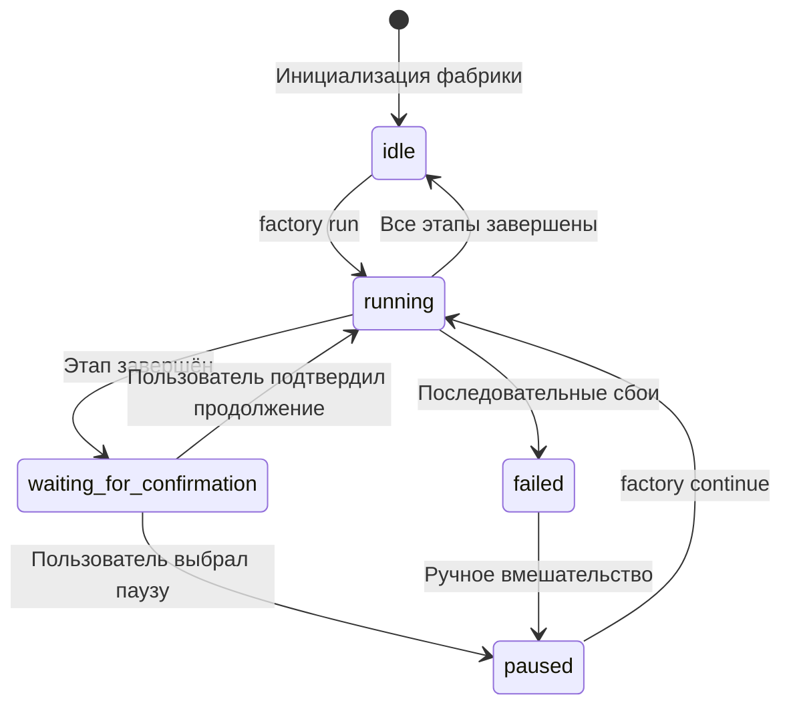
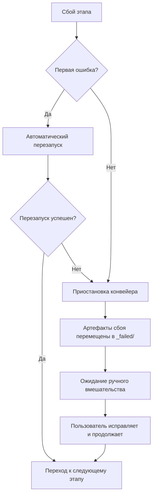

# Подробное руководство по планировщику Sisyphus: координация конвейера и управление состоянием

## Что вы сможете делать после изучения

- Понимать, как планировщик координирует выполнение 7-этапного конвейера
- Разбираться в принципах работы конечного автомата и правилах перехода состояний
- Освоить механизм проверки прав доступа по матрице границ возможностей
- Уметь обрабатывать сценарии сбоев (повторные попытки, откат, ручное вмешательство)
- Использовать команду `factory continue` для оптимизации потребления токенов

## Ваша текущая ситуация

Вы уже запускали несколько конвейеров, но, возможно, до сих пор не до конца понимаете:

- Что именно делает Sisyphus? Чем он отличается от других агентов?
- Почему агенты могут читать и записывать только в определённых директориях? Что произойдёт при нарушении прав?
- Как планировщик обрабатывает сбои? Почему иногда происходит автоматический перезапуск, а иногда требуется ручное вмешательство?
- Почему команда `factory continue` позволяет экономить токены? Какой механизм за этим стоит?

Если вам интересны эти вопросы — эта глава даст вам полное понимание.

## Когда использовать

Когда вам нужно:

- **Отлаживать проблемы конвейера**: понять, что делает планировщик на определённом этапе и почему происходит сбой
- **Оптимизировать потребление токенов**: использовать `factory continue` для создания новой сессии на каждом этапе
- **Расширять конвейер**: добавлять новых агентов или изменять существующую логику
- **Обрабатывать сценарии сбоев**: понять, почему сбой произошёл на определённом этапе и как восстановиться
- **Проверять проблемы с правами доступа**: убедиться, почему агент не может получить доступ к определённым файлам

## Основная концепция

Планировщик Sisyphus — это "командир" всего AI App Factory.

**Запомните эту аналогию**:

- Другие агенты (bootstrap, prd, ui, tech, code, validation, preview) — это рабочие, выполняющие задачи
- Sisyphus — это прораб, который распределяет работу между рабочими, проверяет качество работы и обрабатывает исключительные ситуации

**Уникальность Sisyphus**:

| Характеристика | Sisyphus | Другие агенты |
| --- | --- | --- |
| **Обязанности** | Координация, проверка, управление состоянием | Генерация конкретных артефактов |
| **Результат** | Обновление state.json | Генерация PRD, кода, документации и т.д. |
| **Права доступа** | Чтение и запись state.json | Чтение и запись в определённые поддиректории artifacts/ |
| **Создаваемый контент** | Не создаёт бизнес-контент | Создаёт конкретные бизнес-артефакты |

**Ключевые принципы**:

1. **Строгая последовательность**: выполнение должно происходить строго по определению pipeline.yaml, без пропусков или параллельного выполнения
2. **Один этап за раз**: в один момент времени может быть активен только один агент
3. **Разделение обязанностей**: Sisyphus не изменяет бизнес-артефакты, он только координирует и проверяет
4. **Контроль качества**: после завершения каждого этапа необходимо проверить, соответствует ли результат exit_criteria

## Модель конечного автомата

Sisyphus управляет всем процессом как конечный автомат. Понимание конечного автомата — ключ к освоению планировщика.

### 5 состояний



### Подробное описание состояний

| Состояние | Описание | Условие активации |
| --- | --- | --- |
| **idle** | Ожидание запуска | Инициализация проекта завершена или конвейер полностью выполнен |
| **running** | Выполняется определённый этап | После запуска factory run или factory continue |
| **waiting_for_confirmation** | Ожидание подтверждения пользователя | Текущий этап завершён, ожидание выбора следующего шага |
| **paused** | Приостановлено вручную | Пользователь выбрал паузу или произошли последовательные сбои |
| **failed** | Обнаружена необработанная ошибка | Агент дважды подряд завершился с ошибкой или произошло нарушение прав доступа |

::: info Файл состояния
Все состояния сохраняются в файле `.factory/state.json`, Sisyphus имеет исключительное право на его обновление.
:::

### Примеры переходов состояний

**Сценарий 1: Нормальное выполнение**

```
idle → running (factory run)
↓
waiting_for_confirmation (bootstrap завершён)
↓
running (пользователь выбрал продолжить)
↓
waiting_for_confirmation (prd завершён)
↓
... (повторяется до завершения всех этапов)
↓
idle
```

**Сценарий 2: Восстановление после сбоя**

```
running → failed (этап code дважды завершился с ошибкой)
↓
paused (ручное вмешательство для исправления кода)
↓
running (factory continue для повторной попытки code)
↓
waiting_for_confirmation
```

## Матрица границ возможностей

### Зачем нужен контроль доступа?

Представьте:

- Что произойдёт, если PRD Agent изменит файлы, созданные UI Agent?
- Какие последствия будут, если Tech Agent прочитает код, сгенерированный Code Agent?

**Ответ**: путаница в обязанностях, невозможность отследить происхождение артефактов, невозможность гарантировать качество.

Матрица границ возможностей обеспечивает разделение обязанностей путём ограничения прав на чтение и запись для каждого агента.

### Матрица прав доступа

| Агент | Директории для чтения | Директории для записи | Описание |
| --- | --- | --- | --- |
| **bootstrap** | Нет | `input/` | Только создание или изменение `idea.md` в директории `input/` |
| **prd** | `input/` | `artifacts/prd/` | Чтение файла с идеей, генерация PRD |
| **ui** | `artifacts/prd/` | `artifacts/ui/` | Чтение PRD, генерация UI Schema и превью |
| **tech** | `artifacts/prd/` | `artifacts/tech/`, `artifacts/backend/prisma/` | Чтение PRD, генерация технического дизайна и моделей данных |
| **code** | `artifacts/ui/`, `artifacts/tech/`, `artifacts/backend/prisma/` | `artifacts/backend/`, `artifacts/client/` | Генерация кода на основе UI и технического дизайна |
| **validation** | `artifacts/backend/`, `artifacts/client/` | `artifacts/validation/` | Проверка качества кода, генерация отчёта о проверке |
| **preview** | `artifacts/backend/`, `artifacts/client/` | `artifacts/preview/` | Чтение сгенерированного кода, написание инструкций для демонстрации |

### Процесс проверки прав доступа

**Перед выполнением**:

1. Sisyphus читает capability.matrix.md
2. Сообщает агенту разрешённые директории для чтения и записи
3. Агент должен работать в пределах своих прав

**После выполнения**:

1. Sisyphus сканирует новые или изменённые файлы
2. Проверяет, находятся ли они в разрешённых директориях
3. При обнаружении нарушения прав немедленно обрабатывает ситуацию

### Механизм обработки нарушений прав доступа

Если агент записал файлы в неразрешённую директорию:

1. **Изоляция артефактов**: перемещение нарушающих правила файлов в `artifacts/_untrusted/<stage-id>/`
2. **Регистрация сбоя**: событие помечается как сбой
3. **Приостановка конвейера**: ожидание ручного вмешательства
4. **Предоставление рекомендаций по исправлению**: инструкции для пользователя по обработке ненадёжных файлов

**Пример**:

```
⚠️ Обнаружена несанкционированная запись для этапа "prd":
- artifacts/ui/ui.schema.yaml

Файлы перемещены в карантин: artifacts/_untrusted/prd

Пожалуйста, проверьте эти файлы перед продолжением.
```

## Механизм контрольных точек

После завершения каждого этапа Sisyphus приостанавливает выполнение и ожидает подтверждения пользователя. Это и есть механизм контрольных точек.

### Ценность контрольных точек

- **Контроль качества**: ручная проверка артефактов каждого этапа
- **Гибкое управление**: возможность в любой момент приостановить, повторить или пропустить этап
- **Упрощение отладки**: проблемы обнаруживаются на ранних этапах, не накапливаясь к концу

### Шаблон вывода контрольной точки

После завершения каждого этапа Sisyphus отображает опции в следующем формате:

```
✓ prd завершён!

Сгенерированные артефакты:
- artifacts/prd/prd.md

┌─────────────────────────────────────────────────────────────┐
│ 📋 Пожалуйста, выберите следующее действие │
│ Введите номер опции (1-5) и нажмите Enter для подтверждения │
└─────────────────────────────────────────────────────────────┘

┌──────┬──────────────────────────────────────────────────────┐
│ Опция │ Описание │
├──────┼──────────────────────────────────────────────────────┤
│ 1 │ Продолжить следующий этап (в той же сессии) │
│ │ Я продолжу выполнение этапа ui │
├──────┼──────────────────────────────────────────────────────┤
│ 2 │ Продолжить в новой сессии ⭐ Рекомендуется, экономит токены │
│ │ Выполните в новом окне терминала: factory continue │
│ │ (автоматически запустит новое окно Claude Code и продолжит конвейер) │
├──────┼──────────────────────────────────────────────────────┤
│ 3 │ Перезапустить текущий этап │
│ │ Повторно выполнить этап prd │
├──────┼──────────────────────────────────────────────────────┤
│ 4 │ Изменить артефакты и перезапустить │
│ │ Изменить input/idea.md и выполнить повторно │
├──────┼──────────────────────────────────────────────────────┤
│ 5 │ Приостановить конвейер │
│ │ Сохранить текущий прогресс, продолжить позже │
└──────┴──────────────────────────────────────────────────────┘

💡 Подсказка: введите число от 1 до 5 и нажмите Enter для подтверждения
```

::: tip Рекомендуемая практика
**Опция 2 (продолжить в новой сессии) — лучшая практика**, причины см. в следующем разделе "Оптимизация контекста".
:::

## Стратегии обработки сбоев

Когда этап завершается с ошибкой, Sisyphus обрабатывает ситуацию по предопределённой стратегии.

### Определение сбоя

**Ситуации, которые Sisyphus считает сбоями**:

- Отсутствие выходных файлов (требуемые файлы не созданы)
- Выходное содержимое не соответствует exit_criteria (например, в PRD отсутствуют пользовательские истории)
- Нарушение прав доступа агентом (запись в неразрешённую директорию)
- Последовательные ошибки выполнения агента (ошибки скриптов, невозможность чтения входных данных)

### Процесс обработки сбоев



### Механизм автоматического перезапуска

- **Правило по умолчанию**: каждый этап допускает один автоматический перезапуск
- **Стратегия перезапуска**: исправление проблем на основе существующих артефактов
- **Архивация сбоев**: после неудачного перезапуска артефакты перемещаются в `artifacts/_failed/<stage-id>/attempt-2/`

### Сценарии ручного вмешательства

**Ситуации, требующие ручного вмешательства**:

1. **Два последовательных сбоя**: автоматический перезапуск также завершился неудачей
2. **Нарушение прав доступа**: агент записал файлы в неразрешённую директорию
3. **Ошибки скриптов**: исключения, возникшие во время выполнения агента

**Процесс ручного вмешательства**:

1. Sisyphus приостанавливает конвейер
2. Отображает причину сбоя и сообщение об ошибке
3. Предоставляет рекомендации по исправлению:
   - Изменить входные файлы
   - Откорректировать определение агента
   - Обновить файлы навыков
4. После исправления пользователем выполнить `factory continue` для продолжения

## Оптимизация контекста (экономия токенов)

### Описание проблемы

Если вы выполняете все 7 этапов в одной сессии, столкнётесь со следующими проблемами:

- **Накопление контекста**: ИИ должен помнить всю историю диалогов
- **Потеря токенов**: повторное чтение исторических артефактов
- **Увеличение стоимости**: длинные сессии потребляют больше токенов

### Решение: выполнение в разных сессиях

**Основная идея**: каждый этап выполняется в новой сессии.

```
Сессия 1: bootstrap
├─ Генерация input/idea.md
├─ Обновление state.json
└─ Завершение сессии

Сессия 2: prd
├─ Чтение state.json (только текущее состояние)
├─ Чтение input/idea.md (только входной файл)
├─ Генерация artifacts/prd/prd.md
├─ Обновление state.json
└─ Завершение сессии

Сессия 3: ui
├─ Чтение state.json
├─ Чтение artifacts/prd/prd.md
├─ Генерация artifacts/ui/ui.schema.yaml
├─ Обновление state.json
└─ Завершение сессии
```

### Как использовать

**Шаг 1**: После завершения этапа в текущей сессии выберите "продолжить в новой сессии"

```
┌──────┬──────────────────────────────────────────────────────┐
│ Опция │ Описание │
├──────┼──────────────────────────────────────────────────────┤
│ 2 │ Продолжить в новой сессии ⭐ Рекомендуется, экономит токены │
│ │ Выполните в новом окне терминала: factory continue │
│ │ (автоматически запустит новое окно Claude Code и продолжит конвейер) │
└──────┴──────────────────────────────────────────────────────┘
```

**Шаг 2**: Откройте новое окно терминала и выполните:

```bash
factory continue
```

Эта команда автоматически:
1. Читает `.factory/state.json` для получения текущего прогресса
2. Запускает новое окно Claude Code
3. Продолжает со следующего ожидающего выполнения этапа

### Преимущества изоляции контекста

| Преимущество | Описание |
| --- | --- |
| **Экономия токенов** | Нет необходимости загружать историю диалогов и артефакты |
| **Повышение стабильности** | Предотвращение "взрыва контекста", приводящего к отклонению ИИ от цели |
| **Упрощение отладки** | Каждый этап независим, проблемы легче локализовать |
| **Возможность прерывания** | Можно прервать выполнение на любой контрольной точке и возобновить позже |

## Проверка обязательного использования навыков

Некоторые этапы требуют использования определённых навыков для гарантии качества выходных данных. Sisyphus проверяет использование этих навыков.

### Этап bootstrap

**Обязательное требование**: необходимо использовать навык `superpowers:brainstorm`

**Метод проверки**:

1. Проверка, явно ли указано в выходном сообщении агента, что навык был использован
2. Если упоминание отсутствует — отказ в принятии артефактов
3. Подсказка о необходимости повторного выполнения с обязательным использованием навыка

**Сообщение об ошибке**:

```
❌ Обнаружено неиспользование навыка superpowers:brainstorm
Пожалуйста, используйте этот навык для глубокой проработки идеи пользователя перед генерацией idea.md
```

### Этап ui

**Обязательное требование**: необходимо использовать навык `ui-ux-pro-max`

**Метод проверки**:

1. Проверка, явно ли указано в выходном сообщении агента, что навык был использован
2. Проверка конфигурации дизайн-системы в `ui.schema.yaml`
3. Если конфигурация дизайн-системы не соответствует профессиональным рекомендациям — отказ в принятии артефактов

**Сообщение об ошибке**:

```
❌ Обнаружено неиспользование навыка ui-ux-pro-max
Пожалуйста, используйте этот навык для генерации профессиональной дизайн-системы и UI-прототипа
```

### Обработка последовательных сбоев

Если этап дважды подряд завершается с ошибкой из-за проверки навыков:

1. Приостановка конвейера
2. Запрос ручного вмешательства
3. Проверка определения агента и конфигурации навыков

## Практическое упражнение: отладка сбоя этапа

Предположим, этап code завершился с ошибкой. Рассмотрим процесс отладки.

### Шаг 1: Просмотр state.json

```bash
cat .factory/state.json
```

**Пример вывода**:

```json
{
  "version": "1.0",
  "status": "failed",
  "currentStage": "code",
  "completedStages": ["bootstrap", "prd", "ui", "tech"],
  "failedStages": ["code"],
  "stageHistory": [
    {
      "stageId": "code",
      "status": "failed",
      "startTime": "2026-01-29T10:00:00Z",
      "endTime": "2026-01-29T10:15:00Z",
      "attempts": 2,
      "error": "Exit criteria not met: Missing package.json"
    }
  ],
  "lastCheckpoint": "tech",
  "createdAt": "2026-01-29T09:00:00Z",
  "updatedAt": "2026-01-29T10:15:00Z"
}
```

**Ключевая информация**:

- `status: failed` — конвейер завершился с ошибкой
- `currentStage: code` — текущий этап с ошибкой
- `completedStages` — завершено 4 этапа
- `error: "Exit criteria not met: Missing package.json"` — причина сбоя

### Шаг 2: Проверка артефактов сбоя

```bash
ls -la artifacts/_failed/code/attempt-2/
```

**Пример вывода**:

```
drwxr-xr-x 5 user staff 160 Jan 29 10:15 .
drwxr-xr-x 3 user staff  96 Jan 29 10:15 ..
-rw-r--r-- 1 user staff 2.1K Jan 29 10:15 server.ts
-rw-r--r-- 1 user staff 1.5K Jan 29 10:15 client.ts
```

**Обнаружение проблемы**: отсутствует файл `package.json`!

### Шаг 3: Просмотр exit_criteria

```bash
cat .factory/pipeline.yaml | grep -A 10 'code:'
```

**Пример вывода**:

```yaml
code:
  agent: agents/code.agent.md
  inputs:
    - artifacts/ui/ui.schema.yaml
    - artifacts/tech/tech.md
    - artifacts/backend/prisma/schema.prisma
  outputs:
    - artifacts/backend/package.json
    - artifacts/backend/server.ts
    - artifacts/client/package.json
    - artifacts/client/app.ts
  exit_criteria:
    - package.json существует
    - Содержит корректные зависимости
    - Код проходит проверку типов
```

**Подтверждение проблемы**: Code Agent не сгенерировал `package.json`, что нарушает exit_criteria.

### Шаг 4: Исправление проблемы

**Вариант 1**: Изменить определение Code Agent

```bash
nano .factory/agents/code.agent.md
```

Явно указать в определении агента необходимость генерации `package.json`:

```markdown
## Обязательные файлы для генерации

Вы должны сгенерировать следующие файлы:
- artifacts/backend/package.json (с корректными зависимостями)
- artifacts/backend/server.ts
- artifacts/client/package.json
- artifacts/client/app.ts
```

**Вариант 2**: Изменить входные файлы

Если проблема в этапе технического дизайна, можно изменить технический дизайн:

```bash
nano artifacts/tech/tech.md
```

Дополнить явными указаниями по зависимостям.

### Шаг 5: Продолжение конвейера

После исправления проблемы выполните повторно:

```bash
factory continue
```

Sisyphus выполнит:
1. Чтение state.json (состояние failed)
2. Продолжение с lastCheckpoint (tech)
3. Повторное выполнение этапа code
4. Проверку соответствия артефактов exit_criteria

## Резюме урока

Планировщик Sisyphus — это "командир" AI App Factory, отвечающий за:

- **Координацию конвейера**: последовательное выполнение 7 этапов
- **Управление состоянием**: поддержание state.json, отслеживание прогресса
- **Проверку прав доступа**: обеспечение работы агентов только в авторизованных директориях
- **Обработку сбоев**: автоматические перезапуски, архивация сбойных артефактов, ожидание ручного вмешательства
- **Контроль качества**: проверка соответствия артефактов каждого этапа exit_criteria

**Ключевые принципы**:

1. Строгое последовательное выполнение без пропусков или параллельного выполнения
2. В один момент времени активен только один агент
3. Все артефакты должны записываться в директорию artifacts/
4. После завершения каждого этапа требуется подтверждение пользователя
5. Рекомендуется использовать `factory continue` для экономии токенов

**Запомните эту блок-схему**:

```
factory run → чтение pipeline.yaml → выполнение этапа → проверка артефактов → подтверждение контрольной точки
     ↑                                                              │
     └────────────────── factory continue (новая сессия) ←──────────┘
```

## Анонс следующего урока

> В следующем уроке мы изучим **[Оптимизация контекста: выполнение в разных сессиях](../context-optimization/)**.
>
> Вы узнаете:
> - Как использовать команду `factory continue`
> - Почему выполнение в разных сессиях экономит токены
> - Как тестировать планировщик в среде разработки
> - Распространённые техники отладки и анализ логов

## Приложение: справочник по исходному коду

<details>
<summary><strong>Нажмите, чтобы просмотреть расположение исходного кода</strong></summary>

> Обновлено: 2026-01-29

| Функция | Путь к файлу | Строки |
| --- | --- | --- |
| Основное определение планировщика | [`source/hyz1992/agent-app-factory/agents/orchestrator.checkpoint.md`](https://github.com/hyz1992/agent-app-factory/blob/main/agents/orchestrator.checkpoint.md) | полный файл |
| Руководство по реализации планировщика | [`source/hyz1992/agent-app-factory/agents/orchestrator-implementation.md`](https://github.com/hyz1992/agent-app-factory/blob/main/agents/orchestrator-implementation.md) | полный файл |
| Матрица границ возможностей | [`source/hyz1992/agent-app-factory/policies/capability.matrix.md`](https://github.com/hyz1992/agent-app-factory/blob/main/policies/capability.matrix.md) | полный файл |
| Стратегии обработки сбоев | [`source/hyz1992/agent-app-factory/policies/failure.policy.md`](https://github.com/hyz1992/agent-app-factory/blob/main/policies/failure.policy.md) | полный файл |
| Определение конвейера | [`source/hyz1992/agent-app-factory/pipeline.yaml`](https://github.com/hyz1992/agent-app-factory/blob/main/pipeline.yaml) | полный файл |

**Ключевые функции**:

- `executeStage()` — выполнение отдельного этапа (строки 117-189)
- `waitForCheckpointConfirmation()` — ожидание подтверждения контрольной точки (строки 195-236)
- `handleStageFailure()` — обработка сбоя этапа (строки 242-289)
- `checkUnauthorizedWrites()` — проверка несанкционированной записи (строки 295-315)
- `getPermissions()` — получение матрицы прав доступа (строки 429-467)

**Ключевые константы**:

- Перечисление состояний: `idle`, `running`, `waiting_for_confirmation`, `paused`, `failed`
- Максимальное количество попыток: 2 (строка 269)
- Приоритет разрешения путей: `.factory/` → корневая директория (строки 31-33)

</details>
