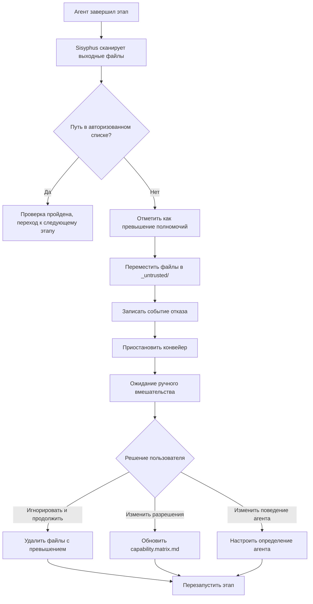

# Разрешения и механизмы безопасности: матрица границ возможностей и защита от превышения полномочий

## Чему вы научитесь

- Понять принципы дизайна матрицы границ возможностей и механизмы изоляции разрешений
- Научиться настраивать файлы прав Claude Code, избегая использования `--dangerously-skip-permissions`
- Освоить процесс обработки действий с превышением полномочий и методы восстановления
- Понять механизм обязательной проверки использования навыков
- Научиться выявлять и устранять проблемы безопасности, связанные с разрешениями

## Текущие трудности

Возможно, вы сталкивались с такими ситуациями:

- Не знаете, почему агент не может получить доступ к определенным файлам
- При выполнении `factory run` постоянно запрашиваются разрешения, и вы используете `--dangerously-skip-permissions` для обхода
- Неясны границы разрешений между агентами, опасаетесь, что превышение полномочий приведет к загрязнению данных
- При превышении полномочий не знаете, как обрабатывать и восстанавливаться

Если эти проблемы беспокоят вас, эта глава поможет вам сформировать целостное понимание разрешений и безопасности.

## Когда использовать этот подход

Когда вам нужно:

- **Настроить Claude Code**: установить правильные файлы прав для проекта Factory
- **Отладить проблемы с разрешениями**: выяснить, почему агент не может читать/записывать определенные файлы
- **Обработать исключения превышения полномочий**: восстановить прерванный конвейер из-за действий с превышением прав
- **Расширить агента**: определить границы разрешений при добавлении нового агента
- **Аудит безопасности**: проверить, является ли конфигурация разрешений существующего проекта разумной

## Основная идея

Механизм безопасности AI App Factory основан на **матрице границ возможностей** (Capability Boundary Matrix), гарантирующей, что каждый агент может работать только в авторизованных каталогах.

**Запомните эту метафору**:

- Агенты — как **квалифицированные рабочие** на заводе
- Матрица границ возможностей — как **рабочее разрешение**, четко определяющее, в какие цеха может войти каждый рабочий и какое оборудование использовать
- Планировщик Sisyphus — как **руководитель безопасности**, проверяющий разрешения при входе и выходе рабочих из цехов, гарантирующий отсутствие действий с превышением прав

**Трехуровневый механизм защиты**:

| Уровень | Ответственность | Время проверки |
| --- | --- | --- |
| **Разрешения Claude Code** | Права на чтение/запись файловой системы | При запуске AI-ассистента |
| **Матрица границ возможностей** | Права доступа агентов к каталогам | До и после выполнения этапов |
| **Обязательная проверка навыков** | Требования к использованию навыков на определенных этапах | Этапы bootstrap и ui |
## Подробное описание матрицы границ возможностей

### Зачем нужна изоляция разрешений?

Представьте, что произойдет без ограничений разрешений:

- **PRD Agent изменил файлы UI**: дизайн пользовательского интерфейса нарушен, невозможно отследить изменения
- **Tech Agent прочитал файлы Code**: техническая архитектура влияет на реализацию кода, отклоняясь от принципов MVP
- **Code Agent изменил PRD**: документы требований «загрязнены» логикой кода, ответственность размывается

**Ответ**: границы ответственности неясны, артефакты невозможно отследить, качество не гарантировано.

Матрица границ возможностей обеспечивает разделение ответственности, ограничивая права на чтение и запись каждого агента.

### Таблица матрицы разрешений

| Агент | Каталоги для чтения | Каталоги для записи | Описание |
| --- | --- | --- | --- |
| **bootstrap** | Нет | `input/` | Только создание или изменение `idea.md` в каталоге `input/` |
| **prd** | `input/` | `artifacts/prd/` | Чтение файла идей, создание PRD; запрещение записи в другие каталоги |
| **ui** | `artifacts/prd/` | `artifacts/ui/` | Чтение PRD, создание UI Schema и превью |
| **tech** | `artifacts/prd/` | `artifacts/tech/`, `artifacts/backend/prisma/` | Чтение PRD, создание технического дизайна и моделей данных |
| **code** | `artifacts/ui/`, `artifacts/tech/`, `artifacts/backend/prisma/` | `artifacts/backend/`, `artifacts/client/` | Создание кода бэкенда и клиента на основе дизайна UI и технических требований; запрещение изменения вышестоящих артефактов |
| **validation** | `artifacts/backend/`, `artifacts/client/` | `artifacts/validation/` | Проверка качества кода, создание отчета проверки; только чтение, без изменения кода |
| **preview** | `artifacts/backend/`, `artifacts/client/` | `artifacts/preview/` | Чтение созданных сервисов и клиентов, написание демонстрационных инструкций |

::: tip Основные принципы
- **Однонаправленная зависимость**: агенты могут читать только артефакты вышестоящих этапов, не могут читать нижестоящие или артефакты того же уровня
- **Независимость ответственности**: каждый агент может писать только в свой каталог вывода
- **Запрет превышения полномочий**: неавторизованные операции чтения/записи считаются нарушением безопасности
:::
### Процесс проверки разрешений

Планировщик Sisyphus выполняет проверку разрешений до и после выполнения каждого этапа:

**До выполнения (информирование о разрешениях)**:

```
1. Sisyphus читает capability.matrix.md
2. Передает текущему AI-ассистенту каталоги для чтения и записи агента
3. AI-ассистент должен соблюдать эти ограничения при выполнении
```

**После выполнения (проверка вывода)**:

```
1. Sisyphus сканирует новые или измененные файлы
2. Проверяет, находятся ли пути к файлам в пределах авторизованных каталогов агента
3. Если обнаружено превышение полномочий, немедленно обрабатывает (см. механизм обработки превышения полномочий)
```

::: info Автоматизация vs ручное вмешательство
Проверка разрешений в основном выполняется автоматически системой разрешений AI-ассистента (Claude Code) и логикой проверки Sisyphus. Ручное вмешательство требуется только в исключительных случаях, например при превышении полномочий.
:::
## Настройка разрешений Claude Code

### Почему не рекомендуется --dangerously-skip-permissions?

Возможно, вы видели такую команду:

```bash
claude --dangerously-skip-permissions
```

**Проблема этого параметра**:

| Проблема | Описание | Риск |
| --- | --- | --- |
| **Пропуск всех проверок** | Claude Code больше не проверяет никакие файловые операции | ИИ может случайно удалить или изменить системные файлы |
| **Уязвимость безопасности** | Агенты могут читать и писать произвольные каталоги | Действия с превышением полномочий не могут быть перехвачены |
| **Невозможность отслеживания** | Нет границ разрешений, сложно локализовать проблемы | Сложно отлаживать и обслуживать |
### Автоматическая генерация конфигурации разрешений Factory

Factory CLI автоматически генерирует `.claude/settings.local.json` при инициализации проекта, настраивая точные разрешения:

**Время генерации**: при выполнении команды `factory init`

**Содержимое конфигурации** (расположение исходного кода: `cli/utils/claude-settings.js:41-91`):

```json
{
  "permissions": {
    "allow": [
      // ========== Разрешения файловых операций ==========
      "Read(/path/to/project/**)",
      "Write(/path/to/project/**)",
      "Glob(/path/to/project/**)",
      "Edit(/path/to/project/*,**)",
      
      // ========== Разрешения операций Git ==========
      "Bash(git add:*)",
      "Bash(git commit:*)",
      "Bash(git push:*)",
      // ... другие команды git
      
      // ========== Разрешения инструментов сборки ==========
      "Bash(npm install:*)",
      "Bash(npm run:*)",
      "Bash(npx:*)",
      
      // ========== Разрешения TypeScript ==========
      "Bash(tsc:*)",
      "Bash(npx type-check:*)",
      
      // ========== Разрешения базы данных (Prisma) ==========
      "Bash(npx prisma validate:*)",
      "Bash(npx prisma generate:*)",
      "Bash(npx prisma migrate dev:*)",
      
      // ========== Разрешения Factory CLI ==========
      "Bash(factory init:*)",
      "Bash(factory run:*)",
      "Bash(factory continue:*)",
      
      // ========== Разрешения Docker ==========
      "Bash(docker compose:*)",
      "Bash(docker build:*)",
      
      // ========== Разрешения навыков (Plugins) ==========
      "Skill(superpowers:brainstorming)",
      "Skill(superpowers:writing-plans)",
      "Skill(ui-ux-pro-max)",
      "Skill(*)",
      
      // ========== Разрешения веб-операций ==========
      "WebFetch(domain:github.com)",
      "WebFetch(domain:npmjs.org)",
      
      // ========== Разрешения общих инструментов ==========
      "Bash(curl:*)",
      "Bash(grep:*)",
      "Bash(find:*)"
    ]
  },
  "features": {
    "autoSave": true,
    "telemetry": false
  }
}
```
**Характеристики конфигурации разрешений**:

| Характеристика | Описание | Пример |
| --- | --- | --- |
| **Ограничение на уровне проекта** | Разрешено только чтение/запись в текущем каталоге проекта | `Read(/Users/xxx/my-app/**)` |
| **Точный контроль на уровне команд** | Каждая команда имеет четкий режим разрешений | `Bash(npm install:*)` не позволяет `npm install --global` |
| **Кроссплатформенная поддержка** | Автоматическая адаптация путей Windows и Unix | Windows использует `//d/**`, Unix использует `/path/**` |
| **Белый список навыков** | Явный список разрешенных навыков | `Skill(superpowers:brainstorming)` |

**Проверка действия конфигурации**:

```bash
# Просмотр сгенерированной конфигурации разрешений
cat .claude/settings.local.json

# Проверка существования файла
ls -la .claude/settings.local.json
```

::: warning Различия платформ
Форматы путей Windows и Unix/macOS различаются:
- Windows: `//C/**` или `//d/**` (буква диска)
- Unix/macOS: `/Users/username/project/**`

Factory автоматически обнаруживает текущую платформу и генерирует правильный формат пути.
:::
## Механизм обработки превышения полномочий

### Что такое превышение полномочий?

**Определение превышения**: агент записал в каталог, которого нет в его списке авторизации.

**Типичные сценарии**:

| Агент | Авторизованные каталоги записи | Превышение записи | Проблема |
| --- | --- | --- | --- |
| **prd** | `artifacts/prd/` | `artifacts/ui/` | PRD Agent превысил полномочия и изменил файлы UI |
| **tech** | `artifacts/tech/` | `artifacts/prd/` | Tech Agent изменил документы требований |
| **code** | `artifacts/backend/` | `artifacts/prd/` | Code Agent изменил вышестоящие артефакты |

### Процесс обработки превышения полномочий

Когда Sisyphus обнаруживает запись с превышением полномочий:



### Изоляция артефактов с превышением полномочий

Файлы с превышением будут перемещены в каталог `artifacts/_untrusted/<stage-id>/`:

**Пример**: PRD Agent превысил полномочия и записал в `artifacts/ui/`

```
artifacts/
├── prd/
│   └── prd.md
├── ui/
│   └── ui.schema.yaml  ← Должен быть здесь, но записан PRD Agent
└── _untrusted/
    └── prd/
        └── ui/
            └── ui.schema.yaml  ← Файл с превышением перемещен сюда
```
**Сообщение об ошибке**:

```
⚠️  Unauthorized writes detected for stage "prd":

Untrusted files:
  - artifacts/ui/ui.schema.yaml

Files moved to quarantine: artifacts/_untrusted/prd/artifacts/ui/ui.schema.yaml

Pipeline paused. Please review these files before proceeding.

Choose action:
  1. Delete untrusted files and retry
  2. Adjust permissions in capability.matrix.md
  3. Modify Agent behavior in .factory/agents/prd.agent.md
  4. Continue (accept untrusted files) - Not recommended
```

### Ручное вмешательство

**Вариант 1: Удалить файлы с превышением, перезапустить** (рекомендуется)

```bash
# Просмотр файлов с превышением
ls -la artifacts/_untrusted/prd/

# Удаление файлов с превышением
rm -rf artifacts/_untrusted/prd/

# Перезапуск этапа
factory continue
```

**Вариант 2: Настроить матрицу разрешений**

Если превышение оправдано (например, агент действительно нужно записать в дополнительные каталоги):

```bash
# Редактирование матрицы разрешений
nano .factory/policies/capability.matrix.md

# Изменить каталоги записи агента
# Например: добавить разрешение записи `artifacts/ui/` для prd Agent

# Перезапуск
factory continue
```

**Вариант 3: Изменить поведение агента**

Если превышение вызвано ошибкой агента:

```bash
# Редактирование определения агента
nano .factory/agents/prd.agent.md

# Явно запретить запись в неавторизованные каталоги
# Добавить инструкцию: "Запрещена запись в artifacts/ui/ или другие неавторизованные каталоги"

# Перезапуск
factory continue
```

::: danger Предупреждение
Вариант 4 (принять файлы с превышением) — **крайне не рекомендуется**, потому что:
- Нарушает принципы дизайна изоляции разрешений
- Приводит к размыванию ответственности, сложно отследить
- Последующие этапы могут завершиться неудачей из-за неправильных артефактов
:::
## Обязательная проверка использования навыков

Некоторые этапы требуют использования определенных навыков для обеспечения качества вывода. Sisyphus проверяет использование этих навыков.

### Проверка этапа bootstrap

**Обязательное требование**: должен использоваться навык `superpowers:brainstorm`

**Почему?**

- Навык Brainstorming предоставляет структурированную структуру мышления
- Обеспечивает глубокий анализ идей продукта, а не поверхностное описание
- Предотвращает пропуск агентом ключевых этапов анализа

**Метод проверки**:

1. Проверить, указал ли агент в сообщении вывода использование этого навыка
2. Если не упоминалось, отказать в принятии артефактов
3. Предложить перезапустить, подчеркнув обязательное использование этого навыка

**Сообщение об ошибке**:

```
❌ 检测到未使用 superpowers:brainstorm 技能

Bootstrap Agent 必须使用 superpowers:brainstorm 技能深入挖掘用户想法。

请重新执行 bootstrap 阶段，并在输出中明确说明：
"我已使用 superpowers:brainstorm 技能分析用户想法..."
```

**Правильный пример**:

```
我已使用 superpowers:brainstorm 技能深入分析用户想法。

通过 brainstorming 技能，我识别了以下关键点：
- 核心问题：[问题描述]
- 目标用户：[用户画像]
- 价值主张：[价值点]
- 关键假设：[假设列表]

生成的想法文档：input/idea.md
```
### Проверка этапа ui

**Обязательное требование**: должен использоваться навык `ui-ux-pro-max`

**Почему?**

- Навык UI/UX Pro Max предоставляет профессиональную структуру системы дизайна
- Избегает «стандартного стиля ИИ» (шрифт Inter, фиолетовые градиенты и т.д.)
- Обеспечивает согласованность и поддерживаемость дизайна

**Метод проверки**:

1. Проверить, указал ли агент в сообщении вывода использование этого навыка
2. Проверить, является ли конфигурация системы дизайна в `ui.schema.yaml` профессиональной
3. Если конфигурация системы дизайна не является профессиональной рекомендацией, отказать в принятии артефактов

**Сообщение об ошибке**:

```
❌ 检测到未使用 ui-ux-pro-max 技能

UI Agent 必须使用 ui-ux-pro-max 技能生成专业的设计系统和 UI 原型。

请重新执行 ui 阶段，并在输出中明确说明：
"我已使用 ui-ux-pro-max 技能设计 UI 系统..."
```

**Правильный пример**:

```
我已使用 ui-ux-pro-max 技能设计 UI 系统和原型。

通过 ui-ux-pro-max 技能，我选择了：
- 设计方向：[具体风格，如：极简主义 / 赛博朋克]
- 色彩系统：[配色方案]
- 字体系统：[字体选择]
- 组件库：[组件规范]

生成的 UI 产物：
- artifacts/ui/ui.schema.yaml
- artifacts/ui/preview.web/index.html
```
### Обработка повторных отказов

Если этап завершается неудачно дважды подряд из-за проверки навыков:

1. Приостановить конвейер
2. Запросить ручное вмешательство
3. Проверить следующие возможные проблемы:
   - Установлен ли соответствующий навык (Plugin) у AI-ассистента
   - Явно ли требует определения агента использование этого навыка
   - Правилен ли путь к файлу навыка

## Практическое упражнение: обработка исключений превышения полномочий

Предположим, PRD Agent превысил полномочия и записал в каталог UI, давайте посмотрим на полный процесс обработки.

### Шаг 1: Идентификация превышения полномочий

После завершения этапа PRD, Sisyphus сообщает:

```
⚠️  Unauthorized writes detected for stage "prd":

Untrusted files:
  - artifacts/ui/ui.schema.yaml

Files moved to quarantine: artifacts/_untrusted/prd/artifacts/ui/ui.schema.yaml

Pipeline paused.
```

### Шаг 2: Просмотр файлов с превышением полномочий

```bash
# Просмотр содержимого файла с превышением
cat artifacts/_untrusted/prd/artifacts/ui/ui.schema.yaml

# Пример вывода:
```
```yaml
# UI Schema, сгенерированный PRD Agent (артефакт с превышением)
pages:
  - name: Home
    components:
      - Hero
      - Features
```
### Шаг 3: Анализ причин

**Возможные причины**:

| Причина | Описание | Доказательства |
| --- | --- | --- |
| **Ошибка агента** | PRD Agent ошибочно создал файлы UI | Содержимое файла действительно включает структуру UI |
| **Неоднозначный prompt** | Определение агента не запрещает запись в другие каталоги | Необходимо проверить `.factory/agents/prd.agent.md` |
| **Ошибка конфигурации разрешений** | Разрешения на запись PRD Agent слишком широки | Необходимо проверить `capability.matrix.md` |

**Проверка определения агента**:

```bash
cat .factory/agents/prd.agent.md
```

**Проверка матрицы разрешений**:

```bash
cat .factory/policies/capability.matrix.md | grep -A 1 "prd"
```

**Вывод**:

```
| **prd** | `input/` | `artifacts/prd/` | Чтение файла идей, создание PRD; запрещение записи в другие каталоги |
```

Матрица разрешений правильна, проблема заключается в поведении агента.

### Шаг 4: Исправление определения агента

Редактируйте определение агента, добавляя четкие инструкции о запрете:

```bash
nano .factory/agents/prd.agent.md
```

**Добавить содержимое**:

```markdown
## Запрещенные действия

- ❌ **Запрещена запись в каталог `artifacts/ui/`**: дизайн UI отвечает UI Agent
- ❌ **Запрещена запись в каталог `artifacts/tech/`**: техническая архитектура отвечает Tech Agent
- ❌ **Запрещена запись в `artifacts/backend/` или `artifacts/client/`**: генерация кода отвечает Code Agent
- ✅ **Разрешена запись только в каталог `artifacts/prd/`**: генерация документов PRD
```
### Шаг 5: Удалить файлы с превышением, перезапустить

```bash
# Удалить файлы с превышением
rm -rf artifacts/_untrusted/prd/

# Перезапуск этапа PRD
factory continue
```

### Шаг 6: Проверка исправления

Проверить, снова ли превысил полномочия этап PRD:

```bash
# Просмотр сгенерированных артефактов
ls -la artifacts/prd/

# Подтверждение отсутствия записи в другие каталоги
ls -la artifacts/_untrusted/prd/

# Вывод должен быть пустым, что означает отсутствие новых превышений
```

**Признак успеха**:

```
✓ prd завершен!

Сгенерированные артефакты:
- artifacts/prd/prd.md

... (опции контрольной точки)

Предупреждения о превышении отсутствуют
```

## Лучшие практики безопасности

### 1. Проверка конфигурации разрешений при инициализации

```bash
# Сразу после выполнения factory init
cat .claude/settings.local.json

# Проверить следующее:
# ✅ существует массив permissions.allow
# ✅ путь к проекту правильный (Windows: //d/**, Unix: /path/**)
# ✅ содержит необходимые разрешения команд (npm, git, factory, docker и т.д.)
# ✅ содержит разрешения навыков (superpowers, ui-ux-pro-max)
```

### 2. Регулярный аудит матрицы разрешений

```bash
# Проверка матрицы разрешений
cat .factory/policies/capability.matrix.md

# Подтвердить:
# ✅ права на чтение/запись каждого агента разумны
# ✅ нет чрезмерного авторизации (например, Code Agent не должен писать в PRD)
# ✅ механизм обработки превышения полномочий четкий
```

### 3. Мониторинг событий превышения полномочий

```bash
# Просмотр наличия файлов с превышением
ls -la artifacts/_untrusted/

# Если есть файлы с превышением, проанализировать причины:
# - это ошибка агента?
# - это неразумная конфигурация разрешений?
# - это необходимость настройки определения агента?
```
### 4. Использование контроля версий для защиты файлов конфигурации

```bash
# Добавление ключевых файлов конфигурации в Git
git add .claude/settings.local.json
git add .factory/policies/capability.matrix.md
git commit -m "chore: add security configuration files"
```

**Причины**:

- Предотвращение случайного удаления или изменения конфигурации
- Поддержка отслеживания версий конфигурации разрешений
- Поддержка согласованности разрешений при командной работе

::: warning Следует ли отправлять settings.local.json?
Хотя имя содержит `local`, сгенерированный Factory `.claude/settings.local.json` — это конфигурация разрешений на уровне проекта, которая должна быть включена в контроль версий. Все члены команды должны использовать одну и ту же конфигурацию разрешений.
:::

### 5. Регулярное обновление конфигурации разрешений

Конфигурацию разрешений необходимо обновлять в следующих случаях:

| Триггер | Конфигурация для обновления |
| --- | --- |
| Добавление нового агента | Обновить `capability.matrix.md` |
| Введение новых инструментов сборки | Обновить разрешения Bash в `settings.local.json` |
| Добавление новых навыков (Plugin) | Обновить разрешения Skill в `settings.local.json` |
| Корректировка ответственности агентов | Обновить `capability.matrix.md` |

**Процесс обновления**:

```bash
# 1. Изменить файлы конфигурации
nano .claude/settings.local.json
# или
nano .factory/policies/capability.matrix.md

# 2. Отправить изменения
git add .claude/settings.local.json
git add .factory/policies/capability.matrix.md
git commit -m "security: update permissions for new Agent/Tool"

# 3. Повторная инициализация разрешений (необязательно)
# Если изменен capability.matrix.md, дополнительных действий не требуется, Sisyphus автоматически прочитает
# Если изменен settings.local.json, возможно, потребуется перезапустить Claude Code
```
## Устранение распространенных проблем безопасности

### Проблема 1: Агент не может прочитать файл

**Симптомы**:

```
❌ Error: Cannot read file: artifacts/prd/prd.md
```

**Этапы устранения**:

1. Проверить существование файла
   ```bash
   ls -la artifacts/prd/prd.md
   ```

2. Проверить разрешения на чтение агента
   ```bash
   cat .factory/policies/capability.matrix.md | grep -A 1 "prd"
   ```
   Подтвердить, что читаемые каталоги агента включают каталог, содержащий файл.

3. Проверить конфигурацию разрешений Claude Code
   ```bash
   cat .claude/settings.local.json | grep "Read"
   ```
   Подтвердить существование разрешения Read для каталога проекта.

### Проблема 2: Агент не может записать файл

**Симптомы**:

```
❌ Error: Cannot write file: artifacts/prd/prd.md
```

**Этапы устранения**:

1. Проверить разрешения на запись агента
   ```bash
   cat .factory/policies/capability.matrix.md | grep -A 1 "prd"
   ```
   Подтвердить, что записываемые каталоги агента включают целевой каталог.

2. Проверить конфигурацию разрешений Claude Code
   ```bash
   cat .claude/settings.local.json | grep "Write"
   ```
   Подтвердить существование разрешения Write для каталога проекта.

3. Проверить существование каталога
   ```bash
   ls -la artifacts/prd/
   ```
   Если каталог не существует, агент автоматически создаст его, но потребуется разрешение Write.
