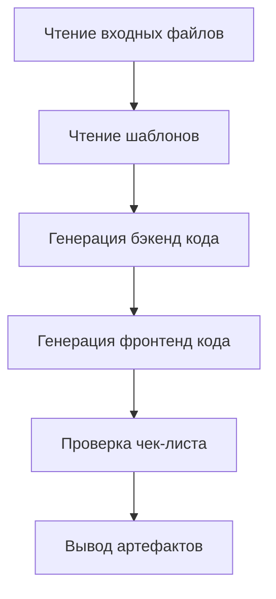

# Этап 5: Code — Генерация рабочего кода

## Что вы сможете делать после изучения

- **Генерировать full-stack код одним кликом**: Автоматически создавать рабочие фронтенд и бэкенд приложения из UI Schema и Tech дизайна
- **Понимать процесс генерации кода**: Освоить, как Code Agent преобразует документы дизайна в production-ready код
- **Валидировать качество кода**: Научиться проверять полноту кода, покрытие тестами и стандарты безопасности
- **Отлаживать распространённые проблемы**: Решать проблемы с установкой зависимостей, проверкой типов и подключением API

## Ваша текущая ситуация

Вы завершили структурирование идеи продукта, генерацию PRD, UI дизайн и дизайн технической архитектуры. Самая сложная задача впереди:

- **Как превратить дизайн в код**: UI Schema и Tech дизайн находятся в документах, но как это реализовать?
- **Full-stack разработка слишком сложна**: Бэкенд требует Express + Prisma, фронтенд — React Native, с чего начать?
- **Сложно гарантировать качество кода**: Как убедиться, что сгенерированный код имеет тесты, документацию и соответствует стандартам безопасности?
- **Не хватает времени**: Написание MVP занимает несколько дней, есть ли более быстрый способ?

Этап Code создан для решения этих проблем — он автоматически генерирует production-ready full-stack код на основе дизайна предыдущих этапов.

## Когда использовать этот подход

Когда вам нужно:

- **Быстро валидировать идею**: Проверить жизнеспособность идеи продукта с помощью кода, а не сразу погружаться в разработку
- **Создать каркас приложения**: Предоставить рабочую основу для дальнейшей разработки вместо начала с нуля
- **Унифицировать технологический стек**: Обеспечить, чтобы фронтенд и бэкенд код следовали единой архитектуре и стандартам
- **Сэкономить время разработки**: От дизайна до кода — MVP каркас за несколько минут

## Основная концепция

Code Agent — это **full-stack инженер**, его задача — преобразовать документы дизайна предыдущих этапов в рабочий код. Его ключевые особенности:

### Входы и выходы

| Тип | Содержимое |
| --- | --- |
| **Вход** | UI Schema (структура интерфейса), Tech дизайн (техническое решение), Prisma Schema (модель данных) |
| **Выход** | `artifacts/backend/` (бэкенд код), `artifacts/client/` (фронтенд код) |

### Технологический стек

| Часть | Технологический стек |
| --- | --- |
| **Бэкенд** | Express + Prisma + TypeScript |
| **Фронтенд** | React Native Web + Expo + TypeScript |
| **База данных** | SQLite (разработка) / PostgreSQL (продакшн) |

### Ограничения выполнения

::: warning Строгий scope
Code Agent **реализует только** функции, подтверждённые в PRD и UI Schema, **не добавляет**:
- Системы аутентификации и авторизации
- Сложное управление состоянием (например, Redux)
- Некритичные функциональные возможности
:::

## Пошаговое руководство

### Шаг 1: Вход в этап Code

Предположим, вы завершили этап Tech и теперь начинаете генерацию кода.

```bash
# Если в pipeline, перейти к следующему этапу
factory run code

# Или перезапустить с определённого этапа
factory run code
```

**Вы должны увидеть**: CLI отобразит информацию об этапе Code, включая входные файлы и ожидаемые выходы.

### Шаг 2: AI-ассистент выполняет Code Agent

AI-ассистент загрузит `agents/code.agent.md` и `skills/code/skill.md`, затем начнёт выполнение.

Процесс выполнения Code Agent:



**Что делает AI-ассистент**:

1. **Чтение шаблонов** (`skills/code/references/backend-template.md` и `frontend-template.md`)
   - Понимание структуры проекта и организации кода
   - Изучение организации директорий и конфигурационных файлов

2. **Анализ входных файлов**
   - Из `ui.schema.yaml` понимание структуры страниц и компонентов
   - Из `tech.md` понимание технической архитектуры и дизайна API
   - Из `schema.prisma` понимание модели данных

3. **Генерация бэкенд кода**
   - Создание структуры проекта Express + Prisma
   - Генерация API роутов и контроллеров
   - Реализация валидации данных и обработки ошибок
   - Добавление тестов и документации

4. **Генерация фронтенд кода**
   - Создание структуры проекта React Native + Expo
   - Генерация страничных компонентов и UI компонентов
   - Реализация управления состоянием данных и вызовов API
   - Добавление тестов и конфигурации навигации

5. **Проверка чек-листа**
   - Сверка с чек-листом в Code Skill
   - Обеспечение выполнения всех обязательных пунктов

6. **Вывод артефактов**
   - Генерация директорий `artifacts/backend/` и `artifacts/client/`

### Шаг 3: Валидация сгенерированного кода

После завершения Code Agent будет сгенерирована полная структура директорий кода.

**Структура директории бэкенда**:

```
backend/
├── package.json          # Зависимости и скрипты
├── tsconfig.json         # Конфигурация TypeScript
├── .env.example          # Шаблон переменных окружения
├── .gitignore            # Git ignore файл
├── README.md             # Описание проекта
├── GETTING_STARTED.md    # Руководство по быстрому запуску
├── prisma/
│   ├── schema.prisma     # Модель данных (скопировано с этапа Tech)
│   └── seed.ts           # Seed данные
└── src/
    ├── index.ts          # Точка входа приложения
    ├── app.ts            # Конфигурация Express приложения
    ├── config/           # Конфигурация переменных окружения
    ├── lib/              # Prisma клиент
    ├── middleware/       # Обработка ошибок, логирование
    ├── routes/           # API роуты
    ├── controllers/      # Контроллеры
    ├── services/         # Бизнес-логика
    ├── validators/       # Валидация входных данных (Zod)
    └── __tests__/        # Тестовые файлы
```

**Структура директории фронтенда**:

```
client/
├── package.json          # Зависимости и скрипты
├── tsconfig.json         # Конфигурация TypeScript
├── app.json              # Конфигурация Expo
├── babel.config.js       # Конфигурация Babel
├── .env.example          # Шаблон переменных окружения
├── .gitignore            # Git ignore файл
├── README.md             # Описание проекта
├── GETTING_STARTED.md    # Руководство по быстрому запуску
├── App.tsx               # Точка входа приложения
└── src/
    ├── config/           # Конфигурация переменных окружения
    ├── api/              # API клиент
    ├── components/       # UI компоненты
    ├── hooks/            # Пользовательские Hooks
    ├── navigation/       # Конфигурация навигации
    ├── screens/          # Страничные компоненты
    ├── styles/           # Темы и стили
    └── types/            # Определения типов
```

**Чекпоинт ✅**: Подтвердите наличие следующих файлов:

| Файл | Бэкенд | Фронтенд |
| --- | --- | --- |
| `package.json` | ✅ | ✅ |
| `tsconfig.json` | ✅ | ✅ |
| `.env.example` | ✅ | ✅ |
| `README.md` | ✅ | ✅ |
| `GETTING_STARTED.md` | ✅ | ✅ |
| Тестовые файлы | ✅ | ✅ |
| Prisma Schema | ✅ | - |

### Шаг 4: Запуск бэкенд сервиса

Следуйте инструкциям в `backend/GETTING_STARTED.md` для запуска сервиса.

```bash
# Перейти в директорию бэкенда
cd artifacts/backend

# Установить зависимости
npm install

# Настроить переменные окружения
cp .env.example .env

# Инициализировать базу данных
npx prisma generate
npx prisma migrate dev
npm run db:seed

# Запустить dev сервер
npm run dev
```

**Вы должны увидеть**:

```
Server running on http://localhost:3000
Environment: development
Database connected
```

**Чекпоинт ✅**: Проверьте работоспособность сервиса через health check endpoint.

```bash
curl http://localhost:3000/health
```

Должен вернуть:

```json
{
  "status": "ok",
  "timestamp": "2024-01-29T12:00:00.000Z"
}
```

### Шаг 5: Запуск фронтенд приложения

Следуйте инструкциям в `client/GETTING_STARTED.md` для запуска приложения.

```bash
# Открыть новый терминал, перейти в директорию фронтенда
cd artifacts/client

# Установить зависимости
npm install

# Настроить переменные окружения
cp .env.example .env

# Запустить dev сервер
npm start
```

**Вы должны увидеть**: Metro Bundler запустится, отобразятся опции запуска.

```
› Metro waiting on exp://192.168.x.x:19000
› Scan the QR code above with Expo Go (Android) or the Camera app (iOS)
› Press a │ open Android
› Press i │ open iOS simulator
› Press w │ open web

Logs for your project will appear below.
```

Выберите платформу для запуска:
- Нажмите `w` — открыть в браузере (самый удобный способ тестирования)

**Чекпоинт ✅**: Приложение открывается в браузере и отображает фронтенд интерфейс.

### Шаг 6: Тестирование интеграции фронтенд-бэкенд

1. **Посетите документацию API**: http://localhost:3000/api-docs
   - Просмотрите Swagger UI документацию
   - Подтвердите, что все endpoints определены

2. **Тестируйте фронтенд функции**:
   - Создание новых данных
   - Редактирование данных
   - Удаление данных
   - Обновление списка

3. **Проверьте логи консоли**:
   - Есть ли ошибки вызовов API на фронтенде
   - Есть ли логи запросов на бэкенде
   - Есть ли необработанные исключения

### Шаг 7: Подтверждение чекпоинтов

Когда AI-ассистент подтвердит завершение этапа Code, вы увидите:

```
✅ Этап Code завершён

Сгенерированные файлы:
- Бэкенд: artifacts/backend/ (Express + Prisma + TypeScript)
- Фронтенд: artifacts/client/ (React Native + Expo + TypeScript)

Опции чекпоинта:
[1] Продолжить — перейти к этапу Validation
[2] Повторить — перегенерировать код
[3] Пауза — сохранить текущее состояние
```

Выберите **Продолжить** для перехода к следующему этапу.

## Чекпоинт ✅

После завершения этапа Code вы должны:

- [ ] Бэкенд код запускается нормально (`npm run dev`)
- [ ] Фронтенд приложение открывается в браузере
- [ ] Health check endpoint возвращает нормальный ответ
- [ ] API документация доступна (`/api-docs`)
- [ ] Фронтенд может вызывать бэкенд API
- [ ] Фронтенд обрабатывает состояния Loading и Error
- [ ] Тестовые файлы существуют и запускаются (`npm test`)

## Распространённые проблемы

### Проблема 1: Ошибка установки зависимостей

**Симптом**: `npm install` выдаёт ошибку

**Решение**:

```bash
# Очистить кэш и повторить
rm -rf node_modules package-lock.json
npm cache clean --force
npm install
```

### Проблема 2: Ошибка миграции Prisma

**Симптом**: `npx prisma migrate dev` выдаёт ошибку

**Решение**:

```bash
# Сбросить базу данных
npx prisma migrate reset

# Или вручную удалить файл базы данных
rm prisma/dev.db
npx prisma migrate dev
```

### Проблема 3: Фронтенд не может подключиться к бэкенду

**Симптом**: Фронтенд выдаёт ошибку `Network Error` или `ECONNREFUSED`

**Чек-лист проверки**:

1. Подтвердите, что бэкенд запущен: `curl http://localhost:3000/health`
2. Проверьте конфигурацию `.env` фронтенда: `EXPO_PUBLIC_API_URL=http://localhost:3000/api`
3. Если тестируете на реальном устройстве, измените на LAN IP (например, `http://192.168.1.100:3000/api`)

### Проблема 4: Ошибка тестов

**Симптом**: `npm test` выдаёт ошибку

**Решение**:

- Подтвердите наличие тестовых файлов: `src/__tests__/`
- Проверьте установку тестовых зависимостей: `npm install --save-dev vitest @testing-library/react-native`
- Просмотрите сообщение об ошибке, исправьте проблемы в коде

## Специальные требования Code Agent

Code Agent имеет специальные ограничения и требования, на которые нужно обратить внимание:

### 1. Обязательное чтение шаблонов

Перед генерацией кода Code Agent **должен полностью прочитать**:
- `skills/code/references/backend-template.md`
- `skills/code/references/frontend-template.md`

Эти шаблонные файлы демонстрируют production-ready структуру проекта и примеры кода.

### 2. Запрет на добавление аутентификации и авторизации

::: warning Ограничение scope
Code Agent **строго запрещено** добавлять:
- Функции входа/регистрации
- Token аутентификацию
- Контроль доступа
- Сложное управление состоянием (например, Redux)
:::

Эти функции будут добавлены в последующих итерациях, на этапе MVP фокус только на основной бизнес-логике.

### 3. Требования к качеству кода

Сгенерированный код должен удовлетворять:

| Требование | Описание |
| --- | --- |
| **TypeScript** | Строгий режим, без типа `any` |
| **Тесты** | Health check, CRUD endpoints, тесты валидации входных данных |
| **API документация** | Спецификация Swagger/OpenAPI (`/api-docs`) |
| **Обработка ошибок** | Единообразный middleware обработки ошибок |
| **Логирование** | Структурированное логирование (winston/pino) |
| **Безопасность** | Zod валидация, helmet, CORS whitelist |
| **Документация** | README и руководство по быстрому запуску |

## Чек-лист генерации кода

Code Agent будет генерировать код в соответствии со следующим чек-листом.

### Обязательные пункты бэкенда

- [ ] Поддержка переменных окружения (dotenv)
- [ ] Фиксация версий зависимостей (Prisma 5.x)
- [ ] Определения типов (обработка JSON полей)
- [ ] Ключевые зависимости: Express + Prisma + Zod + Helmet
- [ ] API endpoints: health check + CRUD
- [ ] Единообразный формат ответов
- [ ] Валидация входных данных (Zod Schema)
- [ ] Middleware обработки ошибок
- [ ] Тестовые файлы (health check + CRUD + валидация)
- [ ] Swagger API документация
- [ ] Seed данные (`prisma/seed.ts`)

### Обязательные пункты фронтенда

- [ ] Ключевые зависимости: React Native Web + Expo + React Navigation
- [ ] Персистентное хранилище (AsyncStorage)
- [ ] Конфигурация навигации (React Navigation 6+)
- [ ] SafeAreaView
- [ ] API Client (Axios + interceptors)
- [ ] Пользовательские Hooks (управление данными)
- [ ] Базовые UI компоненты (Button, Input, Card, Loading)
- [ ] Страничные компоненты (как минимум главная и детальная)
- [ ] Обработка состояний Loading и Error
- [ ] Pull-to-refresh (RefreshControl)
- [ ] Тестовые файлы (рендеринг страниц + компоненты + Hooks)

## Тестирование и обеспечение качества

Даже на этапе MVP Code Agent генерирует базовый тестовый код.

### Пример теста бэкенда

```typescript
// src/__tests__/items.test.ts
import { describe, it, expect } from 'vitest';
import request from 'supertest';
import app from '../app';

describe('Items API', () => {
  it('should return health check', async () => {
    const res = await request(app).get('/health');
    expect(res.status).toBe(200);
  });

  it('should create a new item', async () => {
    const res = await request(app)
      .post('/api/items')
      .send({ title: 'Test Item', amount: 100 });

    expect(res.status).toBe(201);
    expect(res.body.data).toHaveProperty('id');
  });

  it('should reject invalid item', async () => {
    const res = await request(app)
      .post('/api/items')
      .send({ title: '' }); // Отсутствует обязательное поле

    expect(res.status).toBe(400);
  });
});
```

### Пример теста фронтенда

```typescript
// src/screens/__tests__/HomeScreen.test.tsx
import React from 'react';
import { render, screen } from '@testing-library/react-native';
import HomeScreen from '../HomeScreen';

describe('HomeScreen', () => {
  it('should render without crashing', () => {
    render(<HomeScreen />);
    expect(screen.getByText(/home/i)).toBeTruthy();
  });

  it('should show loading state initially', () => {
    render(<HomeScreen />);
    expect(screen.getByTestId('loading-indicator')).toBeTruthy();
  });
});
```

## Руководство по быстрому запуску

Каждый сгенерированный проект будет содержать `GETTING_STARTED.md`, помогающий запустить проект за 5 минут.

### Быстрый запуск бэкенда

```bash
# 1. Перейти в проект
cd artifacts/backend

# 2. Установить зависимости
npm install

# 3. Настроить переменные окружения
cp .env.example .env

# 4. Инициализировать базу данных
npx prisma generate
npx prisma migrate dev
npm run db:seed

# 5. Запустить сервис
npm run dev
```

### Быстрый запуск фронтенда

```bash
# 1. Перейти в проект
cd artifacts/client

# 2. Установить зависимости
npm install

# 3. Настроить переменные окружения
cp .env.example .env

# 4. Запустить приложение
npm start
```

**Примечание**: Убедитесь, что бэкенд запущен, иначе фронтенд не сможет подключиться к API.

## Резюме урока

Этап Code — одна из ключевых частей pipeline, преобразующая дизайн предыдущих этапов в рабочий код.

**Ключевые моменты**:

1. **Входы и выходы**: Code Agent генерирует фронтенд и бэкенд код на основе UI Schema, Tech дизайна и Prisma Schema
2. **Технологический стек**: Бэкенд использует Express + Prisma, фронтенд — React Native Web + Expo
3. **Контроль scope**: Реализуются только функции из PRD и UI Schema, без аутентификации и авторизации
4. **Обеспечение качества**: Генерация тестов, API документации и руководства по быстрому запуску
5. **Стандарты валидации**: Бэкенд запускается, фронтенд рендерится, API вызывается

## Предварительный просмотр следующего урока

> В следующем уроке мы изучим **[этап Validation](../stage-validation/)**.
>
> Вы узнаете:
> - Как валидировать качество сгенерированного кода
> - Установка зависимостей и проверка типов
> - Валидация Prisma Schema
> - Генерация отчёта валидации

---

## Приложение: Справка по исходному коду

<details>
<summary><strong>Нажмите, чтобы развернуть расположение исходного кода</strong></summary>

> Обновлено: 2026-01-29

| Функция | Путь к файлу | Строки |
| --- | --- | --- |
| Определение Code Agent | [`agents/code.agent.md`](https://github.com/hyz1992/agent-app-factory/blob/main/agents/code.agent.md) | 1-82 |
| Code Skill | [`skills/code/skill.md`](https://github.com/hyz1992/agent-app-factory/blob/main/skills/code/skill.md) | 1-1488 |
| Шаблон бэкенда | [`skills/code/references/backend-template.md`](https://github.com/hyz1992/agent-app-factory/blob/main/skills/code/references/backend-template.md) | 1-670 |
| Шаблон фронтенда | [`skills/code/references/frontend-template.md`](https://github.com/hyz1992/agent-app-factory/blob/main/skills/code/references/frontend-template.md) | 1-1231 |
| Определение pipeline | [`pipeline.yaml`](https://github.com/hyz1992/agent-app-factory/blob/main/pipeline.yaml) | 63-77 |

**Ключевые ограничения**:
- Реализуются только функции из PRD и UI Schema (`code.agent.md:25`)
- Запрещено добавлять аутентификацию, авторизацию или сложное управление состоянием (`code.agent.md:28`)
- Обязательно полное чтение шаблонных файлов (`code/skill.md:1476`)
- Все операции с базой данных через Service слой (`backend-template.md:665`)
- Все входные данные должны проходить Zod валидацию (`backend-template.md:666`)

**Ключевой чек-лист**:
- Обязательные пункты бэкенда: переменные окружения, фиксация зависимостей, определения типов (`code.agent.md:37-47`)
- Обязательные пункты фронтенда: ключевые зависимости, пути импорта, конфигурационные файлы (`code.agent.md:50-64`)
- Предотвращение распространённых ошибок (`code.agent.md:65-74`)

</details>
