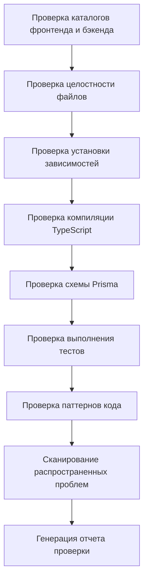

# Этап 6: Validation - проверка качества кода

## Чему вы научитесь

- **Автоматическая проверка кода**: одной командой проверьте установку зависимостей, проверку типов и базовые тесты для фронтенда и бэкенда
- **Интерпретация отчетов проверки**: понимайте детальные отчеты и классификацию проблем, генерируемые Validation Agent
- **Быстрое поиск проблем**: исправляйте ошибки кода на основе конкретных местоположений и рекомендаций в отчете
- **Обеспечение качества кода**: подтверждайте, что сгенерированный код соответствует стандартам готовности к производству

## Ваша текущая проблема

Вы завершили этап Code, сгенерировали код для фронтенда и бэкенда, но самая большая проблема:

- **Запустится ли код**: все ли зависимости установлены правильно? пройдет ли проверка типов?
- **Верен ли Prisma**: есть ли проблемы с синтаксисом схемы? можно ли сгенерировать клиент?
- **Надежны ли тесты**: есть ли тесты? проходят ли они?
- **Есть ли проблемы**: верна ли конфигурация переменных окружения? правильны ли пути импорта?

Ручная проверка этих проблем занимает много времени и легко что-то пропустить. Этап Validation создан для решения этих проблем — он автоматически проверяет качество кода и генерирует детальные отчеты.

## Когда использовать этот подход

Когда вам нужно:

- **Быстро проверить код**: подтвердить, что сгенерированный код соответствует базовым стандартам качества
- **Обнаружить потенциальные проблемы**: найти проблемы с зависимостями, типами, тестами до развертывания
- **Гарантия качества кода**: убедиться, что код фронтенда и бэкенда проходит базовые проверки
- **Избежать неудач развертывания**: заранее найти проблемы и сократить расходы на переделку

## Основная идея

Validation Agent — это **инспектор качества**, его задача — проверить, соответствует ли код, сгенерированный Code Agent, стандартам качества. Его основные характеристики:

### Вход и выход

| Тип | Содержимое |
|------|------|
| **Вход** | `artifacts/backend/` (код бэкенда), `artifacts/client/` (код фронтенда) |
| **Выход** | `artifacts/validation/report.md` (отчет проверки) |

### Пункты проверки

Validation Agent выполняет проверки 8 категорий:

| Пункт проверки | Описание |
|--------|------|
| **Целостность файлов** | подтверждение, что все необходимые файлы существуют |
| **Установка зависимостей** | проверка, что зависимости в `package.json` могут быть корректно разрешены |
| **Компиляция TypeScript** | проверка, проходит ли код проверку типов |
| **Схема Prisma** | проверка правильности синтаксиса моделей данных |
| **Выполнение тестов** | подтверждение, что тесты существуют и проходят |
| **Стандарты кода** | проверка конфигурации скриптов lint |
| **Ключевые паттерны** | сканирование ключевых паттернов в коде (обработка ошибок, проверки работоспособности и т.д.) |
| **Распространенные проблемы** | идентификация известных шаблонов ошибок |

### Ограничения выполнения

::: warning Режим только для чтения
Validation Agent **только проверяет, не изменяет**:
- запрещено изменять любые файлы кода
- запрещено фактически устанавливать зависимости (используйте `--dry-run`)
- запрещено выполнять команды с побочными эффектами
:::

## Следуйте за мной

### Шаг 1: Войдите в этап Validation

Предположим, вы завершили этап Code и теперь хотите начать проверку качества кода.

```bash
# Если в пайплайне, просто переходите к следующему этапу
factory run validation

# Или начните заново с определенного этапа
factory run validation
```

**Вы должны увидеть**: CLI отобразит информацию об этапе Validation, включая входные файлы и ожидаемый вывод.

### Шаг 2: ИИ-помощник выполняет Validation Agent

ИИ-помощник загрузит `agents/validation.agent.md` и начнет выполнение.

Процесс выполнения Validation Agent:



**Что сделает ИИ-помощник**:

1. **Проверка каталога бэкенда**
   - подтвердить, что `artifacts/backend/` существует
   - проверить необходимые файлы: `package.json`, `tsconfig.json`, `.env.example`, `prisma/schema.prisma`

2. **Проверка каталога фронтенда**
   - подтвердить, что `artifacts/client/` существует
   - проверить необходимые файлы: `package.json`, `tsconfig.json`, `app.json`, `App.tsx`

3. **Проверка установки зависимостей**
   - бэкенд: `cd artifacts/backend && npm install --dry-run`
   - фронтенд: `cd artifacts/client && npm install --dry-run`
   - проверка, могут ли зависимости быть корректно разрешены

4. **Проверка компиляции TypeScript**
   - бэкенд: `cd artifacts/backend && npx tsc --noEmit`
   - фронтенд: `cd artifacts/client && npx tsc --noEmit`
   - проверка, проходит ли код проверку типов

5. **Проверка схемы Prisma**
   - `cd artifacts/backend && npx prisma validate`
   - проверка правильности синтаксиса моделей данных

6. **Проверка выполнения тестов**
   - бэкенд: `cd artifacts/backend && npm test`
   - фронтенд: `cd artifacts/client && npm test`
   - подтверждение, что тесты существуют и проходят

7. **Проверка паттернов кода**
   - сканирование ключевых паттернов: обработка ошибок, проверки работоспособности, SafeAreaView и т.д.
   - проверка конфигурации зависимостей: dotenv, React Native Web и т.д.

8. **Сканирование распространенных проблем**
   - SQLite использует определение `type`
   - значения переменных окружения в кавычках
   - неправильные пути импорта
   - отсутствуют необходимые импорты

9. **Генерация отчета проверки**
   - обобщение всех результатов проверки
   - перечисление найденных проблем
   - предоставление рекомендаций по исправлению
   - сохранение в `artifacts/validation/report.md`

### Шаг 3: Просмотр отчета проверки

После завершения Validation Agent будет создан детальный отчет проверки.

Откройте `artifacts/validation/report.md`:

```bash
cat artifacts/validation/report.md
```

**Вы должны увидеть**:

```markdown
# Отчет проверки кода

**Время генерации**: 2026-01-29 12:00:00
**Результат проверки**: ✅ Прошел

## Сводка

- Проверка бэкенда: ✅
- Проверка фронтенда: ✅
- Общая оценка: качество кода соответствует стандартам MVP, можно перейти к этапу Preview

---

## Детали проверки бэкенда

### Целостность файлов
| Файл | Статус |
|------|------|
| package.json | ✅ |
| tsconfig.json | ✅ |
| .env.example | ✅ |
| prisma/schema.prisma | ✅ |
| src/index.ts | ✅ |
| src/app.ts | ✅ |

### Установка зависимостей
- Статус: ✅
- Детали: все зависимости могут быть корректно разрешены

### Компиляция TypeScript
- Статус: ✅
- Количество ошибок: 0

### Проверка Prisma
- Статус: ✅
- Детали: синтаксис схемы Prisma правильный

### Выполнение тестов
- Статус: ✅
- Количество тестов: 12
- Прошедших: 12
- Неудачных: 0

### Проверка паттернов кода
| Пункт проверки | Статус |
|--------|------|
| Промежуточное ПО обработки ошибок | ✅ |
| Точка работоспособности | ✅ |
| Использование переменных окружения | ✅ |
| Импорт Prisma Client | ✅ |
| Существование тестовых файлов | ✅ |
| Импорт dotenv в первой строке | ✅ |

---

## Детали проверки фронтенда

### Целостность файлов
| Файл | Статус |
|------|------|
| package.json | ✅ |
| tsconfig.json | ✅ |
| app.json | ✅ |
| App.tsx | ✅ |
| src/navigation/index.tsx | ✅ |

### Установка зависимостей
- Статус: ✅
- Детали: все зависимости могут быть корректно разрешены

### Компиляция TypeScript
- Статус: ✅
- Количество ошибок: 0

### Выполнение тестов
- Статус: ✅
- Количество тестов: 8
| Прошедших: 8
| Неудачных: 0

### Проверка паттернов кода
| Пункт проверки | Статус |
|--------|------|
| Использование SafeAreaView | ✅ |
| Компонент Loading | ✅ |
| Обработка ошибок | ✅ |
| Инкапсуляция вызовов API | ✅ |
| Зависимость React Native Web | ✅ |
| Зависимость async-storage | ✅ |

---

## Найденные проблемы

Нет серьезных проблем или предупреждений

---

## Рекомендации по исправлению

Исправление не требуется

---

## Заключение

Качество кода соответствует стандартам MVP, рекомендуется перейти к этапу Preview.
```

### Шаг 4: Обработка неудачной проверки

Если проверка не прошла, в отчете будут перечислены конкретные проблемы и рекомендации по исправлению.

**Пример: отчет проверки с частичным прохождением**

```markdown
**Результат проверки**: ⚠️ Частично прошел

## Найденные проблемы

### Серьезные проблемы (требуется исправление)

1. Ошибка компиляции TypeScript
   - Местоположение: src/controllers/items.ts:15
   - Ошибка: Property 'title' does not exist on type 'any'
   - Рекомендация: добавьте определение типа `const item: Item = req.body;`

2. Ошибка проверки схемы Prisma
   - Местоположение: prisma/schema.prisma:10
   - Ошибка: Invalid datasource provider 'sqlite'
   - Рекомендация: измените `provider = "sqlite"` на `provider = "postgresql"` (для производственной среды)

### Предупреждения (рекомендуется исправить)

1. Отсутствуют тестовые файлы
   - Местоположение: src/controllers/
   - Рекомендация: добавьте тестовый файл для каждого контроллера

2. Неполная конфигурация переменных окружения
   - Местоположение: .env.example
   - Рекомендация: добавьте пример `DATABASE_URL`

## Рекомендации по исправлению

1. Исправьте ошибку TypeScript: добавьте определение типа в `src/controllers/items.ts`
2. Обновите схему Prisma: измените provider источника данных
3. Добавьте тестовые файлы: напишите тесты для контроллеров
4. Улучшите переменные окружения: дополните `.env.example`
```

**Шаги исправления**:

1. **Найдите проблемный файл**
   ```bash
   # Откройте проблемный файл
   vim artifacts/backend/src/controllers/items.ts
   ```

2. **Исправьте код**
   ```typescript
   // Добавьте определение типа
   const item: Item = req.body;
   ```

3. **Обновите схему Prisma**
   ```prisma
   datasource db {
     provider = "postgresql"  // Измените на postgresql
     url      = env("DATABASE_URL")
   }
   ```

4. **Повторная проверка**
   ```bash
   # Повторно запустите этап Validation
   factory run validation
   ```

### Шаг 5: Подтверждение контрольной точки

Когда ИИ-помощник подтвердит завершение этапа Validation, вы увидите:

```
✅ Этап Validation завершен

Сгенерированные файлы:
- Отчет проверки: artifacts/validation/report.md

Результат проверки: ✅ Прошел / ⚠️ Частично прошел / ❌ Неудачно

Опции контрольной точки:
[1] Продолжить - перейти к этапу Preview
[2] Повторить - повторно проверить код
[3] Пауза - сохранить текущее состояние
```

- Если проверка прошла, выберите **Продолжить** для перехода к следующему этапу
- Если есть проблемы, исправьте и выберите **Повторить** для повторной проверки
- Если нужно время для исправления, выберите **Пауза** для сохранения текущего состояния

## Контрольная точка ✅

После завершения этапа Validation вы должны:

- [ ] Все необходимые файлы фронтенда и бэкенда существуют
- [ ] Зависимости могут быть корректно разрешены (`npm install --dry-run`)
- [ ] Компиляция TypeScript без ошибок (`npx tsc --noEmit`)
- [ ] Проверка схемы Prisma прошла (`npx prisma validate`)
- [ ] Тестовые файлы существуют и проходят (`npm test`)
- [ ] Все проверки ключевых паттернов пройдены
- [ ] Отчет проверки создан (`artifacts/validation/report.md`)

## Предупреждения о проблемах

### Проблема 1: Неудача установки зависимостей

**Симптом**: `npm install --dry-run` выдает ошибку

**Решение**:

```bash
# Проверьте синтаксис package.json
cat artifacts/backend/package.json

# Распространенные проблемы:
# - Отсутствуют кавычки
# - Неверные имена зависимостей
# - Неверный формат версий

# Повторно проверьте после исправления
factory run validation
```

### Проблема 2: Ошибка компиляции TypeScript

**Симптом**: `npx tsc --noEmit` выдает ошибку

**Распространенные типы ошибок**:

| Ошибка | Причина | Решение |
|------|------|----------|
| `Property does not exist` | Тип не определен | Добавьте определение типа |
| `Module not found` | Ошибка пути импорта | Проверьте путь импорта |
| `Implicit any` | Неявный тип any | Включите строгий режим и добавьте тип |

### Проблема 3: Неудача проверки схемы Prisma

**Симптом**: `npx prisma validate` выдает ошибку

**Распространенные ошибки**:

| Ошибка | Причина | Решение |
|------|------|----------|
| `Invalid datasource provider` | Ошибка provider | Используйте `postgresql` или `sqlite` |
| `Error parsing` | Ошибка синтаксиса | Проверьте определение model |
| `Relation error` | Ошибка определения связи | Проверьте поля `@relation` |

### Проблема 4: Неудача тестов

**Симптом**: `npm test` выдает ошибку

**Решение**:

```bash
# Проверьте, существуют ли тестовые файлы
find artifacts/backend -name "*.test.ts"

# Проверьте, установлены ли тестовые зависимости
cat artifacts/backend/package.json | grep -A 5 "devDependencies"

# Если отсутствуют тестовые зависимости, установите вручную
cd artifacts/backend
npm install --save-dev vitest @testing-library/react-native
```

### Проблема 5: Неудача проверки ключевых паттернов

**Симптом**: отчет показывает отсутствие ключевых паттернов

**Распространенные отсутствующие паттерны**:

| Паттерн | Местоположение | Метод исправления |
|------|------|----------|
| Промежуточное ПО обработки ошибок | `src/middleware/error.ts` | Добавьте промежуточное ПО обработки ошибок |
| Точка работоспособности | `src/routes/health.ts` | Добавьте маршрут `/health` |
| Импорт dotenv в первой строке | `src/index.ts:1` | Добавьте `import 'dotenv/config';` |
| SafeAreaView | `src/screens/Home.tsx` | Оберните содержимое в SafeAreaView |

## Специальные требования Validation Agent

Validation Agent имеет специальные ограничения и требования, которые требуют особого внимания:

### 1. Режим только для чтения

::: warning Запрещено изменять код
Validation Agent **категорически запрещает** изменение любых файлов кода, только выполняет проверку и генерацию отчетов.
:::

### 2. Установка в режиме dry-run

Проверка установки зависимостей использует параметр `--dry-run`, фактическая установка зависимостей не выполняется:

```bash
npm install --dry-run  # Только проверяет, могут ли зависимости быть разрешены
```

### 3. Полный отчет

Validation Agent **должен** сгенерировать полный отчет проверки, включающий:

| Раздел | Содержимое |
|------|------|
| **Сводка** | Статус проверки фронтенда/бэкенда и общая оценка |
| **Детали бэкенда** | Целостность файлов, зависимости, компиляция, Prisma, тесты, проверка паттернов |
| **Детали фронтенда** | Целостность файлов, зависимости, компиляция, тесты, проверка паттернов |
| **Найденные проблемы** | Список серьезных проблем и предупреждений |
| **Рекомендации по исправлению** | Конкретные шаги исправления для проблем |
| **Заключение** | Общая оценка и рекомендации на следующие шаги |

### 4. Классификация проблем

Validation Agent классифицирует проблемы на три уровня:

| Уровень | Стандарт | Способ обработки |
|------|------|----------|
| **Серьезные проблемы** | Требуется исправление для прохождения | Отмечается как "требуется исправление" в отчете |
| **Предупреждения** | Рекомендуется исправление, но не критично | Отмечается как "рекомендуется исправление" в отчете |
| **Информация** | Только для справки | Не влияет на результат проверки |

## Определение результатов проверки

Validation Agent определяет статус проверки на основе результатов проверки.

### Условия прохождения (✅ Прошел)

- Все необходимые файлы существуют
- Установка зависимостей без ошибок
- Компиляция TypeScript без ошибок
- Проверка схемы Prisma прошла
- Базовые тесты существуют и все прошли
- Все проверки ключевых паттернов пройдены

### Условия частичного прохождения (⚠️ Частично прошел)

- Необходимые файлы существуют
- Установка зависимостей без ошибок
- Компиляция TypeScript имеет предупреждения, но без ошибок
- Тесты существуют, но частично неудачны (< 30% неудач)
- Есть некритические проблемы

### Условия неудачи (❌ Неудачно)

- Отсутствуют необходимые файлы
- Неудача установки зависимостей
- Ошибки компиляции TypeScript
- Неудача проверки схемы Prisma
- Отсутствуют тесты или массовые неудачи (≥ 30% неудач)

## Контрольный список качества кода

Validation Agent проверяет код по следующему контрольному списку.

### Обязательные элементы бэкенда

- [ ] `package.json` существует
- [ ] `tsconfig.json` существует
- [ ] `.env.example` существует
- [ ] `prisma/schema.prisma` существует
- [ ] `src/index.ts` существует
- [ ] `src/app.ts` существует
- [ ] `src/index.ts` импортирует dotenv в первой строке
- [ ] dotenv в dependencies
- [ ] Существует промежуточное ПО обработки ошибок
- [ ] Существует точка работоспособности (`/health`)
- [ ] Переменные окружения используют `process.env`
- [ ] Prisma Client импортирован правильно
- [ ] Существует хотя бы один тестовый файл
- [ ] package.json содержит скрипт `test`

### Обязательные элементы фронтенда

- [ ] `package.json` существует
- [ ] `tsconfig.json` существует
- [ ] `app.json` существует
- [ ] `App.tsx` существует
- [ ] `src/navigation/index.tsx` существует
- [ ] Существует использование SafeAreaView
- [ ] Существует компонент Loading
- [ ] Существует обработка ошибок
- [ ] Вызовы API через инкапсуляционный слой
- [ ] Включена зависимость React Native Web
- [ ] Включена зависимость async-storage
- [ ] `app.json` не ссылается на несуществующие файлы изображений

## Сканирование распространенных проблем

Validation Agent сканирует следующие известные шаблоны проблем:

| Пункт проверки | Метод обнаружения | Рекомендация по исправлению |
|--------|----------|----------|
| SQLite использует определение `type` | Проверяет, содержит ли schema.prisma `type Xxx` | Удалите определение `type` |
| Значения переменных окружения в кавычках | Проверяет, содержит ли .env `="xxx"` или `='xxx'` | Удалите кавычки |
| Версия Prisma — 7.x | Проверяет, равна ли версия prisma в package.json ^7 | Используйте Prisma 5.x |
| Неверные пути импорта | Проверяет, есть ли в screens `from './ui/'` | Измените на `from '../components/ui/'` |
| Отсутствует импорт View | Проверяет, использует ли компонент View, но не импортирует | Добавьте `import { View } from 'react-native'` |
| Незавершенная строка | Проверяет, есть ли в .tsx файлах последовательные кавычки | Добавьте отсутствующие кавычки |

## Примеры отчетов проверки

### Отчет проверки, прошедший успешно

```markdown
# Отчет проверки кода

**Время генерации**: 2026-01-29 12:00:00
**Результат проверки**: ✅ Прошел

## Сводка

- Проверка бэкенда: ✅
- Проверка фронтенда: ✅
- Общая оценка: качество кода соответствует стандартам MVP, можно перейти к этапу Preview

---

## Детали проверки бэкенда

### Целостность файлов
| Файл | Статус |
|------|------|
| package.json | ✅ |
| tsconfig.json | ✅ |
| .env.example | ✅ |
| prisma/schema.prisma | ✅ |
| src/index.ts | ✅ |
| src/app.ts | ✅ |

### Установка зависимостей
- Статус: ✅
- Детали: все зависимости могут быть корректно разрешены

### Компиляция TypeScript
- Статус: ✅
- Количество ошибок: 0

### Проверка Prisma
- Статус: ✅
- Детали: синтаксис схемы Prisma правильный

### Выполнение тестов
- Статус: ✅
- Количество тестов: 12
| Прошедших: 12
| Неудачных: 0

### Проверка паттернов кода
| Пункт проверки | Статус |
|--------|------|
| Промежуточное ПО обработки ошибок | ✅ |
| Точка работоспособности | ✅ |
| Использование переменных окружения | ✅ |
| Импорт Prisma Client | ✅ |
| Существование тестовых файлов | ✅ |
| Импорт dotenv в первой строке | ✅ |

---

## Детали проверки фронтенда

### Целостность файлов
| Файл | Статус |
|------|------|
| package.json | ✅ |
| tsconfig.json | ✅ |
| app.json | ✅ |
| App.tsx | ✅ |
| src/navigation/index.tsx | ✅ |

### Установка зависимостей
- Статус: ✅
- Детали: все зависимости могут быть корректно разрешены

### Компиляция TypeScript
- Статус: ✅
- Количество ошибок: 0

### Выполнение тестов
- Статус: ✅
- Количество тестов: 8
| Прошедших: 8
| Неудачных: 0

### Проверка паттернов кода
| Пункт проверки | Статус |
|--------|------|
| Использование SafeAreaView | ✅ |
| Компонент Loading | ✅ |
| Обработка ошибок | ✅ |
| Инкапсуляция вызовов API | ✅ |
| Зависимость React Native Web | ✅ |
| Зависимость async-storage | ✅ |

---

## Найденные проблемы

Нет серьезных проблем или предупреждений

---

## Рекомендации по исправлению

Исправление не требуется

---

## Заключение

Качество кода соответствует стандартам MVP, рекомендуется перейти к этапу Preview.
```

### Неудачный отчет проверки

```markdown
# Отчет проверки кода

**Время генерации**: 2026-01-29 12:00:00
**Результат проверки**: ❌ Неудачно

## Сводка

- Проверка бэкенда: ❌
- Проверка фронтенда: ⚠️
- Общая оценка: в бэкенде есть серьезные проблемы, необходимо исправить перед продолжением

---

## Найденные проблемы

### Серьезные проблемы (требуется исправление)

1. Ошибка компиляции TypeScript
   - Местоположение: src/controllers/items.ts:15
   - Ошибка: Property 'title' does not exist on type 'any'
   - Рекомендация: добавьте определение типа `const item: Item = req.body;`

2. Ошибка проверки схемы Prisma
   - Местоположение: prisma/schema.prisma:10
   - Ошибка: Invalid datasource provider 'sqlite'
   - Рекомендация: измените `provider = "sqlite"` на `provider = "postgresql"`

3. Отсутствуют необходимые файлы
   - Местоположение: src/
   - Файл: src/middleware/error.ts
   - Рекомендация: создайте промежуточное ПО обработки ошибок

### Предупреждения (рекомендуется исправить)

1. Неудача тестов фронтенда
   - Местоположение: src/screens/__tests__/HomeScreen.test.tsx
   - Неудачные: 2/8 тестов не прошли
   - Рекомендация: исправьте тестовые случаи

2. Отсутствует компонент Loading
   - Местоположение: src/components/
   - Рекомендация: создайте компонент Loading и используйте его правильно

---

## Рекомендации по исправлению

1. Исправьте ошибку TypeScript: добавьте определение типа в `src/controllers/items.ts`
2. Обновите схему Prisma: измените provider источника данных на postgresql
3. Создайте промежуточное ПО обработки ошибок: добавьте `src/middleware/error.ts`
4. Исправьте тесты фронтенда: проверьте и исправьте неудачные тестовые случаи
5. Создайте компонент Loading: добавьте `src/components/Loading.tsx`

---

## Заключение

В бэкенде есть серьезные проблемы, необходимо исправить перед продолжением. Рекомендуется:
1. Исправьте ошибки компиляции TypeScript
2. Обновите схему Prisma
3. Добавьте отсутствующие файлы
4. Повторно запустите этап Validation
```

## Резюме урока

Этап Validation — это этап обеспечения качества в пайплайне, который гарантирует, что сгенерированный код соответствует базовым стандартам качества.

**Ключевые моменты**:

1. **Процесс проверки**: Validation Agent автоматически проверяет целостность файлов, зависимости, компиляцию, тесты и т.д.
2. **Режим только для чтения**: только проверка, без изменений, используйте `--dry-run` для избежания побочных эффектов
3. **Классификация проблем**: проблемы делятся на три уровня — серьезные, предупреждения, информация
4. **Детальный отчет**: генерация отчета проверки с конкретными местоположениями и рекомендациями по исправлению
5. **Определение результатов**: определение прохождения/частичного прохождения/неудачи на основе результатов проверки

## Предпросмотр следующего урока

> Следующий урок мы изучаем **[Этап Preview](../stage-preview/)**.
>
> Вы узнаете:
> - Как создать документацию по запуску
> - Быстрое руководство по запуску
> - Конфигурация развертывания (Docker, CI/CD)

---

## Приложение: справочник исходного кода

<details>
<summary><strong>Нажмите, чтобы увидеть местоположения исходного кода</strong></summary>

> Время обновления: 2026-01-29

| Функция | Путь к файлу | Номер строки |
|------|----------|------|
| Определение Validation Agent | [`agents/validation.agent.md`](https://github.com/hyz1992/agent-app-factory/blob/main/agents/validation.agent.md) | 1-320 |
| Определение пайплайна | [`pipeline.yaml`](https://github.com/hyz1992/agent-app-factory/blob/main/pipeline.yaml) | 79-96 |

**Ключевые ограничения**:
- Запрещено изменять любые файлы кода (`validation.agent.md:293`)
- Запрещено фактически устанавливать зависимости, используйте `--dry-run` (`validation.agent.md:294`)
- Должен генерировать полный отчет проверки (`validation.agent.md:296`)
- Должен предоставлять конкретные рекомендации по исправлению (`validation.agent.md:298`)

**Пункты проверки**:
- Проверка целостности файлов (`validation.agent.md:24-42`)
- Проверка установки зависимостей (`validation.agent.md:43-53`)
- Проверка компиляции TypeScript (`validation.agent.md:55-65`)
- Проверка схемы Prisma (`validation.agent.md:67-73`)
- Проверка выполнения тестов (`validation.agent.md:75-85`)
- Проверка стандартов кода (`validation.agent.md:87-97`)
- Проверка ключевых паттернов (`validation.agent.md:99-122`)
- Сканирование распространенных проблем (`validation.agent.md:124-136`)

**Определение результатов проверки**:
- Условия прохождения (`validation.agent.md:268-274`)
- Условия частичного прохождения (`validation.agent.md:276-281`)
- Условия неудачи (`validation.agent.md:283-288`)

**Процесс выполнения**:
- Операционные шаги (`validation.agent.md:303-313`)
- Формат вывода (`validation.agent.md:139-262`)

</details>
