# Обзор 7-этапного конвейера

## Чему вы научитесь

- Понимать полный процесс 7-этапного конвейера и ответственность каждого этапа
- Знать входные данные, выходные данные и условия завершения каждого этапа
- Понимать, как механизм контрольных точек обеспечивает качество
- Понимать, как планировщик Sisyphus координирует выполнение агентов
- Освоить матрицу прав доступа для предотвращения несанкционированных действий агентов
- Научиться экономить токены с помощью функции "Продолжить в новой сессии"

## Основная концепция

**Что такое конвейер?**

Конвейер AI App Factory — это автоматизированная производственная линия, которая шаг за шагом превращает вашу идею продукта в работающее приложение. Как на заводской линии, сырьё (идея продукта) проходит через 7 процессов (этапов) и в итоге превращается в готовый продукт (полноценное приложение).

Каждый процесс выполняется специализированным агентом, каждый из которых выполняет свою задачу, не мешая другим:

| Этап | Агент | Обязанности | Результат |
| --- | --- | --- | --- |
| Bootstrap | Bootstrap Agent | Глубокий анализ идеи продукта | `input/idea.md` |
| PRD | PRD Agent | Создание документа требований к продукту | `artifacts/prd/prd.md` |
| UI | UI Agent | Дизайн интерфейса и прототипов | `artifacts/ui/ui.schema.yaml` + страница предпросмотра |
| Tech | Tech Agent | Проектирование технической архитектуры | `artifacts/tech/tech.md` + Prisma Schema |
| Code | Code Agent | Генерация работающего кода | `artifacts/backend/` + `artifacts/client/` |
| Validation | Validation Agent | Проверка качества кода | `artifacts/validation/report.md` |
| Preview | Preview Agent | Создание руководства по развёртыванию | `artifacts/preview/README.md` |

**Ключевые особенности**

1. **Механизм контрольных точек**: После завершения каждого этапа выполнение приостанавливается для подтверждения перед продолжением
2. **Изоляция прав доступа**: Каждый агент может читать и записывать только авторизованные директории, предотвращая загрязнение
3. **Откат при ошибке**: При сбое этапа выполняется автоматический повтор, при непрерывных сбоях — откат к последней успешной контрольной точке
4. **Оптимизация контекста**: Поддержка продолжения выполнения в новой сессии для экономии токенов


## Обзор конвейера

```mermaid
graph LR
    A[Bootstrap<br/>Структурирование идеи продукта] -->|idea.md| B[PRD<br/>Генерация документа требований]
    B -->|prd.md| C[UI<br/>Дизайн интерфейса и прототипов]
    C -->|ui.schema.yaml| D[Tech<br/>Проектирование технической архитектуры]
    D -->|tech.md + schema.prisma| E[Code<br/>Генерация работающего кода]
    E -->|backend + client| F[Validation<br/>Проверка качества кода]
    F -->|Отчёт о валидации| G[Preview<br/>Создание руководства по развёртыванию]
    
    style A fill:#e0f2fe
    style B fill:#f0fdf4
    style C fill:#fef3c7
    style D fill:#ede9fe
    style E fill:#fce7f3
    style F fill:#dbeafe
    style G fill:#d1fae5
```



**Правила выполнения конвейера**

::: tip Правила выполнения

1. **Строгая последовательность**: Начинать обязательно с Bootstrap, выполнять этапы по порядку до Preview, пропуск или параллельное выполнение невозможны
2. **Один активный агент**: Одновременно может работать только один агент
3. **Невозможность отката**: Подтверждённые артефакты нельзя изменить, можно только перезапустить этап

Примечание: это правила выполнения конвейера, не равные количеству опций контрольных точек. После завершения каждого этапа планировщик Sisyphus предоставляет 5 опций контрольных точек (см. раздел "Механизм контрольных точек" ниже).

:::


## Подробное описание этапов

### Этап 1: Bootstrap — Структурирование идеи продукта

**Что делается?**

Преобразование естественно-языкового описания продукта, предоставленного пользователем, в структурированный документ с глубоким анализом проблем, пользователей, ценностей и гипотез.

**Почему это важно?**

Чёткое определение продукта является основой всего конвейера. Если этот шаг выполнен плохо, все последующие этапы уйдут в неправильном направлении.

**Входные и выходные данные**

| Тип | Путь | Описание |
| --- | --- | --- |
| Вход | Естественно-языковое описание пользователя | Например: "Я хочу сделать приложение для учёта расходов" |
| Выход | `input/idea.md` | Структурированный документ с идеей продукта |

**Условия завершения**

- [ ] `idea.md` существует
- [ ] Описывает последовательную идею продукта
- [ ] Агент использовал навык `superpowers:brainstorm` для глубокого анализа

**Обязательное использование навыка**

::: warning Обязательно используйте superpowers:brainstorm

На этапе Bootstrap обязательно используйте навык `superpowers:brainstorm` для глубокого анализа. Если агент не упоминает об использовании этого навыка, результат будет отклонён, и потребуется повторное выполнение.

:::

### Этап 2: PRD — Создание документа требований к продукту

**Что делается?**

Преобразование структурированной идеи продукта в документ требований уровня MVP, чётко определяющий функциональный охват, нецелевые функции и пользовательские сценарии.

**Почему это важно?**

PRD является "контрактом" для дизайна и разработки, чётко определяющим, "что делать" и "что не делать", предотвращая разрастание функциональности.

**Входные и выходные данные**

| Тип | Путь | Описание |
| --- | --- | --- |
| Вход | `input/idea.md` | Структурированная идея, созданная на этапе Bootstrap |
| Выход | `artifacts/prd/prd.md` | Документ требований к продукту уровня MVP |

**Условия завершения**

- [ ] PRD содержит целевых пользователей
- [ ] PRD определяет охват MVP
- [ ] PRD перечисляет нецелевые функции
- [ ] PRD не содержит технических деталей реализации

**Примечание: PRD не содержит технических деталей**

PRD должен описывать, "что нужно пользователю", а не "как это реализовать". Технические детали реализации отвечают этапы Tech и Code.


### Этап 3: UI — Дизайн интерфейса и прототипов

**Что делается?**

На основе PRD проектируется структура UI, цветовая схема и создаётся HTML-прототип, который можно просматривать в браузере.

**Почему это важно?**

Визуальный дизайн позволяет команде и ранним пользователям интуитивно понимать форму продукта, сокращая доработки при разработке.

**Входные и выходные данные**

| Тип | Путь | Описание |
| --- | --- | --- |
| Вход | `artifacts/prd/prd.md` | Документ PRD |
| Выход | `artifacts/ui/ui.schema.yaml` | Определение структуры UI |
| Выход | `artifacts/ui/preview.web/index.html` | HTML-прототип для предпросмотра |

**Условия завершения**

- [ ] `ui.schema.yaml` существует
- [ ] Количество страниц не превышает 3
- [ ] Страница предпросмотра открывается в браузере
- [ ] Агент использовал навык `ui-ux-pro-max`

**Обязательное использование навыка**

::: warning Обязательно используйте ui-ux-pro-max

На этапе UI обязательно используйте навык `ui-ux-pro-max` для создания профессиональной дизайн-системы. Этот навык содержит 67 стилей, 96 цветовых палитр и 100 отраслевых правил.

:::

### Этап 4: Tech — Проектирование технической архитектуры

**Что делается?**

Проектирование минимально жизнеспособной технической архитектуры и модели данных, выбор технологического стека, определение API-эндпоинтов.

**Почему это важно?**

Техническая архитектура определяет сопровождаемость, масштабируемость и производительность кода. Чрезмерное проектирование усложняет разработку, недостаточное — не справляется с требованиями.

**Входные и выходные данные**

| Тип | Путь | Описание |
| --- | --- | --- |
| Вход | `artifacts/prd/prd.md` | Документ PRD |
| Выход | `artifacts/tech/tech.md` | Документ технической архитектуры |
| Выход | `artifacts/backend/prisma/schema.prisma` | Модель данных Prisma |

**Условия завершения**

- [ ] Технологический стек чётко определён
- [ ] Модель данных соответствует PRD
- [ ] Отсутствует преждевременная оптимизация или чрезмерное проектирование

**Выбор технологического стека по умолчанию**

- Бэкенд: Node.js + Express + Prisma
- База данных: SQLite (разработка) / PostgreSQL (продакшн)
- Фронтенд: React Native + Expo


### Этап 5: Code — Генерация работающего кода

**Что делается?**

На основе UI Schema, Tech-дизайна и Prisma Schema генерируется полный фронтенд и бэкенд код, тесты, конфигурации и документация.

**Почему это важно?**

Это ключевой шаг от "идеи к приложению", сгенерированный код является работающим и готовым к продакшну.

**Входные и выходные данные**

| Тип | Путь | Описание |
| --- | --- | --- |
| Вход | `artifacts/ui/ui.schema.yaml` | Определение структуры UI |
| Вход | `artifacts/tech/tech.md` | Документ технической архитектуры |
| Вход | `artifacts/backend/prisma/schema.prisma` | Модель данных |
| Выход | `artifacts/backend/` | Бэкенд код (Express + Prisma) |
| Выход | `artifacts/client/` | Фронтенд код (React Native) |

**Условия завершения**

- [ ] Бэкенд запускается без критических ошибок
- [ ] Клиент рендерится и доступен
- [ ] Не введены дополнительные функции аутентификации или нерелевантные функции

**Создаваемое содержимое**

Code Agent генерирует следующее содержимое:

**Бэкенд**:
- Сервер Express + маршруты
- Prisma ORM + модель данных
- Модульные и интеграционные тесты (Vitest)
- API документация (Swagger/OpenAPI)
- Тестовые данные (`prisma/seed.ts`)
- Docker конфигурация
- Логирование и мониторинг

**Фронтенд**:
- Страницы и компоненты React Native
- Маршрутизация React Navigation
- Модульные тесты (Jest + React Testing Library)
- Конфигурация окружения

::: info Почему не генерируется функция аутентификации?

AI App Factory фокусируется на MVP, по умолчанию не генерирует сложные функции аутентификации и авторизации. Эти функции можно добавить в последующих итерациях.

:::

### Этап 6: Validation — Проверка качества кода

**Что делается?**

Проверка сгенерированного кода на возможность нормальной установки зависимостей, прохождение проверки типов, соответствие стандартам кода.

**Почему это важно?**

Обнаружение проблем до запуска кода, избежание ошибок после развёртывания, экономия времени на отладку.

**Входные и выходные данные**

| Тип | Путь | Описание |
| --- | --- | --- |
| Вход | `artifacts/backend/` | Бэкенд код |
| Вход | `artifacts/client/` | Фронтенд код |
| Выход | `artifacts/validation/report.md` | Отчёт о проверке |

**Условия завершения**

- [ ] Отчёт о проверке сгенерирован
- [ ] Зависимости бэкенда могут быть нормально разрешены
- [ ] Зависимости фронтенда могут быть нормально разрешены
- [ ] Компиляция TypeScript проходит без критических ошибок
- [ ] Prisma schema проходит валидацию

**Содержимое проверки**

Validation Agent проверяет:

1. **Разрешение зависимостей**: Успешность `npm install`
2. **Проверка типов**: Успешность `tsc --noEmit`
3. **Стандарты кода**: Соответствие `policies/code-standards.md`
4. **Prisma Schema**: Успешность `prisma validate`
5. **Прохождение тестов**: Существование и выполнение тестов

**Обработка ошибок**

Если проверка не проходит, Validation Agent генерирует подробный отчёт об ошибках, указывая конкретные проблемы и рекомендации по исправлению.

### Этап 7: Preview — Создание руководства по развёртыванию

**Что делается?**

Сбор всех артефактов, создание полных инструкций по запуску, конфигурации развёртывания и документации демонстрационного процесса.

**Почему это важно?**

Это последнее звено конвейера, позволяющее быстро запустить и развернуть сгенерированное приложение.

**Входные и выходные данные**

| Тип | Путь | Описание |
| --- | --- | --- |
| Вход | `artifacts/backend/` | Бэкенд код |
| Вход | `artifacts/client/` | Фронтенд код |
| Выход | `artifacts/preview/README.md` | Полные инструкции по запуску |
| Выход | `artifacts/preview/GETTING_STARTED.md` | Руководство по быстрому старту |

**Условия завершения**

- [ ] README содержит шаги установки
- [ ] README содержит команды запуска
- [ ] README перечисляет адреса доступа и демонстрационный процесс

**Создаваемое содержимое**

Preview Agent генерирует:

- Инструкции по локальному запуску (Web, iOS, Android)
- Конфигурацию Docker развёртывания (`docker-compose.yml`)
- Справочник по CI/CD конфигурации (GitHub Actions)
- Справочник по конфигурации Git Hooks (Husky)
- Руководство по миграции базы данных (SQLite → PostgreSQL)


## Механизм контрольных точек

**Что такое контрольная точка?**

После завершения каждого этапа конвейер приостанавливается, показывается список сгенерированных артефактов, и вы можете подтвердить, соответствуют ли они ожиданиям. Если не соответствуют, можно выбрать "Повторить" или "Изменить и перезапустить".

**Зачем нужны контрольные точки?**

- **Предотвращение накопления ошибок**: Проблемы на ранних этапах, если не решить их сразу, будут усугубляться на последующих этапах
- **Гарантия качества**: Каждый этап гарантирует соответствие ожиданиям, избегая генерации непригодного кода
- **Гибкое управление**: Вы можете приостановить, повторить или изменить входные данные на любой контрольной точке

**Опции контрольных точек**

После завершения каждого этапа планировщик Sisyphus предоставляет следующие опции:

```
┌──────┬──────────────────────────────────────────────────────┐
│ Опция │ Описание                                             │
├──────┼──────────────────────────────────────────────────────┤
│  1   │ Продолжить следующий этап (та же сессия)             │
│      │ Я продолжу выполнение этапа [следующий этап]         │
├──────┼──────────────────────────────────────────────────────┤
│  2   │ Продолжить в новой сессии ⭐ Рекомендуется, экономит токены │
│      │ Выполнить в новом окне терминала: factory continue  │
│      │ (Автоматически запустит новое окно Claude Code и продолжит конвейер) │
├──────┼──────────────────────────────────────────────────────┤
│  3   │ Перезапустить текущий этап                           │
│      │ Повторно выполнить этап [текущий этап]              │
├──────┼──────────────────────────────────────────────────────┤
│  4   │ Перезапустить после изменения артефактов             │
│      │ Изменить [некоторый входной файл] и повторно выполнить │
├──────┼──────────────────────────────────────────────────────┤
│  5   │ Приостановить конвейер                               │
│      │ Сохранить текущий прогресс, продолжить позже        │
└──────┴──────────────────────────────────────────────────────┘
```

**Рекомендуемая практика**

::: tip Выбирайте "Продолжить в новой сессии" для экономии токенов

После завершения каждого этапа рекомендуется выбирать "Продолжить в новой сессии" (опция 2):

1. Выполните `factory continue` в новом окне терминала
2. Команда автоматически запустит новое окно Claude Code
3. Каждый этап получает чистый контекст, избегая накопления токенов

:::


## Матрица прав доступа

**Зачем нужна изоляция прав?**

Если агенты могут свободно читать и записывать любые директории, это может привести к:

- Bootstrap Agent случайно изменяет завершённый PRD
- Code Agent случайно удаляет UI-дизайн
- Validation Agent ошибочно изменяет бэкенд-код

**Матрица границ возможностей**

Планировщик Sisyphus проверяет права агента перед выполнением и после завершения каждого этапа:

| Агент | Чтение | Запись |
| ----- | ------ | ------ |
| bootstrap | Нет | `input/` |
| prd | `input/` | `artifacts/prd/` |
| ui | `artifacts/prd/` | `artifacts/ui/` |
| tech | `artifacts/prd/` | `artifacts/tech/`, `artifacts/backend/prisma/` |
| code | `artifacts/ui/`, `artifacts/tech/`, `artifacts/backend/prisma/` | `artifacts/backend/`, `artifacts/client/` |
| validation | `artifacts/backend/`, `artifacts/client/` | `artifacts/validation/` |
| preview | `artifacts/backend/`, `artifacts/client/` | `artifacts/preview/` |

**Обработка нарушений**

Если агент записывает в неавторизованную директорию, планировщик Sisyphus перемещает файл в `artifacts/_untrusted/<stage-id>/`, приостанавливает конвейер и сообщает об этом.

::: warning Пример нарушения

Предположим, PRD Agent записал `artifacts/ui/ui.schema.yaml` (это вне его прав доступа), планировщик:

1. Переместит файл в `artifacts/_untrusted/prd/ui.schema.yaml`
2. Приостановит конвейер
3. Сообщит: Обнаружено нарушение прав доступа, требуется ручная обработка

:::

## Обработка ошибок

**Что считается ошибкой?**

- Отсутствие выходного файла
- Содержимое артефакта не соответствует `exit_criteria`
- Агент записал в неавторизованную директорию
- Ошибка скрипта или невозможность чтения входных данных

**Стратегия обработки по умолчанию**

1. **Автоматический повтор**: Каждый этап допускает один автоматический повтор
2. **Архивация ошибок**: Неудачные артефакты перемещаются в `artifacts/_failed/<stage-id>/`
3. **Приостановка конвейера**: После двух непрерывных сбоев ожидается ручное вмешательство
4. **Механизм отката**: Откат к последней успешной контрольной точке для повторного выполнения

::: tip Обработка после ручного вмешательства

Если произошло два непрерывных сбоя, вы можете:

1. Изменить входные файлы (например, `input/idea.md`)
2. Отрегулировать промпты агента
3. Исправить проблемы с правами доступа
4. Выполнить `factory run [stage]` для перезапуска с текущего этапа

:::


## Управление состоянием

**Файл состояния**

Всё состояние конвейера сохраняется в `.factory/state.json`, включая:

```json
{
  "version": 1,
  "status": "waiting_for_confirmation",
  "current_stage": "prd",
  "completed_stages": ["bootstrap"],
  "started_at": "2026-01-29T10:00:00Z",
  "last_updated": "2026-01-29T10:30:00Z"
}
```

**Конечный автомат**

| Состояние | Значение | Условие срабатывания |
| ---- | ---- | -------- |
| idle | Не запущен | Ожидание `factory run` |
| running | Выполняется | Начало выполнения этапа |
| waiting_for_confirmation | Ожидание подтверждения | Завершение этапа |
| paused | Приостановлен | Пользователь выбрал паузу |
| failed | Ошибка, требуется вмешательство | Непрерывные сбои или нарушение прав |

Только планировщик Sisyphus имеет право обновлять состояние.

## Подводные камни

### Распространённая ошибка 1: Bootstrap-этап не использует навык brainstorm

**Проявление**: Sisyphus отказывается принимать `input/idea.md`, сообщая "Обнаружено отсутствие навыка superpowers:brainstorm".

**Причина**: Bootstrap Agent не использовал навык `superpowers:brainstorm` для глубокого анализа идеи продукта.

**Решение**: При подтверждении артефакта выберите "Перезапустить текущий этап", явно потребовав от агента использования навыка `superpowers:brainstorm`.

### Распространённая ошибка 2: Посредственный дизайн на этапе UI

**Проявление**: Сгенерированный UI-дизайн шаблонный, всё в фиолетовых градиентах со шрифтом Inter.

**Причина**: UI Agent не использовал навык `ui-ux-pro-max`.

**Решение**: При подтверждении артефакта выберите "Перезапустить текущий этап", явно потребовав от агента использования навыка `ui-ux-pro-max`, и укажите чёткое эстетическое направление (например, "киберпанк", "минимализм").

### Распространённая ошибка 3: Code-этап генерирует функцию аутентификации

**Проявление**: Сгенерированный бэкенд-код содержит сложные функции JWT-аутентификации, входа пользователя и т.д.

**Причина**: Code Agent вышел за рамки MVP.

**Решение**: Измените PRD, явно перечислив "нецелевые функции" (например, "не поддерживается вход пользователя", "не поддерживается совместная работа"), затем перезапустите этап Code.

### Распространённая ошибка 4: Чрезмерное потребление токенов

**Проявление**: В ходе выполнения конвейера потребление токенов резко возрастает, ответы AI-ассистента замедляются.

**Причина**: Выполнение нескольких этапов в одной сессии, контекст постоянно накапливается.

**Решение**: **Всегда выбирайте "Продолжить в новой сессии"** (опция 2), позволяя каждому этапу иметь чистый контекст.

## Резюме урока

- Конвейер содержит 7 этапов: Bootstrap → PRD → UI → Tech → Code → Validation → Preview
- После завершения каждого этапа выполнение приостанавливается для подтверждения, обеспечивая соответствие выходных данных ожиданиям
- Планировщик Sisyphus координирует выполнение агентов, управляет состоянием и правами доступа
- Матрица границ возможностей предотвращает несанкционированные действия агентов, обеспечивая разделение обязанностей
- Выбор "Продолжить в новой сессии" позволяет значительно сэкономить токены

## Анонс следующего урока

> В следующем уроке мы изучим **[Руководство по интеграции с Claude Code](../../platforms/claude-code/)**.
>
> Вы узнаете:
> - Как настроить права доступа Claude Code
> - Как запустить конвейер
> - Лучшие практики использования Claude Code

---

## Приложение: Справка по исходному коду

<details>
<summary><strong>Нажмите, чтобы просмотреть расположение исходного кода</strong></summary>

> Время обновления: 2026-01-29

| Функция | Путь к файлу | Номер строки |
| --- | --- | --- |
| Определение конвейера | [`pipeline.yaml`](https://github.com/hyz1992/agent-app-factory/blob/main/pipeline.yaml) | 1-111 |
| Ядро планировщика | [`agents/orchestrator.checkpoint.md`](https://github.com/hyz1992/agent-app-factory/blob/main/agents/orchestrator.checkpoint.md) | 1-302 |
| README проекта | [`README.md`](https://github.com/hyz1992/agent-app-factory/blob/main/README.md) | 1-253 |

**Ключевые константы**:
- Режим конвейера: `checkpoint` (режим контрольных точек, каждый этап приостанавливается для подтверждения)

**Определения ключевых агентов**:
- **Bootstrap Agent**: Использует навык `superpowers:brainstorm`, генерирует `input/idea.md`
- **PRD Agent**: Читает `input/idea.md`, генерирует `artifacts/prd/prd.md`
- **UI Agent**: Использует навык `ui-ux-pro-max`, генерирует `artifacts/ui/ui.schema.yaml` и страницу предпросмотра
- **Tech Agent**: Генерирует `artifacts/tech/tech.md` и `artifacts/backend/prisma/schema.prisma`
- **Code Agent**: На основе UI, Tech, Schema генерирует `artifacts/backend/` и `artifacts/client/`
- **Validation Agent**: Проверяет качество кода, генерирует `artifacts/validation/report.md`
- **Preview Agent**: Генерирует `artifacts/preview/README.md`

</details>
