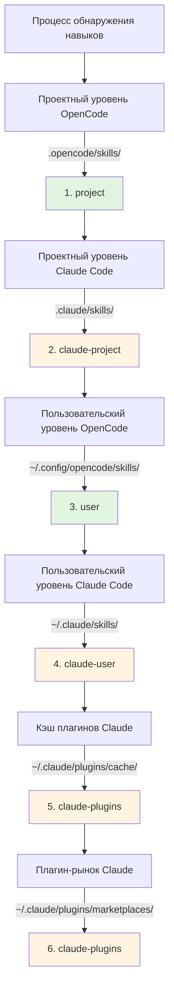

# Совместимость навыков Claude Code

## Что вы сможете делать после изучения

- Понять, как плагины автоматически обеспечивают совместимость с форматом навыков Claude Code
- Освоить механизм отображения инструментов, чтобы навыки Claude работали корректно в OpenCode
- Узнать полные правила приоритетности обнаружения навыков
- Повторно использовать существующие навыки из плагин-рынка Claude без переписывания

## Ваша текущая проблема

У вас уже есть несколько навыков Claude Code, или вы хотите использовать навыки из плагин-рынка Claude, но эти навыки написаны специально для Claude Code. При прямом использовании в OpenCode возникают проблемы:

- Вызовы инструментов в навыках Claude (например, `TodoWrite`, `Task`) не существуют в OpenCode
- Неясно, как заставить OpenCode находить установленные плагины навыков Claude
- Беспокойство о несовместимости форматов навыков, требующее полного переписывания

## Основная концепция

Плагин OpenCode Agent Skills обеспечивает **трёхуровневый механизм совместимости**, позволяющий использовать навыки Claude Code без модификаций:

1. **Автоматическое обнаружение** — сканирование навыков из стандартных директорий Claude Code (`.claude/skills/`, `~/.claude/plugins/`)
2. **Отображение инструментов** — автоматическая инъекция руководства по отображению инструментов при загрузке навыков, преобразующая имена инструментов Claude в имена инструментов OpenCode
3. **Поддержка форматов** — одновременная поддержка v1 и v2 форматов установки плагинов Claude

::: info Ключевая концепция
**Формат навыков Claude Code** — спецификация навыков, определённая Anthropic, использующая файлы `SKILL.md` для описания навыков, содержащие YAML frontmatter (метаданные) и Markdown контент (инструкции).
:::

### Принцип отображения инструментов

Когда плагин обнаруживает, что загружаемый навык написан для Claude Code, он автоматически инъецирует руководство по отображению инструментов:

| Инструмент Claude Code | Инструмент OpenCode | Правило отображения |
| --- | --- | --- |
| `TodoWrite/TodoRead` | `todowrite/todoread` | нижний регистр |
| `Task` (субагент) | `task` (с параметром subagent_type) | изменить на параметр |
| `Skill` | `use_skill` | заменить имя инструмента |
| `Read/Write/Edit/Bash/Glob/Grep/WebFetch` | `read/write/edit/bash/glob/grep/webfetch` | нижний регистр |

**Способ отображения**: Плагин инъецирует руководство по отображению как XML в контекст сессии при загрузке навыков, и AI автоматически вызывает правильные инструменты согласно отображению.

::: tip Зачем нужно отображение?
Claude Code и OpenCode используют разные стили именования инструментов. Claude использует PascalCase (например, `TodoWrite`), OpenCode использует нижний регистр (например, `todowrite`). Отображение инструментов сообщает AI, как выполнять преобразование вызовов.
:::

### Приоритетность обнаружения навыков

Плагин обнаруживает навыки в следующем порядке, **первый найденный навык имеет приоритет** (навыки с одинаковым именем не дублируются):



**Правила приоритетности**:
- Проектные навыки перекрывают пользовательские навыки (удобно для кастомизации проектов)
- Навыки OpenCode имеют приоритет над навыками Claude (избежание путаницы)
- Навыки с одинаковыми именами сохраняют только первую найденную версию

::: details Пример: перекрытие навыков с одинаковыми именами
Предположим, у вас есть навык с именем `git-helper` в двух местах:
- `.claude/skills/git-helper/SKILL.md` (версия Claude)
- `.opencode/skills/git-helper/SKILL.md` (версия OpenCode)

**Результат**: версия OpenCode вступает в силу (более высокий приоритет)
:::

## 🎒 Подготовка к началу

- Установлен и настроен плагин OpenCode Agent Skills
- Понимание базовых концепций навыков (рекомендуется сначала прочитать [Что такое OpenCode Agent Skills?](../../start/what-is-opencode-agent-skills/))
- (Необязательно) Имеются установленные плагины или навыки Claude Code

## Следуйте за мной

### Шаг 1: Проверьте обнаружение навыков Claude

**Зачем**
Убедитесь, что плагин правильно сканирует вашу директорию навыков Claude Code.

Вызовите инструмент в OpenCode:

```
get_available_skills()
```

**Что вы должны увидеть**: возвращаемый список навыков включает навыки из `.claude/skills/`, `~/.claude/skills/`, `~/.claude/plugins/`, где поле `source` каждого навыка показывает источник (например, `claude-project`, `claude-user`, `claude-plugins`).

**Проверочная точка ✅**: Подтвердите, что список содержит ожидаемые навыки Claude.

### Шаг 2: Загрузите навык Claude

**Зачем**
Проверьте, правильно ли работает механизм отображения инструментов.

Вызовите инструмент для загрузки навыка Claude:

```
use_skill(skill="your-skill-name")
```

**Что вы должны увидеть**: возвращаемое сообщение об успехе, например `Skill "xxx" loaded.`.

**Проверочная точка ✅**: AI теперь может использовать инструкции этого навыка.

### Шаг 3: Проверьте, что отображение инструментов работает

**Зачем**
Убедитесь, что AI правильно вызывает инструменты OpenCode, а не инструменты Claude.

Задайте AI задачу, требующую использования инструментов этого навыка, например:

```
Пожалуйста, используйте функцию todo в навыке, чтобы создать список задач для меня.
```

**Что вы должны увидеть**: AI правильно вызывает инструмент `todowrite` OpenCode, а не инструмент `TodoWrite` Claude.

::: tip Как проверить, что отображение работает?
Посмотрите журнал вызовов инструментов AI (если включён режим отладки), вы увидите, что он вызывает `todowrite`, а не `TodoWrite`.
:::

**Проверочная точка ✅**: Вызов инструмента успешен, задача завершена.

## Предупреждения о подводных камнях

### 1. Несоответствие формата плагинов

**Проблема**: Старые плагины Claude используют формат v1, новые — формат v2, что приводит к тому, что некоторые навыки не могут быть обнаружены.

**Причина**: Структуры `installed_plugins.json` v1 и v2 различаются.

**Решение**: Плагин одновременно поддерживает оба формата, ручное преобразование не требуется. Если навыки по-прежнему не обнаруживаются, проверьте, существует ли `~/.claude/plugins/installed_plugins.json` и правильный ли его формат.

### 2. Отображение инструментов не работает

**Проблема**: AI по-прежнему вызывает имена инструментов Claude, вызывая ошибки.

**Причина**: Содержимое навыка может обходить руководство по отображению инструментов, или используются жёстко закодированные вызовы инструментов.

**Решение**:
- Подтвердите, что навык используется после загрузки, а не путём прямого вызова инструментов
- Если в навыке есть примеры кода, вручную измените имена инструментов на формат OpenCode

### 3. Конфликты имён навыков

**Проблема**: Навыки с одинаковыми именами в разных местах, загружается неправильная версия.

**Причина**: Перекрытие, вызванное приоритетностью обнаружения навыков.

**Решение**:
- Проверьте поле `source` навыка, чтобы подтвердить источник
- Используйте формат пространства имён для явного указания источника: `use_skill(skill="user:skill-name")` или `use_skill(skill="claude-plugins:skill-name")`

::: details Синтаксис пространства имён
Плагин поддерживает формат `namespace:skill-name`:
- `project:skill-name` - проектные навыки OpenCode
- `claude-project:skill-name` - проектные навыки Claude
- `user:skill-name` - пользовательские навыки OpenCode
- `claude-user:skill-name` - пользовательские навыки Claude
- `claude-plugins:skill-name` - навыки плагин-рынка Claude
:::

## Резюме урока

Плагин OpenCode Agent Skills обеспечивает трёхуровневый механизм совместимости для бесшовного повторного использования навыков Claude Code:

- **Автоматическое обнаружение** - сканирование навыков из 6 расположений, охватывающих проектный, пользовательский и плагинный уровни
- **Отображение инструментов** - автоматическое преобразование имён инструментов Claude в имена инструментов OpenCode
- **Поддержка форматов** - одновременная поддержка форматов плагинов Claude v1 и v2

Нет необходимости переписывать навыки, устанавливайте и используйте напрямую, плагин автоматически обработает проблемы совместимости.

## Анонс следующего урока

> В следующем уроке мы изучим **[Интеграцию с рабочими процессами Superpowers](../superpowers-integration/)**.
>
> Вы узнаете:
> - Как включить режим Superpowers
> - Автоматическое обнаружение и загрузка навыков Superpowers
> - Как строгие рабочие процессы повышают эффективность разработки

---

## Приложение: Справочник по исходному коду

<details>
<summary><strong>Нажмите, чтобы развернуть и просмотреть расположение исходного кода</strong></summary>

> Обновлено: 2026-01-24

| Функциональность | Путь к файлу | Номера строк |
| --- | --- | --- |
| Определение отображения инструментов | [`src/claude.ts`](https://github.com/joshuadavidthomas/opencode-agent-skills/blob/main/src/claude.ts#L19-L25) | 19-25 |
| Определение типов форматов v1/v2 | [`src/claude.ts`](https://github.com/joshuadavidthomas/opencode-agent-skills/blob/main/src/claude.ts#L35-L61) | 35-61 |
| Извлечение путей установки плагинов | [`src/claude.ts`](https://github.com/joshuadavidthomas/opencode-agent-skills/blob/main/src/claude.ts#L68-L77) | 68-77 |
| Обнаружение навыков плагинов | [`src/claude.ts`](https://github.com/joshuadavidthomas/opencode-agent-skills/blob/main/src/claude.ts#L82-L105) | 82-105 |
| Обнаружение навыков рынка | [`src/claude.ts`](https://github.com/joshuadavidthomas/opencode-agent-skills/blob/main/src/claude.ts#L115-L180) | 115-180 |
| Обнаружение кэшированных навыков | [`src/claude.ts`](https://github.com/joshuadavidthomas/opencode-agent-skills/blob/main/src/claude.ts#L193-L253) | 193-253 |
| Список приоритетов обнаружения навыков | [`src/skills.ts`](https://github.com/joshuadavidthomas/opencode-agent-skills/blob/main/src/skills.ts#L241-L254) | 241-254 |
| Логика дедупликации навыков с одинаковыми именами | [`src/skills.ts`](https://github.com/joshuadavidthomas/opencode-agent-skills/blob/main/src/skills.ts#L256-L260) | 256-260 |
| Импорт toolTranslation | [`src/tools.ts`](https://github.com/joshuadavidthomas/opencode-agent-skills/blob/main/src/tools.ts#L15) | 15 |
| Инъекция отображения инструментов | [`src/tools.ts`](https://github.com/joshuadavidthomas/opencode-agent-skills/blob/main/src/tools.ts#L238-L249) | 238-249 |

**Ключевые константы**:
- `toolTranslation`: XML-строка руководства по отображению инструментов, внедряемая в контекст сессии при загрузке навыков. Определена в `src/claude.ts:19-25`, импортирована в `src/tools.ts:15`

**Ключевые функции**:
- `getPluginInstallPaths()`: Извлекает пути установки плагинов из форматов v1/v2
- `discoverSkillsFromPluginDir()`: Сканирует поддиректорию skills/ директории плагинов
- `discoverMarketplaceSkills()`: Обнаруживает навыки из `~/.claude/plugins/marketplaces/` (приоритет)
- `discoverPluginCacheSkills()`: Обнаруживает навыки из `~/.claude/plugins/cache/` (резервный вариант)
- `findFile()`: Рекурсивно ищет указанное имя файла (вспомогательная функция)

**Важные процессы**:
1. При инициализации плагина вызывается `discoverAllSkills()` → перебирает 6 путей обнаружения
2. При обнаружении навыков плагинов Claude вызывается `discoverMarketplaceSkills()` или `discoverPluginCacheSkills()`
3. При загрузке навыков инструмент `use_skill` вставляет `toolTranslation` в XML-контент (строка 244)

</details>
