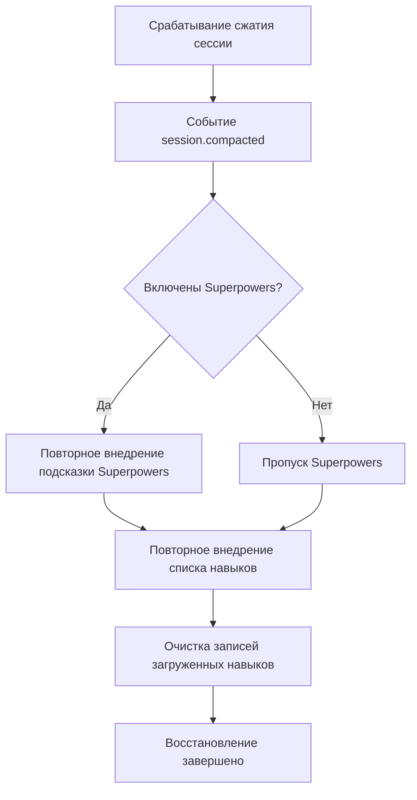

# Механизм восстановления контекста после сжатия

## Что вы сможете после обучения

- Понимать, как плагин сохраняет доступность навыков после сжатия сессии
- Знать условия запуска и процесс выполнения восстановления после сжатия
- Уметь проверять, работает ли механизм восстановления
- Понимать роль синтетических сообщений в механизме восстановления

## Текущая проблема

В длинных сессиях OpenCode выполняет **сжатие контекста** (Context Compaction) для экономии токенов. Сжатая сессия сохраняет только последние сообщения, а ранняя история (включая ранее внедрённое содержимое навыков) удаляется.

Это вызывает проблему: если содержимое навыков было сжато, ИИ больше не знает о доступных навыках и не может использовать загруженные навыки.

## Когда использовать этот метод

Механизм восстановления после сжатия работает **автоматически**, вам не нужно вмешиваться вручную. Но понимание его принципов поможет вам устранять неполадки в следующих сценариях:

- ИИ внезапно "забыл" навыки в длинной сессии
- Нужно отладить доступность навыков после сжатия
- Хотите понять стратегию управления сессиями в плагине

## Основная идея

### Что такое сжатие контекста?

Сессия OpenCode становится длиннее по мере увеличения количества сообщений. Когда потребление токенов приближается к лимиту, система автоматически выполняет **сжатие контекста**:

```
[Начало сессии] → [Сообщение 1] → [Сообщение 2] → ... → [Сообщение 50]
                          ↑ Точка сжатия: сохраняются только последние 10 сообщений
```

После сжатия ранние сообщения (включая содержимое внедрённых навыков) удаляются, ИИ видит только историю последних сообщений.

### Как работает механизм восстановления после сжатия

Плагин прослушивает событие `session.compacted`, и при обнаружении сжатия немедленно выполняет следующие операции восстановления:



**Ключевые моменты**:
- Восстановление происходит **автоматически**, без ручного запуска
- Восстановленный список навыков содержит **все найденные навыки** (не только ранее загруженные)
- Записи загруженных навыков очищаются, позволяя ИИ заново оценить, какие навыки нужны

### Роль синтетических сообщений

Плагин использует механизм **Synthetic Message Injection** (внедрение синтетических сообщений) для внедрения содержимого:

| Свойство | Значение | Значение |
|--- | --- | ---|
| `noReply` | `true` | ИИ не отвечает на внедрённое содержимое |
| `synthetic` | `true` | Помечено как сгенерированное системой содержимое, не учитывается в пользовательском вводе, не отображается в интерфейсе |

Это означает, что содержимое, внедрённое при восстановлении после сжатия:
- Полностью прозрачно для пользователя (не видно)
- Не расходует квоту пользовательских сообщений
- Но читается и понимается ИИ

## 🎒 Подготовка

Для этого учебника требуется:
- Установленный плагин OpenCode Agent Skills
- Понимание основ загрузки навыков
- Длинная сессия для тестирования эффекта сжатия

::: tip
Дополнительная подготовка не требуется, механизм восстановления после сжатия — встроенная функция плагина.
:::

## Следуйте инструкциям: проверка эффекта восстановления после сжатия

### Шаг 1: Запустите новую сессию

**Зачем**
Проверить, нормально ли внедряется список навыков при инициализации сессии

Запустите новую сессию, введите любое сообщение:

```
Привет
```

**Что вы должны увидеть**: ИИ отвечает нормально, и в фоне автоматически внедряется список навыков (невидим для пользователя)

### Шаг 2: Загрузите навык

**Зачем**
Убедиться, что содержимое навыка внедрено в контекст

Вызовите инструмент `use_skill`:

```
Используйте get_available_skills для просмотра доступных навыков, затем используйте use_skill для загрузки одного из навыков
```

**Что вы должны увидеть**: ИИ перечисляет доступные навыки, затем загружает выбранный вами навык

### Шаг 3: Инициируйте сжатие контекста

**Зачем**
Смоделировать сценарий длинной сессии, запустить механизм сжатия OpenCode

Продолжайте отправлять сообщения, имитируя длинный диалог:

```
Сообщение 1: Тестовое содержимое
Сообщение 2: Продолжение теста
...
(Повторите отправку 20-30 сообщений)
```

**Что вы должны увидеть**:
- История сессии удлиняется с увеличением количества сообщений
- При достижении определённой длины OpenCode автоматически выполняет сжатие
- После сжатия ранние сообщения (включая внедрение навыков) удаляются

### Шаг 4: Проверьте эффект восстановления

**Зачем**
Убедиться, что после сжатия список навыков повторно внедряется

После сжатия попросите ИИ использовать навык:

```
Помогите мне использовать навык git-helper для создания новой ветки (предполагается, что у вас установлен навык git-helper)
```

**Что вы должны увидеть**:
- ИИ по-прежнему знает о доступных навыках (доказывает, что список навыков восстановлен)
- ИИ может нормально загружать и использовать навыки (доказывает, что функциональность навыков не пострадала от сжатия)

### Шаг 5: Проверьте внедрение синтетических сообщений

**Зачем**
Подтвердить, что механизм восстановления использует синтетические сообщения и не вмешивается в диалог

Если плагин поддерживает, можно проверить историю сообщений сессии (зависит от функциональности OpenCode):

```
Используйте инструменты отладки для просмотра истории сообщений сессии
```

**Что вы должны увидеть**:
- Сообщение с восстановленным списком навыков помечено как `synthetic: true`
- Эти сообщения не отображаются в обычном интерфейсе диалога

## Контрольная точка ✅

После выполнения указанных шагов вы должны подтвердить:

- [ ] В длинной сессии ИИ по-прежнему имеет доступ к списку навыков
- [ ] Функция загрузки навыков работает нормально после сжатия
- [ ] Процесс восстановления полностью прозрачен для пользователя

## Предостережения

### Проблема 1: После сжатия ИИ говорит "не найден навык"

**Возможные причины**:
- Плагин неправильно слушает событие `session.compacted`
- Путь к каталогу навыков изменился

**Решение**:

1. **Проверьте, запускается ли событие сжатия**
   - Выполните шаги 3 и 4 из раздела "Следуйте инструкциям", подтвердите, что после сжатия ИИ по-прежнему имеет доступ к списку навыков
   - Если ИИ может нормально использовать навыки, механизм восстановления после сжатия работает нормально

2. **Проверьте, правильно ли загружен плагин**
   - Перезапустите OpenCode
   - После запуска новой сессии попросите ИИ перечислить доступные навыки (`get_available_skills`)
   - Если виден список навыков, значит плагин загружен правильно

### Проблема 2: Восстановленный список навыков пуст

**Возможные причины**:
- В пути обнаружения навыков нет навыков
- Ошибка в формате файла навыков

**Решение**:
```bash
# Вручную запросить доступные навыки
Используйте get_available_skills для просмотра списка навыков
```

Если возвращается пустой список, проверьте каталог навыков и формат файлов.

### Проблема 3: После сжатия теряется состояние загруженных навыков

**Это ожидаемое поведение**, не ошибка. Механизм восстановления очищает запись `loadedSkillsPerSession`, позволяя ИИ заново оценить, какие навыки нужны.

**Решение**: ИИ автоматически определит, нужно ли повторно загружать навыки, на основе контекста, без ручного вмешательства.

## Итог урока

Механизм восстановления после сжатия обеспечивает доступность навыков в длинных сессиях следующими способами:

1. **Прослушивание события сжатия**: Автоматическое обнаружение события `session.compacted`
2. **Повторное внедрение списка навыков**: Внедрение всех навыков с использованием тега `<available-skills>`
3. **Опциональное восстановление Superpowers**: При включении одновременно восстанавливается подсказка Superpowers
4. **Использование синтетических сообщений**: Процесс восстановления прозрачен для пользователя, не влияет на диалог
5. **Сброс записей загруженных навыков**: Очистка набора загруженных навыков, позволяющая повторную оценку

Этот механизм обеспечивает:
- Навыки всегда доступны в длинных сессиях
- Процесс восстановления автоматизирован и незаметен
- ИИ может решать, какие навыки использовать, на основе актуального контекста

## Предпросмотр следующего урока

> В следующем уроке мы изучим **[Устранение неполадок](../../faq/troubleshooting/)**.
>
> Вы узнаете:
> - Методы обработки распространённых ошибок и исключений
> - Техники устранения неполадок, связанные с восстановлением после сжатия
> - Решения других проблем использования

---

## Приложение: Ссылка на исходный код

<details>
<summary><strong>Нажмите, чтобы раскрыть расположение исходного кода</strong></summary>

> Время обновления: 2026-01-24

| Функция | Путь к файлу | Номер строки |
|--- | --- | ---|
| Прослушивание события сжатия | [`src/plugin.ts`](https://github.com/joshuadavidthomas/opencode-agent-skills/blob/main/src/plugin.ts#L144-L157) | 144-157 |
| Инициализация при первом сообщении | [`src/plugin.ts`](https://github.com/joshuadavidthomas/opencode-agent-skills/blob/main/src/plugin.ts#L70-L105) | 70-105 |
| Внедрение списка навыков | [`src/skills.ts`](https://github.com/joshuadavidthomas/opencode-agent-skills/blob/main/src/skills.ts#L345-L370) | 345-370 |
| Внедрение синтетических сообщений | [`src/utils.ts`](https://github.com/joshuadavidthomas/opencode-agent-skills/blob/main/src/utils.ts#L147-L162) | 147-162 |
| Управление состоянием сессии | [`src/plugin.ts`](https://github.com/joshuadavidthomas/opencode-agent-skills/blob/main/src/plugin.ts#L25-L35) | 25-35 |

**Ключевые переменные**:
- `setupCompleteSessions: Set<string>` — Записывает идентификаторы сессий, завершивших инициализацию
- `loadedSkillsPerSession: Map<string, Set<string>>` — Записывает имена загруженных навыков для каждой сессии

**Ключевые функции**:
- `injectSkillsList()` — Внедряет список доступных навыков в сессию
- `injectSyntheticContent()` — Использует синтетические сообщения для внедрения содержимого
- `getSessionContext()` — Получает информацию о модели и агенте сессии

</details>
