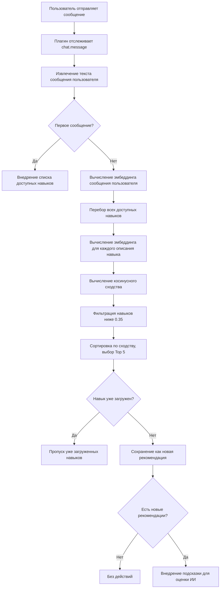

# Автоматические рекомендации навыков: Принципы семантического сопоставления

## Чему вы научитесь

- Понимать, как плагин автоматически определяет навыки, которые могут вам понадобиться
- Освоить основные принципы вычисления семантического сходства
- Узнать, как оптимизировать описания навыков для получения лучших рекомендаций
- Понять, как механизм кэширования эмбеддингов повышает производительность

## Ваша текущая проблема

В OpenCode Agent Skills много навыков, но вы:

- **Не можете запомнить названия навыков** — при большом количестве навыки легко путать
- **Не знаете, какой использовать** — трудно выбрать среди навыков с похожими функциями
- **Боитесь упустить полезный навык** — не уверены, есть ли более подходящий инструмент

Каждый раз приходится сначала вызывать `get_available_skills` для просмотра списка, а затем вручную загружать подходящие навыки — это утомительно и легко нарушает ход мыслей.

## Когда использовать этот подход

Автоматические рекомендации навыков подходят для следующих сценариев:

- **Этап для начинающих** — вы ещё не знакомы с библиотекой навыков, и вам нужна помощь ИИ для идентификации
- **Задачи по функциональной разработке** — такие как «создание REST API», «реализация системы аутентификации» и другие, обычно требуют специализированных навыков
- **Работа в междисциплинарных областях** — когда вы редко сталкиваетесь с незнакомой областью, полагайтесь на рекомендации ИИ
- **При большой библиотеке навыков** — когда количество навыков превышает 10, ручной поиск становится неэффективным

::: tip Полезный совет
Автоматические рекомендации не обязывают вас загружать навыки — они лишь подсказывают ИИ оценить необходимость. Вы можете свободно принимать или игнорировать предложения.
:::

## Ключевая идея

### Что такое семантическое сопоставление

Семантическое сопоставление — это технология **понимания намерения пользователя**, которая не зависит от ключевых слов, а вычисляет **семантическое сходство** текста.

Например:

| Ввод пользователя | Описание навыка | Сопоставление по ключевым словам | Семантическое сопоставление |
| --- | --- | --- | --- |
| "Создать пул подключений к базе данных" | "Инструмент управления и оптимизации подключений к базе данных" | Нет | Да |
| "Помоги написать документацию API" | "Генератор документации API" | Да | Да |
| "Стартовый шаблон проекта" | "Инструмент быстрого создания структуры проекта" | Нет | Да |

Сопоставление по ключевым словам проверяет только буквальное совпадение, тогда как семантическое сопоставление понимает, что «создать», «сгенерировать», «развернуть» — это действия одного типа.

### Embedding: преобразование текста в числа

Чтобы компьютер мог понимать смысл, плагин использует **модель эмбеддинга** для преобразования текста в **векторы** (последовательность чисел).

```
Текст: "Создать пул подключений к базе данных"
    ↓ [Модель Xenova/all-MiniLM-L6-v2]
Вектор: [0.12, -0.34, 0.67, ...] (384 измерения, выходная размерность модели)
```

В этом векторном пространстве:

- **Семантически похожий текст** → векторы расположены ближе друг к другу
- **Семантически разный текст** → векторы расположены дальше друг от друга

::: info Почему выбрана модель all-MiniLM-L6-v2
У этой модели есть три преимущества:
1. **Малый размер** — модель около 23 МБ (уровень квантования q8), быстрая загрузка
2. **Высокая скорость** — поддерживает квантование, низкая задержка при выводе
3. **Высокая точность** — отличные результаты в задачах семантического сходства
:::

### Косинусное сходство: измерение степени сходства векторов

Плагин использует **косинусное сходство** (Cosine Similarity) для вычисления сходства двух векторов.

Формула:
```
similarity = (A · B) / (|A| × |B|)
```

Где:
- `A · B` — скалярное произведение векторов
- `|A|` — длина вектора A
- `|B|` — длина вектора B

**Диапазон результатов**: от -1 до 1

| Диапазон сходства | Значение | Рекомендация |
| --- | --- | --- |
| 0.7-1.0 | Очень похоже, практически одинаковый смысл | Да, настоятельно рекомендуется |
| 0.35-0.7 | Есть связь, стоит рассмотреть | Да, рекомендуется |
| 0.0-0.35 | Низкая связь или отсутствие связи | Нет, не рекомендуется |
| -1.0-0.0 | Противоположный смысл | Нет, не рекомендуется |

::: warning Внимание
Текущий порог составляет 0.35, навыки с более низким баллом не появятся в списке рекомендаций.
:::

## Процесс автоматических рекомендаций

### Полная блок-схема процесса



### Этап 1: Первое сообщение — внедрение списка навыков

При получении первого сообщения сессии плагин:

1. Сканирует все директории навыков
2. Внедряет список навыков в контекст сессии
3. Формат следующий:

```xml
<available-skills>
- git-helper: Инструмент помощи по Git, предоставляет常用ные команды
- test-runner: Интеграция тестового фреймворка, автоматическое обнаружение и запуск тестов
- api-doc: Инструмент генерации документации API
...
</available-skills>
```

**Цель**: позволить ИИ узнать, какие навыки доступны, избежать повторных запросов。

### Этап 2: Последующие сообщения — семантическое сопоставление

Начиная со второго сообщения, каждый ввод пользователя запускает процесс сопоставления:

```typescript
// Исходный код: src/plugin.ts:125-141
const matchedSkills = await matchSkills(userText, skills);
const loadedSkills = getLoadedSkills(sessionID);
const newSkills = matchedSkills.filter(s => !loadedSkills.has(s.name));
```

**Ключевые моменты**:
- Вычисляется сходство только для **незагруженных навыков**
- Загруженные навыки **автоматически фильтруются**
- Избегается повторная рекомендация одного и того же навыка

### Этап 3: Внедрение подсказки для оценки

После нахождения релевантных навыков плагин внедряет **скрытую подсказку** для ИИ:

```xml
<skill-evaluation-required>
SKILL EVALUATION PROCESS

The following skills may be relevant to your request:

- git-helper: Инструмент помощи по Git
- test-runner: Интеграция тестового фреймворка

Step 1 - EVALUATE: Определить, действительно ли эти навыки помогут
Step 2 - DECIDE: Выбрать, какие навыки (если любые) действительно нужны
Step 3 - ACTIVATE: Вызвать use_skill("name") для каждого выбранного навыка

IMPORTANT: Эта оценка невидима пользователям — они не видят эту подсказку. НЕ объявляйте своё решение. Просто активируйте релевантные навыки или напрямую обработайте запрос.
</skill-evaluation-required>
```

**Выбор ИИ**:
- **Принять рекомендацию** — вызвать `use_skill("skill-name")` для загрузки навыка
- **Отклонить рекомендацию** — напрямую обработать запрос пользователя, не загружая навык
- **Частично принять** — загрузить только несколько релевантных навыков

::: tip Скрытая подсказка
Эта подсказка для оценки — это сообщение `synthetic: true`, которое пользователи не видят в интерфейсе; ИИ обрабатывает его внутренне и автоматически принимает решение。
:::

## Следуйте инструкции: оптимизация описания навыка

Если ваш навык не был автоматически рекомендован, попробуйте оптимизировать описание。

### Проверка текущего описания навыка

```bash
# Список всех навыков
get_available_skills()
```

Найдите навык, который хотите оптимизировать, и запишите его текущее описание。

### Просмотр примеров: хорошие и плохие описания

| Плохое описание | Хорошее описание |
| --- | --- |
| "Инструмент" | "Интеграция автоматизированного тестового фреймворка, поддержка Jest и Vitest" |
| "Помощь" | "Git-ассистент, предоставляет常用ные команды и руководство по рабочим процессам" |
| "Документация" | "Генерация API-документации из комментариев кода" |
| "Связано с базой данных" | "Инструмент пула подключений и оптимизации запросов PostgreSQL" |

**Принципы оптимизации**:

1. **Включайте ключевые слова** — технические термины,常用的ные пользователями
2. **Указывайте назначение** — чётко опишите, какую проблему решает
3. **Избегайте общих фраз** — не пишите просто "инструмент", "помощник"
4. **Оптимальная длина** — 10-30 слов является оптимальной

### Обновление описания навыка

Отредактируйте файл `SKILL.md` навыка:

```markdown
---
name: test-runner
description: Интеграция автоматизированного тестового фреймворка, поддержка Jest и Vitest, автоматическое обнаружение и запуск тестов
---

# Test Runner

Этот навык помогает настроить тестовый фреймворк в вашем проекте...
```

**Автоматическое применение**: при следующем сеансе плагин пересчитает эмбеддинг, и новое описание сразу вступит в силу。

## Контрольные точки ✅

### Проверка работы автоматических рекомендаций

1. **Создание тестового навыка**:

```bash
# Создание тестового навыка в директории .opencode/skills/
mkdir -p .opencode/skills/example-skill
cat > .opencode/skills/example-skill/SKILL.md << 'EOF'
---
name: example-skill
description: Помогает пользователям создавать и настраивать TypeScript-проекты
---

# Example Skill

Это тестовый навык...
EOF
```

2. **Отправка релевантного сообщения**:

В OpenCode введите:

```
Я хочу инициализировать TypeScript проект
```

3. **Проверка срабатывания рекомендации**:

Откройте инструменты разработчика или просмотрите журнал вызовов инструментов ИИ:
- **Успех** — ИИ вызвал `use_skill("example-skill")`
- **Неудача** — нет релевантной рекомендации, проверьте, не слишком ли описание общее

### Проверка, что загруженные навыки не рекомендуются повторно

1. **Ручная загрузка навыка**:

```bash
use_skill("example-skill")
```

2. **Повторная отправка релевантного сообщения**:

```
Я хочу инициализировать другой TypeScript проект
```

3. **Подтверждение отсутствия повторной рекомендации**:

Система **не должна** внедрять подсказку для оценки, так как навык уже загружен。

##提醒 о проблемах

### Проблема 1: Рекомендуемые навыки完全不相关

**Симптомы**:
- Пользователь говорит "как развернуть на AWS", но рекомендуется "инструмент для локального тестирования"
- Балл сходства высокий, но семантика完全不对

**Причины**:
- Описание навыка слишком широкое, например "инструмент для облачных сервисов"
- Модель эмбеддинга имеет偏差 в понимании某些技术术语

**Решения**:

1. **Более конкретное описание**:

```markdown
# Плохо
description: Инструмент развертывания облачных сервисов

# Хорошо
description: Инструмент развертывания AWS EC2, автоматическая настройка负载均衡 и авто-масштабирования
```

2. **Включение основных технических ключевых слов**:

```markdown
description: Инструмент загрузки файлов на AWS S3 и CDN-распространение, с поддержкой CloudFront
```

### Проблема 2: Полезный навык не рекомендуется

**Симптомы**:
- Ваш ввод явно соответствует某个 навыку, но система не рекомендует
- Нужно手动 вызывать `get_available_skills()` для поиска

**Причины**:
- Сходство ниже порога 0.35
- Большое различие между描述 навыка и привычными словами пользователя

**Решения**:

1. **Понижение порога** (изменение исходного кода):

```typescript
// src/embeddings.ts:10
const SIMILARITY_THRESHOLD = 0.30; // С 0.35 до 0.30
```

::: warning Осторожно в производственной среде
Понижение порога увеличит количество ложных рекомендаций (нерелевантных навыков), рекомендуется сначала протестировать, затем настроить。
:::

2. **Увеличение Top K**:

```typescript
// src/embeddings.ts:11
const TOP_K = 10; // С 5 до 10
```

3. **Оптимизация описания навыка**,参见上文 "Оптимизация описания навыка"章节。

### Проблема 3: Низкая скорость при первой загрузке

**Симптомы**:
- При первом использовании задержка рекомендации навыка составляет 2-3 секунды
- Последующее использование нормальное

**Причины**:
- Модель эмбеддинга需要从网络下载 (23 МБ)
- Требуется首次计算 всех навыков embeddings

**Решения**:

У плагина есть **механизм кэширования**, после первого раза автоматически оптимизирует:

```
Путь кэша: ~/.cache/opencode-agent-skills/embeddings/
```

**Просмотр файлов кэша**:

```bash
ls -lh ~/.cache/opencode-agent-skills/embeddings/
```

Вы увидите файлы `.bin`, каждый из которых является кэшем эмбеддинга (назван по SHA256 содержимого)。

**Ручной предварительный прогрев кэша**:

```bash
# Перезапуск OpenCode
# При запуске плагин вызовет precomputeSkillEmbeddings()
```

Расположение в исходном коде: `src/embeddings.ts:96-102`

```typescript
export async function precomputeSkillEmbeddings(skills: SkillSummary[]): Promise<void> {
  await Promise.all(
    skills.map(skill =>
      getEmbedding(skill.description).catch(() => { })
    )
  );
}
```

**Не беспокойтесь**:只要不修改技能描述, кэш永久有效。

## Итоги урока

Автоматические рекомендации навыков повышают пользовательский опыт следующим образом:

| Техническое средство | Функция | Улучшение用户体验 |
| --- | --- | --- |
| Модель эмбеддинга | Преобразование текста в векторы | Понимание语义,不仅仅关键词 |
| Косинусное сходство | Вычисление сходства векторов | Точное匹配相关 навыки |
| Механизм кэширования | Дисковый кэш embeddings | Более быстрый响应 после первого раза |
| Интеллектуальная оценка | 让 ИИ решить, нужен ли навык | Не обязательно,避免干扰 |
| Фильтрация已加载 | Пропуск已加载的 навыков | 避免重复推荐 |

**Основные преимущества**:

- **Без запоминания** —不需要记住 названия навыков
- **Интеллектуальное обнаружение** — ИИ автоматически发现需要的工具
- **Нет打扰** —提示 скрыты, пользователи无感知

---

## Анонс следующего урока

> В следующем уроке мы изучим **[Выполнение скриптов навыков](../executing-skill-scripts/)**。
>
> Навыки — это не только документация, но и自动化скрипты. Вы узнаете:
> - Как организовать исполняемые скрипты в директории навыков
> - Использовать инструмент `run_skill_script` для выполнения скриптов
> - Права и ограничения безопасности скриптов
> - Распространённые сценарии использования скриптов (сборка, тестирование, развёртывание и т.д.)

---

## Приложение: Ссылка на исходный код

<details>
<summary><strong>Нажмите, чтобы развернуть расположение исходного кода</strong></summary>

> Время обновления: 2026-01-24

| Функция | Путь к файлу | Номера строк |
| --- | --- | --- |
| Основная функция семантического сопоставления | [`src/embeddings.ts`](https://github.com/joshuadavidthomas/opencode-agent-skills/blob/main/src/embeddings.ts#L108-L135) | 108-135 |
| Генерация текстового эмбеддинга | [`src/embeddings.ts`](https://github.com/joshuadavidthomas/opencode-agent-skills/blob/main/src/embeddings.ts#L38-L66) | 38-66 |
| Вычисление косинусного сходства | [`src/embeddings.ts`](https://github.com/joshuadavidthomas/opencode-agent-skills/blob/main/src/embeddings.ts#L71-L90) | 71-90 |
| Предварительное вычисление embeddings навыков | [`src/embeddings.ts`](https://github.com/joshuadavidthomas/opencode-agent-skills/blob/main/src/embeddings.ts#L96-L102) | 96-102 |
| Форматирование подсказки с результатами сопоставления | [`src/plugin.ts`](https://github.com/joshuadavidthomas/opencode-agent-skills/blob/main/src/plugin.ts#L37-L57) | 37-57 |
| Логика процесса автоматического сопоставления | [`src/plugin.ts`](https://github.com/joshuadavidthomas/opencode-agent-skills/blob/main/src/plugin.ts#L125-L141) | 125-141 |
| Обработка событий отслеживания сообщений | [`src/plugin.ts`](https://github.com/joshuadavidthomas/opencode-agent-skills/blob/main/src/plugin.ts#L66-L142) | 66-142 |

**Ключевые константы**:

| Имя константы | Значение | Описание | Источник |
| --- | --- | --- | --- |
| MODEL_NAME | Xenova/all-MiniLM-L6-v2 | Используемая модель эмбеддинга | `embeddings.ts:8` |
| QUANTIZATION | q8 | Уровень квантования модели | `embeddings.ts:9` |
| SIMILARITY_THRESHOLD | 0.35 | Порог рекомендации по сходству | `embeddings.ts:10` |
| TOP_K | 5 | Количество Top K навыков для возврата | `embeddings.ts:11` |

**Ключевые функции**:

- `matchSkills()`: Вычисляет семантическое сходство между сообщением пользователя и описаниями навыков, возвращает список наиболее релевантных навыков
- `getEmbedding()`: Генерирует вектор эмбеддинга для текста, с поддержкой дискового кэша
- `cosineSimilarity()`: Вычисляет косинусное сходство между двумя векторами
- `precomputeSkillEmbeddings()`: Предварительно вычисляет все embeddings навыков при запуске плагина для ускорения последующего сопоставления
- `formatMatchedSkillsInjection()`: Форматирует результаты сопоставления в подсказку для оценки, внедряемую для ИИ

**Механизм кэширования**:

Путь кэша эмбеддинга:
- Linux/macOS: `~/.cache/opencode-agent-skills/embeddings/`
- Поддержка настройки: через переменную среды `XDG_CACHE_HOME`

Файлы кэша названы по SHA256 содержимого, например `a1b2c3d4.bin`, каждый файл содержит вектор Float32Array.

</details>
