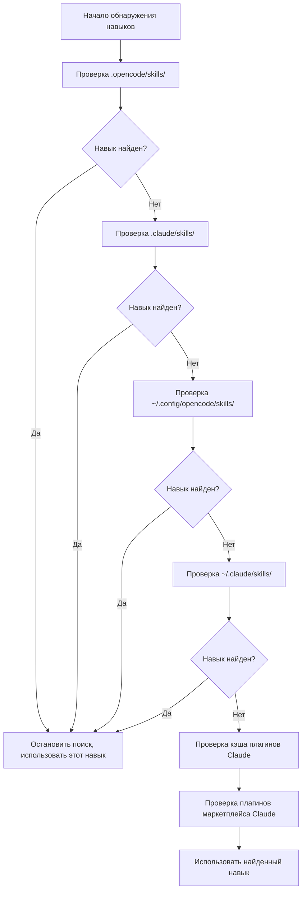

# Подробное руководство по механизму обнаружения навыков

## Что вы сможете после прохождения

- Понимать, из каких мест плагин автоматически обнаруживает навыки
- Освоить правила приоритета обнаружения навыков
- Знать, как заставить навыки уровня проекта перекрывать навыки уровня пользователя
- Понимать механизм совместимости с навыками Claude Code

## Ваша текущая проблема

Вы создали навык, но AI постоянно говорит «не могу найти навык». Вы не знаете, где плагин ищет навыки и что происходит с одноимёнными навыками. В результате навык размещён не там, где нужно, или перезаписан другим навыком из другого места.

## Когда использовать этот подход

- Когда нужно, чтобы навык работал в конкретном проекте
- Когда хотите перекрыть пользовательские или встроенные навыки плагина
- При повторном использовании навыков Claude Code

## 🎒 Подготовка перед началом

::: warning Предварительные знания
Пожалуйста, сначала завершите [установку OpenCode Agent Skills](../../start/installation/).
:::

## Основная концепция

OpenCode Agent Skills автоматически обнаруживает навыки из нескольких мест, выполняя поиск в порядке приоритета. **Срабатывает первый найденный навык, последующие одноимённые игнорируются**. Это позволяет перекрывать пользовательские навыки на уровне проекта, обеспечивая кастомизацию.

### Обзор путей обнаружения



::: info Уникальность имён навыков
Одноимённые навыки сохраняются только первые найденные, последующие игнорируются. Это означает, что `git-helper` уровня проекта перекроет `git-helper` уровня пользователя.
:::

## Следуйте за мной

### Шаг 1: Изучение логики обнаружения навыков

**Почему**
Понимание того, как плагин сканирует директории навыков, поможет вам диагностировать проблемы.

Посмотрите определения путей обнаружения в исходном коде:

```typescript
// src/skills.ts:241-246
const discoveryPaths: DiscoveryPath[] = [
  { path: path.join(directory, '.opencode', 'skills'), label: 'project', maxDepth: 3 },
  { path: path.join(directory, '.claude', 'skills'), label: 'claude-project', maxDepth: 1 },
  { path: path.join(homedir(), '.config', 'opencode', 'skills'), label: 'user', maxDepth: 3 },
  { path: path.join(homedir(), '.claude', 'skills'), label: 'claude-user', maxDepth: 1 }
];
```

**Вы должны увидеть**:
- 4 локальных пути обнаружения, каждый с `label` (идентификатор источника) и `maxDepth` (максимальная глубина рекурсии)
- Ещё 2 пути плагинов Claude (кэш и плагины маркетплейса), обнаруживаемые через `discoverPluginCacheSkills()` и `discoverMarketplaceSkills()`
- `directory` — это корневой каталог проекта, `homedir()` — домашний каталог пользователя

### Шаг 2: Понимание механизма рекурсивного поиска

**Почему**
Понимание ограничений глубины рекурсии поможет избежать ситуаций, когда навык не находится из-за слишком глубокого размещения.

Функция рекурсивного поиска обходит дерево каталогов, ища файлы `SKILL.md`:

```typescript
// src/skills.ts:182-207
async function recurse(dir: string, depth: number, relPath: string) {
  if (depth > maxDepth) return;  // Превышен лимит глубины, остановка поиска

  const entries = await fs.readdir(dir, { withFileTypes: true });
  for (const entry of entries) {
    const fullPath = path.join(dir, entry.name);
    const stats = await fs.stat(fullPath);

    if (!stats.isDirectory()) continue;  // Пропуск файлов

    const newRelPath = relPath ? `${relPath}/${entry.name}` : entry.name;
    const found = await findFile(fullPath, newRelPath, 'SKILL.md');

    if (found) {
      results.push({ ...found, label });  // Навык найден, добавление в результаты
    } else {
      await recurse(fullPath, depth + 1, newRelPath);  // Рекурсивный поиск в подкаталогах
    }
  }
}
```

**Вы должны увидеть**:
- Глубина каждого каталога начинается с 0, остановка при превышении `maxDepth`
- При нахождении `SKILL.md` происходит возврат, иначе продолжается поиск в подкаталогах

**Лимиты глубины рекурсии для разных расположений**:

| Расположение                | Label           | Макс. глубина | Описание                       |
| --- | --- | --- | ---|
| `.opencode/skills/` | project         | 3        | Поддержка вложенных структур каталогов           |
| `.claude/skills/`   | claude-project  | 1        | Сканирование только первого уровня               |
| `~/.config/opencode/skills/` | user   | 3        | Поддержка вложенных структур каталогов           |
| `~/.claude/skills/` | claude-user     | 1        | Сканирование только первого уровня               |

### Шаг 3: Понимание правил дедупликации

**Почему**
Одноимённые навыки сохраняются только один раз, знание этого правила поможет избежать случайной перезаписи навыков.

Логика дедупликации в функции `discoverAllSkills`:

```typescript
// src/skills.ts:255-262
const skillsByName = new Map<string, Skill>();
for (const { filePath, relativePath, label } of allResults) {
  const skill = await parseSkillFile(filePath, relativePath, label);
  if (!skill || skillsByName.has(skill.name)) continue;  // Пропуск одноимённых навыков
  skillsByName.set(skill.name, skill);
}
```

**Вы должны увидеть**:
- Использование `Map` для хранения по `skill.name`, обеспечивающее уникальность
- Проверка `skillsByName.has(skill.name)` на существование одноимённого навыка
- Последующие одноимённые навыки игнорируются (`continue`)

**Пример сценария**:

```
Структура проекта:
.opencode/skills/git-helper/SKILL.md  ← обнаружен первым, активен
~/.config/opencode/skills/git-helper/SKILL.md  ← одноимённый, игнорируется
```

### Шаг 4: Разбор файлов SKILL.md

**Почему**
Понимание правил разбора SKILL.md поможет избежать ошибок форматирования.

Плагин разбирает YAML frontmatter из SKILL.md:

```typescript
// src/skills.ts:132-152
const frontmatterMatch = content.match(/^---\n([\s\S]*?)\n---\n([\s\S]*)$/);
if (!frontmatterMatch?.[1] || !frontmatterMatch?.[2]) {
  return null;  // Ошибка формата, пропуск
}

const frontmatterText = frontmatterMatch[1];
const skillContent = frontmatterMatch[2].trim();

let frontmatterObj: unknown;
try {
  frontmatterObj = parseYamlFrontmatter(frontmatterText);
} catch {
  return null;  // Ошибка разбора YAML, пропуск
}

let frontmatter: SkillFrontmatter;
try {
  frontmatter = SkillFrontmatterSchema.parse(frontmatterObj);
} catch (error) {
  return null;  // Ошибка валидации, пропуск
}
```

**Вы должны увидеть**:
- Frontmatter должен быть окружён `---`
- Содержимое YAML должно соответствовать валидации Zod Schema
- Навыки с ошибками разбора игнорируются (без ошибок, продолжается поиск других навыков)

**Правила валидации Frontmatter**:

```typescript
// src/skills.ts:106-114
const SkillFrontmatterSchema = z.object({
  name: z.string()
    .regex(/^[\p{Ll}\p{N}-]+$/u, { message: "Name must be lowercase alphanumeric with hyphens" })
    .min(1, { message: "Name cannot be empty" }),
  description: z.string()
    .min(1, { message: "Description cannot be empty" }),
  license: z.string().optional(),
  "allowed-tools": z.array(z.string()).optional(),
  metadata: z.record(z.string(), z.string()).optional()
});
```

**Соглашение об именовании**:
- Разрешены только строчные буквы, цифры, дефисы (`-`)
- Пробелы, заглавные буквы, подчёркивания не разрешены

| ❌ Неправильное имя навыка  | ✅ Правильное имя навыка |
| --- | ---|
| `MySkill`        | `my-skill`       |
| `git_helper`     | `git-helper`     |
| `Git Helper`     | `git-helper`     |

### Шаг 5: Обнаружение исполняемых скриптов

**Почему**
Навыки могут содержать автоматизационные скрипты, понимание механизма их обнаружения поможет правильно настроить.

Плагин рекурсивно сканирует директорию навыка, ища исполняемые файлы:

```typescript
// src/skills.ts:61-93
const scripts: Script[] = [];
const skipDirs = new Set(['node_modules', '__pycache__', '.git', '.venv', 'venv', '.tox', '.nox']);

async function recurse(dir: string, depth: number, relPath: string) {
  if (depth > maxDepth) return;

  const entries = await fs.readdir(dir, { withFileTypes: true });
  for (const entry of entries) {
    if (entry.name.startsWith('.')) continue;  // Пропуск скрытых директорий
    if (skipDirs.has(entry.name)) continue;    // Пропуск директорий зависимостей

    const fullPath = path.join(dir, entry.name);
    const stats = await fs.stat(fullPath);

    if (stats.isDirectory()) {
      await recurse(fullPath, depth + 1, newRelPath);
    } else if (stats.isFile()) {
      if (stats.mode & 0o111) {  // Проверка исполняемого бита
        scripts.push({
          relativePath: newRelPath,
          absolutePath: fullPath
        });
      }
    }
  }
}
```

**Вы должны увидеть**:
- Сканируются только файлы с исполняемым битом (`0o111`)
- Автоматически пропускаются скрытые директории и распространённые директории зависимостей
- Максимальная глубина рекурсии — 10 уровней

**Правила обнаружения скриптов**:

| Правило              | Описание                                    |
| --- | ---|
| Проверка исполняемого бита      | Файл должен иметь права на выполнение (`chmod +x`)       |
| Пропуск скрытых директорий      | Не сканируются `.git`, `.venv` и т.д.           |
| Пропуск директорий зависимостей      | Не сканируются `node_modules`, `__pycache__` и т.д. |
| Макс. глубина 10 уровней    | Вложенность более 10 уровней не сканируется              |

### Шаг 6: Совместимость с плагином Claude Code

**Почему**
Понимание механизма совместимости с плагинами Claude Code поможет повторно использовать существующие навыки.

Плагин сканирует каталоги кэша плагинов Claude Code и установленные из маркетплейса:

```typescript
// src/claude.ts:115-145
async function discoverMarketplaceSkills(): Promise<LabeledDiscoveryResult[]> {
  const claudeDir = path.join(homedir(), ".claude", "plugins");
  const installedPath = path.join(claudeDir, "installed_plugins.json");

  let installed: InstalledPlugins;
  try {
    const content = await fs.readFile(installedPath, "utf-8");
    installed = JSON.parse(content);
  } catch {
    return [];
  }

  const isV2 = installed.version === 2;

  for (const pluginKey of Object.keys(installed.plugins || {})) {
    const pluginData = installed.plugins[pluginKey];
    if (!pluginData) continue;

    if (isV2 || Array.isArray(pluginData)) {
      // v2 format: use installPath directly from each installation entry
      const installPaths = getPluginInstallPaths(pluginData);
      for (const installPath of installPaths) {
        const skills = await discoverSkillsFromPluginDir(installPath);
        results.push(...skills);
      }
    } else {
      // v1 format: use marketplace manifest to find skills
      // ...
    }
  }
}
```

**Вы должны увидеть**:
- Чтение файла `installed_plugins.json` Claude Code
- Поддержка форматов плагинов v1 и v2
- Сканирование файлов `SKILL.md` из путей установки плагинов

**Структура плагинов Claude Code**:

Структура каталога Cache (кэш плагинов):

```
~/.claude/plugins/
├── cache/                    # Кэш плагинов
│   ├── plugin-name/         # Структура v1
│   │   └── skills/
│   │       └── skill-name/SKILL.md
│   └── marketplace-name/    # Структура v2
│       └── plugin-name/
│           └── version/
│               └── skills/
│                   └── skill-name/SKILL.md
└── installed_plugins.json   # Список установленных плагинов
```

**Плагины маркетплейса (v2)**:
- Фактический путь плагина читается из поля `installPath` в `installed_plugins.json`
- Путь не фиксирован, может находиться в любой области видимости: `managed`, `user`, `project` или `local`
- В каждом каталоге плагина есть подкаталог `skills/`, содержащий отдельные навыки

## Контрольные точки ✅

Проверьте, что вы освоили механизм обнаружения навыков:

- [ ] Знаете порядок приоритета 6 путей обнаружения навыков
- [ ] Понимаете, что одноимённые навыки сохраняются только первые найденные
- [ ] Знаете ограничения глубины рекурсии для разных расположений
- [ ] Понимаете правила валидации SKILL.md
- [ ] Знаете, как заставить навыки уровня проекта перекрывать пользовательские

## Предупреждения о типичных ошибках

### ❌ Навык размещён не в том месте

**Проблема**: Навык помещён в `~/.config/opencode/skills/`, но в проекте есть одноимённый навык, который его перекрывает.

**Решение**: Размещайте специфичные для проекта навыки в `.opencode/skills/`, чтобы обеспечить наивысший приоритет.

### ❌ Название навыка не соответствует спецификации

**Проблема**: Поле `name` в SKILL.md содержит заглавные буквы или пробелы, что приводит к ошибке разбора.

**Решение**: Убедитесь, что название навыка соответствует спецификации `lowercase-alphanumeric-with-hyphens`, например `git-helper`.

### ❌ Скрипт не имеет прав на выполнение

**Проблема**: Скрипт навыка не может быть выполнен инструментом `run_skill_script`.

**Решение**: Добавьте права на выполнение для скрипта:
```bash
chmod +x tools/build.sh
```

### ❌ Навык размещён слишком глубоко и не находится

**Проблема**: Навык помещён в `~/.config/opencode/skills/category/subcategory/skill/`, превышено ограничение глубины рекурсии.

**Решение**: Убедитесь, что глубина каталога навыка не превышает ограничение `maxDepth` для данного расположения.

## Резюме урока

OpenCode Agent Skills автоматически обнаруживает навыки из нескольких мест, выполняя поиск в порядке приоритета:

1. **Порядок приоритета** (от высокого к низкому): `.opencode/skills/` → `.claude/skills/` → `~/.config/opencode/skills/` → `~/.claude/skills/` → Кэш плагинов Claude (`~/.claude/plugins/cache/`) → Плагины маркетплейса Claude (пути установки читаются из `installed_plugins.json`)

2. **Правила дедупликации**: Одноимённые навыки сохраняются только первые найденные, навыки уровня проекта перекрывают пользовательские.

3. **Глубина рекурсии**: Разные расположения имеют разные ограничения глубины рекурсии, навыки, размещённые слишком глубоко, могут не находиться.

4. **Валидация формата**: Frontmatter SKILL.md должен проходить валидацию Zod Schema, иначе игнорируется.

5. **Обнаружение скриптов**: Скриптами распознаются только файлы с исполняемым битом.

## Предпросмотр следующего урока

> В следующем уроке мы изучим **[запрос и перечисление доступных навыков](../listing-available-skills/)**.
>
> Вы узнаете:
> - Использование инструмента `get_available_skills` для просмотра всех доступных навыков
> - Использование пространств имён навыков
> - Поиск навыков с использованием нечёткого соответствия

---

## Приложение: Справка по исходному коду

<details>
<summary><strong>Нажмите, чтобы развернуть справку по исходному коду</strong></summary>

> Последнее обновление: 2026-01-24

| Функциональность           | Путь к файлу                                                                                      | Номера строк    |
| --- | --- | --- |
| Определение путей обнаружения   | [`src/skills.ts`](https://github.com/joshuadavidthomas/opencode-agent-skills/blob/main/src/skills.ts#L241-L246)     | 241-246 |
| Обнаружение всех навыков   | [`src/skills.ts`](https://github.com/joshuadavidthomas/opencode-agent-skills/blob/main/src/skills.ts#L240-L263)     | 240-263 |
| Рекурсивный поиск навыков   | [`src/skills.ts`](https://github.com/joshuadavidthomas/opencode-agent-skills/blob/main/src/skills.ts#L176-L218)     | 176-218 |
| Перечисление SkillLabel | [`src/skills.ts`](https://github.com/joshuadavidthomas/opencode-agent-skills/blob/main/src/skills.ts#L30)              | 30      |
| Логика дедупликации       | [`src/skills.ts`](https://github.com/joshuadavidthomas/opencode-agent-skills/blob/main/src/skills.ts#L255-L262)     | 255-262 |
| Разбор Frontmatter | [`src/skills.ts`](https://github.com/joshuadavidthomas/opencode-agent-skills/blob/main/src/skills.ts#L122-L167)      | 122-167 |
| Валидация Schema    | [`src/skills.ts`](https://github.com/joshuadavidthomas/opencode-agent-skills/blob/main/src/skills.ts#L105-L114)     | 105-114 |
| Обнаружение скриптов       | [`src/skills.ts`](https://github.com/joshuadavidthomas/opencode-agent-skills/blob/main/src/skills.ts#L59-L99)       | 59-99   |
| Обнаружение плагинов маркетплейса Claude | [`src/claude.ts`](https://github.com/joshuadavidthomas/opencode-agent-skills/blob/main/src/claude.ts#L115-L180)     | 115-180 |
| Обнаружение плагинов кэша Claude | [`src/claude.ts`](https://github.com/joshuadavidthomas/opencode-agent-skills/blob/main/src/claude.ts#L193-L253)     | 193-253 |

**Ключевые константы**:
- `maxDepth` (разное значение для разных расположений): ограничение глубины рекурсии

**Ключевые функции**:
- `discoverAllSkills()`: обнаружение навыков из всех путей
- `findSkillsRecursive()`: рекурсивный поиск в директориях навыков
- `parseSkillFile()`: разбор файлов SKILL.md
- `discoverMarketplaceSkills()`: обнаружение плагинов маркетплейса Claude
- `discoverPluginCacheSkills()`: обнаружение плагинов кэша Claude

</details>
