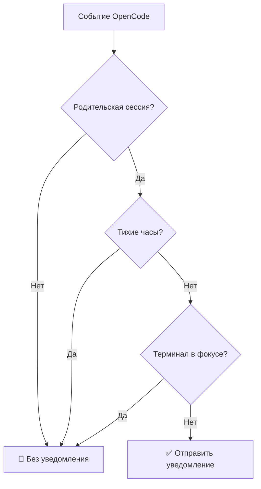

# Тихие часы: защита от уведомлений в определённые периоды

## Что вы сможете сделать после изучения

- Включить тихие часы в файле конфигурации для защиты времени отдыха
- Понять принцип работы тихих часов и логику расчёта времени
- Настроить периоды через полночь (например, 22:00 - 08:00)
- Разобраться в приоритетах тихих часов относительно других механизмов фильтрации

## Ваши текущие затруднения

Возможно, вы сталкивались с такой ситуацией: в 10 вечера вы поручили задачу AI и пошли отдыхать. В 2 часа ночи AI завершил работу, и звук уведомления вас разбудил. Или вы попросили AI обработать файлы во время обеденного перерыва, и в 12:05 уведомление прервало ваш отдых.

::: info Что такое тихие часы
Тихие часы — это настраиваемый временной период, в течение которого opencode-notify прекращает отправку всех уведомлений, защищая вас от нежелательных напоминаний.
:::

## Когда использовать эту функцию

- **Ночной отдых**: установите 22:00 - 08:00, чтобы не просыпаться от уведомлений
- **Обеденный перерыв**: установите 12:00 - 13:00 для спокойного отдыха
- **Время глубокой работы**: установите 09:00 - 12:00, чтобы совещания не прерывались уведомлениями
- **Выходные**: настройте тихие часы на весь уик-энд

Тихие часы идеально подходят для защиты времени отдыха или периодов концентрации, позволяя AI работать в фоновом режиме, пока вы не будете готовы проверить результаты.

## Основная идея

Принцип работы тихих часов прост:

1. **Проверка времени**: перед каждой отправкой уведомления плагин проверяет, попадает ли текущее время в настроенный период тихих часов
2. **Поддержка любых периодов**: поддерживаются любые временные интервалы, включая периоды через полночь (например, 22:00 - 08:00)
3. **Средний приоритет**: проверка тихих часов имеет приоритет ниже проверки родительской сессии, но выше обнаружения фокуса терминала. Если текущая сессия дочерняя и `notifyChildSessions` равно false, проверка тихих часов пропускается.

::: tip Тихие часы vs временное отключение
Тихие часы — это **регулярно повторяющаяся** настройка времени, например, каждый день с 22:00 до 08:00. Если вы хотите **временно отключить** уведомления (например, на ближайший час), установите `"enabled": false` в файле конфигурации или удалите файл для возврата к значениям по умолчанию.
:::

## Следуйте за мной

### Шаг 1: Откройте файл конфигурации

Файл конфигурации находится по пути: `~/.config/opencode/kdco-notify.json`

Если файл не существует, создайте его:

::: code-group

```bash [macOS/Linux]
vim ~/.config/opencode/kdco-notify.json
```

```powershell [Windows]
notepad $env:USERPROFILE\.config\opencode\kdco-notify.json
```

:::

Вы должны увидеть содержимое файла конфигурации (если он существует) или пустой файл.

### Шаг 2: Добавьте настройку тихих часов

Добавьте или измените раздел `quietHours` в файле конфигурации:

```json
{
  "quietHours": {
    "enabled": true,
    "start": "22:00",
    "end": "08:00"
  }
}
```

**Описание параметров**:

| Параметр | Тип | По умолчанию | Описание |
| --- | --- | --- | --- |
| `enabled` | boolean | `false` | Включить тихие часы |
| `start` | string | `"22:00"` | Время начала тихих часов, формат `"HH:MM"` |
| `end` | string | `"08:00"` | Время окончания тихих часов, формат `"HH:MM"` |

### Шаг 3: Сохраните файл конфигурации

Сохраните файл и закройте редактор.

**Контрольная точка ✅**: Выполните следующую команду для проверки корректности формата файла:

```bash
cat ~/.config/opencode/kdco-notify.json | jq .
```

Вы должны увидеть отформатированный JSON без сообщений об ошибках.

::: tip Не установлен jq?
Если в системе нет команды `jq`, пропустите эту проверку или скопируйте JSON в [онлайн-валидатор](https://jsonlint.com/) для проверки.
:::

### Шаг 4: Перезапустите OpenCode

После изменения файла конфигурации необходимо перезапустить OpenCode для применения настроек.

**Контрольная точка ✅**: После перезапуска OpenCode автоматически загрузит новую конфигурацию.

### Шаг 5: Протестируйте тихие часы

Для проверки работы тихих часов:

1. Установите `start` и `end` на значения близкие к текущему времени (например, если сейчас 14:00, установите 13:55 - 14:05)
2. Поручите AI простую задачу
3. Дождитесь завершения задачи

Вы должны увидеть: **в период тихих часов уведомления не приходят**.

**Примечание**: Если текущее время не попадает в тихие часы или `enabled` равно `false`, уведомления будут приходить как обычно.

### Шаг 6: Восстановите обычную конфигурацию

После тестирования верните настройки к обычным значениям (например, 22:00 - 08:00):

```json
{
  "quietHours": {
    "enabled": true,
    "start": "22:00",
    "end": "08:00"
  }
}
```

Сохраните файл конфигурации и перезапустите OpenCode.

## Предостережения

### Частая ошибка 1: Забыли включить тихие часы

**Проблема**: Настроили `start` и `end`, но уведомления продолжают приходить.

**Причина**: Поле `enabled` равно `false` или не установлено.

**Решение**: Убедитесь, что `enabled` установлено в `true`:

```json
{
  "quietHours": {
    "enabled": true,
    "start": "22:00",
    "end": "08:00"
  }
}
```

### Частая ошибка 2: Неверный формат времени

**Проблема**: Настройка не работает или возникает ошибка при запуске.

**Причина**: Формат времени не соответствует `"HH:MM"` или используется 12-часовой формат (AM/PM).

**Неправильные примеры**:
```json
{
  "start": "10 PM",  // ❌ Ошибка: AM/PM не поддерживается
  "end": "8:00"      // ⚠️ Работает, но рекомендуется "08:00" для единообразия
}
```

**Правильные примеры**:
```json
{
  "start": "22:00",  // ✅ Правильно: 24-часовой формат с ведущим нулём
  "end": "08:00"     // ✅ Правильно: 24-часовой формат с ведущим нулём
}
```

### Частая ошибка 3: Неправильное понимание периода через полночь

**Проблема**: Установили 22:00 - 08:00, но обнаружили, что некоторые дневные периоды тоже заглушены.

**Причина**: Ошибочное предположение, что `start` должен быть меньше `end`, что приводит к неправильному расчёту периода.

**Правильное понимание**:
- 22:00 - 08:00 означает: **с 22:00 вечера до 08:00 следующего утра**
- Это период через полночь, плагин автоматически его распознаёт
- Не путайте с 08:00 - 22:00 (такая настро��ка заглушит весь день)

::: tip Проверка периода через полночь
Для проверки правильности настройки периода через полночь установите короткий тестовый период (например, 10 минут) и убедитесь, что уведомления не приходят в ожидаемое время.
:::

### Частая ошибка 4: Не перезапустили OpenCode

**Проблема**: После изменения файла конфигурации тихие часы работают по старым настройкам.

**Причина**: Файл конфигурации загружается один раз при запуске плагина, изменения файла не отслеживаются в реальном времени.

**Решение**: После каждого изменения файла конфигурации необходимо перезапустить OpenCode.

## Взаимодействие тихих часов с другими механизмами фильтрации

Позиция тихих часов в системе интеллектуальной фильтрации:



**Ключевые моменты**:

1. **Средний приоритет тихих часов**: Проверка родительской сессии имеет наивысший приоритет, тихие часы — следующий. Если текущая сессия дочерняя и `notifyChildSessions` равно false, проверка тихих часов пропускается. Но после прохождения проверки родительской сессии, независимо от фокуса терминала, в период тихих часов уведомления не отправляются.
2. **Независимость от фокуса терминала**: Даже если терминал не в фокусе, в период тихих часов уведомления не отправляются
3. **Порядок выполнения**: Проверка родительской сессии выполняется до проверки тихих часов. Если проверка родительской сессии пройдена (текущая сессия родительская или `notifyChildSessions` равно true), выполняется проверка тихих часов.

::: warning Особый случай: запросы разрешений и вопросы
Запросы разрешений (`permission.updated`) и вопросы (`tool.execute.before`) в исходном коде **также подчиняются тихим часам**. Это означает, что в период тихих часов, даже если AI заблокирован в ожидании вашего разрешения или ответа, уведомление не будет отправлено.
:::

## Примеры типичных конфигураций

### Пример 1: Ночной отдых

Настройка тихих часов с 22:00 до 08:00:

```json
{
  "quietHours": {
    "enabled": true,
    "start": "22:00",
    "end": "08:00"
  }
}
```

### Пример 2: Обеденный перерыв

Настройка тихих часов с 12:00 до 13:00:

```json
{
  "quietHours": {
    "enabled": true,
    "start": "12:00",
    "end": "13:00"
  }
}
```

### Пример 3: Время глубокой работы

Настройка тихих часов с 09:00 до 12:00 (например, для защиты от уведомлений во время совещаний):

```json
{
  "quietHours": {
    "enabled": true,
    "start": "09:00",
    "end": "12:00"
  }
}
```

### Пример 4: Полная конфигурация

Использование тихих часов вместе с другими параметрами:

```json
{
  "enabled": true,
  "notifyChildSessions": false,
  "suppressWhenFocused": true,
  "sounds": {
    "idle": "Glass",
    "error": "Basso",
    "permission": "Submarine"
  },
  "quietHours": {
    "enabled": true,
    "start": "22:00",
    "end": "08:00"
  },
  "terminal": "ghostty"
}
```

## Резюме урока

Тихие часы — важная функция opencode-notify для защиты от уведомлений в определённые периоды:

1. **Способ настройки**: Раздел `quietHours` в файле `~/.config/opencode/kdco-notify.json`
2. **Формат времени**: 24-часовой формат `"HH:MM"`, например `"22:00"` и `"08:00"`
3. **Поддержка периодов через полночь**: `"22:00" - "08:00"` означает с 22:00 вечера до 08:00 следующего утра
4. **Порядок выполнения**: Проверка родительской сессии → Тихие часы → Обнаружение фокуса терминала. Тихие часы применяются после прохождения проверки родительской сессии
5. **Требуется перезапуск**: После изменения файла конфигурации необходимо перезапустить OpenCode

Правильная настройка тихих часов позволяет AI работать в фоновом режиме во время вашего отдыха или концентрации, а результаты можно проверить, когда вы будете готовы.

## Анонс следующего урока

> В следующем уроке мы изучим **[Принцип обнаружения терминала](../terminal-detection/)**.
>
> Вы узнаете:
> - Как opencode-notify автоматически определяет ваш терминал
> - Список из 37+ поддерживаемых эмуляторов терминала
> - Способ ручного указания типа терминала
> - Принцип обнаружения фокуса в macOS

---

## Приложение: Справочник по исходному коду

<details>
<summary><strong>Нажмите, чтобы развернуть позиции исходного кода</strong></summary>

> Время обновления: 2026-01-27

| Функция | Путь файла | Номера строк |
| --- | --- | --- |
| Проверка тихих часов | [`src/notify.ts`](https://github.com/kdcokenny/opencode-notify/blob/main/src/notify.ts#L181-L199) | 181-199 |
| Определение интерфейса конфигурации | [`src/notify.ts`](https://github.com/kdcokenny/opencode-notify/blob/main/src/notify.ts#L30-L48) | 30-48 |
| Конфигурация по умолчанию | [`src/notify.ts`](https://github.com/kdcokenny/opencode-notify/blob/main/src/notify.ts#L56-L68) | 56-68 |
| Проверка тихих часов при завершении задачи | [`src/notify.ts`](https://github.com/kdcokenny/opencode-notify/blob/main/src/notify.ts#L262) | 262 |
| Проверка тихих часов при ошибке | [`src/notify.ts`](https://github.com/kdcokenny/opencode-notify/blob/main/src/notify.ts#L300) | 300 |
| Проверка тихих часов при запросе разрешения | [`src/notify.ts`](https://github.com/kdcokenny/opencode-notify/blob/main/src/notify.ts#L323) | 323 |
| Проверка тихих часов при вопросе | [`src/notify.ts`](https://github.com/kdcokenny/opencode-notify/blob/main/src/notify.ts#L341) | 341 |

**Ключевые константы**:

- `DEFAULT_CONFIG.quietHours`: Конфигурация тихих часов по умолчанию (строки 63-67)
  - `enabled: false`: По умолчанию тихие часы отключены
  - `start: "22:00"`: Время начала по умолчанию
  - `end: "08:00"`: Время окончания по умолчанию

**Ключевые функции**:

- `isQuietHours(config: NotifyConfig): boolean`: Проверка, попадает ли текущее время в тихие часы (строки 181-199)
  - Сначала проверяется `config.quietHours.enabled`
  - Текущее время преобразуется в минуты
  - Время начала и окончания преобразуются в минуты
  - Обрабатывается период через полночь (`startMinutes > endMinutes`)
  - Возвращает `true`, если в тихих часах, `false` — если нет

**Бизнес-правила**:

- BR-1-3: В период тихих часов уведомления не отправляются (`notify.ts:262`)
- BR-3-2: Тихие часы поддерживают периоды через полночь (например, 22:00-08:00) (`notify.ts:193-196`)
- BR-4-1: Если текущее время в тихих часах, уведомление не отправляется (`notify.ts:182-198`)
- BR-4-2: Поддержка периодов через полночь (например, 22:00-08:00) (`notify.ts:194-196`)

</details>
