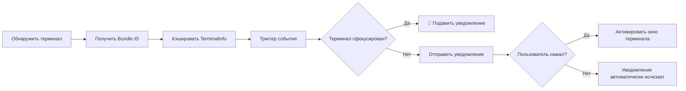
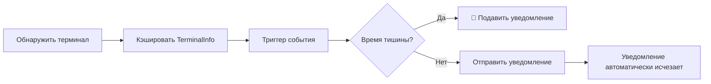

# Принцип обнаружения терминала: механизм автоматического распознавания и обнаружение фокуса macOS

## Что вы сможете сделать после изучения

- Глубоко понять механизм работы и принципы реализации автоматического обнаружения терминала
- Освоить технические детали обнаружения фокуса и динамического получения Bundle ID в macOS
- Научиться вручную переопределять тип терминала для решения проблем сбоев обнаружения
- Понимать различия обнаружения на разных платформах (macOS/Windows/Linux)
- Разбираться в реализации исходного кода, связанного с обнаружением терминала

## Ваши текущие затруднения

Вы уже знаете, что opencode-notify поддерживает 37+ терминалов, и также знаете, что можете вручную указать тип терминала. Но вы хотите глубоко понять:

- Как реализовано обнаружение терминала на низком уровне?
- Через какой механизм реализовано обнаружение фокуса в macOS?
- Почему macOS необходимо получать Bundle ID, а Windows/Linux не нужно?
- Как плагин обрабатывает ситуацию, когда автоматическое обнаружение не удалось?
- Как распознаются мультиплексоры терминалов, такие как tmux?

В этом уроке мы проведем вас через исходный код, чтобы объяснить эти технические детали.

## Основная идея

Реализация обнаружения терминала делится на три уровня:

```
1. Уровень автоматического обнаружения: библиотека detect-terminal распознает тип терминала
    ↓
2. Уровень адаптации платформы: специфическая обработка для macOS/Windows/Linux
    ↓
3. Уровень расширения функциональности: обнаружение фокуса, нажатие для фокусировки, получение Bundle ID
```

**Ключевые принципы проектирования**:

- **Обнаружение один раз при запуске**: плагин обнаруживает терминал при запуске и кэширует результат для последующих уведомлений (оптимизация производительности)
- **Приоритет ручной конфигурации**: ручная настройка `terminal` имеет приоритет над автоматическим обнаружением
- **Понижение функциональности при сбое**: когда обнаружение не удалось, отправка уведомлений не блокируется, просто отключается функция интеллектуальной фильтрации
- **Адаптация к различиям платформ**: macOS поддерживает полную функциональность, Windows/Linux поддерживают базовые уведомления

::: info Почему обнаружение при запуске?
Обнаружение терминала включает сканирование процессов, вызовы osascript и другие операции. Если выполнять обнаружение перед каждым уведомлением, это вызовет значительные накладные расходы. Поэтому плагин обнаруживает один раз при запуске, кэширует объект `TerminalInfo`, и все последующие уведомления повторно используют этот кэш.
:::

## Полный процесс обнаружения терминала

### Анализ исходного кода: detectTerminalInfo()

Давайте проанализируем функцию основного обнаружения построчно:

```typescript
// src/notify.ts:145-164
async function detectTerminalInfo(config: NotifyConfig): Promise<TerminalInfo> {
    // Использовать переопределение конфигурации, если предоставлено
    const terminalName = config.terminal || detectTerminal() || null

    if (!terminalName) {
        return { name: null, bundleId: null, processName: null }
    }

    // Получить имя процесса для обнаружения фокуса
    const processName = TERMINAL_PROCESS_NAMES[terminalName.toLowerCase()] || terminalName

    // Динамически получить Bundle ID из macOS (без хардкода!)
    const bundleId = await getBundleId(processName)

    return {
        name: terminalName,
        bundleId,
        processName,
    }
}
```

**Разбор шагов**:

| Шаг | Код | Описание |
| --- | --- | ---|
| 1 | `config.terminal \|\| detectTerminal()` | Приоритет использования переопределения конфигурации, иначе автоматическое обнаружение |
| 2 | `!terminalName ? return {...}` | Возврат пустого объекта при сбое обнаружения |
| 3 | `TERMINAL_PROCESS_NAMES[...]` | Поиск в таблице соответствия для получения имени процесса macOS |
| 4 | `await getBundleId()` | Динамическое получение Bundle ID в macOS |
| 5 | `return { name, bundleId, processName }` | Возврат полной информации о терминале |

**Структура возвращаемого `TerminalInfo`**:

```typescript
interface TerminalInfo {
    name: string | null       // Название терминала, например "ghostty"
    bundleId: string | null   // Bundle ID macOS, например "com.mitchellh.ghostty"
    processName: string | null // Имя процесса macOS, например "Ghostty"
}
```

::: details Зачем macOS нужны три поля?
- **name**: Общее название терминала (возвращается из detect-terminal)
- **processName**: Имя процесса в диспетчере процессов macOS (используется для обнаружения фокуса)
- **bundleId**: Уникальный идентификатор приложения macOS (используется для нажатия фокусировки)

Например:
- `name = "ghostty"` (возвращает detect-terminal)
- `processName = "Ghostty"` (поиск в таблице соответствия)
- `bundleId = "com.mitchellh.ghostty"` (динамический запрос osascript)
:::

## Принцип работы библиотеки detect-terminal

### Что такое detect-terminal?

`detect-terminal` — это библиотека Node.js, специально предназначенная для идентификации эмуляторов терминала. Она идентифицирует текущий запущенный терминал путем сканирования системных процессов.

**Методы обнаружения**:

1. **Сканирование процессов**: проверка цепочки родительских процессов текущего процесса
2. **Обнаружение переменных окружения**: проверка переменных окружения `TERM`, `TERM_PROGRAM` и др.
3. **Сопоставление с известными именами процессов**: сравнение с именами процессов 37+ известных терминалов

**Поддерживаемые способы обнаружения**:

```typescript
// Внутренняя логика detect-terminal (упрощенная)
function detect() {
    // 1. Проверка переменных окружения
    if (process.env.TERM_PROGRAM) {
        return process.env.TERM_PROGRAM
    }

    // 2. Сканирование цепочки родительских процессов
    const parentProcess = getParentProcess()
    if (isKnownTerminal(parentProcess.name)) {
        return parentProcess.name
    }

    // 3. Проверка специфических переменных окружения
    if (process.env.TMUX) return 'tmux'
    if (process.env.VSCODE_PID) return 'vscode'

    return null
}
```

**Количество поддерживаемых терминалов**: 37+ (см. [полный список](https://github.com/jonschlinkert/detect-terminal#supported-terminals))

## Специальная обработка macOS

### 1. Таблица соответствия имен процессов

В исходном коде определено отображение имен терминалов на имена процессов macOS:

```typescript
// src/notify.ts:71-84
const TERMINAL_PROCESS_NAMES: Record<string, string> = {
    ghostty: "Ghostty",
    kitty: "kitty",
    iterm: "iTerm2",
    iterm2: "iTerm2",
    wezterm: "WezTerm",
    alacritty: "Alacritty",
    terminal: "Terminal",
    apple_terminal: "Terminal",
    hyper: "Hyper",
    warp: "Warp",
    vscode: "Code",
    "vscode-insiders": "Code - Insiders",
}
```

**Зачем нужна таблица соответствия?**

- Имя терминала, возвращаемое detect-terminal, может быть в нижнем регистре или сокращенным (например, `"ghostty"`)
- Имя процесса в диспетчере процессов macOS может отличаться регистром (например, `"Ghostty"`)
- Некоторые терминалы имеют несколько вариантов записи (например, `"iterm"` и `"iterm2"` оба соответствуют `"iTerm2"`)

**Логика отображения**:

```typescript
const processName = TERMINAL_PROCESS_NAMES[terminalName.toLowerCase()] || terminalName
```

- Сначала имя терминала преобразуется в нижний регистр для поиска в таблице
- Если найдено, используется отображенное имя процесса
- Если не найдено, используется исходное имя терминала

### 2. Динамическое получение Bundle ID

**Реализация исходного кода**:

```typescript
// src/notify.ts:135-137
async function getBundleId(appName: string): Promise<string | null> {
    return runOsascript(`id of application "${appName}"`)
}
```

**Команда osascript**:

```applescript
id of application "Ghostty"
-- Возвращает: com.mitchellh.ghostty
```

**Почему не хардкодить Bundle ID?**

Недостатки хардкода:
- ❌ Bundle ID может измениться при обновлении терминала
- ❌ Требуется ручное поддержание списка Bundle ID для 37+ терминалов
- ❌ Код нужно обновлять при выпуске новых терминалов

Преимущества динамического получения:
- ✅ Автоматическая адаптация к изменениям версий терминалов
- ✅ Снижение затрат на поддержку
- ✅ Теоретическая поддержка любого терминала macOS

### 3. Реализация обнаружения фокуса

**Реализация исходного кода**:

```typescript
// src/notify.ts:139-143
async function getFrontmostApp(): Promise<string | null> {
    return runOsascript(
        'tell application "System Events" to get name of first application process whose frontmost is true',
    )
}

// src/notify.ts:166-175
async function isTerminalFocused(terminalInfo: TerminalInfo): Promise<boolean> {
    if (!terminalInfo.processName) return false
    if (process.platform !== "darwin") return false

    const frontmost = await getFrontmostApp()
    if (!frontmost) return false

    // Сравнение без учета регистра
    return frontmost.toLowerCase() === terminalInfo.processName.toLowerCase()
}
```

**Команда osascript**:

```applescript
tell application "System Events" to get name of first application process whose frontmost is true
-- Возвращает: Ghostty
```

**Процесс обнаружения**:

```
1. Проверка платформы: для не-macOS сразу возвращается false
    ↓
2. Проверка processName: без имени процесса сразу возвращается false
    ↓
3. Получение активного приложения: запрос через osascript
    ↓
4. Сравнение имен процессов: без учета регистра
    ↓
5. Возврат результата: совпадает — сфокусирован, не совпадает — не сфокусирован
```

**Использование в процессе отправки уведомлений**:

```typescript
// src/notify.ts:264-265
// Проверить, сфокирован ли терминал (подавить уведомление, если пользователь уже смотрит)
if (await isTerminalFocused(terminalInfo)) return
```

Когда терминал на переднем плане, плагин подавляет отправку уведомления, чтобы избежать повторных напоминаний.

## Механизм переопределения конфигурации

### Когда нужно переопределять вручную?

**Применимые сценарии**:

1. **Сбой автоматического обнаружения**: detect-terminal не может распознать ваш терминал
2. **Сценарии вложенных терминалов**: использование Alacritty в tmux, хотите распознать как tmux
3. **Неточность результатов обнаружения**: ошибочно распознается как другой терминал

### Метод конфигурации

**Файл конфигурации**: `~/.config/opencode/kdco-notify.json`

```json
{
  "terminal": "ghostty"
}
```

**Логика приоритета** (строка 147 исходного кода):

```typescript
const terminalName = config.terminal || detectTerminal() || null
```

**Порядок приоритета**:

1. **Переопределение конфигурации** (`config.terminal`): наивысший приоритет
2. **Автоматическое обнаружение** (`detectTerminal()`): второй приоритет
3. **Обработка понижения** (`null`): используется null при сбое обнаружения

::: tip Сценарии применения переопределения конфигурации
Если ваш терминал может быть правильно распознан, **не рекомендуется переопределять вручную**. Переопределение конфигурации в основном используется для решения проблем со сбоями обнаружения или специальных сценариев.
:::

## Сравнение различий платформ

### macOS

| Функция | Поддержка | Способ реализации |
| --- | --- | ---|
| Системное уведомление | ✅ | node-notifier (NSUserNotificationCenter) |
| Обнаружение терминала | ✅ | библиотека detect-terminal |
| Обнаружение фокуса | ✅ | osascript запрашивает активное приложение |
| Нажатие для фокусировки | ✅ | node-notifier activate параметр |
| Получение Bundle ID | ✅ | osascript динамический запрос |
| Пользовательский звук | ✅ | node-notifier sound параметр |

**Полный процесс поддержки**:



### Windows

| Функция | Поддержка | Способ реализации |
| --- | --- | ---|
| Системное уведомление | ✅ | node-notifier (SnoreToast) |
| Обнаружение терминала | ✅ | библиотека detect-terminal |
| Обнаружение фокуса | ❌ | Ограничения системы |
| Нажатие для фокусировки | ❌ | Ограничения системы |
| Получение Bundle ID | ❌ | В Windows нет такого понятия |
| Пользовательский звук | ❌ | Используется системный звук по умолчанию |

**Упрощенный процесс**:



### Linux

| Функция | Поддержка | Способ реализации |
| --- | --- | ---|
| Системное уведомление | ✅ | node-notifier (notify-send) |
| Обнаружение терминала | ✅ | библиотека detect-terminal |
| Обнаружение фокуса | ❌ | Ограничения системы |
| Нажатие для фокусировки | ❌ | Ограничения системы |
| Получение Bundle ID | ❌ | В Linux нет такого понятия |
| Пользовательский звук | ❌ | Используется звук окружения рабочего стола по умолчанию |

**Процесс аналогичен Windows**, только для уведомлений используется `notify-send`.

## Обработка сбоев обнаружения

### Логика исходного кода

Когда обнаружение не удалось, `detectTerminalInfo()` возвращает пустой объект:

```typescript
if (!terminalName) {
    return { name: null, bundleId: null, processName: null }
}
```

### Влияние на функциональность уведомлений

| Функция | Поведение после сбоя обнаружения |
| --- | ---|
| Системное уведомление | ✅ **Работает нормально** (не зависит от обнаружения терминала) |
| Обнаружение фокуса | ❌ **Недоступно** (`isTerminalFocused()` сразу возвращает false) |
| Нажатие для фокусировки | ❌ **Недоступно** (`bundleId` равен null, параметр activate не устанавливается) |
| Время тишины | ✅ **Работает нормально** (независимо от обнаружения терминала) |
| Проверка родительской сессии | ✅ **Работает нормально** (независимо от обнаружения терминала) |

**Пример кода**:

```typescript
// src/notify.ts:166-175
async function isTerminalFocused(terminalInfo: TerminalInfo): Promise<boolean> {
    if (!terminalInfo.processName) return false  // ← Сразу возвращает false при сбое обнаружения
    if (process.platform !== "darwin") return false
    // ...
}

// src/notify.ts:238-240
if (process.platform === "darwin" && terminalInfo.bundleId) {
    notifyOptions.activate = terminalInfo.bundleId  // ← Не устанавливается, если bundleId null
}
```

### Как проверить статус обнаружения?

**Временный метод отладки** (требуется изменение исходного кода):

```typescript
// Добавить в экспорт плагина notify.ts
export const NotifyPlugin: Plugin = async (ctx) => {
    const { client } = ctx
    const config = await loadConfig()
    const terminalInfo = await detectTerminalInfo(config)

    // 👇 Добавить лог отладки
    console.log("Информация о терминале:", JSON.stringify(terminalInfo, null, 2))

    return {
        // ...
    }
}
```

**Пример нормального вывода**:

```json
{
  "name": "ghostty",
  "bundleId": "com.mitchellh.ghostty",
  "processName": "Ghostty"
}
```

**Пример сбоя обнаружения**:

```json
{
  "name": null,
  "bundleId": null,
  "processName": null
}
```

## Особые сценарии: терминал tmux

### Особенности tmux

tmux — это мультиплексор терминала (terminal multiplexer), который позволяет создавать несколько сессий и окон в одном окне терминала.

**Способ обнаружения**:

```typescript
// Библиотека detect-terminal обнаруживает tmux через переменные окружения
if (process.env.TMUX) return 'tmux'
```

**Влияние рабочего процесса tmux**:

В `terminals/index.md` упоминается, что в рабочем процессе tmux не выполняется обнаружение фокуса. Это потому что:

1. **Сценарии с несколькими окнами**: tmux может работать в нескольких окнах терминала
2. **Неоднозначная семантика фокуса**: невозможно определить, на какую панель tmux смотрит пользователь
3. **Соображения пользовательского опыта**: избежать подавления важных уведомлений

**Доказательство в исходном коде** (функция `handleQuestionAsked`):

```typescript
// src/notify.ts:340-341
// Защита: только время тишины (без проверки фокуса для вопросов — рабочий процесс tmux)
if (isQuietHours(config)) return
```

Обратите внимание: для событий типа `question` в исходном коде явно указано "no focus check for questions - tmux workflow".

## Лучшие практики ручной конфигурации типа терминала

### Выбор подходящего имени терминала

**Принцип**: используйте стандартные имена, распознаваемые библиотекой detect-terminal.

**Справочная таблица частых случаев**:

| Ваш терминал | Значение конфигурации | Результат обнаружения (detect-terminal) |
| --- | --- | ---|
| Ghostty | `"ghostty"` | ✅ |
| iTerm2 | `"iterm2"` или `"iterm"` | ✅ |
| Kitty | `"kitty"` | ✅ |
| WezTerm | `"wezterm"` | ✅ |
| Alacritty | `"alacritty"` | ✅ |
| macOS Terminal.app | `"terminal"` или `"apple_terminal"` | ✅ |
| Hyper | `"hyper"` | ✅ |
| Warp | `"warp"` | ✅ |
| VS Code Stable | `"vscode"` | ✅ |
| VS Code Insiders | `"vscode-insiders"` | ✅ |
| Windows Terminal | `"windows-terminal"` или `"Windows Terminal"` | ⚠️ Может потребоваться попробовать оба |

### Проверка, что конфигурация работает

**Метод 1: Проверка журналов**

Если включено ведение журнала отладки (см. выше), вы должны увидеть:

```json
{
  "name": "ghostty",  // ← Должно быть имя терминала, которое вы настроили
  "bundleId": "com.mitchellh.ghostty",
  "processName": "Ghostty"
}
```

**Метод 2: Функциональное тестирование**

1. После настройки типа терминала перезапустите OpenCode
2. Запустите задачу AI
3. Переключитесь на другое окно (чтобы терминал потерял фокус)
4. Дождитесь завершения задачи

Вы должны увидеть: получено уведомление, и нажатие на уведомление (macOS) может фокусировать окно терминала.

## Предостережения

### Частая проблема 1: После настройки обнаружение по-прежнему не работает

**Проявление**: Установлено `"terminal": "ghostty"`, но функция уведомлений работает некорректно.

**Шаги по диагностике**:

1. **Проверка формата JSON**:

```bash
cat ~/.config/opencode/kdco-notify.json | jq .
```

2. **Проверка написания имени терминала**:

- Убедитесь, что используется нижний регистр (например, `"ghostty"`, а не `"Ghostty"`)
- Убедитесь, что это имя поддерживается detect-terminal

3. **Проверка, перезапущен ли OpenCode**:

Изменения в файле конфигурации вступают в силу только после перезапуска OpenCode.

### Частая проблема 2: Обнаружение фокуса macOS неточное

**Проявление**: Терминал на переднем плане, но всплывает уведомление, или терминал в фоне, но уведомление не всплывает.

**Возможные причины**:

1. **Имя процесса не совпадает**:

Проверьте, есть ли имя процесса вашего терминала в таблице соответствия:

```typescript
const TERMINAL_PROCESS_NAMES: Record<string, string> = {
    // ... проверьте, есть ли ваш терминал в списке
}
```

2. **Сбой выполнения osascript**:

Протестируйте вручную в терминале:

```bash
osascript -e 'tell application "System Events" to get name of first application process whose frontmost is true'
```

Должно вернуть имя текущего активного приложения (например, `Ghostty`).

3. **Чувствительность к регистру**:

В исходном коде используется сравнение без учета регистра:

```typescript
return frontmost.toLowerCase() === terminalInfo.processName.toLowerCase()
```

Убедитесь, что имя процесса в таблице соответствия соответствует фактическому имени процесса с точки зрения регистра.

### Частая проблема 3: Ручная конфигурация в Windows/Linux не работает

**Проявление**: Конфигурация `"terminal": "xxx"` в Windows/Linux, но обнаружение по-прежнему не работает.

**Пояснение**:

Обнаружение терминала в Windows/Linux зависит от библиотеки detect-terminal, функция переопределения конфигурации в исходном коде реализована кросс-платформенно. Если конфигурация не работает, возможные причины:

1. **Неправильное имя терминала**: убедитесь, что используется имя, поддерживаемое detect-terminal
2. **Терминал не в списке поддержки**: см. [полный список detect-terminal](https://github.com/jonschlinkert/detect-terminal#supported-terminals)

**Примечание**: Windows/Linux не поддерживает обнаружение фокуса и нажатие для фокусировки, даже если конфигурация правильная, эти функции не будут включены.

### Частая проблема 4: Ошибка обнаружения во вложенных сценариях терминала

**Сценарий**: Использование Alacritty в tmux, хочется распознать как tmux.

**Проявление**: Автоматическое обнаружение распознает как `"alacritty"`, но вы хотите `"tmux"`.

**Решение**:

Вручную настройте `"terminal": "tmux"`:

```json
{
  "terminal": "tmux"
}
```

**Примечание**: После такой конфигурации плагин будет считать, что вы используете tmux, и не будет выполнять обнаружение фокуса (в соответствии с рабочим процессом tmux).

## Резюме урока

Обнаружение терминала — это основа функции интеллектуальной фильтрации opencode-notify:

1. **Процесс обнаружения**: автоматическое распознавание терминала при запуске через библиотеку detect-terminal, кэширование результата
2. **Специальная обработка macOS**:
   - Таблица соответствия имен процессов (`TERMINAL_PROCESS_NAMES`)
   - Динамическое получение Bundle ID (через osascript)
   - Обнаружение фокуса (запрос активного процесса приложения)
3. **Переопределение конфигурации**: ручное указание типа терминала имеет приоритет над автоматическим обнаружением
4. **Различия платформ**:
   - macOS: полная функциональность (уведомления + обнаружение фокуса + нажатие для фокусировки)
   - Windows/Linux: базовая функция уведомлений
5. **Обработка сбоев**: при сбое обнаружения отправка уведомлений не блокируется, просто отключается интеллектуальная фильтрация
6. **Особые сценарии**: рабочий процесс tmux не поддерживает обнаружение фокуса, чтобы избежать подавления важных уведомлений

**Ключевые позиции исходного кода**:

- `detectTerminalInfo()`: основная функция обнаружения терминала (строки 145-164)
- `TERMINAL_PROCESS_NAMES`: таблица соответствия имен процессов macOS (строки 71-84)
- `getBundleId()`: динамическое получение Bundle ID (строки 135-137)
- `isTerminalFocused()`: реализация обнаружения фокуса (строки 166-175)

## Анонс следующего урока

> В следующем уроке мы изучим **[Расширенное использование](../advanced-usage/)**.
>
> Вы узнаете:
> - Навыки и лучшие практики конфигурации
> - Настройка множественных терминалов
> - Рекомендации по оптимизации производительности
> - Совместное использование с другими плагинами OpenCode

---

## Приложение: Справочник по исходному коду

<details>
<summary><strong>Нажмите, чтобы развернуть позиции исходного кода</strong></summary>

> Время обновления: 2026-01-27

| Функция | Путь файла | Номера строк |
| --- | --- | ---|
| Основная функция обнаружения терминала | [`src/notify.ts`](https://github.com/kdcokenny/opencode-notify/blob/main/src/notify.ts#L145-L164) | 145-164 |
| Таблица соответствия имен процессов macOS | [`src/notify.ts`](https://github.com/kdcokenny/opencode-notify/blob/main/src/notify.ts#L71-L84) | 71-84 |
| Получение Bundle ID macOS | [`src/notify.ts`](https://github.com/kdcokenny/opencode-notify/blob/main/src/notify.ts#L135-L137) | 135-137 |
| Обнаружение активного приложения macOS | [`src/notify.ts`](https://github.com/kdcokenny/opencode-notify/blob/main/src/notify.ts#L139-L143) | 139-143 |
| Обнаружение фокуса macOS | [`src/notify.ts`](https://github.com/kdcokenny/opencode-notify/blob/main/src/notify.ts#L166-L175) | 166-175 |
| Инкапсуляция выполнения osascript | [`src/notify.ts`](https://github.com/kdcokenny/opencode-notify/blob/main/src/notify.ts#L120-L133) | 120-133 |
| Определение интерфейса конфигурации | [`src/notify.ts`](https://github.com/kdcokenny/opencode-notify/blob/main/src/notify.ts#L30-L54) | 30-54 |
| Обнаружение фокуса в обработке завершения задачи | [`src/notify.ts`](https://github.com/kdcokenny/opencode-notify/blob/main/src/notify.ts#L265) | 265 |
| Обнаружение фокуса в обработке уведомления об ошибке | [`src/notify.ts`](https://github.com/kdcokenny/opencode-notify/blob/main/src/notify.ts#L303) | 303 |
| Обнаружение фокуса в обработке запроса разрешения | [`src/notify.ts`](https://github.com/kdcokenny/opencode-notify/blob/main/src/notify.ts#L326) | 326 |
| Настройка нажатия для фокусировки macOS | [`src/notify.ts`](https://github.com/kdcokenny/opencode-notify/blob/main/src/notify.ts#L238-L240) | 238-240 |
| Обнаружение терминала при запуске плагина | [`src/notify.ts`](https://github.com/kdcokenny/opencode-notify/blob/main/src/notify.ts#L364) | 364 |

**Ключевые константы**:

- `TERMINAL_PROCESS_NAMES`: Таблица соответствия имен терминалов именам процессов macOS (строки 71-84)
  - `ghostty: "Ghostty"`
  - `kitty: "kitty"`
  - `iterm: "iTerm2"` / `iterm2: "iTerm2"`
  - `wezterm: "WezTerm"`
  - `alacritty: "Alacritty"`
  - `terminal: "Terminal"` / `apple_terminal: "Terminal"`
  - `hyper: "Hyper"`
  - `warp: "Warp"`
  - `vscode: "Code"` / `"vscode-insiders": "Code - Insiders"`

**Ключевые функции**:

- `detectTerminalInfo(config: NotifyConfig): Promise<TerminalInfo>`: Основная функция обнаружения терминала (строки 145-164)
  - Приоритет использования переопределения конфигурации (`config.terminal`)
  - Вызов библиотеки detect-terminal для автоматического обнаружения
  - Поиск в таблице соответствия имен процессов
  - Динамическое получение Bundle ID (macOS)
  - Возврат полного объекта информации о терминале

- `isTerminalFocused(terminalInfo: TerminalInfo): Promise<boolean>`: Обнаружение, сфокусирован ли терминал (строки 166-175)
  - Проверка платформы (только macOS)
  - Проверка существования processName
  - Получение текущего активного приложения (osascript)
  - Сравнение имен процессов без учета регистра
  - Возврат true, если терминал на переднем плане

- `getBundleId(appName: string): Promise<string | null>`: Динамическое получение Bundle ID приложения macOS (строки 135-137)
  - Использование osascript для запроса идентификатора приложения
  - Возврат в формате `"com.mitchellh.ghostty"`

- `getFrontmostApp(): Promise<string | null>`: Получение имени активного приложения macOS (строки 139-143)
  - Использование osascript для запроса System Events
  - Возврат имени процесса активного приложения

- `runOsascript(script: string): Promise<string | null>`: Выполнение команд AppleScript (строки 120-133)
  - Проверка платформы (только macOS)
  - Использование Bun.spawn для выполнения osascript
  - Захват и возврат вывода
  - Обработка исключений, возврат null

**Бизнес-правила**:

- BR-2-1: Использование библиотеки detect-terminal для распознавания 37+ терминалов (`notify.ts:147`)
- BR-2-2: Таблица соответствия имен терминалов именам процессов macOS (`notify.ts:71-84`)
- BR-2-3: Динамическое получение Bundle ID, без хардкода (`notify.ts:135-137`)
- BR-2-4: Обнаружение сессии tmux через переменную окружения TMUX (реализация в библиотеке)
- BR-1-2: Подавление уведомления, когда терминал сфокусирован (`notify.ts:265`)
- BR-1-6: macOS поддерживает нажатие на уведомление для фокусировки терминала (`notify.ts:238-240`)

**Внешние зависимости**:

- [detect-terminal](https://github.com/jonschlinkert/detect-terminal): Библиотека обнаружения терминала, поддерживает 37+ эмуляторов терминала
- [node-notifier](https://github.com/mikaelbr/node-notifier): Кроссплатформенная библиотека системных уведомлений
- macOS osascript: Системный инструмент командной строки для выполнения AppleScript

</details>
