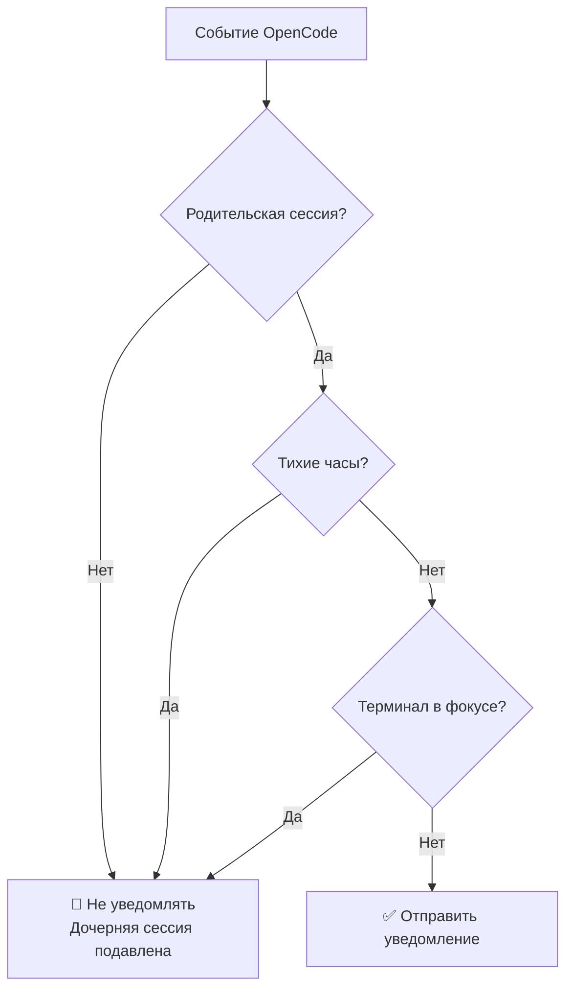
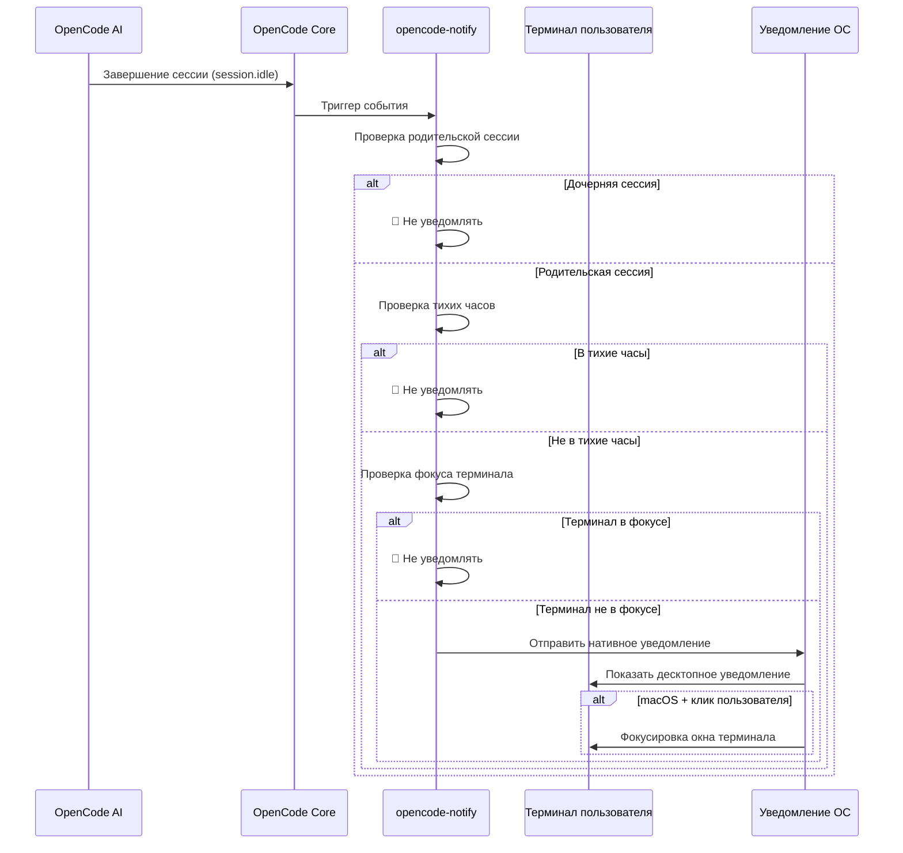

# Принцип работы: уведомления, фильтрация и механизм срабатывания

## Чему вы научитесь

- Поймёте четыре типа уведомлений opencode-notify и моменты их срабатывания
- Освоите принцип работы интеллектуальной фильтрации (почему вы не получите слишком много уведомлений)
- Узнаете полный процесс от срабатывания до отображения уведомления
- Научитесь настраивать поведение уведомлений через конфигурацию

## Основная идея

::: tip Философия дизайна
Opencode-notify следует одному ключевому принципу: **"Уведомляй пользователя, когда это действительно нужно, а не для каждого незначительного события"**.
:::

Работа плагина можно разбить на три ключевых этапа:

1. **Прослушивание** — ожидание важных событий OpenCode
2. **Фильтрация** — определение, требует ли событие уведомления
3. **Отправка** — уведомление через нативную систему операционной системы

Понимая этот процесс, вы поймёте, почему плагин может своевременно напоминать, но при этом не беспокоит вас как спам.

## Четыре типа уведомлений

Opencode-notify отслеживает четыре типа событий OpenCode, каждое с чётко определённым сценарием срабатывания:

### 1. Уведомление о завершении задачи (session.idle)

**Момент срабатывания**: когда AI-сессия переходит в режим ожидания (задача завершена)

| Параметр | Описание |
| --- | ---|
| Заголовок уведомления | Ready for review |
| Содержимое уведомления | Заголовок сессии (макс. 50 символов) |
| Звук по умолчанию | Glass (macOS) |

**Почему это важно**: это наиболее часто используемое уведомление, сообщающее вам, что AI завершил задачу и вы можете приступить к проверке результатов.

### 2. Уведомление об ошибке (session.error)

**Момент срабатывания**: когда выполнение AI-сессии завершается с ошибкой

| Параметр | Описание |
| --- | ---|
| Заголовок уведомления | Something went wrong |
| Содержимое уведомления | Краткое описание ошибки (макс. 100 символов) |
| Звук по умолчанию | Basso (macOS) |

**Почему это важно**: ошибки требуют немедленного устранения, иначе последующие операции могут выполняться некорректно.

### 3. Уведомление о запросе разрешения (permission.updated)

**Момент срабатывания**: когда AI требует авторизации для выполнения действия (например, чтение файла, доступ к сети)

| Параметр | Описание |
| --- | ---|
| Заголовок уведомления | Waiting for you |
| Содержимое уведомления | OpenCode needs your input |
| Звук по умолчанию | Submarine (macOS) |

**Почему это важно**: AI заблокирован и требует вашей ручной авторизации для продолжения работы. Без обработки этого запроса задача будет остановлена.

### 4. Уведомление о задавании вопроса (tool.execute.before)

**Момент срабатывания**: когда AI использует инструмент `question` для задания вам вопроса

| Параметр | Описание |
| --- | ---|
| Заголовок уведомления | Question for you |
| Содержимое уведомления | OpenCode needs your input |
| Звук по умолчанию | Submarine (macOS) |

**Почему это важно**: AI требует дополнительной информации для продолжения работы, например, подтверждения решения или уточнения требований.

::: info Приоритеты четырёх типов уведомлений
Запросы разрешения и задавания вопросов имеют наивысший приоритет, поскольку AI полностью заблокирован в этих ситуациях; уведомления об ошибках занимают второе место, так как задача уже завершилась неудачей; уведомления о завершении задачи имеют относительно низкий приоритет, поскольку вы можете проверить результаты в удобное для вас время.
:::

## Механизм интеллектуальной фильтрации

Это ключевая особенность opencode-notify — благодаря многоуровневой фильтрации вы получаете только действительно важные уведомления.

### Обзор уровней фильтрации



### Уровень 1: Проверка родительской сессии

**Правило**: по умолчанию уведомления отправляются только для родительских (корневых) сессий, но не для дочерних.

**Принцип**: задачи OpenCode могут быть вложенными. Например, когда вы просите AI "оптимизировать кодовую базу", он может разбить задачу на несколько подзадач:
- Родительская сессия: "Оптимизировать всю кодовую базу"
- Дочерняя сессия 1: "Оптимизировать директорию src/components"
- Дочерняя сессия 2: "Оптимизировать директорию src/utils"

Если уведомлять о каждой дочерней сессии, вы получите множество уведомлений. Opencode-notify отправляет уведомление только один раз — когда завершается родительская сессия.

::: tip Когда нужны уведомления о дочерних сессиях?
Если вы отслеживаете несколько параллельных задач одного AI, вы можете включить уведомления о дочерних сессиях, установив `notifyChildSessions: true` в конфигурации.
:::

**Особые исключения**:
- **Уведомления о запросе разрешения**: всегда отправляются, без проверки родительской сессии (поскольку проблемы с разрешениями должны быть устранены)
- **Уведомления о задавании вопроса**: всегда отправляются, без проверки родительской сессии

### Уровень 2: Проверка тихих часов

**Правило**: в настроенный период тихих часов уведомления не отправляются.

**Принцип**: избежать отвлечения ночью или в отведённое время отдыха. Пример конфигурации:

```json
{
  "quietHours": {
    "enabled": true,
    "start": "22:00",
    "end": "08:00"
  }
}
```

**Поддержка перехода через полночь**: период тихих часов может переходить через полночь, например, `22:00 - 08:00` будет корректно интерпретировано как с 22:00 до 8:00 следующего дня.

::: info Приоритет проверки тихих часов
Проверка тихих часов имеет приоритет над всеми остальными проверками. Даже если терминал не в фокусе или это родительская сессия, в тихие часы уведомления не будут отправлены.
:::

### Уровень 3: Определение фокуса терминала

**Правило**: когда окно терминала является активным окном, уведомления не отправляются.

**Принцип**: когда вы смотрите на терминал, AI, завершив задачу, отобразит результат прямо на экране, и дополнительное уведомление не требуется.

**Поддержка платформ**:
- ✅ **macOS**: полная поддержка, определение активного приложения через `osascript`
- ❌ **Windows**: не поддерживается
- ❌ **Linux**: не поддерживается

**Механизм определения (macOS)**:
1. Использование библиотеки `detect-terminal` для определения вашего терминала (поддержка 37+ эмуляторов терминала)
2. Запрос к macOS для получения текущего активного приложения
3. Сравнение с именем процесса вашего терминала
4. Если совпадает — уведомление подавляется

**Особые исключения**:
- **Уведомления о задавании вопроса**: не проверяется фокус (поддержка рабочего процесса с tmux)

::: tip Поддержка рабочего процесса с tmux
Если вы используете несколько панелей tmux, уведомления о задавании вопроса не будут подавлены из-за проверки фокуса, обеспечивая получение напоминаний при работе в других панелях.
:::

### Особая функция macOS: фокусировка терминала по клику на уведомление

В macOS уведомления имеют дополнительную функцию: **после клика на уведомление окно терминала автоматически выходит на передний план**.

**Принцип**:
1. Плагин получает Bundle ID вашего терминала через `osascript` (например, `com.ghostty.Ghostty`)
2. При отправке уведомления устанавливается опция `activate` с этим Bundle ID
3. При клике на уведомление система автоматически фокусируется на соответствующем приложении

**Поддерживаемые терминалы**: Ghostty, Kitty, iTerm2, WezTerm, Alacritty, macOS Terminal, Hyper, Warp, интегрированный терминал VS Code и другие.

::: info Автоматическое определение терминала
Плагин автоматически определяет используемый вами терминал, ручная настройка не требуется. Если автоматическое определение не сработает, вы можете вручную указать поле `terminal` в файле конфигурации.
:::

## Процесс срабатывания уведомлений

### Полная блок-схема



### Приоритет обработки событий

При одновременном срабатывании нескольких событий плагин обрабатывает их в следующем порядке приоритетов:

1. **Высший приоритет**: запрос разрешения (`permission.updated`) — AI заблокирован, требуется обработка
2. **Высокий приоритет**: уведомление об ошибке (`session.error`) — задача завершилась неудачей, требует внимания
3. **Низкий приоритет**: завершение задачи (`session.idle`) — можно проверить позже
4. **Особый**: задавание вопроса (`tool.execute.before`) — приоритет определяется по фактической потребности

::: tip Пакетная обработка уведомлений
Если несколько задач завершаются одновременно, плагин не будет отправлять отдельные уведомления для каждой, а отправит только одно (на основе проверки родительской сессии). Это предотвращает лавину уведомлений.
:::

## Влияние конфигурации

Через файл конфигурации вы можете настраивать различные уровни фильтрации:

| Параметр конфигурации | Уровень влияния | Значение по умолчанию | Описание |
| --- | --- | --- | ---|
| `notifyChildSessions` | Проверка родительской сессии | `false` | Установите `true` для включения уведомлений о дочерних сессиях |
| `quietHours.enabled` | Проверка тихих часов | `false` | Установите `true` для включения тихих часов |
| `quietHours.start` | Проверка тихих часов | `"22:00"` | Время начала тихих часов |
| `quietHours.end` | Проверка тихих часов | `"08:00"` | Время окончания тихих часов |
| `terminal` | Определение терминала | Не задано | Ручное указание типа терминала (переопределяет автоматическое определение) |

::: details Пример конфигурации

```json
{
  "enabled": true,
  "notifyChildSessions": false,
  "sounds": {
    "idle": "Glass",
    "error": "Basso",
    "permission": "Submarine"
  },
  "quietHours": {
    "enabled": true,
    "start": "22:00",
    "end": "08:00"
  },
  "terminal": "ghostty"
}
```

:::

## Резюме урока

Принцип работы opencode-notify можно суммировать следующим образом:

1. **Четыре типа уведомлений**: завершение задачи, ошибка, запрос разрешения, задавание вопроса
2. **Трёхуровневая интеллектуальная фильтрация**: проверка родительской сессии → проверка тихих часов → проверка фокуса терминала
3. **Различия платформ**: macOS поддерживает определение фокуса и фокусировку по клику, Windows/Linux поддерживают только базовые уведомления
4. **Гибкая конфигурация**: настройка уровней фильтрации и поведения через JSON-конфигурацию

Такой дизайн обеспечивает своевременность уведомлений и низкий уровень отвлекающих факторов — уведомляя только тогда, когда это действительно необходимо, вместо того чтобы стать ещё одним центром уведомлений, который нужно постоянно проверять.

## Анонс следующего урока

> В следующем уроке мы изучим **[Особенности платформы macOS](../../platforms/macos/)**.
>
> Вы узнаете:
> - Уникальный для macOS механизм определения фокуса
> - Как настроить функцию фокусировки по клику на уведомление
> - Полный список пользовательских звуковых эффектов
> - Детали интеграции с нативной системой macOS

---

## Приложение: справочник по исходному коду

<details>
<summary><strong>Нажмите, чтобы развернуть расположение исходного кода</strong></summary>

> Обновлено: 2026-01-27

| Функция | Путь к файлу | Номера строк |
| --- | --- | ---|
| Главный вход плагина | [`src/notify.ts`](https://github.com/kdcokenny/opencode-notify/blob/main/src/notify.ts#L357-L406) | 357-406 |
| Загрузка конфигурации | [`src/notify.ts`](https://github.com/kdcokenny/opencode-notify/blob/main/src/notify.ts#L90-L114) | 90-114 |
| Конфигурация по умолчанию | [`src/notify.ts`](https://github.com/kdcokenny/opencode-notify/blob/main/src/notify.ts#L56-L68) | 56-68 |
| Определение терминала | [`src/notify.ts`](https://github.com/kdcokenny/opencode-notify/blob/main/src/notify.ts#L145-L164) | 145-164 |
| Определение фокуса терминала | [`src/notify.ts`](https://github.com/kdcokenny/opencode-notify/blob/main/src/notify.ts#L166-L175) | 166-175 |
| Проверка тихих часов | [`src/notify.ts`](https://github.com/kdcokenny/opencode-notify/blob/main/src/notify.ts#L181-L199) | 181-199 |
| Определение родительской сессии | [`src/notify.ts`](https://github.com/kdcokenny/opencode-notify/blob/main/src/notify.ts#L205-L214) | 205-214 |
| Обработка завершения задачи | [`src/notify.ts`](https://github.com/kdcokenny/opencode-notify/blob/main/src/notify.ts#L249-L284) | 249-284 |
| Обработка ошибок | [`src/notify.ts`](https://github.com/kdcokenny/opencode-notify/blob/main/src/notify.ts#L286-L313) | 286-313 |
| Обработка запросов разрешения | [`src/notify.ts`](https://github.com/kdcokenny/opencode-notify/blob/main/src/notify.ts#L315-L334) | 315-334 |
| Обработка задавания вопросов | [`src/notify.ts`](https://github.com/kdcokenny/opencode-notify/blob/main/src/notify.ts#L336-L351) | 336-351 |
| Отправка уведомлений | [`src/notify.ts`](https://github.com/kdcokenny/opencode-notify/blob/main/src/notify.ts#L227-L243) | 227-243 |
| Определение активного приложения macOS | [`src/notify.ts`](https://github.com/kdcokenny/opencode-notify/blob/main/src/notify.ts#L139-L143) | 139-143 |
| Получение Bundle ID | [`src/notify.ts`](https://github.com/kdcokenny/opencode-notify/blob/main/src/notify.ts#L135-L137) | 135-137 |
| Сопоставление имён процессов терминалов | [`src/notify.ts`](https://github.com/kdcokenny/opencode-notify/blob/main/src/notify.ts#L71-L84) | 71-84 |

**Ключевые константы**:

- `DEFAULT_CONFIG`: конфигурация по умолчанию (строки 56-68)
  - `notifyChildSessions: false`: по умолчанию не уведомлять о дочерних сессиях
  - `sounds.idle: "Glass"`: звук завершения задачи
  - `sounds.error: "Basso"`: звук ошибки
  - `sounds.permission: "Submarine"`: звук запроса разрешения
  - `quietHours.start: "22:00"`, `quietHours.end: "08:00"`: тихие часы по умолчанию

- `TERMINAL_PROCESS_NAMES`: сопоставление имён терминалов с именами процессов macOS (строки 71-84)

**Ключевые функции**:

- `loadConfig()`: загрузка и слияние конфигурационного файла с конфигурацией по умолчанию
- `detectTerminalInfo()`: определение информации о терминале (название, Bundle ID, имя процесса)
- `isTerminalFocused()`: проверка, является ли терминал текущим активным приложением (macOS)
- `isQuietHours()`: проверка, находится ли текущее время в тихих часах
- `isParentSession()`: проверка, является ли сессия родительской
- `sendNotification()`: отправка нативного уведомления, поддержка фокусировки по клику на macOS
- `handleSessionIdle()`: обработка события завершения задачи
- `handleSessionError()`: обработка события ошибки
- `handlePermissionUpdated()`: обработка события запроса разрешения
- `handleQuestionAsked()`: обработка события задавания вопроса

**Бизнес-правила**:

- BR-1-1: по умолчанию уведомлять только о родительских сессиях, не о дочерних (`notify.ts:256-259`)
- BR-1-2: подавлять уведомления при фокусе терминала (`notify.ts:265`)
- BR-1-3: не отправлять уведомления в тихие часы (`notify.ts:262`)
- BR-1-4: всегда уведомлять о запросах разрешения, без проверки родительской сессии (`notify.ts:319`)
- BR-1-5: не проверять фокус при задавании вопроса, поддержка рабочего процесса с tmux (`notify.ts:340`)
- BR-1-6: macOS поддерживает фокусировку терминала по клику на уведомление (`notify.ts:238-240`)

</details>
