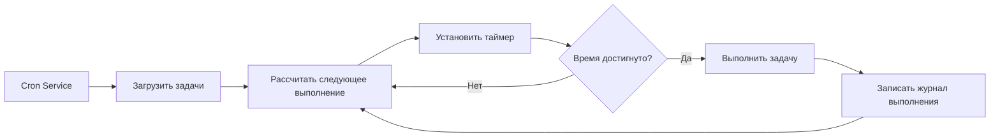

# Запланированные задачи Cron и Webhook

## Что вы сможете сделать после этого урока

После завершения этого урока вы сможете:

- Создавать запланированные задачи Cron, которые автоматически выполняют задачи ИИ в указанное время или периодически
- Понимать сценарии использования трёх методов планирования (at, every, cron)
- Настраивать Webhooks для получения внешних событий-триггеров
- Настраивать интеграцию с Gmail Pub/Sub для реализации ответов ИИ, инициируемых электронной почтой
- Управлять историей и журналами выполнения задач

## Ваша текущая проблема

Вы можете столкнуться с такими ситуациями:

- Нужно напоминать себе что-то делать в фиксированное время
- Хотите периодически резюмировать прогресс работы или генерировать отчёты
- Нужно автоматически инициировать анализ ИИ при получении определённых писем
- Не хотите каждый раз вручную отправлять сообщения ИИ

## Когда использовать этот метод

**Запланированные задачи Cron** подходят для таких сценариев:

| Сценарий | Пример | Метод планирования |
|--- | --- | ---|
| Однократное напоминание | "Напомни мне о встрече завтра в 9 утра" | at |
| Периодическая проверка | "Проверять статус системы каждые 30 минут" | every |
| Планируемое выполнение | "Генерировать ежедневный отчёт каждый вечер в 17:00" | cron |
| Сложный цикл | "С понедельника по пятницу в 9 утра" | cron |

**Webhooks** подходят для таких сценариев:

- Получать push-уведомления от GitHub, GitLab
- Получать уведомления об успешной оплате от Stripe
- Получать уведомления о входящих звонках от Twilio
- Любой сервис, который может отправлять HTTP POST

**Gmail Pub/Sub** подходит для таких сценариев:

- Автоматический анализ при получении важных писем
- Классификация и автоматические ответы на письма
- Извлечение и архивирование содержимого писем

---

## Основные концепции

### Рабочий процесс задач Cron



### Сравнение трёх методов планирования

| Метод | Сценарий использования | Пример | Точность |
|--- | --- | --- | ---|
| `at` | Одноразовая задача | 2026-01-27 09:00:00 | Миллисекунды |
| `every` | Фиксированный интервал | Каждые 30 минут | Миллисекунды |
| `cron` | Сложный цикл | Каждое утро в 9:00 | Минуты |

### Две цели сессии

| Цель сессии | Тип Payload | Описание |
|--- | --- | ---|
| `main` | `systemEvent` | Внедрять системные события в основную сессию |
| `isolated` | `agentTurn` | Выполнять Agent в изолированной сессии |

**Ключевое ограничение**:
- `sessionTarget="main"` должен использовать `payload.kind="systemEvent"`
- `sessionTarget="isolated"` должен использовать `payload.kind="agentTurn"`

---

## 🎒 Подготовка перед началом

Перед началом убедитесь, что:

::: warning Предварительная проверка
- [ ] Gateway запущен（[Запустить Gateway](../../start/gateway-startup/)）
- [ ] Модель ИИ настроена（[Конфигурация модели ИИ](../models-auth/)）
- [ ] Понимать базовый синтаксис выражений Cron（при использовании cron-планирования）
:::

---

## Следуйте за мной

### Шаг 1: Проверить статус службы Cron

**Почему**: Подтвердить, что служба Cron включена и работает

```bash
## Проверить статус Cron с помощью CLI
clawdbot cron status
```

**Вы должны увидеть**:

```
✓ Cron enabled
  Store: ~/.clawdbot/cron.json
  Jobs: 0
  Next wake: null
```

Если отображается `disabled`, вам нужно включить его в файле конфигурации:

```json
{
  "cron": {
    "enabled": true,
    "store": "~/.clawdbot/cron.json",
    "maxConcurrentRuns": 5
  }
}
```

---

### Шаг 2: Создать однократную запланированную задачу

**Почему**: Изучить самый базовый метод планирования `at`

Используйте инструмент cron для добавления задачи, которая выполнится через 1 минуту:

```json
{
  "action": "add",
  "job": {
    "name": "Тестовое напоминание",
    "enabled": true,
    "schedule": {
      "kind": "at",
      "atMs": 1738000000000
    },
    "sessionTarget": "main",
    "wakeMode": "next-heartbeat",
    "payload": {
      "kind": "systemEvent",
      "text": "Это тестовое напоминание: проверить прогресс работы"
    }
  }
}
```

**Вы должны увидеть**:

```
✓ Job added: job_xxx
  Name: Тестовое напоминание
  Next run: 2026-01-27 10:00:00
```

**Совет**: `atMs` — это временная метка Unix (в миллисекундах). Вы можете рассчитать её с помощью JavaScript:

```javascript
Date.now() + 60 * 1000  // через 1 минуту
```

---

### Шаг 3: Создать повторяющуюся интервальную задачу

**Почему**: Изучить метод планирования `every`, подходящий для периодических проверок

Создать задачу, которая выполняется каждые 30 минут:

```json
{
  "action": "add",
  "job": {
    "name": "Проверять систему каждые 30 минут",
    "enabled": true,
    "schedule": {
      "kind": "every",
      "everyMs": 1800000
    },
    "sessionTarget": "main",
    "wakeMode": "next-heartbeat",
    "payload": {
      "kind": "systemEvent",
      "text": "Проверить статус системы: ЦП, память, диск"
    }
  }
}
```

**Вы должны увидеть**:

```
✓ Job added: job_xxx
  Name: Проверять систему каждые 30 минут
  Interval: 30 minutes
  Next run: 2026-01-27 10:00:00
```

**Описание параметров**:
- `everyMs`: Время интервала (в миллисекундах)
  - 1 минута = 60.000 мс
  - 5 минут = 300.000 мс
  - 30 минут = 1.800.000 мс
  - 1 час = 3.600.000 мс
- `anchorMs` (опционально): Время начала для первого выполнения

---

### Шаг 4: Создать задачу с выражением Cron

**Почему**: Изучить метод планирования `cron`, подходящий для сложных циклов

Создать задачу, которая выполняется каждое утро в 9:00:

```json
{
  "action": "add",
  "job": {
    "name": "Ежедневный отчёт каждое утро в 9",
    "enabled": true,
    "schedule": {
      "kind": "cron",
      "expr": "0 9 * * *",
      "tz": "Asia/Shanghai"
    },
    "sessionTarget": "main",
    "wakeMode": "next-heartbeat",
    "payload": {
      "kind": "systemEvent",
      "text": "Генерировать ежедневный отчёт о работе"
    }
  }
}
```

**Вы должны увидеть**:

```
✓ Job added: job_xxx
  Name: Ежедневный отчёт каждое утро в 9
  Schedule: 0 9 * * * (Asia/Shanghai)
  Next run: 2026-01-27 09:00:00
```

**Формат выражения Cron**:

```
┌───────────── Минута (0 - 59)
│ ┌─────────── Час (0 - 23)
│ │ ┌───────── День (1 - 31)
│ │ │ ┌─────── Месяц (1 - 12)
│ │ │ │ ┌───── День недели (0 - 7, 0 и 7 означают воскресенье)
│ │ │ │ │
* * * * *
```

**Распространённые выражения**:

| Выражение | Описание |
|--- | ---|
| `0 9 * * *` | Каждый день в 9 утра |
| `0 9 * * 1-5` | С понедельника по пятницу в 9 утра |
| `0 */6 * * *` | Каждые 6 часов |
| `0 0 * * 0` | Каждое воскресенье в полночь |
| `0 9,17 * * *` | Ежедневно в 9:00 и 17:00 |

::: info Настройка часового пояса
Выражения Cron по умолчанию используют часовой пояс UTC. Используйте поле `tz` для указания часового пояса (напр. `"Asia/Shanghai"`), чтобы задачи выполнялись в ожидаемое время.
:::

---

### Шаг 5: Выполнить задачу в изолированной сессии

**Почему**: Выполнять задачи ИИ в изолированной среде, чтобы избежать помех основной сессии

Создать задачу, которая выполняется в изолированной сессии:

```json
{
  "action": "add",
  "job": {
    "name": "Ежедневное резюме",
    "enabled": true,
    "schedule": {
      "kind": "cron",
      "expr": "0 18 * * *",
      "tz": "Asia/Shanghai"
    },
    "sessionTarget": "isolated",
    "wakeMode": "next-heartbeat",
    "payload": {
      "kind": "agentTurn",
      "message": "Резюмировать сегодняшнюю работу: 1. Выполненные задачи 2. Возникшие проблемы 3. План на завтра",
      "model": "anthropic/claude-sonnet-4-20250514",
      "thinking": "low"
    }
  }
}
```

**Вы должны увидеть**:

```
✓ Job added: job_xxx
  Name: Ежедневное резюме
  Session: isolated
  Next run: 2026-01-27 18:00:00
```

**Параметры Payload `agentTurn`**:

| Параметр | Тип | Описание |
|--- | --- | ---|
| `message` | string | Промпт, отправленный Agent |
| `model` | string | Переопределить используемую модель (опционально) |
| `thinking` | string | Уровень мышления: "off" \| "minimal" \| "low" \| "medium" \| "high" |
| `timeoutSeconds` | number | Время ожидания (секунды) |
| `deliver` | boolean | Отправлять ли результат в канал |
| `channel` | string | Целевой канал (напр. `"whatsapp"`, `"telegram"`) |
| `to` | string | Идентификатор получателя |
| `bestEffortDeliver` | boolean | Пробовать другие каналы, когда невозможно отправить в указанный канал |

**Конфигурация изолированной сессии** (опционально):

```json
{
  "isolation": {
    "postToMainPrefix": "📊 Ежедневное резюме:",
    "postToMainMode": "summary",
    "postToMainMaxChars": 8000
  }
}
```

| Параметр | Описание |
|--- | ---|
| `postToMainPrefix` | Префикс при пересылке результатов в основную сессию |
| `postToMainMode` | "summary" (резюме) или "full" (полный текст) |
| `postToMainMaxChars` | Максимальное количество символов, когда `postToMainMode="full"` |

---

### Шаг 6: Список и управление задачами

**Почему**: Просмотреть все задачи и управлять их состоянием

**Показать все задачи**:

```bash
clawdbot cron list
```

**Вы должны увидеть**:

```
Jobs: 3
  ✓ job_xxx: Тестовое напоминание (enabled, next: 2026-01-27 10:00:00)
  ✓ job_yyy: Проверять систему каждые 30 минут (enabled, next: 2026-01-27 10:00:00)
  ✓ job_zzz: Ежедневный отчёт каждое утро в 9 (enabled, next: 2026-01-27 09:00:00)
```

**Включить отключённые задачи**:

```bash
clawdbot cron list --include-disabled
```

**Отключить задачу**:

```json
{
  "action": "update",
  "jobId": "job_xxx",
  "patch": {
    "enabled": false
  }
}
```

**Включить задачу**:

```json
{
  "action": "update",
  "jobId": "job_xxx",
  "patch": {
    "enabled": true
  }
}
```

**Удалить задачу**:

```json
{
  "action": "remove",
  "jobId": "job_xxx"
}
```

---

### Шаг 7: Выполнить задачу немедленно

**Почему**: Проверить, работает ли задача нормально, без ожидания планирования

```json
{
  "action": "run",
  "jobId": "job_xxx"
}
```

**Вы должны увидеть**:

```
✓ Job ran: job_xxx
  Status: ok
  Duration: 1234ms
```

**Показать историю выполнения**:

```json
{
  "action": "runs",
  "jobId": "job_xxx",
  "limit": 10
}
```

**Вы должны увидеть**:

```
Runs for job_xxx (10 most recent):
  2026-01-27 10:00:00 - ok - 1234ms
  2026-01-26 10:00:00 - ok - 1189ms
  2026-01-25 10:00:00 - ok - 1245ms
```

---

### Шаг 8: Добавить контекст к задаче напоминания

**Почему**: Позволить ИИ понимать недавний контекст разговора и предоставлять более релевантные напоминания

Используйте параметр `contextMessages` для добавления истории недавних сообщений:

```json
{
  "action": "add",
  "job": {
    "name": "Напоминание о отслеживании задач",
    "enabled": true,
    "schedule": {
      "kind": "cron",
      "expr": "0 10,16 * * *",
      "tz": "Asia/Shanghai"
    },
    "sessionTarget": "main",
    "wakeMode": "next-heartbeat",
    "payload": {
      "kind": "systemEvent",
      "text": "Отследить прогресс ваших задач: 1. Проверить ожидания 2. Обновить статус проекта"
    },
    "contextMessages": 5
  }
}
```

**Ограничения контекстных сообщений**:
- Максимум сообщений: 10
- Максимум символов на сообщение: 220
- Общее ограничение символов: 700
- Формат: `- User: ...\n- Assistant: ...`

**Автоматически добавляемый контекст**:

```
Отследить прогресс ваших задач: 1. Проверить ожидания 2. Обновить статус проекта

Recent context:
- User: Мне нужно завершить отчёт сегодня
- Assistant: Понял, какой тип отчёта вам нужен?
- User: Это еженедельный отчёт, включает резюме работы этой недели
```

---

## Конфигурация Webhook

### Обзор Webhook

Webhooks позволяют внешним сервисам инициировать внутренние события Clawdbot через HTTP POST-запросы. Распространённые варианты использования:

- **GitHub/GitLab**: Push-уведомления инициируют процессы CI/CD
- **Stripe**: Уведомления об успешной оплате инициируют обработку заказов
- **Twilio**: Уведомления о входящих звонках инициируют голосовые ответы ИИ
- **Jira**: Уведомления о создании тикета инициируют автоматические ответы

### Настроить Webhook

**Включить систему Hooks**:

```json
{
  "hooks": {
    "enabled": true,
    "path": "/hooks",
    "token": "your-secret-token-here"
  }
}
```

**Настроить правила маппинга**:

```json
{
  "hooks": {
    "enabled": true,
    "token": "your-secret-token-here",
    "mappings": [
      {
        "id": "github-push",
        "match": {
          "path": "/hooks/github"
        },
        "action": "wake",
        "wakeMode": "now",
        "sessionKey": "main",
        "messageTemplate": "Push-уведомление GitHub: {{ repository }} - {{ ref }}"
      }
    ]
  }
}
```

**Параметры конфигурации маппинга**:

| Параметр | Описание |
|--- | ---|
| `match.path` | URL-путь для сопоставления |
| `match.source` | Заголовок источника запроса для сопоставления |
| `action` | `"wake"` или `"agent"` |
| `wakeMode` | `"now"` или `"next-heartbeat"` |
| `sessionKey` | Ключ целевой сессии (напр. `"main"`) |
| `messageTemplate` | Шаблон сообщения с использованием синтаксиса Mustache |
| `deliver` | Отправлять ли в канал |
| `channel` | Целевой канал (напр. `"whatsapp"`) |
| `to` | Идентификатор получателя |
| `transform` | Модуль трансформации (обрабатывает тело запроса) |

---

## Интеграция с Gmail Pub/Sub

### Обзор Gmail Pub/Sub

Gmail Pub/Sub позволяет вам инициировать Clawdbot в реальном времени при получении новых писем, реализуя ответы ИИ, инициируемые электронной почтой.

### Настроить Gmail Pub/Sub

**Базовая конфигурация**:

```json
{
  "hooks": {
    "enabled": true,
    "token": "your-hook-token",
    "gmail": {
      "account": "your-email@gmail.com",
      "label": "INBOX",
      "topic": "projects/your-project-id/topics/gmail-topic",
      "subscription": "gmail-subscription",
      "pushToken": "your-push-token",
      "hookUrl": "http://127.0.0.1:18789/hooks/gmail",
      "includeBody": true,
      "maxBytes": 20000,
      "renewEveryMinutes": 720
    }
  }
}
```

**Описание параметров конфигурации**:

| Параметр | Описание | Значение по умолчанию |
|--- | --- | ---|
| `account` | Адрес учётной записи Gmail | - |
| `label` | Метка Gmail для мониторинга | `INBOX` |
| `topic` | Путь темы Pub/Sub Google Cloud | - |
| `subscription` | Имя подписки Pub/Sub | `gmail-subscription` |
| `pushToken` | Токен push Gmail | - |
| `hookUrl` | URL приёма Webhook | Генерируется автоматически |
| `includeBody` | Включать ли тело письма | `true` |
| `maxBytes` | Максимум байт письма | `20000` |
| `renewEveryMinutes` | Интервал продления подписки (минуты) | `720` (12 часов) |

### Интеграция с Tailscale (опционально)

**Открыть Webhook с помощью Tailscale Serve**:

```json
{
  "hooks": {
    "gmail": {
      "tailscale": {
        "mode": "serve",
        "path": "/gmail-pubsub",
        "target": "10000"
      }
    }
  }
}
```

**Использовать Tailscale Funnel**:

```json
{
  "hooks": {
    "gmail": {
      "tailscale": {
        "mode": "funnel",
        "path": "/gmail-pubsub"
      }
    }
  }
}
```

| Режим | Описание |
|--- | ---|
| `off` | Не использовать Tailscale |
| `serve` | Открыть локальный сервис через Tailscale Serve |
| `funnel` | Доступ из интернета через Tailscale Funnel |

### Запустить Gmail Watcher

**Запустить службу Gmail Watcher**:

```bash
clawdbot hooks gmail-watch
```

**Вы должны увидеть**:

```
✓ Gmail watcher started
  Account: your-email@gmail.com
  Label: INBOX
  Watching...
```

**Gmail Watcher будет**:
1. Подписываться на изменения меток Gmail
2. Получать новые push-уведомления о письмах
3. Отправлять информацию о письме в Webhook
4. Инициировать внутренние события Clawdbot

---

## Контрольная точка ✅

**Подтвердите, что вы освоили**:

- [ ] Можете создавать три типа задач Cron (at, every, cron)
- [ ] Понимаете разницу между целями сессий `main` и `isolated`
- [ ] Можете списывать, включать, отключать и удалять задачи
- [ ] Можете просматривать историю выполнения задач
- [ ] Понимаете конфигурацию и принцип работы Webhook
- [ ] Можете настраивать интеграцию с Gmail Pub/Sub

---

## Устранение неполадок

### Задача не выполняется

**Проблема**: Задача добавлена, но никогда не выполняется

**Возможные причины**:

| Причина | Решение |
|--- | ---|
| Служба Cron не включена | Проверить конфигурацию `cron.enabled` |
| Время не достигнуто | Проверить следующее выполнение с `clawdbot cron list` |
| Неверный часовой пояс | Проверить, правильно ли поле `tz` |
| Задача отключена | Проверить статус задачи с `--include-disabled` |

### Ошибка в выражении Cron

**Проблема**: Задача выполняется в неправильное время

**Распространённые ошибки**:

| Ошибка | Правильно | Описание |
|--- | --- | ---|
| `9 * * *` | `0 9 * * *` | Отсутствует поле минуты |
| `0 9 * * * *` | `0 9 * * *` | Лишнее поле |
| `0 9 1-5 * *` | `0 9 * * 1-5` | Неправильная позиция поля дня недели |

**Инструмент валидации**: Используйте [crontab.guru](https://crontab.guru/) для проверки выражений Cron.

### Gmail Pub/Sub не работает

**Проблема**: Письмо получено, но не инициируется

**Контрольный список**:

- [ ] Служба Gmail Watcher запущена?
- [ ] Доступен ли `hookUrl`? (протестировать с curl)
- [ ] Правильно ли настроен `token`?
- [ ] Правильно ли созданы тема и подписка Pub/Sub?
- [ ] Нормальна ли сетевое соединение? (при использовании Tailscale)

### Изолированная сессия без ответа

**Проблема**: Задачи с `sessionTarget="isolated"` не имеют вывода

**Возможные причины**:

- Отсутствует поле `model`, используется модель по умолчанию, но не настроена
- Промпт `message` недостаточно ясен
- `timeoutSeconds` слишком коротко, задача истекает по времени
- `deliver=false`, но `postToMainMode` не настроено

**Решение**:

1. Увеличить уровень детализации журналов
2. Проверить журналы Gateway
3. Использовать `bestEffortDeliver=true`, чтобы гарантировать, что результат по крайней мере пересылается в основную сессию

---

## Резюме урока

Cron и Webhooks — это мощные инструменты автоматизации Clawdbot:

**Система Cron**:
- Три метода планирования: `at` (однократная), `every` (интервал), `cron` (сложный цикл)
- Две цели сессии: `main` (внедрить системное событие), `isolated` (выполнить Agent)
- Поддерживает историю задач и журналы выполнения
- Может добавлять контекстные сообщения для предоставления более релевантных напоминаний

**Система Webhook**:
- Получать внешние HTTP POST-запросы
- Поддерживает правила маппинга и шаблоны сообщений
- Может настраивать Tailscale для публичного доступа в интернете

**Gmail Pub/Sub**:
- Мониторить новые письма в реальном времени
- Поддерживает фильтрацию по меткам
- Интеграция с Tailscale Serve/Funnel

Правильно настроив эти функции, вы можете создать полностью автоматизированного ИИ-ассистента, который отвечает в нужное время.

---

## Предварительный обзор следующего урока

> В следующем уроке мы изучим **[Систему памяти и векторный поиск](../memory-system/)**.
>
> Вы сможете:
> - Структура файлов и механизм индексирования системы памяти
> - Настроить провайдеров векторного поиска (OpenAI, Gemini, локальный)
> - Использовать гибридный поиск (BM25 + векторный) для улучшения точности извлечения
> - Управлять индексами памяти и поиском через CLI

---

## Приложение: Ссылка на исходный код

<details>
<summary><strong>Нажмите, чтобы увидеть местоположения исходного кода</strong></summary>

> Дата обновления: 2026-01-27

| Функциональность | Путь к файлу | Номера строк |
|--- | --- | ---|
| Определение типов конфигурации Cron | [`src/config/types.cron.ts`](https://github.com/moltbot/moltbot/blob/main/src/config/types.cron.ts#L1-L6) | 1-6 |
| Определение основных типов Cron | [`src/cron/types.ts`](https://github.com/moltbot/moltbot/blob/main/src/cron/types.ts#L1-L95) | 1-95 |
| Cron Service | [`src/cron/service.ts`](https://github.com/moltbot/moltbot/blob/main/src/cron/service.ts#L1-L49) | 1-49 |
| Реализация операций Cron | [`src/cron/service/ops.ts`](https://github.com/moltbot/moltbot/blob/main/src/cron/service/ops.ts#L1-L141) | 1-141 |
| Реализация инструмента Cron | [`src/agents/tools/cron-tool.ts`](https://github.com/moltbot/moltbot/blob/main/src/agents/tools/cron-tool.ts#L1-L291) | 1-291 |
| Методы Cron Gateway | [`src/gateway/server-methods/cron.ts`](https://github.com/moltbot/moltbot/blob/main/src/gateway/server-methods/cron.ts#L1-L205) | 1-205 |
| Определение типов конфигурации Hooks | [`src/config/types.hooks.ts`](https://github.com/moltbot/moltbot/blob/main/src/config/types.hooks.ts#L1-L125) | 1-125 |
| Инструмент Gmail Hooks | [`src/hooks/gmail.ts`](https://github.com/moltbot/moltbot/blob/main/src/hooks/gmail.ts#L1-L267) | 1-267 |
| Внутренние события Hooks | [`src/hooks/hooks.ts`](https://github.com/moltbot/moltbot/blob/main/src/hooks/hooks.ts#L1-L15) | 1-15 |
| Команды CLI Hooks | [`src/cli/hooks-cli.ts`](https://github.com/moltbot/moltbot/blob/main/src/cli/hooks-cli.ts#L1-L839) | 1-839 |

**Ключевые константы**:
- `DEFAULT_GMAIL_LABEL = "INBOX"`: Метка по умолчанию Gmail
- `DEFAULT_GMAIL_TOPIC = "gog-gmail-watch"`: Имя темы Gmail по умолчанию
- `DEFAULT_GMAIL_SUBSCRIPTION = "gog-gmail-watch-push"`: Имя подписки Gmail по умолчанию
- `DEFAULT_GMAIL_MAX_BYTES = 20000`: Максимум байт письма по умолчанию
- `DEFAULT_GMAIL_RENEW_MINUTES = 720`: Интервал продления по умолчанию (12 часов)

**Ключевые функции**:
- `CronService.start()`: Запустить службу Cron
- `CronService.add()`: Добавить запланированную задачу
- `CronService.update()`: Обновить задачу
- `CronService.remove()`: Удалить задачу
- `CronService.run()`: Выполнить задачу немедленно
- `createCronTool()`: Создать инструмент Cron
- `resolveGmailHookRuntimeConfig()`: Разобрать конфигурацию Gmail Hook
- `buildGogWatchStartArgs()`: Построить аргументы запуска Gmail Watch
- `buildGogWatchServeArgs()`: Построить аргументы службы Gmail Watch

</details>
