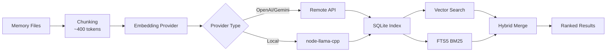

# Полное руководство по системе памяти и векторному поиску

## Что вы сможете сделать

После завершения этого урока вы сможете:

- Понять структуру файлов и механизм индексации системы памяти Clawdbot
- Настроить поставщиков векторного поиска (OpenAI, Gemini, локальный)
- Использовать гибридный поиск (BM25 + векторный) для повышения точности извлечения
- Управлять индексами памяти и поиском через CLI
- Настраивать кэш Embedding и производительность индексации

## Ваша текущая проблема

Вы можете столкнуться с этими ситуациями:

- ИИ "забывает" содержание предыдущих бесед в новых сессиях
- Вы хотите, чтобы ИИ запоминал постоянные знания и предпочтения
- Вы не знаете, как заставить ИИ "учиться" и запоминать важную информацию
- При поиске исторических бесед не удаётся найти релевантный контекст

## Когда использовать эту технику

**Система памяти** подходит для этих сценариев:

| Сценарий | Пример | Место хранения |
|--- | --- | ---|
| Постоянные знания | "Я вегетарианец, запомни это" | MEMORY.md |
| Ежедневные заметки | "Прогресс работы на сегодня и задачи" | memory/YYYY-MM-DD.md |
| Извлечение сессий | "Какой был API endpoint, который мы обсуждали в прошлый раз?" | Векторный индекс |
| Информация о настройке | "Gateway работает на порту 18789" | MEMORY.md |

---

## Основные концепции

### Двухуровневая структура системы памяти

Clawdbot использует **два уровня данных** для управления долгосрочной памятью:

| Уровень | Путь к файлу | Назначение | Момент загрузки |
|--- | --- | --- | ---|
| **Долгосрочная память** | `MEMORY.md` | Избранные знания, предпочтения, важные факты | Загружается при запуске основной сессии |
| **Ежедневный журнал** | `memory/YYYY-MM-DD.md` | Ежедневные заметки, контекст выполнения | Загружаются сегодняшний и вчерашний |

::: info Почему два уровня?
`MEMORY.md` похож на "базу знаний" и загружается только в основную сессию, обеспечивая отсутствие утечки конфиденциальной информации в групповые беседы. `memory/*.md` — это "дневник", который записывает повседневный поток для облегчения ретроспективного анализа.
:::

### Рабочий процесс векторной индексации



### Гибридный поиск: BM25 + Векторный

Векторный поиск хорош в "семантическом сопоставлении", но слаб в "точном сопоставлении":

| Тип запроса | Векторный поиск | BM25 полнотекстовый | Гибридный поиск |
|--- | --- | --- | ---|
| "IP адрес сервера" | ❌ Слабый | ✅ Сильный | ✅ Оптимальный |
| "Как развернуть Gateway" | ✅ Сильный | ⚠️ Средний | ✅ Оптимальный |
| "API endpoint a828e60" | ❌ Слабый | ✅ Сильный | ✅ Оптимальный |

**Формула слияния**:
```javascript
finalScore = vectorWeight × vectorScore + textWeight × textScore
```

- `vectorWeight + textWeight` автоматически нормализуется до 1.0
- По умолчанию: 70% вектор + 30% ключевые слова
- Настраивается через `agents.defaults.memorySearch.query.hybrid.*`

---

## 🎒 Подготовка перед началом

Перед началом убедитесь:

::: warning Предварительная проверка
- [ ] Gateway запущен ( [Запустить Gateway](../../start/gateway-startup/) )
- [ ] Модель ИИ настроена ( [Настройка модели ИИ](../models-auth/) )
- [ ] Вы умеете редактировать базовые файлы Markdown
:::

::: tip Рекомендуемая конфигурация
- Предпочитайте использовать OpenAI или Gemini embeddings (быстрые и высокого качества)
- Локальные embeddings требуют `pnpm rebuild node-llama-cpp`
- Первая индексация может занять несколько минут, но после этого инкрементные обновления быстры
:::

---

## Следуйте шагам

### Шаг 1: Создать файлы памяти

**Почему**: ИИ индексирует только существующие файлы, сначала создайте содержимое памяти

Создайте файлы в рабочем каталоге агента (по умолчанию `~/clawd`):

```bash
# Создать файл долгосрочной памяти
cat > ~/clawd/MEMORY.md << 'EOF'
# Личные предпочтения

- Предпочтения в питании: вегетарианец, не люблю острую еду
- Рабочее время: с 9 до 18
- Частые команды: `clawdbot gateway status`

# Важная конфигурация

- Порт Gateway: 18789
- База данных: PostgreSQL 15
EOF

# Создать журнал сегодняшнего дня
cat > ~/clawd/memory/$(date +%Y-%m-%d).md << 'EOF'
# Прогресс работы сегодня

- Завершена настройка Gateway
- Изучена система памяти
- Задачи: прочитать документацию по аутентификации моделей
EOF
```

**Что вы должны увидеть**:

```bash
# Посмотреть структуру файлов
tree ~/clawd/
# или
ls -la ~/clawd/
ls -la ~/clawd/memory/

# Пример вывода
~/clawd/
├── MEMORY.md
└── memory/
    └── 2026-01-27.md
```

### Шаг 2: Проверить состояние системы памяти

**Почему**: Подтвердить поставщика Embedding и состояние индекса

```bash
# Базовая проверка состояния
clawdbot memory status

# Глубокая проверка (обнаружить доступность поставщика)
clawdbot memory status --deep

# Глубокая проверка + принудительная реиндексация
clawdbot memory status --deep --index
```

**Что вы должны увидеть**:

```bash
✓ Memory Search enabled
  Store: ~/.clawdbot/memory/main.sqlite
  Provider: openai
  Model: text-embedding-3-small
  Fallback: openai
  Hybrid: enabled (vectorWeight: 0.7, textWeight: 0.3)
  Cache: enabled (maxEntries: 50000)
  Sources: memory
  Indexed: 2 files, 5 chunks
```

::: tip Глубокая проверка
- `--deep` обнаруживает, доступны ли embeddings OpenAI/Gemini/Local
- `--index` реиндексирует автоматически при обнаружении "грязного" индекса
- При первом запуске индексация может занять несколько минут
:::

### Шаг 3: Вызвать индексацию вручную

**Почему**: Обеспечить, что только что созданные файлы памяти будут проиндексированы

```bash
# Вызвать индексацию вручную
clawdbot memory index

# С подробным журналом
clawdbot memory index --verbose

# Только для конкретного агента
clawdbot memory index --agent main
```

**Что вы должны увидеть**:

```bash
Indexing memory for agent: main
  Provider: openai (text-embedding-3-small)
  Sources: memory
  - MEMORY.md (2 chunks)
  - memory/2026-01-27.md (3 chunks)
✓ Indexed 2 files, 5 chunks
```

### Шаг 4: Протестировать семантический поиск

**Почему**: Проверить, что векторный поиск и гибридный поиск работают корректно

```bash
# Базовый поиск
clawdbot memory search "вегетарианец"

# Поиск точного соответствия (протестировать BM25)
clawdbot memory search "порт Gateway"

# Неопределённый семантический поиск (протестировать векторный)
clawdbot memory search "что я люблю есть"

# Посмотреть подробные результаты
clawdbot memory search "Gateway" --verbose
```

**Что вы должны увидеть**:

```bash
Searching memory for: "вегетарианец"

Results (2):

[1] MEMORY.md:3-5 (score: 0.842)
  - Предпочтения в питании: вегетарианец, не люблю острую еду

[2] memory/2026-01-27.md:1-3 (score: 0.615)
  - Завершена настройка Gateway
  - Изучена система памяти
```

### Шаг 5: Настроить поставщика Embedding

**Почему**: Выбрать наиболее подходящего поставщика в зависимости от потребностей (удалённый vs локальный)

#### Вариант A: OpenAI embeddings (рекомендуется)

Отредактируйте файл конфигурации `~/.clawdbot/clawdbot.json`:

```json
{
  "agents": {
    "defaults": {
      "memorySearch": {
        "enabled": true,
        "provider": "openai",
        "model": "text-embedding-3-small",
        "fallback": "openai",
        "remote": {
          "apiKey": "YOUR_OPENAI_API_KEY",
          "batch": {
            "enabled": true,
            "concurrency": 2
          }
        }
      }
    }
  }
}
```

**Преимущества**:
- Быстрый и высокого качества
- Поддерживает пакетную индексацию (экономично)
- Подходит для массового заполнения

#### Вариант B: Gemini embeddings

```json
{
  "agents": {
    "defaults": {
      "memorySearch": {
        "provider": "gemini",
        "model": "gemini-embedding-001",
        "remote": {
          "apiKey": "YOUR_GEMINI_API_KEY"
        },
        "fallback": "openai"
      }
    }
  }
}
```

#### Вариант C: Локальные embeddings (приоритет конфиденциальности)

```json
{
  "agents": {
    "defaults": {
      "memorySearch": {
        "provider": "local",
        "local": {
          "modelPath": "hf:ggml-org/embeddinggemma-300M-GGUF/embeddinggemma-300M-Q8_0.gguf",
          "modelCacheDir": "~/.cache/embeddings"
        },
        "fallback": "none"
      }
    }
  }
}
```

**Предостережения**:

```bash
# Первое использование локальных embeddings требует сборки
pnpm approve-builds
# Выбрать node-llama-cpp
pnpm rebuild node-llama-cpp
```

**Что вы должны увидеть**:

```bash
✓ node-llama-cpp installed
✓ Local embedding model ready
```

::: warning Локальные embeddings
- При первом использовании модель будет автоматически загружена (~600MB)
- Требует компиляции node-llama-cpp (зависит от системной среды)
- Медленнее удалённого, но полностью автономно и приоритет конфиденциальности
:::

### Шаг 6: Настроить веса гибридного поиска

**Почему**: Настроить пропорцию весов семантических и ключевых слов в зависимости от сценария использования

Отредактируйте конфигурацию:

```json
{
  "agents": {
    "defaults": {
      "memorySearch": {
        "query": {
          "hybrid": {
            "enabled": true,
            "vectorWeight": 0.7,
            "textWeight": 0.3,
            "candidateMultiplier": 4
          }
        }
      }
    }
  }
}
```

**Описание параметров**:

| Параметр | Значение по умолчанию | Описание | Рекомендация по настройке |
|--- | --- | --- | ---|
| `vectorWeight` | 0,7 | Вес семантического поиска | Увеличить до 0,8 для запросов на "естественном языке" |
| `textWeight` | 0,3 | Вес поиска по ключевым словам | Увеличить до 0,5 для запросов "код/ID" |
| `candidateMultiplier` | 4 | Множитель кандидатов | Увеличить до 6 для улучшения полноты |

**Сравнение эффектов**:

```bash
# Протестировать семантический запрос
clawdbot memory search "метод развертывания Gateway"
# vectorWeight: 0,7 → находит семантически релевантные результаты
# textWeight: 0,5 → находит ключевые слова "развернуть", "Gateway"

# Протестировать точный запрос
clawdbot memory search "API endpoint a828e60"
# vectorWeight: 0,3 → игнорирует семантику, приоритет соответствию
# textWeight: 0,7 → точное соответствие "a828e60"
```

### Шаг 7: Включить ускорение SQLite-vec

**Почему**: Выполнить pushdown векторных запросов в SQLite, избегая загрузки всех embeddings

Отредактируйте конфигурацию:

```json
{
  "agents": {
    "defaults": {
      "memorySearch": {
        "store": {
          "vector": {
            "enabled": true,
            "extensionPath": "/path/to/sqlite-vec"
          }
        }
      }
    }
  }
}
```

**Проверить доступность sqlite-vec**:

```bash
# Посмотреть состояние индекса
clawdbot memory status --deep

# Если доступно, вы увидите
✓ SQLite-vec extension loaded
  Vector table: chunks_vec
```

::: info SQLite-vec
- По умолчанию пытается загрузиться автоматически
- При ошибке загрузки автоматически возвращается к вычислению на JS (не влияет на функциональность)
- Пользовательский путь используется только для специальных сборок или нестандартных установок
:::

---

## Точка проверки ✅

После выполнения указанных выше шагов проверьте следующее:

| Элемент проверки | Метод проверки | Ожидаемый результат |
|--- | --- | ---|
| Файлы памяти существуют | `ls ~/clawd/` | MEMORY.md и каталог memory/ существуют |
| Индекс создан | `clawdbot memory status` | Показывает Indexed > 0 chunks |
| Поиск работает | `clawdbot memory search "..."` | Возвращает релевантные результаты |
| Provider работает | `clawdbot memory status --deep` | Показывает тип Provider |

---

## Частые проблемы

### Проблема 1: Сбой поставщика Embedding

**Симптом**:

```bash
✗ Memory Search disabled
  Error: No API key found for provider
```

**Решение**:

```bash
# Проверить конфигурацию
cat ~/.clawdbot/clawdbot.json | grep -A 5 "memorySearch"

# Подтвердить существование apiKey
# Или задать переменные окружения
export OPENAI_API_KEY="sk-..."
export GEMINI_API_KEY="..."
```

### Проблема 2: Невозможно загрузить локальные embeddings

**Симптом**:

```bash
✗ Local embedding provider failed
  Error: Cannot find module 'node-llama-cpp'
```

**Решение**:

```bash
# Одобрить сборку
pnpm approve-builds

# Пересобрать
pnpm rebuild node-llama-cpp
```

### Проблема 3: Индекс не обновляется

**Симптом**:

```bash
# MEMORY.md был изменён
# Но результаты поиска всё ещё старые
```

**Решение**:

```bash
# Способ 1: Вызвать индексацию вручную
clawdbot memory index

# Способ 2: Перезапустить Gateway (активирует индексацию onSessionStart)
clawdbot gateway restart

# Способ 3: Проверить мониторинг файлов
clawdbot memory status --verbose
# Проверить "Watch: true"
```

### Проблема 4: Нерелевантные результаты поиска

**Симптом**: Поиск "Gateway" возвращает "прогресс работы"

**Возможные причины**:

1. **Неуместные гибридные веса**:
   - Семантический запрос ("как развернуть") → увеличить `vectorWeight`
   - Запрос по ключевым словам ("API endpoint") → увеличить `textWeight`

2. **Индекс полностью не обновлён**:
   ```bash
   # Принудительная реиндексация
   rm ~/.clawdbot/memory/main.sqlite
   clawdbot memory index
   ```

3. **Проблема с гранулярностью чанков**:
   - По умолчанию 400 токенов, может обрезать контекст
   - Настроить `agents.defaults.memorySearch.chunking.tokens`

---

## Итоги урока

На этом уроке мы узнали:

1. **Архитектура системы памяти**
   - Двухуровневая структура данных (MEMORY.md + memory/*.md)
   - Векторный индекс + полнотекстовый поиск FTS5
   - Гибридное извлечение (BM25 + векторный)

2. **Настройка поставщика Embedding**
   - Три варианта: OpenAI/Gemini/локальный
   - Ускорение пакетной индексации
   - Механизм fallback

3. **Использование инструментов CLI**
   - `clawdbot memory status` проверить состояние
   - `clawdbot memory index` вызвать индексацию
   - `clawdbot memory search` протестировать поиск

4. **Оптимизация производительности**
   - Векторное ускорение SQLite-vec
   - Кэш Embedding
   - Настройка гибридных весов

---

## Следующий урок

> В следующем уроке мы изучим **[Безопасность и изоляция Sandbox](../security-sandbox/)**.
>
> Вы узнаете:
> - Контроль прав доступа к инструментам и allowlist
> - Изоляция сессий Sandbox
> - Механизм утверждения Exec
> - Docker-развертывание
> - Аутентификация Tailscale

---

## Приложение: Справочник по исходному коду

<details>
<summary><strong>Нажмите, чтобы раскрыть расположение исходного кода</strong></summary>

> Обновлено: 2026-01-27

| Функциональность | Путь к файлу | Номер строки |
|--- | --- | ---|
| Менеджер памяти | [`src/memory/manager.ts`](https://github.com/clawdbot/clawdbot/blob/main/src/memory/manager.ts) | 1-200 |
| Гибридный поиск | [`src/memory/hybrid.ts`](https://github.com/clawdbot/clawdbot/blob/main/src/memory/hybrid.ts) | 1-112 |
| Поставщик Embedding | [`src/memory/embeddings.ts`](https://github.com/clawdbot/clawdbot/blob/main/src/memory/embeddings.ts) | 1-80 |
| OpenAI embeddings | [`src/memory/embeddings-openai.ts`](https://github.com/clawdbot/clawdbot/blob/main/src/memory/embeddings-openai.ts) | Весь файл |
| Gemini embeddings | [`src/memory/embeddings-gemini.ts`](https://github.com/clawdbot/clawdbot/blob/main/src/memory/embeddings-gemini.ts) | Весь файл |
| Локальные embeddings | [`src/memory/node-llama.ts`](https://github.com/clawdbot/clawdbot/blob/main/src/memory/node-llama.ts) | Весь файл |
| SQLite-vec | [`src/memory/sqlite-vec.ts`](https://github.com/clawdbot/clawdbot/blob/main/src/memory/sqlite-vec.ts) | Весь файл |
| Пакетная индексация (OpenAI) | [`src/memory/batch-openai.ts`](https://github.com/clawdbot/clawdbot/blob/main/src/memory/batch-openai.ts) | Весь файл |
| Пакетная индексация (Gemini) | [`src/memory/batch-gemini.ts`](https://github.com/clawdbot/clawdbot/blob/main/src/memory/batch-gemini.ts) | Весь файл |
| Менеджер поиска | [`src/memory/manager-search.ts`](https://github.com/clawdbot/clawdbot/blob/main/src/memory/manager-search.ts) | Весь файл |
| Memory Schema | [`src/memory/memory-schema.ts`](https://github.com/clawdbot/clawdbot/blob/main/src/memory/memory-schema.ts) | Весь файл |

**Ключевые конфигурации**:
- `agents.defaults.memorySearch.enabled`: включить/выключить поиск памяти
- `agents.defaults.memorySearch.provider`: поставщик Embedding ("openai", "gemini", "local")
- `agents.defaults.memorySearch.query.hybrid.vectorWeight`: вес векторного поиска (по умолчанию 0,7)
- `agents.defaults.memorySearch.query.hybrid.textWeight`: вес поиска BM25 (по умолчанию 0,3)
- `agents.defaults.memorySearch.cache.enabled`: кэш Embedding (по умолчанию true)
- `agents.defaults.memorySearch.store.vector.enabled`: ускорение SQLite-vec (по умолчанию true)

**Ключевые функции**:
- `mergeHybridResults()`: слияние векторных + BM25 результатов (`src/memory/hybrid.ts:39-111`)
- `bm25RankToScore()`: преобразование ранга BM25 в балл (`src/memory/hybrid.ts:34-37`)
- `createEmbeddingProvider()`: создание поставщика Embedding (`src/memory/embeddings.ts`)
- `getMemorySearchManager()`: получение менеджера поиска памяти (`src/memory/search-manager.ts`)

**Команды CLI**:
- `clawdbot memory status`: проверить состояние (`src/cli/commands/memory-cli.ts`)
- `clawdbot memory index`: вызвать индексацию (`src/cli/commands/memory-cli.ts`)
- `clawdbot memory search`: искать в памяти (`src/cli/commands/memory-cli.ts`)

</details>
