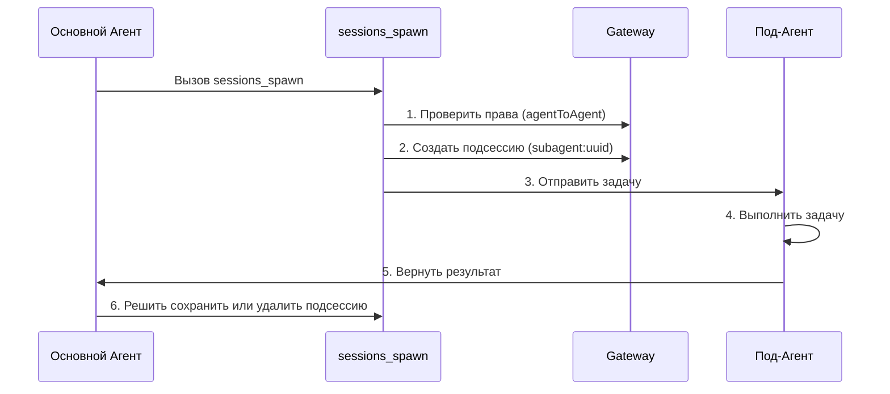

# Управление Сессиями и Мульти-Агенты: Изоляция Сессий, Сотрудничество Под-Агентов и Сжатие Контекста

## Что Вы Сможете Делать

- Понимать модель сессий и структуру ключей сессий Clawdbot
- Конфигурировать изоляцию сессий между разными агентами
- Использовать под-агентов для завершения изолированных задач
- Управлять окном контекста, чтобы избежать превышения лимитов модели
- Освоить лучшие практики сброса и сжатия сессий

## Ваша Текущая Ситуация

Когда ваш ИИ-ассистент обслуживает одновременно нескольких пользователей и несколько каналов, вы можете столкнуться с этими проблемами:

- **Перекрёстные помехи сессий**: Сообщения разных пользователей смешиваются, и ИИ не может запомнить их истории
- **Взрыв контекста**: После долгих бесед модель начинает "терять память" или ответы замедляются
- **Смешивание подзадач**: Когда основной агент вызывает подзадачи, нет чётких границ изоляции
- **Трата ресурсов**: Все агенты делят один и тот же набор сессий, что делает хранилище и вычислительные ресурсы неэффективными

**Система управления сессиями Clawdbot** создана для решения этих проблем.

## Основная Концепция

**Сессия** — это центральная абстрактная единица Clawdbot. Каждая сессия представляет собой независимую историю беседы с собственным журналом сообщений, метаданными и жизненным циклом.

Clawdbot использует **ключи сессий (session key)** для идентификации и изоляции разных сессий. Ключи сессий различают не только разных собеседников (пользователи, группы, каналы), но и разные экземпляры агентов.

::: info Что такое Ключ Сессии?

Ключ сессии — это строковый идентификатор, который уникально идентифицирует сессию. Примеры формата:
- `agent:main:main` (основная сессия основного агента)
- `agent:work:main` (основная сессия рабочего агента)
- `agent:main:whatsapp:group:123` (сессия группы WhatsApp)
- `cron:job-id` (сессия запланированной задачи)

Clawdbot направляет сообщения правильному агенту на основе ключа сессии и поддерживает независимые истории бесед.
:::

## Модель Сессии

### Состав Ключа Сессии

Clawdbot использует структурированные ключи сессий для идентификации разных типов сессий:

| Тип Сессии | Формат Ключа | Пример | Описание |
|--- | --- | --- | ---|
| **Основная Сессия** | `agent:<agentId>:<mainKey>` | `agent:main:main` | Основная сессия по умолчанию каждого агента |
| **Прямое Сообщение** | `agent:<agentId>:dm:<peerId>` | `agent:main:dm:+15551234567` | Изолировано в соответствии с конфигурацией `dmScope` |
| **Группа/Канал** | `agent:<agentId>:<channel>:group:<id>` | `agent:main:whatsapp:group:123` | Группы и каналы изолированы автоматически |
| **Под-Агент** | `agent:<agentId>:subagent:<uuid>` | `agent:main:subagent:a1b2c3d4` | Изолированная сессия под-агента |
| **Запланированная Задача** | `cron:<jobId>` | `cron:daily-report` | Специальная сессия для задач Cron |
| **Webhook** | `hook:<uuid>` | `hook:xyz789` | Сессия, активированная Webhook |

### Хранение Сессий

Данные сессии хранятся в двух местах:

```bash
# Индекс сессий (метаданные)
~/.clawdbot/agents/<agentId>/sessions/sessions.json

# История сообщений (один файл на сессию)
~/.clawdbot/agents/<agentId>/sessions/<sessionId>.jsonl
```

**sessions.json** — это таблица сопоставления, которая записывает:
- Ключ сессии → Метаданные сессии (sessionId, updatedAt, model, tokens и т.д.)
- Удаление этих записей безопасно; они будут воссозданы автоматически при необходимости

**Файлы JSONL** хранят полную историю беседы, с одной записью сообщения на строку.

::: tip Gateway — Единственный Источник Истины

Все состояния сессии принадлежат Gateway. Клиенты UI (приложение macOS, WebChat) должны запрашивать список сессий и количество токенов из Gateway, а не читать локальные файлы напрямую.

В удалённом режиме сессии, которые вас интересуют, хранятся на удалённом хосте Gateway, а не на вашем Mac.
:::

## Механизм Изоляции Сессий

### Режим Единственного Агента (По умолчанию)

Если не сделана никакая конфигурация, Clawdbot выполняет одного агента:
- `agentId` по умолчанию — `main`
- Все DM-сессии делят основной ключ сессии (`agent:main:main`)
- Это означает, что **сообщения одного пользователя с разных каналов попадут в одну и ту же сессию**

### Режим Мульти-Агентов

**Несколько агентов = несколько изолированных мозгов**

Каждый агент имеет свой собственный независимый набор:
- **Workspace** (файлы рабочей области, AGENTS.md, SOUL.md)
- **State directory** (конфигурация аутентификации, реестр моделей)
- **Session store** (история чата и состояние маршрутизации)

#### Зачем Несколько Агентов?

| Сценарий | Решение |
|--- | ---|
| **Несколько пользователей делят сервер** | У каждого пользователя есть независимый агент, сессии полностью изолированы |
| **Разные личности на разных каналах** | WhatsApp использует агента повседневности, Telegram использует агента глубокой работы |
| **Разделение прав** | Семейный агент с ограниченными инструментами, личный агент с полным доступом |
| **Разные среды** | Агент разработки, агент производства полностью изолированы |

#### Конфигурация Мульти-Агентов

**Шаг 1: Добавить Новый Агент**

```bash
clawdbot agents add work
```

Это создаст новый каталог агента в `~/.clawdbot/agents/work/`.

**Шаг 2: Настроить Правила Маршрутизации**

Добавьте `bindings` в `~/.clawdbot/clawdbot.json`:

```json5
{
  agents: {
    list: [
      { id: "home", workspace: "~/clawd-home", name: "Home" },
      { id: "work", workspace: "~/clawd-work", name: "Work" }
    ]
  },
  bindings: [
    { agentId: "home", match: { channel: "whatsapp", accountId: "personal" } },
    { agentId: "work", match: { channel: "whatsapp", accountId: "biz" } }
  ]
}
```

**Шаг 3: Проверить Конфигурацию**

```bash
clawdbot agents list --bindings
```

#### Правила Маршрутизации (Определённое Сопоставление)

Когда сообщение приходит, Clawdbot сопоставляет правила в порядке **наиболее конкретное сначала**:

1. Сопоставление **peer** (точный DM/group/channel id)
2. **guildId** (Discord)
3. **teamId** (Slack)
4. Сопоставление **accountId**
5. Сопоставление уровня канала (`accountId: "*"`)
6. Резервный агент по умолчанию

::: warning Обратите Внимание на Порядок Привязок

Порядок в списке привязок важен! Более конкретные правила должны идти первыми.

Например, если вы хотите направить конкретный DM агенту `work`, а другие WhatsApp-DM — агенту `home`, вы должны написать правило peer первым:
```json5
{
  bindings: [
    { agentId: "work", match: { channel: "whatsapp", peer: { kind: "dm", id: "+15551234567" } } },
    { agentId: "home", match: { channel: "whatsapp" } }
  ]
}
```
:::

### Контроль Области DM

Используйте `session.dmScope` для управления тем, как группируются прямые сообщения:

| Опция | Поведение | Сценарий Использования |
|--- | --- | ---|
| `main` (по умолчанию) | Все DM делят основную сессию | Один пользователь, несколько каналов |
| `per-peer` | Изолировано по ID отправителя | Мульти-пользовательская среда |
| `per-channel-peer` | Изолировано по каналу + отправитель | Общий почтовый ящик |

Пример конфигурации:

```json5
{
  session: {
    dmScope: "per-channel-peer"  // Каждый пользователь в каждом канале имеет независимую сессию
  }
}
```

### Ссылки Идентичности (Identity Links)

Если один и тот же пользователь использует несколько платформ (например, WhatsApp и Telegram), вы можете заставить их делиться сессиями, используя `session.identityLinks`:

```json5
{
  session: {
    identityLinks: {
      alice: ["telegram:123456789", "discord:987654321012345678"]
    }
  }
}
```

Таким образом, все сообщения, которые Alice отправит с Telegram или Discord, попадут в сессию `agent:<agentId>:dm:alice`.

## Сотрудничество Под-Агентов

### Что такое Под-Агент?

**Под-агент** — это экземпляр агента, который выполняется в изолированной сессии, используемый для выполнения определённых задач без влияния на контекст основной сессии.

Типичные сценарии использования:
- **Код-ревью**: Под-агент анализирует код и возвращает сводку
- **Извлечение данных**: Под-агент извлекает информацию из длинных документов
- **Параллельные задачи**: Пока основной агент ожидает, под-агент выполняется в фоне
- **Изоляция песочницы**: Выполнение недоверенных задач в ограниченной среде

### Инструмент sessions_spawn

Используйте инструмент `sessions_spawn` для создания под-агента:

```json
{
  "task": "Проанализируйте этот документ и извлеките основные моменты",
  "label": "Анализ Документа",
  "model": "anthropic/claude-opus-4-5",
  "thinking": "detailed",
  "runTimeoutSeconds": 300,
  "cleanup": "keep"
}
```

Описание параметров:

| Параметр | Тип | Обязательный | Описание |
|--- | --- | --- | ---|
| `task` | string | ✅ | Описание задачи под-агента |
| `label` | string | ❌ | Читаемая метка задачи (для отслеживания) |
| `agentId` | string | ❌ | ID целевого агента (по умолчанию текущий агент) |
| `model` | string | ❌ | Переопределение модели |
| `thinking` | string | ❌ | Уровень мышления (`minimal`/`standard`/`detailed`) |
| `runTimeoutSeconds` | number | ❌ | Тайм-аут (секунды) |
| `cleanup` | string | ❌ | Стратегия очистки после завершения задачи (`keep`/`delete`) |

### Жизненный Цикл Под-Агента



**Этапы Жизненного Цикла**:

1. **Проверка прав**: Если вызов между агентами, проверяется конфигурация `tools.agentToAgent.allow`
2. **Создание подсессии**: Генерируется уникальный ключ `agent:<agentId>:subagent:<uuid>`
3. **Выполнение задачи**: Под-агент завершает задачу в изолированной сессии
4. **Возврат результата**: Результат возвращается потоком основному агенту
5. **Стратегия очистки**:
   - `cleanup: "keep"`: Сохраняет подсессию для последующих проверок
   - `cleanup: "delete"`: Автоматически удаляет подсессию

### Конфигурация Коммуникации Между Агентами

По умолчанию коммуникация между агентами отключена. Она должна быть явно включена:

```json5
{
  tools: {
    agentToAgent: {
      enabled: true,
      allow: ["home", "work", "family"]
    }
  }
}
```

Описание прав:
- `enabled: false`: Полностью отключает коммуникацию между агентами
- `allow: ["*"]`: Позволяет любого агента
- `allow: ["home", "work"]`: Позволяет только определённых агентов

::: danger Напоминание о Безопасности

Под-агенты наследуют часть контекста родительского агента, но **не получают** полную историю родительской сессии. Это как функция (экономия токенов), так и ограничение (под-агенты не знают полный контекст).

Для чувствительных операций рассмотрите их завершение в основной сессии, а не через под-агентов.
:::

## Сжатие Контекста

### Что такое Окно Контекста?

У каждой модели ИИ есть **окно контекста (context window)**: максимальное количество токенов, которое она может видеть в одной итерации.

Долгие беседы накапливают сообщения и результаты инструментов. Как только приближается лимит модели, Clawdbot **скомпактует** историю для освобождения места.

### Автоматическое Сжатие

Когда сессия приближается или превышает окно контекста, Clawdbot автоматически запускает сжатие:

- **Перед сжатием**: Сначала выполняется **тихое обновление памяти**, предлагающее модели записать постоянные заметки на диск (если рабочая область доступна для записи)
- **Процесс сжатия**: Суммирует старые беседы в компактную сводку, сохраняя последние сообщения
- **Сохранение**: Результат сжатия записывается в файл истории JSONL
- **Повтор**: Повторяет исходный запрос, используя сжатый контекст

Вы увидите:
- `🧹 Auto-compaction complete` (в подробном режиме)
- `/status` показывает `🧹 Compactions: <count>`

### Ручное Сжатие

Используйте команду `/compact` для запуска сжатия вручную:

```
/compact
```

Вы можете добавить инструкции по сжатию:

```
/compact Focus on decisions and open questions
```

Это направит ИИ сосредоточиться на определённом содержимом при суммировании.

### Сжатие vs Обрезка

| Операция | Назначение | Сохранение | Место |
|--- | --- | --- | ---|
| **Сжатие** | Суммировать старые беседы | ✅ | Запись в JSONL |
| **Обрезка** | Удалить старые результаты инструментов | ❌ | Только в памяти |

::: tip Рекомендации по Стратегии Сжатия

- **Сжатие**: Сохраняет сводки информации, подходит для просмотра истории
- **Обрезка**: Временная очистка, подходит для уменьшения использования токенов в одном запросе
- **/new`: Полностью очищает сессию, для начала новой темы

Выберите подходящую стратегию в соответствии с вашими привычками использования.
:::

### Конфигурация Сжатия

Настройте поведение сжатия в `~/.clawdbot/clawdbot.json`:

```json5
{
  agents: {
    defaults: {
      compaction: {
        enabled: true,
        threshold: 0.9,  // Запускать, когда использование контекста 90%
        trigger: "auto"  // auto/manual
      }
    }
  }
}
```

## Следуйте за мной: Конфигурация Управления Сессиями

Давайте настроим управление сессиями через реальный сценарий.

### Сценарий

У вас есть номер WhatsApp, и вы хотите:
1. Личные контакты используют агент `home` (повседневная беседа)
2. Рабочие группы используют агент `work` (профессиональный ответ)
3. Включить под-агентов для изолированных задач

### Шаг 1: Добавить Двух Агентов

```bash
# Добавить домашний агент
clawdbot agents add home

# Добавить рабочий агент
clawdbot agents add work
```

**Вы должны увидеть**: Вам будет предложено ввести путь к рабочей области и другую информацию.

### Шаг 2: Редактировать Файл Конфигурации

Откройте `~/.clawdbot/clawdbot.json` и добавьте список агентов и правила привязки:

```json5
{
  agents: {
    list: [
      {
        id: "home",
        name: "Home",
        workspace: "~/clawd-home",
        model: "anthropic/claude-sonnet-4-5"
      },
      {
        id: "work",
        name: "Work",
        workspace: "~/clawd-work",
        model: "anthropic/claude-opus-4-5"
      }
    ]
  },
  bindings: [
    // Личные сообщения направляются агенту home
    { agentId: "home", match: { channel: "whatsapp", peer: { kind: "dm", id: "+15551230001" } } },
    // Рабочие группы направляются агенту work
    { agentId: "work", match: { channel: "whatsapp", peer: { kind: "group", id: "120363999999999999@g.us" } } },
    // Другие WhatsApp-сообщения направляются агенту home (по умолчанию)
    { agentId: "home", match: { channel: "whatsapp" } }
  ],
  tools: {
    agentToAgent: {
      enabled: true,
      allow: ["home", "work"]
    }
  }
}
```

### Шаг 3: Перезапустить Gateway

```bash
clawdbot gateway restart
```

**Вы должны увидеть**: Лог запуска Gateway, показывающий загруженных агентов и правила привязки.

### Шаг 4: Тестировать Вызов Под-Агента

Отправьте в сессии агента `home`:

```
Пожалуйста, используйте под-агента для анализа этого PDF-документа и извлечения основной информации: /path/to/file.pdf
```

Агент должен автоматически вызвать инструмент `sessions_spawn`, и вы увидите:
- Уведомление о создании под-агента
- Процесс выполнения задачи
- Возврат результата

### Шаг 5: Проверить Состояние Сессии

Отправьте в чате:

```
/status
```

**Вы должны увидеть**:
- Использование токенов текущей сессии
- Количество сжатий
- Информация о модели

## Контрольная Точка ✅

После завершения конфигурации проверьте следующие пункты:

- [ ] `clawdbot agents list --bindings` показывает правильные правила привязки
- [ ] Личные DM направляются агенту `home`
- [ ] Рабочие группы направляются агенту `work`
- [ ] Вызовы под-агентов работают корректно
- [ ] `/status` показывает правильную информацию о сессии

## Предупреждения о Проблемах

### Общие Ошибки

| Ошибка | Причина | Решение |
|--- | --- | ---|
| **Вызов между агентами запрещён** | `tools.agentToAgent.enabled` не включён или список `allow` не включает целевой агент | Проверьте конфигурацию, убедитесь, что она включена и список разрешённых добавлен |
| **Неудача создания под-агента** | При вызове между агентами целевой агент не находится в списке разрешённых | Проверьте конфигурацию `tools.agentToAgent.allow` |
| **Конфликт ключей сессии** | Неверный порядок правил привязки, более конкретные правила перезаписаны | Поместите правила peer перед правилами канала |
| **Неудача сжатия** | Контекст слишком мал или модель не поддерживает сжатие | Проверьте окно контекста модели и конфигурацию сжатия |

### Рекомендации по Конфигурации

- **Начните просто**: Сначала протестируйте с одним агентом, подтвердите, что функции работают нормально, прежде чем добавлять несколько агентов
- **Используйте метки**: Добавляйте чёткие `label` к задачам под-агентов для облегчения отслеживания
- **Мониторинг использования токенов**: Регулярно проверяйте `/status`, чтобы понять использование контекста
- **Резервное копирование конфигурации**: Сделайте резервную копию перед изменением `clawdbot.json`

## Итоги Урока

Этот урок представил систему управления сессиями Clawdbot:

- **Модель сессии**: Ключи сессий, места хранения, жизненный цикл
- **Изоляция сессий**: Режим мульти-агентов, контроль области DM, ссылки идентичности
- **Сотрудничество под-агентов**: Инструмент `sessions_spawn`, контроль прав, стратегия очистки
- **Сжатие контекста**: Автоматическое/ручное сжатие, сжатие vs обрезка

С надлежащей конфигурацией управления сессиями вы можете заставить Clawdbot обслуживать одновременно нескольких пользователей и сценариев, каждый с собственным изолированным контекстом и историей.

## Следующий Урок

> В следующем уроке мы изучим **[Инструменты Автоматизации Браузера](../tools-browser/)**.
>
> Вы узнаете:
> - Как настроить и использовать инструменты браузера
> - Ограничения безопасности автоматизации браузера
> - Скриншоты и операции с формами

---

## Приложение: Справочник по Исходному Коду

<details>
<summary><strong>Нажмите, чтобы развернуть и просмотреть места исходного кода</strong></summary>

> Последнее обновление: 2026-01-27

| Функциональность | Путь к Файлу | Номер Строки |
|--- | --- | ---|
| Анализ ключа сессии | [`src/routing/session-key.ts`](https://github.com/clawdbot/clawdbot/blob/main/src/routing/session-key.ts) | 1-100 |
| Схема конфигурации сессии | [`src/config/zod-schema.session.ts`](https://github.com/clawdbot/clawdbot/blob/main/src/config/zod-schema.session.ts) | 11-83 |
|--- | --- | ---|
| Вспомогательные функции инструментов сессии | [`src/agents/tools/sessions-helpers.ts`](https://github.com/clawdbot/clawdbot/blob/main/src/agents/tools/sessions-helpers.ts) | 1-328 |
| Документация управления сессиями | [`docs/concepts/session.md`](https://github.com/clawdbot/clawdbot/blob/main/docs/concepts/session.md) | 1-151 |
|--- | --- | ---|
| Документация сжатия контекста | [`docs/concepts/compaction.md`](https://github.com/clawdbot/clawdbot/blob/main/docs/concepts/compaction.md) | 1-50 |

**Ключевые Константы**:
- `SESSION_ID_RE = /^[0-9a-f]{8}-[0-9a-f]{4}-[0-9a-f]{4}-[0-9a-f]{4}-[0-9a-f]{12}$/i`: Регулярное выражение ID сессии (`sessions-helpers.ts:96`)

**Ключевые Типы**:
- `SessionKind = "main" | "group" | "cron" | "hook" | "node" | "other"`: Перечисление типов сессии (`sessions-helpers.ts:11`)
- `SessionListRow`: Структура строки списка сессий (`sessions-helpers.ts:19-41`)

**Ключевые Функции**:
- `createSessionsSpawnTool()`: Создать инструмент генерации под-агентов (`sessions-spawn-tool.ts:60-269`)
- `resolveSessionReference()`: Разрешить ссылку сессии (`sessions-helpers.ts:215-253`)
- `classifySessionKind()`: Классифицировать тип сессии (`sessions-helpers.ts:255-271`)
- `createAgentToAgentPolicy()`: Создать политику коммуникации между агентами (`sessions-helpers.ts:72-94`)

</details>
