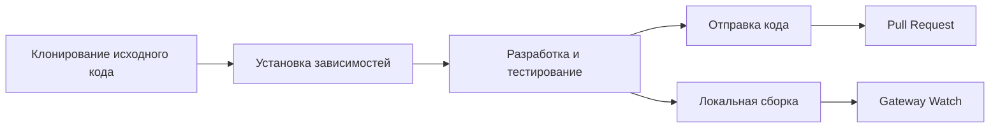

# Руководство по разработке: от сборки из исходного кода до внесения вклада

## Что вы сможете сделать после изучения

- Собрать и запустить Clawdbot из исходного кода
- Разработать пользовательские плагины (каналы, инструменты, RPC методы)
- Запустить модульные тесты и сквозные тесты
- Отправить Pull Request и внести вклад в код проекта
- Понять архитектуру проекта и систему плагинов

## Ваша текущая ситуация

Вы разработчик и хотите:
- Настроить или расширить функциональность Clawdbot
- Понять внутренние механизмы работы проекта
- Внести вклад в сообщество открытого исходного кода
- Но не знаете, с чего начать: сборка, тестирование, процесс отправки?

## Когда использовать этот подход

- Когда вам нужно изменить исходный код или добавить новые функции
- Когда вы хотите разработать пользовательские плагины или каналы
- Когда вам нужно отладить или исправить баги
- Когда вы хотите внести вклад в код проекта

## 🎒 Подготовка к началу

::: warning Предварительные условия
Этот учебник предполагает, что у вас есть следующие условия:
:::

- **Node.js ≥22** установлен (требование проекта)
- **pnpm** менеджер пакетов установлен (рекомендуется для сборки из исходного кода)
- Базовые знания операций **Git**
- Опыт разработки на **TypeScript**
- Навыки работы с **терминалом** командной строки

Рекомендуемая среда:
- macOS / Linux (основная платформа разработки)
- Windows через WSL2

## Основная концепция

### Обзор процесса разработки

Процесс разработки Clawdbot разделен на четыре основных этапа:



### Ключевые концепции

- **Система сборки**: Использует компиляцию TypeScript, директория `dist/` содержит вывод
- **Архитектура плагинов**: Модули TypeScript, загружаемые во время выполнения, поддерживают расширение функциональности
- **Демон Gateway**: Одиночный паттерн, плоскость управления и маршрутизация сообщений
- **Тестовый фреймворк**: Vitest для модульных тестов, Docker для сквозных тестов

### Ключевые моменты структуры проекта

| Директория | Назначение |
| --- | --- |
| `src/` | Весь исходный код (2475 файлов TypeScript) |
| `src/gateway/` | WebSocket сервер Gateway |
| `src/channels/` | Система плагинов каналов |
| `src/agents/` | Среда выполнения AI Agent |
| `src/plugin-sdk/` | SDK для разработки плагинов |
| `extensions/` | Встроенные плагины (например, voice-call) |
| `tests/` | Тестовые файлы |

## Следуйте инструкциям

### Шаг 1: Клонирование исходного кода и установка зависимостей

**Зачем**
Получение последнего исходного кода и установка всех зависимостей — это первый шаг разработки.

```bash
## Клонирование репозитория
git clone https://github.com/clawdbot/clawdbot.git
cd clawdbot

## Установка зависимостей (рекомендуется использовать pnpm)
pnpm install
```

**Вы должны увидеть**: Зависимости успешно установлены, нет сообщений об ошибках.

::: info Поддержка Bun
Если вы используете Bun, вы можете напрямую запускать TypeScript без сборки (используя `tsx`).
:::

### Шаг 2: Сборка проекта

**Зачем**
Компиляция TypeScript в JavaScript, генерация распространяемой директории `dist/`.

```bash
## Полная сборка
pnpm build
```

**Вы должны увидеть**:
```
src/cli/entry.ts → dist/cli/entry.js
src/gateway/server.ts → dist/gateway/server.js
...
Build completed in X seconds
```

::: tip Сборка UI
При первом запуске `pnpm ui:build` автоматически установит зависимости UI.
:::

### Шаг 3: Запуск режима разработки

**Зачем**
Режим разработки поддерживает автоматическую перезагрузку, не требуя ручной пересборки.

```bash
## Запуск режима разработки Gateway (автоматическая перезагрузка)
pnpm gateway:watch

## Или запуск режима разработки CLI
CLAWDBOT_PROFILE=dev pnpm clawdbot --dev
```

**Вы должны увидеть**:
- Gateway запущен и слушает `ws://127.0.0.1:18789`
- При изменении файлов автоматическая перекомпиляция и перезапуск

::: tip Пропуск загрузки каналов
При разработке можно использовать `CLAWDBOT_SKIP_CHANNELS=1` для пропуска инициализации каналов, ускоряя запуск.
:::

**Контрольная точка ✅**
- Gateway успешно запущен и слушает порт 18789
- После изменения файлов TypeScript автоматическая перекомпиляция

### Шаг 4: Запуск тестов

**Зачем**
Убедиться, что изменения кода не нарушили существующую функциональность.

#### Модульные тесты

```bash
## Запуск всех тестов
pnpm test

## Запуск тестов с отслеживанием изменений
pnpm test:watch

## Генерация отчета о покрытии
pnpm test:coverage
```

**Вы должны увидеть**: Процент прохождения тестов и статистику покрытия.

#### Сквозные тесты

```bash
## Запуск сквозных тестов Docker
pnpm test:docker:all

## Или запуск отдельного набора тестов
pnpm test:docker:live-models
```

**Вы должны увидеть**: Все тестовые контейнеры Docker успешно запущены и завершены.

::: warning Требования к тестам
Для сквозных тестов требуется установленный и запущенный Docker.
:::

**Контрольная точка ✅**
- Все модульные тесты пройдены
- Покрытие тестами соответствует требованиям (≥70%)
- Сквозные тесты пройдены

### Шаг 5: Проверка и форматирование кода

**Зачем**
Поддержание единообразия стиля кода и типобезопасности.

```bash
## Запуск linter
pnpm lint

## Форматирование кода
pnpm format:fix

## Запуск Swift linter (разработка macOS/iOS)
pnpm lint:swift
```

**Вы должны увидеть**: Нет ошибок lint, код отформатирован.

::: tip Автоматическое форматирование
В проекте настроены pre-commit git hooks, которые автоматически форматируют подготовленные файлы перед коммитом.
:::

### Шаг 6: Разработка плагинов (опционально)

**Зачем**
Расширение функциональности Clawdbot или интеграция внешних сервисов.

#### Быстрое создание плагина

1. Создание директории плагина:
```bash
mkdir extensions/my-plugin
cd extensions/my-plugin
```

2. Создание `clawdbot.plugin.json`:
```json
{
  "id": "my-plugin",
  "name": "My Plugin",
  "version": "1.0.0",
  "configSchema": {
    "type": "object",
    "properties": {
      "apiKey": { "type": "string" }
    }
  }
}
```

3. Создание точки входа плагина `index.ts`:
```typescript
export default function (api) {
  console.log("My plugin loaded!");
  
  // Регистрация инструмента
  api.registerTool({
    name: "my_tool",
    description: "My custom tool",
    execute: async (params) => {
      return { result: "Hello from my tool!" };
    }
  });
  
  // Регистрация RPC метода
  api.registerGatewayMethod("myplugin.status", ({ respond }) => {
    respond({ ok: true, status: "running" });
  });
}
```

4. Установка и тестирование:
```bash
## Режим разработки: связывание плагина
clawdbot plugins install -l extensions/my-plugin

## Перезапуск Gateway
pnpm gateway:watch
```

::: details Типы плагинов
Clawdbot поддерживает следующие типы плагинов:

- **Agent Tools**: Инструменты, вызываемые AI
- **Channel Plugins**: Новые каналы сообщений (WhatsApp, Telegram и др.)
- **Gateway RPC**: Конечные точки WebSocket
- **CLI Commands**: Инструменты командной строки
- **Background Services**: Фоновые задачи
- **Auto-reply Commands**: Быстрые команды без AI

Подробнее см. [Документацию по плагинам](https://github.com/moltbot/moltbot/blob/main/docs/plugin.md).
:::

**Контрольная точка ✅**
- Плагин успешно загружен
- Можно вызвать функциональность плагина через CLI или Gateway
- Конфигурация плагина работает нормально

### Шаг 7: Отправка кода и Pull Request

**Зачем**
Отправить ваш вклад в сообщество.

```bash
## Создание ветки функции
git checkout -b feature/my-feature

## Коммит изменений
git add .
git commit -m "feat: add my new feature"

## Отправка на GitHub
git push origin feature/my-feature
```

Затем создайте Pull Request на GitHub.

::: tip Спецификация PR
В описании PR укажите:
- **Что сделано**: Описание функции или исправления
- **Почему**: Какую проблему решает
- **Статус тестирования**: untested / lightly tested / fully tested
- **Помощь AI**: Использовались ли инструменты AI для помощи в разработке
:::

**Контрольная точка ✅**
- Код отправлен на GitHub
- Pull Request успешно создан
- Проверки CI/CD пройдены (если есть)

## Предупреждения о подводных камнях

### Распространенные ошибки

| Ошибка | Причина | Решение |
| --- | --- | --- |
| `Cannot find module 'xxx'` | Зависимости не установлены | Запустите `pnpm install` |
| `Port 18789 already in use` | Gateway уже запущен | Проверьте и закройте старый экземпляр |
| Ошибка компиляции TypeScript | Проблема с определением типов | Запустите `pnpm lint` для проверки |
| Таймаут теста | Docker не запущен или проблемы с сетью | Проверьте статус Docker |

### Лучшие практики разработки

- **Маленькие коммиты**: Каждый PR делает только одну вещь, удобно для проверки
- **Пишите тесты**: Новые функции должны иметь покрытие тестами
- **Следуйте стилю**: Используйте настроенные в проекте linter и formatter
- **Обновление документации**: При изменении кода синхронно обновляйте соответствующую документацию
- **Пометка AI**: При использовании AI для помощи в разработке, пожалуйста, отметьте это в PR

## Резюме урока

Этот учебник охватывает полный процесс разработки Clawdbot:

✅ **Сборка из исходного кода**: Использование `pnpm install` и `pnpm build`
✅ **Режим разработки**: Использование `pnpm gateway:watch` для реализации автоматической перезагрузки
✅ **Тестовый фреймворк**: Модульные тесты Vitest + сквозные тесты Docker
✅ **Разработка плагинов**: Расширяемая система плагинов на основе TypeScript
✅ **Процесс внесения вклада**: Рабочий процесс Git и спецификация Pull Request

Быстрая справка по ключевым командам:

| Задача | Команда |
| --- | --- |
| Установка зависимостей | `pnpm install` |
| Сборка | `pnpm build` |
| Режим разработки | `pnpm gateway:watch` |
| Модульные тесты | `pnpm test` |
| Проверка кода | `pnpm lint` |
| Форматирование | `pnpm format:fix` |

## Анонс следующего урока

Поздравляем с завершением изучения руководства по разработке! Теперь у вас есть:

- Способность собирать и запускать Clawdbot из исходного кода
- Основы разработки пользовательских плагинов
- Процесс запуска тестов и внесения вклада в код

Далее вы можете захотеть углубиться в:

- [Справочник по настройке](../config-reference/) - Полная документация по элементам настройки
- [Протокол Gateway API](../api-protocol/) - Спецификация протокола WebSocket
- [Варианты развертывания](../deployment/) - Способы развертывания Docker, Nix и др.

Продолжайте исследовать, пусть Clawdbot работает для вас!

---

## Приложение: Справочник по исходному коду

<details>
<summary><strong>Нажмите, чтобы развернуть расположение исходного кода</strong></summary>

> Обновлено: 2026-01-27

| Функция | Путь к файлу | Номера строк |
| --- | --- | --- |
| Скрипты сборки | [`package.json`](https://github.com/moltbot/moltbot/blob/main/package.json) | 77-44 |
| Установка из исходного кода | [`README.md`](https://github.com/moltbot/moltbot/blob/main/README.md) | 83-99 |
| Документация по плагинам | [`docs/plugin.md`](https://github.com/moltbot/moltbot/blob/main/docs/plugin.md) | 1-639 |
| Руководство по внесению вклада | [`CONTRIBUTING.md`](https://github.com/moltbot/moltbot/blob/main/CONTRIBUTING.md) | 1-53 |
| Документация по архитектуре | [`docs/concepts/architecture.md`](https://github.com/moltbot/moltbot/blob/main/docs/concepts/architecture.md) | 1-123 |

**Ключевые команды**:
- `pnpm build` - Полная сборка (package.json:85)
- `pnpm gateway:watch` - Автоматическая перезагрузка в режиме разработки (package.json:93)
- `pnpm test` - Запуск модульных тестов (package.json:118)
- `pnpm lint` - Проверка кода (package.json:110)

**Ключевые директории**:
- `src/` - Корневая директория исходного кода (2475 файлов TypeScript)
- `src/plugin-sdk/` - SDK для разработки плагинов
- `extensions/` - Встроенные плагины
- `tests/` - Тестовые файлы
- `dist/` - Директория вывода сборки

**Связанное с плагинами**:
- Формат манифеста плагина: `clawdbot.plugin.json` (plugin.md:8-10)
- API плагина: `api.registerTool()`, `api.registerGatewayMethod()` (plugin.md:591-600)
- Схема конфигурации плагина: JSON Schema + `uiHints` (plugin.md:36-48)

</details>
