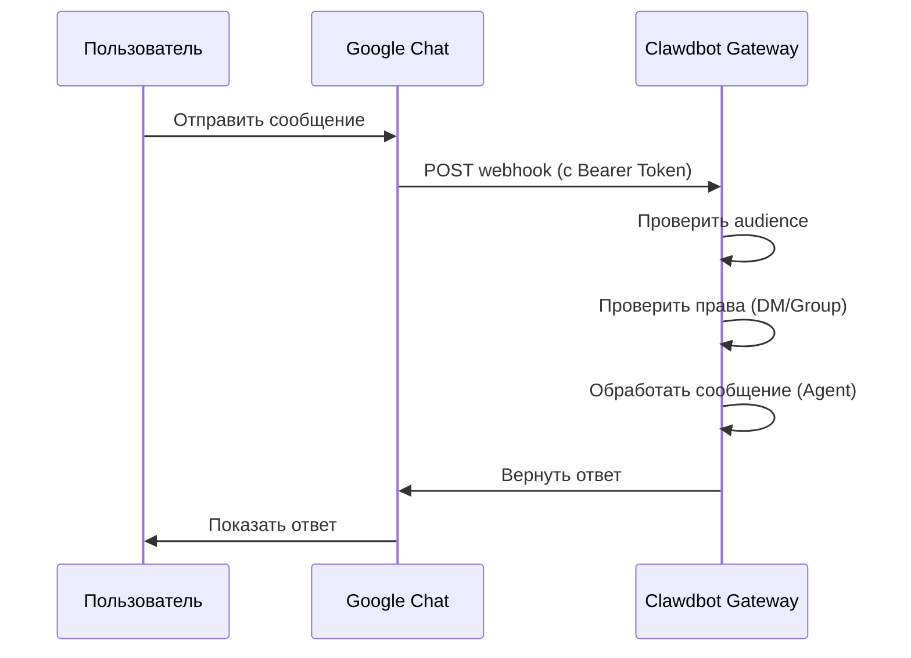

# Настройка канала Google Chat

## Чему вы научитесь

- Общаться с вашим AI-помощником в личном чате 1:1 в Google Chat
- Использовать @упоминание для вызова AI-помощника в пространствах Google Chat
- Освоить методы аутентификации Service Account и настройки Webhook
- Научиться безопасно раскрывать публичный URL с помощью Tailscale Funnel

## Ваша текущая проблема

Вы хотите использовать AI-помощника через Google Chat в вашей компании или команде, но не знаете, как:

- Создать и настроить проект Google Cloud
- Настроить аутентификацию Service Account
- Настроить Webhook для подключения Google Chat к вашему Gateway
- Безопасно раскрыть Gateway в публичную сеть

## Когда использовать этот метод

**Подходящие сценарии для использования канала Google Chat**:

- Ваша команда в основном использует Google Chat для общения
- Вам нужно использовать AI-помощника в среде Google Workspace
- Вы хотите работать в пространствах Google Chat Spaces
- Вам нужно принимать сообщения Google Chat через публичный Webhook

**Неподходящие сценарии**:

- Личное использование (рекомендуется WebChat, Telegram, WhatsApp)
- Требуется авторизация OAuth пользователей (Google Chat поддерживает только Service Account)

## Основная идея

Рабочий процесс канала Google Chat:



**Ключевые концепции**:

| Концепция | Описание |
|--- | ---|
| **Service Account** | Метод аутентификации Google Cloud для идентификации бота |
| **Webhook** | HTTP-эндпоинт, в который Google Chat отправляет POST-запросы к Gateway |
| **Audience** | Цель для проверки запросов webhook (app-url или project-number) |
| **DM-связывание** | Механизм безопасности по умолчанию, незнакомые отправители требуют одобрения |

::: tip
Канал Google Chat поддерживает только аутентификацию Service Account и не поддерживает авторизацию OAuth пользователей. Если требуются права на уровне пользователя, рассмотрите использование других каналов.
:::

## 🎒 Подготовка

Убедитесь, что вы уже:

- ✅ Выполните [Быстрое начало](../../start/getting-started/) и установите Clawdbot
- ✅ Gateway запущен (`clawdbot gateway --port 18789`)
- ✅ Имеете доступ к аккаунту Google Cloud
- ✅ Понимаете базовые команды терминала

::: warning
Webhook Google Chat требует публичный HTTPS-эндпоинт. В этом учебном пособии будет рассказано, как безопасно раскрыть сервис с помощью Tailscale Funnel или обратного прокси.
:::

## Следуйте инструкциям

### Шаг 1: Создание проекта Google Cloud и включение Chat API

**Зачем**
Сначала нужен проект Google Cloud для размещения Chat-приложения и Service Account.

1. Перейдите на [Google Chat API Credentials](https://console.cloud.google.com/apis/api/chat.googleapis.com/credentials)
2. Если API не включен, нажмите **Enable API**

**Что вы должны увидеть**:
- Chat API включен и отображается как "API enabled"
- Страница управления Credentials

### Шаг 2: Создание Service Account

**Зачем**
Service Account — это идентификатор бота, используемый для аутентификации запросов webhook.

1. На странице Credentials нажмите **Create Credentials** > **Service Account**
2. Введите имя (например, `clawdbot-chat`)
3. Нажмите **Continue** (пропустите настройку прав)
4. Оставьте управление доступом пустым, нажмите **Done**

**Что вы должны увидеть**:
- В списке появится новый Service Account

### Шаг 3: Создание и загрузка JSON-ключа

**Зачем**
JSON-ключ содержит учетные данные для аутентификации. Clawdbot нужен для проверки запросов Google Chat.

1. Нажмите на созданный Service Account
2. Перейдите на вкладку **Keys**
3. Нажмите **Add Key** > **Create new key**
4. Выберите формат **JSON**, нажмите **Create**
5. Загруженный JSON-файл сохранится автоматически

**Что вы должны увидеть**:
- Браузер загрузит `.json` файл

::: warning
⚠️ Важно: этот JSON-ключ загружается только один раз, храните его в безопасном месте! Если потерян, его нужно будет создать заново.
:::

### Шаг 4: Хранение файла Service Account

**Зачем**
Clawdbot должен прочитать файл ключа для проверки запросов Google Chat.

1. Переместите загруженный JSON-файл в безопасное место:
   ```bash
   mv ~/Downloads/*.json ~/.clawdbot/googlechat-service-account.json
   ```
2. Установите права доступа к файлу (опционально, но рекомендуется):
   ```bash
   chmod 600 ~/.clawdbot/googlechat-service-account.json
   ```

**Что вы должны увидеть**:
- Файл сохранен в каталоге `~/.clawdbot/`
- Права доступа установлены только для владельца на чтение и запись

### Шаг 5: Создание приложения Google Chat

**Зачем**
Chat App определяет внешний вид, поведение и URL-адрес вебхука бота.

1. Перейдите на [Google Cloud Console Chat Configuration](https://console.cloud.google.com/apis/api/chat.googleapis.com/hangouts-chat)
2. Заполните **Application info**:
   - **App name**: `Clawdbot` (или другое имя)
   - **Avatar URL**: `https://clawd.bot/logo.png` (опционально)
   - **Description**: `Personal AI Assistant` (опционально)
3. Включите **Interactive features**
4. В разделе **Functionality** установите флажок **Join spaces and group conversations**
5. В разделе **Connection settings** выберите **HTTP endpoint URL**
6. В разделе **Visibility** выберите **Make this Chat app available to specific people and groups in &lt;Your Domain&gt;**
7. Введите ваш почтовый адрес Google Workspace (например, `user@example.com`)
8. Нажмите **Save** внизу страницы

**Что вы должны увидеть**:
- Конфигурация приложения сохранена
- Страница отображает раздел "App status"

### Шаг 6: Настройка триггеров Webhook

**Зачем**
Триггеры определяют, когда Google Chat отправляет сообщения в Gateway.

1. Обновите страницу после сохранения
2. Найдите раздел **App status** (обычно вверху или внизу)
3. Измените статус на **Live - available to users**
4. Снова нажмите **Save**

**Что вы должны увидеть**:
- App status отображается как "Live - available to users"

::: info
💡 Подсказка: URL-адрес вебхука будет настроен на шаге 7. Если не уверены, можно использовать заполнитель `https://example.com/googlechat` и обновить позже.
:::

### Шаг 7: Получение публичного URL Gateway

**Зачем**
Google Chat нужен публичный HTTPS URL для отправки запросов webhook.

Запустите следующую команду для просмотра публичного URL Gateway:

```bash
clawdbot status
```

**Что вы должны увидеть**:
- В выводе содержится публичный URL (например, `https://your-node.tailnet.ts.net`)

::: warning
Если Gateway не настроен с Tailscale или обратным прокси, вам нужно сначала настроить публичный доступ (см. следующий шаг).
:::

### Шаг 8: Раскрытие эндпоинта Webhook (выберите один)

::: tip
Рекомендуется использовать Tailscale Funnel, он позволяет раскрыть только путь `/googlechat`, сохраняя другие эндпоинты приватными.
:::

#### Вариант A: Tailscale Funnel (рекомендуется)

**Почему Tailscale Funnel**
- Раскрывает только конкретный путь, повышая безопасность
- Внутренний Gateway остается приватным, доступен только Webhook
- Не требует покупки домена и настройки SSL

1. **Проверьте адрес привязки Gateway**:
   ```bash
   ss -tlnp | grep 18789
   ```
   Запишите IP-адрес (например, `127.0.0.1`, `0.0.0.0` или IP Tailscale, такой как `100.x.x.x`)

2. **Раскрыть панель управления только в tailnet** (порт 8443):
   ```bash
   # Если привязан к localhost (127.0.0.1 или 0.0.0.0):
   tailscale serve --bg --https 8443 http://127.0.0.1:18789
   
   # Если привязан к IP Tailscale (например, 100.106.161.80):
   tailscale serve --bg --https 8443 http://100.106.161.80:18789
   ```

3. **Раскрыть путь Webhook**:
   ```bash
   # Если привязан к localhost (127.0.0.1 или 0.0.0.0):
   tailscale funnel --bg --set-path /googlechat http://127.0.0.1:18789/googlechat
   
   # Если привязан к IP Tailscale (например, 100.106.161.80):
   tailscale funnel --bg --set-path /googlechat http://100.106.161.80:18789/googlechat
   ```

4. **Авторизовать узел для доступа к Funnel** (если будет предложено):
   - Перейдите по URL авторизации, отображаемому в выводе
   - Включите Funnel для этого узла в панели управления Tailscale

5. **Проверка конфигурации**:
   ```bash
   tailscale serve status
   tailscale funnel status
   ```

**Что вы должны увидеть**:
- Serve и Funnel работают
- Публичный URL Webhook: `https://<node-name>.<tailnet>.ts.net/googlechat`
- Приватная панель управления: `https://<node-name>.<tailnet>.ts.net:8443/`

#### Вариант B: Caddy обратный прокси

**Почему Caddy**
- Поддержка автоматического HTTPS
- Гибкая конфигурация маршрутизации путей

1. Создайте Caddyfile:
   ```txt
   your-domain.com {
       reverse_proxy /googlechat* localhost:18789
   }
   ```

2. Запустите Caddy:
   ```bash
   caddy run --config Caddyfile
   ```

**Что вы должны увидеть**:
- Caddy запущен и слушает порт 443
- Только путь `your-domain.com/googlechat` маршрутизируется к Gateway

#### Вариант C: Cloudflare Tunnel

**Почему Cloudflare Tunnel**
- Бесплатный глобальный CDN
- Простая настройка правил путей

1. Настройте правила входа в туннель:
   - **Path**: `/googlechat` -> `http://localhost:18789/googlechat`
   - **Default Rule**: HTTP 404 (Not Found)

### Шаг 9: Обновление URL Webhook Google Chat

**Зачем**
Теперь у вас есть публичный URL, обновите конфигурацию Chat App для указания на правильный эндпоинт.

1. Вернитесь на страницу Google Cloud Console Chat Configuration
2. В разделе **Triggers**:
   - Выберите **Use a common HTTP endpoint URL for all triggers**
   - Установите: `<ваш публичный URL>/googlechat`
   - Например: `https://your-node.tailnet.ts.net/googlechat`
3. Нажмите **Save**

**Что вы должны увидеть**:
- Триггеры обновлены и сохранены

### Шаг 10: Настройка Clawdbot

**Зачем**
Сообщить Clawdbot, какой Service Account и путь Webhook использовать.

**Способ A: Переменные окружения**

```bash
export GOOGLE_CHAT_SERVICE_ACCOUNT_FILE="/path/to/service-account.json"
clawdbot gateway restart
```

**Способ B: Файл конфигурации**

Отредактируйте `~/.clawdbot/clawdbot.json`:

```json5
{
  channels: {
    googlechat: {
      enabled: true,
      serviceAccountFile: "/Users/yourname/.clawdbot/googlechat-service-account.json",
      audienceType: "app-url",
      audience: "https://your-node.tailnet.ts.net/googlechat",
      webhookPath: "/googlechat",
      dm: {
        policy: "pairing",
        allowFrom: ["users/1234567890", "your-email@example.com"]
      },
      groupPolicy: "allowlist",
      groups: {
        "spaces/AAAA": {
          allow: true,
          requireMention: true,
          users: ["users/1234567890"],
          systemPrompt: "Short answers only."
        }
      }
    }
  }
}
```

**Перезапуск Gateway**:

```bash
clawdbot gateway restart
```

**Что вы должны увидеть**:
- Gateway запущен и отображает "Google Chat default: enabled, configured, ..."
- Нет ошибок в журнале

### Шаг 11: Добавление бота в Google Chat

**Зачем**
Последний шаг — найти и добавить бота в Google Chat.

1. Перейдите на [Google Chat](https://chat.google.com/)
2. Нажмите на иконку **+** (плюс) рядом с **Direct Messages**
3. Введите **App name** (имя, настроенное на шаге 5) в поле поиска (обычно там, где добавляются контакты)
   - **Обратите внимание**: бот не будет отображаться в списке браузера "Marketplace", так как это приватное приложение. Необходимо искать по имени.
4. Выберите вашего бота из результатов
5. Нажмите **Add** или **Chat**, чтобы начать чат 1:1

**Что вы должны увидеть**:
- Бот появляется в списке контактов
- Открывается окно чата

### Шаг 12: Отправка тестового сообщения

**Зачем**
Проверить правильность конфигурации и нормальную передачу сообщений.

Введите в окне чата:

```
Hello
```

**Что вы должны увидеть**:
- Бот отвечает приветствием или подтверждающим сообщением
- Журнал Gateway показывает полученные и обработанные сообщения

## Контрольная точка ✅

Проверка успешности конфигурации:

```bash
# Проверить статус канала
clawdbot channels status

# Должно отображаться:
# Google Chat default: enabled, configured, webhook listening
```

::: info
Если вы видите ошибку, запустите `clawdbot channels status --probe` для получения подробной диагностической информации.
:::

## Подробная конфигурация

### Аутентификация Service Account

| Параметр | Тип | По умолчанию | Описание |
|--- | --- | --- | ---|
| `serviceAccountFile` | string | - | Путь к файлу JSON Service Account |
| `serviceAccount` | string\|object | - | Встроенные учетные данные JSON (альтернатива пути к файлу) |
| `audienceType` | "app-url"\|"project-number" | "app-url" | Тип проверки: URL или номер проекта |
| `audience` | string | - | Значение audience (URL или номер проекта) |

### Политика DM

По умолчанию незнакомые отправители требуют связывания:

| Параметр | Тип | По умолчанию | Описание |
|--- | --- | --- | ---|
| `dm.enabled` | boolean | Не определено | Включен ли прием DM |
| `dm.policy` | "pairing"|"open" | "pairing" | Политика доступа: связывание или открытый доступ |
| `dm.allowFrom` | array | [] | Список разрешенных отправителей (user IDs или emails) |

**Связывание новых отправителей**:

```bash
clawdbot pairing approve googlechat <код-связывания>
```

### Политика групп

| Параметр | Тип | По умолчанию | Описание |
|--- | --- | --- | ---|
| `groupPolicy` | "allowlist"|"disabled" | "allowlist" | Политика групп: разрешающий список или отключено |
| `requireMention` | boolean | true | Требовать @упоминание для запуска |
| `groups` | object | {} | Конфигурация по ID пространства |

**Разрешение определенных групп**:

```json5
{
  channels: {
    googlechat: {
      groups: {
        "spaces/AAAA": {
          allow: true,
          requireMention: true,
          users: ["users/1234567890"],
          systemPrompt: "Short answers only."
        }
      }
    }
  }
}
```

### Другие конфигурации

| Параметр | Тип | По умолчанию | Описание |
|--- | --- | --- | ---|
| `webhookPath` | string | "/googlechat" | Путь Webhook |
| `botUser` | string | - | Имя ресурса пользователя бота (для обнаружения упоминаний) |
| `typingIndicator` | "none"|"message"|"reaction" | "message" | Режим индикатора набора текста |
| `actions.reactions` | boolean | false | Поддерживать реакции эмодзи |
| `mediaMaxMb` | number | Не определено | Максимальный размер медиа-файла (МБ) |

## Предупреждения о проблемах

### 405 Method Not Allowed

**Симптом**: Google Cloud Logs Explorer отображает `405 Method Not Allowed`

**Причина**: Обработчик Webhook не зарегистрирован

**Решение**:

1. Убедитесь, что в конфигурации есть раздел `channels.googlechat`:
   ```bash
   clawdbot config get channels.googlechat
   ```

2. Проверьте статус плагинов:
   ```bash
   clawdbot plugins list | grep googlechat
   ```

3. Если отображается "disabled", добавьте конфигурацию:
   ```json5
   {
     plugins: {
       entries: {
         googlechat: {
           enabled: true
         }
       }
     }
   }
   ```

4. Перезапустите Gateway:
   ```bash
   clawdbot gateway restart
   ```

### Сообщения не приходят

**Симптом**: Нет ответа после отправки сообщения

**Шаги диагностики**:

1. Запустите `clawdbot logs --follow` и отправьте тестовое сообщение
2. Убедитесь, что URL-адрес Webhook Chat App и подписка на события настроены
3. Проверьте правильность конфигурации `audience`
4. Если gating упоминаний блокирует ответ, установите `botUser` и проверьте `requireMention`

### Tailscale Funnel не запускается

**Симптом**: `tailscale funnel` выдает ошибку

**Причина**: Не настроена аутентификация по паролю

**Решение**:

Добавьте в `~/.clawdbot/clawdbot.json`:

```json5
{
  gateway: {
    auth: {
      mode: "password"
    }
  }
}
```

## Итог урока

- Создали проект Google Cloud и Service Account
- Настроили Chat App и Webhook Google Chat
- Раскрыли эндпоинт через Tailscale Funnel или обратный прокси
- Настроили Clawdbot для использования аутентификации Service Account
- Изучили механизм связывания DM и @упоминаний в группах
- Протестировали сообщения 1:1 и в группах

## Предпросмотр следующего урока

> В следующем уроке мы изучим **[Канал Signal](../signal/)**.
>
> Вы узнаете:
> - Как установить и настроить signal-cli
> - Права и контроль доступа для канала Signal
> - Различия в настройке с Google Chat

---

## Приложение: Ссылка на исходный код

<details>
<summary><strong>Нажмите, чтобы просмотреть местоположение исходного кода</strong></summary>

> Время обновления: 2026-01-27

| Функция | Путь к файлу | Номер строки |
|--- | --- | ---|
| Определение типа конфигурации Google Chat | [`src/config/types.googlechat.ts`](https://github.com/clawdbot/clawdbot/blob/main/src/config/types.googlechat.ts) | 1-109 |
| Схема Zod Google Chat | [`src/config/zod-schema.providers-core.ts`](https://github.com/clawdbot/clawdbot/blob/main/src/config/zod-schema.providers-core.ts) | 273-341 |
| Реестр каналов | [`src/channels/registry.ts`](https://github.com/clawdbot/clawdbot/blob/main/src/channels/registry.ts) | 61-67 |
| Парсинг групповых упоминаний | [`src/channels/plugins/group-mentions.ts`](https://github.com/clawdbot/clawdbot/blob/main/src/channels/plugins/group-mentions.ts) | 158-175 |
| Документация Google Chat | [`docs/channels/googlechat.md`](https://github.com/clawdbot/clawdbot/blob/main/docs/channels/googlechat.md) | 1-221 |

**Ключевые типы**:
- `GoogleChatConfig`: Полный интерфейс конфигурации Google Chat
- `GoogleChatDmConfig`: Конфигурация политики доступа DM
- `GoogleChatGroupConfig`: Конфигурация группового пространства
- `GoogleChatActionConfig`: Конфигурация действий (например, реакции эмодзи)

**Ключевые поля конфигурации**:
- `audienceType`: "app-url" или "project-number", для проверки запросов webhook
- `audience`: URL Webhook или номер проекта, используется в паре с `audienceType`
- `dm.policy`: По умолчанию "pairing", управляет доступом незнакомых DM
- `groupPolicy`: Политика доступа групп, "allowlist" или "disabled"

**Механизм аутентификации**:
- Используются учетные данные JSON Google Service Account
- Запросы Webhook проверяются через заголовок `Authorization: Bearer <token>`
- Token сравнивается с настройкой `audience` для обеспечения источника запроса

</details>
