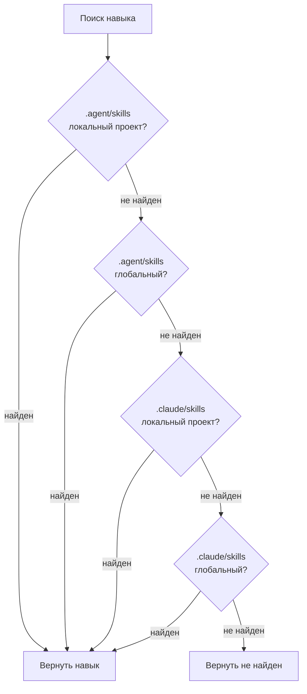

# Режим Universal: Мультиягентная среда

## Чему вы научитесь

- Понимать основную ценность и назначение режима Universal
- Освоить использование флага `--universal`
- Понимать различие между `.agent/skills` и `.claude/skills`
- Понимать правила 4-уровневой системы приоритетов поиска
- Единоуправлять навыками в мультиягентной среде, избегая конфликтов
- Совместно использовать один набор навыков для нескольких агентов: Claude Code, Cursor, Windsurf, Aider и других

::: info Предварительные знания

В этом руководстве предполагается, что вы уже изучили [глобальная vs локальная установка](../../platforms/global-vs-project/) и [синхронизация навыков в AGENTS.md](../../start/sync-to-agents/), понимаете базовые места установки и процесс синхронизации.

:::

---

## Текущие трудности

Возможно, вы уже научились устанавливать и синхронизировать навыки, но:

- **Как несколько агентов совместно используют навыки?**: Одновременное использование Claude Code и Cursor, но каждый устанавливает навыки отдельно, что приводит к хаосу в управлении
- **Конфликты с Claude Code Marketplace**: После установки навыков возникает конфликт с нативным рынком плагинов Claude Code
- **Нестандартное расположение AGENTS.md**: Разные агенты требуют разные пути к AGENTS.md, что затрудняет поддержку
- **Повторная установка навыков**: Каждый агент должен устанавливать свой набор навыков, что приводит к бесполезной трате дискового пространства

На самом деле, OpenSkills предоставляет режим Universal, специально разработанный для решения проблем управления навыками в мультиягентной среде.

---

## Когда использовать этот подход

**Сценарии применения режима Universal**:

| Сценарий | Требуется ли режим Universal | Пример |
|----------|---------------------------|--------|
| **Единый агент** (только Claude Code) | ❌ Нет | Используете только Claude Code, используйте `.claude/skills` по умолчанию |
| **Мультиагент** (Claude Code + другие) | ✅ Да | Одновременно используете Claude Code и Cursor/Windsurf/Aider |
| **Избежание конфликта Marketplace** | ✅ Да | Не хотите конфликтовать с нативным рынком плагинов Claude Code |
| **Единое управление AGENTS.md** | ✅ Да | Несколько агентов совместно используют один файл AGENTS.md |

::: tip Рекомендуемая практика

- **Единый агент использует режим по умолчанию**: При использовании только Claude Code используйте `.claude/skills` по умолчанию
- **Мультиагент использует режим Universal**: При использовании нескольких агентов используйте `--universal` для установки в `.agent/skills`
- **Единообразие в командной работе**: Внутри команды договоритесь о использовании конкретного режима, чтобы избежать путаницы

:::

---

## Основная концепция: Единая директория, совместное использование мультиагентами

OpenSkills предоставляет два режима директорий навыков:

**Режим по умолчанию (`.claude/skills`)**:
- Специально разработан для Claude Code
- Совместим с Claude Code Marketplace
- Место установки: `./.claude/skills/` или `~/.claude/skills/`

**Режим Universal (`.agent/skills`)**:
- Специально разработан для мультиягентной среды
- Избегает конфликтов с Claude Code Marketplace
- Место установки: `./.agent/skills/` или `~/.agent/skills/`

::: info Важная концепция

**Режим Universal**: Используйте флаг `--universal` для установки навыков в директорию `.agent/skills/`, позволяя нескольким AI-агентам программирования (Claude Code, Cursor, Windsurf, Aider и др.) совместно использовать один набор навыков, единоуправляемый через AGENTS.md.

:::

**4-уровневая система приоритетов поиска** (исходный код `dirs.ts:18-24`):

```typescript
export function getSearchDirs(): string[] {
  return [
    join(process.cwd(), '.agent/skills'),   // 1. Проектный universal (высший приоритет)
    join(homedir(), '.agent/skills'),        // 2. Глобальный universal
    join(process.cwd(), '.claude/skills'),  // 3. Проектный claude
    join(homedir(), '.claude/skills'),       // 4. Глобальный claude
  ];
}
```

**Объяснение приоритетов**:
1. **Project Universal** (высший): `.agent/skills/` имеет приоритет над `.claude/skills/`
2. **Global Universal**: затем ищется глобальный `.agent/skills/`
3. **Project Claude**: затем ищется локальный `.claude/skills/`
4. **Global Claude** (низший): наконец ищется глобальный `.claude/skills/`

---

## Следуйте за мной

### Шаг 1: Использование режима Universal для установки навыков

**Почему**
Сначала научитесь использовать флаг `--universal` для установки навыков.

Откройте терминал и выполните в любом проекте:

```bash
# Использование режима Universal для установки навыков
npx openskills install anthropics/skills --universal -y

# Просмотр списка навыков
npx openskills list
```

**Вы должны увидеть**: в списке навыков каждый навык имеет метку `(project)`

```
  codebase-reviewer         (project)
    Review code changes for issues...

Summary: 3 project, 0 global (3 total)
```

**Объяснение**:
- После использования флага `--universal` навыки устанавливаются в директорию `./.agent/skills/`
- Команда `list` по-прежнему отображает метки `(project)` или `(global)`
- `.agent/skills/` и `.claude/skills/` по умолчанию не конфликтуют

---

### Шаг 2: Просмотр места установки навыков

**Почему**
Подтвердите фактическое место хранения файлов навыков, поймите структуру директории режима Universal.

Выполните в корневом каталоге проекта:

```bash
# Просмотр директории навыков в режиме Universal
ls -la .agent/skills/

# Просмотр содержимого директории навыков
ls -la .agent/skills/codebase-reviewer/
```

**Вы должны увидеть**:

```
.agent/skills/
├── codebase-reviewer/
│   ├── SKILL.md
│   └── .openskills.json    # метаданные установки
├── file-writer/
│   ├── SKILL.md
│   └── .openskills.json
└── ...
```

**Объяснение**:
- Навыки в режиме Universal устанавливаются в директорию `.agent/skills/`
- Каждый навык имеет свою директорию и метаданные
- Это полностью аналогично структуре `.claude/skills/` по умолчанию

---

### Шаг 3: Сравнение структуры директорий двух режимов

**Почему**
Через реальное сравнение поймите разницу между `.claude/skills` и `.agent/skills`.

Выполните следующие команды:

```bash
# Просмотр директорий навыков двух режимов
echo "=== .claude/skills (режим по умолчанию) ==="
ls -la .claude/skills/ 2>/dev/null || echo "Директория не существует"

echo "=== .agent/skills (режим Universal) ==="
ls -la .agent/skills/

# Просмотр глобально установленных директорий
echo "=== ~/.claude/skills (глобальный по умолчанию) ==="
ls -la ~/.claude/skills/ 2>/dev/null || echo "Директория не существует"

echo "=== ~/.agent/skills (глобальный Universal) ==="
ls -la ~/.agent/skills/ 2>/dev/null || echo "Директория не существует"
```

**Вы должны увидеть**:

```
=== .claude/skills (режим по умолчанию) ===
Директория не существует

=== .agent/skills (режим Universal) ===
codebase-reviewer
file-writer

=== ~/.claude/skills (глобальный по умолчанию) ===
git-helper
test-generator

=== ~/.agent/skills (глобальный Universal) ===
Директория не существует
```

**Объяснение**:
- `.claude/skills/` и `.agent/skills/` — две независимые директории
- Могут существовать одновременно, не влияя друг на друга
- Поддерживается как локальная установка в проект, так и глобальная установка

---

### Шаг 4: Глобальная установка Universal

**Почему**
Узнайте, как глобально устанавливать навыки Universal, обслуживая все проекты.

Выполните:

```bash
# Глобальная установка навыков Universal
npx openskills install anthropics/skills --universal --global -y

# Просмотр списка навыков
npx openskills list
```

**Вы должны увидеть**:

```
  codebase-reviewer         (project)
    Review code changes for issues...
  file-writer              (global)
    Write files with format...

Summary: 1 project, 2 global (3 total)
```

**Объяснение**:
- `--universal` и `--global` могут использоваться вместе
- Устанавливается в директорию `~/.agent/skills/`
- Все проекты могут использовать эти навыки

---

### Шаг 5: Проверка 4-уровневой системы приоритетов поиска

**Почему**
Поймите, как OpenSkills ищет навыки в 4 директориях.

Выполните:

```bash
# Установка навыков с одинаковым именем в 4 разных местах (разные версии)
# 1. Project Universal
npx openskills install anthropics/skills --universal -y
# 2. Global Universal
npx openskills install anthropics/skills --universal --global -y
# 3. Project Claude
npx openskills install anthropics/skills -y
# 4. Global Claude
npx openskills install anthropics/skills --global -y

# Чтение навыка (будет использовать версию Project Universal)
npx openskills read codebase-reviewer | head -5
```

**Вы должны увидеть**: Вывод содержимого навыка из `.agent/skills/` (Project Universal).

**Визуализация приоритетов поиска**:



**Объяснение**:
- `.agent/skills/` имеет более высокий приоритет, чем `.claude/skills/`
- Локальный проект имеет приоритет над глобальным
- Когда существуют навыки с одинаковыми именами, приоритет отдается версии Project Universal
- Это позволяет реализовать гибкую конфигурацию с приоритетом "Universal"

---

### Шаг 6: Избежание конфликтов с Claude Code Marketplace

**Почему**
Узнайте, как режим Universal решает конфликты с Claude Code Marketplace.

Выполните:

```bash
# Использование режима Universal для установки навыков
npx openskills install anthropics/skills --universal -y

# Синхронизация в AGENTS.md
npx openskills sync

# Просмотр AGENTS.md
cat AGENTS.md
```

**Вы должны увидеть**: AGENTS.md содержит список навыков, не конфликтует с Claude Code Marketplace.

**Объяснение**:
- Режим Universal использует `.agent/skills/`, отдельно от `.claude/skills/` Claude Code
- Избегает конфликтов между навыками OpenSkills и плагинами Claude Code Marketplace
- Несколько агентов могут совместно использовать один AGENTS.md, единоуправляемый

---

## Контрольная точка ✅

Выполните следующие проверки, чтобы убедиться, что вы усвоили материал урока:

- [ ] Можете различать два режима `.claude/skills` и `.agent/skills`
- [ ] Знаете функцию флага `--universal`
- [ ] Понимаете правила 4-уровневой системы приоритетов поиска
- [ ] Можете выбрать подходящий режим установки в зависимости от сценария
- [ ] Знаете, как единоуправлять навыками в мультиягентной среде
- [ ] Понимаете, как режим Universal избегает конфликтов с Marketplace

---

## Предупреждения о подводных камнях

### Распространенная ошибка 1: Неправильное использование режима Universal в едином агенте

**Сценарий ошибки**: Используется только Claude Code, но используется режим Universal

```bash
# ❌ Ошибка: единому агенту не нужен режим Universal
npx openskills install anthropics/skills --universal
```

**Проблема**:
- Увеличивает ненужную сложность
- Не может совместно работать с плагинами Claude Code Marketplace
- Расположение AGENTS.md может не соответствовать ожиданиям Claude Code

**Правильный подход**:

```bash
# ✅ Правильно: единый агент использует режим по умолчанию
npx openskills install anthropics/skills
```

---

### Распространенная ошибка 2: Мультиагент без использования режима Universal

**Сценарий ошибки**: Одновременно используется несколько агентов, но не используется режим Universal

```bash
# ❌ Ошибка: каждый агент устанавливает навыки независимо, хаос в управлении
npx openskills install anthropics/skills  # для Claude Code
npx openskills install anthropics/skills --global  # для Cursor
```

**Проблема**:
- Навыки устанавливаются повторно, бесполезная трата дискового пространства
- Версии навыков, используемые разными агентами, могут отличаться
- AGENTS.md нужно поддерживать отдельно

**Правильный подход**:

```bash
# ✅ Правильно: мультиагент использует режим Universal для единого управления
npx openskills install anthropics/skills --universal
# Все агенты совместно используют один набор навыков и AGENTS.md
```

---

### Распространенная ошибка 3: Забывание приоритета поиска режима Universal

**Сценарий ошибки**: Установлены навыки с одинаковыми именами в `.claude/skills` и `.agent/skills`, но ожидается использование версии `.claude/skills`

```bash
# .agent/skills и .claude/skills оба содержат codebase-reviewer
# но хочется использовать версию .claude/skills
npx openskills install anthropics/skills --universal  # установить новую версию в .agent/skills
npx openskills install anthropics/skills  # установить старую версию в .claude/skills
npx openskills read codebase-reviewer  # ❌ всё равно читается версия .agent/skills
```

**Проблема**:
- `.agent/skills/` имеет более высокий приоритет, чем `.claude/skills/`
- Даже если `.claude/skills/` установлена новая версия, всё равно читается версия `.agent/skills/`

**Правильный подход**:

```bash
# Вариант 1: удалить версию .agent/skills
npx openskills remove codebase-reviewer  # удалить версию .agent/skills
npx openskills read codebase-reviewer  # ✅ теперь читается версия .claude/skills

# Вариант 2: обновить версию .agent/skills
npx openskills update codebase-reviewer  # обновить версию .agent/skills
```

---

### Распространенная ошибка 4: Неправильная конфигурация пути AGENTS.md

**Сценарий ошибки**: Разные агенты требуют разные пути к AGENTS.md

```bash
# Claude Code ожидает AGENTS.md в корневой директории
# Cursor ожидает AGENTS.md в директории .cursor/
# Windsurf ожидает AGENTS.md в директории .windsurf/
npx openskills sync  # генерирует только один AGENTS.md
```

**Проблема**:
- Разные агенты не могут найти AGENTS.md
- Загрузка навыков не удается

**Правильный подход**:

```bash
# Генерация AGENTS.md в разных местах для разных агентов
npx openskills sync -o AGENTS.md           # Claude Code
npx openskills sync -o .cursor/AGENTS.md    # Cursor
npx openskills sync -o .windsurf/AGENTS.md  # Windsurf
```

---

## Резюме урока

**Ключевые моменты**:

1. **Режим Universal используется для мультиягентной среды**: используйте `--universal` для установки в `.agent/skills/`
2. **4-уровневая система приоритетов поиска**: Project Universal > Global Universal > Project Claude > Global Claude
3. **Избежание конфликтов с Marketplace**: `.agent/skills/` отделен от `.claude/skills/` Claude Code
4. **Единое управление AGENTS.md**: несколько агентов совместно используют один файл AGENTS.md
5. **Рекомендуемый принцип**: единый агент использует режим по умолчанию, мультиагент использует режим Universal

**Процесс принятия решения**:

```
[Требуется установить навыки] → [Используется ли несколько агентов?]
                      ↓ да
              [Использовать режим Universal (--universal)]
                      ↓ нет
              [Используется ли только Claude Code?]
                      ↓ да
              [Использовать режим по умолчанию (.claude/skills)]
                      ↓ нет
              [Просмотреть документацию конкретного агента, выбрать подходящий режим]
```

**Мнемоника**:

- **Единый агент**: режим по умолчанию простой, Claude Code использует `.claude`
- **Мультиагент**: режим Universal единоуправляет, `.agent/skills` избегает конфликтов

---

## Следующий урок

> В следующем уроке мы изучим **[пользовательский путь вывода](../custom-output-path/)**.
>
> Вы научитесь:
> - Использовать флаг `--output/-o` для настройки пользовательского пути вывода AGENTS.md
> - Генерировать AGENTS.md в разных местах для разных агентов
> - Использовать пользовательский путь вывода в среде CI/CD
> - Интегрировать в существующую систему документации

---

## Приложение: Справочник исходного кода

<details>
<summary><strong>Нажмите, чтобы развернуть информацию о местоположении исходного кода</strong></summary>

> Время обновления: 2026-01-24

| Функция        | Путь к файлу                                                                                          | Строки    |
| -------------- | ----------------------------------------------------------------------------------------------------- | --------- |
| Инструмент пути директории | [`src/utils/dirs.ts`](https://github.com/numman-ali/openskills/blob/main/src/utils/dirs.ts#L7-L25)     | 7-25      |
| Определение места установки | [`src/commands/install.ts`](https://github.com/numman-ali/openskills/blob/main/src/commands/install.ts#L84-L92) | 84-92     |
| Определение параметров командной строки | [`src/cli.ts`](https://github.com/numman-ali/openskills/blob/main/src/cli.ts#L48)                    | 48        |

**Ключевые константы**:
- `.claude/skills`: директория навыков по умолчанию (совместимо с Claude Code)
- `.agent/skills`: универсальная директория навыков (мультиягентная среда)

**Ключевые функции**:
- `getSkillsDir(projectLocal, universal)`: возвращает путь к директории навыков в зависимости от флагов
- `getSearchDirs()`: возвращает список директорий для поиска навыков (4-уровневая приоритетная система)

**Бизнес-правила**:
- Режим Universal использует директорию `.agent/skills/`
- 4-уровневая система приоритетов: Project Universal > Global Universal > Project Claude > Global Claude
- `--universal` и `--global` могут использоваться вместе

</details>
