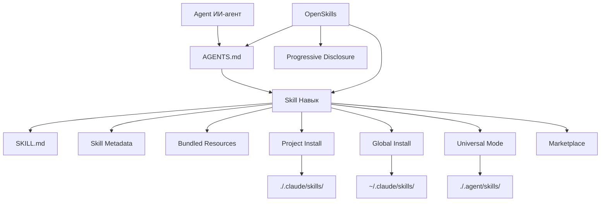

# Глоссарий

В этом глоссарии объясняются ключевые концепции OpenSkills и системы навыков ИИ, помогая вам быстро понять профессиональную терминологию.

::: info Подсказка
Этот глоссарий упорядочен по алфавиту, связи между терминами указаны в определениях.
:::

---

## A

### Agent (ИИ-агент)

**Определение**: ИИ-агент — это инструмент ИИ, способный выполнять задачи кодирования, такие как Claude Code, Cursor, Windsurf, Aider и другие.

**Особенности**:
- Способен читать конфигурационный файл `AGENTS.md`
- Поддерживает загрузку навыков в формате SKILL.md
- Может вызывать внешние инструменты через командную строку (например, `npx openskills read`)

**Роль в OpenSkills**: OpenSkills позволяет любому агенту, поддерживающему чтение AGENTS.md, использовать формат навыков Anthropic.

**Связанные термины**: [Skill](#skill), [AGENTS.md](#agentsmd)

---

## B

### Base Directory (Базовый каталог)

**Определение**: Полный путь к каталогу навыка, используемый для разрешения относительных ссылок в навыке.

**Назначение**:
- Предоставляет абсолютный путь к каталогу навыка
- Используется для разрешения относительных путей к пакетным ресурсам, таким как `references/`, `scripts/`, `assets/`

**Пример**:
```
Base directory: /path/to/my-first-skill
```

Когда навык ссылается на `references/skill-format.md`, фактически разрешается в:
```
/path/to/my-first-skill/references/skill-format.md
```

**Связанные термины**: [Skill](#skill), [Bundled Resources](#bundled-resources)

---

### Bundled Resources (Пакетные ресурсы)

**Определение**: Файлы ресурсов, включенные в каталог навыка, предоставляющие подробную информацию или инструменты, необходимые для выполнения навыка.

**Типы**:
- **`references/`** - Справочная документация, API-документация и т.д.
- **`scripts/`** - Исполняемые скрипты
- **`assets/`** - Шаблоны, примеры файлов и т.д.

**Назначение**:
- Перемещать подробную документацию в `references/`, сохраняя SKILL.md кратким
- Размещать исполняемый код в `scripts/` для удобного вызова
- Хранить шаблоны и примеры в `assets/` для справки пользователей

**Пример**:
```
my-skill/
├── SKILL.md
├── references/
│   └── api-docs.md
├── scripts/
│   └── helper.py
└── assets/
    └── template.json
```

**Связанные термины**: [Skill](#skill), [SKILL.md](#skillmd)

---

## G

### Global Install (Глобальная установка)

**Определение**: Установка навыка в каталог `.claude/skills` в домашнем каталоге пользователя, делая навык доступным для всех проектов.

**Пример команды**:
```bash
npx openskills install anthropics/skills --global
```

**Целевые пути**:
- macOS/Linux: `~/.claude/skills/`
- Windows: `%USERPROFILE%\.claude\skills\`

**Сценарии применения**:
- Необходимость использования одного и того же навыка в нескольких проектах
- Необходимость исключить навык из версионирования в репозитории проекта

**Приоритет**: При поиске навыков глобально установленные навыки имеют более низкий приоритет, чем локально установленные в проекте (см. [Приоритет поиска навыков](#skill-приоритет-поиска)).

**Связанные термины**: [Project Install](#project-install), [Приоритет поиска навыков](#skill-приоритет-поиска)

---

## M

### Marketplace (Маркетплейс)

**Определение**: Репозиторий GitHub, в котором хранятся навыки, используемый для публикации и поиска навыков.

**Anthropic Marketplace**:
- Официальный репозиторий навыков: `anthropics/skills`
- Предоставляет официально поддерживаемые навыки (такие как pdf, git-workflow, skill-creator и т.д.)

**Сторонние маркетплейсы**:
- Любой репозиторий GitHub может использоваться как источник навыков
- Поддерживаются приватные репозитории

**Установка из маркетплейса**:
```bash
# Установка из официального маркетплейса Anthropic
npx openskills install anthropics/skills

# Установка из стороннего репозитория
npx openskills install your-org/your-skills

# Установка из приватного репозитория
npx openskills install git@github.com:your-org/private-skills.git
```

**Связанные термины**: [Skill](#skill), [Global Install](#global-install)

---

## O

### OpenSkills

**Определение**: OpenSkills — это универсальный загрузчик системы навыков Anthropic, позволяющий любому агенту кодирования ИИ использовать навыки в стандартном формате SKILL.md.

**Ключевая ценность**:
- **Единый стандарт** — все агенты используют один и тот же формат навыков и описание AGENTS.md
- **Прогрессивная загрузка** — навыки загружаются по требованию, сохраняя контекст минимальным
- **Поддержка нескольких агентов** — один набор навыков обслуживает несколько агентов
- **Дружелюбие к open source** — поддержка локальных путей и приватных git-репозиториев
- **Высокая совместимость** — полная совместимость с форматом Claude Code

**Основные команды**:
- `install` — установка навыка
- `list` — список установленных навыков
- `read` — чтение содержимого навыка (используется агентами ИИ)
- `sync` — синхронизация навыков с AGENTS.md
- `update` — обновление установленных навыков
- `manage` / `remove` — удаление навыка

**Официальный репозиторий**: https://github.com/numman-ali/openskills

**Связанные термины**: [Skill](#skill), [SKILL.md](#skillmd), [AGENTS.md](#agentsmd)

---

## P

### Progressive Disclosure (Прогрессивная загрузка)

**Определение**: Загрузка навыков только при реальной необходимости, избегая одновременной загрузки всех навыков, что приводит к раздуванию контекста.

**Принцип работы**:
1. Информация о навыках хранится в виде краткого описания в AGENTS.md
2. Когда пользователь запрашивает задачу, агент ИИ проверяет, есть ли подходящий навык
3. Если есть, полное содержимое навыка загружается через `npx openskills read <skill-name>`
4. Содержимое навыка действительно только в контексте текущей задачи

**Преимущества**:
- Сохранение минимального контекста агента ИИ
- Снижение использования токенов
- Повышение скорости ответа

**Пример**:
```xml
<!-- AGENTS.md содержит только краткое описание -->
<available_skills>
  <skill>
    <name>pdf</name>
    <description>Comprehensive PDF manipulation toolkit...</description>
  </skill>
</available_skills>

<!-- Полное содержимое загружается только при запросе обработки PDF -->
npx openskills read pdf
```

**Связанные термины**: [AGENTS.md](#agentsmd), [Skill](#skill)

---

### Project Install (Локальная установка в проект)

**Определение**: Установка навыка в каталог `./.claude/skills` или `.agent/skills` в каталоге проекта, делая навык версионируемым вместе с репозиторием проекта.

**Пример команды**:
```bash
# Локальная установка в проект (по умолчанию)
npx openskills install anthropics/skills

# Локальная установка в .agent/skills (универсальный режим)
npx openskills install anthropics/skills --universal
```

**Целевые пути**:
- По умолчанию: `./.claude/skills/`
- Универсальный режим: `./.agent/skills/`

**Сценарии применения**:
- Проекту требуются конкретные навыки
- Необходимость версионирования навыка вместе с репозиторием проекта
- Командная работа с единой версией навыков

**Приоритет**: При поиске навыков локально установленные в проекте навыки имеют более высокий приоритет, чем глобально установленные (см. [Приоритет поиска навыков](#skill-приоритет-поиска)).

**Связанные термины**: [Global Install](#global-install), [Universal Mode](#universal-mode), [Приоритет поиска навыков](#skill-приоритет-поиска)

---

## S

### Skill (Навык)

**Определение**: Документ, предоставляющий ИИ-агенту инструкции для выполнения конкретных задач, содержащий подробные инструкции, шаги и пакетные ресурсы.

**Ключевые характеристики**:
- **Статические инструкции** — содержат только текст и ресурсы, без динамической логики
- **Композируемость** — несколько навыков можно комбинировать
- **Версионируемость** — управляется вместе с репозиторием проекта

**Состав навыка**:
```
skill-name/
├── SKILL.md              # Главный файл навыка
├── .openskills.json      # Метаданные установки (генерируется автоматически)
├── references/           # Справочная документация (опционально)
├── scripts/             # Исполняемые скрипты (опционально)
└── assets/              # Шаблоны и примеры (опционально)
```

**Сценарии использования**:
- Когда пользователь запрашивает задачу, ИИ-агент проверяет, есть ли подходящий навык
- Если есть, загружает навык через `npx openskills read <name>`
- ИИ-агент выполняет задачу в соответствии с инструкциями навыка

**Примеры навыков**:
- `pdf` — инструмент обработки PDF
- `git-workflow` — рабочий процесс Git
- `check-branch-first` — проверка ветки

**Связанные термины**: [SKILL.md](#skillmd), [Bundled Resources](#bundled-resources), [Agent](#agent)

---

### Skill Metadata (Метаданные навыка)

**Определение**: JSON-файл (`.openskills.json`), записывающий информацию об источнике установки навыка, используемый для поддержки обновления навыка.

**Расположение файла**: `.openskills.json` в каталоге навыка

**Описание полей**:
```json
{
  "source": "anthropics/skills",
  "sourceType": "github",
  "repoUrl": "https://github.com/anthropics/skills",
  "subpath": "skills/pdf",
  "installedAt": "2025-01-24T10:30:00.000Z"
}
```

**Назначение**:
- Запись источника навыка (GitHub, локальный путь и т.д.)
- Поддержка команды `openskills update` для обновления навыка из источника
- Идентификация навыков, требующих обновления, но без записанного источника

**Связанные термины**: [Skill](#skill), [Global Install](#global-install), [Project Install](#project-install)

---

### Приоритет поиска навыка

**Определение**: При поиске навыка OpenSkills следует фиксированному порядку приоритетов для поиска в нескольких каталогах.

**Порядок приоритетов** (от высокого к низкому):

| Приоритет | Каталог | Способ установки | Сценарий применения |
| --- | --- | --- | --- |
| 1 | `./.agent/skills/` | `--universal` | Мультиагентная среда, избежание конфликта с Claude Code |
| 2 | `~/.agent/skills/` | `--universal --global` | Глобальные навыки в мультиагентной среде |
| 3 | `./.claude/skills/` | По умолчанию (локально в проекте) | Локальные навыки проекта (выбор по умолчанию) |
| 4 | `~/.claude/skills/` | `--global` | Глобальные навыки |

**Правила поиска**:
- Поиск в порядке приоритетов
- Остановка при первом найденном совпадающем навыке
- Локальные навыки проекта переопределяют глобальные навыки с тем же именем

**Пример**:
```bash
# Поиск навыка с именем "pdf"
# 1. Сначала проверяется ./.agent/skills/pdf
# 2. Затем проверяется ~/.agent/skills/pdf
# 3. Затем проверяется ./.claude/skills/pdf
# 4. Наконец проверяется ~/.claude/skills/pdf
```

**Связанные термины**: [Project Install](#project-install), [Global Install](#global-install), [Universal Mode](#universal-mode)

---

### SKILL.md

**Определение**: Стандартный файл формата навыка, использующий YAML frontmatter и Markdown-контент для определения метаданных и инструкций навыка.

**Формат файла**:
```markdown
---
name: my-skill
description: When to use this skill
---

# Skill Instructions

Detailed instructions for the AI agent...

## Bundled Resources

See `references/skill-format.md` for details.
```

**Обязательные поля**:
- `name` - Имя навыка (уникальный идентификатор)
- `description` - Описание навыка (отображается в AGENTS.md)

**Опциональные поля**:
- `context` - Контекстные подсказки (руководство для ИИ-агента по использованию навыка)

**Лучшие практики**:
- Используйте повелительное наклонение/инфинитив: `"To do X, execute Y"`
- Избегайте второго лица: не пишите `"You should..."`
- Сохраняйте размер до 5000 слов
- Перемещайте подробный контент в каталог `references/`

**Связанные термины**: [Skill](#skill), [AGENTS.md](#agentsmd), [Bundled Resources](#bundled-resources)

---

## U

### Universal Mode (Универсальный режим)

**Определение**: Режим установки для мультиагентных сред, устанавливающий навыки в каталог `.agent/skills/`, избегая конфликта с Marketplace Claude Code.

**Пример команды**:
```bash
npx openskills install anthropics/skills --universal
```

**Целевые пути**: `./.agent/skills/` или `~/.agent/skills/` (с `--global`)

**Сценарии применения**:
- Одновременное использование Claude Code и других ИИ-агентов (например, Cursor, Windsurf)
- Необходимость совместного использования одного набора навыков всеми агентами
- Избежание конфликтов установки навыков

**Приоритет поиска**: Навыки, установленные в универсальном режиме, имеют наивысший приоритет (см. [Приоритет поиска навыков](#skill-приоритет-поиска)).

**Связанные термины**: [Project Install](#project-install), [Приоритет поиска навыков](#skill-приоритет-поиска)

---

## A

### AGENTS.md

**Определение**: Конфигурационный файл, читаемый ИИ-агентами, содержащий список доступных навыков и инструкции по их использованию, использующий XML-формат.

**Расположение файла**: Корневой каталог проекта или пользовательский путь (по умолчанию — корневой каталог проекта)

**Формат файла**:
```xml
<skills_system priority="1">

## Available Skills

<!-- SKILLS_TABLE_START -->
<usage>
When users ask you to perform tasks, check if any of the available skills below can help complete the task more effectively.

How to use skills:
- Invoke: `npx openskills read <skill-name>` (run in your shell)
- The skill content will load with detailed instructions
- Base directory provided in output for resolving bundled resources
</usage>

<available_skills>

<skill>
<name>pdf</name>
<description>Comprehensive PDF manipulation toolkit...</description>
<location>project</location>
</skill>

</available_skills>
<!-- SKILLS_TABLE_END -->

</skills_system>
```

**Назначение**:
- Объявление списка доступных навыков
- Предоставление инструкций по использованию навыков
- Поддержка сохранения пользовательского контента при обновлении навыков

**Способ генерации**:
```bash
npx openskills sync
```

**Способ обновления**:
```bash
# Перегенерация AGENTS.md (перезапишет существующий контент)
npx openskills sync -y

# Вывод в пользовательский файл
npx openskills sync -o custom-agents.md
```

**Связанные термины**: [OpenSkills](#openskills), [Skill](#skill), [Progressive Disclosure](#progressive-disclosure)

---

## Диаграмма связей терминов

Ниже показаны связи между основными терминами:



---

## Что дальше

> Глоссарий завершен. Вы ознакомились с основными концепциями OpenSkills.
>
> Далее вы можете:
> - Вернуться к [Быстрому старту](../../start/quick-start/) для практики установки и использования
> - Изучить [Справочник CLI API](../cli-api/) для получения полной информации о командах
> - Прочитать [Устранение неполадок](../../faq/troubleshooting/) для решения распространенных проблем

---

## Приложение: Ссылки на исходный код

<details>
<summary><strong>Нажмите, чтобы развернуть просмотр местоположения исходного кода</strong></summary>

> Время обновления: 2026-01-24

| Термин/Функция | Путь к файлу | Номер строки |
| --- | --- | --- |
| Определение типа Skill | [`src/types.ts`](https://github.com/numman-ali/openskills/blob/main/src/types.ts#L1-L6) | 1-6 |
| Тип SkillLocation | [`src/types.ts`](https://github.com/numman-ali/openskills/blob/main/src/types.ts#L8-L12) | 8-12 |
| Тип InstallOptions | [`src/types.ts`](https://github.com/numman-ali/openskills/blob/main/src/types.ts#L14-L18) | 14-18 |
| Тип SkillMetadata | [`src/types.ts`](https://github.com/numman-ali/openskills/blob/main/src/types.ts#L20-L24) | 20-24 |
| Логика поиска навыков | [`src/utils/skills.ts`](https://github.com/numman-ali/openskills/blob/main/src/utils/skills.ts) | Полный текст |
| Вычисление путей каталогов | [`src/utils/dirs.ts`](https://github.com/numman-ali/openskills/blob/main/src/utils/dirs.ts) | Полный текст |
| Генерация AGENTS.md | [`src/utils/agents-md.ts`](https://github.com/numman-ali/openskills/blob/main/src/utils/agents-md.ts) | Полный текст |
| Чтение/запись метаданных навыка | [`src/utils/skill-metadata.ts`](https://github.com/numman-ali/openskills/blob/main/src/utils/skill-metadata.ts) | Полный текст |

**Ключевые константы**:
- Нет (логика основана на вычислении параметров и каталогов)

**Ключевые функции**:
- `findAllSkills()` — поиск всех установленных навыков
- `findSkill(name)` — поиск указанного навыка (по приоритету)
- `getSkillsDir(options)` — вычисление каталога установки навыков
- `generateSkillsXml(skills)` — генерация XML-содержимого AGENTS.md

</details>
