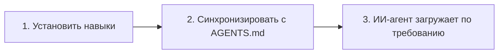

# Быстрый старт OpenSkills: Освоение системы навыков ИИ за 5 минут

## Что вы сможете сделать после этого урока

После завершения этого урока вы сможете:

- Установить OpenSkills и развернуть первый навык за 5 минут
- Использовать команды `openskills install` и `openskills sync` для управления навыками
- Позволить ИИ-агентам (Claude Code, Cursor, Windsurf и др.) распознавать и использовать установленные навыки
- Понимать основную ценность OpenSkills: унифицированный формат навыков, прогрессивная загрузка, поддержка нескольких агентов

## Текущие проблемы

Возможно, вы сталкивались с такими проблемами:

- **Навыки нельзя использовать между агентами**: Навыки Claude Code нельзя повторно использовать в Cursor или Windsurf
- **Взрыв контекста**: Загрузка слишком большого количества навыков приводит к быстрому расходу токенов ИИ-агента
- **Хаос в формате навыков**: Разные агенты используют разные способы определения навыков, что требует высоких затрат на обучение
- **Приватные навыки нельзя делиться**: Навыки внутри компании невозможно удобно распространять между членами команды

OpenSkills решает эти проблемы.

## Когда использовать этот подход

Когда вам нужно:

- Установить специализированные навыки для ИИ-агентов кодирования (например, обработка PDF, Git-рабочие процессы, проверка кода и т.д.)
- Унифицировать управление навыками между несколькими ИИ-агентами
- Использовать приватные или кастомные репозитории навыков
- Позволить ИИ загружать навыки по требованию, сохраняя контекст лаконичным

## 🎒 Подготовка к началу

::: warning Предварительная проверка

Перед началом подтвердите:

1. **Node.js версии 20.6 или выше**
   ```bash
   node --version
   ```
   Вывод должен показать `v20.6.0` или более высокую версию

2. **Git установлен** (для клонирования навыков из репозиториев GitHub)
   ```bash
   git --version
   ```

:::

## Основная идея

Принцип работы OpenSkills можно свести к трём шагам:



### Шаг 1: Установить навыки

Используйте `openskills install` для установки навыков из GitHub, локального пути или приватного репозитория. Навыки будут скопированы в каталог `.claude/skills/` проекта.

### Шаг 2: Синхронизировать с AGENTS.md

Используйте `openskills sync` для создания файла AGENTS.md, содержащего XML-разметку списка навыков. ИИ-агенты будут читать этот файл, чтобы узнать о доступных навыках.

### Шаг 3: ИИ-агент загружает по требованию

Когда пользователь запрашивает определённую задачу, ИИ-агент будет динамически загружать соответствующее содержимое навыка через `npx openskills read <skill-name>`, а не загружать все навыки сразу.

::: info Почему "прогрессивная загрузка"?

Традиционный способ: все навыки предварительно загружаются в контекст → большой расход токенов, медленный ответ
OpenSkills: загрузка по требованию → загружаются только нужные навыки → лаконичный контекст, быстрый ответ

:::

---

## Делайте вместе с нами

Теперь мы шаг за шагом выполним процесс установки и использования.

### Шаг 1: Перейдите в каталог вашего проекта

Сначала перейдите в каталог вашего разрабатываемого проекта:

```bash
cd /path/to/your/project
```

**Почему**

OpenSkills по умолчанию устанавливает навыки в каталог `.claude/skills/` проекта, чтобы навыки можно было контролировать версиями вместе с проектом, а члены команды могли делиться ими.

**Что вы должны увидеть**:

Ваш каталог проекта должен содержать одно из следующего:

- `.git/` (репозиторий Git)
- `package.json` (проект Node.js)
- Другие файлы проекта

::: tip Рекомендация

Даже если это новый проект, рекомендуется сначала инициализировать репозиторий Git, чтобы лучше управлять файлами навыков.

:::

---

### Шаг 2: Установите первый навык

Используйте следующую команду для установки навыков из официального репозитория Anthropic:

```bash
npx openskills install anthropics/skills
```

**Почему**

`anthropics/skills` — это официальный репозиторий навыков, поддерживаемый Anthropic, содержащий качественные примеры навыков, подходящие для первого знакомства.

**Что вы должны увидеть**:

Команда запустит интерактивный интерфейс выбора:

```
? Select skills to install: (Press <space> to select, <a> to toggle all, <i> to invert selection, and <enter> to proceed)
❯ ◉ pdf                 Comprehensive PDF manipulation toolkit for extracting text and tables...
  ◯ check-branch-first  Git workflow: Always check current branch before making changes...
  ◯ git-workflow        Git workflow: Best practices for commits, branches, and PRs...
  ◯ skill-creator       Guide for creating effective skills...
```

Используйте пробел для выбора навыков для установки, затем нажмите Enter для подтверждения.

::: tip Совет

В первый раз рекомендуется выбрать только 1-2 навыка (например, `pdf` и `git-workflow`), а затем установить больше после ознакомления с процессом.

:::

**Что вы должны увидеть** (после успешной установки):

```
✓ Installed: pdf
✓ Installed: git-workflow

Skills installed to: /path/to/your/project/.claude/skills/

Next steps:
  Run: npx openskills sync
  This will update AGENTS.md with your installed skills
```

---

### Шаг 3: Синхронизируйте навыки с AGENTS.md

Теперь запустите команду синхронизации:

```bash
npx openskills sync
```

**Почему**

Команда `sync` создаст файл AGENTS.md, содержащий XML-разметку списка навыков. ИИ-агенты будут читать этот файл, чтобы узнать о доступных навыках.

**Что вы должны увидеть**:

```
? Select skills to sync: (Press <space> to select, <a> to toggle all, <i> to invert selection, and <enter> to proceed)
❯ ◉ pdf                 [project]
  ◯ git-workflow        [project]
```

Точно так же используйте пробел для выбора навыков для синхронизации, затем нажмите Enter для подтверждения.

**Что вы должны увидеть** (после успешной синхронизации):

```
✓ Synced: pdf
✓ Synced: git-workflow

Updated: AGENTS.md
```

---

### Шаг 4: Проверьте файл AGENTS.md

Просмотрите созданный файл AGENTS.md:

```bash
cat AGENTS.md
```

**Что вы должны увидеть**:

```xml
<skills_system priority="1">

## Available Skills

<!-- SKILLS_TABLE_START -->
<usage>
When users ask you to perform tasks, check if any of available skills below can help complete task more effectively.

How to use skills:
- Invoke: `npx openskills read <skill-name>` (run in your shell)
- The skill content will load with detailed instructions
- Base directory provided in output for resolving bundled resources

Usage notes:
- Only use skills listed in <available_skills> below
- Do not invoke a skill that is already loaded in your context
</usage>

<available_skills>

<skill>
<name>pdf</name>
<description>Comprehensive PDF manipulation toolkit for extracting text and tables...</description>
<location>project</location>
</skill>

<skill>
<name>git-workflow</name>
<description>Git workflow: Best practices for commits, branches, and PRs...</description>
<location>project</location>
</skill>

</available_skills>
<!-- SKILLS_TABLE_END -->

</skills_system>
```

---

### Шаг 5: Просмотрите установленные навыки

Используйте команду `list` для просмотра установленных навыков:

```bash
npx openskills list
```

**Что вы должны увидеть**:

```
Installed Skills:

pdf              [project]
  Comprehensive PDF manipulation toolkit for extracting text and tables...

git-workflow     [project]
  Git workflow: Best practices for commits, branches, and PRs...

Total: 2 skills (project: 2, global: 0)
```

**Что вы должны увидеть** (пояснение):

- Название навыка слева
- Метка `[project]` указывает, что это навык, установленный локально в проекте
- Описание навыка отображается ниже

---

## Контрольная точка ✅

После выполнения вышеперечисленных шагов подтвердите:

- [ ] Каталог `.claude/skills/` создан и содержит установленные вами навыки
- [ ] Файл `AGENTS.md` создан и содержит XML-разметку списка навыков
- [ ] При запуске `openskills list` отображаются установленные навыки

Если все проверки пройдены, поздравляем! Вы успешно установили и настроили OpenSkills.

---

## Предупреждение о проблемах

### Проблема 1: команда `npx` не найдена

**Сообщение об ошибке**:

```
command not found: npx
```

**Причина**: Node.js не установлен или не настроен в PATH

**Решение**:

1. Переустановите Node.js (рекомендуется использовать [nvm](https://github.com/nvm-sh/nvm) для управления версиями Node.js)
2. Подтвердите, что после установки вы перезапустили терминал

---

### Проблема 2: время ожидания сети при установке

**Сообщение об ошибке**:

```
Error: git clone failed
```

**Причина**: ограниченный доступ к GitHub или нестабильная сеть

**Решение**:

1. Проверьте сетевое подключение
2. Настройте прокси (если необходимо):
   ```bash
   git config --global http.proxy http://proxy.example.com:8080
   ```
3. Используйте зеркальный источник (если доступен)

---

### Проблема 3: ошибка прав доступа

**Сообщение об ошибке**:

```
Error: EACCES: permission denied
```

**Причина**: нет прав записи в целевой каталог

**Решение**:

1. Проверьте права доступа к каталогу:
   ```bash
   ls -la .claude/
   ```
2. Если каталог не существует, сначала создайте его:
   ```bash
   mkdir -p .claude/skills
   ```
3. Если прав недостаточно, измените права (используйте с осторожностью):
   ```bash
   chmod -R 755 .claude/
   ```

---

## Итог урока

В этом уроке мы узнали:

1. **Основная ценность OpenSkills**: унифицированный формат навыков, прогрессивная загрузка, поддержка нескольких агентов
2. **Трёхэтапный рабочий процесс**: установить навыки → синхронизировать с AGENTS.md → ИИ-агент загружает по требованию
3. **Базовые команды**:
   - `npx openskills install <source>` - установить навыки
   - `npx openskills sync` - синхронизировать навыки с AGENTS.md
   - `npx openskills list` - просмотреть установленные навыки
4. **Поиск и устранение распространённых проблем**: сетевые проблемы, проблемы с правами доступа и т.д.

Теперь вы можете позволить ИИ-агентам использовать эти навыки. Когда ИИ-агенту нужно выполнить обработку PDF или операции Git, он автоматически вызовет `npx openskills read <skill-name>` для загрузки соответствующего содержимого навыка.

---

## Предпросмотр следующего урока

> В следующем уроке мы изучим **[Что такое OpenSkills?](../what-is-openskills/)**
>
> Вы узнаете:
> - Связь OpenSkills с Claude Code
> - Основные концепции системы навыков
> - Почему выбран CLI, а не MCP

---

## Приложение: ссылка на исходный код

<details>
<summary><strong>Нажмите, чтобы раскрыть расположение исходного кода</strong></summary>

> Обновлено: 2026-01-24

### Основные функции

| Функция            | Путь к файлу                                                                                     | Номер строки      |
|--- | --- | ---|
| Установить навыки        | [`src/commands/install.ts`](https://github.com/numman-ali/openskills/blob/main/src/commands/install.ts) | 83-424    |
| Синхронизировать с AGENTS.md | [`src/commands/sync.ts`](https://github.com/numman-ali/openskills/blob/main/src/commands/sync.ts)     | 18-109    |
| Список навыков        | [`src/commands/list.ts`](https://github.com/numman-ali/openskills/blob/main/src/commands/list.ts)     | 7-43      |
| Найти все навыки    | [`src/utils/skills.ts`](https://github.com/numman-ali/openskills/blob/main/src/utils/skills.ts)     | 30-64     |
| Сгенерировать XML        | [`src/utils/agents-md.ts`](https://github.com/numman-ali/openskills/blob/main/src/utils/agents-md.ts) | 23-93     |
| Инструменты путей к каталогам    | [`src/utils/dirs.ts`](https://github.com/numman-ali/openskills/blob/main/src/utils/dirs.ts)        | 18-25     |

### Ключевые функции

**install.ts**
- `installSkill(source, options)` - основная функция установки, поддерживает GitHub, локальные пути и приватные репозитории
- `isLocalPath(source)` - проверяет, является ли путь локальным
- `isGitUrl(source)` - проверяет, является ли путь Git URL
- `getRepoName(repoUrl)` - извлекает имя репозитория из Git URL
- `isPathInside(targetPath, targetDir)` - проверка безопасности обхода путей

**sync.ts**
- `syncAgentsMd(options)` - синхронизирует навыки с AGENTS.md, поддерживает интерактивный выбор
- Поддерживает настраиваемый путь вывода (флаг `--output`)
- Предварительно выбирает навыки, уже включённые в текущем файле

**agents-md.ts**
- `parseCurrentSkills(content)` - анализирует текущие навыки в AGENTS.md
- `generateSkillsXml(skills)` - генерирует XML в формате Claude Code
- `replaceSkillsSection(content, xml)` - заменяет раздел навыков в файле

**skills.ts**
- `findAllSkills()` - находит все установленные навыки, удаляет дубликаты по приоритету
- `findSkill(skillName)` - находит указанный навык
- Поддерживает обнаружение символических ссылок и удаление дубликатов

**dirs.ts**
- `getSkillsDir(projectLocal, universal)` - получает путь к каталогу навыков
- `getSearchDirs()` - возвращает список каталогов поиска (приоритет: .agent проект → .agent глобальный → .claude проект → .claude глобальный)

### Важные константы

- `.claude/skills/` - путь локальной установки проекта по умолчанию
- `.agent/skills/` - путь установки в режиме Universal
- `~/.claude/skills/` - путь глобальной установки
- `AGENTS.md` - файл вывода синхронизации по умолчанию

</details>
