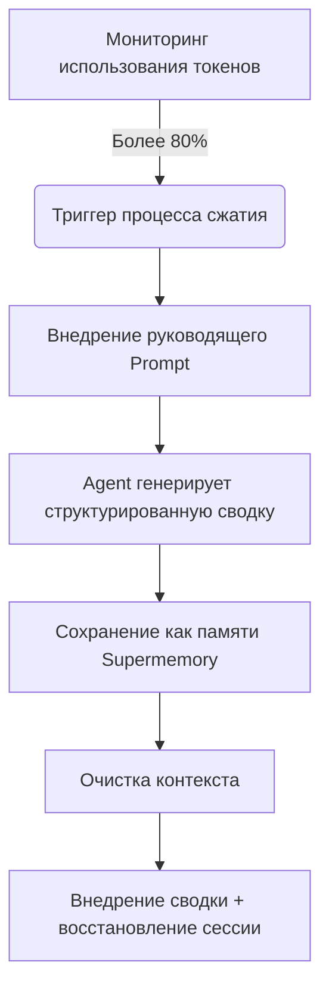

# Принцип упреждающего сжатия: предотвращение потери контекста

## Что вы сможете сделать после изучения

После изучения этого урока вы сможете:
1.  **Понять**, почему Agent в длительных сессиях "становится глупее" и как Supermemory решает эту проблему.
2.  **Освоить** условия триггера и рабочий процесс упреждающего сжатия (Preemptive Compaction).
3.  **Настроить** порог сжатия, подходящий для вашего проекта, балансируя стоимость и качество памяти.
4.  **Проверить**, работает ли сжатие нормально, и просмотреть созданную сводку сессии.

## Ваша текущая проблема

При программировании в паре с AI вы могли столкнуться с этими ситуациями:
*   **Потеря памяти в разговоре**: В длительной задаче рефакторинга Agent внезапно забыл договоренные в начале правила именования переменных.
*   **Вынужден перезапустить сессию**: Окно контекста (Context Window) заполнено, IDE предлагает очистить историю, что приводит к потере всего контекста выполненной работы.
*   **Плохое качество сводки**: Обычное автоматическое сжатие просто обрезает или делает нечеткую сводку, теряя ключевую информацию "что делать дальше".

## Когда использовать этот метод

*   Когда вы выполняете **крупный рефакторинг** или **сложную разработку функций**, и ожидается, что сессия будет длиться долго.
*   Когда вы используете модель с небольшим окном контекста (например, 32k/128k), которое легко достигается.
*   Когда вы хотите, чтобы Agent после очистки контекста все еще точно помнил "на каком этапе мы находимся".

---

## Основная идея: упреждающий против реактивного

Традиционное управление контекстом часто является **реактивным**: только когда контекст полностью заполнен (100%), приходится выбрасывать старые сообщения. Это как начать удалять файлы, только когда жесткий диск заполнен, часто слишком поздно для организации.

Supermemory использует **упреждающее сжатие (Preemptive Compaction)**:

1.  **Раннее вмешательство**: По умолчанию триггеруется, когда использование токенов достигает **80%**, резервируя достаточно места для размышлений и обобщения.
2.  **Структурированное руководство**: Не позволяйте Agent произвольным образом писать сводку, а внедрите конкретный Prompt, заставляя его резюмировать в формате "цель-прогресс-задачи".
3.  **Постоянное сохранение памяти**: Сгенерированная сводка не только используется для восстановления текущей сессии, но и сохраняется как память типа `conversation` для будущего поиска.

### Схема рабочего процесса



---

## Подробности механизма триггера

Supermemory в реальном времени отслеживает использование токенов для каждой сессии. Процесс сжатия совместно триггеруется следующими тремя жесткими условиями:

### 1. Порог использования токенов

По умолчанию, когда общее количество токенов (ввод + вывод + кэш) превышает **80%** от предела модели.

*   **Параметр конфигурации**: `compactionThreshold`
*   **Значение по умолчанию**: `0.80`
*   **Основание исходного кода**: [`src/services/compaction.ts`](https://github.com/supermemoryai/opencode-supermemory/blob/main/src/services/compaction.ts#L11)

### 2. Минимальный лимит токенов

Чтобы предотвратить ложный триггер в коротких сессиях (например, окно контекста модели велико, но было сказано всего несколько предложений), система жестко кодирует нижний предел. Сжатие будет рассматриваться только при использовании более **50,000 токенов**.

*   **Константа**: `MIN_TOKENS_FOR_COMPACTION`
*   **Значение**: `50,000`
*   **Основание исходного кода**: [`src/services/compaction.ts`](https://github.com/supermemoryai/opencode-supermemory/blob/main/src/services/compaction.ts#L12)

### 3. Время охлаждения

Чтобы предотвратить бесконечный цикл из-за непрерывного триггера, между двумя сжатиями должен быть интервал не менее **30 секунд**.

*   **Константа**: `COMPACTION_COOLDOWN_MS`
*   **Значение**: `30,000` (мс)
*   **Основание исходного кода**: [`src/services/compaction.ts`](https://github.com/supermemoryai/opencode-supermemory/blob/main/src/services/compaction.ts#L13)

---

## Шаблон структурированной сводки

Когда сжатие триггерируется, Supermemory внедрит в Agent специальный System Prompt (`[COMPACTION CONTEXT INJECTION]`), принудительно требуя, чтобы сводка содержала следующие 5 частей:

| Раздел | Описание содержимого | Цель |
| :--- | :--- | :--- |
| **1. User Requests** | Исходные запросы пользователя (сохранить как есть) | Предотвращение дрейфа требований |
| **2. Final Goal** | Конечная цель | Определение конечного состояния |
| **3. Work Completed** | Выполненная работа, измененные файлы | Предотвращение повторной работы |
| **4. Remaining Tasks** | Оставшиеся задачи | Определение следующего действия |
| **5. MUST NOT Do** | Явно запрещенные действия, неудачные попытки | Предотвращение повторения ошибок |

::: details Нажмите, чтобы просмотреть исходный код внедренного Prompt
```typescript
// src/services/compaction.ts

return `[COMPACTION CONTEXT INJECTION]

When summarizing this session, you MUST include the following sections in your summary:

## 1. User Requests (As-Is)
- List all original user requests exactly as they were stated
...

## 2. Final Goal
...

## 3. Work Completed
...

## 4. Remaining Tasks
...

## 5. MUST NOT Do (Critical Constraints)
...
This context is critical for maintaining continuity after compaction.
`;
```
:::

---

## Следуйте моему примеру: настройка и проверка

### Шаг 1: Настройка порога сжатия (по желанию)

Если вы считаете, что 80% слишком рано или слишком поздно, вы можете отредактировать в `~/.config/opencode/supermemory.jsonc`.

```jsonc
// ~/.config/opencode/supermemory.jsonc
{
  // ... другая конфигурация
  "compactionThreshold": 0.90
}
```

::: warning Предупреждение о конфликте
Если вы установили `oh-my-opencode` или другие плагины управления контекстом, **обязательно отключите** их встроенные функции сжатия (например, `context-window-limit-recovery`), иначе это приведет к двойному сжатию или логическим конфликтам.
:::

### Шаг 2: Наблюдение за триггером сжатия

Когда вы достигнете порога в длительной сессии, обратите внимание на подсказку Toast в правом нижнем углу IDE.

**Что вы должны увидеть**:

1.  **Предупреждение**:
    > "Preemptive Compaction: Context at 81% - compacting with Supermemory context..."
    
    В это время система генерирует сводку.

2.  **Подтверждение завершения**:
    > "Compaction Complete: Session compacted with Supermemory context. Resuming..."
    
    Контекст очищен и внедрена новая сводка.

### Шаг 3: Проверка сохранения памяти

После завершения сжатия сгенерированная сводка автоматически сохраняется в Supermemory. Вы можете проверить через CLI.

**Действие**:
В терминале выполните следующую команду для просмотра последней памяти:

```bash
opencode run supermemory list --scope project --limit 1
```

**Что вы должны увидеть**:
Память типа `conversation`, содержимое которой является только что структурированной сводкой.

```json
{
  "id": "mem_123abc",
  "content": "[Session Summary]\n## 1. User Requests\n...",
  "type": "conversation",
  "scope": "opencode_project_..."
}
```

---

## Частые вопросы (FAQ)

### Q: Почему моя сессия уже долгая, но сжатие еще не триггерилось?
**A**: Проверьте следующие моменты:
1.  **Общее количество токенов**: Превышает ли 50,000 токенов? (Даже если доля высока в коротких сессиях, не триггеруется).
2.  **Ограничение модели**: Правильно ли OpenCode определил текущий предел контекста модели? Если определение не удается, он вернется к 200k по умолчанию, что приведет к заниженному вычислению доли.
3.  **Время охлаждения**: Не достаточно ли 30 секунд после последнего сжатия?

### Q: Сколько токенов займет сжатая сводка?
**A**: Зависит от детальности сводки, обычно между 500-2000 токенами. По сравнению с исходным контекстом 100k+ это огромная экономия.

### Q: Могу ли я вручную триггерировать сжатие?
**A**: Текущая версия (v1.0) не поддерживает ручной триггер, полностью управляется алгоритмом.

---

## Итог урока

Упреждающее сжатие — это "секрет марафона" Supermemory. Оно с помощью **раннего вмешательства** и **структурированной сводки** преобразует линейный поток диалога в очищенные снимки памяти. Это не только решает проблему переполнения контекста, но, что более важно, позволяет Agent даже после "потери памяти" (очистки контекста) считывать снимок и бесшовно продолжать предыдущую работу.

## Предпросмотр следующего урока

> В следующем уроке мы изучим **[Подробную настройку](../configuration/index.md)**.
>
> Вы узнаете:
> - Как настроить путь хранения памяти
> - Настроить ограничение количества результатов поиска
> - Настроить правила фильтрации конфиденциальности

---

## Приложение: справочник по исходному коду

<details>
<summary><strong>Нажмите, чтобы просмотреть расположение исходного кода</strong></summary>

> Время обновления: 2026-01-23

| Функция | Путь к файлу | Номер строки |
| :--- | :--- | :--- |
| Определение констант порога | [`src/services/compaction.ts`](https://github.com/supermemoryai/opencode-supermemory/blob/main/src/services/compaction.ts#L11-L14) | 11-14 |
| Генерация руководящего Prompt | [`src/services/compaction.ts`](https://github.com/supermemoryai/opencode-supermemory/blob/main/src/services/compaction.ts#L58-L98) | 58-98 |
| Логика обнаружения триггера | [`src/services/compaction.ts`](https://github.com/supermemoryai/opencode-supermemory/blob/main/src/services/compaction.ts#L317-L358) | 317-358 |
| Логика сохранения сводки | [`src/services/compaction.ts`](https://github.com/supermemoryai/opencode-supermemory/blob/main/src/services/compaction.ts#L294-L315) | 294-315 |
| Определение параметров конфигурации | [`src/config.ts`](https://github.com/supermemoryai/opencode-supermemory/blob/main/src/config.ts#L22) | 22 |

**Ключевые константы**:
- `DEFAULT_THRESHOLD = 0.80`: Порог триггера по умолчанию
- `MIN_TOKENS_FOR_COMPACTION = 50_000`: Минимальное количество токенов для триггера
- `COMPACTION_COOLDOWN_MS = 30_000`: Время охлаждения (миллисекунды)

</details>
