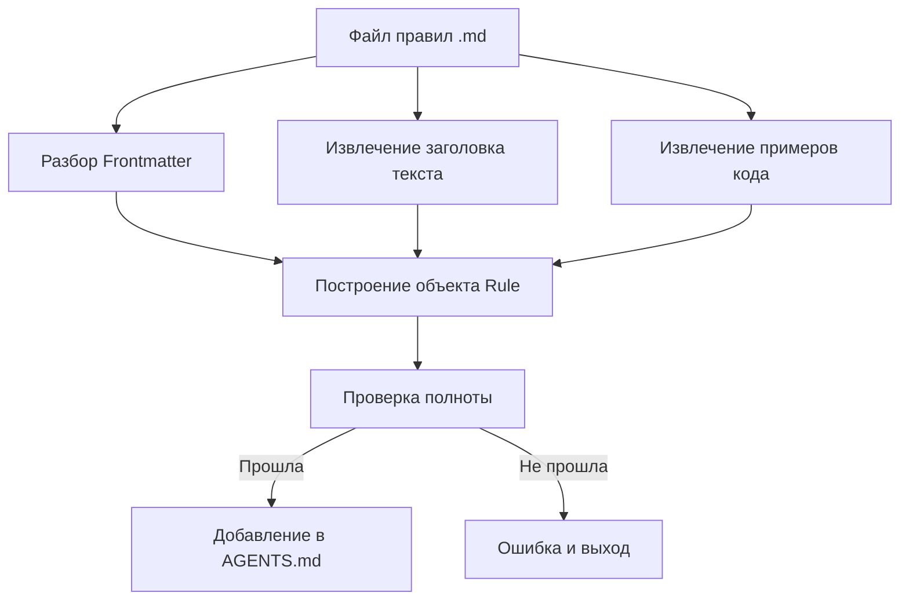

# Написание правил лучших практик React

## Чему вы научитесь

- Написать с нуля правила оптимизации производительности React, соответствующие спецификации Agent Skills
- Использовать шаблон `_template.md` для быстрого создания файлов правил
- Правильно выбирать уровень impact (CRITICAL/HIGH/MEDIUM) для классификации правил
- Писать понятные сравнительные примеры кода Incorrect/Correct
- Проверять полноту правил через `pnpm validate`

## Текущие проблемы

Вы уже использовали библиотеку правил оптимизации производительности React от Agent Skills для аудита кода, обнаружив, что некоторые паттерны оптимизации не покрыты. Вы хотите внести свои правила, но:

- Не знаете, какой формат должен быть у файла правил
- Не уверены, как выбрать уровень impact
- Написанные примеры кода не соответствуют спецификации, вызывая ошибку валидации
- Боитесь, что правило будет отклонено или не будет корректно проанализировано

## Когда использовать этот метод

Подходит для написания правил:

- Вы обнаружили проблемы производительности в проекте и хотите их закрепить как переиспользуемые правила
- У команды есть специфические паттерны оптимизации React, которые вы хотите, чтобы Agent применял
- Вы узнали новые техники из официальной документации React или инженерной команды Vercel и хотите поделиться с сообществом

Не подходит:

- Проблемы стиля кода (используйте правила ESLint)
- Функциональные рекомендации, не связанные с производительностью (используйте документацию или комментарии)

## Основная идея

Файл правил имеет формат Markdown и следует **трехсегментной структуре**:

1. **Frontmatter**: метаданные правила (title, impact, tags)
2. **Заголовок текста**: отображаемое имя правила и описание impact
3. **Примеры кода**: сравнительное отображение `**Incorrect:**` и `**Correct:**`



**Ключевые концепции**:

::: info Уровень Impact (уровень влияния）
Impact определяет положение правила в документации. Уровни от высокого к низкому:
- **CRITICAL**: критические узкие места (устранение каскадной загрузки, оптимизация сборки)
- **HIGH**: важные улучшения (производительность сервера)
- **MEDIUM-HIGH**: средне-высокий приоритет (получение данных на клиенте)
- **MEDIUM**: средние улучшения (оптимизация повторного рендеринга)
- **LOW-MEDIUM**: низко-средний приоритет (микрооптимизация JavaScript)
- **LOW**: инкрементные улучшения (расширенные шаблоны)
:::

::: info Именование kebab-case
Имя файла должно использовать строчные буквы с дефисами, например `async-parallel.md`. Префикс имени файла (часть перед первым `-`) определяет главу, к которой принадлежит правило:
- `async-*` → Глава 1 (устранение каскадной загрузки)
- `bundle-*` → Глава 2 (оптимизация сборки)
- `rerender-*` → Глава 5 (оптимизация повторного рендеринга)
:::

## 🎒 Подготовка перед началом

::: warning Предварительная проверка
- Завершено [Введение в Agent Skills](../../start/getting-started/)
- Знакомы с базовыми концепциями производительности React (re-render, waterfall, bundle и т.д.)
- Клонирован репозиторий: `cd source/vercel-labs/agent-skills`
- Установлены зависимости: `pnpm install`
:::

## Следуйте за мной

### Шаг 1: Скопируйте файл шаблона

**Почему**
Использование шаблона обеспечивает правильность формата и предотвращает пропуски обязательных полей.

**Действие**:

```bash
cd skills/react-best-practices/rules
cp _template.md my-new-rule.md
```

**Вы должны увидеть**: файл `my-new-rule.md` создан, содержимое соответствует шаблону.

### Шаг 2: Напишите метаданные Frontmatter

**Почему**
Frontmatter определяет заголовок правила, уровень влияния и классификационные теги — это первый барьер для парсера.

**Редактируйте часть frontmatter `my-new-rule.md`**:

```yaml
---
title: Use React.lazy for Code Splitting
impact: CRITICAL
impactDescription: 50-70% reduction in initial bundle
tags: bundle, code-splitting, lazy-loading, performance
---
```

**Описание полей**:

| Поле               | Обязательно | Описание                     | Пример значения                                 |
| ------------------- | ---------- | ---------------------------- | ---------------------------------------------- |
| `title`             | ✅          | Краткий заголовок правила     | `Promise.all() for Independent Operations`        |
| `impact`            | ✅          | Уровень влияния (6 значений) | `CRITICAL` / `HIGH` / `MEDIUM` и т.д.         |
| `impactDescription` | ⭕          | Описание величины влияния      | `2-10× improvement`                            |
| `tags`              | ⭕          | Теги через запятую          | `async, parallelization, promises`            |

**Вы должны увидеть**: frontmatter обновлен вашим содержимым.

### Шаг 3: Заполните заголовок и описание текста

**Почему**
Заголовок текста будет отображаться в финальной документации, описание помогает пользователям понять значение правила.

**Добавьте текст после frontmatter**

```markdown
## Use React.lazy for Code Splitting

**Impact: CRITICAL (50-70% reduction in initial bundle)**

Code split large components using `React.lazy()` to reduce initial bundle size. Components are loaded on-demand when needed.
```

**Пункты написания**:

- Заголовок H2 использует `title` из frontmatter
- Строка **Impact:** принимает формат `**Impact: LEVEL (description)**`
- Кратко опишите цель правила и преимущества производительности

### Шаг 4: Напишите примеры Incorrect и Correct

**Почему**
Сравнительные примеры — это ядро правила, напрямую показывающие «проблемный код» и «правильный подход».

**Добавьте примеры кода после текста**

```markdown
**Incorrect (loads entire bundle on initial page):**

```typescript
import HeavyChart from './HeavyChart'

function Dashboard() {
  return <HeavyChart />
}
```

**Correct (loads on-demand when needed):**

```typescript
import { lazy, Suspense } from 'react'

const HeavyChart = lazy(() => import('./HeavyChart'))

function Dashboard() {
  return (
    <Suspense fallback={<LoadingSpinner />}>
      <HeavyChart />
    </Suspense>
  )
}
```

**Спецификация написания примеров**:

| Требование       | Описание                                                    |
| --------------- | ----------------------------------------------------------- |
| **Формат ярлыка** | `**Incorrect:**` или `**Incorrect (description):**` (скобки необязательны) |
| **Содержимое скобок** | Необязательно, краткое описание почему неправильно/правильно        |
| **Блок кода**   | Используйте ````typescript` или ````tsx`                         |
| **Количество примеров** | Хотя бы один пример типа bad или good                          |

**Вы должны увидеть**: кодовые блоки корректно отрисовываются, с подсветкой синтаксиса.

### Шаг 5: Добавьте ссылки (необязательно)

**Почему**
Ссылки предоставляют авторитетные источники для правила, повышая достоверность.

**Добавьте в конец файла**

```markdown
Reference: [React.lazy and Suspense](https://react.dev/reference/react/lazy)
```

**Поддерживаемые форматы**:

```markdown
Reference: [Текст ссылки](URL)

### Несколько ссылок
References:
- [React.lazy documentation](https://react.dev/reference/react/lazy)
- [Code splitting patterns](https://web.dev/code-splitting-suspense/)
```

### Шаг 6: Проверьте файл правила

**Почему**
`pnpm validate` проверит полноту правила, обеспечив корректный разбор.

**Запустите команду валидации**

```bash
cd packages/react-best-practices-build
pnpm validate
```

**Вы должны увидеть**:

```bash
Validating rule files...
✓ All 58 rule files are valid
```

Если валидация не удалась, увидите подробное сообщение об ошибке:

```bash
✗ Validation failed:

  my-new-rule.md: Missing or empty title
```

**Распространенные ошибки валидации**:

| Сообщение об ошибке                                                        | Причина                                             | Исправление                                                        |
| ------------------------------------------------------------------------- | --------------------------------------------------- | ----------------------------------------------------------------- |
| `Missing or empty title`                                        | Frontmatter отсутствует поле `title`                | Добавьте `title: Your Title`                                       |
| `Missing examples (need at least one bad and one good example)` | Массив examples пуст                               | Добавьте хотя бы один пример (с блоком кода)                     |
| `Missing code examples`                                         | Есть метки примеров, но нет фактического кода       | Добавьте блок кода после метки (````typescript`)                   |
| `Missing bad/incorrect or good/correct examples`                | В метках нет ключевых слов bad/good/incorrect/correct | Используйте легальные метки `**Incorrect:**`, `**Correct:**`, `**Example:**` и т.д.        |
| `Invalid impact level: &lt;value&gt;...`                        | Значение `impact` не в перечислении                    | Используйте полные заглавные: `CRITICAL`/`HIGH`/`MEDIUM-HIGH`/`MEDIUM`/`LOW-MEDIUM`/`LOW` |
| `Failed to parse`                                               | Ошибка формата Markdown                            | Проверьте, обернут ли frontmatter в `---`                           |

### Шаг 7: Соберите и просмотрите результат

**Почему**
`pnpm build` скомпилирует все правила в `AGENTS.md`, вы сможете увидеть эффект отображения правила в документации.

**Запустите команду сборки**

```bash
pnpm build
```

**Вы должны увидеть**:

```bash
Building rules...
Validating rule files...
✓ All 58 rule files are valid
✓ Built 8 sections with 58 rules
✓ Generated test-cases.json with 172 test cases
```

**Просмотр сгенерированной документации**

```bash
cat skills/react-best-practices/AGENTS.md
```

**Вы должны увидеть**: ваше новое правило появляется в соответствующей главе в формате:

```markdown
### 2.1 Use React.lazy for Code Splitting

**Impact: CRITICAL (50-70% reduction in initial bundle)**

Code split large components using `React.lazy()` to reduce...
```

## Контрольная точка ✅

Подтвердите, что вы завершили следующие действия:

- [ ] Скопировали `_template.md` и назвали `my-new-rule.md`
- [ ] Frontmatter включает `title`, `impact`, `impactDescription`, `tags`
- [ ] Заголовок текста соответствует `title` в frontmatter
- [ ] Хотя бы один пример кода Incorrect или Correct
- [ ] Валидация `pnpm validate` прошла успешно
- [ ] Сборка `pnpm build` успешно сгенерировала AGENTS.md

## На что обратить внимание

#### Распространенная ошибка 1: Ошибка в написании уровня Impact

```yaml
# ❌ Ошибка: строчные буквы вызывают ошибку валидации
# impact: critical

# ✅ Правильно: используйте полные заглавные (обязательно)
impact: CRITICAL
```

**Причина**: определение типа `ImpactLevel` принимает только перечислимые значения полными заглавными буквами (`types.ts:5`).

#### Распространенная ошибка 2: Ошибка в префиксе имени файла

```bash
# ❌ Ошибка: префикс не в sectionMap, вывод к сбою вывода
# use-react-lazy.md  # префикс "use", невозможно вывести главу

# ✅ Правильно: используйте 8 стандартных префиксов
bundle-lazy-loading.md  # префикс "bundle", принадлежность к главе 2
```

**Причина**: парсер выведет главу из префикса имени файла (`parser.ts:201-210`), если префикс не соответствует `sectionMap`, правило будет классифицировано в главу 0.

#### Распространенная ошибка 3: Frontmatter не закрыт

```markdown
---
title: My Rule
impact: MEDIUM
# ❌ Отсутствует закрывающий ---

## My Rule
```

**Причина**: Frontmatter должен быть обернут в `---` (`parser.ts:42`).

#### Распространенная ошибка 4: Ошибка в формате метки примеров

```markdown
# ❌ Ошибка: отсутствует двоеточие
# **Incorrect**

```typescript
const bad = code
```

# ✅ Правильно: двоеточие обязательно
# **Incorrect:**

```typescript
const bad = code
```

# ✅ Есть описание в скобках (рекомендуется)
# **Incorrect (reason why it's wrong):**

```typescript
const bad = code
```
```

**Причина**: парсер соответствует меткам через регулярное выражение `^\*\*([^:]+?):\*?\*?$` (`parser.ts:125`), двоеточие обязательно, описание в скобках необязательно.

## Итоги урока

Написание файлов правил следует **шаблонно-ориентированному** способу, ядро:

1. **Frontmatter** определяет метаданные (title, impact, tags)
2. **Текст** включает заголовок, описание impact и примеры кода
3. **Примеры** используют метки `**Incorrect:**` и `**Correct:**`
4. **Валидация** через `pnpm validate` обеспечивает правильность формата

Помните эти 5 пунктов:
- ✅ Используйте `_template.md` как начальную точку
- ✅ Уровень impact полными заглавными (CRITICAL/HIGH/MEDIUM)
- ✅ Префикс имени файла определяет принадлежность к главе (async-/bundle-/rerender- и т.д.)
- ✅ Формат метки примера: `**Incorrect (description):**`
- ✅ Запустите `pnpm validate` перед отправкой

## Следующий урок

> В следующем уроке мы изучим **[Использование цепочки инструментов сборки](../build-toolchain/)**.
>
> Вы узнаете:
> - Как `pnpm build` компилирует документацию правил
> - Как `pnpm extract-tests` извлекает тестовые случаи
> - Как настроить автоматическую валидацию GitHub Actions
> - Как работает автоматическая оценка LLM

---

## Приложение: Справочник по исходному коду

### Файлы

| Функция                     | Путь к файлу                                                                                                                                                           | Строки    |
| ------------------------ | ---------------------------------------------------------------------------------------------------------------------------------------------------------------------- | --------- |
| Файл шаблона правил             | [`skills/react-best-practices/rules/_template.md`](https://github.com/vercel-labs/agent-skills/blob/main/skills/react-best-practices/rules/_template.md)           | 1-29      |
| Определение типов правил             | [`packages/react-best-practices-build/src/types.ts`](https://github.com/vercel-labs/agent-skills/blob/main/packages/react-best-practices-build/src/types.ts)       | 5-26      |
| Логика валидации правил             | [`packages/react-best-practices-build/src/validate.ts`](https://github.com/vercel-labs/agent-skills/blob/main/packages/react-best-practices-build/src/validate.ts) | 21-66     |
| Разбор Frontmatter         | [`packages/react-best-practices-build/src/parser.ts`](https://github.com/vercel-labs/agent-skills/blob/main/packages/react-best-practices-build/src/parser.ts)     | 42-63     |
| Отображение глав (вывод section) | [`packages/react-best-practices-build/src/parser.ts`](https://github.com/vercel-labs/agent-skills/blob/main/packages/react-best-practices-build/src/parser.ts)     | 201-210   |
| Извлечение примеров кода             | [`packages/react-best-practices-build/src/parser.ts`](https://github.com/vercel-labs/agent-skills/blob/main/packages/react-best-practices-build/src/parser.ts)     | 130-194   |
| Файл определения глав             | [`skills/react-best-practices/rules/_sections.md`](https://github.com/vercel-labs/agent-skills/blob/main/skills/react-best-practices/rules/_sections.md)           | 1-47      |

### Ключевые определения типов

```typescript
export type ImpactLevel = 'CRITICAL' | 'HIGH' | 'MEDIUM-HIGH' | 'MEDIUM' | 'LOW-MEDIUM' | 'LOW'

export interface Rule {
  id: string
  title: string
  section: number // 1-8
  impact: ImpactLevel
  explanation: string
  examples: CodeExample[]
  references?: string[]
  tags?: string[]
}
```

### Ключевые правила валидации

- title не пустой (`validate.ts:26-28`)
- количество examples ≥ 1 (`validate.ts:34-58`)
- impact должен быть допустимым перечислимым значением (`validate.ts:60-63`)

### Отображение глав (префикс имени файла → ID главы)

```typescript
const sectionMap: Record<string, number> = {
  async: 1,      // устранение каскадной загрузки
  bundle: 2,     // оптимизация сборки
  server: 3,     // производительность сервера
  client: 4,     // получение данных на клиенте
  rerender: 5,   // оптимизация повторного рендеринга
  rendering: 6,  // производительность рендеринга
  js: 7,         // производительность JavaScript
  advanced: 8,   // расширенные шаблоны
}
```
