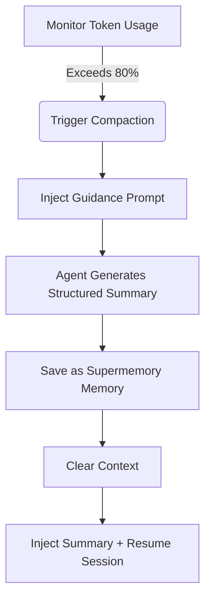

# Preemptive Compaction: Preventing Context Amnesia

## What You'll Learn

By the end of this tutorial, you will be able to:

1.  **Understand** why Agents get "dumber" during long sessions and how Supermemory solves this.
2.  **Master** the triggers and workflow of Preemptive Compaction.
3.  **Configure** compaction thresholds suitable for your project to balance cost and memory quality.
4.  **Verify** that compaction is working correctly and view the generated session summaries.

## Your Current Dilemma

When pair programming with AI, you may have encountered these situations:

*   **"Amnesia" mid-chat**: During a long refactoring task, the Agent suddenly forgets the variable naming rules agreed upon at the start.
*   **Forced Session Restart**: The Context Window fills up, and the IDE forces you to clear history, causing you to lose context of all completed work.
*   **Poor Summaries**: Ordinary automatic compaction just simply truncates or creates vague summaries, losing key information about "what to do next".

## When to Use This

*   When doing **large-scale refactoring** or **complex feature development** where you expect the session to last a long time.
*   When using models with smaller context windows (e.g., 32k/128k) that hit limits easily.
*   When you want the Agent to precisely remember "where we left off" even after clearing context.

---

## Core Concept: Preemptive vs. Reactive

Traditional context management is often **reactive**: waiting until the context is completely full (100%) before being forced to discard old messages. This is like waiting until your hard drive is full before starting to delete files—often too late to organize.

Supermemory uses **Preemptive Compaction**:

1.  **Early Intervention**: Triggers by default at **80%** token usage, reserving enough space for thinking and summarizing.
2.  **Structured Guidance**: Instead of letting the Agent write a random summary, it injects a specific Prompt forcing it to summarize in a "Goal-Progress-Todo" format.
3.  **Memory Persistence**: The generated summary is not only used for current session recovery but is also saved as a `conversation` type memory for future retrieval.

### Workflow Diagram



---

## Trigger Mechanism Details

Supermemory monitors token usage for each session in real-time. The compaction process is triggered by these three hard conditions:

### 1. Token Usage Threshold
By default, it triggers when the total token count (input + output + cache) exceeds **80%** of the model's limit.

*   **Configuration**: `compactionThreshold`
*   **Default**: `0.80`
*   **Source**: [`src/services/compaction.ts`](https://github.com/supermemoryai/opencode-supermemory/blob/main/src/services/compaction.ts#L11)

### 2. Minimum Token Limit
To prevent false triggers in short sessions (e.g., large context model but only a few chats), a hard lower limit is set. Compaction is only considered when usage exceeds **50,000 Tokens**.

*   **Constant**: `MIN_TOKENS_FOR_COMPACTION`
*   **Value**: `50,000`
*   **Source**: [`src/services/compaction.ts`](https://github.com/supermemoryai/opencode-supermemory/blob/main/src/services/compaction.ts#L12)

### 3. Cooldown
To prevent continuous triggering loops, there is at least a **30-second** interval between compactions.

*   **Constant**: `COMPACTION_COOLDOWN_MS`
*   **Value**: `30,000` (ms)
*   **Source**: [`src/services/compaction.ts`](https://github.com/supermemoryai/opencode-supermemory/blob/main/src/services/compaction.ts#L13)

---

## Structured Summary Template

When compaction is triggered, Supermemory injects a special System Prompt (`[COMPACTION CONTEXT INJECTION]`), mandating the summary to include the following 5 sections:

| Section | Content Description | Purpose |
|--- | --- | ---|
| **1. User Requests** | Original user requests (kept as-is) | Prevent requirement drift |
| **2. Final Goal** | The ultimate goal to achieve | Clarify the end state |
| **3. Work Completed** | Work done, files modified | Avoid repetitive work |
| **4. Remaining Tasks** | Remaining to-do items | Clarify next steps |
| **5. MUST NOT Do** | Explicit prohibitions, failed attempts | Avoid repeating mistakes |

::: details Click to view injected Prompt source
```typescript
// src/services/compaction.ts

return `[COMPACTION CONTEXT INJECTION]

When summarizing this session, you MUST include the following sections in your summary:

## 1. User Requests (As-Is)
- List all original user requests exactly as they were stated
...

## 2. Final Goal
...

## 3. Work Completed
...

## 4. Remaining Tasks
...

## 5. MUST NOT Do (Critical Constraints)
...
This context is critical for maintaining continuity after compaction.
`;
```
:::

---

## Follow Along: Configuration & Verification

### Step 1: Adjust Compaction Threshold (Optional)

If you feel 80% is too early or too late, you can adjust it in `~/.config/opencode/supermemory.jsonc`.

```jsonc
// ~/.config/opencode/supermemory.jsonc
{
  // ... other configs
  "compactionThreshold": 0.90
}
```

::: warning Conflict Warning
If you have installed `oh-my-opencode` or other context management plugins, you **must disable** their built-in compaction features (like `context-window-limit-recovery`) to avoid double compaction or logical conflicts.
:::

### Step 2: Observe Compaction Trigger

When you reach the threshold in a long session, watch for the Toast notification in the bottom right of your IDE.

**You should see**:

1.  **Warning**:
    > "Preemptive Compaction: Context at 81% - compacting with Supermemory context..."
    
    The system is currently generating the summary.

2.  **Completion**:
    > "Compaction Complete: Session compacted with Supermemory context. Resuming..."
    
    The context has been cleared, and the new summary has been injected.

### Step 3: Verify Memory Persistence

After compaction is complete, the generated summary is automatically saved to Supermemory. You can verify this via the CLI.

**Action**:
Run the following command in your terminal to view the most recent memory:

```bash
opencode run supermemory list --scope project --limit 1
```

**You should see**:
A memory of type `conversation`, containing the structured summary just generated.

```json
{
  "id": "mem_123abc",
  "content": "[Session Summary]\n## 1. User Requests\n...",
  "type": "conversation",
  "scope": "opencode_project_..."
}
```

---

## FAQ

### Q: Why hasn't my session triggered compaction even though it's very long?
**A**: Check the following:
1.  **Total Tokens**: Has it exceeded 50,000 Tokens? (Short sessions won't trigger even if the percentage is high).
2.  **Model Limits**: Did OpenCode correctly identify the current model's context limit? If identification fails, it falls back to the default 200k, causing the percentage calculation to be lower than actual.
3.  **Cooldown**: Has it been less than 30 seconds since the last compaction?

### Q: How many tokens does the compacted summary take?
**A**: This depends on the detail level of the summary, usually between 500-2000 Tokens. Compared to the original 100k+ context, this is a massive saving.

### Q: Can I trigger compaction manually?
**A**: The current version (v1.0) does not support manual triggering; it is fully managed by the algorithm.

---

## Summary

Preemptive compaction is Supermemory's "marathon secret". By **intervening early** and using **structured summaries**, it transforms linear conversation flows into concise memory snapshots. This not only solves context overflow issues but, more importantly, allows the Agent to seamlessly continue work by reading the snapshot even after "amnesia" (context clearing).

## What's Next

> Next, we'll learn about **[Deep Configuration Guide](../configuration/index.md)**.
>
> You will learn:
> - How to customize memory storage paths
> - Configure search result limits
> - Adjust privacy filtering rules

---

## Appendix: Source Code Reference

<details>
<summary><strong>Click to expand source location</strong></summary>

> Updated: 2026-01-23

| Feature | File Path | Line No. |
|--- | --- | ---|
| Threshold Constants | [`src/services/compaction.ts`](https://github.com/supermemoryai/opencode-supermemory/blob/main/src/services/compaction.ts#L11-L14) | 11-14 |
| Guidance Prompt Generation | [`src/services/compaction.ts`](https://github.com/supermemoryai/opencode-supermemory/blob/main/src/services/compaction.ts#L58-L98) | 58-98 |
| Trigger Detection Logic | [`src/services/compaction.ts`](https://github.com/supermemoryai/opencode-supermemory/blob/main/src/services/compaction.ts#L317-L358) | 317-358 |
| Summary Save Logic | [`src/services/compaction.ts`](https://github.com/supermemoryai/opencode-supermemory/blob/main/src/services/compaction.ts#L294-L315) | 294-315 |
| Configuration Items | [`src/config.ts`](https://github.com/supermemoryai/opencode-supermemory/blob/main/src/config.ts#L22) | 22 |

**Key Constants**:
- `DEFAULT_THRESHOLD = 0.80`: Default trigger threshold
- `MIN_TOKENS_FOR_COMPACTION = 50_000`: Minimum tokens to trigger
- `COMPACTION_COOLDOWN_MS = 30_000`: Cooldown time (ms)

</details>
