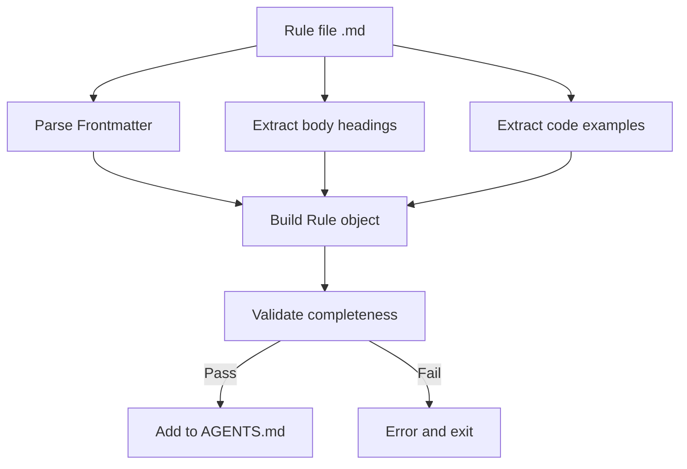

# Authoring React Best Practices Rules

## What You'll Learn

- Write React performance optimization rules from scratch following Agent Skills conventions
- Use _template.md to quickly create rule files
- Choose appropriate impact levels (CRITICAL/HIGH/MEDIUM) for rule classification
- Write clear, understandable Incorrect/Correct code comparison examples
- Validate rule completeness using `pnpm validate`

## Your Current Challenge

You've audited code using Agent Skills' React performance optimization library and discovered some performance optimization patterns aren't covered. You want to contribute your own rules, but:

- You don't know the required format for rule files
- You're unsure how to choose the appropriate impact level
- Your code examples don't follow conventions, causing validation failures
- You're worried your rules will be rejected or won't be parsed correctly

## When to Use This Approach

**Suitable scenarios for writing rules:**

- You've discovered performance issues in your project and want to solidify them as reusable rules
- Your team has specific React optimization patterns you want agents to apply
- You've learned new techniques from React official docs or Vercel engineering team and want to share with the community

**Unsuitable scenarios:**

- Simple code style issues (use ESLint rules)
- Feature suggestions unrelated to performance (use documentation or comments)

## Core Concepts

Rule files follow Markdown format with a **three-section structure**:

1. **Frontmatter**: Rule metadata (title, impact, tags)
2. **Body headings**: Rule display name and impact description
3. **Code examples**: `**Incorrect:**` and `**Correct:**` comparison



**Key concepts:**

::: info Impact Level
Impact determines the rule's position in the documentation. Levels from high to low:
- **CRITICAL**: Critical bottlenecks (eliminate waterfalls, bundle optimization)
- **HIGH**: Significant improvements (server-side performance)
- **MEDIUM-HIGH**: Medium-high priority (client-side data fetching)
- **MEDIUM**: Moderate improvements (re-render optimization)
- **LOW-MEDIUM**: Low-medium priority (JavaScript micro-optimizations)
- **LOW**: Incremental improvements (advanced patterns)
:::

::: info kebab-case Naming
Filenames must use lowercase letters separated by hyphens, such as `async-parallel.md`. The filename prefix (before the first `-`) determines which section the rule belongs to:
- `async-*` → Chapter 1 (Eliminate Waterfalls)
- `bundle-*` → Chapter 2 (Bundle Optimization)
- `rerender-*` → Chapter 5 (Re-render Optimization)
:::

## 🎒 Prerequisites

::: warning Prerequisites Check
- Completed [Agent Skills Getting Started](../../start/getting-started/)
- Understand basic React performance concepts (re-render, waterfall, bundle, etc.)
- Cloned repository: `cd source/vercel-labs/agent-skills`
- Installed dependencies: `pnpm install`
:::

## Follow Along

### Step 1: Copy Template File

**Why**
Using a template ensures correct format and prevents missing required fields.

**Action:**

```bash
cd skills/react-best-practices/rules
cp _template.md my-new-rule.md
```

**You should see:** The `my-new-rule.md` file has been created with content matching the template.

### Step 2: Write Frontmatter Metadata

**Why**
Frontmatter defines the rule's title, impact level, and category tags, serving as the parser's first checkpoint.

**Edit the frontmatter section of `my-new-rule.md`:**

```yaml
---
title: Use React.lazy for Code Splitting
impact: CRITICAL
impactDescription: 50-70% reduction in initial bundle
tags: bundle, code-splitting, lazy-loading, performance
---
```

**Field descriptions:**

| Field | Required | Description | Example |
|-------|----------|-------------|---------|
| `title` | ✅ | Short rule title | `Promise.all() for Independent Operations` |
| `impact` | ✅ | Impact level (6 enum values) | `CRITICAL` / `HIGH` / `MEDIUM`, etc. |
| `impactDescription` | ⭕ | Description of impact magnitude | `2-10× improvement` |
| `tags` | ⭕ | Comma-separated tags | `async, parallelization, promises` |

**You should see:** Frontmatter updated with your content.

### Step 3: Write Body Heading and Description

**Why**
The body heading appears in the final documentation, and the description helps users understand the rule's purpose.

**Add body content after frontmatter:**

```markdown
## Use React.lazy for Code Splitting

**Impact: CRITICAL (50-70% reduction in initial bundle)**

Code split large components using `React.lazy()` to reduce the initial bundle size. Components are loaded on-demand when needed.
```

**Writing guidelines:**

- Use H2 heading matching frontmatter's `title`
- **Impact:** line follows format `**Impact: LEVEL (description)**`
- Briefly explain the rule's purpose and performance benefits

### Step 4: Write Incorrect and Correct Examples

**Why**
Comparison examples are the core of the rule, directly demonstrating "problematic code" vs "correct approach".

**Add code examples after body description:**

```markdown
**Incorrect (loads entire bundle on initial page):**

```typescript
import HeavyChart from './HeavyChart'

function Dashboard() {
  return <HeavyChart />
}
```

**Correct (loads on-demand when needed):**

```typescript
import { lazy, Suspense } from 'react'

const HeavyChart = lazy(() => import('./HeavyChart'))

function Dashboard() {
  return (
    <Suspense fallback={<LoadingSpinner />}>
      <HeavyChart />
    </Suspense>
  )
}
```
```

**Example writing guidelines:**

| Requirement | Description |
|-------------|-------------|
| **Label format** | `**Incorrect:**` or `**Incorrect (description):**` (brackets optional) |
| **Bracket content** | Optional, brief description of why it's wrong/right |
| **Code block** | Use `\`\`\`typescript` or `\`\`\`tsx` |
| **Example count** | Must include at least one bad or good type example |

**You should see:** Code blocks render correctly with syntax highlighting.

### Step 5: Add References (Optional)

**Why**
References provide authoritative sources for the rule, enhancing credibility.

**Add at the end of the file:**

```markdown
Reference: [React.lazy and Suspense](https://react.dev/reference/react/lazy)
```

**Supported formats:**

```markdown
Reference: [Link text](URL)

### Multiple references
References:
- [React.lazy documentation](https://react.dev/reference/react/lazy)
- [Code splitting patterns](https://web.dev/code-splitting-suspense/)
```

### Step 6: Validate Rule File

**Why**
`pnpm validate` checks rule completeness to ensure it can be parsed correctly.

**Run validation command:**

```bash
cd packages/react-best-practices-build
pnpm validate
```

**You should see:**

```bash
Validating rule files...
✓ All 58 rule files are valid
```

If validation fails, you'll see detailed error messages:

```bash
✗ Validation failed:

  my-new-rule.md: Missing or empty title
```

**Common validation errors:**

| Error message | Cause | Fix method |
|---------------|-------|------------|
| `Missing or empty title` | frontmatter missing `title` field | Add `title: Your Title` |
| `Missing examples (need at least one bad and one good example)` | examples array is empty | Add at least one example (with code block) |
| `Missing code examples` | Has example label but no actual code | Add code block after label (`\`\`\`typescript`) |
| `Missing bad/incorrect or good/correct examples` | Labels don't contain bad/good/incorrect/correct keywords | Use valid labels like `**Incorrect:**`, `**Correct:**`, `**Example:**` |
| `Invalid impact level: &lt;value&gt;...` | `impact` value not in enum | Use all caps: `CRITICAL`/`HIGH`/`MEDIUM-HIGH`/`MEDIUM`/`LOW-MEDIUM`/`LOW` |
| `Failed to parse` | Markdown format error | Check that frontmatter is wrapped in `---` |

### Step 7: Build and View Results

**Why**
`pnpm build` compiles all rules into `AGENTS.md`, allowing you to see how rules appear in the documentation.

**Run build command:**

```bash
pnpm build
```

**You should see:**

```bash
Building rules...
Validating rule files...
✓ All 58 rule files are valid
✓ Built 8 sections with 58 rules
✓ Generated test-cases.json with 172 test cases
```

**View generated documentation:**

```bash
cat skills/react-best-practices/AGENTS.md
```

**You should see:** Your new rule appears in the corresponding chapter, formatted as:

```markdown
### 2.1 Use React.lazy for Code Splitting

**Impact: CRITICAL (50-70% reduction in initial bundle)**

Code split large components using `React.lazy()` to reduce...
```

## Checkpoint ✅

Confirm you've completed the following steps:

- [ ] Copied `_template.md` and named it `my-new-rule.md`
- [ ] Frontmatter contains `title`, `impact`, `impactDescription`, `tags`
- [ ] Body heading matches `title` in frontmatter
- [ ] Contains at least one Incorrect or Correct code example
- [ ] `pnpm validate` passes
- [ ] `pnpm build` successfully generates AGENTS.md

## Common Pitfalls

#### Common Error 1: Impact Level Typo

```yaml
# ❌ Wrong: Lowercase causes validation failure
# impact: critical

# ✅ Correct: Use all caps (must be uppercase)
impact: CRITICAL
```

**Reason:** The `ImpactLevel` type definition only accepts uppercase enum values (`types.ts:5`).

#### Common Error 2: Incorrect Filename Prefix

```bash
# ❌ Wrong: Prefix not in sectionMap causes inference failure
# use-react-lazy.md  # Prefix is "use", chapter cannot be inferred

# ✅ Correct: Use 8 standard prefixes
bundle-lazy-loading.md  # Prefix is "bundle", belongs to Chapter 2
```

**Reason:** The parser infers chapter from filename prefix (`parser.ts:201-210`). If the prefix doesn't match `sectionMap`, the rule will be categorized under Chapter 0.

#### Common Error 3: Unclosed Frontmatter

```markdown
---
title: My Rule
impact: MEDIUM
# ❌ Missing closing ---

## My Rule
```

**Reason:** Frontmatter must be wrapped in `---` (`parser.ts:42`).

#### Common Error 4: Incorrect Example Label Format

**Examples of incorrect label formats:**

- ❌ `# **Incorrect**` (missing colon)
- ✅ `# **Incorrect:**` (with colon)
- ✅ `# **Incorrect (reason why it's wrong):**` (with bracket description)

**Reason:** The parser matches labels using regex `^\*\*([^:]+?):\*?\*?$` (`parser.ts:125`). The colon is required, but bracket descriptions are optional.

## Summary

Rule file authoring follows a **template-driven** approach with these core principles:

1. **Frontmatter** defines metadata (title, impact, tags)
2. **Body** contains heading, impact description, and code examples
3. **Examples** use `**Incorrect:**` and `**Correct:**` labels
4. **Validation** ensures correct format via `pnpm validate`

Remember these 5 key points:
- ✅ Use `_template.md` as a starting point
- ✅ Use uppercase for impact levels (CRITICAL/HIGH/MEDIUM)
- ✅ Filename prefix determines chapter assignment (async-/bundle-/rerender-, etc.)
- ✅ Example label format: `**Incorrect (description):**`
- ✅ Run `pnpm validate` before submitting

## Coming Up Next

> In the next lesson, we'll learn **[Build Toolchain Usage](../build-toolchain/)**.
>
> You'll learn:
> - How `pnpm build` compiles rule documentation
> - How `pnpm extract-tests` extracts test cases
> - How to configure GitHub Actions for automatic validation
> - How LLM automatic evaluation works

---

## Appendix: Source Code Reference

<details>
<summary><strong>Click to expand source code locations</strong></summary>

> Last updated: 2026-01-25

| Feature | File Path | Lines |
|---------|-----------|-------|
| Rule template file | [`skills/react-best-practices/rules/_template.md`](https://github.com/vercel-labs/agent-skills/blob/main/skills/react-best-practices/rules/_template.md) | 1-29 |
| Rule type definitions | [`packages/react-best-practices-build/src/types.ts`](https://github.com/vercel-labs/agent-skills/blob/main/packages/react-best-practices-build/src/types.ts) | 5-26 |
| Rule validation logic | [`packages/react-best-practices-build/src/validate.ts`](https://github.com/vercel-labs/agent-skills/blob/main/packages/react-best-practices-build/src/validate.ts) | 21-66 |
| Frontmatter parsing | [`packages/react-best-practices-build/src/parser.ts`](https://github.com/vercel-labs/agent-skills/blob/main/packages/react-best-practices-build/src/parser.ts) | 42-63 |
| Section mapping (infer section) | [`packages/react-best-practices-build/src/parser.ts`](https://github.com/vercel-labs/agent-skills/blob/main/packages/react-best-practices-build/src/parser.ts) | 201-210 |
| Code example extraction | [`packages/react-best-practices-build/src/parser.ts`](https://github.com/vercel-labs/agent-skills/blob/main/packages/react-best-practices-build/src/parser.ts) | 130-194 |
| Section definition file | [`skills/react-best-practices/rules/_sections.md`](https://github.com/vercel-labs/agent-skills/blob/main/skills/react-best-practices/rules/_sections.md) | 1-47 |

**Key type definitions:**

```typescript
export type ImpactLevel = 'CRITICAL' | 'HIGH' | 'MEDIUM-HIGH' | 'MEDIUM' | 'LOW-MEDIUM' | 'LOW'

export interface Rule {
  id: string
  title: string
  section: number // 1-8
  impact: ImpactLevel
  explanation: string
  examples: CodeExample[]
  references?: string[]
  tags?: string[]
}
```

**Key validation rules:**

- title non-empty (`validate.ts:26-28`)
- examples count ≥ 1 (`validate.ts:34-58`)
- impact must be valid enum value (`validate.ts:60-63`)

**Section mapping** (filename prefix → section ID):

\`\`\`typescript
const sectionMap: Record&lt;string, number&gt; = {
  async: 1,      // Eliminate Waterfalls
  bundle: 2,     // Bundle Optimization
  server: 3,     // Server-side Performance
  client: 4,     // Client-side Data Fetching
  rerender: 5,   // Re-render Optimization
  rendering: 6,  // Rendering Performance
  js: 7,         // JavaScript Performance
  advanced: 8,   // Advanced Patterns
}
\`\`\`

</details>
