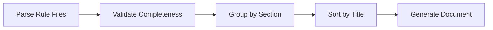

# Architecture and Implementation Details

## What You'll Learn

- Understand how Agent Skills build toolchain works
- Master the core logic of rule file parsing
- Learn about type system and data flow design
- Study implementation details of framework detection algorithm

## Core Architecture Overview

Agent Skills consists of three main parts:

**1. Build Toolchain** (`packages/react-best-practices-build/`)
- Parse rule files
- Generate AGENTS.md
- Extract test cases

**2. Rule Files** (`skills/react-best-practices/rules/`)
- 57 React performance optimization rules
- Markdown format, following template specifications

**3. Deployment Scripts** (`skills/claude.ai/vercel-deploy-claimable/`)
- One-click deployment to Vercel
- Automatic framework detection

::: info Why Understand Architecture?
If you're just using Agent Skills, you might not need deep understanding of these details. But if you need to:
- Develop custom skills
- Write new performance optimization rules
- Troubleshoot build or deployment issues

Understanding the architecture will be very helpful.
:::

## Build Pipeline Deep Dive

The build pipeline compiles scattered rule files into AGENTS.md documents readable by AIAgent. The process consists of five stages:



### Stage 1: Parse Rule Files (parse)

Each rule file (`.md`) is parsed into a `Rule` object through the `parseRuleFile()` function.

**Parsing Order** (source location: `parser.ts:18-238`):

1. **Extract Frontmatter** (if present)
   - Parse YAML format metadata
   - Supported fields: `title`, `impact`, `tags`, `section`, `explanation`, `references`

2. **Extract Title**
   - Find the first `##` or `###` heading
   - If Frontmatter has no title, use the content here

3. **Extract Impact**
   - Match `**Impact:**` line
   - Format: `**Impact:** CRITICAL (2-10× improvement)`
   - Extract level and description

4. **Extract Code Examples**
   - Find `**Label:**` markers (such as `**Incorrect:**`, `**Correct:**`)
   - Collect subsequent code blocks
   - Capture supplemental text after code block

5. **Extract References**
   - Find `Reference:` or `References:` lines
   - Parse Markdown links `[text](url)`

6. **Infer Section**
   - Extract from filename prefix (source location: `parser.ts:201-210`)
   - Mapping table:
     - `async-*` → Section 1 (Eliminate Waterfalls)
     - `bundle-*` → Section 2 (Bundle Optimization)
     - `server-*` → Section 3 (Server Performance)
     - `client-*` → Section 4 (Client Side Data Fetching)
     - `rerender-*` → Section 5 (Re-render Optimization)
     - `rendering-*` → Section 6 (Rendering Performance)
     - `js-*` → Section 7 (JavaScript Performance)
     - `advanced-*` → Section 8 (Advanced Patterns)

### Stage 2: Validate Completeness (validate)

Validation logic is implemented in `validate.ts`, ensuring rule files meet specifications.

**Validation Items**:

| Check Item         | Description                                              | Error Output |
| ------------------ | -------------------------------------------------------- | ------------ |
| Title Not Empty    | Must have title (Frontmatter or `##` heading)           | `Missing or empty title` |
| At Least One Example | `examples` array must not be empty                    | `At least one code example required` |
| Impact Valid       | Must be a valid `ImpactLevel` enum value                 | `Invalid impact level` |
| Code Not Empty     | Each example must have code content                      | `Empty code block` |

### Stage 3: Group by Section (group)

Group all rules by section, each section contains:

- `number`: Section number (1-8)
- `title`: Section title (read from `_sections.md`)
- `impact`: Overall impact level
- `introduction`: Section introduction (optional)
- `rules[]`: Included rules array

(source location: `build.ts:156-169`)

### Stage 4: Sort by Title (sort)

Rules within each section are sorted alphabetically by title.

**Sorting Rule** (source location: `build.ts:172-175`):
```typescript
section.rules.sort((a, b) =>
  a.title.localeCompare(b.title, 'en-US', { sensitivity: 'base' })
)
```

Using `en-US` locale ensures consistent sorting across environments.

**Assign IDs** (source location: `build.ts:178-180):
```typescript
section.rules.forEach((rule, index) => {
  rule.id = `${section.number}.${index + 1}`
  rule.subsection = index + 1
})
```

After sorting, IDs are assigned like `1.1`, `1.2`...

### Stage 5: Generate Document (generate)

The `generateMarkdown()` function converts the `Section[]` array into a Markdown document.

**Output Structure** (source location: `build.ts:29-126`):

```markdown
# React Best Practices
**Version 1.0**
Vercel Engineering
January 25, 2026

## Abstract
...

## Table of Contents
1. Eliminate Waterfalls - CRITICAL
   - 1.1 [Parallel Requests](#11-parallel-requests)
   - 1.2 [Defer Await](#12-defer-await)
...

## 1. Eliminate Waterfalls
**Impact: CRITICAL**

### 1.1 Parallel Requests
**Impact: CRITICAL**

**Incorrect:**
```typescript
// code
```
```

## Rule Parser Details

### Frontmatter Parsing

Frontmatter is a YAML block at the top of a Markdown file:

```markdown
---
title: Parallel Requests
impact: CRITICAL
impactDescription: 2-10× improvement
tags: async, waterfall
---
```

**Parsing Logic** (source location: `parser.ts:28-41`):
- Detect `---` at start and second `---` at end
- Split key-value pairs by `:`
- Remove quote wrapping
- Store in `frontmatter` object

### Code Example Parsing

Each rule contains multiple code examples, marked with `**Label:**`.

**Parsing State Machine** (source location: `parser.ts:66-188`):

```
Initial State → Read **Label:** → currentExample.label = "Label"
              → Read ``` → inCodeBlock = true, collect code
              → Read ``` → inCodeBlock = false, currentExample.code = collected code
              → Read text → if afterCodeBlock, store in additionalText
              → Read **Reference:** → push currentExample to examples[]
```

**Supported Label Types**:
- `Incorrect`: Incorrect example
- `Correct`: Correct example
- `Example`: Generic example
- `Usage`: Usage example
- `Implementation`: Implementation example

**Supplemental Text Capture** (source location: `parser.ts:182-186`):
```typescript
// Text after a code block, or text in a section without a code block
// (e.g., "When NOT to use this pattern:" with bullet points instead of code)
else if (currentExample && (afterCodeBlock || !hasCodeBlockForCurrentExample)) {
  additionalText.push(line)
}
```

This supports adding supplemental text after code blocks, or pure text examples (such as lists).

### Reference Parsing

References are at the end of the file, formatted as:

```markdown
Reference: [React Documentation](https://react.dev), [Next.js Guide](https://nextjs.org/docs)
```

**Parsing Logic** (source location: `parser.ts:154-174`):
- Regex match `[text](url)` pattern
- Extract all URLs to `references[]` array

## Type System

Type definitions are in `types.ts` (source location: `types.ts:1-54`).

### ImpactLevel Enum

```typescript
export type ImpactLevel =
  | 'CRITICAL'
  | 'HIGH'
  | 'MEDIUM-HIGH'
  | 'MEDIUM'
  | 'LOW-MEDIUM'
  | 'LOW'
```

**Level Description**:

| Level        | Impact                                    | Example Rule                  |
| ------------ | ----------------------------------------- | ----------------------------- |
| CRITICAL     | Critical bottleneck, must fix             | async-parallel                |
| HIGH         | Important improvement, recommended priority | server-cache-react            |
| MEDIUM-HIGH  | Medium-high priority                      | client-data-fetch             |
| MEDIUM       | Medium improvement                        | rerender-memo                 |
| LOW-MEDIUM   | Low-medium priority                       | js-use-memo                   |
| LOW          | Incremental improvement, optional         | advanced-suspense-boundaries  |

### Rule Interface

```typescript
export interface Rule {
  id: string                    // Auto-generated, like "1.1"
  title: string                 // Rule title
  section: number              // Section it belongs to (1-8)
  subsection?: number          // Subsection number
  impact: ImpactLevel          // Impact level
  impactDescription?: string  // Impact description, like "2-10× improvement"
  explanation: string          // Rule explanation
  examples: CodeExample[]      // Code example array
  references?: string[]        // Reference links
  tags?: string[]              // Tags
}
```

### CodeExample Interface

```typescript
export interface CodeExample {
  label: string              // "Incorrect", "Correct", "Example"
  description?: string       // Label description (optional)
  code: string              // Code content
  language?: string         // Code language, default typescript
  additionalText?: string   // Supplemental text after code
}
```

### Section Interface

```typescript
export interface Section {
  number: number              // Section number (1-8)
  title: string              // Section title
  impact: ImpactLevel        // Overall impact level
  impactDescription?: string // Impact description
  introduction?: string      // Section introduction
  rules: Rule[]             // Included rules
}
```

### GuidelinesDocument Interface

```typescript
export interface GuidelinesDocument {
  version: string          // Version number, like "1.0"
  organization: string     // Organization name
  date: string            // Date
  abstract: string        // Abstract
  sections: Section[]     // Sections
  references?: string[]   // Global references
}
```

### TestCase Interface

Test cases used for LLM automatic evaluation.

```typescript
export interface TestCase {
  ruleId: string          // Rule ID, like "1.1"
  ruleTitle: string       // Rule title
  type: 'bad' | 'good'   // Example type
  code: string           // Code content
  language: string       // Code language
  description?: string   // Description
}
```

## Test Case Extraction Mechanism

The test case extraction feature converts code examples from rules into evaluable test cases for LLM automatic assessment of rule compliance.

### Extraction Logic (source location: `extract-tests.ts:15-38`)

```typescript
function extractTestCases(rule: Rule): TestCase[] {
  const testCases: TestCase[] = []

  rule.examples.forEach((example, index) => {
    const isBad = example.label.toLowerCase().includes('incorrect') ||
                  example.label.toLowerCase().includes('wrong') ||
                  example.label.toLowerCase().includes('bad')
    const isGood = example.label.toLowerCase().includes('correct') ||
                   example.label.toLowerCase().includes('good')

    if (isBad || isGood) {
      testCases.push({
        ruleId: rule.id,
        ruleTitle: rule.title,
        type: isBad ? 'bad' : 'good',
        code: example.code,
        language: example.language || 'typescript',
        description: example.description || `${example.label} example for ${rule.title}`
      })
    }
  })

  return testCases
}
```

**Supported Example Types**:
- `Incorrect` / `Wrong` / `Bad` → type = 'bad'
- `Correct` / `Good` → type = 'good'

**Output File**: `test-cases.json`

**Data Structure**:
```json
[
  {
    "ruleId": "1.1",
    "ruleTitle": "Parallel Requests",
    "type": "bad",
    "code": "const data = await fetch(url);\nconst result = await process(data);",
    "language": "typescript",
    "description": "Incorrect example for Parallel Requests"
  },
  {
    "ruleId": "1.1",
    "ruleTitle": "Parallel Requests",
    "type": "good",
    "code": "const [data, processed] = await Promise.all([\n  fetch(url),\n  process(data)\n]);",
    "language": "typescript",
    "description": "Correct example for Parallel Requests"
  }
]
```

**Statistics** (source location: `extract-tests.ts:68-70`):
```bash
✓ Extracted 120 test cases to test-cases.json
  - Bad examples: 60
  - Good examples: 60
```

## Deployment Script Framework Detection

Vercel deployment script supports automatic detection for 40+ frameworks.

### Detection Logic (source location: `deploy.sh:12-156`)

```bash
detect_framework() {
    local pkg_json="$1"
    local content=$(cat "$pkg_json")

    has_dep() {
        echo "$content" | grep -q "\"$1\""
    }

    # Check dependencies, in priority order
    if has_dep "blitz"; then echo "blitzjs"; return; fi
    if has_dep "next"; then echo "nextjs"; return; fi
    if has_dep "gatsby"; then echo "gatsby"; return; fi
    # ... more framework detection
}
```

**Detection Order**:
- From specific to general
- Check `dependencies` and `devDependencies`
- Use `grep -q` for quick matching

### Supported Frameworks

| Category      | Framework List                                                             | Detection Keywords               |
| ------------- | -------------------------------------------------------------------------- | -------------------------------- |
| React         | Next.js, Gatsby, Create React App, Remix, React Router, Blitz             | `next`, `gatsby`, `remix-run`    |
| Vue           | Nuxt, Vitepress, Vuepress, Gridsome                                       | `nuxt`, `vitepress`              |
| Svelte        | SvelteKit, Svelte, Sapper                                                 | `@sveltejs/kit`, `svelte`        |
| Angular       | Angular, Ionic Angular                                                     | `@angular/core`                  |
| Node.js Backend | Express, Hono, Fastify, NestJS, Elysia, h3, Nitro                      | `express`, `hono`, `nestjs`     |
| Build Tools   | Vite, Parcel                                                              | `vite`, `parcel`                 |
| Static HTML   | No package.json                                                           | Returns `null`                   |

### Static HTML Project Handling (source location: `deploy.sh:192-206`)

Static HTML projects (no `package.json`) need special handling:

```bash
if [ ! -f "$PROJECT_PATH/package.json" ]; then
  # Find HTML files in root directory
  HTML_FILES=$(find "$PROJECT_PATH" -maxdepth 1 -name "*.html" -type f)
  HTML_COUNT=$(echo "$HTML_FILES" | grep -c . || echo 0)

  # If only one HTML file and not index.html, rename to index.html
  if [ "$HTML_COUNT" -eq 1 ]; then
    HTML_FILE=$(echo "$HTML_FILES" | head -1)
    BASENAME=$(basename "$HTML_FILE")
    if [ "$BASENAME" != "index.html" ]; then
      echo "Renaming $BASENAME to index.html..." >&2
      mv "$HTML_FILE" "$PROJECT_PATH/index.html"
    fi
  fi
fi
```

**Why Rename?**
Vercel defaults to looking for `index.html` as the entry file for static sites.

### Deployment Flow (source location: `deploy.sh:158-249`)

```bash
# 1. Parse arguments
INPUT_PATH="${1:-.}"

# 2. Create temporary directory
TEMP_DIR=$(mktemp -d)

# 3. Detect framework
FRAMEWORK=$(detect_framework "$PROJECT_PATH/package.json")

# 4. Create tarball (excluding node_modules and .git)
tar -czf "$TARBALL" -C "$PROJECT_PATH" --exclude='node_modules' --exclude='.git' .

# 5. Upload to API
RESPONSE=$(curl -s -X POST "$DEPLOY_ENDPOINT" -F "file=@$TARBALL" -F "framework=$FRAMEWORK")

# 6. Parse response
PREVIEW_URL=$(echo "$RESPONSE" | grep -o '"previewUrl":"[^"]*"' | cut -d'"' -f4)
CLAIM_URL=$(echo "$RESPONSE" | grep -o '"claimUrl":"[^"]*"' | cut -d'"' -f4)

# 7. Output result
echo "Preview URL: $PREVIEW_URL"
echo "Claim URL:   $CLAIM_URL"
echo "$RESPONSE"  # JSON format for program use
```

**Error Handling** (source location: `deploy.sh:224-239`):
```bash
if echo "$RESPONSE" | grep -q '"error"'; then
  ERROR_MSG=$(echo "$RESPONSE" | grep -o '"error":"[^"]*"' | cut -d'"' -f4)
  echo "Error: $ERROR_MSG" >&2
  exit 1
fi

if [ -z "$PREVIEW_URL" ]; then
  echo "Error: Could not extract preview URL from response" >&2
  exit 1
fi
```

## Next Steps

After understanding the architecture, you can:

- [Develop Custom Skills](../../advanced/skill-development/)
- [Write React Best Practices Rules](../../advanced/rule-authoring/)
- [View API and Command Reference](../reference/)

## Appendix: Source Code Reference

<details>
<summary><strong>Click to expand source code locations</strong></summary>

> Last updated: 2026-01-25

| Feature                  | File Path                                                                 | Line Numbers |
| ------------------------ | ------------------------------------------------------------------------- | ------------ |
| Type System              | [`packages/react-best-practices-build/src/types.ts`](https://github.com/vercel-labs/agent-skills/blob/main/packages/react-best-practices-build/src/types.ts) | 1-54         |
| Path Configuration       | [`packages/react-best-practices-build/src/config.ts`](https://github.com/vercel-labs/agent-skills/blob/main/packages/react-best-practices-build/src/config.ts) | 1-18         |
| Rule Parser              | [`packages/react-best-practices-build/src/parser.ts`](https://github.com/vercel-labs/agent-skills/blob/main/packages/react-best-practices-build/src/parser.ts) | 18-238       |
| Build Script             | [`packages/react-best-practices-build/src/build.ts`](https://github.com/vercel-labs/agent-skills/blob/main/packages/react-best-practices-build/src/build.ts) | 131-287      |
| Test Case Extraction     | [`packages/react-best-practices-build/src/extract-tests.ts`](https://github.com/vercel-labs/agent-skills/blob/main/packages/react-best-practices-build/src/extract-tests.ts) | 15-38        |
| Deployment Script Framework Detection | [`skills/claude.ai/vercel-deploy-claimable/scripts/deploy.sh`](https://github.com/vercel-labs/agent-skills/blob/main/skills/claude.ai/vercel-deploy-claimable/scripts/deploy.sh) | 12-156       |

**Key Constants**:
- `ImpactLevel` enum values: CRITICAL, HIGH, MEDIUM-HIGH, MEDIUM, LOW-MEDIUM, LOW (`types.ts:5`)
- `SKILL_DIR`: Skill directory path (`config.ts:11`)
- `RULES_DIR`: Rules files directory (`config.ts:13`)
- `DEPLOY_ENDPOINT`: `https://claude-skills-deploy.vercel.com/api/deploy` (`deploy.sh:9`)

**Key Functions**:
- `parseRuleFile()`: Parse Markdown rule file into Rule object (`parser.ts:18`)
- `extractTestCases()`: Extract test cases from rules (`extract-tests.ts:15`)
- `generateMarkdown()`: Generate Markdown document from Section[] (`build.ts:29`)
- `detect_framework()`: Detect project framework (`deploy.sh:12`)

</details>
