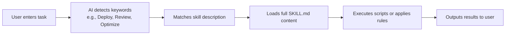

# Getting Started with Agent Skills

## What You'll Learn

- Understand what Agent Skills is and how it extends AI coding agent capabilities
- Learn about the functionality and use cases of three core skill packs
- Know when it's appropriate to use Agent Skills to improve development efficiency

## Your Current Challenges

When using Claude, Cursor, or other AI coding agents in your daily work, you might encounter these problems:
- You want to follow best practices but aren't sure which rules to remember
- You frequently repeat similar deployment operations and want automation
- AI-generated code quality varies, lacking unified standards

## Core Concept

**Agent Skills is a skill pack system**—providing extensible "plugins" for AI coding agents. Each skill contains:

- **SKILL.md**: Skill definition file that tells the AI agent when to activate the skill
- **scripts/**: Helper scripts (such as deployment scripts) that execute specific tasks
- **references/**: Supporting documentation (optional) that provides detailed reference materials

::: tip Design Philosophy
Skills use an **on-demand loading** mechanism: only the skill name and description are loaded at startup, and the full content is read only when the AI determines it's needed. This reduces context usage and improves efficiency.
:::

## Available Skill Packs

The project provides three skill packs, each targeting specific scenarios:

### react-best-practices

React and Next.js performance optimization guidelines from Vercel Engineering standards. Contains 50+ rules sorted by impact level.

**Use Cases**:
- Writing new React components or Next.js pages
- Reviewing code performance issues
- Optimizing bundle size or loading time

**Covered Categories**:
- Eliminate Waterfalls (Critical)
- Bundle Size Optimization (Critical)
- Server Performance (High)
- Client Side Data Fetching (Medium-High)
- Re-render Optimization (Medium)
- Rendering Performance (Medium)
- JavaScript Micro-optimizations (Low-Medium)
- Advanced Patterns (Low)

### web-design-guidelines

Web interface design guidelines audit that checks code against nearly 100 best practices.

**Use Cases**:
- Prompt: "Review my UI"
- Check accessibility
- Audit design consistency
- Check performance and UX

**Covered Categories**:
- Accessibility (aria-labels, semantic HTML, keyboard handling)
- Focus States (visible focus, focus-visible patterns)
- Forms (autocompletion, validation, error handling)
- Animations (prefers-reduced-motion, compositing-friendly transforms)
- Images (sizing, lazy loading, alt text)
- Typography, performance, navigation, and more

### vercel-deploy-claimable

One-click deployment of applications and websites to Vercel, returning preview links and ownership transfer links.

**Use Cases**:
- Prompt: "Deploy my app"
- Quickly share project previews
- Configuration-free, zero-auth deployment

**Core Features**:
- Auto-detects 40+ frameworks (Next.js, Vite, Astro, etc.)
- Returns preview URL (live site) and claim URL (transfer ownership)
- Automatically handles static HTML projects
- Excludes `node_modules` and `.git` during upload

## How Skills Work

When using Claude or other AI agents, the skill activation flow is as follows:



**Example Flow**:

1. **User Input**: "Deploy my app"
2. **AI Detection**: Identifies keyword "Deploy", matches `vercel-deploy` skill
3. **Load Skill**: Reads full `SKILL.md` content
4. **Execute Deployment**:
    - Run `deploy.sh` script
    - Detect framework (read package.json)
    - Package project as tarball
    - Upload to Vercel API
5. **Return Result**:
    ```json
    {
      "previewUrl": "https://skill-deploy-abc123.vercel.app",
      "claimUrl": "https://vercel.com/claim-deployment?code=..."
    }
    ```

## When to Use This Approach

Best times to use Agent Skills:

| Scenario | Skill to Use | Example Trigger Prompt |
| -------- | ------------ | ---------------------- |
| Writing React components | react-best-practices | "Review this React component for performance issues" |
| Optimizing Next.js pages | react-best-practices | "Help me optimize this Next.js page" |
| Checking UI quality | web-design-guidelines | "Check accessibility of my site" |
| Deploying projects | vercel-deploy-claimable | "Deploy my app to production" |

## Security Model

::: info Security Note
- **Local Execution**: All skills execute locally with no data uploaded to third-party services (except Vercel deployment API)
- **On-Demand Activation**: Skills only load detailed content when AI determines relevance, reducing privacy risk
- **Open Source Transparent**: All skills and scripts are open source and auditable
:::

## Common Pitfalls

### Skill Not Activated

If a skill isn't activated, check:
- Whether the prompt contains enough keywords (such as "Deploy", "Review")
- Whether the skill is correctly installed in the `~/.claude/skills/` directory
- If using claude.ai, confirm the skill has been added to the project knowledge base

### Network Permissions

Some skills require network access:
- `vercel-deploy-claimable` needs access to Vercel deployment API
- `web-design-guidelines` needs to pull latest rules from GitHub

**Solution**: Add required domains in claude.ai/settings/capabilities.

## Lesson Summary

Agent Skills is a skill pack system designed for AI coding agents, providing:
- **react-best-practices**: 50+ React/Next.js performance optimization rules
- **web-design-guidelines**: Nearly 100 web design best practices
- **vercel-deploy-claimable**: One-click deployment to Vercel

Skills use an on-demand loading mechanism to reduce context usage. Once installed, AI agents automatically activate corresponding skills for relevant tasks.

## Next Lesson Preview

> In the next lesson, we'll learn **[Installing Agent Skills](../installation/)**.
>
> You'll learn:
> - Two installation methods: Claude Code and claude.ai
> - Configuring network permissions
> - Verifying that skills are correctly installed

---

## Appendix: Source Code Reference

<details>
<summary><strong>Click to expand source code locations</strong></summary>

> Last updated: 2026-01-25

| Feature | File Path | Line Numbers |
| -------- | --------- | ------------ |
| Skill pack list | [`README.md`](https://github.com/vercel-labs/agent-skills/blob/main/README.md#L7-L80) | 7-80 |
| Skill structure explanation | [`README.md`](https://github.com/vercel-labs/agent-skills/blob/main/README.md#L103-L110) | 103-110 |
| AGENTS.md specification | [`AGENTS.md`](https://github.com/vercel-labs/agent-skills/blob/main/AGENTS.md) | Full text |
| Skill directory structure | [`AGENTS.md`](https://github.com/vercel-labs/agent-skills/blob/main/AGENTS.md#L11-L20) | 11-20 |
| SKILL.md format | [`AGENTS.md`](https://github.com/vercel-labs/agent-skills/blob/main/AGENTS.md#L29-L68) | 29-68 |
| Skill packaging command | [`AGENTS.md`](https://github.com/vercel-labs/agent-skills/blob/main/AGENTS.md#L93-L96) | 93-96 |
| User installation method | [`AGENTS.md`](https://github.com/vercel-labs/agent-skills/blob/main/AGENTS.md#L98-L110) | 98-110 |
| On-demand loading mechanism | [`AGENTS.md`](https://github.com/vercel-labs/agent-skills/blob/main/AGENTS.md#L72-L78) | 72-78 |
| Build tool scripts | [`packages/react-best-practices-build/package.json`](https://github.com/vercel-labs/agent-skills/blob/main/packages/react-best-practices-build/package.json) | Full text |

**Key Constants**:
- No hardcoded constants

**Key Functions**:
- `build.ts`: Builds AGENTS.md and test cases
- `validate.ts`: Validates rule file completeness
- `extract-tests.ts`: Extracts test cases from rules

</details>
