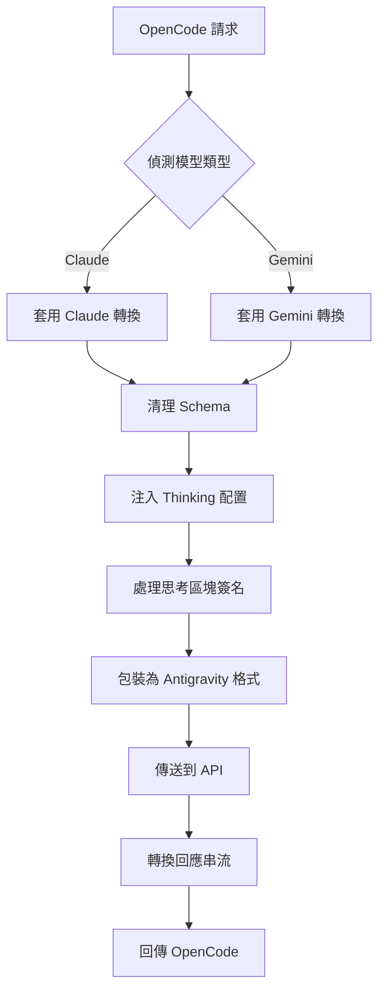

# 請求轉換機制：相容多模型協定

## 學完你能做什麼

- 理解外掛程式如何在 OpenCode 和 Antigravity API 之間轉換請求格式
- 掌握 Claude 和 Gemini 模型的協定差異及轉換規則
- 排查 Schema 不相容導致的 400 錯誤
- 最佳化 Thinking 配置以獲得最佳效能

## 你現在的困境

你可能遇到這些問題：

- ❌ MCP 伺服器回傳 `400 Unknown name 'parameters'` 錯誤
- ❌ 使用 Gemini 模型時提示 `400 Unknown name 'const'`
- ❌ Thinking 模型的思考區塊顯示格式不正確
- ❌ 工具呼叫失敗，提示簽名驗證錯誤
- ❌ 不理解為什麼外掛程式能同時支援 Claude 和 Gemini

## 什麼時候用這一招

當你需要：

| 場景 | 為什麼需要理解轉換機制 |
|---|---|
| 開發自訂 MCP 伺服器 | 確保工具 Schema 相容 Antigravity API |
| 排查 400/500 錯誤 | 判斷是 Schema 問題還是轉換邏輯問題 |
| 最佳化 Thinking 效能 | 理解思考區塊簽名和快取機制 |
| 除錯工具呼叫失敗 | 檢查工具 ID 分配和參數簽名 |

::: warning 前置檢查
開始本教學前，請確保你已經：
- ✅ 安裝了 opencode-antigravity-auth 外掛程式
- ✅ 了解可用模型及其變體
- ✅ 理解 Thinking 模型的基本概念

[模型列表教學](../../platforms/available-models/) | [Thinking 模型教學](../../platforms/thinking-models/)
:::

## 核心思路

請求轉換是外掛程式的核心機制，它做三件事：

1. **攔截 OpenCode 請求** — 攔截 `fetch(generativeLanguage.googleapis.com)` 呼叫
2. **套用模型轉換** — 根據模型類型（Claude/Gemini）轉換格式
3. **包裝並傳送** — 包裝為 Antigravity 格式並呼叫 API
4. **轉換回應** — 將回應轉換回 OpenCode 可識別的格式

**轉換流程圖**：



**關鍵轉換點**：

| 轉換類型 | 目的 | 原始碼位置 |
|---|---|---|
| Schema 清理 | 移除 Antigravity API 不支援的欄位 | `src/plugin/request-helpers.ts` |
| Thinking 配置 | 根據模型族注入正確的思考配置 | `src/plugin/transform/claude.ts`, `src/plugin/transform/gemini.ts` |
| 思考區塊處理 | 剝離歷史思考區塊並注入簽名 | `src/plugin/request.ts` |
| 回應串流轉換 | 將 SSE 事件轉換為 OpenCode 格式 | `src/plugin/core/streaming.ts` |

## 跟我做

### 第 1 步：理解 Claude 轉換規則

**為什麼**
Claude 模型使用不同的協定格式（snake_case、VALIDATED 模式），需要特殊處理。

**關鍵轉換規則**

| 原始格式 | 轉換後格式 | 說明 |
|---|---|---|
| `toolConfig.functionCallingConfig.mode` | `"VALIDATED"` | 強制啟用工具呼叫驗證 |
| `thinkingConfig.includeThoughts` | `include_thoughts` | snake_case 格式 |
| `thinkingConfig.thinkingBudget` | `thinking_budget` | snake_case 格式 |
| `maxOutputTokens` | 自動調整至 64,000 | Thinking 模型需要更大輸出空間 |

**程式碼位置**：[`src/plugin/transform/claude.ts:43-56`](https://github.com/NoeFabris/opencode-antigravity-auth/blob/main/src/plugin/transform/claude.ts#L43-L56)

**範例**

```typescript
// 轉換前（OpenCode 格式）
{
  "toolConfig": {
    "functionCallingConfig": {
      "mode": "AUTO"
    }
  },
  "thinkingConfig": {
    "includeThoughts": true,
    "thinkingBudget": 32000
  }
}

// 轉換後（Antigravity 格式）
{
  "toolConfig": {
    "functionCallingConfig": {
      "mode": "VALIDATED"  // 強制 VALIDATED
    }
  },
  "thinkingConfig": {
    "include_thoughts": true,  // snake_case
    "thinking_budget": 32000   // snake_case
  },
  "generationConfig": {
    "maxOutputTokens": 64000   // Thinking 模型自動調整
  }
}
```

**你應該看到**：
- Claude 模型的所有轉換都遵循 snake_case 命名
- `maxOutputTokens` 會自動調整為足夠大的值（`CLAUDE_THINKING_MAX_OUTPUT_TOKENS = 64,000`）

### 第 2 步：理解 Gemini 轉換規則

**為什麼**
Gemini 模型使用 camelCase 格式，且對 JSON Schema 有嚴格要求（type 大寫）。

**關鍵轉換規則**

| 原始格式 | 轉換後格式 | 說明 |
|---|---|---|
| JSON Schema `type: "object"` | `type: "OBJECT"` | 類型必須大寫 |
| `additionalProperties: false` | 移除 | Gemini API 不支援 |
| `$ref: "#/$defs/Foo"` | 轉換為 `description: "See: Foo"` | 引用轉換為描述 |
| `const: "foo"` | `enum: ["foo"]` | const 轉換為 enum |
| `enum: ["a", "b"]` | 新增描述提示 `(Allowed: a, b)` | 2-10 項枚舉自動新增提示 |

**程式碼位置**：[`src/plugin/transform/gemini.ts:52-124`](https://github.com/NoeFabris/opencode-antigravity-auth/blob/main/src/plugin/transform/gemini.ts#L52-L124)

**範例**

```json
// 轉換前（OpenCode 格式）
{
  "parameters": {
    "type": "object",
    "properties": {
      "status": {
        "type": "string",
        "const": "active",
        "enum": ["active", "inactive"]
      }
    }
  }
}

// 轉換後（Gemini 格式）
{
  "parameters": {
    "type": "OBJECT",  // 大寫
    "properties": {
      "status": {
        "type": "STRING",  // 大寫
        "enum": ["active", "inactive"],  // const 被移除
        "description": "(Allowed: active, inactive)"  // 自動新增提示
      }
    }
  }
}
```

**你應該看到**：
- Gemini Schema 的所有類型都轉為大寫（`STRING`、`OBJECT`、`ARRAY`）
- `const` 欄位被移除並轉換為 `enum`
- 不支援的欄位（`$ref`、`additionalProperties`）被移除

### 第 3 步：理解 Schema 清理流程

**為什麼**
Antigravity API 使用嚴格的 protobuf-backed 驗證，不支援標準 JSON Schema 的所有欄位。

**四階段清理流程**

1. **Phase 1a：轉換 $ref 為描述**
   - `$ref: "#/$defs/Foo"` → `{ description: "See: Foo" }`

2. **Phase 1b：轉換 const 為 enum**
   - `const: "foo"` → `enum: ["foo"]`

3. **Phase 1c：新增枚舉提示**
   - `enum: ["a", "b"]` → 新增 `(Allowed: a, b)` 到描述

4. **Phase 1d：移除不支援的欄位**
   - 刪除：`$schema`、`$defs`、`additionalProperties`、`pattern`、`minLength`、`maxLength` 等

**程式碼位置**：[`src/plugin/request-helpers.ts:20-280`](https://github.com/NoeFabris/opencode-antigravity-auth/blob/main/src/plugin/request-helpers.ts#L20-L280)

**不受支援的欄位列表**：

| 欄位 | 為什麼不支援 | 替代方案 |
|---|---|---|
| `$ref` | 不允許引用 | 轉換為描述提示 |
| `const` | 不允許常數 | 使用 `enum` |
| `additionalProperties` | 不驗證額外屬性 | 在描述中註明 |
| `$schema`、`$defs` | 不使用 JSON Draft | 移除 |
| `pattern`、`minLength`、`maxLength` | 字串限制由伺服器端處理 | 移除 |
| `minItems`、`maxItems` | 陣列限制由伺服器端處理 | 移除 |

**你應該看到**：
- MCP 伺服器的 Schema 被清理為 Antigravity 相容的格式
- 400 錯誤減少，錯誤訊息更清晰

### 第 4 步：理解思考區塊處理機制

**為什麼**
Claude 和 Gemini 3 模型需要穩定的思考區塊簽名，否則會導致簽名驗證錯誤。

**三步處理流程**

1. **剝離歷史思考區塊**
   - 遞迴移除所有歷史 `thinking` 區塊（避免簽名衝突）
   - 使用快取驗證簽名有效性

2. **注入新的思考簽名**
   - 為新的思考區塊生成穩定的簽名
   - 快取簽名用於多輪對話

3. **確保思考區塊順序**
   - Claude：thinking 必須在 tool_use 之前
   - Gemini：thinking 可以出現在任何位置

**程式碼位置**：
- [`src/plugin/request.ts:711-724`](https://github.com/NoeFabris/opencode-antigravity-auth/blob/main/src/plugin/request.ts#L711-L724)

**思考區塊簽名範例**：

```typescript
// Claude Thinking 區塊格式
{
  "type": "thinking",
  "text": "需要分析使用者需求...",
  "signature": "sig-abc123",  // 外掛程式注入的簽名
  "cache_control": { "type": "ephemeral" }  // 快取控制
}

// 歷史思考區塊（被剝離）
{
  "type": "thinking",
  "text": "舊的分析...",  // 被移除
  "signature": "sig-old456"  // 簽名失效
}
```

**你應該看到**：
- 多輪對話中，歷史思考區塊不會重複顯示
- 新思考區塊帶有正確的簽名
- 工具呼叫前有完整的思考過程

### 第 5 步：理解回應串流轉換

**為什麼**
Antigravity API 回傳 SSE（Server-Sent Events）串流，需要轉換為 OpenCode 可識別的格式。

**關鍵轉換規則**

| 原始格式 | 轉換後格式 | 說明 |
|---|---|---|
| `thought: true` | `type: "reasoning"` | 思考區塊格式轉換 |
| `text` | 保持不變 | 文字內容 |
| `tool_use` | 保持不變 | 工具呼叫 |
| `tool_result` | 保持不變 | 工具結果 |

**程式碼位置**：[`src/plugin/core/streaming.ts`](https://github.com/NoeFabris/opencode-antigravity-auth/blob/main/src/plugin/core/streaming.ts)

**SSE 事件範例**：

```
// Antigravity API 回傳
data: {"type": "thinking", "text": "分析中...", "thought": true}

// 轉換後
data: {"type": "reasoning", "text": "分析中..."}

// 文字事件
data: {"type": "text", "text": "你好"}

// 工具呼叫事件
data: {"type": "tool_use", "id": "tool-123", "name": "my_function"}
```

**你應該看到**：
- 思考區塊在介面中正確顯示為 `reasoning` 類型
- 串流回應無延遲，逐行轉換
- 工具呼叫事件格式正確

## 檢查點 ✅

完成上述步驟後，你應該能回答以下問題：

- [ ] Claude 模型的 `toolConfig.mode` 會被設定為什麼？
- [ ] Gemini Schema 的 `type: "string"` 會被轉換為什麼？
- [ ] 為什麼要剝離歷史思考區塊？
- [ ] `const` 欄位會被轉換為什麼格式？
- [ ] 思考區塊的簽名有什麼作用？

## 踩坑提醒

### 坑 1：MCP Schema 包含 $ref 導致 400 錯誤

**錯誤訊息**：`400 Unknown name 'parameters'`

**原因**：MCP 伺服器使用了 JSON Schema 的 `$ref` 引用，Antigravity API 不支援。

**解決方案**：
- 檢查 MCP 伺服器的 Schema 定義
- 移除 `$ref`，直接展開物件結構
- 或修改 MCP 伺服器程式碼

**範例**：

```json
// ❌ 錯誤：使用 $ref
{
  "properties": {
    "data": { "$ref": "#/$defs/DataModel" }
  },
  "$defs": {
    "DataModel": { "type": "string" }
  }
}

// ✅ 正確：直接展開
{
  "properties": {
    "data": { "type": "string" }
  }
}
```

### 坑 2：const 欄位導致 Gemini 模型 400 錯誤

**錯誤訊息**：`400 Unknown name 'const'`

**原因**：Antigravity API 的 Gemini 端點不支援 `const` 欄位。

**解決方案**：
- 手動將 `const` 轉換為 `enum`
- 或依賴外掛程式的自動轉換（已實作）

**範例**：

```json
// ❌ 錯誤：使用 const
{
  "properties": {
    "status": { "type": "string", "const": "active" }
  }
}

// ✅ 正確：使用 enum
{
  "properties": {
    "status": { "type": "string", "enum": ["active"] }
  }
}
```

### 坑 3：Thinking 模型顯示亂碼

**錯誤訊息**：思考區塊顯示為 `[object Object]` 或格式不正確

**原因**：回應轉換邏輯有 bug，或簽名快取失效。

**解決方案**：
1. 檢查除錯紀錄：`opencode --debug`
2. 清除簽名快取：刪除 `~/.config/opencode/antigravity-accounts.json` 中的快取欄位
3. 重新啟動 OpenCode

### 坑 4：工具呼叫失敗，提示簽名錯誤

**錯誤訊息**：`tool_result_missing` 或簽名驗證失敗

**原因**：
- 思考區塊順序錯誤（thinking 必須在 tool_use 之前）
- 簽名快取不一致
- 工具 ID 分配錯誤

**解決方案**：
- 外掛程式會自動重試（會話恢復機制）
- 啟用除錯模式檢視詳細錯誤
- 檢查工具定義是否正確

## 本課小結

請求轉換機制的核心要點：

1. **模型族決定轉換規則** — Claude（snake_case、VALIDATED）vs Gemini（camelCase、Schema 大寫）
2. **Schema 清理是必須的** — 移除 `$ref`、`const`、`additionalProperties` 等不支援的欄位
3. **思考區塊簽名是關鍵** — 穩定的簽名確保多輪對話的一致性
4. **回應串流轉換** — 將 SSE 事件即時轉換為 OpenCode 格式

**關鍵原始碼位置**：
- 主請求轉換：[`src/plugin/request.ts:585`](https://github.com/NoeFabris/opencode-antigravity-auth/blob/main/src/plugin/request.ts#L585)
- Claude 轉換：[`src/plugin/transform/claude.ts`](https://github.com/NoeFabris/opencode-antigravity-auth/blob/main/src/plugin/transform/claude.ts)
- Gemini 轉換：[`src/plugin/transform/gemini.ts`](https://github.com/NoeFabris/opencode-antigravity-auth/blob/main/src/plugin/transform/gemini.ts)
- Schema 清理：[`src/plugin/request-helpers.ts`](https://github.com/NoeFabris/opencode-antigravity-auth/blob/main/src/plugin/request-helpers.ts)
- 串流轉換：[`src/plugin/core/streaming.ts`](https://github.com/NoeFabris/opencode-antigravity-auth/blob/main/src/plugin/core/streaming.ts)

## 下一課預告

> 下一課我們學習 **[會話恢復機制](../session-recovery/)**。
>
> 你會學到：
> - 會話恢復的工作原理
> - 如何自動處理工具呼叫失敗
> - 如何修復損壞的思考區塊順序

---

## 附錄：原始碼參考

<details>
<summary><strong>點擊展開查看原始碼位置</strong></summary>

> 更新時間：2026-01-23

| 功能 | 檔案路徑 | 行號 |
|---|---|---|
| 主請求轉換入口 | [`src/plugin/request.ts`](https://github.com/NoeFabris/opencode-antigravity-auth/blob/main/src/plugin/request.ts#L585) | 585-1443 |
| 回應轉換入口 | [`src/plugin/request.ts`](https://github.com/NoeFabris/opencode-antigravity-auth/blob/main/src/plugin/request.ts#L1445) | 1445-1663 |
| Claude 模型偵測 | [`src/plugin/transform/claude.ts`](https://github.com/NoeFabris/opencode-antigravity-auth/blob/main/src/plugin/transform/claude.ts#L27) | 27-29 |
| Claude Thinking 配置 | [`src/plugin/transform/claude.ts`](https://github.com/NoeFabris/opencode-antigravity-auth/blob/main/src/plugin/transform/claude.ts#L62) | 62-72 |
| Claude Tool 配置 | [`src/plugin/transform/claude.ts`](https://github.com/NoeFabris/opencode-antigravity-auth/blob/main/src/plugin/transform/claude.ts#L43) | 43-57 |
| Gemini 模型偵測 | [`src/plugin/transform/gemini.ts`](https://github.com/NoeFabris/opencode-antigravity-auth/blob/main/src/plugin/transform/gemini.ts#L129) | 129-132 |
| Gemini 3 Thinking 配置 | [`src/plugin/transform/gemini.ts`](https://github.com/NoeFabris/opencode-antigravity-auth/blob/main/src/plugin/transform/gemini.ts) | 尋找 `buildGemini3ThinkingConfig` |
| Gemini Schema 轉換 | [`src/plugin/transform/gemini.ts`](https://github.com/NoeFabris/opencode-antigravity-auth/blob/main/src/plugin/transform/gemini.ts#L52) | 52-124 |
|---|---|---|
|---|---|---|
|---|---|---|
| 思考區塊剝離 | [`src/plugin/request-helpers.ts`](https://github.com/NoeFabris/opencode-antigravity-auth/blob/main/src/plugin/request-helpers.ts) | 尋找 `deepFilterThinkingBlocks` |
| 思考區塊簽名注入 | [`src/plugin/request.ts`](https://github.com/NoeFabris/opencode-antigravity-auth/blob/main/src/plugin/request.ts#L715) | 715-720 |
| 串流回應轉換 | [`src/plugin/core/streaming.ts`](https://github.com/NoeFabris/opencode-antigravity-auth/blob/main/src/plugin/core/streaming.ts) | 全文 |

**關鍵常數**：
- `CLAUDE_THINKING_MAX_OUTPUT_TOKENS = 64_000`（[`src/plugin/transform/claude.ts:18`](https://github.com/NoeFabris/opencode-antigravity-auth/blob/main/src/plugin/transform/claude.ts#L18)）：Claude Thinking 模型的最大輸出 token 限制
- `UNSUPPORTED_SCHEMA_FIELDS`（[`src/plugin/transform/gemini.ts:27`](https://github.com/NoeFabris/opencode-antigravity-auth/blob/main/src/plugin/transform/gemini.ts#L27)）：Gemini API 不支援的 Schema 欄位集合

**關鍵函式**：
- `prepareAntigravityRequest()`（[`src/plugin/request.ts:585`](https://github.com/NoeFabris/opencode-antigravity-auth/blob/main/src/plugin/request.ts#L585)）：準備 Antigravity API 請求的主函式
- `transformAntigravityResponse()`（[`src/plugin/request.ts:1445`](https://github.com/NoeFabris/opencode-antigravity-auth/blob/main/src/plugin/request.ts#L1445)）：轉換 Antigravity API 回應的主函式
- `toGeminiSchema()`（[`src/plugin/transform/gemini.ts:52`](https://github.com/NoeFabris/opencode-antigravity-auth/blob/main/src/plugin/transform/gemini.ts#L52)）：將 JSON Schema 轉換為 Gemini 相容格式
- `cleanJSONSchemaForAntigravity()`（[`src/plugin/request-helpers.ts`](https://github.com/NoeFabris/opencode-antigravity-auth/blob/main/src/plugin/request-helpers.ts)）：四階段 Schema 清理
- `createStreamingTransformer()`（[`src/plugin/core/streaming.ts`](https://github.com/NoeFabris/opencode-antigravity-auth/blob/main/src/plugin/core/streaming.ts)）：建立 SSE 串流轉換器

</details>
