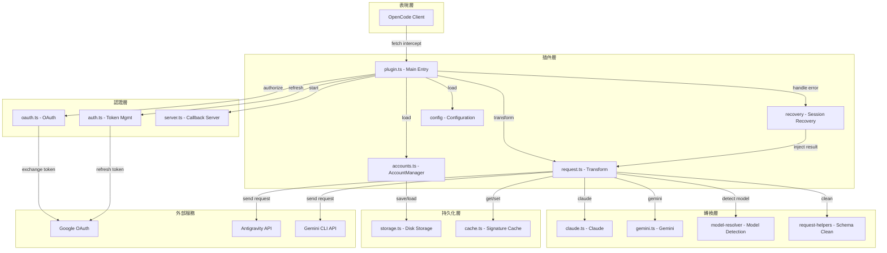
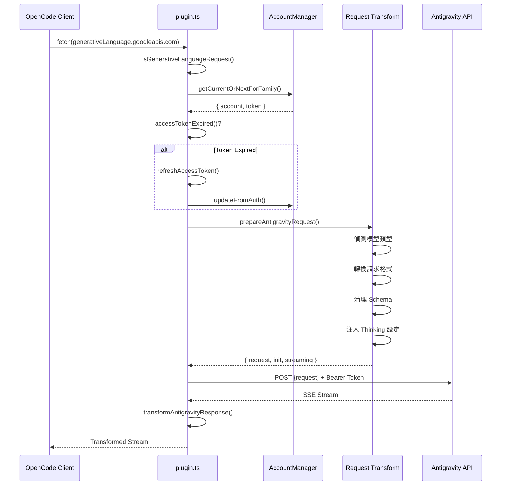
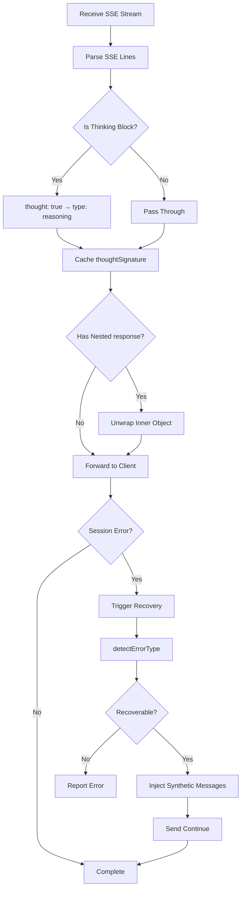
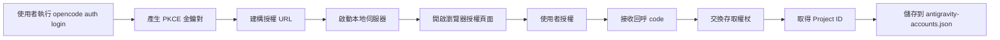

# 插件架構概覽：理解 OpenCode Antigravity Auth 的內部設計

## 學完你能做什麼

本課程將帶你深入理解 Antigravity Auth 插件的架構設計和內部工作原理。完成學習後，你將能夠：

- 理解插件的模組結構和各模組的職責
- 掌握請求從 OpenCode 到 Antigravity API 的完整處理流程
- 了解多帳號管理的負載平衡機制
- 理解會話恢復的工作原理
- 掌握請求格式轉換的技術細節

## 插件的核心價值

Antigravity Auth 插件的核心作用是在 OpenCode 和 Antigravity API 之間架設一座「翻譯橋」：

1. **協議轉換** - 將 OpenCode 的請求格式轉換為 Antigravity API 要求的格式
2. **認證管理** - 透過 Google OAuth 2.0 PKCE 安全取得和更新存取權杖
3. **負載平衡** - 多帳號集區化，自動輪替避免速率限制
4. **錯誤恢復** - 自動偵測和修復會話中斷問題

::: info 為什麼需要架構理解？
了解插件架構能幫助你：
- 快速定位問題所在模組
- 理解設定項的作用範圍
- 優化多帳號使用策略
- 參與插件開發和除錯
:::

## 模組結構總覽

插件採用分層架構，各模組職責清晰：



### 各模組職責

| 模組 | 檔案 | 職責 |
|--- | --- | ---|
| **主入口** | `plugin.ts` | fetch 攔截器、插件初始化、事件處理 |
| **帳號管理** | `accounts.ts` | 多帳號集區、負載平衡策略、速率限制追蹤 |
| **請求轉換** | `request.ts` | 請求格式轉換、回應串流處理 |
| **模型轉換** | `transform/` | Claude/Gemini 特定轉換邏輯 |
| **OAuth 認證** | `antigravity/oauth.ts` | PKCE 認證流程、權杖交換 |
| **會話恢復** | `recovery/` | 錯誤偵測、自動修復中斷會話 |
| **設定管理** | `config/` | 設定載入、Schema 驗證 |
| **儲存層** | `storage.ts` | 帳號持久化（JSON 檔案） |
| **快取層** | `cache.ts` | 簽章快取、減少重複計算 |
| **除錯日誌** | `debug.ts` | 結構化日誌、故障排除 |

## 請求處理流程

當一個模型請求從 OpenCode 發出時，插件會經歷完整的處理鏈路：



### 步驟詳解

**第 1 步：請求攔截**
- 插件透過 `fetch` 攔截器擷取所有對 `generativelanguage.googleapis.com` 的請求
- 使用 `isGenerativeLanguageRequest()` 判斷是否為 Antigravity 相關請求
- 非目標請求直接透傳，避免影響其他功能

**第 2 步：帳號選擇**
- 從帳號集區中選取可用帳號（根據設定的策略：sticky/round-robin/hybrid）
- 檢查權杖是否過期，過期則自動更新
- 應用 PID 偏移（如果啟用），確保多代理場景下帳號分佈均勻

**第 3 步：請求轉換** (`request.ts`)
- **模型偵測**：識別是 Claude 還是 Gemini 模型
- **Thinking 處理**：
  - Claude：剝離所有歷史思考區塊，避免簽章衝突
  - Gemini：新增 `thinkingConfig` 設定
- **Tool 轉換**：將 OpenCode tools 轉換為 `functionDeclarations` 格式
- **Schema 清理**：移除不支援的 JSON Schema 欄位（`const`, `$ref`, `$defs` 等）
- **請求包裝**：封裝為 `{ project, model, request: {...} }` 格式

**第 4 步：發送請求**
- 新增 Antigravity 專用 headers（User-Agent, Client-Metadata）
- 使用 Bearer Token 認證
- 支援 endpoint fallback（daily → autopush → prod）

**第 5 步：回應轉換**
- SSE 串流接收，逐行轉換
- 將 `thought: true` 轉換為 `type: "reasoning"`
- 快取 thinking 簽章用於後續請求
- 展開內層 `response` 物件，保持格式一致性

## 回應處理流程

回應處理主要涉及串流轉換和會話恢復：



### 關鍵處理機制

**1. 思考區塊轉換**

Antigravity API 回傳的思考區塊格式為：
```json
{ "thought": true, "text": "思考內容" }
```

插件將其轉換為 OpenCode 相容格式：
```json
{ "type": "reasoning", "reasoning": "思考內容" }
```

**2. 簽章快取**

Claude 和 Gemini 3 模型在多輪對話中需要匹配思考區塊簽章：
- 從回應中提取 `thoughtSignature`
- 使用 `cacheSignature()` 儲存到記憶體和磁碟
- 下次請求時透過 `getCachedSignature()` 取得並注入

::: tip 為什麼需要簽章快取？
Claude 和 Gemini 3 API 要求工具呼叫前的思考區塊必須有正確的簽章。快取簽章可以：
- 避免簽章錯誤導致的請求失敗
- 減少重複生成相同思考內容
- 提升多輪對話的連續性
:::

**3. 會話恢復**

當偵測到會話錯誤時：
1. 透過 `session.error` 事件擷取錯誤
2. 呼叫 `detectErrorType()` 判斷是否可恢復
3. 對於 `tool_result_missing` 錯誤：
   - 提取失敗的 `tool_use` IDs
   - 注入 synthetic `tool_result` 訊息
   - 自動發送 "continue"（如果啟用）
4. 對於思考區塊順序錯誤：
   - 分析對話狀態
   - 關閉損壞的 turn
   - 啟動新 turn 讓模型重新生成

## 核心機制詳解

### OAuth 認證機制

插件使用 OAuth 2.0 with PKCE（Proof Key for Code Exchange）流程：



**PKCE 安全性**：
- 產生隨機的 `code_verifier` 和 `code_challenge`
- 授權 URL 包含 `code_challenge`，防止中間人攻擊
- 權杖交換時驗證 `code_verifier`，確保請求來自同一用戶端

**權杖管理**：
- Access Token：預設 1 小時過期，過期前 30 分鐘自動更新
- Refresh Token：長期有效，用於取得新的 Access Token
- 持久化到 `~/.config/opencode/antigravity-accounts.json`

### 多帳號管理機制

多帳號管理是插件的核心特性之一，包含以下幾個關鍵元件：

**1. 帳號集區結構**

```typescript
interface AccountPool {
  version: 3;
  accounts: Account[];
  activeIndex: number;
  activeIndexByFamily: {
    claude: number;
    gemini: number;
  };
}
```

**2. 帳號選擇策略**

| 策略 | 描述 | 適用場景 |
|--- | --- | ---|
| **sticky** | 保持目前帳號直到速率限制 | 單會話使用，保留提示詞快取 |
| **round-robin** | 每次請求輪替到下一個帳號 | 多會話並行，最大化輸送量 |
| **hybrid** | 健康評分 + Token bucket + LRU 綜合決策 | 預設策略，平衡效能和可靠性 |

**3. 速率限制追蹤**

每個帳號按模型族獨立追蹤：
- `claude`：Claude 模型配額
- `gemini-antigravity`：Gemini Antigravity 配額
- `gemini-cli`：Gemini CLI 配額

速率限制狀態包含：
- `rateLimitResetTimes`：各配額的重置時間
- `cooldownEndAt`：帳號冷卻結束時間
- `consecutiveFailures`：連續失敗次數

**4. 雙配額集區（Gemini 專用）**

Gemini 模型支援兩個獨立的配額集區：
- **Antigravity 配額**：日常沙盒環境
- **Gemini CLI 配額**：正式環境

透過 `quota_fallback` 設定：
- 優先使用首選配額（由模型後綴決定）
- 首選配額耗盡後，嘗試備用配額
- 雙集區都耗盡時，切換到下一個帳號

**5. PID 偏移最佳化**

啟用 `pid_offset_enabled` 後：
- 不同程序（PID）的代理從不同帳號開始
- 避免所有代理競爭同一帳號
- 適用於多代理並行場景

### 請求轉換機制

請求轉換是插件最複雜的部分，需要處理不同模型的協議差異：

**Claude 模型轉換要點**：

1. **思考區塊處理**
   ```typescript
   // 剝離所有歷史思考區塊（避免簽章衝突）
   const filteredContents = deepFilterThinkingBlocks(contents);

   // 建構新的 thinkingConfig
   const thinkingConfig = {
     budgetTokens: variantThinkingConfig?.budget || DEFAULT_THINKING_BUDGET,
   };
   ```

2. **Tool Schema 清理**
   - 白名單保留：`type`, `properties`, `required`, `description`, `enum`, `items`
   - 移除欄位：`const`, `$ref`, `$defs`, `default`, `examples`, `additionalProperties`, `$schema`, `title`
   - 特殊轉換：`const: "value"` → `enum: ["value"]`

3. **工具注入參數簽章**
   ```typescript
   injectParameterSignatures(tool, signature) {
     tool.description += `\n\nParameters: ${signature}`;
   }
   ```

**Gemini 模型轉換要點**：

1. **Thinking 設定**
   ```typescript
   // Gemini 3 Pro/Flash
   if (isGemini3Model(model)) {
     request.thinkingConfig = {
       thinkingLevel: "high" | "medium" | "low" | "minimal",
     };
   }

   // Gemini 2.5
   else if (isGemini2Model(model)) {
     request.thinkingConfig = {
       thinkingLevel: "high" | "medium" | "low",
     };
   }
   ```

2. **Google Search Grounding**
   ```typescript
   if (webSearchConfig) {
     request.generationConfig = {
       ...request.generationConfig,
       dynamicRetrievalConfig: {
         mode: webSearchConfig.mode, // "auto" | "off"
         dynamicRetrievalConfig: {
           scoreThreshold: webSearchConfig.threshold, // 0.0 - 1.0
         },
       },
     };
   }
   ```

3. **圖片產生設定**
   ```typescript
   if (isImageGenerationModel(model)) {
     request.generationConfig = {
       ...request.generationConfig,
       responseModalities: ["IMAGE", "TEXT"],
     };
   }
   ```

### 會話恢復機制

會話恢復機制確保對話在意外中斷後能夠繼續：

**1. 錯誤偵測**

```typescript
function detectErrorType(error: unknown): RecoverableError | null {
  if (errorString.includes("tool_use ids were found without tool_result")) {
    return { type: "tool_result_missing" };
  }
  if (errorString.includes("Expected thinking but found text")) {
    return { type: "thinking_order_error" };
  }
  return null;
}
```

**2. Turn 邊界偵測**

```typescript
// Turn 邊界 = 使用者訊息後第一個 assistant 訊息
function analyzeConversationState(messages: Message[]): ConversationState {
  const lastUserMessage = findLastMessageByRole(messages, "user");
  const firstAssistantAfterUser = messages.find(m =>
    m.role === "assistant" && m.timestamp > lastUserMessage.timestamp
  );

  return {
    isTurnStart: true,
    turnAssistantMessage: firstAssistantAfterUser,
  };
}
```

**3. Synthetic 訊息注入**

```typescript
// 注入 synthetic tool_result
function createSyntheticErrorResponse(toolUseIds: string[]): Message[] {
  return toolUseIds.map(id => ({
    type: "tool_result",
    tool_use_id: id,
    content: "Operation cancelled",
    isSynthetic: true,
  }));
}

// 關閉損壞的 turn
function closeToolLoopForThinking(sessionId: string): Message[] {
  return [
    {
      type: "text",
      text: "[Conversation turn closed due to error]",
      isSynthetic: true,
    },
  ];
}
```

**4. Auto-Resume**

啟用 `auto_resume` 後，恢復流程會自動發送繼續指令：
```typescript
await client.session.prompt({
  path: { id: sessionID },
  body: { parts: [{ type: "text", text: config.resume_text }] },
  query: { directory },
});
```

## 本課小結

本課程深入解析了 Antigravity Auth 插件的架構設計：

**核心架構**：
- 分層模組設計，職責清晰
- 插件層、認證層、轉換層、持久化層各司其職
- 透過 `plugin.ts` 作為統一入口協調各模組

**請求流程**：
- 攔截 → 帳號選擇 → 權杖更新 → 請求轉換 → 發送請求 → 回應轉換
- 每個步驟都有詳細的錯誤處理和重試機制

**關鍵機制**：
- **OAuth 2.0 PKCE**：安全認證流程
- **多帳號管理**：負載平衡、速率限制追蹤、雙配額集區
- **請求轉換**：協議相容、Schema 清理、Thinking 處理
- **會話恢復**：自動偵測錯誤、注入 synthetic 訊息、Auto-Resume

理解這些機制將幫助你更好地使用和優化插件設定，以及參與插件的開發和除錯。

## 下一課預告

> 下一課我們學習 **[Antigravity API 內部規範](../api-spec/)**。
>
> 你將學到：
> - Antigravity API 的請求和回應格式
> - 各端點的功能和參數
> - 錯誤碼和狀態碼含義
> - 進階功能和實驗性特性

---

## 附錄：原始碼參考

<details>
<summary><strong>點擊展開查看原始碼位置</strong></summary>

> 更新時間：2026-01-23

| 功能 | 檔案路徑 | 行號 |
|--- | --- | ---|
| 插件主入口、fetch 攔截器 | [`src/plugin.ts`](https://github.com/NoeFabris/opencode-antigravity-auth/blob/main/src/plugin.ts) | 654-1334 |
| 帳號管理器、負載平衡 | [`src/plugin/accounts.ts`](https://github.com/NoeFabris/opencode-antigravity-auth/blob/main/src/plugin/accounts.ts) | 1-715 |
| 請求轉換、回應串流 | [`src/plugin/request.ts`](https://github.com/NoeFabris/opencode-antigravity-auth/blob/main/src/plugin/request.ts) | 1-1664 |
| Claude 模型轉換 | [`src/plugin/transform/claude.ts`](https://github.com/NoeFabris/opencode-antigravity-auth/blob/main/src/plugin/transform/claude.ts) | 全文 |
| Gemini 模型轉換 | [`src/plugin/transform/gemini.ts`](https://github.com/NoeFabris/opencode-antigravity-auth/blob/main/src/plugin/transform/gemini.ts) | 全文 |
| 會話恢復 | [`src/plugin/recovery/index.ts`](https://github.com/NoeFabris/opencode-antigravity-auth/blob/main/src/plugin/recovery/index.ts) | 全文 |
| 思考區塊恢復 | [`src/plugin/recovery/thinking-recovery.ts`](https://github.com/NoeFabris/opencode-antigravity-auth/blob/main/src/plugin/recovery/thinking-recovery.ts) | 全文 |
| OAuth 認證 | [`src/antigravity/oauth.ts`](https://github.com/NoeFabris/opencode-antigravity-auth/blob/main/src/antigravity/oauth.ts) | 1-271 |
| 權杖管理 | [`src/plugin/token.ts`](https://github.com/NoeFabris/opencode-antigravity-auth/blob/main/src/plugin/token.ts) | 全文 |
| 設定 Schema | [`src/plugin/config/schema.ts`](https://github.com/NoeFabris/opencode-antigravity-auth/blob/main/src/plugin/config/schema.ts) | 1-373 |
| 帳號儲存 | [`src/plugin/storage.ts`](https://github.com/NoeFabris/opencode-antigravity-auth/blob/main/src/plugin/storage.ts) | 全文 |
| 簽章快取 | [`src/plugin/cache.ts`](https://github.com/NoeFabris/opencode-antigravity-auth/blob/main/src/plugin/cache.ts) | 全文 |
| 除錯日誌 | [`src/plugin/debug.ts`](https://github.com/NoeFabris/opencode-antigravity-auth/blob/main/src/plugin/debug.ts) | 全文 |

**關鍵常數**：
- `MAX_OAUTH_ACCOUNTS = 10`：最大帳號數
- `RATE_LIMIT_DEDUP_WINDOW_MS = 2000`：速率限制去重視窗（2 秒）
- `RATE_LIMIT_STATE_RESET_MS = 120000`：速率限制狀態重置時間（2 分鐘）
- `FAILURE_COOLDOWN_MS = 30000`：帳號冷卻時間（30 秒）

**關鍵函數**：
- `createAntigravityPlugin()`：插件主入口函數
- `prepareAntigravityRequest()`：請求轉換主函數
- `transformAntigravityResponse()`：回應串流轉換函數
- `AccountManager.getCurrentOrNextForFamily()`：帳號選擇函數
- `handleSessionRecovery()`：會話恢復處理函數
- `refreshAccessToken()`：權杖更新函數

</details>
