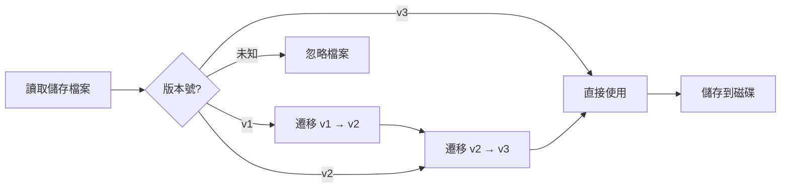

# 帳戶儲存格式與版本管理

## 學完你能做什麼

- 理解帳戶儲存檔案的結構和各欄位含義
- 手動編輯儲存檔案（僅在必要時）
- 了解版本遷移機制和相容性
- 跨機器遷移帳戶設定

## 你現在的困境

你可能遇到以下情況：

- 想備份或遷移帳戶到另一台機器
- 手動修改 `projectId` 或刪除失效帳戶
- 看到版本警告或遷移日誌，想了解發生了什麼
- 多台機器間同步帳戶狀態

## 檔案位置

帳戶儲存檔案位於：

| 作業系統   | 路徑                                                       |
|--- | ---|
| macOS/Linux | `~/.config/opencode/antigravity-accounts.json`             |
| Windows    | `%APPDATA%\opencode\antigravity-accounts.json`                |

::: warning 安全提醒
此檔案包含 **OAuth refresh tokens**，相當於密碼檔案。請勿分享給他人，也不要提交到 Git 倉庫。
:::

## 儲存格式版本

儲存格式有版本控制，目前是 **v3**。插件會自動處理版本遷移，無需手動介入。

### v3 格式（目前版本）

```json
{
  "version": 3,
  "accounts": [
    {
      "email": "user1@gmail.com",
      "refreshToken": "1//0abc...",
      "projectId": "my-gcp-project",
      "managedProjectId": "managed-project-123",
      "addedAt": 1737600000000,
      "lastUsed": 1737603600000,
      "lastSwitchReason": "initial",
      "rateLimitResetTimes": {
        "claude": 1737607200000,
        "gemini-antigravity": 1737607200000,
        "gemini-cli": 1737607200000
      },
      "coolingDownUntil": 1737600000000,
      "cooldownReason": "auth-failure"
    }
  ],
  "activeIndex": 0,
  "activeIndexByFamily": {
    "claude": 0,
    "gemini": 0
  }
}
```

**欄位說明**：

| 欄位                  | 類型    | 必填 | 說明 |
|--- | --- | --- | ---|
| `version`             | number  | Y    | 儲存格式版本（固定為 3） |
| `accounts`            | array   | Y    | 帳戶列表 |
| `activeIndex`         | number  | Y    | 目前活動帳戶索引（從 0 開始） |
| `activeIndexByFamily` | object  | N    | 按模型族分別追蹤活動帳戶（`claude`/`gemini`） |

**帳戶物件欄位**：

| 欄位                  | 類型    | 必填 | 說明 |
|--- | --- | --- | ---|
| `email`               | string  | N    | Google 帳戶電子郵件 |
| `refreshToken`        | string  | Y    | OAuth refresh 令牌（唯一識別） |
| `projectId`           | string  | N    | GCP 專案 ID（Gemini CLI 模型需要） |
| `managedProjectId`     | string  | N    | 託管專案 ID |
| `addedAt`             | number  | Y    | 新增時間戳（Unix 毫秒） |
| `lastUsed`            | number  | Y    | 最後使用時間戳 |
| `lastSwitchReason`    | string  | N    | 切換原因：`"rate-limit"` / `"initial"` / `"rotation"` |
| `rateLimitResetTimes` | object  | N    | 速率限制重置時間（按配額池分別追蹤） |
| `coolingDownUntil`    | number  | N    | 帳戶冷卻結束時間戳 |
| `cooldownReason`      | string  | N    | 冷卻原因：`"auth-failure"` / `"network-error"` / `"project-error"` |

### v2 格式（歷史版本）

v2 格式與 v3 類似，但有以下差異：

- `rateLimitResetTimes` 只有 `claude` 和 `gemini` 兩個欄位
- 沒有 `coolingDownUntil` 和 `cooldownReason`
- 沒有 `activeIndexByFamily`（所有模型共用一個活動帳戶）

遷移時，`gemini` 欄位會被對應到 `gemini-antigravity`，`gemini-cli` 配額池初始化為空。

### v1 格式（歷史版本）

v1 格式使用布林標記和單一時間戳：

```json
{
  "version": 1,
  "accounts": [
    {
      "email": "user1@gmail.com",
      "refreshToken": "1//0abc...",
      "isRateLimited": true,
      "rateLimitResetTime": 1737607200000
    }
  ],
  "activeIndex": 0
}
```

遷移時，如果 `isRateLimited` 為 `true` 且 `rateLimitResetTime` 未過期，會同時設定 `claude` 和 `gemini` 的重置時間。

## 版本遷移機制

插件在載入儲存檔案時會自動檢測版本並執行遷移：



**遷移規則**：

1. **自動遷移**：遷移後自動儲存新格式到磁碟
2. **保留資料**：未過期的速率限制狀態會被保留
3. **失敗降級**：如果儲存失敗，繼續在記憶體中使用遷移後的資料
4. **向前相容**：新版本插件可以讀取舊格式檔案

## 儲存機制細節

### 檔案鎖定

使用 `proper-lockfile` 確保多進程安全存取：

- **鎖定機制**：寫入時建立鎖定檔案（`.antigravity-accounts.json.lock`）
- **逾時設定**：鎖定檔案 10 秒後過期（防止死鎖）
- **重試策略**：最多重試 5 次，退避時間 100ms → 1000ms
- **原子寫入**：先寫入暫存檔案（`.tmp`），再重新命名到目標檔案

### 帳戶合併

當多個進程同時寫入儲存檔案時，會執行合併策略：

```typescript
// 合併邏輯
function mergeAccountStorage(existing, incoming) {
  // 以 refreshToken 為 key 合併帳戶
  // 保留手動設定的 projectId/managedProjectId
  // 合併 rateLimitResetTimes
  // 保留較大的 lastUsed
}
```

### 去重機制

基於 `email` 去重，保留每個信箱的最新帳戶（按 `lastUsed`，其次按 `addedAt`）：

```typescript
// 去重規則
1. 無 email 的帳戶 → 保留（無法去重）
2. 相同 email 的帳戶 → 保留 lastUsed 最大的
3. lastUsed 相同 → 保留 addedAt 最大的
```

## 手動編輯指南

::: danger 手動編輯風險
編輯儲存檔案時，插件進程不應執行，否則可能被覆蓋。建議在編輯前停止 OpenCode。
:::

### 新增帳戶

手動新增帳戶時，至少需要提供 `refreshToken`：

```json
{
  "accounts": [
    {
      "refreshToken": "從其他機器複製或從 OAuth 流程取得",
      "email": "user@example.com",
      "addedAt": Date.now(),
      "lastUsed": Date.now()
    }
  ]
}
```

### 刪除帳戶

從 `accounts` 陣列中刪除對應條目，然後調整 `activeIndex`：

```json
{
  "accounts": [
    { "email": "user1@gmail.com", "refreshToken": "..." },  // 保留
    // { "email": "user2@gmail.com", "refreshToken": "..." },  // 刪除
    { "email": "user3@gmail.com", "refreshToken": "..." }   // 保留
  ],
  "activeIndex": 0  // 確保索引在有效範圍內
}
```

### 修改 projectId

為帳戶新增或修改 `projectId`：

```json
{
  "accounts": [
    {
      "email": "user@gmail.com",
      "refreshToken": "1//0abc...",
      "projectId": "your-gcp-project-id"  // 新增或修改
    }
  ]
}
```

### 清除速率限制狀態

手動清除速率限制標記：

```json
{
  "accounts": [
    {
      "email": "user@gmail.com",
      "refreshToken": "1//0abc...",
      "rateLimitResetTimes": {}  // 清空或刪除此欄位
    }
  ]
}
```

## 跨機器遷移

### 簡單遷移

直接複製儲存檔案到目標機器的設定目錄：

```bash
# macOS/Linux
cp ~/.config/opencode/antigravity-accounts.json /path/to/backup/

# Windows
copy %APPDATA%\opencode\antigravity-accounts.json backup\
```

### 合併帳戶

如果目標機器已有帳戶，插件會自動合併（基於 `refreshToken` 去重）。

**手動合併步驟**：

1. 備份兩台機器的儲存檔案
2. 開啟兩個檔案，複製目標帳戶陣列到來源檔案
3. 調整 `activeIndex` 和 `activeIndexByFamily`
4. 儲存並重新啟動插件

## 常見問題

### 遷移失敗怎麼辦？

如果遷移失敗，插件會在日誌中記錄警告：

```
Failed to persist migrated storage: { error: "..." }
```

**解決方法**：

1. 檢查檔案權限
2. 確認磁碟空間充足
3. 手動備份舊檔案後刪除，重新新增帳戶

### 版本不相容錯誤

如果看到「Unknown storage version」錯誤：

```json
{
  "version": 99  // 未知版本
}
```

**解決方法**：

1. 備份目前檔案
2. 手動將 `version` 改為 `2` 或 `3`
3. 重新啟動插件觸發遷移
4. 如果遷移失敗，刪除檔案重新新增帳戶

### 帳戶去重遺失

如果發現重複帳戶被刪除：

**原因**：插件基於 `email` 去重，保留最新使用的帳戶。

**解決方法**：如果需要保留兩個相同信箱的帳戶（罕見場景），手動編輯檔案，確保 `email` 欄位為空或不同。

## 本課小結

- 儲存檔案位置：`~/.config/opencode/antigravity-accounts.json`
- 目前版本：v3，支援雙配額池和冷卻機制
- 自動遷移：v1/v2 會自動升級到 v3
- 檔案鎖定：使用 `proper-lockfile` 確保並發安全
- 手動編輯：建議停止插件後再編輯，避免被覆蓋

## 下一課預告

> 下一課我們學習 **[所有設定選項](../all-config-options/)**。
>
> 你會學到：
> - 完整的設定選項列表
> - 每個選項的預設值和作用域
> - 進階設定技巧

---

## 附錄：原始碼參考

<details>
<summary><strong>點擊展開查看原始碼位置</strong></summary>

> 更新時間：2026-01-23

| 功能           | 檔案路徑                                                                                                      | 行號    |
|--- | --- | ---|
| 儲存格式定義   | [`src/plugin/storage.ts`](https://github.com/NoeFabris/opencode-antigravity-auth/blob/main/src/plugin/storage.ts)      | 128-198 |
| v1 → v2 遷移  | [`src/plugin/storage.ts`](https://github.com/NoeFabris/opencode-antigravity-auth/blob/main/src/plugin/storage.ts)      | 366-395 |
| v2 → v3 遷移  | [`src/plugin/storage.ts`](https://github.com/NoeFabris/opencode-antigravity-auth/blob/main/src/plugin/storage.ts)      | 397-431 |
| 載入帳戶       | [`src/plugin/storage.ts`](https://github.com/NoeFabris/opencode-antigravity-auth/blob/main/src/plugin/storage.ts)      | 433-518 |
| 儲存帳戶       | [`src/plugin/storage.ts`](https://github.com/NoeFabris/opencode-antigravity-auth/blob/main/src/plugin/storage.ts)      | 520-536 |
| 檔案鎖定機制   | [`src/plugin/storage.ts`](https://github.com/NoeFabris/opencode-antigravity-auth/blob/main/src/plugin/storage.ts)      | 219-257 |
| 帳戶合併       | [`src/plugin/storage.ts`](https://github.com/NoeFabris/opencode-antigravity-auth/blob/main/src/plugin/storage.ts)      | 259-299 |
| 去重機制       | [`src/plugin/storage.ts`](https://github.com/NoeFabris/opencode-antigravity-auth/blob/main/src/plugin/storage.ts)      | 301-364 |

**關鍵類型定義**：

- `AccountStorageV1`：v1 儲存格式
- `AccountStorageV2`：v2 儲存格式
- `AccountStorageV3`：v3 儲存格式（目前）
- `RateLimitStateV3`：v3 速率限制狀態（支援多配額池）

**關鍵函式**：

- `loadAccounts()`：載入帳戶並執行遷移
- `saveAccounts()`：儲存帳戶（帶檔案鎖定和合併）
- `migrateV1ToV2()`：v1 → v2 遷移
- `migrateV2ToV3()`：v2 → v3 遷移
- `mergeAccountStorage()`：合併兩個儲存物件
- `deduplicateAccountsByEmail()`：基於 email 去重

</details>
