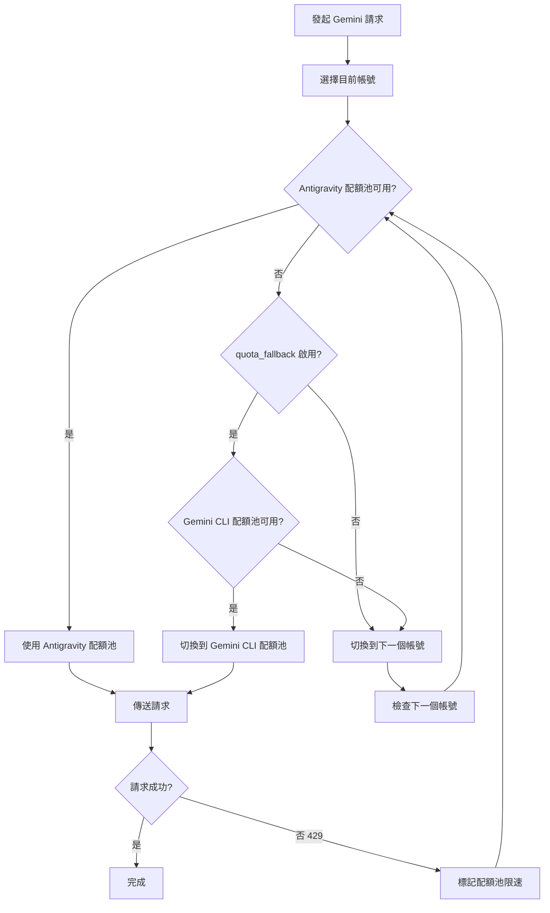

# 雙配額系統：理解 Antigravity 和 Gemini CLI 配額池

## 學完你能做什麼

- 理解每個帳號如何擁有兩個獨立的 Gemini 配額池
- 啟用自動在 Antigravity 和 Gemini CLI 配額池之間 fallback
- 明確指定模型使用某個特定的配額池
- 透過雙配額系統最大化你的配額使用率

---

## 你現在的困境

你正在用 Antigravity Auth 外掛程式呼叫 Gemini 模型，經常遇到配額限制，但可能不了解**雙配額系統**：

- 一個請求被限速後，需要等待配額重置才能繼續
- 雖然設定了多個帳號，但每個帳號的 Gemini 配額還是不夠用
- 不清楚為什麼有的模型可以請求，有的卻頻繁 429

**核心痛點**：你以為每個帳號只有一個 Gemini 配額池，但實際上每個帳號擁有 **兩個獨立** 的配額池，如果設定得當，可以翻倍你的 Gemini 配額。

---

## 核心思路

### 什麼是雙配額系統？

**雙配額系統**是 Antigravity Auth 外掛程式為每個帳號維護兩個獨立 Gemini 配額池的機制。Antigravity 和 Gemini CLI 配額池獨立追蹤限速狀態，當 Antigravity 限速時可切換到 CLI 配額池，實現配額翻倍。

Antigravity Auth 外掛程式為每個 Google 帳號維護 **兩個獨立的 Gemini 配額池**：

| 配額池 | 類型 | 優先順序 | 重置規則 |
| --- | --- | --- | --- |
| **Antigravity** | 主要配額池 | 優先使用 | 根據伺服器端回傳的重置時間動態計算 |
| **Gemini CLI** | 備用配額池 | fallback 使用 | 根據伺服器端回傳的重置時間動態計算 |

每個配額池的速率限制狀態獨立追蹤，互不影響。這意味著：

- Antigravity 配額池限速時，如果 Gemini CLI 配額池還可用，可以自動切換
- 相當於每個帳號的 Gemini 配額**翻倍**

### 明確指定 vs 自動 fallback

有兩種方式使用雙配額系統：

1. **明確指定**：在模型名稱後加上 `:antigravity` 或 `:gemini-cli` 後綴，強制使用某個配額池
2. **自動 fallback**：啟用 `quota_fallback` 設定，讓外掛程式自動在兩個配額池之間切換

**預設行為**：不啟用自動 fallback，只使用 Antigravity 配額池

---

## 跟我做

### 第 1 步：啟用自動 fallback

開啟你的 `~/.config/opencode/antigravity.json` 設定檔：

```bash
cat ~/.config/opencode/antigravity.json
```

新增或修改 `quota_fallback` 設定：

```json
{
  "quota_fallback": true
}
```

**為什麼**：預設情況下 `quota_fallback` 為 `false`，外掛程式只使用 Antigravity 配額池。啟用後，當 Antigravity 限速時會自動嘗試 Gemini CLI 配額池。

你應該看到設定檔已更新。

---

### 第 2 步：觀察自動 fallback 行為

發起一個 Gemini 模型請求（例如使用 Gemini 3 Flash）：

```bash
opencode run "解釋什麼是量子計算" --model=google/antigravity-gemini-3-flash
```

如果 Antigravity 配額池限速，你會看到以下自動 fallback 行為：

```
[Toast 提示] Antigravity quota exhausted, using Gemini CLI quota
```

外掛程式會：

1. 偵測到 Antigravity 配額池限速（429 回應）
2. 嘗試切換到 Gemini CLI 配額池（如果未限速）
3. 使用新的配額池重新傳送請求
4. 顯示 toast 通知告知切換行為

**為什麼**：這是自動 fallback 的核心邏輯——在同一帳號的兩個配額池之間切換，而不是立即切換到下一個帳號。

你應該看到請求成功完成，而不是因配額限制失敗。

---

### 第 3 步：明確指定配額池

如果你想強制使用某個特定的配額池，可以在模型名稱後加上後綴：

**使用 Antigravity 配額池**（透過 `antigravity-` 前綴）：

```bash
opencode run "解釋什麼是量子計算" --model=google/antigravity-gemini-3-flash
```

**使用 Gemini CLI 配額池**（不帶 `antigravity-` 前綴）：

```bash
opencode run "解釋什麼是量子計算" --model=google/gemini-3-flash-preview
```

**為什麼**：透過 `antigravity-` 前綴可以明確指定使用 Antigravity 配額池；不帶前綴則使用 Gemini CLI 配額池。此時外掛程式會忽略 `quota_fallback` 設定，如果指定的配額池限速，會立即切換到下一個帳號，而不是嘗試另一個配額池。

你應該看到請求被路由到指定的配額池。

---

### 第 4 步：檢視配額狀態（除錯模式）

如果你想檢視每個配額池的速率限制狀態，啟用除錯模式：

編輯 `~/.config/opencode/antigravity.json`：

```json
{
  "quota_fallback": true,
  "debug": true
}
```

發起請求後，檢視記錄檔：

```bash
tail -f ~/.config/opencode/antigravity-logs/*.log
```

你會看到類似的記錄：

```
[DEBUG] headerStyle=antigravity explicit=false
[DEBUG] quota fallback: gemini-cli
[INFO] rate-limit triggered for account 0, family gemini, quota: gemini-antigravity
```

**為什麼**：除錯記錄可以讓你清楚看到外掛程式選擇了哪個配額池，以及何時觸發了 fallback。這對排查配額問題非常有幫助。

你應該看到詳細的配額切換記錄。

---

## 檢查點 ✅

### 驗證自動 fallback 已啟用

```bash
cat ~/.config/opencode/antigravity.json | grep quota_fallback
```

你應該看到：

```json
"quota_fallback": true
```

### 驗證明確指定後綴

嘗試使用帶後綴的模型名稱，確認不會報錯：

```bash
opencode run "測試" --model=google/antigravity-gemini-3-flash:gemini-cli
```

你應該看到請求成功完成。

### 驗證除錯記錄

```bash
ls -la ~/.config/opencode/antigravity-logs/
```

你應該看到記錄檔存在，且包含配額切換相關資訊。

---

## 踩坑提醒

### 坑 1：明確指定後綴時不會 fallback

**問題**：你在模型名稱後加上了 `:antigravity` 或 `:gemini-cli` 後綴，但 `quota_fallback` 似乎不起作用。

**原因**：明確指定後綴時，外掛程式會忽略 `quota_fallback` 設定，強制使用指定的配額池。如果該配額池限速，會立即切換到下一個帳號，而不是嘗試另一個配額池。

**解決方案**：
- 如果你想用自動 fallback，不要在模型名稱後加上後綴
- 如果你想強制使用某個配額池，加上後綴即可

### 坑 2：Claude 模型沒有雙配額系統

**問題**：你啟用了 `quota_fallback`，但 Claude 模型似乎沒有 fallback 行為。

**原因**：雙配額系統**僅適用於 Gemini 模型**。Claude 模型只使用 Antigravity 配額池，沒有 Gemini CLI 配額池。

**解決方案**：
- Claude 模型不需要設定雙配額系統
- 只有多帳號輪換可以提升 Claude 配額

### 坑 3：除錯記錄過多影響效能

**問題**：啟用了 `debug: true`，但記錄檔增長過快。

**原因**：除錯模式會記錄所有請求細節，包括配額切換、帳號選擇等。

**解決方案**：
- 除錯完成後，關閉 `debug` 設定
- 或定期清理記錄檔：`rm ~/.config/opencode/antigravity-logs/*.log`

---

## 雙配額系統工作流程圖

以下是自動 fallback 的工作流程：



---

## 雙配額池的獨立追蹤機制

### 配額鍵定義

外掛程式使用以下配額鍵來追蹤速率限制（原始碼：`accounts.ts:77`）：

| 配額鍵 | 含義 |
| --- | --- |
| `claude` | Claude 模型配額 |
| `gemini-antigravity` | Gemini Antigravity 配額池 |
| `gemini-cli` | Gemini CLI 配額池 |

每個帳號的 `rateLimitResetTimes` 物件儲存這些配額鍵的重置時間戳記：

```json
{
  "rateLimitResetTimes": {
    "claude": 1234567890,
    "gemini-antigravity": 1234567890,
    "gemini-cli": 1234567890
  }
}
```

### 可用配額池檢查

當選擇配額池時，外掛程式會按以下順序檢查（原始碼：`accounts.ts:545-557`）：

1. **Antigravity 配額池**：如果未限速，直接使用
2. **Gemini CLI 配額池**：如果 Antigravity 限速且此池可用，使用此池
3. **回傳 null**：兩個池都限速，觸發帳號切換

---

## 配額池切換的觸發條件

自動 fallback 會在以下條件滿足時觸發：

| 條件 | 說明 | 原始碼位置 |
| --- | --- | --- |
| `quota_fallback = true` | 設定已啟用自動 fallback | `config/schema.ts:234` |
| 目前帳號的 Antigravity 配額池限速 | 收到 429 回應 | `plugin.ts:1149` |
| 模型未明確指定配額池 | 模型名稱不包含 `:antigravity` 或 `:gemini-cli` 後綴 | `plugin.ts:1151` |
| 目前帳號的 Gemini CLI 配額池可用 | 未限速 | `accounts.ts:553` |

如果任何一條不滿足，外掛程式會直接切換到下一個帳號，而不是嘗試 fallback。

---

## 本課小結

本課我們學習了 Antigravity Auth 外掛程式的雙配額系統：

- **雙配額池**：每個帳號擁有 Antigravity 和 Gemini CLI 兩個獨立的 Gemini 配額池
- **自動 fallback**：啟用 `quota_fallback` 後，Antigravity 限速時自動嘗試 Gemini CLI 配額池
- **明確指定**：使用 `:antigravity` 或 `:gemini-cli` 後綴強制使用某個配額池
- **獨立追蹤**：每個配額池的速率限制狀態獨立儲存和檢查
- **僅限 Gemini**：雙配額系統只適用於 Gemini 模型，Claude 模型只有 Antigravity 配額池

透過合理使用雙配額系統，你可以將每個帳號的 Gemini 配額翻倍，減少因配額限制導致的請求失敗。

---

## 下一課預告

> 下一課我們學習 **[多帳號設定：設定負載平衡提升配額](../../advanced/multi-account-setup/)**。
>
> 你會學到：
> - 如何新增多個 Google 帳號
> - 設定不同帳號選擇策略的最佳實務
> - 多帳號情境下的配額池使用技巧

---

## 附錄：原始碼參考

<details>
<summary><strong>點擊展開檢視原始碼位置</strong></summary>

> 更新時間：2026-01-23

| 功能 | 檔案路徑 | 行號 |
| --- | --- | --- |
| 配額鍵定義（BaseQuotaKey） | [`src/plugin/accounts.ts`](https://github.com/NoeFabris/opencode-antigravity-auth/blob/main/src/plugin/accounts.ts#L77-L78) | 77-78 |
| 取得配額鍵（getQuotaKey） | [`src/plugin/accounts.ts`](https://github.com/NoeFabris/opencode-antigravity-auth/blob/main/src/plugin/accounts.ts#L107-L116) | 107-116 |
| 檢查配額池限速狀態 | [`src/plugin/accounts.ts`](https://github.com/NoeFabris/opencode-antigravity-auth/blob/main/src/plugin/accounts.ts#L134-L152) | 134-152 |
| 取得可用配額池 | [`src/plugin/accounts.ts`](https://github.com/NoeFabris/opencode-antigravity-auth/blob/main/src/plugin/accounts.ts#L545-L557) | 545-557 |
| quota_fallback 設定定義 | [`src/plugin/config/schema.ts`](https://github.com/NoeFabris/opencode-antigravity-auth/blob/main/src/plugin/config/schema.ts#L224-L234) | 224-234 |
| 自動 fallback 邏輯 | [`src/plugin/plugin.ts`](https://github.com/NoeFabris/opencode-antigravity-auth/blob/main/src/plugin/plugin.ts#L1151-L1163) | 1151-1163 |
| 雙配額系統文件 | [`docs/MULTI-ACCOUNT.md`](https://github.com/NoeFabris/opencode-antigravity-auth/blob/main/docs/MULTI-ACCOUNT.md#L21-L31) | 21-31 |

**關鍵常數**：
- `BaseQuotaKey = "claude" | "gemini-antigravity" | "gemini-cli"`：配額鍵類型定義

**關鍵函式**：
- `getAvailableHeaderStyle()`：根據目前帳號的配額池狀態回傳可用的配額池
- `isRateLimitedForHeaderStyle()`：檢查指定配額池是否限速
- `getQuotaKey()`：根據模型族和 headerStyle 產生配額鍵

</details>
