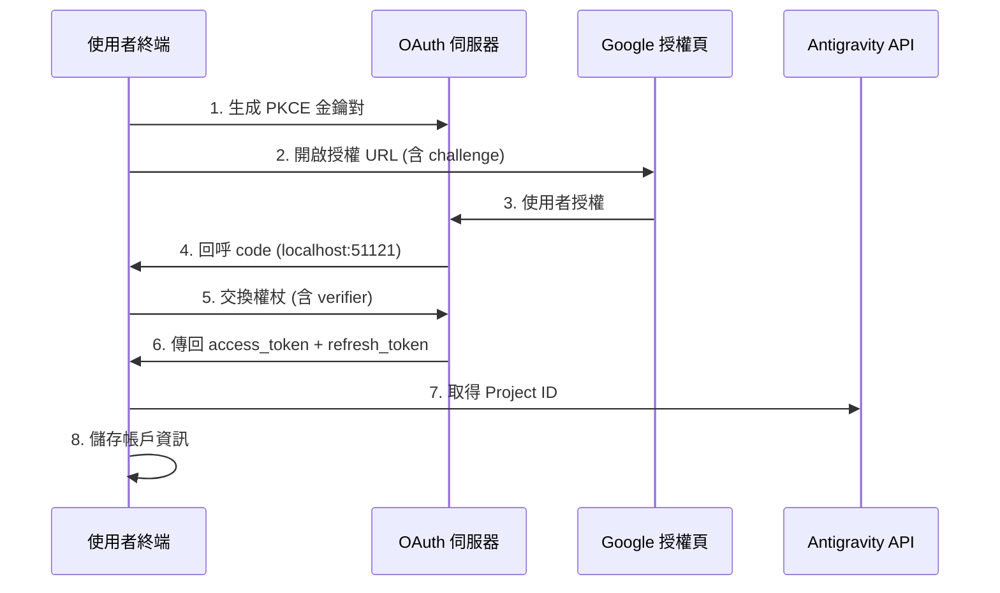

# OAuth 2.0 PKCE 認證：完成首次登入

## 學完你能做什麼

- 理解 OAuth 2.0 PKCE 認證流程的安全機制
- 完成外掛程式首次登入，取得 Antigravity API 存取權限
- 理解 Project ID 的自動取得和儲存機制
- 了解權杖更新的自動化處理

## 你現在的困境

你已經安裝了外掛程式，設定好模型定義，但還沒真正用過。每次執行 `opencode run` 都提示"需要認證"，但你不知道：

- OAuth 是什麼？為什麼要用這麼複雜的認證方式？
- 認證過程中到底發生了什麼？安全嗎？
- 首次登入需要準備什麼？會有哪些選擇？
- 權杖過期了怎麼辦？需要重新登入嗎？

## 什麼時候用這一招

- **首次安裝外掛程式後**：第一次使用前必須完成認證
- **新增帳戶時**：設定多帳戶輪換，需要逐一認證
- **權杖失效後**：如果帳戶被撤銷或密碼變更，需重新認證
- **切換到新裝置時**：遷移帳戶時需要在新裝置重新登入

## 🎒 開始前的準備

::: warning 前置檢查

請確認已完成以下步驟：

1. **外掛程式已安裝**：參考 [快速安裝](/zh-tw/NoeFabris/opencode-antigravity-auth/start/quick-install/)
2. **模型已設定**：已將模型定義新增到 `~/.config/opencode/opencode.json`
3. **有可用的 Google 帳戶**：建議使用已建立信任的帳戶，避免使用新建立的帳戶

:::

## 核心思路

### 什麼是 OAuth 2.0 PKCE？

**OAuth 2.0**（Open Authorization 2.0）是一個授權協定，讓第三方應用程式（本外掛程式）在不直接取得使用者密碼的情況下，獲得對 Google API 的存取權限。

**PKCE**（Proof Key for Code Exchange）是 OAuth 2.0 的安全擴充，專為公開客戶端（如 CLI 工具）設計。它透過以下機制防止授權碼攔截攻擊：

```
┌─────────────────────────────────────────────────────────────────┐
│  PKCE 防護機制                                            │
├─────────────────────────────────────────────────────────────────┤
│  1. 客戶端生成一對金鑰：                                   │
│     - code_verifier（隨機字串，保密）                        │
│     - code_challenge（verifier 的雜湊值，公開）                │
│  2. 授權 URL 包含 code_challenge                           │
│  3. 回呼伺服器收到 code，再用 code_verifier 驗證             │
│  4. 攻擊者即使攔截了 code，沒有 verifier 也無法交換權杖         │
└─────────────────────────────────────────────────────────────────┘
```

::: info

**PKCE vs 傳統 OAuth**

傳統 OAuth 使用 `client_secret` 驗證身份，但這要求客戶端能安全儲存金鑰。CLI 工具無法做到這點，所以 PKCE 用動態生成的 `verifier` 代替靜態金鑰，同樣安全但不依賴預儲存的秘密。

:::

### 認證流程概覽


## 跟我做

### 第 1 步：啟動 OAuth 登入

**為什麼**

`opencode auth login` 指令會啟動本地 OAuth 伺服器，生成授權 URL，並等待 Google 的回呼。

**執行指令**：

```bash
opencode auth login
```

**你應該看到**：

```
🔑 Initializing Antigravity OAuth...
📋 Starting local OAuth server on http://127.0.0.1:51121
🌐 Opening browser for authorization...

If the browser doesn't open, visit this URL manually:
https://accounts.google.com/o/oauth2/v2/auth?client_id=...&code_challenge=...
```

::: tip

**環境偵測**

外掛程式會自動偵測執行環境：

| 環境 | 繫結位址 | 原因 |
|--- | --- | ---|
| 本地 macOS/Linux/Windows | `127.0.0.1` | 最安全，只接受本地連線 |
| WSL / Docker / SSH 遠端 | `0.0.0.0` | 允許瀏覽器從主機存取 |

你可以透過環境變數 `OPENCODE_ANTIGRAVITY_OAUTH_BIND` 覆蓋預設設定。

:::

### 第 2 步：在瀏覽器中授權

**為什麼**

Google 授權頁面會顯示外掛程式請求的權限（Scope），需要你明確同意。

**你會看到**：

Google OAuth 授權頁面，顯示：
- 請求方：Antigravity Auth Plugin
- 請求權限：
  - 檢視您的電子郵件地址
  - 檢視您的個人資料資訊
  - 存取您的 Cloud Platform 專案
  - 存取 Google Cloud 的日誌和實驗設定

**操作**：

1. 確認請求的權限符合預期（沒有超出範圍的敏感權限）
2. 點擊"允許"或"授權"按鈕
3. 等待頁面跳轉到 `http://localhost:51121/oauth-callback`

**你應該看到**：

```html
<!DOCTYPE html>
<html>
  <!-- ... -->
  <h1>All set!</h1>
  <p>You've successfully authenticated with Antigravity.</p>
  <!-- ... -->
</html>
```

::: warning

**授權頁面關閉問題**

如果授權成功後瀏覽器沒有自動關閉，手動關閉分頁即可。這是瀏覽器的安全限制，不影響認證結果。

:::
### 第 3 步：自動交換權杖並取得 Project ID

**為什麼**

授權碼只是臨時憑證，需要交換為長期有效的 `refresh_token`，同時取得 Antigravity 專案所需的 `Project ID`。

**後台自動發生**：

外掛程式會自動執行以下操作（無需你介入）：

1. **驗證 PKCE**：用 `code_verifier` 驗證授權碼的有效性
2. **交換權杖**：向 `oauth2.googleapis.com/token` 發送 POST 請求

   ```typescript
   // 原始碼：src/antigravity/oauth.ts:209
   POST https://oauth2.googleapis.com/token
   Content-Type: application/x-www-form-urlencoded

   {
     client_id: "...",
     client_secret: "...",
     code: "授權碼",
     grant_type: "authorization_code",
     redirect_uri: "http://localhost:51121/oauth-callback",
     code_verifier: "PKCE verifier"
   }
   ```

3. **取得使用者資訊**：驗證電子郵件地址

   ```typescript
   // 原始碼：src/antigravity/oauth.ts:231
   GET https://www.googleapis.com/oauth2/v1/userinfo?alt=json
   Authorization: Bearer {access_token}
   ```

4. **自動取得 Project ID**：嘗試從 Antigravity API 取得你的專案 ID

   ```typescript
   // 原始碼：src/antigravity/oauth.ts:131
   // 按優先順序嘗試多個端點
   - https://cloudcode-pa.googleapis.com/v1internal:loadCodeAssist (prod)
   - https://daily-cloudcode-pa.sandbox.googleapis.com/v1internal:loadCodeAssist (daily)
   - https://autopush-cloudcode-pa.sandbox.googleapis.com/v1internal:loadCodeAssist (autopush)
   ```

5. **儲存帳戶資訊**：儲存到 `~/.config/opencode/antigravity-accounts.json`

   ```json
   {
     "version": 3,
     "accounts": [
       {
         "email": "your.email@gmail.com",
         "refreshToken": "1//0g...|rising-fact-p41fc",
         "projectId": "rising-fact-p41fc",
         "addedAt": 1737609600000,
         "lastUsed": 1737609600000
       }
     ]
   }
   ```

::: details

**Project ID 的作用**

Project ID 是 Google Cloud 專案的唯一識別，用於確定 API 呼叫歸屬於哪個專案。Antigravity 會根據 Project ID 追蹤配額使用情況。

- **自動取得成功**：使用你的真實 Project ID（推薦）
- **自動取得失敗**：使用預設 Project ID (`rising-fact-p41fc`)

:::

**你應該看到**：

```
✅ Authentication successful
📧 Account: your.email@gmail.com
🆔 Project ID: rising-fact-p41fc
💾 Saved to: ~/.config/opencode/antigravity-accounts.json
```
### 檢查點 ✅

**驗證帳戶已正確儲存**：

```bash
cat ~/.config/opencode/antigravity-accounts.json
```

**期望輸出**：

```json
{
  "version": 3,
  "accounts": [
    {
      "email": "your.email@gmail.com",
      "refreshToken": "1//0g...|rising-fact-p41fc",
      "projectId": "rising-fact-p41fc",
      "addedAt": 1737609600000,
      "lastUsed": 1737609600000
    }
  ]
}
```

::: tip

**帳戶儲存格式**

`refreshToken` 欄位的格式為：`{refresh_token}|{project_id}`，這種設計允許在單一欄位中儲存權杖和專案 ID，簡化儲存邏輯。

:::
## 踩坑提醒

### 坑 1：連接埠被佔用

**錯誤提示**：

```
❌ Port 51121 is already in use.
Another process is occupying this port.
```

**原因**：另一個 OpenCode 程序正在執行，或其他程式佔用了連接埠。

**解決方案**：

1. 檢查並終止佔用連接埠的程序：

   ```bash
   # macOS/Linux
   lsof -ti:51121 | xargs kill -9

   # Windows
   netstat -ano | findstr :51121
   taskkill /PID <PID> /F
   ```

2. 重新執行 `opencode auth login`

### 坑 2：瀏覽器未自動開啟

**原因**：WSL、Docker 或遠端環境中，`localhost` 不等於主機位址。

**解決方案**：

外掛程式會自動偵測環境並顯示手動存取 URL：

```
🌐 Opening browser for authorization...

If the browser doesn't open, visit this URL manually:
https://accounts.google.com/o/oauth2/v2/auth?...
```

複製 URL 到主機瀏覽器中存取即可。

### 坑 3：Project ID 取得失敗

**警告提示**：

```
⚠️ Failed to resolve Antigravity project via loadCodeAssist
Using default project ID: rising-fact-p41fc
```

**原因**：某些企業帳戶或特殊權限設定下，`loadCodeAssist` API 無法存取。

**解決方案**：

1. 如果只使用 Antigravity 模型（帶 `:antigravity` 後綴），可以使用預設 Project ID
2. 如果需要使用 Gemini CLI 模型（如 `gemini-2.5-pro`），手動設定 Project ID：

   ```json
   // 編輯 ~/.config/opencode/antigravity-accounts.json
   {
     "accounts": [
       {
         "email": "your.email@gmail.com",
         "refreshToken": "1//0g...|your-custom-project-id",
         "projectId": "your-custom-project-id"
       }
     ]
   }
   ```

   取得 Project ID 的步驟：
   - 存取 [Google Cloud Console](https://console.cloud.google.com/)
   - 建立或選擇一個專案
   - 啟用 **Gemini for Google Cloud API**
   - 複製專案 ID（格式：`rising-fact-p41fc`）

### 坑 4：invalid_grant 錯誤

**錯誤提示**：

```
❌ Token exchange failed: invalid_grant
```

**原因**：
- 授權碼已過期（有效期通常 10 分鐘）
- 使用者在授權後撤銷了應用程式存取權限
- 帳戶密碼變更或觸發安全事件

**解決方案**：重新執行 `opencode auth login`
## 權杖更新機制

**自動更新**：你不需要關心權杖過期問題。

外掛程式會在以下情況自動更新：

| 觸發條件 | 行為 | 原始碼位置 |
|--- | --- | ---|
| 權杖過期前 60 秒 | 自動更新 | `src/plugin/auth.ts:33` |
| 收到 401 Unauthorized | 嘗試更新 | `src/plugin/auth.ts:33` |
| 更新失敗 | 提示使用者重新登入 | `src/plugin.ts:995` |

**更新邏輯**：

```typescript
// 原始碼：src/plugin/auth.ts:33
export function accessTokenExpired(auth: OAuthAuthDetails): boolean {
  // 提前 60 秒更新（預留時鐘偏差）
  return auth.expires <= Date.now() + 60 * 1000;
}
```

## 本課小結

OAuth 2.0 PKCE 認證流程的核心要點：

1. **PKCE 安全機制**：用動態 `verifier` 代替靜態金鑰，防止授權碼攔截
2. **本地回呼伺服器**：監聽 `localhost:51121`，接收 Google 授權回呼
3. **權杖交換**：用授權碼換取 `access_token` 和 `refresh_token`
4. **自動 Project ID**：嘗試從 Antigravity API 取得，失敗則使用預設值
5. **自動更新**：權杖過期前 60 秒自動更新，無需手動介入
6. **帳戶儲存**：所有資訊儲存在 `~/.config/opencode/antigravity-accounts.json`

你現在可以發起第一個模型請求了！

## 下一課預告

> 下一課我們學習 **[發起第一個模型請求](/zh-tw/NoeFabris/opencode-antigravity-auth/start/first-request/)**。
>
> 你會學到：
> - 如何使用 `opencode run` 發起請求
> - 驗證認證是否成功
> - 理解模型變體的設定方式

---

## 附錄：原始碼參考

<details>
<summary><strong>點擊展開查看原始碼位置</strong></summary>

> 更新時間：2026-01-23

| 功能        | 檔案路徑                                                                                               | 行號    |
|--- | --- | ---|
| PKCE 金鑰生成 | [`src/antigravity/oauth.ts`](https://github.com/NoeFabris/opencode-antigravity-auth/blob/main/src/antigravity/oauth.ts#L91-L113)         | 91-113  |
| 建構授權 URL   | [`src/antigravity/oauth.ts`](https://github.com/NoeFabris/opencode-antigravity-auth/blob/main/src/antigravity/oauth.ts#L91-L113)         | 91-113  |
| 交換權杖     | [`src/antigravity/oauth.ts`](https://github.com/NoeFabris/opencode-antigravity-auth/blob/main/src/antigravity/oauth.ts#L201-L270)         | 201-270 |
| 取得使用者資訊   | [`src/antigravity/oauth.ts`](https://github.com/NoeFabris/opencode-antigravity-auth/blob/main/src/antigravity/oauth.ts#L231-L242)         | 231-242 |
| 自動取得 Project ID | [`src/antigravity/oauth.ts`](https://github.com/NoeFabris/opencode-antigravity-auth/blob/main/src/antigravity/oauth.ts#L131-L196)      | 131-196 |
| 環境偵測       | [`src/plugin/server.ts`](https://github.com/NoeFabris/opencode-antigravity-auth/blob/main/src/plugin/server.ts#L31-L134)           | 31-134  |
| OAuth 回呼伺服器 | [`src/plugin/server.ts`](https://github.com/NoeFabris/opencode-antigravity-auth/blob/main/src/plugin/server.ts#L140-L366)           | 140-366 |
| 權杖過期檢查   | [`src/plugin/auth.ts`](https://github.com/NoeFabris/opencode-antigravity-auth/blob/main/src/plugin/auth.ts#L33-L38)               | 33-38   |
| 計算權杖過期時間 | [`src/plugin/auth.ts`](https://github.com/NoeFabris/opencode-antigravity-auth/blob/main/src/plugin/auth.ts#L45-L52)               | 45-52   |

**關鍵常數**：
- `ANTIGRAVITY_CLIENT_ID`：OAuth 客戶端 ID（`constants.ts:4`）
- `ANTIGRAVITY_CLIENT_SECRET`：OAuth 客戶端金鑰（`constants.ts:9`）
- `ANTIGRAVITY_REDIRECT_URI`：OAuth 回呼位址 `http://localhost:51121/oauth-callback`（`constants.ts:25`）
- `ANTIGRAVITY_SCOPES`：請求的權限清單（`constants.ts:14-20`）
- `ANTIGRAVITY_DEFAULT_PROJECT_ID`：預設專案 ID `rising-fact-p41fc`（`constants.ts:71`）

**關鍵函數**：
- `authorizeAntigravity()`：生成 PKCE 金鑰對和授權 URL（`oauth.ts:91`）
- `exchangeAntigravity()`：交換授權碼為存取權杖（`oauth.ts:201`）
- `fetchProjectID()`：從 Antigravity API 取得專案 ID（`oauth.ts:131`）
- `startOAuthListener()`：啟動本地 OAuth 伺服器（`server.ts:140`）
- `accessTokenExpired()`：檢查權杖是否過期（`auth.ts:33`）

**重要業務規則**：
- PKCE 使用 S256 雜湊演算法（`oauth.ts:100`）
- 權杖過期前 60 秒自動更新（`auth.ts:3`）
- 支援離線存取（`access_type=offline`）（`oauth.ts:105`）
- Project ID 端點回退順序：prod → daily → autopush（`oauth.ts:141-143`）

</details>
