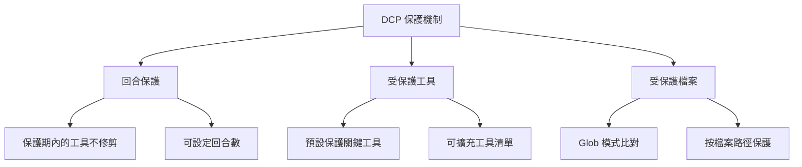

# 保護機制：避免誤修剪關鍵內容

## 學完你能做什麼

- 設定回合保護，讓 AI 有時間引用最近的工具輸出
- 擴充受保護工具清單，防止關鍵操作被修剪
- 設定受保護檔案模式，保護特定檔案不被誤修剪
- 理解子代理保護機制，避免影響摘要行為

## 你現在的困境

DCP 會自動修剪對話歷史中的冗餘工具呼叫，這很省 Token，但有時候會出問題：

- AI 剛讀取了一個檔案，想基於內容做分析，結果被 DCP 修剪了
- 你用 `write` 工具寫了一個設定檔，後面還要讀取，結果修剪後找不到檔案路徑
- AI 說「根據上面的程式碼」，但程式碼已經不在上下文裡了

這些情況都說明：**有些內容必須保護起來，不能被修剪**。

## 什麼時候用這一招

- AI 需要引用之前讀取的檔案內容時
- 需要保護關鍵操作（如寫設定、任務規劃）時
- 某些檔案路徑（如 secrets、金鑰）需要特殊保護時
- 開發子代理功能時（DCP 會自動跳過）

## 核心思路

DCP 提供了**三層保護機制**，從不同維度防止關鍵內容被誤修剪：



**保護層級**：
1. **回合保護**（時間維度）：最近 N 回合的工具自動保護
2. **工具保護**（工具維度）：特定工具永遠不會被修剪
3. **檔案保護**（路徑維度）：操作特定檔案的工具不會被修剪

三者可以組合使用，形成多層次的保護網。

---

## 回合保護

### 什麼是回合保護

回合保護（Turn Protection）是 DCP 提供的**時間視窗保護機制**。啟用後，在保護期內的工具呼叫不會被加入修剪快取中，也就不會被任何策略修剪。

**作用**：給 AI 時間引用最近的工具輸出，避免「剛說完就刪」的尷尬。

### 設定回合保護

在設定檔中加入：

```jsonc
{
  "turnProtection": {
    "enabled": true,
    "turns": 4
  }
}
```

**參數說明**：
- `enabled`：是否啟用回合保護（預設 `false`）
- `turns`：保護回合數（預設 `4`），表示最近 4 回合的工具不會修剪

### 回合保護的運作原理

DCP 在同步工具快取時（每次 AI 傳送訊息前），會計算每個工具的回合數：

```typescript
// 如果目前回合 - 工具建立回合 < 保護回合數
// 則該工具不會被修剪
state.currentTurn - turnCounter < turnProtectionTurns
```

**範例**：
- 目前回合：10
- 工具建立回合：8
- 保護回合數：4
- 結果：10 - 8 = 2 < 4 → **受保護，不修剪**

**效果**：
- 在保護期內，工具不會出現在 `<prunable-tools>` 清單中
- 不會受自動策略影響（去重、覆蓋寫入、清除錯誤）
- AI 無法透過 `discard`/`extract` 工具修剪它們

### 建議設定

| 情境 | 建議回合數 | 說明 |
| --- | --- | --- |
| 長對話（10+ 回合） | 4-6 | 給 AI 足夠時間引用歷史內容 |
| 短對話（< 5 回合） | 2-3 | 不需要太長的保護期 |
| 高度依賴上下文的任務 | 6-8 | 如程式碼重構、長篇文件分析 |
| 預設（不依賴上下文） | 0-2 | 不啟用或用最小值 |

::: tip 注意
回合保護會增加上下文大小，因為更多工具輸出會被保留。如果發現 Token 消耗增長明顯，可以適當降低保護回合數。
:::

---

## 受保護工具

### 預設受保護工具

DCP 預設保護以下工具，它們**永遠不會**被修剪：

| 工具名 | 說明 |
| --- | --- |
| `task` | 任務管理工具 |
| `todowrite` | 寫入待辦事項 |
| `todoread` | 讀取待辦事項 |
| `discard` | DCP 的丟棄工具（修剪操作本身） |
| `extract` | DCP 的提取工具（修剪操作本身） |
| `batch` | 批次操作工具 |
| `write` | 寫入檔案工具 |
| `edit` | 編輯檔案工具 |
| `plan_enter` | 規劃入口標記 |
| `plan_exit` | 規劃出口標記 |

**為什麼這些工具受保護**：
- `task`、`todowrite`、`todoread`：任務管理是對話狀態的核心，刪除會導致上下文遺失
- `discard`、`extract`：它們是 DCP 自己的修剪工具，不能修剪自己
- `batch`、`write`、`edit`：檔案操作是 AI 與使用者程式碼互動的核心
- `plan_enter`、`plan_exit`：規劃標記幫助理解對話結構

### 擴充受保護工具清單

如果你需要保護更多工具，可以在設定中擴充：

```jsonc
{
  "tools": {
    "settings": {
      "protectedTools": [
        "task",
        "todowrite",
        "todoread",
        "discard",
        "extract",
        "batch",
        "write",
        "edit",
        "plan_enter",
        "plan_exit",
        // 加入你需要保護的工具
        "read",
        "filesearch"
      ]
    }
  }
}
```

**全域工具保護**：
- `tools.settings.protectedTools` 中的工具會在所有策略中受保護
- 適用於不想讓任何策略修剪的工具

### 策略層級的工具保護

你也可以為特定策略設定受保護工具：

```jsonc
{
  "strategies": {
    "deduplication": {
      "enabled": true,
      "protectedTools": [
        "read",  // 去重時保護 read 工具
        "filesearch"
      ]
    },
    "purgeErrors": {
      "enabled": true,
      "turns": 4,
      "protectedTools": [
        "write"  // 清除錯誤時保護 write 工具
      ]
    }
  }
}
```

**使用情境**：
- 只在某個策略中保護工具，其他策略可以修剪
- 例如：允許去重修剪 `read`，但清除錯誤策略不能修剪 `write`

::: info 工具保護與回合保護的區別
- **工具保護**：無論工具是哪個回合建立的，只要在保護清單中，就永遠不會被修剪
- **回合保護**：所有工具（除了受保護工具）在保護期內不被修剪，但保護期過後可以被修剪
:::

---

## 受保護檔案模式

### 什麼是受保護檔案模式

受保護檔案模式允許你透過 Glob 模式，**保護特定檔案路徑上的操作不被修剪**。

**適用情境**：
- 保護金鑰檔案（`.env`、`secrets.json`）
- 保護設定檔（重要設定不能遺失）
- 保護專案核心檔案（入口檔案、核心函式庫）
- 保護敏感目錄（如 `src/api/`、`tests/fixtures/`）

### 設定受保護檔案模式

在設定檔中加入：

```jsonc
{
  "protectedFilePatterns": [
    "**/.env*",
    "**/secrets.json",
    "**/config/*.json",
    "src/core/**/*.ts",
    "tests/fixtures/**/*"
  ]
}
```

### Glob 模式說明

DCP 支援標準的 Glob 模式：

| 模式 | 說明 | 範例比對路徑 |
| --- | --- | --- |
| `**` | 比對任意層級的目錄 | `src/`、`src/components/`、`a/b/c/` |
| `*` | 比對單層目錄下的任意檔案 | `src/*.ts` 比對 `src/index.ts` |
| `?` | 比對單一字元 | `file?.txt` 比對 `file1.txt`、`file2.txt` |
| `*.json` | 比對特定副檔名 | `config.json`、`data.json` |
| `**/*.json` | 比對任意層級下的 JSON 檔案 | `a/b/c.json`、`d.json` |

**注意事項**：
- `*` 和 `?` 不會比對 `/`（目錄分隔符號）
- 比對是針對完整檔案路徑進行的
- 路徑分隔符號統一為 `/`（即使在 Windows 上）

### 實戰案例

#### 案例 1：保護環境變數檔案

```jsonc
{
  "protectedFilePatterns": [
    "**/.env",
    "**/.env.local",
    "**/.env.production"
  ]
}
```

**效果**：任何操作 `.env` 檔案的工具都不會被修剪。

#### 案例 2：保護專案核心檔案

```jsonc
{
  "protectedFilePatterns": [
    "src/index.ts",
    "src/core/**/*.ts",
    "src/api/**/*.ts"
  ]
}
```

**效果**：操作核心模組和 API 的工具輸出會被保留，確保 AI 能始終看到專案結構。

#### 案例 3：保護測試固定資料

```jsonc
{
  "protectedFilePatterns": [
    "tests/fixtures/**/*",
    "tests/mocks/**/*.json"
  ]
}
```

**效果**：測試用的模擬資料和固定輸入不會被修剪，避免測試結果不一致。

---

## 子代理保護

### 什麼是子代理

子代理（Subagent）是 OpenCode 的一種機制，主代理可以衍生子代理處理特定任務（如檔案搜尋、程式碼分析）。子代理會將結果摘要後回傳給主代理。

### DCP 的子代理保護

DCP 會自動偵測子代理對話，並**跳過所有修剪操作**。

**實作原理**：
```typescript
// lib/state/utils.ts
export async function isSubAgentSession(client: any, sessionID: string): Promise<boolean> {
    const result = await client.session.get({ path: { id: sessionID } })
    return !!result.data?.parentID  // 如果有 parentID，說明是子代理
}
```

**為什麼需要保護**：
- 子代理的輸出是給主代理看的摘要
- 如果修剪子代理的工具輸出，主代理可能無法理解上下文
- 子代理的任務是「高效執行」，不是「省 Token」

::: info 使用者感知
子代理保護是自動的，你不需要設定任何內容。DCP 會在日誌中記錄偵測到的子代理對話。
:::

---

## 跟我做：設定保護機制

### 第 1 步：編輯設定檔

開啟全域設定檔（或專案設定檔）：

```bash
# macOS/Linux
code ~/.config/opencode/dcp.jsonc

# Windows
code $env:APPDATA\opencode\dcp.jsonc
```

### 第 2 步：加入保護設定

```jsonc
{
  "$schema": "https://raw.githubusercontent.com/Opencode-DCP/opencode-dynamic-context-pruning/main/dcp.schema.json",
  "enabled": true,
  "debug": false,

  // 回合保護
  "turnProtection": {
    "enabled": true,
    "turns": 4
  },

  // 受保護檔案模式
  "protectedFilePatterns": [
    "**/.env*",
    "**/secrets.json"
  ],

  // 擴充受保護工具
  "tools": {
    "settings": {
      "nudgeEnabled": true,
      "nudgeFrequency": 10,
      "protectedTools": [
        "task",
        "todowrite",
        "todoread",
        "discard",
        "extract",
        "batch",
        "write",
        "edit",
        "plan_enter",
        "plan_exit",
        "read"
      ]
    },
    "discard": {
      "enabled": true
    },
    "extract": {
      "enabled": true,
      "showDistillation": false
    }
  },

  // 策略層級的保護
  "strategies": {
    "deduplication": {
      "enabled": true,
      "protectedTools": ["filesearch"]
    },
    "supersedeWrites": {
      "enabled": false
    },
    "purgeErrors": {
      "enabled": true,
      "turns": 4,
      "protectedTools": ["write"]
    }
  }
}
```

### 第 3 步：重新啟動 OpenCode

修改設定後，重新啟動 OpenCode 使設定生效：

- macOS/Linux：點擊 Dock 中的 OpenCode 圖示右鍵 → 結束 → 重新開啟
- Windows：在工作列右鍵 OpenCode → 關閉視窗 → 重新開啟

### 第 4 步：驗證保護機制

在 OpenCode 對話中輸入 `/dcp context`，查看目前上下文分析：

```
Session Context Breakdown:
──────────────────────────────────────────────────────────

System         15.2% │████████████████▒▒▒▒▒▒▒▒▒▒▒▒▒▒▒▒▒▒▒▒▒▒▒│  25.1K tokens
User            5.1% │████▒▒▒▒▒▒▒▒▒▒▒▒▒▒▒▒▒▒▒▒▒▒▒▒▒▒▒▒▒▒▒▒▒▒▒▒▒▒│   8.4K tokens
Assistant       35.8% │██████████████████████████████████████▒▒▒▒▒▒▒│  59.2K tokens
Tools (45)      43.9% │████████████████████████████████████████████████│  72.6K tokens

──────────────────────────────────────────────────────────

Summary:
  Pruned:          12 tools (~15.2K tokens)
  Current context: ~165.3K tokens
  Without DCP:     ~180.5K tokens
```

**你應該看到**：
- `Pruned` 數量可能會減少（因為受保護的工具不會被修剪）
- `Current context` 可能會增大（因為回合保護保留了更多內容）

---

## 踩坑提醒

### ❌ 誤區 1：過度保護導致 Token 浪費

**問題**：設定過長的保護回合數或加入太多受保護工具，導致上下文一直很大。

**解決**：
- 回合保護一般設定 2-4 回合即可
- 只保護真正關鍵的工具（如 `task`、`write`）
- 定期查看 `/dcp context`，監控上下文大小

### ❌ 誤區 2：Glob 模式比對失敗

**問題**：設定了 `*.json`，但某些 JSON 檔案還是被修剪了。

**原因**：`*` 不會比對 `/`，所以 `a/b/c.json` 不會被比對。

**解決**：使用 `**/*.json` 比對任意層級的 JSON 檔案。

### ❌ 誤區 3：忘記重新啟動 OpenCode

**問題**：修改設定後，保護機制沒有生效。

**原因**：DCP 只在啟動時載入設定檔。

**解決**：修改設定後必須重新啟動 OpenCode。

### ❌ 誤區 4：受保護工具出現在修剪清單中

**問題**：設定了受保護工具，但它們還是出現在 `<prunable-tools>` 清單中。

**原因**：受保護工具不會被修剪，但如果它們在保護期外，仍會出現在 `<prunable-tools>` 清單中（供 AI 查看），只是 AI 嘗試修剪時會失敗。

**解決**：這是正常行為。AI 嘗試修剪受保護工具時，DCP 會拒絕操作並回傳錯誤。

---

## 本課小結

DCP 的保護機制包含三層：

1. **回合保護**：在保護期內的工具不會被修剪，給 AI 時間引用歷史內容
2. **受保護工具**：特定工具（如 `task`、`write`）永遠不會被修剪，可擴充自訂清單
3. **受保護檔案模式**：透過 Glob 模式保護特定檔案路徑上的操作
4. **子代理保護**：DCP 自動偵測並跳過子代理對話的修剪操作

**建議設定策略**：
- 開發階段：啟用回合保護（2-4 回合），保護設定檔和核心模組
- 正式環境：根據實際需求調整，平衡 Token 節省和上下文完整性
- 關鍵任務：啟用所有保護機制，確保關鍵內容不會遺失

---

## 下一課預告

> 下一課我們學習 **[狀態持久化](../state-persistence/)**。
>
> 你會學到：
> - DCP 如何跨對話保留修剪狀態和統計資料
> - 持久化檔案的位置和格式
> - 如何查看累計 Token 節省效果
> - 清理持久化資料的方法

---

## 附錄：原始碼參考

<details>
<summary><strong>點擊展開查看原始碼位置</strong></summary>

> 更新時間：2026-01-23

| 功能 | 檔案路徑 | 行號 |
| --- | --- | --- |
| 回合保護邏輯 | [`lib/state/tool-cache.ts`](https://github.com/Opencode-DCP/opencode-dynamic-context-pruning/blob/main/lib/state/tool-cache.ts#L39-L44) | 39-44 |
| 預設受保護工具 | [`lib/config.ts`](https://github.com/Opencode-DCP/opencode-dynamic-context-pruning/blob/main/lib/config.ts#L68-L79) | 68-79 |
| 受保護檔案比對 | [`lib/protected-file-patterns.ts`](https://github.com/Opencode-DCP/opencode-dynamic-context-pruning/blob/main/lib/protected-file-patterns.ts#L77-L82) | 77-82 |
| 子代理偵測 | [`lib/state/utils.ts`](https://github.com/Opencode-DCP/opencode-dynamic-context-pruning/blob/main/lib/state/utils.ts#L1-L8) | 1-8 |
| 去重策略保護檢查 | [`lib/strategies/deduplication.ts`](https://github.com/Opencode-DCP/opencode-dynamic-context-pruning/blob/main/lib/strategies/deduplication.ts#L49-L57) | 49-57 |
| Discard 工具保護檢查 | [`lib/strategies/tools.ts`](https://github.com/Opencode-DCP/opencode-dynamic-context-pruning/blob/main/lib/strategies/tools.ts#L89-L112) | 89-112 |

**關鍵常數**：
- `DEFAULT_PROTECTED_TOOLS = ["task", "todowrite", "todoread", "discard", "extract", "batch", "write", "edit", "plan_enter", "plan_exit"]`：預設受保護工具清單

**關鍵函式**：
- `isProtectedFilePath(filePath, patterns)`：檢查檔案路徑是否符合保護模式
- `isSubAgentSession(client, sessionID)`：偵測對話是否為子代理

</details>
