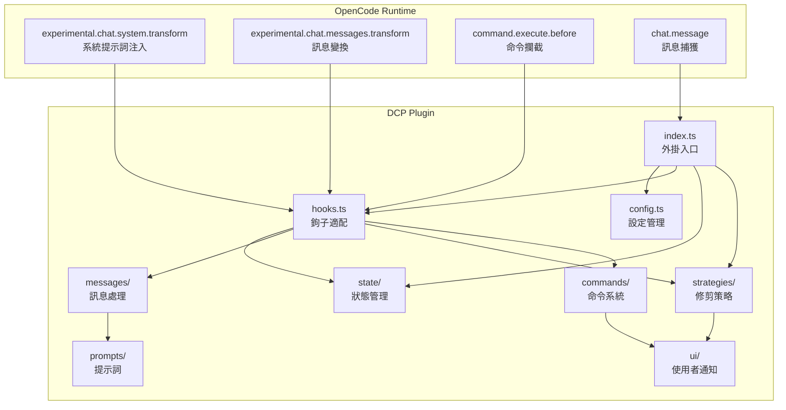
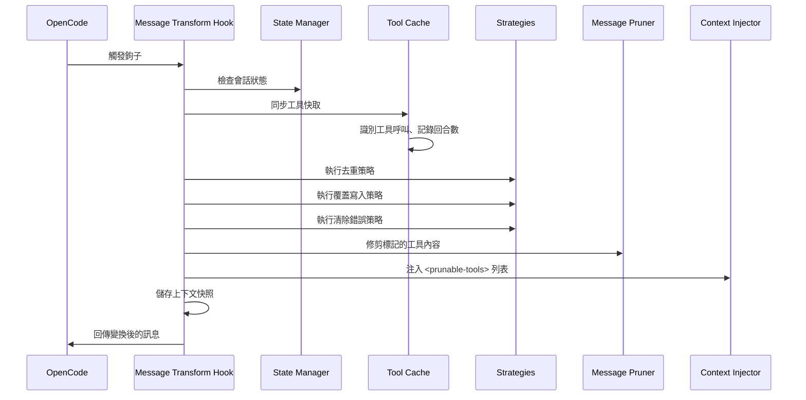
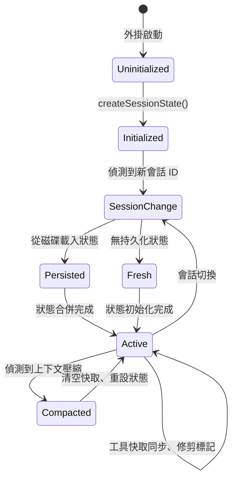
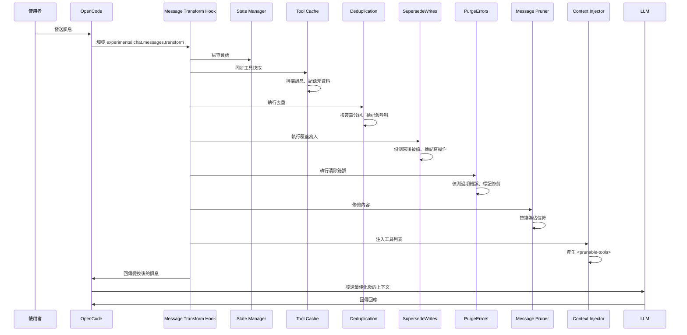
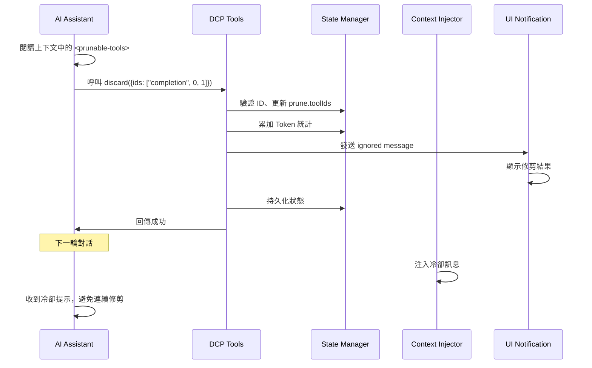

# 架構概覽：DCP 內部工作原理

## 學完你能做什麼

本節不涉及操作，而是幫助你深入理解 DCP 的內部設計。學完後，你將能夠：
- 理解 DCP 如何透過 OpenCode 鉤子系統與對話流程整合
- 掌握各個模組的職責邊界和互動方式
- 理解從訊息接收到修剪完成的完整呼叫鏈路
- 了解狀態管理、訊息處理和修剪策略的設計思路

## 核心思路

DCP 是一個基於 OpenCode Plugin SDK 的外掛，透過註冊鉤子和工具來擴展 OpenCode 的對話能力。整個系統圍繞「訊息變換」（message transform）這一核心概念展開——每次 AI 準備回應使用者之前，DCP 會對對話歷史進行掃描、分析和修剪，然後才將最佳化後的上下文發送給 LLM。

::: info 為什麼是「訊息變換」？

OpenCode 提供了 `experimental.chat.messages.transform` 鉤子，允許外掛在訊息發送給 LLM 之前修改它們。這正是 DCP 需要的能力——在 LLM 看到上下文之前，移除冗餘的工具呼叫。

:::

系統採用模組化設計，每個模組職責清晰：
- **config**：設定管理，支援多層級覆蓋
- **state**：狀態管理，維護會話級執行時狀態
- **messages**：訊息處理，執行實際的修剪和注入操作
- **strategies**：修剪策略，定義自動清理規則
- **commands**：命令系統，提供手動控制和統計查詢
- **hooks**：鉤子適配，連接 OpenCode 和 DCP 模組
- **ui**：使用者通知，展示修剪結果和統計資訊

## 模組架構圖



## 外掛入口與初始化

外掛入口定義在 `index.ts` 中，是 DCP 與 OpenCode Plugin API 的唯一連接點。

### 外掛註冊流程

```typescript
const plugin: Plugin = (async (ctx) => {
    const config = getConfig(ctx)
    if (!config.enabled) {
        return {}
    }

    const logger = new Logger(config.debug)
    const state = createSessionState()

    return {
        "experimental.chat.system.transform": createSystemPromptHandler(...),
        "experimental.chat.messages.transform": createChatMessageTransformHandler(...),
        "chat.message": async (input, _output) => { /* 快取 variant */ },
        "command.execute.before": createCommandExecuteHandler(...),
        tool: {
            discard: createDiscardTool(...),
            extract: createExtractTool(...),
        },
        config: async (opencodeConfig) => { /* 修改 OpenCode 設定 */ },
    }
}) satisfies Plugin
```

**初始化階段**：
1. 載入設定（支援多層級合併：預設值 → 全域 → 環境變數 → 專案）
2. 如果外掛被停用，立即回傳空物件
3. 建立日誌系統和會話狀態物件
4. 註冊四個鉤子和兩個工具

**設定修改階段**：
- 透過 `config` 鉤子，將 `discard` 和 `extract` 工具新增到 `experimental.primary_tools`
- 註冊 `/dcp` 命令

## 鉤子系統與訊息變換

`hooks.ts` 負責將 OpenCode 的鉤子事件轉換為 DCP 內部模組呼叫。這是 DCP 的核心調度層。

### 系統提示詞注入鉤子

```typescript
createSystemPromptHandler(state, logger, config)
```

**呼叫時機**：每次建構系統提示詞時

**主要職責**：
1. 偵測子代理會話（如果是子代理，跳過注入）
2. 偵測內部代理（如對話摘要產生器，跳過注入）
3. 根據設定選擇合適的提示詞範本：
   - 同時啟用 discard 和 extract：`system/system-prompt-both`
   - 僅啟用 discard：`system/system-prompt-discard`
   - 僅啟用 extract：`system/system-prompt-extract`
4. 將工具說明注入到系統提示詞

**為什麼需要系統提示詞注入？**

AI 需要知道可以使用 `discard` 和 `extract` 工具來最佳化上下文。透過在系統提示詞中描述這些工具的用途，AI 才能自主決策何時呼叫它們。

### 訊息變換鉤子

```typescript
createChatMessageTransformHandler(ctx.client, state, logger, config)
```

**呼叫時機**：每次 AI 準備回應訊息時（發送給 LLM 之前）

**處理流程**：



**核心步驟**：

1. **會話檢查**（`checkSession`）
   - 偵測會話 ID 是否變化
   - 如果是新會話，從磁碟載入持久化狀態
   - 偵測上下文壓縮（OpenCode 的 summary 機制），如果偵測到壓縮，清空工具快取

2. **工具快取同步**（`syncToolCache`）
   - 掃描所有訊息中的工具呼叫
   - 記錄每個工具的 `callID`、工具名、參數、狀態、回合數
   - 跳過受保護的工具和回合保護期內的工具
   - 維護 `nudgeCounter`（未修剪工具計數）

3. **執行自動策略**
   - `deduplicate`：去重，保留最新呼叫
   - `supersedeWrites`：清理已被讀取覆蓋的寫操作
   - `purgeErrors`：清理過期錯誤工具的輸入

4. **修剪內容**（`prune`）
   - 替換已標記工具的 `output` 為佔位符
   - 替換錯誤工具的 `input` 為佔位符

5. **注入工具列表**（`insertPruneToolContext`）
   - 產生 `<prunable-tools>` 列表（包含數字 ID、工具名、參數摘要）
   - 根據需要注入提醒訊息（nudge）
   - 如果上次操作是修剪，注入冷卻訊息

6. **儲存上下文快照**
   - 將變換後的訊息儲存到日誌目錄，便於除錯

### 命令攔截鉤子

```typescript
createCommandExecuteHandler(ctx.client, state, logger, config, ctx.directory)
```

**呼叫時機**：使用者執行命令時

**主要職責**：
- 攔截 `/dcp` 開頭的命令
- 分發到對應的命令處理器：
  - `/dcp` → 顯示說明
  - `/dcp context` → 顯示 Token 使用分析
  - `/dcp stats` → 顯示累計修剪統計
  - `/dcp sweep [n]` → 手動修剪工具
- 透過拋出特殊錯誤（`__DCP_*_HANDLED__`）阻止 OpenCode 執行預設命令處理

## 狀態管理

`state/` 模組負責維護會話級執行時狀態和持久化。

### 核心資料結構

**SessionState**（記憶體狀態）：
```typescript
{
    sessionId: string | null,           // 目前會話 ID
    isSubAgent: boolean,               // 是否為子代理會話
    prune: { toolIds: string[] },       // 已標記修剪的工具 ID 列表
    stats: {
        pruneTokenCounter: number,      // 目前會話修剪 Token 數
        totalPruneTokens: number,       // 歷史累計修剪 Token 數
    },
    toolParameters: Map<string, ToolParameterEntry>,  // 工具呼叫快取
    nudgeCounter: number,               // 未修剪工具計數（用於觸發提醒）
    lastToolPrune: boolean,             // 上次操作是否為修剪工具
    lastCompaction: number,             // 最後一次上下文壓縮時間戳記
    currentTurn: number,                // 目前回合數
    variant: string | undefined,       // 模型變體（如 claude-3.5-sonnet）
}
```

**ToolParameterEntry**（工具元資料）：
```typescript
{
    tool: string,                       // 工具名稱
    parameters: any,                    // 工具參數
    status: ToolStatus | undefined,     // 執行狀態
    error: string | undefined,          // 錯誤資訊
    turn: number,                       // 建立該呼叫的回合數
}
```

### 狀態生命週期



**關鍵狀態轉換**：

1. **會話初始化**（`ensureSessionInitialized`）
   - 偵測 `sessionID` 變化
   - 偵測是否為子代理（透過 `session.parentID`）
   - 從磁碟載入 `PersistedSessionState`
   - 初始化回合計數器和壓縮時間戳記

2. **上下文壓縮處理**
   - 偵測 OpenCode 的 `summary` 訊息（`msg.info.summary === true`）
   - 清空工具快取和修剪列表
   - 記錄壓縮時間戳記，防止重複清理

3. **持久化**
   - 修剪操作完成後非同步儲存到 `~/.local/share/opencode/storage/plugin/dcp/{sessionId}.json`
   - 包含會話名稱、修剪列表、統計資料、最後更新時間

## 訊息處理模組

`messages/` 模組負責實際的修剪和注入操作。

### 修剪操作（prune.ts）

**核心函式**：`prune(state, logger, config, messages)`

**三個子函式**：

1. **`pruneToolOutputs`**
   - 替換已標記工具的 `output` 為佔位符
   - 只處理狀態為 `completed` 的工具
   - 跳過 `question` 工具（問題工具的特殊處理）

2. **`pruneToolInputs`**
   - 僅處理 `question` 工具
   - 替換 `questions` 欄位為佔位符（保留使用者答案）

3. **`pruneToolErrors`**
   - 清理錯誤工具的輸入參數
   - 保留錯誤訊息，僅移除字串輸入（可能很大的參數）

**佔位符設計**：
```
[Output removed to save context - information superseded or no longer needed]
[input removed due to failed tool call]
[questions removed - see output for user's answers]
```

### 上下文注入（inject.ts）

**核心函式**：`insertPruneToolContext(state, config, logger, messages)`

**流程**：

1. **產生工具列表**（`buildPrunableToolsList`）
   - 遍歷工具快取，排除：
     - 已修剪的工具
     - 受保護工具（`task`、`write`、`edit` 等）
     - 受保護檔案路徑（匹配 `protectedFilePatterns`）
   - 為每個工具產生描述：`{numericId}: {toolName}, {paramKey}`
   - 範例：`3: read, src/config.ts`

2. **包裝為 `<prunable-tools>` 標籤**
   ```html
   <prunable-tools>
   The following tools have been invoked and are available for pruning. This list does not mandate immediate action. Consider your current goals and resources you need before discarding valuable tool inputs or outputs. Consolidate your prunes for efficiency; it is rarely worth pruning a single tiny tool output. Keep your context free of noise.
   0: read, src/config.ts
   1: read, src/config.ts
   2: read, src/utils.ts
   </prunable-tools>
   ```

3. **處理冷卻狀態**
   - 如果上次操作是 `discard` 或 `extract`，注入冷卻訊息：
   ```html
   <prunable-tools>
   Context management was just performed. Do not use discard or extract tools again. A fresh list will be available after your next tool use.
   </prunable-tools>
   ```

4. **注入提醒訊息**
   - 如果 `nudgeCounter >= nudgeFrequency`，追加提醒文字
   - 提醒格式：`"You have not used context pruning in a while. Consider using discard/extract tools to reduce token usage."`

5. **選擇訊息插入位置**
   - 如果最後一條訊息是使用者訊息，插入合成使用者訊息
   - 否則，插入合成助手訊息
   - 使用 `variant` 確保訊息格式相容不同的模型

## 修剪策略模組

`strategies/` 模組定義自動清理規則。

### 去重策略（deduplication.ts）

**核心函式**：`deduplicate(state, logger, config, messages)`

**演算法**：
1. 建構所有工具 ID 的按時間順序列表
2. 為每個工具計算「簽章」：`tool::normalizedParameters`
   - 正規化參數：移除 `null`/`undefined`
   - 排序鍵順序：確保 `{"b":1,"a":2}` 和 `{"a":2,"b":1}` 產生相同簽章
3. 按簽章分組
4. 每組中，保留最後一個（最新），標記其他為修剪

**範例**：
```typescript
// 原始工具呼叫
Tool Call 1: read({filePath: "src/config.ts"})
Tool Call 2: read({filePath: "src/config.ts"})
Tool Call 3: read({filePath: "src/utils.ts"})

// 簽章分組
Signature 1: "read::{\"filePath\":\"src/config.ts\"}" → [Tool Call 1, Tool Call 2]
Signature 2: "read::{\"filePath\":\"src/utils.ts\"}" → [Tool Call 3]

// 修剪結果
標記修剪: [Tool Call 1]  // 保留 Tool Call 2（最新）
保留: [Tool Call 2, Tool Call 3]
```

### 覆蓋寫入策略（supersede-writes.ts）

**核心函式**：`supersedeWrites(state, logger, config, messages)`

**演算法**：
1. 掃描所有工具呼叫，按時間順序
2. 維護檔案追蹤表：
   ```typescript
   {
       "src/config.ts": {
           lastWrite: callId,
           lastWriteTime: timestamp,
           lastRead: callId,
           lastReadTime: timestamp,
       }
   }
   ```
3. 偵測模式：
   - 如果檔案的 `lastWriteTime < lastReadTime`，說明寫操作已被讀取覆蓋
   - 標記該寫操作的 `input` 為修剪

**情境**：
```typescript
// 時間線
Turn 1: write({filePath: "src/config.ts", content: "..."})  // lastWrite = call1
Turn 2: read({filePath: "src/config.ts"})                 // lastRead = call2 (覆蓋了寫操作)
Turn 3: read({filePath: "src/config.ts"})                 // 保留最新的讀取

// 修剪結果
標記修剪: [Turn 1 的 write 呼叫]
```

### 清除錯誤策略（purge-errors.ts）

**核心函式**：`purgeErrors(state, logger, config, messages)`

**演算法**：
1. 掃描所有狀態為 `error` 的工具
2. 檢查目前回合數與工具建立回合的差值
3. 如果差值 > `strategies.purgeErrors.turns`（預設 4），標記修剪

**保護機制**：
- 錯誤訊息保留（`part.state.error`）
- 僅移除輸入參數（`part.state.input`），因為錯誤輸入可能很大

**情境**：
```typescript
Turn 1: read({filePath: "nonexistent.txt"}) → error
Turn 2-5: 其他操作
Turn 6: 使用者繼續對話

// 如果 purgeErrors.turns = 4
// Turn 6 - Turn 1 = 5 > 4
// 標記修剪 Turn 1 的錯誤輸入
```

### LLM 驅動工具（tools.ts）

**Discard 工具**：
```typescript
{
    name: "discard",
    description: "Remove completed task or noise tool outputs",
    parameters: {
        ids: ["completion", 0, 1, 2]  // 首元素為原因：'completion' 或 'noise'
    }
}
```

**Extract 工具**：
```typescript
{
    name: "extract",
    description: "Extract key findings then remove original tool outputs",
    parameters: {
        ids: [0, 1, 2],
        distillation: ["key finding 1", "key finding 2", "key finding 3"]
    }
}
```

**處理流程**：
1. AI 呼叫工具，提供數字 ID 列表
2. 將數字 ID 對應回真實的 `callID`
3. 驗證工具不在保護列表中
4. 更新 `prune.toolIds`
5. 透過 `ignored message` 顯示修剪結果
6. 持久化狀態

## 命令系統

`commands/` 模組提供手動控制和統計查詢。

### Context 命令

```bash
/dcp context
```

**輸出**：Token 使用分析（分條形圖）
```
╭───────────────────────────────────────────────────────────╮
│                  DCP Context Analysis                     │
╰───────────────────────────────────────────────────────────╯

Session Context Breakdown:
───────────────────────────────────────────────────────────

System         15.2% │████████████████▒▒▒▒▒▒▒▒▒▒▒▒▒▒▒▒▒▒▒▒▒▒▒│  25.1K tokens
User            5.1% │████▒▒▒▒▒▒▒▒▒▒▒▒▒▒▒▒▒▒▒▒▒▒▒▒▒▒▒▒▒▒▒▒▒▒▒▒▒▒│   8.4K tokens
Assistant       35.8% │██████████████████████████████████████▒▒▒▒▒▒▒│  59.2K tokens
Tools (45)      43.9% │████████████████████████████████████████████████│  72.6K tokens

───────────────────────────────────────────────────────────

Summary:
  Pruned:          12 tools (~15.2K tokens)
  Current context: ~165.3K tokens
  Without DCP:     ~180.5K tokens
```

**計算邏輯**：
- System：`firstAssistant.input + cache.read - tokenizer(firstUserMessage)`
- User：`tokenizer(all user messages)`
- Tools：`tokenizer(toolInputs + toolOutputs) - prunedTokens`
- Assistant：殘差計算

### Stats 命令

```bash
/dcp stats
```

**輸出**：累計修剪統計
```
╭───────────────────────────────────────────────────────────╮
│                      DCP Statistics                      │
╰───────────────────────────────────────────────────────────╯

Session Pruning:
  Tools pruned: 12
  Tokens saved: ~15.2K
  Last prune:   discard (2 turns ago)

Lifetime Statistics:
  Total tokens saved: ~145.8K
```

### Sweep 命令

```bash
/dcp sweep [n]
```

**兩種模式**：
1. 預設：修剪上一條使用者訊息後的所有工具
2. 指定：`/dcp sweep 5`，修剪最後 5 個工具

**處理流程**：
1. 找到上一條使用者訊息的位置
2. 提取後續的工具呼叫
3. 過濾受保護工具和受保護檔案
4. 標記修剪
5. 顯示結果和 Token 節省

## 設定系統

`config.ts` 負責設定載入和驗證。

### 設定優先順序

```
預設值 (1) < 全域 (2) < 環境變數 (3) < 專案 (4)
```

**設定路徑**：
- 全域：`~/.config/opencode/dcp.jsonc`
- 環境變數：`$OPENCODE_CONFIG_DIR/dcp.jsonc`
- 專案：`<project>/.opencode/dcp.jsonc`

### 設定合併流程

```typescript
const defaultConfig = { /* 硬編碼預設值 */ }
const globalConfig = loadConfig(globalPath) || {}
const envConfig = loadConfig(envPath) || {}
const projectConfig = loadConfig(projectPath) || {}

const finalConfig = {
    ...defaultConfig,
    ...globalConfig,
    ...envConfig,
    ...projectConfig,
}
```

### 驗證機制

- 使用 Zod Schema 定義設定結構
- 如果設定無效，使用 Toast 警告並降級到預設值
- 設定檔不存在時自動建立預設設定

## 模組依賴關係

| 模組 | 職責 | 依賴模組 | 被依賴模組 |
| --- | --- | --- | --- |
| config | 設定管理 | - | index, hooks, strategies, commands |
| hooks | 鉤子適配 | config, state, logger, messages, strategies, commands | index |
| state | 狀態管理 | logger | index, hooks, strategies |
| messages | 訊息處理 | state, logger, prompts, ui, protected-file-patterns | hooks |
| strategies | 修剪策略 | state, logger, messages, ui, protected-file-patterns | hooks |
| commands | 命令處理 | state, logger, messages, ui, strategies | hooks |
| ui | 使用者通知 | state, logger, prompts | strategies, commands |
| prompts | 提示詞管理 | - | hooks, messages, strategies |
| logger | 日誌系統 | - | index, config, hooks, strategies, state, ui, commands |

## 完整呼叫鏈路

### 自動修剪流程



### LLM 驅動修剪流程



## 效能考量

### 工具快取限制

- 最大容量：1000 條（`MAX_TOOL_CACHE_SIZE`）
- 清理策略：FIFO（先進先出）
- 觸發條件：每次同步後檢查大小

### 日誌系統

- 除錯日誌：`~/.config/opencode/logs/dcp/daily/YYYY-MM-DD.log`
- 上下文快照：`~/.config/opencode/logs/dcp/context/{sessionId}/`
- 日誌級別：可設定（`config.debug`）

### 子代理偵測

- 偵測方式：`session.parentID` 是否存在
- 處理策略：跳過所有修剪操作（避免重複修剪）

## 本課小結

DCP 的架構設計圍繞「訊息變換」這一核心展開，透過 OpenCode 的鉤子系統與對話流程無縫整合。系統採用模組化設計，每個模組職責清晰：

- **外掛入口**（`index.ts`）負責註冊鉤子和工具
- **鉤子系統**（`hooks.ts`）負責事件分發和調度
- **狀態管理**（`state/`）負責會話級狀態和持久化
- **訊息處理**（`messages/`）負責實際的修剪和注入
- **修剪策略**（`strategies/`）定義自動清理規則
- **命令系統**（`commands/`）提供手動控制
- **設定系統**（`config.ts`）支援多層級設定

整個流程在 `experimental.chat.messages.transform` 鉤子中完成：工具快取同步 → 自動策略執行 → 內容修剪 → 工具列表注入。這種設計確保了 DCP 在 LLM 看到上下文之前完成最佳化，同時保持了外掛的可維護性和擴展性。

---

## 附錄：原始碼參考

<details>
<summary><strong>點擊展開查看原始碼位置</strong></summary>

> 更新時間：2026-01-23

| 功能 | 檔案路徑 | 行號 |
| --- | --- | --- |
| 外掛入口和鉤子註冊 | [`index.ts`](https://github.com/Opencode-DCP/opencode-dynamic-context-pruning/blob/main/index.ts) | 12-102 |
| 系統提示詞注入鉤子 | [`lib/hooks.ts`](https://github.com/Opencode-DCP/opencode-dynamic-context-pruning/blob/main/lib/hooks.ts) | 20-53 |
| 訊息變換鉤子 | [`lib/hooks.ts`](https://github.com/Opencode-DCP/opencode-dynamic-context-pruning/blob/main/lib/hooks.ts) | 55-82 |
| 命令攔截鉤子 | [`lib/hooks.ts`](https://github.com/Opencode-DCP/opencode-dynamic-context-pruning/blob/main/lib/hooks.ts) | 84-156 |
| 會話狀態管理 | [`lib/state/state.ts`](https://github.com/Opencode-DCP/opencode-dynamic-context-pruning/blob/main/lib/state/state.ts) | 7-143 |
| 工具快取同步 | [`lib/state/tool-cache.ts`](https://github.com/Opencode-DCP/opencode-dynamic-context-pruning/blob/main/lib/state/tool-cache.ts) | 11-86 |
| 狀態持久化 | [`lib/state/persistence.ts`](https://github.com/Opencode-DCP/opencode-dynamic-context-pruning/blob/main/lib/state/persistence.ts) | - |
| 訊息修剪 | [`lib/messages/prune.ts`](https://github.com/Opencode-DCP/opencode-dynamic-context-pruning/blob/main/lib/messages/prune.ts) | 11-106 |
| 上下文注入 | [`lib/messages/inject.ts`](https://github.com/Opencode-DCP/opencode-dynamic-context-pruning/blob/main/lib/messages/inject.ts) | 102-157 |
| 去重策略 | [`lib/strategies/deduplication.ts`](https://github.com/Opencode-DCP/opencode-dynamic-context-pruning/blob/main/lib/strategies/deduplication.ts) | 13-83 |
| 覆蓋寫入策略 | [`lib/strategies/supersede-writes.ts`](https://github.com/Opencode-DCP/opencode-dynamic-context-pruning/blob/main/lib/strategies/supersede-writes.ts) | - |
| 清除錯誤策略 | [`lib/strategies/purge-errors.ts`](https://github.com/Opencode-DCP/opencode-dynamic-context-pruning/blob/main/lib/strategies/purge-errors.ts) | - |
| LLM 驅動工具 | [`lib/strategies/tools.ts`](https://github.com/Opencode-DCP/opencode-dynamic-context-pruning/blob/main/lib/strategies/tools.ts) | - |
| Context 命令 | [`lib/commands/context.ts`](https://github.com/Opencode-DCP/opencode-dynamic-context-pruning/blob/main/lib/commands/context.ts) | - |
| Stats 命令 | [`lib/commands/stats.ts`](https://github.com/Opencode-DCP/opencode-dynamic-context-pruning/blob/main/lib/commands/stats.ts) | - |
| Sweep 命令 | [`lib/commands/sweep.ts`](https://github.com/Opencode-DCP/opencode-dynamic-context-pruning/blob/main/lib/commands/sweep.ts) | - |
| 設定管理 | [`lib/config.ts`](https://github.com/Opencode-DCP/opencode-dynamic-context-pruning/blob/main/lib/config.ts) | - |
| 日誌系統 | [`lib/logger.ts`](https://github.com/Opencode-DCP/opencode-dynamic-context-pruning/blob/main/lib/logger.ts) | - |

**關鍵常數**：
- `MAX_TOOL_CACHE_SIZE = 1000`：工具快取最大容量，防止記憶體無限增長（`lib/state/tool-cache.ts:6`）

**關鍵函式**：
- `createSystemPromptHandler()`：建立系統提示詞注入鉤子，負責向 AI 說明可用的修剪工具（`lib/hooks.ts:20-53`）
- `createChatMessageTransformHandler()`：建立訊息變換鉤子，是 DCP 的核心調度器，協調狀態管理、策略執行、訊息修剪和上下文注入（`lib/hooks.ts:55-82`）
- `syncToolCache()`：同步工具參數快取，記錄每個工具呼叫的元資料（callID、參數、狀態、回合數），用於後續的修剪策略（`lib/state/tool-cache.ts:11-86`）
- `deduplicate()`：去重策略，透過簽章匹配識別重複工具呼叫，保留最新的（`lib/strategies/deduplication.ts:13-83`）
- `supersedeWrites()`：覆蓋寫入策略，清理已被後續讀取覆蓋的寫操作輸入（`lib/strategies/supersede-writes.ts`）
- `purgeErrors()`：清除錯誤策略，清理過期錯誤工具的輸入參數（`lib/strategies/purge-errors.ts`）
- `prune()`：訊息修剪主函式，呼叫三個子函式分別修剪工具輸出、工具輸入、錯誤輸入（`lib/messages/prune.ts:11-20`）
- `insertPruneToolContext()`：注入 `<prunable-tools>` 列表到上下文，提供給 AI 識別可修剪的工具（`lib/messages/inject.ts:102-157`）
- `createDiscardTool()`：建立 discard 工具規範，允許 AI 移除已完成任務或雜訊工具輸出（`lib/strategies/tools.ts`）
- `createExtractTool()`：建立 extract 工具規範，允許 AI 提取關鍵發現後移除原始工具輸出（`lib/strategies/tools.ts`）
- `createSessionState()`：建立新的會話狀態物件，初始化所有狀態欄位（`lib/state/state.ts:42-60`）
- `ensureSessionInitialized()`：確保會話初始化，處理會話切換、子代理偵測、狀態載入（`lib/state/state.ts:80-116`）

**關鍵資料結構**：
- `SessionState`：會話級執行時狀態，包含 sessionId、修剪列表、統計資料、工具快取、回合計數器等（`lib/state/types.ts:27-38`）
- `ToolParameterEntry`：單個工具呼叫的元資料快取，包含工具名、參數、狀態、錯誤資訊、回合數（`lib/state/types.ts:10-16`）
- `Prune`：修剪狀態，記錄已標記修剪的工具呼叫 ID 列表（`lib/state/types.ts:23-25`）
- `SessionStats`：會話統計資料，包含目前會話修剪 Token 數和歷史累計修剪 Token 數（`lib/state/types.ts:18-21`）

**關鍵型別定義**：
- `ToolStatus`：工具執行狀態列舉，包括 pending（等待執行）、running（執行中）、completed（已完成）、error（失敗）（`lib/state/types.ts:8`）

</details>

---

## 下一課預告

> 下一課我們學習 **[Token 計算原理](../token-calculation/)**。
>
> 你會學到：
> - DCP 如何精確計算 Token 使用量
> - 不同訊息類型（System、User、Assistant、Tools）的計算方式
> - Token 節省統計的累積機制
> - 如何除錯 Token 計算問題
