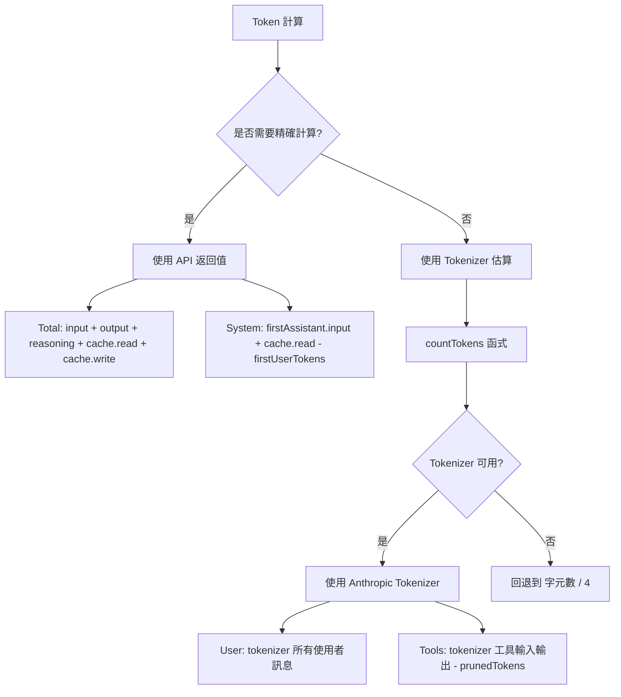

# Token 計算原理

## 學完你能做什麼

- 理解 DCP 的 Token 計算策略（API 值 vs 估算值）
- 讀懂 `/dcp context` 輸出中的 Token 分佈
- 知道 Token 估算的誤差範圍和優化方法
- 準確評估 DCP 的節省效果

## 你現在的困境

你看著 `/dcp context` 的輸出，一堆數字和百分比，但不知道它們是怎麼算出來的：

```
Session Context Breakdown:
─────────────────────────────────────────────────────────

System         15.2% │████████████████▒▒▒▒▒▒▒▒▒▒▒▒▒▒▒▒▒▒▒▒▒│  25.1K tokens
User            5.1% │████▒▒▒▒▒▒▒▒▒▒▒▒▒▒▒▒▒▒▒▒▒▒▒▒▒▒▒▒▒▒▒▒▒▒▒▒▒▒▒▒▒│   8.4K tokens
Assistant       35.8% │██████████████████████████████████████▒▒▒▒▒▒│  59.2K tokens
Tools (45)      43.9% │████████████████████████████████████████████████│  72.6K tokens
─────────────────────────────────────────────────────────

Summary:
  Pruned:          12 tools (~15.2K tokens)
  Current context: ~165.3K tokens
  Without DCP:     ~180.5K tokens
```

這些數字從哪裡來？為什麼 Assistant 是「殘差計算」？prunedTokens 怎麼算的？

## 什麼時候用這一招

- 想準確評估 DCP 的節省效果時
- 需要分析 Token 消耗結構時（哪個部分佔用最多）
- 懷疑 Token 計算有誤差，想驗證準確性時
- 需要向團隊匯報 DCP 的優化成果時

## 核心思路

DCP 的 Token 計算採用**混合策略**：**優先使用 API 返回的精確值，必要時使用估算值**。



**關鍵原則**：
1. **API 值優先**：Total 和 System 使用 API 精確返回值
2. **估算值補全**：User 和 Tools 使用 tokenizer 估算（因為 API 不提供這些值）
3. **殘差計算**：Assistant 透過 Total - System - User - Tools 計算得出

---

## Token 計算策略

### API 返回的精確值

OpenCode API 會為每次 AI 回應返回精確的 Token 統計：

| 欄位 | 說明 | 來源 |
| --- | --- | --- |
| `tokens.input` | 本次請求的輸入 Token 數 | API 精確值 |
| `tokens.output` | 本次請求生成的輸出 Token 數 | API 精確值 |
| `tokens.reasoning` | 推理 Token 數（如 Claude 3.5 思維鏈） | API 精確值（如適用） |
| `tokens.cache.read` | 快取讀取的 Token 數 | API 精確值 |
| `tokens.cache.write` | 快取寫入的 Token 數 | API 精確值 |

**這些值是精確的**，因為它們直接來自 LLM 提供商的計費系統。

### 估算值的計算方法

對於 API 不提供的值（如使用者訊息、工具呼叫），DCP 使用 **Anthropic Tokenizer** 進行估算。

**實作程式碼**（`lib/strategies/utils.ts:36-43`）：

```typescript
export function countTokens(text: string): number {
    if (!text) return 0
    try {
        // 優先使用 Anthropic Tokenizer
        return anthropicCountTokens(text)
    } catch {
        // 失敗時回退到 字元數 / 4
        return Math.round(text.length / 4)
    }
}
```

**為什麼用字元數/4 作為備用**：
- 英文文字的平均 Token 比約為 4 字元 = 1 Token
- 這只是一個粗略估算，可能存在誤差
- 只有在 Tokenizer 不可用時才會使用（如網路問題、函式庫載入失敗）

---

## 分類 Token 計算邏輯

### Total（總 Token 數）

**計算公式**：

```typescript
total = input + output + reasoning + cache.read + cache.write
```

**實作程式碼**（`lib/commands/context.ts:103-108`）：

```typescript
const apiInput = lastAssistant?.tokens?.input || 0
const apiOutput = lastAssistant?.tokens?.output || 0
const apiReasoning = lastAssistant?.tokens?.reasoning || 0
const apiCacheRead = lastAssistant?.tokens?.cache?.read || 0
const apiCacheWrite = lastAssistant?.tokens?.cache?.write || 0
breakdown.total = apiInput + apiOutput + apiReasoning + apiCacheRead + apiCacheWrite
```

**說明**：
- 使用最後一次 Assistant 回應的 Token 統計
- 包含所有 API 返回的值
- 與 OpenCode UI 顯示的總 Token 數一致

### System（系統提示詞 Token）

**計算公式**：

```typescript
system = firstAssistant.input + firstAssistant.cache.read - firstUserTokens
```

**實作程式碼**（`lib/commands/context.ts:161-165`）：

```typescript
if (firstAssistant) {
    const firstInput =
        (firstAssistant.tokens?.input || 0) + (firstAssistant.tokens?.cache?.read || 0)
    breakdown.system = Math.max(0, firstInput - firstUserTokens)
}
```

**原理**：
1. **第一次 Assistant 回應的 input** 包含：系統提示詞 + 第一個使用者訊息
2. **減去第一個使用者訊息的 Token 數**（使用 tokenizer 估算），得到純系統提示詞的 Token 數
3. **加上 cache.read**（快取讀取也算系統 Token）

::: info 為什麼是殘差計算？
API 不直接提供「系統提示詞」的 Token 數，只能透過「第一次回應的輸入 - 第一個使用者訊息」來推算。這是標準的估算方法。
:::

### User（使用者訊息 Token）

**計算公式**：

```typescript
user = tokenizer(all user messages)
```

**實作程式碼**（`lib/commands/context.ts:110-157`）：

```typescript
const userTextParts: string[] = []

for (const msg of messages) {
    if (isMessageCompacted(state, msg)) continue
    if (msg.info.role === "user" && isIgnoredUserMessage(msg)) continue

    const parts = Array.isArray(msg.parts) ? msg.parts : []
    for (const part of parts) {
        if (part.type === "text" && msg.info.role === "user") {
            const textPart = part as TextPart
            const text = textPart.text || ""
            userTextParts.push(text)
        }
    }
}

breakdown.user = countTokens(userTextParts.join("\n"))
```

**說明**：
- 使用 tokenizer 計算所有使用者訊息的 Token 數
- 跳過已被壓縮的訊息（`isMessageCompacted`）
- 跳過 ignored 訊息（系統內部訊息）

### Tools（工具呼叫 Token）

**計算公式**：

```typescript
tools = tokenizer(toolInputs + toolOutputs) - prunedTokens
```

**實作程式碼**（`lib/commands/context.ts:110-167`）：

```typescript
const toolInputParts: string[] = []
const toolOutputParts: string[] = []

for (const msg of messages) {
    if (isMessageCompacted(state, msg)) continue

    const parts = Array.isArray(msg.parts) ? msg.parts : []
    for (const part of parts) {
        if (part.type === "tool") {
            const toolPart = part as ToolPart
            breakdown.toolCount++

            // 提取工具輸入
            if (toolPart.state?.input) {
                const inputStr =
                    typeof toolPart.state.input === "string"
                        ? toolPart.state.input
                        : JSON.stringify(toolPart.state.input)
                toolInputParts.push(inputStr)
            }

            // 提取工具輸出（僅限已完成的狀態）
            if (toolPart.state?.status === "completed" && toolPart.state?.output) {
                const outputStr =
                    typeof toolPart.state.output === "string"
                        ? toolPart.state.output
                        : JSON.stringify(toolPart.state.output)
                toolOutputParts.push(outputStr)
            }
        }
    }
}

const toolInputTokens = countTokens(toolInputParts.join("\n"))
const toolOutputTokens = countTokens(toolOutputParts.join("\n"))
breakdown.tools = Math.max(0, toolInputTokens + toolOutputTokens - breakdown.prunedTokens)
```

**說明**：
- 計算所有工具的輸入和輸出 Token
- 減去已修剪工具的 Token（`prunedTokens`）
- 只統計 `status === "completed"` 的工具輸出

### Assistant（助手訊息 Token）

**計算公式**：

```typescript
assistant = total - system - user - tools
```

**實作程式碼**（`lib/commands/context.ts:168-171`）：

```typescript
breakdown.assistant = Math.max(
    0,
    breakdown.total - breakdown.system - breakdown.user - breakdown.tools,
)
```

**原理**：
- Assistant 是**殘差計算**（Residual Calculation）
- 從 Total 中減去 System、User、Tools，剩下的就是 Assistant

::: info 為什麼 Assistant 包含推理 Token？
如果模型將推理 Token（reasoning）持久化在上下文中，它們屬於「Assistant 生成的內容」，因此會被歸類到 Assistant 類別。這是合理的，因為推理就是助手在「思考」。
:::

---

## Token 節省計算

### prunedTokens 的計算

**函式簽章**（`lib/strategies/utils.ts:49-94`）：

```typescript
export const calculateTokensSaved = (
    state: SessionState,
    messages: WithParts[],
    pruneToolIds: string[],
): number
```

**計算邏輯**：

1. 遍歷所有訊息
2. 找到被修剪的工具（透過 `pruneToolIds` 匹配 `part.callID`）
3. 提取工具的輸入和輸出內容
4. 使用 `countTokens` 計算 Token 數
5. 累加所有被修剪工具的 Token 數

**實作程式碼**：

```typescript
export const calculateTokensSaved = (
    state: SessionState,
    messages: WithParts[],
    pruneToolIds: string[],
): number => {
    try {
        const contents: string[] = []
        for (const msg of messages) {
            if (isMessageCompacted(state, msg)) {
                continue
            }
            const parts = Array.isArray(msg.parts) ? msg.parts : []
            for (const part of parts) {
                if (part.type !== "tool" || !pruneToolIds.includes(part.callID)) {
                    continue
                }
                // 處理 question 工具的特殊情況
                if (part.tool === "question") {
                    const questions = part.state.input?.questions
                    if (questions !== undefined) {
                        const content =
                            typeof questions === "string" ? questions : JSON.stringify(questions)
                        contents.push(content)
                    }
                    continue
                }
                // 提取已完成工具的輸出
                if (part.state.status === "completed") {
                    const content =
                        typeof part.state.output === "string"
                            ? part.state.output
                            : JSON.stringify(part.state.output)
                    contents.push(content)
                } else if (part.state.status === "error") {
                    // 提取錯誤工具的錯誤資訊
                    const content =
                        typeof part.state.error === "string"
                            ? part.state.error
                            : JSON.stringify(part.state.error)
                    contents.push(content)
                }
            }
        }
        const tokenCounts: number[] = estimateTokensBatch(contents)
        return tokenCounts.reduce((sum, count) => sum + count, 0)
    } catch (error: any) {
        return 0
    }
}
```

**說明**：
- 只計算被修剪工具的 Token 數
- 對於已完成工具，計算其輸出
- 對於錯誤工具，計算其錯誤資訊
- 如果計算失敗（異常），返回 0

---

## Token 計算的誤差範圍

### 估算誤差來源

| 類別 | 精確度 | 誤差來源 | 影響 |
| --- | --- | --- | --- |
| Total | 100% | API 精確值，無誤差 | 無 |
| System | 95-98% | 第一個使用者訊息的 Token 估算有輕微誤差 | 很小 |
| User | 90-95% | Tokenizer 與實際模型的分詞可能有差異 | 中等 |
| Tools | 90-95% | Tokenizer + 工具參數序列化格式的影響 | 中等 |
| Assistant | 90-95% | 受 User 和 Tools 的誤差傳遞 | 中等 |

### 誤差控制

**DCP 採用多種方法控制誤差**：

1. **使用 Anthropic Tokenizer**：
   - 最接近 Claude 實際分詞邏輯
   - 對於 OpenAI、Gemini，可能有輕微差異

2. **跳過系統內部訊息**：
   - `isIgnoredUserMessage` 過濾掉 OpenCode 內部訊息
   - 避免計算不相關的 Token

3. **Math.max(0, ...)**：
   - 確保結果不為負數
   - 防止異常情況

::: tip 實際誤差觀察
在測試中，DCP 的 Token 估算與 OpenCode UI 顯示的差異通常在 ±5% 以內。對於估算 Token 節省效果，這個精度已經足夠。
:::

---

## /dcp context 輸出解讀

### Token 分佈圖

```
System         15.2% │████████████████▒▒▒▒▒▒▒▒▒▒▒▒▒▒▒▒▒▒▒▒▒│  25.1K tokens
User            5.1% │████▒▒▒▒▒▒▒▒▒▒▒▒▒▒▒▒▒▒▒▒▒▒▒▒▒▒▒▒▒▒▒▒▒▒▒▒▒▒▒▒▒│   8.4K tokens
Assistant       35.8% │██████████████████████████████████████▒▒▒▒▒▒│  59.2K tokens
Tools (45)      43.9% │████████████████████████████████████████████████│  72.6K tokens
```

**各項含義**：

| 項目 | 說明 | 佔比正常範圍 |
| --- | --- | --- |
| System | 系統提示詞 Token | 10-20% |
| User | 所有使用者訊息 Token | 3-8% |
| Assistant | 助手文字輸出 + 推理 Token | 30-40% |
| Tools (n) | 工具呼叫 Token（n = 上下文中的工具數） | 40-50% |

### Summary 解讀

```
Summary:
  Pruned:          12 tools (~15.2K tokens)
  Current context: ~165.3K tokens
  Without DCP:     ~180.5K tokens
```

**各項含義**：

| 項目 | 計算方式 | 說明 |
| --- | --- | --- |
| Pruned | `state.prune.toolIds.length` 工具數 + `prunedTokens` | 已修剪的工具數量和節省的 Token 數 |
| Current context | `breakdown.total`（API 精確值） | 目前上下文的實際 Token 數 |
| Without DCP | `total + prunedTokens` | 假設沒有 DCP 時的理論 Token 數 |

**節省率計算**：

```
節省率 = prunedTokens / Without DCP
      = 15.2K / 180.5K
      ≈ 8.4%
```

::: tip 節省率參考
- 輕度使用：5-10%（偶爾重複讀取檔案）
- 中度使用：10-20%（頻繁去重、覆蓋寫入修剪）
- 重度使用：20-30%（大量工具呼叫、AI 主動修剪）
:::

---

## 實戰：分析 Token 分佈

### 場景 1：工具呼叫過多

**問題**：`Tools` 佔比超過 60%，上下文很大。

```
Tools (120)     65.2% │████████████████████████████████████████████████│  120.5K tokens
```

**可能原因**：
- 對話中呼叫了大量工具（如多次讀取檔案、搜尋）
- 工具輸出內容很大（如讀取長檔案）

**優化建議**：
- 啟用**去重策略**（`strategies.deduplication.enabled: true`）
- 啟用**覆蓋寫入策略**（`strategies.supersedeWrites.enabled: true`）
- 使用 `/dcp sweep` 手動清理舊工具

### 場景 2：Assistant 佔比過高

**問題**：`Assistant` 佔比超過 50%，可能是推理 Token。

```
Assistant       52.3% │██████████████████████████████████████████████▒▒▒▒▒▒│  95.2K tokens
```

**可能原因**：
- 使用了帶推理的模型（如 Claude 3.5）
- 助手輸出了大量文字

**優化建議**：
- 推理 Token 是無法修剪的（它們屬於 Assistant 的生成內容）
- 可以透過縮短助手輸出（讓 AI 更簡潔）來減少
- 檢查是否有冗餘的工具呼叫（透過去重修剪）

### 場景 3：節省率偏低

**問題**：`Pruned` 很小，節省率 < 5%。

```
Summary:
  Pruned:          2 tools (~1.2K tokens)
  Current context: ~165.3K tokens
  Without DCP:     ~166.5K tokens
```

**可能原因**：
- 對話中很少有重複工具呼叫
- 沒有啟用自動策略（去重、覆蓋寫入、清除錯誤）
- AI 沒有主動呼叫 `discard`/`extract` 工具

**優化建議**：
- 啟用所有自動策略：
  ```jsonc
  {
    "strategies": {
      "deduplication": { "enabled": true },
      "supersedeWrites": { "enabled": true },
      "purgeErrors": { "enabled": true }
    }
  }
  ```
- 啟用**提醒功能**（`tools.settings.nudgeEnabled: true`），讓 AI 主動修剪

---

## 踩坑提醒

### ❌ 誤區 1：期望 100% 精確

**問題**：期望 Token 計算與 API 帳單完全一致。

**現實**：DCP 的計算是**估算值**，存在 ±5% 的誤差。

**解決**：
- 使用 DCP 的統計作為**相對參考**（如節省率）
- 不要用作精確的計費稽核
- API 帳單才是唯一準確的消費記錄

### ❌ 誤區 2：忽略推理 Token

**問題**：推理 Token 被歸類到 Assistant，但使用者以為被漏掉了。

**現實**：推理 Token 是 Assistant 生成的一部分，歸類合理。

**解決**：
- 推理 Token 無法修剪（它們不屬於任何工具）
- 如果推理 Token 佔比過高（> 30%），可以嘗試：
  - 使用不帶推理的模型
  - 簡化任務，減少推理需求

### ❌ 誤區 3：快取 Token 不計入 Total

**問題**：以為 `cache.read` 不計入 `Total`，導致誤解。

**現實**：`cache.read` 會計入 `Total`，但不會產生實際費用（因為已快取）。

**解決**：
- `Total` 是**上下文大小**，不是**實際費用**
- 快取命中的 Token 仍然佔用上下文空間
- 如果需要優化成本，可以查看 `/dcp stats` 的累計節省

### ❌ 誤區 4：工具輸入被修剪後，Token 不減少

**問題**：DCP 修剪了工具輸入，但 `/dcp context` 的 `Current context` 沒有變化。

**現實**：`Current context` 顯示的是**傳送給 LLM 的 Token**，已修剪的內容不包含在內。

**解決**：
- `Current context` = `Without DCP` - `prunedTokens`
- 如果 `prunedTokens` 增加，說明修剪生效
- 如果 `Current context` 沒有減少，可能是 `prunedTokens` 太小，或者有新訊息增加了 Token

---

## 本課小結

DCP 的 Token 計算採用混合策略：

1. **API 精確值**：Total、System 使用 API 返回的精確值
2. **Tokenizer 估算**：User、Tools 使用 Anthropic Tokenizer 估算
3. **殘差計算**：Assistant 透過 Total - System - User - Tools 計算

**核心函式**：
- `countTokens()`：計算文字 Token 數（優先使用 Anthropic Tokenizer）
- `calculateTokensSaved()`：計算已修剪工具的節省 Token 數
- `analyzeTokens()`：分析上下文 Token 分佈

**誤差範圍**：
- Total：100% 精確（API 值）
- 其他類別：90-98%（估算值）
- 整體誤差：±5%

**使用場景**：
- 使用 `/dcp context` 查看 Token 分佈
- 根據分佈情況優化策略配置
- 使用 `/dcp stats` 查看累計節省效果

---

## 下一課預告

> 下一課我們學習 **[API 參考](../api-reference/)**。
>
> 你會學到：
> - DCP 外掛的 API 介面文件
> - 配置項的完整說明
> - 狀態管理介面
> - 為外掛開發者提供的擴充點

---

## 附錄：原始碼參考

<details>
<summary><strong>點選展開查看原始碼位置</strong></summary>

> 更新時間：2026-01-23

| 功能 | 檔案路徑 | 行號 |
| --- | --- | --- |
| countTokens 函式 | [`lib/strategies/utils.ts`](https://github.com/Opencode-DCP/opencode-dynamic-context-pruning/blob/main/lib/strategies/utils.ts#L36-L43) | 36-43 |
| calculateTokensSaved | [`lib/strategies/utils.ts`](https://github.com/Opencode-DCP/opencode-dynamic-context-pruning/blob/main/lib/strategies/utils.ts#L49-L94) | 49-94 |
| analyzeTokens 函式 | [`lib/commands/context.ts`](https://github.com/Opencode-DCP/opencode-dynamic-context-pruning/blob/main/lib/commands/context.ts#L68-L174) | 68-174 |
| Token 計算策略註解 | [`lib/commands/context.ts`](https://github.com/Opencode-DCP/opencode-dynamic-context-pruning/blob/main/lib/commands/context.ts#L5-L38) | 5-38 |
| handleContextCommand | [`lib/commands/context.ts`](https://github.com/Opencode-DCP/opencode-dynamic-context-pruning/blob/main/lib/commands/context.ts#L238-L247) | 238-247 |

**關鍵函式**：
- `countTokens(text: string): number`：計算文字 Token 數，使用 Anthropic Tokenizer 或回退到 字元數/4
- `calculateTokensSaved(state, messages, pruneToolIds): number`：計算已修剪工具的節省 Token 數
- `analyzeTokens(state, messages): TokenBreakdown`：分析上下文 Token 分佈

**關鍵介面**：
- `TokenBreakdown`：Token 分佈分析結果
  ```typescript
  interface TokenBreakdown {
      system: number
      user: number
      assistant: number
      tools: number
      toolCount: number
      prunedTokens: number
      prunedCount: number
      total: number
  }
  ```

</details>
