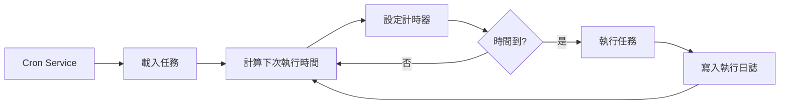

# Cron 定時任務與 Webhook

## 學完你能做什麼

本課學完後，你將能夠：

- 建立 Cron 定時任務，按指定時間或週期自動執行 AI 任務
- 理解三種調度方式（at、every、cron）的使用場景
- 設定 Webhook 接收外部事件觸發
- 設定 Gmail Pub/Sub 整合，實現郵件觸發 AI 回應
- 管理任務執行歷史和日誌

## 你現在的困境

你可能遇到了這些情況：

- 需要在固定時間提醒自己處理某些事情
- 想要定期總結工作進度或產生報告
- 需要在收到特定郵件時自動觸發 AI 分析
- 不想每次都手動傳送訊息給 AI

## 什麼時候用這一招

**Cron 定時任務**適合這些場景：

| 場景 | 範例 | 調度方式 |
|--- | --- | ---|
| 一次性提醒 | "明天上午 9 點提醒我開會" | at |
| 定期檢查 | "每 30 分鐘檢查一下系統狀態" | every |
| 按時執行 | "每天下午 5 點產生日報" | cron |
| 複雜週期 | "每週一到週五上午 9 點" | cron |

**Webhook**適合這些場景：

- 接收 GitHub、GitLab 的推播通知
- 接收 Stripe 支付成功通知
- 接收 Twilio 來電通知
- 任何能傳送 HTTP POST 的服務

**Gmail Pub/Sub**適合這些場景：

- 收到重要郵件時自動分析
- 郵件分類和自動回覆
- 郵件內容提取和歸檔

---

## 核心思路

### Cron 任務的工作流程



### 三種調度方式對比

| 方式 | 適用場景 | 範例 | 精度 |
|--- | --- | --- | ---|
| `at` | 一次性任務 | 2026-01-27 09:00:00 | 毫秒級 |
| `every` | 固定間隔 | 每 30 分鐘 | 毫秒級 |
| `cron` | 複雜週期 | 每天上午 9 點 | 分鐘級 |

### 兩種對話目標

| 對話目標 | Payload 類型 | 說明 |
|--- | --- | ---|
| `main` | `systemEvent` | 向主對話注入系統事件 |
| `isolated` | `agentTurn` | 在隔離對話中執行 Agent |

**關鍵約束**：
- `sessionTarget="main"` 必須使用 `payload.kind="systemEvent"`
- `sessionTarget="isolated"` 必須使用 `payload.kind="agentTurn"`

---

## 🎒 開始前的準備

在開始之前，請確保：

::: warning 前置檢查
- [ ] Gateway 已啟動（[啟動 Gateway](../../start/gateway-startup/)）
- [ ] AI 模型已設定（[AI 模型設定](../models-auth/)）
- [ ] 了解基本的 Cron 表示式語法（如果使用 cron 調度）
:::

---

## 跟我做

### 第 1 步：檢查 Cron 服務狀態

**為什麼**：確認 Cron 服務已啟用並執行

```bash
## 使用 CLI 檢查 Cron 狀態
clawdbot cron status
```

**你應該看到**：

```
✓ Cron enabled
  Store: ~/.clawdbot/cron.json
  Jobs: 0
  Next wake: null
```

如果顯示 `disabled`，需要在設定檔中啟用：

```json
{
  "cron": {
    "enabled": true,
    "store": "~/.clawdbot/cron.json",
    "maxConcurrentRuns": 5
  }
}
```

---

### 第 2 步：建立一次性定時任務

**為什麼**：學習最基本的 `at` 調度方式

使用 cron 工具新增一個 1 分鐘後執行的任務：

```json
{
  "action": "add",
  "job": {
    "name": "測試提醒",
    "enabled": true,
    "schedule": {
      "kind": "at",
      "atMs": 1738000000000
    },
    "sessionTarget": "main",
    "wakeMode": "next-heartbeat",
    "payload": {
      "kind": "systemEvent",
      "text": "這是一條測試提醒：檢查工作進度"
    }
  }
}
```

**你應該看到**：

```
✓ Job added: job_xxx
  Name: 測試提醒
  Next run: 2026-01-27 10:00:00
```

**提示**：`atMs` 是 Unix 時間戳（毫秒）。可以使用 JavaScript 計算：

```javascript
Date.now() + 60 * 1000  // 1 分鐘後
```

---

### 第 3 步：建立重複間隔任務

**為什麼**：學習 `every` 調度方式，適合定期檢查

建立一個每 30 分鐘執行一次的任務：

```json
{
  "action": "add",
  "job": {
    "name": "每30分鐘檢查系統",
    "enabled": true,
    "schedule": {
      "kind": "every",
      "everyMs": 1800000
    },
    "sessionTarget": "main",
    "wakeMode": "next-heartbeat",
    "payload": {
      "kind": "systemEvent",
      "text": "檢查系統狀態：CPU、記憶體、磁碟"
    }
  }
}
```

**你應該看到**：

```
✓ Job added: job_xxx
  Name: 每30分鐘檢查系統
  Interval: 30 minutes
  Next run: 2026-01-27 10:00:00
```

**參數說明**：
- `everyMs`: 間隔時間（毫秒）
  - 1 分鐘 = 60,000 ms
  - 5 分鐘 = 300,000 ms
  - 30 分鐘 = 1,800,000 ms
  - 1 小時 = 3,600,000 ms
- `anchorMs`（可選）：首次執行的起始時間

---

### 第 4 步：建立 Cron 表示式任務

**為什麼**：學習 `cron` 調度方式，適合複雜週期

建立一個每天上午 9 點執行的任務：

```json
{
  "action": "add",
  "job": {
    "name": "每天上午9點日報",
    "enabled": true,
    "schedule": {
      "kind": "cron",
      "expr": "0 9 * * *",
      "tz": "Asia/Shanghai"
    },
    "sessionTarget": "main",
    "wakeMode": "next-heartbeat",
    "payload": {
      "kind": "systemEvent",
      "text": "產生今日工作日報"
    }
  }
}
```

**你應該看到**：

```
✓ Job added: job_xxx
  Name: 每天上午9點日報
  Schedule: 0 9 * * * (Asia/Shanghai)
  Next run: 2026-01-27 09:00:00
```

**Cron 表示式格式**：

```
┌───────────── 分鐘 (0 - 59)
│ ┌─────────── 小時 (0 - 23)
│ │ ┌───────── 日 (1 - 31)
│ │ │ ┌─────── 月 (1 - 12)
│ │ │ │ ┌───── 星期 (0 - 7, 0 和 7 都表示週日)
│ │ │ │ │
* * * * *
```

**常用表示式**：

| 表示式 | 說明 |
|--- | ---|
| `0 9 * * *` | 每天上午 9 點 |
| `0 9 * * 1-5` | 週一到週五上午 9 點 |
| `0 */6 * * *` | 每 6 小時 |
| `0 0 * * 0` | 每週日午夜 |
| `0 9,17 * * *` | 每天 9 點和 17 點 |

::: info 時區設定
Cron 表示式預設使用 UTC 時區。使用 `tz` 欄位指定時區（如 `"Asia/Shanghai"`），確保任務在你期望的時間執行。
:::

---

### 第 5 步：使用隔離對話執行任務

**為什麼**：在隔離環境中執行 AI 任務，避免干擾主對話

建立一個在隔離對話中執行的任務：

```json
{
  "action": "add",
  "job": {
    "name": "每日摘要",
    "enabled": true,
    "schedule": {
      "kind": "cron",
      "expr": "0 18 * * *",
      "tz": "Asia/Shanghai"
    },
    "sessionTarget": "isolated",
    "wakeMode": "next-heartbeat",
    "payload": {
      "kind": "agentTurn",
      "message": "總結今天的工作：1. 完成的任務 2. 遇到的問題 3. 明天的計畫",
      "model": "anthropic/claude-sonnet-4-20250514",
      "thinking": "low"
    }
  }
}
```

**你應該看到**：

```
✓ Job added: job_xxx
  Name: 每日摘要
  Session: isolated
  Next run: 2026-01-27 18:00:00
```

**`agentTurn` Payload 參數**：

| 參數 | 類型 | 說明 |
|--- | --- | ---|
| `message` | string | 傳送給 Agent 的提示詞 |
| `model` | string | 覆蓋使用的模型（可選） |
| `thinking` | string | 思考層級："off" \| "minimal" \| "low" \| "medium" \| "high" |
| `timeoutSeconds` | number | 超時時間（秒） |
| `deliver` | boolean | 是否將結果傳送到管道 |
| `channel` | string | 目標管道（如 "whatsapp"、"telegram"） |
| `to` | string | 接收者識別碼 |
| `bestEffortDeliver` | boolean | 如果無法傳送到指定管道，是否嘗試其他管道 |

**隔離對話設定**（可選）：

```json
{
  "isolation": {
    "postToMainPrefix": "📊 每日摘要:",
    "postToMainMode": "summary",
    "postToMainMaxChars": 8000
  }
}
```

| 參數 | 說明 |
|--- | ---|
| `postToMainPrefix` | 將結果回傳到主對話時的前綴 |
| `postToMainMode` | "summary"（摘要）或 "full"（完整文字） |
| `postToMainMaxChars` | `postToMainMode="full"` 時的最大字元數 |

---

### 第 6 步：列出和管理任務

**為什麼**：查看所有任務並管理其狀態

**列出所有任務**：

```bash
clawdbot cron list
```

**你應該看到**：

```
Jobs: 3
  ✓ job_xxx: 測試提醒 (enabled, next: 2026-01-27 10:00:00)
  ✓ job_yyy: 每30分鐘檢查系統 (enabled, next: 2026-01-27 10:00:00)
  ✓ job_zzz: 每天上午9點日報 (enabled, next: 2026-01-27 09:00:00)
```

**包含已停用的任務**：

```bash
clawdbot cron list --include-disabled
```

**停用任務**：

```json
{
  "action": "update",
  "jobId": "job_xxx",
  "patch": {
    "enabled": false
  }
}
```

**啟用任務**：

```json
{
  "action": "update",
  "jobId": "job_xxx",
  "patch": {
    "enabled": true
  }
}
```

**刪除任務**：

```json
{
  "action": "remove",
  "jobId": "job_xxx"
}
```

---

### 第 7 步：立即執行任務

**為什麼**：測試任務是否正常工作，無需等待調度

```json
{
  "action": "run",
  "jobId": "job_xxx"
}
```

**你應該看到**：

```
✓ Job ran: job_xxx
  Status: ok
  Duration: 1234ms
```

**查看執行歷史**：

```json
{
  "action": "runs",
  "jobId": "job_xxx",
  "limit": 10
}
```

**你應該看到**：

```
Runs for job_xxx (10 most recent):
  2026-01-27 10:00:00 - ok - 1234ms
  2026-01-26 10:00:00 - ok - 1189ms
  2026-01-25 10:00:00 - ok - 1245ms
```

---

### 第 8 步：新增上下文到提醒任務

**為什麼**：讓 AI 了解最近的對話上下文，提供更相關的提醒

使用 `contextMessages` 參數新增最近的訊息歷史：

```json
{
  "action": "add",
  "job": {
    "name": "任務跟進提醒",
    "enabled": true,
    "schedule": {
      "kind": "cron",
      "expr": "0 10,16 * * *",
      "tz": "Asia/Shanghai"
    },
    "sessionTarget": "main",
    "wakeMode": "next-heartbeat",
    "payload": {
      "kind": "systemEvent",
      "text": "跟進你的任務進度：1. 檢查待辦事項 2. 更新專案狀態"
    },
    "contextMessages": 5
  }
}
```

**上下文訊息限制**：
- 最大訊息數：10 條
- 每條訊息最大字元數：220
- 總字元數限制：700
- 格式：`- User: ...\n- Assistant: ...`

**自動新增的上下文**：

```
跟進你的任務進度：1. 檢查待辦事項 2. 更新專案狀態

Recent context:
- User: 我需要在今天完成報告
- Assistant: 明白了，你需要寫什麼類型的報告？
- User: 是週報，包含本週的工作總結
```

---

## Webhook 設定

### Webhook 概述

Webhook 允許外部服務透過 HTTP POST 請求觸發 Clawdbot 的內部事件。常見用途：

- **GitHub/GitLab**: 推播通知觸發 CI/CD 流程
- **Stripe**: 支付成功通知觸發訂單處理
- **Twilio**: 來電通知觸發 AI 語音回應
- **Jira**: 工單建立通知觸發自動回覆

### 設定 Webhook

**啟用 Hooks 系統**：

```json
{
  "hooks": {
    "enabled": true,
    "path": "/hooks",
    "token": "your-secret-token-here"
  }
}
```

**設定對應規則**：

```json
{
  "hooks": {
    "enabled": true,
    "token": "your-secret-token-here",
    "mappings": [
      {
        "id": "github-push",
        "match": {
          "path": "/hooks/github"
        },
        "action": "wake",
        "wakeMode": "now",
        "sessionKey": "main",
        "messageTemplate": "GitHub 推播通知: {{ repository }} - {{ ref }}"
      }
    ]
  }
}
```

**對應設定參數**：

| 參數 | 說明 |
|--- | ---|
| `match.path` | 符合的 URL 路徑 |
| `match.source` | 符合的請求來源標頭 |
| `action` | `"wake"` 或 `"agent"` |
| `wakeMode` | `"now"` 或 `"next-heartbeat"` |
| `sessionKey` | 目標對話鍵（如 "main"） |
| `messageTemplate` | 使用 Mustache 語法的訊息範本 |
| `deliver` | 是否傳送到管道 |
| `channel` | 目標管道（如 "whatsapp"） |
| `to` | 接收者識別碼 |
| `transform` | 轉換模組（處理請求體） |

---

## Gmail Pub/Sub 整合

### Gmail Pub/Sub 概述

Gmail Pub/Sub 允許你在收到新郵件時即時觸發 Clawdbot，實現郵件驅動的 AI 回應。

### 設定 Gmail Pub/Sub

**基本設定**：

```json
{
  "hooks": {
    "enabled": true,
    "token": "your-hook-token",
    "gmail": {
      "account": "your-email@gmail.com",
      "label": "INBOX",
      "topic": "projects/your-project-id/topics/gmail-topic",
      "subscription": "gmail-subscription",
      "pushToken": "your-push-token",
      "hookUrl": "http://127.0.0.1:18789/hooks/gmail",
      "includeBody": true,
      "maxBytes": 20000,
      "renewEveryMinutes": 720
    }
  }
}
```

**設定參數說明**：

| 參數 | 說明 | 預設值 |
|--- | --- | ---|
| `account` | Gmail 帳戶位址 | - |
| `label` | 監聽的 Gmail 標籤 | `INBOX` |
| `topic` | Google Cloud Pub/Sub 主題路徑 | - |
| `subscription` | Pub/Sub 訂閱名稱 | `gmail-subscription` |
| `pushToken` | Gmail 推送令牌 | - |
| `hookUrl` | Webhook 接收 URL | 自動產生 |
| `includeBody` | 是否包含郵件內文 | `true` |
| `maxBytes` | 最大郵件位元組數 | `20000` |
| `renewEveryMinutes` | 訂閱續期間隔（分鐘） | `720`（12 小時） |

### Tailscale 整合（可選）

**使用 Tailscale Serve 暴露 Webhook**：

```json
{
  "hooks": {
    "gmail": {
      "tailscale": {
        "mode": "serve",
        "path": "/gmail-pubsub",
        "target": "10000"
      }
    }
  }
}
```

**使用 Tailscale Funnel**：

```json
{
  "hooks": {
    "gmail": {
      "tailscale": {
        "mode": "funnel",
        "path": "/gmail-pubsub"
      }
    }
  }
}
```

| 模式 | 說明 |
|--- | ---|
| `off` | 不使用 Tailscale |
| `serve` | 透過 Tailscale Serve 暴露本機服務 |
| `funnel` | 透過 Tailscale Funnel 從公網存取 |

### 啟動 Gmail Watcher

**啟動 Gmail Watcher 服務**：

```bash
clawdbot hooks gmail-watch
```

**你應該看到**：

```
✓ Gmail watcher started
  Account: your-email@gmail.com
  Label: INBOX
  Watching...
```

**Gmail Watcher 會**：
1. 訂閱 Gmail 的標籤變化
2. 接收新的郵件推播
3. 將郵件資訊傳送到 Webhook
4. 觸發 Clawdbot 的內部事件

---

## 檢查點 ✅

**確認你已掌握**：

- [ ] 能夠建立三種類型的 Cron 任務（at、every、cron）
- [ ] 理解 `main` 和 `isolated` 對話目標的區別
- [ ] 能夠列出、啟用、停用和刪除任務
- [ ] 能夠查看任務的執行歷史
- [ ] 理解 Webhook 的設定和工作原理
- [ ] 能夠設定 Gmail Pub/Sub 整合

---

## 踩坑提醒

### 任務不執行

**問題**：任務已新增但從未執行

**可能原因**：

| 原因 | 解決方法 |
|--- | ---|
| Cron 服務未啟用 | 檢查 `cron.enabled` 設定 |
| 時間未到 | 使用 `clawdbot cron list` 查看下次執行時間 |
| 時區錯誤 | 檢查 `tz` 欄位是否正確 |
| 任務已停用 | 使用 `--include-disabled` 檢查任務狀態 |

### Cron 表示式錯誤

**問題**：任務在錯誤的時間執行

**常見錯誤**：

| 錯誤 | 正確 | 說明 |
|--- | --- | ---|
| `9 * * *` | `0 9 * * *` | 缺少分鐘欄位 |
| `0 9 * * * *` | `0 9 * * *` | 多了一個欄位 |
| `0 9 1-5 * *` | `0 9 * * 1-5` | 星期欄位位置錯誤 |

**驗證工具**：使用 [crontab.guru](https://crontab.guru/) 驗證 Cron 表示式。

### Gmail Pub/Sub 不工作

**問題**：收到郵件但未觸發

**檢查清單**：

- [ ] Gmail Watcher 服務是否正在執行
- [ ] `hookUrl` 是否可存取（使用 curl 測試）
- [ ] `token` 是否正確設定
- [ ] Pub/Sub 主題和訂閱是否正確建立
- [ ] 網路連線是否正常（使用 Tailscale 時）

### 隔離對話無回應

**問題**：`sessionTarget="isolated"` 的任務沒有輸出

**可能原因**：

- 缺少 `model` 欄位，使用預設模型但未設定
- `message` 提示詞不夠清晰
- `timeoutSeconds` 太短，任務超時
- `deliver=false` 但沒有設定 `postToMainMode`

**解決方法**：

1. 增加日誌詳細程度
2. 檢查 Gateway 日誌
3. 使用 `bestEffortDeliver=true` 確保結果至少能傳回主對話

---

## 本課小結

Cron 和 Webhook 是 Clawdbot 的強大自動化工具：

**Cron 系統**：
- 三種調度方式：`at`（一次性）、`every`（間隔）、`cron`（複雜週期）
- 兩種對話目標：`main`（注入系統事件）、`isolated`（執行 Agent）
- 支援任務歷史和執行日誌
- 可新增上下文訊息提供更相關的提醒

**Webhook 系統**：
- 接收外部 HTTP POST 請求
- 支援對應規則和訊息範本
- 可設定 Tailscale 暴露公網存取

**Gmail Pub/Sub**：
- 即時監聽新郵件
- 支援標籤過濾
- 整合 Tailscale Serve/Funnel

透過合理設定這些功能，你可以建構完全自動化的 AI 助手，讓它在正確的時間做出回應。

---

## 下一課預告

> 下一課我們將學習 **[記憶系統與向量搜尋](../memory-system/)**。
>
> 你會學到：
> - 記憶系統的檔案結構和索引機制
> - 設定向量搜尋提供商（OpenAI、Gemini、本地）
> - 使用混合搜尋（BM25 + 向量）提升檢索準確率
> - 透過 CLI 管理記憶索引和搜尋

---

## 附錄：原始碼參考

<details>
<summary><strong>點擊展開查看原始碼位置</strong></summary>

> 更新時間：2026-01-27

| 功能 | 檔案路徑 | 行號 |
|--- | --- | ---|
| Cron 設定型別定義 | [`src/config/types.cron.ts`](https://github.com/clawdbot/clawdbot/blob/main/src/config/types.cron.ts#L1-L6) | 1-6 |
| Cron 核心型別定義 | [`src/cron/types.ts`](https://github.com/clawdbot/clawdbot/blob/main/src/cron/types.ts#L1-L95) | 1-95 |
| Cron Service | [`src/cron/service.ts`](https://github.com/clawdbot/clawdbot/blob/main/src/cron/service.ts#L1-L49) | 1-49 |
| Cron 操作實作 | [`src/cron/service/ops.ts`](https://github.com/clawdbot/clawdbot/blob/main/src/cron/service/ops.ts#L1-L141) | 1-141 |
| Cron 工具實作 | [`src/agents/tools/cron-tool.ts`](https://github.com/clawdbot/clawdbot/blob/main/src/agents/tools/cron-tool.ts#L1-L291) | 1-291 |
| Gateway Cron 方法 | [`src/gateway/server-methods/cron.ts`](https://github.com/clawdbot/clawdbot/blob/main/src/gateway/server-methods/cron.ts#L1-L205) | 1-205 |
| Hooks 設定型別定義 | [`src/config/types.hooks.ts`](https://github.com/clawdbot/clawdbot/blob/main/src/config/types.hooks.ts#L1-L125) | 1-125 |
| Hooks Gmail 工具 | [`src/hooks/gmail.ts`](https://github.com/clawdbot/clawdbot/blob/main/src/hooks/gmail.ts#L1-L267) | 1-267 |
| Hooks 內部事件 | [`src/hooks/hooks.ts`](https://github.com/clawdbot/clawdbot/blob/main/src/hooks/hooks.ts#L1-L15) | 1-15 |
| Hooks CLI 命令 | [`src/cli/hooks-cli.ts`](https://github.com/clawdbot/clawdbot/blob/main/src/cli/hooks-cli.ts#L1-L839) | 1-839 |

**關鍵常數**：
- `DEFAULT_GMAIL_LABEL = "INBOX"`: Gmail 預設標籤
- `DEFAULT_GMAIL_TOPIC = "gog-gmail-watch"`: Gmail 預設主題名稱
- `DEFAULT_GMAIL_SUBSCRIPTION = "gog-gmail-watch-push"`: Gmail 預設訂閱名稱
- `DEFAULT_GMAIL_MAX_BYTES = 20000`: Gmail 預設最大郵件位元組數
- `DEFAULT_GMAIL_RENEW_MINUTES = 720`: Gmail 預設續期間隔（12 小時）

**關鍵函數**：
- `CronService.start()`: 啟動 Cron 服務
- `CronService.add()`: 新增定時任務
- `CronService.update()`: 更新任務
- `CronService.remove()`: 刪除任務
- `CronService.run()`: 立即執行任務
- `createCronTool()`: 建立 Cron 工具
- `resolveGmailHookRuntimeConfig()`: 解析 Gmail Hook 設定
- `buildGogWatchStartArgs()`: 建構 Gmail Watch 啟動參數
- `buildGogWatchServeArgs()`: 建構 Gmail Watch 服務參數

</details>
