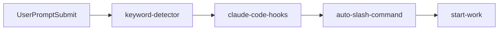
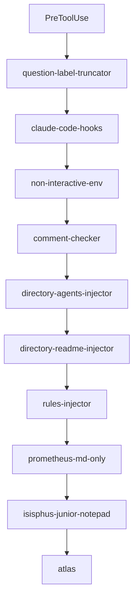
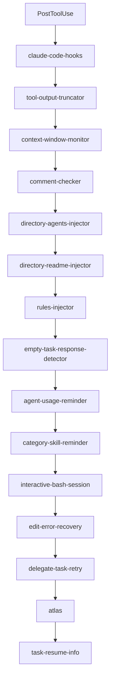
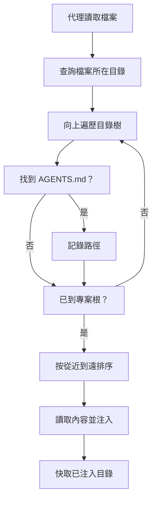
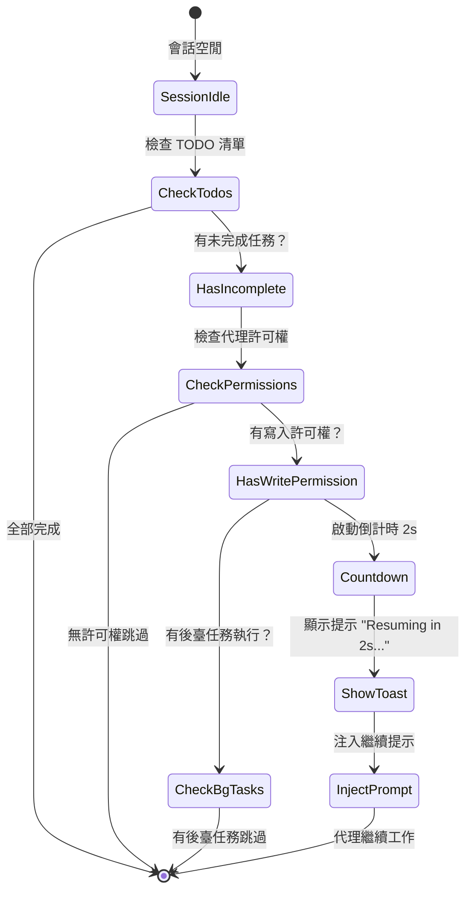
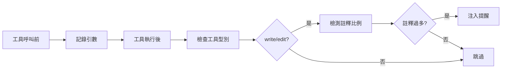

# 生命週期鉤子：自動化上下文與品質控制

## 學完你能做什麼

- 自動為 AI 代理注入專案上下文（AGENTS.md、README.md）
- 防止代理半途而廢，強制完成 TODO 清單
- 自動截斷過大的工具輸出，避免上下文視窗溢位
- 啟用 Ultrawork 模式，一鍵啟動全部專業代理
- 自訂鉤子配置，停用不需要的功能

## 你現在的困境

你是否遇到過這些問題：

- AI 代理總是忘記專案規範，重複犯錯？
- 代理寫到一半就停下來，TODO 清單沒完成？
- 程式碼庫搜尋輸出太大，把上下文視窗撐爆了？
- 每次都要手動告訴代理用什麼模式工作？

## 什麼時候用這一招

生命週期鉤子適合以下場景：

::: tip 典型場景
- **專案上下文管理**：自動注入 AGENTS.md 和 README.md
- **品質控制**：檢查程式碼註釋、驗證思維塊
- **任務連續性**：強制代理完成所有 TODO 任務
- **效能最佳化**：動態截斷輸出、上下文視窗管理
- **工作流自動化**：關鍵詞觸發模式、自動命令執行
:::

## 核心思路

### 什麼是生命週期鉤子？

**生命週期鉤子**是一種事件驅動機制，允許你在代理工作的關鍵時間點插入自訂邏輯。比如自動注入專案文件、強制完成 TODO 任務、截斷過大輸出等。這些鉤子監聽 4 種事件型別：工具執行前、工具執行後、使用者提交提示詞時、會話空閒時。透過合理配置鉤子，你可以讓 AI 代理更智慧、更符合你的工作習慣。

::: info 鉤子 vs 中介軟體
鉤子和 Web 框架的中介軟體很像，都是「在特定時刻做特定事」的機制。不同之處在於：
- **中介軟體**：線性執行，可以中斷請求
- **鉤子**：事件驅動，不能中斷，只能修改資料
:::

### 32 個鉤子，7 大類別

oh-my-opencode 提供了 32 個內建鉤子，分為 7 大類別：

| 類別 | 鉤子數量 | 主要作用 |
|---|---|---|
| **上下文注入** | 4 | 自動注入專案文件、規則 |
| **生產力與控制** | 6 | 關鍵詞檢測、模式切換、迴圈管理 |
| **品質與安全** | 4 | 程式碼註釋檢查、思維塊驗證 |
| **恢復與穩定性** | 3 | 會話恢復、錯誤處理 |
| **截斷與上下文管理** | 2 | 輸出截斷、視窗監控 |
| **通知與 UX** | 3 | 版本更新、後臺任務通知、空閒提醒 |
| **任務管理** | 2 | 任務恢復、委託重試 |

## 鉤子事件型別

鉤子監聽以下 4 種事件：

### 1. PreToolUse（工具執行前）

**觸發時機**：代理呼叫工具之前

**能做什麼**：
- 阻止工具執行
- 修改工具引數
- 注入上下文

**示例鉤子**：`comment-checker`、`directory-agents-injector`

### 2. PostToolUse（工具執行後）

**觸發時機**：工具執行完成後

**能做什麼**：
- 修改工具輸出
- 新增警告資訊
- 注入後續指令

**示例鉤子**：`tool-output-truncator`、`directory-readme-injector`

### 3. UserPromptSubmit（使用者提交提示詞時）

**觸發時機**：使用者傳送訊息到會話

**能做什麼**：
- 阻止提交（罕見）
- 修改提示詞內容
- 注入系統訊息
- 啟用工作模式

**示例鉤子**：`keyword-detector`、`auto-slash-command`

### 4. Stop（會話空閒時）

**觸發時機**：代理停止工作，會話進入空閒狀態

**能做什麼**：
- 注入後續提示詞
- 傳送通知
- 檢查任務狀態

**示例鉤子**：`todo-continuation-enforcer`、`session-notification`

## 鉤子執行順序

鉤子按固定順序執行，確保邏輯正確性：

### UserPromptSubmit 事件



**順序說明**：
1. `keyword-detector`：檢測關鍵詞（ultrawork、search、analyze）
2. `claude-code-hooks`：執行 Claude Code 相容層鉤子
3. `auto-slash-command`：自動執行斜槓命令
4. `start-work`：處理 `/start-work` 命令

### PreToolUse 事件



**順序說明**：
1. `question-label-truncator`：截斷工具標籤
2. `claude-code-hooks`：Claude Code 相容層
3. `non-interactive-env`：處理非互動式環境
4. `comment-checker`：檢查程式碼註釋
5. `directory-agents-injector`：注入 AGENTS.md
6. `directory-readme-injector`：注入 README.md
7. `rules-injector`：注入專案規則
8. `prometheus-md-only`：強制 Prometheus 只輸出 Markdown
9. `sisyphus-junior-notepad`：為 Sisyphus Junior 注入提示
10. `atlas`：Atlas 主編排邏輯

### PostToolUse 事件



**順序說明**：
1. `claude-code-hooks`：Claude Code 相容層
2. `tool-output-truncator`：截斷工具輸出
3. `context-window-monitor`：監控上下文視窗
4. `comment-checker`：檢查程式碼註釋
5. `directory-agents-injector`：注入 AGENTS.md
6. `directory-readme-injector`：注入 README.md
7. `rules-injector`：注入專案規則
8. `empty-task-response-detector`：檢測空響應
9. `agent-usage-reminder`：提醒使用專業代理
10. `category-skill-reminder`：提醒使用 Category/Skill
11. `interactive-bash-session`：管理互動式 Bash 會話
12. `edit-error-recovery`：恢復編輯錯誤
13. `delegate-task-retry`：重試失敗的委託任務
14. `atlas`：Atlas 主編排邏輯
15. `task-resume-info`：提供任務恢復資訊

## 核心鉤子詳解

### 1. directory-agents-injector（AGENTS.md 注入）

**觸發事件**：PostToolUse

**功能**：當代理讀取檔案時，自動從檔案目錄向上遍歷到專案根目錄，收集所有路徑上的 `AGENTS.md` 檔案，並注入到代理的上下文中。

**工作流程**：



**示例**：

專案結構：
```
project/
├── AGENTS.md              # 專案級上下文
├── src/
│   ├── AGENTS.md          # src 級上下文
│   └── components/
│       ├── AGENTS.md      # components 級上下文
│       └── Button.tsx
```

當代理讀取 `Button.tsx` 時，會自動注入：
1. `components/AGENTS.md`（最先注入）
2. `src/AGENTS.md`
3. `AGENTS.md`（專案根）

::: tip 最佳實踐
- 在每個主要目錄建立 `AGENTS.md`，說明該目錄的職責和規範
- AGENTS.md 遵循「從近到遠」原則，最近的最優先
- 已注入的目錄會被快取，避免重複注入
:::

**原始碼位置**：`src/hooks/directory-agents-injector/index.ts` (183 行)

### 2. todo-continuation-enforcer（TODO 強制繼續）

**觸發事件**：Stop

**功能**：檢測代理的 TODO 清單，如果有未完成的 TODO，強制代理繼續工作，防止半途而廢。

**工作流程**：



**倒計時機制**：
- 預設倒計時 2 秒
- 顯示 Toast 提示："Resuming in 2s... (X tasks remaining)"
- 使用者可以在倒計時內手動取消

**跳過條件**：
1. 代理沒有寫入許可權（read-only 代理）
2. 代理在跳過清單中（prometheus、compaction）
3. 有後臺任務正在執行
4. 會話正在恢復中

**原始碼位置**：`src/hooks/todo-continuation-enforcer.ts` (490 行)

### 3. keyword-detector（關鍵詞檢測）

**觸發事件**：UserPromptSubmit

**功能**：檢測使用者提示詞中的關鍵詞，自動啟用對應模式：

| 關鍵詞 | 啟用模式 | 說明 |
|---|---|---|
| `ultrawork` / `ulw` | **最大效能模式** | 啟用所有專業代理和並行任務 |
| `search` / `find` | **並行探索模式** | 並行啟動 explore/librarian |
| `analyze` / `investigate` | **深度分析模式** | 啟用深度探索和分析 |

**使用示例**：

```
使用者輸入：
ultrawork 開發一個 REST API，包含認證和授權

系統響應：
[✅ Ultrawork Mode Activated]
Maximum precision engaged. All agents at your disposal.
```

**實現細節**：
- 關鍵詞檢測支援變體（ultrawork = ulw）
- 主會話和非主會話的處理不同
- 模式設定透過 `message.variant` 傳遞給代理
- 後臺任務會話不進行關鍵詞檢測

**原始碼位置**：`src/hooks/keyword-detector/index.ts` (101 行)

### 4. tool-output-truncator（工具輸出截斷）

**觸發事件**：PostToolUse

**功能**：動態截斷過大的工具輸出，保留 50% 的上下文視窗 headroom，最大截斷到 50k tokens。

**支援的工具**：

```typescript
const TRUNCATABLE_TOOLS = [
  "grep", "Grep", "safe_grep",
  "glob", "Glob", "safe_glob",
  "lsp_diagnostics",
  "ast_grep_search",
  "interactive_bash", "Interactive_bash",
  "skill_mcp",
  "webfetch", "WebFetch",
]
```

**特殊限制**：
- `webfetch` 最大 10k tokens（網頁內容需要更激進的截斷）
- 其他工具最大 50k tokens

**截斷策略**：
1. 根據剩餘上下文視窗動態計算截斷點
2. 保留輸出頭部和尾部，中間用省略號代替
3. 新增截斷提示：`[Note: Content was truncated to save context window space. For full context, please read file directly: {path}]`

::: warning 啟用更激進的截斷
在 `oh-my-opencode.json` 中配置：
```json
{
  "experimental": {
    "truncate_all_tool_outputs": true
  }
}
```
這會截斷所有工具輸出，不僅僅是 TRUNCATABLE_TOOLS 清單中的工具。
:::

**原始碼位置**：`src/hooks/tool-output-truncator.ts` (62 行)

### 5. comment-checker（程式碼註釋檢查）

**觸發事件**：PreToolUse / PostToolUse

**功能**：檢查代理是否寫入過多註釋，智慧忽略 BDD、指令、文件字串。

**工作流程**：



**智慧忽略規則**：
- BDD（行為驅動開發）註釋
- 指令性註釋（如 `// TODO`, `// FIXME`）
- 文件字串（Docstrings）

**配置方式**：

```json
{
  "comment_checker": {
    "custom_prompt": "你的自訂提示詞"
  }
}
```

**原始碼位置**：`src/hooks/comment-checker/index.ts` (172 行)

## 鉤子配置

### 啟用/停用鉤子

在 `oh-my-opencode.json` 中配置：

```json
{
  "disabled_hooks": [
    "comment-checker",
    "auto-update-checker",
    "keyword-detector"
  ]
}
```

### 常見配置場景

#### 場景 1：停用註釋檢查

```json
{
  "disabled_hooks": ["comment-checker"]
}
```

#### 場景 2：停用關鍵詞檢測

```json
{
  "disabled_hooks": ["keyword-detector"]
}
```

#### 場景 3：停用 TODO 強制繼續

```json
{
  "disabled_hooks": ["todo-continuation-enforcer"]
}
```

#### 場景 4：啟用激進的輸出截斷

```json
{
  "experimental": {
    "truncate_all_tool_outputs": true
  }
}
```

## 本課小結

本課介紹了 oh-my-opencode 的 32 個生命週期鉤子：

**核心概念**：
- 鉤子是事件驅動的攔截機制
- 4 種事件型別：PreToolUse、PostToolUse、UserPromptSubmit、Stop
- 按固定順序執行，確保邏輯正確性

**常用鉤子**：
- `directory-agents-injector`：自動注入 AGENTS.md
- `todo-continuation-enforcer`：強制完成 TODO 清單
- `keyword-detector`：關鍵詞檢測啟用模式
- `tool-output-truncator`：動態截斷輸出
- `comment-checker`：檢查程式碼註釋

**配置方法**：
- 透過 `disabled_hooks` 陣列停用不需要的鉤子
- 透過 `experimental` 配置啟用實驗性功能

## 下一課預告

> 下一課我們學習 **[斜槓命令：預設工作流](../slash-commands/)**。
>
> 你會學到：
> - 6 個內建斜槓命令的使用方法
> - `/ralph-loop` 自動完成工作
> - `/refactor` 智慧重構
> - `/start-work` 執行 Prometheus 計劃
> - 如何建立自訂斜槓命令

---

## 附錄：原始碼參考

<details>
<summary><strong>點選展開檢視原始碼位置</strong></summary>

> 更新時間：2026-01-26

| 功能 | 檔案路徑 | 行號 |
|---|---|---|
|---|---|---|
|---|---|---|
|---|---|---|
|---|---|---|
|---|---|---|
|---|---|---|
|---|---|---|
|---|---|---|
|---|---|---|
|---|---|---|

**關鍵常量**：
- `AGENTS_FILENAME = "AGENTS.md"`：代理上下文檔名（`src/hooks/directory-agents-injector/constants.ts`）
- `DEFAULT_MAX_TOKENS = 50_000`：預設最大截斷 tokens（`src/hooks/tool-output-truncator.ts`）
- `WEBFETCH_MAX_TOKENS = 10_000`：webfetch 最大截斷 tokens（`src/hooks/tool-output-truncator.ts`）
- `COUNTDOWN_SECONDS = 2`：TODO 繼續倒計時秒數（`src/hooks/todo-continuation-enforcer.ts`）

**關鍵函式**：
- `createDirectoryAgentsInjectorHook(ctx)`：建立 AGENTS.md 注入鉤子
- `createTodoContinuationEnforcer(ctx, options)`：建立 TODO 強制繼續鉤子
- `createKeywordDetectorHook(ctx, collector)`：建立關鍵詞檢測鉤子
- `createToolOutputTruncatorHook(ctx, options)`：建立工具輸出截斷鉤子
- `createCommentCheckerHooks(config)`：建立程式碼註釋檢查鉤子

</details>
