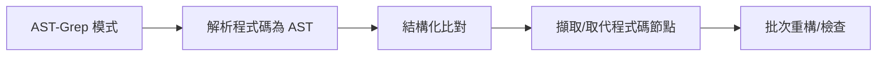

# LSP 與 AST-Grep：IDE 級別的程式碼分析和操作能力

## 學完你能做什麼

- 使用 LSP 工具在程式碼庫中跳轉、尋找符號、取得診斷資訊
- 使用 AST-Grep 進行精確的程式碼模式搜尋和取代
- 理解 LSP 和 AST-Grep 的差異及適用情境
- 讓代理具備 IDE 級別的程式碼理解和操作能力

## 你現在的困境

傳統程式碼搜尋和重構工具存在明顯限制：

| 問題 | 傳統方案 | 實際需求 |
| --- | --- | --- |
| **符號跳轉不準確** | 簡單字串比對 | 需要理解程式碼語意，跳轉到真實定義 |
| **尋找參考漏項** | 正規表示式搜尋 | 需要跨檔案、跨作用域的精確參考追蹤 |
| **重構不安全** | 手動取代 + grep | 需要理解程式碼結構，避免破壞性修改 |
| **模式比對笨拙** | 正規表示式 | 需要基於 AST 的結構化模式比對 |

::: info 關鍵概念
**LSP (Language Server Protocol)** 是 IDE 和語言伺服器之間的標準協定，透過統一的介面提供程式碼自動完成、跳轉定義、尋找參考、重新命名符號、取得診斷資訊、符號大綱等功能，讓編輯器具備強大的程式碼理解能力，同時支援型別資訊、繼承關係等進階特性。**AST-Grep** 是基於抽象語法樹的程式碼模式比對工具，能夠理解程式碼結構而非單純文字，支援使用元變數（如 `$VAR` 比對單個節點、`$$$` 比對多個節點）進行靈活的模式比對和批次重構，涵蓋 25 種程式語言（包括 TypeScript、Python、Go、Rust 等），是程式碼重構、規範檢查和結構化搜尋的強大工具。
:::

## 什麼時候用這一招

| 工具 | 適用情境 | 範例 |
| --- | --- | --- |
| **LSP 工具** | 需要 IDE 功能時 | 跳轉到定義、尋找所有參考、取得錯誤清單、重新命名符號 |
| **AST-Grep** | 需要程式碼模式比對 | 搜尋特定程式碼結構、批次重構、檢查程式碼規範 |
| **Grep/Glob** | 簡單文字搜尋 | 尋找函式名稱、檔案名稱比對 |

## 🎒 開始前的準備

在使用 LSP 和 AST-Grep 工具之前，請確保：

1. **已安裝 Language Server**
   - TypeScript/JavaScript: `npm install -g typescript-language-server`
   - Python: `pip install basedpyright` 或 `pip install ruff`
   - Go: `go install golang.org/x/tools/gopls@latest`
   - Rust: `rustup component add rust-analyzer`

2. **已安裝 AST-Grep CLI**
   ```bash
   bun add -D @ast-grep/cli
   ```

3. **設定了 LSP 伺服器**
   - LSP 伺服器設定在 OpenCode 的 `opencode.json` 中
   - oh-my-opencode 會自動讀取並使用這些設定

::: tip 檢查環境
使用以下指令檢查環境：
```bash
# 檢查 LSP 伺服器
oh-my-opencode doctor

# 檢查 AST-Grep
which sg
```
:::

## 核心思路

### LSP 工具：IDE 級別的程式碼理解

LSP 工具讓 AI 代理具備與 IDE 相同的程式碼理解能力：


**核心優勢**：
- ✅ 語意理解，而非簡單字串比對
- ✅ 跨檔案、跨作用域的精確追蹤
- ✅ 支援型別資訊、繼承關係等進階特性
- ✅ 與專案設定完全一致（使用相同的 LSP 伺服器）

### AST-Grep：結構化程式碼模式比對

AST-Grep 讓 AI 代理能夠進行精確的程式碼結構比對：



**核心優勢**：
- ✅ 基於程式碼結構，而非文字
- ✅ 支援元變數（`$VAR`、`$$$`）進行模式比對
- ✅ 支援多種語言（25 種）
- ✅ 可用於重構、檢查、程式碼規範驗證

## 跟我做

### 第 1 步：使用 LSP 跳轉到定義

**為什麼**
當你需要查看某個符號的定義位置時，LSP 的 `goto_definition` 工具能提供精確的跳轉，比字串搜尋更可靠。

在 OpenCode 中，代理可以自動呼叫：

```typescript
// 代理會自動呼叫
lsp_goto_definition({
  filePath: "src/utils.ts",
  line: 15,
  character: 10
})
```

**你應該看到**：
```
→ Definition found:
  File: src/types.ts
  Line: 45
  Text: export interface UserConfig {
```

::: tip 實際使用
你不需要手動呼叫這些工具，AI 代理會自動使用它們來理解程式碼。你可以直接問：「跳轉到這個函式的定義」或「這個變數在哪裡定義的？」
:::

### 第 2 步：尋找所有參考

**為什麼**
當你需要修改一個符號時，先尋找所有參考可以確保修改不會破壞其他地方的使用。

代理可以呼叫：

```typescript
lsp_find_references({
  filePath: "src/api.ts",
  line: 10,
  character: 5,
  includeDeclaration: true  // 是否包含定義本身
})
```

**你應該看到**：
```
Found 15 references (showing first 200):
  src/api.ts:10:5  - [definition] fetchData
  src/components/List.tsx:23:12 - [usage] fetchData()
  src/pages/Home.tsx:45:8 - [usage] fetchData()
  ...
```

### 第 3 步：取得檔案符號和工作區符號

**為什麼**
理解檔案結構或在整個專案中搜尋特定符號類型時，`lsp_symbols` 工具非常有用。

**檔案大綱**（scope="document"）：

```typescript
lsp_symbols({
  filePath: "src/app.tsx",
  scope: "document"
})
```

**你應該看到**：
```
Found 12 symbols:
  [Component] App (line: 10-150)
    [Function] useEffect (line: 25-35)
    [Function] handleClick (line: 40-55)
    [Variable] count (line: 15)
  ...
```

**工作區搜尋**（scope="workspace"）：

```typescript
lsp_symbols({
  filePath: "src/app.tsx",
  scope: "workspace",
  query: "fetchData"
})
```

### 第 4 步：取得診斷資訊

**為什麼**
在執行程式碼之前，LSP 的診斷工具可以提前發現錯誤、警告和提示。

```typescript
lsp_diagnostics({
  filePath: "src/utils.ts",
  severity: "error"  // 可選: "error", "warning", "information", "hint", "all"
})
```

**你應該看到**：
```
Found 3 diagnostics:
  [Error] src/utils.ts:23:5 - 'result' is used before being assigned
  [Warning] src/utils.ts:45:12 - Unused variable 'temp'
  [Hint] src/utils.ts:67:8 - This can be simplified to const x = value
```

::: tip 預先檢查
讓 AI 代理在撰寫程式碼前使用 `lsp_diagnostics` 檢查潛在問題，可以避免反覆修改。
:::

### 第 5 步：安全重新命名符號

**為什麼**
重新命名符號是常見的重構操作，但手動取代容易出錯。LSP 的 `lsp_rename` 工具可以安全地在整個工作區重新命名符號。

**步驟 1：驗證重新命名**

```typescript
lsp_prepare_rename({
  filePath: "src/api.ts",
  line: 10,
  character: 5
})
```

**你應該看到**：
```
Rename validation:
  Current name: fetchData
  Placeholder range: line 10, column 5-14
  Status: ✅ Valid
```

**步驟 2：執行重新命名**

```typescript
lsp_rename({
  filePath: "src/api.ts",
  line: 10,
  character: 5,
  newName: "fetchUserData"
})
```

**你應該看到**：
```
Applied rename to 15 files:
  src/api.ts:10:5 - fetchData → fetchUserData
  src/components/List.tsx:23:12 - fetchData() → fetchUserData()
  src/pages/Home.tsx:45:8 - fetchData → fetchUserData()
  ...
```

### 第 6 步：使用 AST-Grep 搜尋程式碼模式

**為什麼**
當你需要尋找特定的程式碼結構（如所有使用了 `console.log` 的地方）時，AST-Grep 比 grep 更精確。

**基礎模式搜尋**：

```typescript
ast_grep_search({
  pattern: "console.log($MSG)",
  lang: "typescript",
  paths: ["src"],
  context: 2  // 顯示比對前後的脈絡行數
})
```

**你應該看到**：
```
src/utils.ts:15:
  13 | function debug(message) {
  14 |   console.log(message)
  15 |   console.log("Debug mode")
  16 | }
  17 | }

src/components/App.tsx:23:
  21 | useEffect(() => {
  22 |   console.log("Component mounted")
  23 | }, [])
```

**使用元變數**：

```typescript
// 比對所有函式呼叫
ast_grep_search({
  pattern: "$FUNC($$$)",
  lang: "typescript",
  paths: ["src"]
})
```

```typescript
// 比對所有非同步函式
ast_grep_search({
  pattern: "async function $NAME($$$) { $$$ }",
  lang: "typescript",
  paths: ["src"]
})
```

::: warning 重要：模式必須是完整的 AST 節點
❌ 錯誤：`export async function $NAME`
✅ 正確：`export async function $NAME($$$) { $$$ }`

模式必須是有效的程式碼片段，包含完整的函式簽章和函式主體。
:::

### 第 7 步：使用 AST-Grep 批次取代

**為什麼**
當你需要批次重構程式碼（如將所有 `console.log` 取代為 `logger.info`）時，AST-Grep 的取代功能非常強大。

**預覽取代**（dry-run）：

```typescript
ast_grep_replace({
  pattern: "console.log($MSG)",
  rewrite: "logger.info($MSG)",
  lang: "typescript",
  paths: ["src"],
  dryRun: true  // 預設為 true，只預覽不修改
})
```

**你應該看到**：
```
Preview changes (dry-run):
  src/utils.ts:15:2 - console.log("Debug mode")
                 → logger.info("Debug mode")
  src/components/App.tsx:23:4 - console.log("Component mounted")
                              → logger.info("Component mounted")

Total: 2 changes
```

**套用取代**：

```typescript
ast_grep_replace({
  pattern: "console.log($MSG)",
  rewrite: "logger.info($MSG)",
  lang: "typescript",
  paths: ["src"],
  dryRun: false  // 設定為 false 以套用變更
})
```

**你應該看到**：
```
Applied 2 changes:
  src/utils.ts:15:2 - console.log("Debug mode")
                 → logger.info("Debug mode")
  src/components/App.tsx:23:4 - console.log("Component mounted")
                              → logger.info("Component mounted")
```

::: danger 破壞性操作
`ast_grep_replace` 的 `dryRun: false` 會直接修改檔案。建議：
1. 先用 `dryRun: true` 預覽
2. 確認無誤後再套用
3. 如果專案使用 Git，可以先提交目前狀態
:::

## 檢查點 ✅

**驗證 LSP 工具**：
- [ ] 能否跳轉到符號定義？
- [ ] 能否尋找所有參考？
- [ ] 能否取得診斷資訊？
- [ ] 能否安全重新命名符號？

**驗證 AST-Grep 工具**：
- [ ] 能否搜尋程式碼模式？
- [ ] 能否使用元變數比對？
- [ ] 能否預覽和執行取代？

## 踩坑提醒

### LSP 工具常見問題

| 問題 | 原因 | 解決方法 |
| --- | --- | --- |
| **找不到定義** | LSP 伺服器未啟動或設定錯誤 | 檢查 `opencode.json` 中的 LSP 設定 |
| **參考清單不完整** | 程式碼中有錯誤，LSP 伺服器未完全分析 | 先修復程式碼中的錯誤 |
| **重新命名失敗** | 新名稱與現有符號衝突 | 使用更具體的名稱 |

### AST-Grep 常見問題

| 問題 | 原因 | 解決方法 |
| --- | --- | --- |
| **模式不比對** | 模式不完整或語法錯誤 | 確保模式是完整的 AST 節點 |
| **Python 模式尾隨冒號** | Python 的 `def` 和 `class` 不需要冒號 | ❌ `def func():` → ✅ `def func($$$):` |
| **比對過多** | 模式過於寬泛 | 使用更具體的脈絡或限制路徑 |

### 效能最佳化建議

```typescript
// ✅ 好：限制搜尋範圍
ast_grep_search({
  pattern: "$FUNC($$$)",
  lang: "typescript",
  paths: ["src/api"],  // 只搜尋特定目錄
  globs: ["*.ts"]      // 只比對特定檔案
})

// ❌ 差：搜尋整個專案
ast_grep_search({
  pattern: "$FUNC($$$)",
  lang: "typescript",
  paths: ["./"]  // 搜尋所有檔案
})
```

## LSP 工具完整清單

| 工具 | 功能 | 參數 |
| --- | --- | --- |
| `lsp_goto_definition` | 跳轉到符號定義 | `filePath`, `line`, `character` |
| `lsp_find_references` | 尋找所有參考 | `filePath`, `line`, `character`, `includeDeclaration?` |
| `lsp_symbols` | 取得檔案大綱或工作區符號 | `filePath`, `scope`, `query?`, `limit?` |
| `lsp_diagnostics` | 取得錯誤和警告 | `filePath`, `severity?` |
| `lsp_prepare_rename` | 驗證重新命名操作 | `filePath`, `line`, `character` |
| `lsp_rename` | 執行重新命名操作 | `filePath`, `line`, `character`, `newName` |

**限制**：
- 最多回傳 200 個符號、參考或診斷（可設定）
- LSP 伺服器必須已設定並執行

## AST-Grep 工具完整清單

| 工具 | 功能 | 參數 |
| --- | --- | --- |
| `ast_grep_search` | AST 模式搜尋 | `pattern`, `lang`, `paths?`, `globs?`, `context?` |
| `ast_grep_replace` | AST 模式取代 | `pattern`, `rewrite`, `lang`, `paths?`, `globs?`, `dryRun?` |

**支援的語言**（25 種）：
`bash`, `c`, `cpp`, `csharp`, `css`, `elixir`, `go`, `haskell`, `html`, `java`, `javascript`, `json`, `kotlin`, `lua`, `nix`, `php`, `python`, `ruby`, `rust`, `scala`, `solidity`, `swift`, `typescript`, `tsx`, `yaml`

**元變數**：
- `$VAR` - 比對單個節點
- `$$$` - 比對多個節點

## 實戰案例

### 案例 1：重構 API 呼叫

**情境**：將所有 `fetch` 呼叫加入錯誤處理

**使用 AST-Grep 尋找模式**：

```typescript
ast_grep_search({
  pattern: "fetch($URL).then($RES => $BODY)",
  lang: "typescript",
  paths: ["src/api"]
})
```

**使用 AST-Grep 取代**：

```typescript
ast_grep_replace({
  pattern: "fetch($URL).then($RES => $BODY)",
  rewrite: "fetch($URL).then($RES => $BODY).catch(err => handleError(err))",
  lang: "typescript",
  paths: ["src/api"],
  dryRun: true  // 先預覽
})
```

### 案例 2：尋找未使用的匯入

**使用 LSP 尋找參考**：

```typescript
// 對於每個匯入
lsp_find_references({
  filePath: "src/utils.ts",
  line: 1,  // import 所在行
  character: 10
})

// 如果只回傳 1 個參考（匯入本身），則未使用
```

### 案例 3：重新命名設定變數

**步驟 1：驗證重新命名**

```typescript
lsp_prepare_rename({
  filePath: "src/config.ts",
  line: 10,
  character: 4
})
```

**步驟 2：執行重新命名**

```typescript
lsp_rename({
  filePath: "src/config.ts",
  line: 10,
  character: 4,
  newName: "API_BASE_URL"
})
```

## 本課小結

本課介紹了 oh-my-opencode 的 LSP 工具和 AST-Grep 工具：

**LSP 工具**：
- 提供 IDE 級別的程式碼理解和操作能力
- 支援跳轉定義、尋找參考、取得診斷、重新命名符號
- 使用專案設定的 LSP 伺服器，與 IDE 行為一致

**AST-Grep 工具**：
- 基於 AST 的結構化程式碼模式比對
- 支援元變數進行靈活比對
- 支援批次取代和重構

**最佳實務**：
- LSP 用於需要語意理解的情境
- AST-Grep 用於結構化程式碼重構
- 取代前先用 dryRun 預覽

## 下一課預告

> 下一課我們將學習 **[Categories 和 Skills：動態代理組合](../categories-skills/)**。
>
> 你會學到：
> - 如何使用 Categories 自動選擇最佳模型
> - 如何組合不同 Skills 建立專業代理
> - v3.0 新特性的實際應用情境

---

## 附錄：原始碼參考

<details>
<summary><strong>點擊展開查看原始碼位置</strong></summary>

> 更新時間：2026-01-26

### LSP 工具

| 功能 | 檔案路徑 | 行號 |
| --- | --- | --- |
| LSP 工具定義 | [`src/tools/lsp/tools.ts`](https://github.com/code-yeongyu/oh-my-opencode/blob/main/src/tools/lsp/tools.ts) | 29-261 |
| LSP 用戶端實作 | [`src/tools/lsp/client.ts`](https://github.com/code-yeongyu/oh-my-opencode/blob/main/src/tools/lsp/client.ts) | 1-596 |
| LSP 常數定義 | [`src/tools/lsp/constants.ts`](https://github.com/code-yeongyu/oh-my-opencode/blob/main/src/tools/lsp/constants.ts) | 1-391 |
| LSP 型別定義 | [`src/tools/lsp/types.ts`](https://github.com/code-yeongyu/oh-my-opencode/blob/main/src/tools/lsp/types.ts) | 1-246 |

### AST-Grep 工具

| 功能 | 檔案路徑 | 行號 |
| --- | --- | --- |
| --- | --- | --- |
| --- | --- | --- |
| --- | --- | --- |
| --- | --- | --- |

**關鍵常數**：
- `DEFAULT_MAX_REFERENCES = 200` - 最大回傳參考數
- `DEFAULT_MAX_SYMBOLS = 200` - 最大回傳符號數
- `DEFAULT_MAX_DIAGNOSTICS = 200` - 最大回傳診斷數
- `CLI_LANGUAGES` - 25 種支援的語言清單
- `DEFAULT_MAX_MATCHES = 500` - AST-Grep 最大比對數

**關鍵工具函式**：
- `withLspClient()` - 取得 LSP 用戶端並執行操作
- `runSg()` - 執行 AST-Grep CLI 指令
- `formatLocation()` - 格式化位置資訊
- `formatDiagnostic()` - 格式化診斷資訊

**支援的 LSP 伺服器**（部分）：
- TypeScript: `typescript-language-server`
- Python: `basedpyright`, `pyright`, `ty`, `ruff`
- Go: `gopls`
- Rust: `rust-analyzer`
- C/C++: `clangd`

</details>
