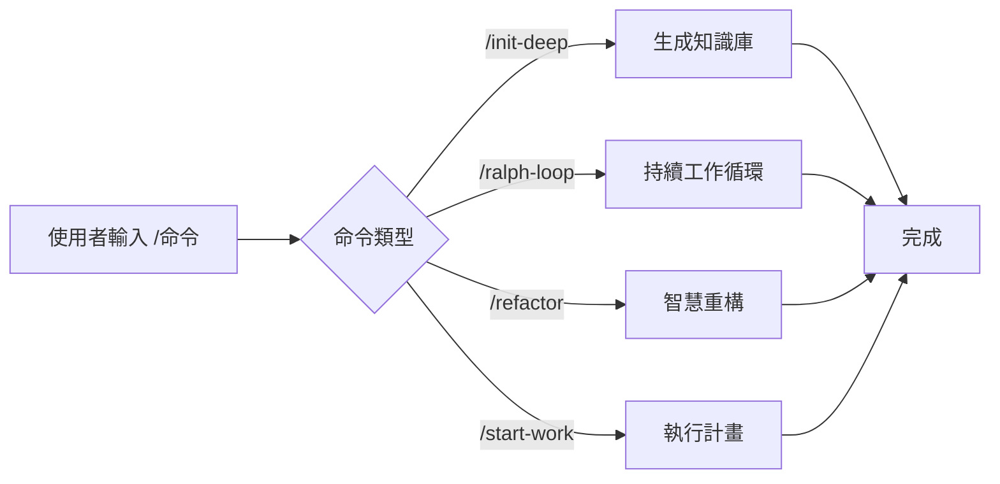

# 斜槓命令：預設工作流，一鍵觸發複雜任務

## 學完你能做什麼

- 使用 `/init-deep` 一鍵生成專案知識庫
- 用 `/ralph-loop` 讓代理持續工作直到任務完成
- 透過 `/refactor` 執行智慧重構，自動驗證每一步
- 用 `/start-work` 從 Prometheus 計畫開始系統化開發

## 你現在的困境

重複執行相同的複雜任務時，每次都要輸入長指令：

```
"請幫我分析這個專案的結構，找出所有關鍵模組，為每個目錄生成 AGENTS.md，然後並行探索程式碼庫模式..."
```

這種長指令既浪費時間，還容易遺漏步驟。

## 什麼時候用這一招

**斜槓命令**是一鍵觸發的預設工作流範本。這些命令涵蓋了常見的開發場景：

| 場景 | 使用命令 |
| --- | --- |
| 初始化專案知識庫 | `/init-deep` |
| 讓 AI 持續工作 | `/ralph-loop` |
| 智慧重構程式碼 | `/refactor` |
| 從計畫開始工作 | `/start-work` |

## 核心思路

**斜槓命令**（Slash Commands）是預先定義的工作流範本，透過 `/` 開頭的觸發詞快速執行複雜任務。

**工作原理**：



oh-my-opencode 內建了 6 個斜槓命令：

| 命令 | 功能 | 複雜度 |
| --- | --- | --- |
| `/init-deep` | 生成分層級 AGENTS.md 檔案 | 中 |
| `/ralph-loop` | 自我參考的開發循環 | 高 |
| `/ulw-loop` | Ultrawork 版本的 ralph-loop | 高 |
| `/cancel-ralph` | 取消活躍的 Ralph Loop | 低 |
| `/refactor` | 智慧重構，完整工具鏈 | 高 |
| `/start-work` | 從 Prometheus 計畫開始工作 | 中 |

::: info 自訂命令
除了內建命令，你可以在 `.opencode/command/` 或 `.claude/commands/` 目錄下建立自訂命令（Markdown 檔案）。
:::

## 🎒 開始前的準備

- ✅ 已完成 oh-my-opencode 安裝
- ✅ 已設定至少一個 AI Provider
- ✅ 了解基礎的代理使用（建議先學習《初識 Sisyphus：主編排器》）

## 跟我做

### 第 1 步：生成專案知識庫

**為什麼**
AI 代理需要了解專案結構和約定才能高效工作。`/init-deep` 命令會自動分析專案並生成分層的 AGENTS.md 檔案。

**在 OpenCode 中輸入**：

```
/init-deep
```

**你應該看到**：代理開始並行分析專案結構、探索程式碼模式、生成 AGENTS.md 檔案。

**進階用法**：

```bash
# 重新生成所有檔案（刪除舊的）
/init-deep --create-new

# 限制生成深度
/init-deep --max-depth=2
```

**輸出範例**：

```
=== init-deep Complete ===

Mode: update

Files:
  [OK] ./AGENTS.md (root, 120 lines)
  [OK] ./src/hooks/AGENTS.md (45 lines)
  [OK] ./src/agents/AGENTS.md (38 lines)

Dirs Analyzed: 12
AGENTS.md Created: 3
```

### 第 2 步：讓 AI 持續工作

**為什麼**
有些任務需要多次迭代才能完成（比如修復複雜 bug）。`/ralph-loop` 命令會讓代理持續工作直到任務完成，而不是中途停止。

**在 OpenCode 中輸入**：

```
/ralph-loop "修復登入頁面的認證問題，確保所有錯誤情況都被處理"
```

**你應該看到**：代理開始工作，完成後自動繼續，直到輸出完成標記。

**進階用法**：

```bash
# 自訂完成標記
/ralph-loop "編寫單元測試" --completion-promise="TESTS_DONE"

# 限制最大迭代次數
/ralph-loop "最佳化效能" --max-iterations=50
```

**Ultrawork 版本**（啟動所有專業代理）：

```bash
/ulw-loop "開發 REST API，包含認證、授權、限流功能"
```

**檢查點** ✅

- 代理是否在每次迭代後自動繼續？
- 完成後是否看到 "Ralph Loop Complete!" 提示？

### 第 3 步：取消循環

**為什麼**
如果任務方向不對或你想手動干預，需要取消循環。

**在 OpenCode 中輸入**：

```
/cancel-ralph
```

**你應該看到**：循環停止，狀態檔案被清理。

### 第 4 步：智慧重構

**為什麼**
重構程式碼時，盲目修改會引入 bug。`/refactor` 命令使用完整的工具鏈（LSP、AST-Grep、測試驗證）確保安全重構。

**在 OpenCode 中輸入**：

```bash
# 重新命名符號
/refactor "AuthService 類別重構為 UserService"

# 重構模組
/refactor src/auth --scope=module --strategy=safe

# 模式比對重構
/refactor "所有使用 deprecated API 的地方遷移到新 API"
```

**你應該看到**：代理執行 6 個階段的重構流程：

1. **意圖閘道** - 確認重構目標
2. **程式碼庫分析** - 並行探索依賴關係
3. **Codemap 建構** - 繪製影響範圍
4. **測試評估** - 檢查測試覆蓋率
5. **計畫生成** - 建立詳細重構計畫
6. **執行重構** - 逐步執行並驗證

**進階用法**：

```bash
# 激進策略（允許更大變更）
/refactor "架構重構" --strategy=aggressive

# 檔案範圍
/refactor "utils.ts 中的函式最佳化" --scope=file
```

::: warning 測試覆蓋要求
如果目標程式碼的測試覆蓋率低於 50%，`/refactor` 會拒絕執行激進策略。建議先新增測試。
:::

### 第 5 步：從計畫開始工作

**為什麼**
使用 Prometheus 規劃後，需要系統化執行計畫中的任務。`/start-work` 命令會自動載入計畫並使用 Atlas 代理執行。

**在 OpenCode 中輸入**：

```bash
# 自動選擇單個計畫
/start-work

# 選擇特定計畫
/start-work "auth-api-plan"
```

**你應該看到**：

- 如果只有一個計畫：自動選擇並開始執行
- 如果有多個計畫：列出所有計畫供選擇

**輸出範例**：

```
Available Work Plans

Current Time: 2026-01-26T10:30:00Z
Session ID: abc123

1. [auth-api-plan.md] - Modified: 2026-01-25 - Progress: 3/10 tasks
2. [migration-plan.md] - Modified: 2026-01-26 - Progress: 0/5 tasks

Which plan would you like to work on? (Enter number or plan name)
```

**檢查點** ✅

- 計畫是否正確載入？
- 任務是否按順序執行？
- 完成的任務是否被標記？

## 踩坑提醒

### 1. `/init-deep` 忽略已有檔案

**問題**：預設模式下，`/init-deep` 會保留現有的 AGENTS.md，只更新或建立缺失的部分。

**解決**：使用 `--create-new` 參數重新生成所有檔案。

### 2. `/ralph-loop` 無限循環

**問題**：如果代理無法完成任務，循環會持續到最大迭代次數（預設 100）。

**解決**：
- 設定合理的 `--max-iterations`（如 20-30）
- 使用 `/cancel-ralph` 手動取消
- 提供更明確的任務描述

### 3. `/refactor` 測試覆蓋率低

**問題**：目標程式碼沒有測試，重構會失敗。

**解決**：
```bash
# 讓代理先新增測試
"請為 AuthService 新增完整的單元測試，覆蓋所有邊界情況"

# 然後再重構
/refactor "AuthService 類別重構"
```

### 4. `/start-work` 找不到計畫

**問題**：Prometheus 生成的計畫沒有儲存在 `.sisyphus/plans/` 目錄。

**解決**：
- 檢查 Prometheus 輸出是否包含計畫檔案路徑
- 確認計畫檔案副檔名是 `.md`

### 5. 命令參數格式錯誤

**問題**：參數位置或格式不正確。

**解決**：
```bash
# ✅ 正確
/ralph-loop "任務描述" --completion-promise=DONE

# ❌ 錯誤
/ralph-loop --completion-promise=DONE "任務描述"
```

## 本課小結

| 命令 | 核心功能 | 使用頻率 |
| --- | --- | --- |
| `/init-deep` | 自動生成專案知識庫 | 初始設定 |
| `/ralph-loop` | 持續工作循環 | 高 |
| `/ulw-loop` | Ultrawork 版本的循環 | 中 |
| `/cancel-ralph` | 取消循環 | 低 |
| `/refactor` | 安全智慧重構 | 高 |
| `/start-work` | 執行 Prometheus 計畫 | 中 |

**最佳實踐**：
- 新專案首次使用 `/init-deep` 建立知識庫
- 複雜任務用 `/ralph-loop` 讓 AI 持續工作
- 重構程式碼時首選 `/refactor`，確保安全
- 配合 Prometheus 使用 `/start-work` 系統化開發

## 下一課預告

下一課我們學習 **[設定深度客製化](../advanced-configuration/)**。

你會學到：
- 如何覆寫代理的預設模型和提示詞
- 如何設定權限和安全限制
- 如何自訂 Categories 和 Skills
- 如何調整後台任務並行控制

---

## 附錄：原始碼參考

<details>
<summary><strong>點選展開檢視原始碼位置</strong></summary>

> 更新時間：2026-01-26

| 功能 | 檔案路徑 | 行號 |
| --- | --- | --- |
| 命令定義 | [`src/features/builtin-commands/commands.ts`](https://github.com/code-yeongyu/oh-my-opencode/blob/main/src/features/builtin-commands/commands.ts) | 8-73 |
| 命令載入器 | [`src/features/builtin-commands/index.ts`](https://github.com/code-yeongyu/oh-my-opencode/blob/main/src/features/builtin-commands/index.ts) | 75-89 |
| init-deep 範本 | [`src/features/builtin-commands/templates/init-deep.ts`](https://github.com/code-yeongyu/oh-my-opencode/blob/main/src/features/builtin-commands/templates/init-deep.ts) | 全文 |
| ralph-loop 範本 | [`src/features/builtin-commands/templates/ralph-loop.ts`](https://github.com/code-yeongyu/oh-my-opencode/blob/main/src/features/builtin-commands/templates/ralph-loop.ts) | 全文 |
| refactor 範本 | [`src/features/builtin-commands/templates/refactor.ts`](https://github.com/code-yeongyu/oh-my-opencode/blob/main/src/features/builtin-commands/templates/refactor.ts) | 全文 |
| start-work 範本 | [`src/features/builtin-commands/templates/start-work.ts`](https://github.com/code-yeongyu/oh-my-opencode/blob/main/src/features/builtin-commands/templates/start-work.ts) | 全文 |
| Ralph Loop Hook 實作 | [`src/hooks/ralph-loop/index.ts`](https://github.com/code-yeongyu/oh-my-opencode/blob/main/src/hooks/ralph-loop/index.ts) | 全文 |
| 命令型別定義 | [`src/features/builtin-commands/types.ts`](https://github.com/code-yeongyu/oh-my-opencode/blob/main/src/features/builtin-commands/types.ts) | 全文 |

**關鍵函式**：
- `loadBuiltinCommands()`：載入內建命令定義，支援停用特定命令
- `createRalphLoopHook()`：建立 Ralph Loop 生命週期鉤子
- `startLoop()`：啟動循環，設定狀態和參數
- `cancelLoop()`：取消活躍循環，清理狀態檔案

**關鍵常數**：
- `DEFAULT_MAX_ITERATIONS = 100`：預設最大迭代次數
- `DEFAULT_COMPLETION_PROMISE = "DONE"`：預設完成標記

**設定位置**：
- 停用命令：`oh-my-opencode.json` 中的 `disabled_commands` 欄位
- 循環設定：`oh-my-opencode.json` 中的 `ralph_loop` 物件

</details>
